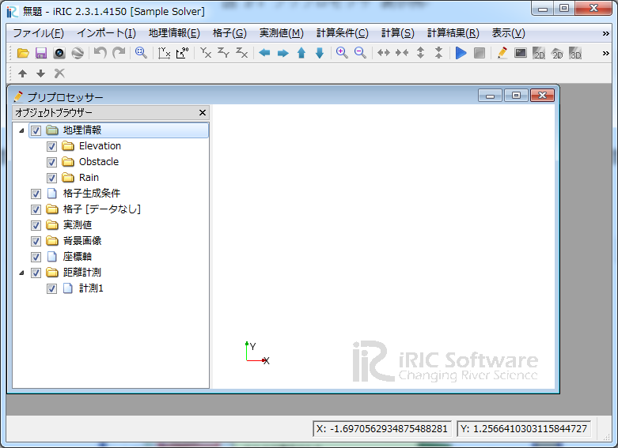

+-----------------------------------------------------------+----------------------------+----+
+-----------------------------------------------------------+----------------------------+----+
| |image0|                                                  | iRIC Software              |
|                                                           |                            |
|                                                           | *Changing River Science*   |
+-----------------------------------------------------------+----------------------------+----+
|                                                           | *Developer’s Manual*       |
+-----------------------------------------------------------+----------------------------+----+
+-----------------------------------------------------------+----------------------------+----+
|                                                           | Last Update: 2015.7.3      |
|                                                           |                            |
|                                                           | Release: 2011.12.24        |
+-----------------------------------------------------------+----------------------------+----+
| *Copyright 2011-2015 iRIC Project All Rights Reserved.*   |
+-----------------------------------------------------------+----------------------------+----+

目　次

`*1.* *このマニュアルについて* 1 <#このマニュアルについて>`__

`*2.* *ソルバーの開発手順* 2 <#ソルバーの開発手順>`__

`*2.1.* *概要* 2 <#概要>`__

`*2.2.* *フォルダの作成* 5 <#フォルダの作成>`__

`*2.3.* *ソルバー定義ファイルの作成* 5 <#ソルバー定義ファイルの作成>`__

`*2.3.1.* *基本情報の作成* 5 <#基本情報の作成>`__

`*2.3.2.* *計算条件の定義* 8 <#計算条件の定義>`__

`*2.3.3.* *格子属性の定義* 12 <#格子属性の定義>`__

`*2.3.4.* *境界条件の定義* 14 <#境界条件の定義>`__

`*2.4.* *ソルバーの作成* 17 <#ソルバーの作成>`__

`*2.4.1.* *骨組みの作成* 18 <#骨組みの作成>`__

`*2.4.2.* *計算データファイルを開く処理、閉じる処理の記述*
19 <#計算データファイルを開く処理閉じる処理の記述>`__

`*2.4.3.* *計算条件、計算格子、境界条件の読み込み処理の記述*
20 <#計算条件計算格子境界条件の読み込み処理の記述>`__

`*2.4.4.* *時刻、計算結果の出力処理の記述*
23 <#時刻計算結果の出力処理の記述>`__

`*2.5.* *ソルバー定義ファイルの辞書ファイルの作成*
25 <#ソルバー定義ファイルの辞書ファイルの作成>`__

`*2.6.* *説明ファイルの作成* 28 <#説明ファイルの作成>`__

`*2.7.* *ライセンス情報ファイルの作成*
29 <#ライセンス情報ファイルの作成>`__

`*3.* *計算結果分析ソルバーの開発手順*
30 <#計算結果分析ソルバーの開発手順>`__

`*3.1.* *概要* 30 <#概要-1>`__

`*4.* *格子生成プログラムの開発手順*
33 <#格子生成プログラムの開発手順>`__

`*4.1.* *概要* 33 <#概要-2>`__

`*4.2.* *フォルダの作成* 36 <#フォルダの作成-1>`__

`*4.3.* *格子生成プログラム定義ファイルの作成*
36 <#格子生成プログラム定義ファイルの作成>`__

`*4.3.1.* *基本情報の作成* 37 <#基本情報の作成-1>`__

`*4.3.2.* *格子生成条件の定義* 40 <#格子生成条件の定義>`__

`*4.3.3.* *エラーコードの定義* 44 <#エラーコードの定義>`__

`*4.4.* *格子生成プログラムの作成* 45 <#格子生成プログラムの作成>`__

`*4.4.1.* *骨組みの作成* 46 <#骨組みの作成-1>`__

`*4.4.2.* *格子生成データファイルを開く処理、閉じる処理の記述*
47 <#格子生成データファイルを開く処理閉じる処理の記述>`__

`*4.4.3.* *格子の出力処理の記述* 48 <#格子の出力処理の記述>`__

`*4.4.4.* *格子生成条件の読み込み処理の記述*
51 <#格子生成条件の読み込み処理の記述>`__

`*4.4.5.* *エラー処理の記述* 53 <#エラー処理の記述>`__

`*4.5.* *格子生成プログラム定義ファイルの辞書ファイルの作成*
54 <#格子生成プログラム定義ファイルの辞書ファイルの作成>`__

`*4.6.* *説明ファイルの作成* 57 <#説明ファイルの作成-1>`__

`*5.* *定義ファイル (XML) について* 58 <#定義ファイル-xml-について>`__

`*5.1.* *概要* 58 <#概要-3>`__

`*5.2.* *構造* 58 <#構造>`__

`*5.2.1.* *ソルバー定義ファイル* 58 <#ソルバー定義ファイル>`__

`*5.2.2.* *格子生成プログラム定義ファイル*
61 <#格子生成プログラム定義ファイル>`__

`*5.3.* *定義例* 62 <#定義例>`__

`*5.3.1.*
*計算条件・境界条件・格子生成条件の項目の定義と読み込み処理の例*
62 <#計算条件境界条件格子生成条件の項目の定義と読み込み処理の例>`__

`*5.3.2.* *計算条件・境界条件・格子生成条件の有効になる条件の定義例*
75 <#計算条件境界条件格子生成条件の有効になる条件の定義例>`__

`*5.3.3.*
*計算条件・境界条件・格子生成条件のダイアログのレイアウト定義例*
76 <#計算条件境界条件格子生成条件のダイアログのレイアウト定義例>`__

`*5.4.* *要素のリファレンス* 82 <#要素のリファレンス>`__

`*5.4.1.* *BoundaryCondition* 82 <#boundarycondition>`__

`*5.4.2.* *CalculationCondition* 82 <#calculationcondition>`__

`*5.4.3.* *Condition* 83 <#condition>`__

`*5.4.4.* *Definition
(計算条件・格子属性・境界条件・格子生成条件の定義)*
84 <#definition-計算条件格子属性境界条件格子生成条件の定義>`__

`*5.4.5.* *Definition (格子属性の定義)*
85 <#definition-格子属性の定義>`__

`*5.4.6.* *Dimension* 86 <#dimension>`__

`*5.4.7.* *Enumeration* 86 <#enumeration>`__

`*5.4.8.* *ErrorCodes* 87 <#errorcodes>`__

`*5.4.9.* *ErrorCode* 87 <#errorcode>`__

`*5.4.10.* *GroupBox* 87 <#groupbox>`__

`*5.4.11.* *GridGeneratingCondition* 87 <#gridgeneratingcondition>`__

`*5.4.12.* *GridGeneratorDefinition* 88 <#gridgeneratordefinition>`__

`*5.4.13.* *GridLayout* 89 <#gridlayout>`__

`*5.4.14.* *GridTypes* 89 <#gridtypes>`__

`*5.4.15.* *GridType* 89 <#gridtype>`__

`*5.4.16.* *HBoxLayout* 90 <#hboxlayout>`__

`*5.4.17.* *Item* 90 <#item>`__

`*5.4.18.* *Label* 90 <#label>`__

`*5.4.19.* *Param* 91 <#param>`__

`*5.4.20.* *SolverDefinition* 92 <#solverdefinition>`__

`*5.4.21.* *Tab* 93 <#tab>`__

`*5.4.22.* *Value* 93 <#value>`__

`*5.4.23.* *VBoxLayout* 94 <#vboxlayout>`__

`*5.5.* *ソルバーのバージョンアップ時の注意点*
95 <#ソルバーのバージョンアップ時の注意点>`__

`*5.6.* *XML の基礎* 97 <#xml-の基礎>`__

`*5.6.1.* *要素の書き方* 97 <#要素の書き方>`__

`*5.6.2.* *タブ、スペース、改行について*
98 <#タブスペース改行について>`__

`*5.6.3.* *コメントの書き方* 98 <#コメントの書き方>`__

`*6.* *iRIClibについて* 99 <#iriclibについて>`__

`*6.1.* *iRIClib とは* 99 <#iriclib-とは>`__

`*6.2.* *この章の読み方* 99 <#この章の読み方>`__

`*6.3.* *概要* 100 <#概要-4>`__

`*6.3.1.* *プログラムの処理とiRIClibの関数*
100 <#プログラムの処理とiriclibの関数>`__

`*6.3.2.* *CGNS ファイルを開く* 101 <#cgns-ファイルを開く>`__

`*6.3.3.* *内部変数の初期化* 101 <#内部変数の初期化>`__

`*6.3.4.* *オプションの設定* 101 <#オプションの設定>`__

`*6.3.5.* *計算条件 (もしくは格子生成条件) の読み込み*
102 <#計算条件-もしくは格子生成条件-の読み込み>`__

`*6.3.6.* *計算格子の読み込み* 104 <#計算格子の読み込み>`__

`*6.3.7.* *境界条件の読み込み* 107 <#境界条件の読み込み>`__

`*6.3.8.* *地形データの読み込み* 109 <#地形データの読み込み>`__

`*6.3.9.* *計算格子の出力* 112 <#計算格子の出力>`__

`*6.3.10.* *時刻 (もしくはループ回数) の出力*
115 <#時刻-もしくはループ回数-の出力>`__

`*6.3.11.* *計算格子の出力 (計算開始後の格子)*
116 <#計算格子の出力-計算開始後の格子>`__

`*6.3.12.* *計算結果の出力* 118 <#計算結果の出力>`__

`*6.3.13.* *既存の計算結果の読み込み* 121 <#既存の計算結果の読み込み>`__

`*6.3.14.* *エラーコードの出力* 123 <#エラーコードの出力>`__

`*6.3.15.* *CGNSファイルを閉じる* 123 <#cgnsファイルを閉じる>`__

`*6.4.* *リファレンス* 124 <#リファレンス>`__

`*6.4.1.* *サブルーチン一覧* 124 <#サブルーチン一覧>`__

`*6.4.2.* *cg\_open\_f* 131 <#cg_open_f>`__

`*6.4.3.* *cg\_iric\_init\_f* 131 <#cg_iric_init_f>`__

`*6.4.4.* *cg\_iric\_initread\_f* 132 <#cg_iric_initread_f>`__

`*6.4.5.* *cg\_initoption \_f* 132 <#cg_initoption-_f>`__

`*6.4.6.* *cg\_iric\_read\_integer\_f* 132 <#cg_iric_read_integer_f>`__

`*6.4.7.* *cg\_iric\_read\_real\_f* 133 <#cg_iric_read_real_f>`__

`*6.4.8.* *cg\_iric\_read\_realsingle\_f*
133 <#cg_iric_read_realsingle_f>`__

`*6.4.9.* *cg\_iric\_read\_string\_f* 133 <#cg_iric_read_string_f>`__

`*6.4.10.* *cg\_iric\_read\_functionalsize\_f*
134 <#cg_iric_read_functionalsize_f>`__

`*6.4.11.* *cg\_iric\_read\_functional\_f*
134 <#cg_iric_read_functional_f>`__

`*6.4.12.* *cg\_iric\_read\_functional\_realsingle\_f*
134 <#cg_iric_read_functional_realsingle_f>`__

`*6.4.13.* *cg\_iric\_read\_functionalwithname\_f*
135 <#cg_iric_read_functionalwithname_f>`__

`*6.4.14.* *cg\_iric\_gotogridcoord2d\_f*
135 <#cg_iric_gotogridcoord2d_f>`__

`*6.4.15.* *cg\_iric\_gotogridcoord3d\_f*
135 <#cg_iric_gotogridcoord3d_f>`__

`*6.4.16.* *cg\_iric\_getgridcoord2d\_f*
136 <#cg_iric_getgridcoord2d_f>`__

`*6.4.17.* *cg\_iric\_getgridcoord3d\_f*
136 <#cg_iric_getgridcoord3d_f>`__

`*6.4.18.* *cg\_iric\_read\_grid\_integer\_node\_f*
137 <#cg_iric_read_grid_integer_node_f>`__

`*6.4.19.* *cg\_iric\_read\_grid\_real\_node\_f*
137 <#cg_iric_read_grid_real_node_f>`__

`*6.4.20.* *cg\_iric\_read\_grid\_integer\_cell\_f*
137 <#cg_iric_read_grid_integer_cell_f>`__

`*6.4.21.* *cg\_iric\_read\_grid\_real\_cell\_f*
138 <#cg_iric_read_grid_real_cell_f>`__

`*6.4.22.* *cg\_iric\_read\_complex\_count\_f*
138 <#cg_iric_read_complex_count_f>`__

`*6.4.23.* *cg\_iric\_read\_complex\_integer\_f*
138 <#cg_iric_read_complex_integer_f>`__

`*6.4.24.* *cg\_iric\_read\_complex\_real\_f*
139 <#cg_iric_read_complex_real_f>`__

`*6.4.25.* *cg\_iric\_read\_complex\_realsingle\_f*
139 <#cg_iric_read_complex_realsingle_f>`__

`*6.4.26.* *cg\_iric\_read\_complex\_string\_f*
140 <#cg_iric_read_complex_string_f>`__

`*6.4.27.* *cg\_iric\_read\_complex\_functionalsize\_f*
140 <#cg_iric_read_complex_functionalsize_f>`__

`*6.4.28.* *cg\_iric\_read\_complex\_functional\_f*
141 <#cg_iric_read_complex_functional_f>`__

`*6.4.29.* *cg\_iric\_read\_complex\_functional\_realsingle\_f*
141 <#cg_iric_read_complex_functional_realsingle_f>`__

`*6.4.30.* *cg\_iric\_read\_complex\_functionalwithname\_f*
142 <#cg_iric_read_complex_functionalwithname_f>`__

`*6.4.31.* *cg\_iric\_read\_grid\_complex\_node\_f*
142 <#cg_iric_read_grid_complex_node_f>`__

`*6.4.32.* *cg\_iric\_read\_grid\_complex\_cell\_f*
143 <#cg_iric_read_grid_complex_cell_f>`__

`*6.4.33.* *cg\_iric\_read\_grid\_functionaltimesize\_f*
143 <#cg_iric_read_grid_functionaltimesize_f>`__

`*6.4.34.* *cg\_iric\_read\_grid\_functionaltime\_f*
143 <#cg_iric_read_grid_functionaltime_f>`__

`*6.4.35.* *cg\_iric\_read\_grid\_functionaldimensionsize\_f*
144 <#cg_iric_read_grid_functionaldimensionsize_f>`__

`*6.4.36.* *cg\_iric\_read\_grid\_functionaldimension\_integer\_f*
144 <#cg_iric_read_grid_functionaldimension_integer_f>`__

`*6.4.37.* *cg\_iric\_read\_grid\_functionaldimension\_real\_f*
145 <#cg_iric_read_grid_functionaldimension_real_f>`__

`*6.4.38.* *cg\_iric\_read\_grid\_functional\_integer\_node\_f*
145 <#cg_iric_read_grid_functional_integer_node_f>`__

`*6.4.39.* *cg\_iric\_read\_grid\_functional\_real\_node\_f*
146 <#cg_iric_read_grid_functional_real_node_f>`__

`*6.4.40.* *cg\_iric\_read\_grid\_functional\_integer\_cell\_f*
146 <#cg_iric_read_grid_functional_integer_cell_f>`__

`*6.4.41.* *cg\_iric\_read\_grid\_functional\_real\_cell\_f*
147 <#cg_iric_read_grid_functional_real_cell_f>`__

`*6.4.42.* *cg\_iric\_read\_bc\_count\_f*
147 <#cg_iric_read_bc_count_f>`__

`*6.4.43.* *cg\_iric\_read\_bc\_indicessize\_f*
148 <#cg_iric_read_bc_indicessize_f>`__

`*6.4.44.* *cg\_iric\_read\_bc\_indices\_f*
149 <#cg_iric_read_bc_indices_f>`__

`*6.4.45.* *cg\_iric\_read\_bc\_integer\_f*
150 <#cg_iric_read_bc_integer_f>`__

`*6.4.46.* *cg\_iric\_read\_bc\_real\_f*
150 <#cg_iric_read_bc_real_f>`__

`*6.4.47.* *cg\_iric\_read\_bc\_realsingle\_f*
151 <#cg_iric_read_bc_realsingle_f>`__

`*6.4.48.* *cg\_iric\_read\_bc\_string\_f*
151 <#cg_iric_read_bc_string_f>`__

`*6.4.49.* *cg\_iric\_read\_bc\_functionalsize\_f*
152 <#cg_iric_read_bc_functionalsize_f>`__

`*6.4.50.* *cg\_iric\_read\_bc\_functional\_f*
152 <#cg_iric_read_bc_functional_f>`__

`*6.4.51.* *cg\_iric\_read\_bc\_functional\_realsingle\_f*
153 <#cg_iric_read_bc_functional_realsingle_f>`__

`*6.4.52.* *cg\_iric\_read\_bc\_functionalwithname\_f*
153 <#cg_iric_read_bc_functionalwithname_f>`__

`*6.4.53.* *cg\_iric\_read\_geo\_count\_f*
154 <#cg_iric_read_geo_count_f>`__

`*6.4.54.* *cg\_iric\_read\_geo\_filename\_f*
154 <#cg_iric_read_geo_filename_f>`__

`*6.4.55.* *iric\_geo\_polygon\_open\_f*
155 <#iric_geo_polygon_open_f>`__

`*6.4.56.* *iric\_geo\_polygon\_read\_integervalue\_f*
155 <#iric_geo_polygon_read_integervalue_f>`__

`*6.4.57.* *iric\_geo\_polygon\_read\_realvalue\_f*
155 <#iric_geo_polygon_read_realvalue_f>`__

`*6.4.58.* *iric\_geo\_polygon\_read\_pointcount\_f*
156 <#iric_geo_polygon_read_pointcount_f>`__

`*6.4.59.* *iric\_geo\_polygon\_read\_points\_f*
156 <#iric_geo_polygon_read_points_f>`__

`*6.4.60.* *iric\_geo\_polygon\_read\_holecount\_f*
156 <#iric_geo_polygon_read_holecount_f>`__

`*6.4.61.* *iric\_geo\_polygon\_read\_holepointcount\_f*
157 <#iric_geo_polygon_read_holepointcount_f>`__

`*6.4.62.* *iric\_geo\_polygon\_read\_holepoints\_f*
157 <#iric_geo_polygon_read_holepoints_f>`__

`*6.4.63.* *iric\_geo\_polygon\_close\_f*
158 <#iric_geo_polygon_close_f>`__

`*6.4.64.* *iric\_geo\_riversurvey\_open\_f*
158 <#iric_geo_riversurvey_open_f>`__

`*6.4.65.* *iric\_geo\_riversurvey\_read\_count\_f*
158 <#iric_geo_riversurvey_read_count_f>`__

`*6.4.66.* *iric\_geo\_riversurvey\_read\_position\_f*
159 <#iric_geo_riversurvey_read_position_f>`__

`*6.4.67.* *iric\_geo\_riversurvey\_read\_direction\_f*
159 <#iric_geo_riversurvey_read_direction_f>`__

`*6.4.68.* *iric\_geo\_riversurvey\_read\_name\_f*
160 <#iric_geo_riversurvey_read_name_f>`__

`*6.4.69.* *iric\_geo\_riversurvey\_read\_realname\_f*
160 <#iric_geo_riversurvey_read_realname_f>`__

`*6.4.70.* *iric\_geo\_riversurvey\_read\_leftshift\_f*
160 <#iric_geo_riversurvey_read_leftshift_f>`__

`*6.4.71.* *iric\_geo\_riversurvey\_read\_altitudecount\_f*
161 <#iric_geo_riversurvey_read_altitudecount_f>`__

`*6.4.72.* *iric\_geo\_riversurvey\_read\_altitudes\_f*
161 <#iric_geo_riversurvey_read_altitudes_f>`__

`*6.4.73.* *iric\_geo\_riversurvey\_read\_fixedpointl\_f*
162 <#iric_geo_riversurvey_read_fixedpointl_f>`__

`*6.4.74.* *iric\_geo\_riversurvey\_read\_fixedpointr\_f*
162 <#iric_geo_riversurvey_read_fixedpointr_f>`__

`*6.4.75.* *iric\_geo\_riversurvey\_read\_watersurfaceelevation\_f*
163 <#iric_geo_riversurvey_read_watersurfaceelevation_f>`__

`*6.4.76.* *iric\_geo\_riversurvey\_close\_f*
163 <#iric_geo_riversurvey_close_f>`__

`*6.4.77.* *cg\_iric\_writegridcoord1d\_f*
163 <#cg_iric_writegridcoord1d_f>`__

`*6.4.78.* *cg\_iric\_writegridcoord2d\_f*
164 <#cg_iric_writegridcoord2d_f>`__

`*6.4.79.* *cg\_iric\_writegridcoord3d\_f*
164 <#cg_iric_writegridcoord3d_f>`__

`*6.4.80.* *cg\_iric\_write\_grid\_integer\_node\_f*
165 <#cg_iric_write_grid_integer_node_f>`__

`*6.4.81.* *cg\_iric\_write\_grid\_real\_node\_f*
165 <#cg_iric_write_grid_real_node_f>`__

`*6.4.82.* *cg\_iric\_write\_grid\_integer\_cell\_f*
165 <#cg_iric_write_grid_integer_cell_f>`__

`*6.4.83.* *cg\_iric\_write\_grid\_real\_cell\_f*
166 <#cg_iric_write_grid_real_cell_f>`__

`*6.4.84.* *cg\_iric\_write\_sol\_time\_f*
166 <#cg_iric_write_sol_time_f>`__

`*6.4.85.* *cg\_iric\_write\_sol\_iteration\_f*
166 <#cg_iric_write_sol_iteration_f>`__

`*6.4.86.* *cg\_iric\_write\_sol\_gridcoord2d\_f*
167 <#cg_iric_write_sol_gridcoord2d_f>`__

`*6.4.87.* *cg\_iric\_write\_sol\_gridcoord3d\_f*
167 <#cg_iric_write_sol_gridcoord3d_f>`__

`*6.4.88.* *cg\_iric\_write\_sol\_baseiterative\_integer\_f*
168 <#cg_iric_write_sol_baseiterative_integer_f>`__

`*6.4.89.* *cg\_iric\_write\_sol\_baseiterative\_real\_f*
168 <#cg_iric_write_sol_baseiterative_real_f>`__

`*6.4.90.* *cg\_iric\_write\_sol\_integer\_f*
168 <#cg_iric_write_sol_integer_f>`__

`*6.4.91.* *cg\_iric\_write\_sol\_real\_f*
169 <#cg_iric_write_sol_real_f>`__

`*6.4.92.* *cg\_iric\_write\_sol\_particle\_pos2d\_f*
169 <#cg_iric_write_sol_particle_pos2d_f>`__

`*6.4.93.* *cg\_iric\_write\_sol\_particle\_pos3d\_f*
170 <#cg_iric_write_sol_particle_pos3d_f>`__

`*6.4.94.* *iric\_check\_cancel\_f* 170 <#iric_check_cancel_f>`__

`*6.4.95.* *iric\_check\_lock\_f* 170 <#iric_check_lock_f>`__

`*6.4.96.* *iric\_write\_sol\_start\_f* 171 <#iric_write_sol_start_f>`__

`*6.4.97.* *iric\_write\_sol\_end\_f* 171 <#iric_write_sol_end_f>`__

`*6.4.98.* *cg\_iric\_flush\_f* 171 <#cg_iric_flush_f>`__

`*6.4.99.* *cg\_iric\_read\_sol\_count\_f*
172 <#cg_iric_read_sol_count_f>`__

`*6.4.100.* *cg\_iric\_read\_sol\_time\_f*
172 <#cg_iric_read_sol_time_f>`__

`*6.4.101.* *cg\_iric\_read\_sol\_iteration\_f*
172 <#cg_iric_read_sol_iteration_f>`__

`*6.4.102.* *cg\_iric\_read\_sol\_baseiterative\_integer\_f*
173 <#cg_iric_read_sol_baseiterative_integer_f>`__

`*6.4.103.* *cg\_iric\_read\_sol\_baseiterative\_real\_f*
173 <#cg_iric_read_sol_baseiterative_real_f>`__

`*6.4.104.* *cg\_iric\_read\_sol\_gridcoord2d\_f*
174 <#cg_iric_read_sol_gridcoord2d_f>`__

`*6.4.105.* *cg\_iric\_read\_sol\_gridcoord3d\_f*
174 <#cg_iric_read_sol_gridcoord3d_f>`__

`*6.4.106.* *cg\_iric\_read\_sol\_integer\_f*
175 <#cg_iric_read_sol_integer_f>`__

`*6.4.107.* *cg\_iric\_read\_sol\_real\_f*
175 <#cg_iric_read_sol_real_f>`__

`*6.4.108.* *cg\_iric\_write\_errorcode\_f*
175 <#cg_iric_write_errorcode_f>`__

`*6.4.109.* *cg\_close\_f* 176 <#cg_close_f>`__

`*7.* *その他の情報* 177 <#その他の情報>`__

`*7.1.* *Fortran プログラムでの引数の読み込み処理*
177 <#fortran-プログラムでの引数の読み込み処理>`__

`*7.1.1.* *Intel Fortran Compiler* 177 <#intel-fortran-compiler>`__

`*7.1.2.* *GNU Fortran, G95* 177 <#gnu-fortran-g95>`__

`*7.2.* *Fortran 言語で iriclib, cgnslib とリンクしてビルドする方法*
178 <#fortran-言語で-iriclib-cgnslib-とリンクしてビルドする方法>`__

`*7.2.1.* *Intel Fortran Compiler (Windows)*
178 <#intel-fortran-compiler-windows>`__

`*7.2.2.* *GNU Fortran* 178 <#gnu-fortran>`__

`*7.3.* *特別な格子属性、計算結果の名前について*
179 <#特別な格子属性計算結果の名前について>`__

`*7.3.1.* *格子属性* 179 <#格子属性>`__

`*7.3.2.* *計算結果* 180 <#計算結果>`__

`*7.4.* *CGNS ファイル、 CGNSライブラリに関する情報*
181 <#cgns-ファイル-cgnsライブラリに関する情報>`__

`*7.4.1.* *CGNS ファイルフォーマットの概要*
181 <#cgns-ファイルフォーマットの概要>`__

`*7.4.2.* *CGNS ファイルの閲覧方法* 181 <#cgns-ファイルの閲覧方法>`__

`*7.4.3.* *リンク集* 185 <#リンク集>`__

このマニュアルについて
======================

このマニュアルでは、以下のユーザに必要な情報を解説します。

-  iRIC 上で動作するソルバーの開発者

-  iRIC 上で動作する格子生成プログラムの開発者

ソルバー開発者の方は、まずは 2章
を読んで、ソルバー開発の流れについて理解してください。その後、必要に応じて
5章、6章、7章を参照してください。

格子生成プログラム開発者の方は、まずは4章を読んで格子生成プログラム開発の流れについて理解してください。その後、必要に応じて
5章、6章、7章を参照してください。

ソルバーの開発手順
==================

概要
----

ソルバーは、格子、計算条件などに基づいて河川シミュレーションを実行し、計算結果を出力するプログラムです。

iRIC 上で動作するソルバーを開発するには、表 2?1
に示すようなファイルを作成、配置する必要があります。

表 2?1 に示した項目のうち、 “iRIC 2.0” フォルダと “solvers”
フォルダは、iRIC
をインストールすれば既に作成されています。ソルバー開発者は、 “solvers”
フォルダの下に自分が開発するソルバー専用のフォルダを作成し、関連するファイルをその下に配置します。

表 2?1 ソルバー関連ファイル、フォルダ一覧

+-------------------------------+------------------------------------------------------------------------+----------+
| ファイル名、フォルダ名        | 説明                                                                   | 参照     |
+===============================+========================================================================+==========+
| iRIC 2.0                      | iRIC 2.0のインストールフォルダ (例: C:\\Program Files\\iRIC 2.0)       |          |
+-------------------------------+------------------------------------------------------------------------+----------+
| solvers                       | ソルバーを格納するフォルダ                                             |          |
+-------------------------------+------------------------------------------------------------------------+----------+
| (ソルバーフォルダ)            | ソルバーごとにフォルダを作成する。フォルダ名は任意。                   | 2.2 節   |
+-------------------------------+------------------------------------------------------------------------+----------+
| definition.xml                | ソルバー定義ファイル。英語で記述する。                                 | 2.3 節   |
+-------------------------------+------------------------------------------------------------------------+----------+
| solver.exe (例)               | ソルバーの実行モジュール。ファイル名はソルバー開発者が任意に選べる。   | 2.4 節   |
+-------------------------------+------------------------------------------------------------------------+----------+
| translation\_ja\_JP.ts など   | ソルバー定義ファイルの辞書ファイル。                                   | 2.5 節   |
+-------------------------------+------------------------------------------------------------------------+----------+
| README                        | ソルバーの説明ファイル                                                 | 2.6 節   |
+-------------------------------+------------------------------------------------------------------------+----------+
| LICENSE                       | ソルバーのライセンス情報ファイル                                       | 2.7 節   |
+-------------------------------+------------------------------------------------------------------------+----------+

　各ファイルの概要は以下の通りです。

**definition.xml**

　ソルバーに関する以下の情報を定義するファイルです。

基本情報

計算条件

格子属性

iRIC
はソルバー定義ファイルを読み込むことで、そのソルバーに必要な計算条件、格子を作成するためのインターフェースを提供し、そのソルバー用の計算データファイルを生成します。ソルバー定義ファイルは、すべて英語で記述します。

**ソルバー**

　河川シミュレーションを実行するプログラムです。iRICで作成した計算条件と格子を読みこんで計算を行い、結果を出力します。

計算条件、格子、結果の入出力には、iRIC
が生成する計算データファイルを使用します。ただし、計算データファイルで入出力を行えないデータについては、任意の外部ファイルを入出力に使うこともできます。

FORTRAN, C言語、C++言語のいずれかの言語で開発します。この章では、
FORTRAN で開発する例を説明します。

**translation\_ja\_JP.ts など**

ソルバー定義ファイルで用いられている文字列のうち、ダイアログ上などに表示される文字列を翻訳して表示するための辞書ファイルです。日本語
(translation\_ja\_JP.ts)、韓国語 (translation\_ka\_KR.ts)
など言語ごとに別ファイルとして作成します。

**README**

ソルバーに関する説明を記述するテキストファイルです。iRICで新しいプロジェクトを開始する時にソルバーを選択する画面で、説明欄に表示されます。

**LICENSE**

ソルバーのライセンスについて記述するテキストファイルです。iRICで新しいプロジェクトを開始する時にソルバーを選択する画面で、ライセンス欄に表示されます。

iRIC、ソルバー、関連ファイルの関係を 図 2?1 に示します。

図 2?1 iRIC、ソルバー、関連ファイルの関係図

この章では、この節で説明した各ファイルを作成する手順を順番に説明します。

フォルダの作成
--------------

iRIC のインストールフォルダ (デフォルトでは “C:\\Program Files\\iRIC
2.0”) の下にある “solvers”
フォルダの下に、開発するソルバーのための専用のフォルダを作成します。今回は、“example”
というフォルダを作成します。

ソルバー定義ファイルの作成
--------------------------

ソルバー定義ファイルを作成します。

ソルバー定義ファイルは、ソルバーに関する 表 2?2に示す情報を定義します。

表 2?2 ソルバー定義ファイルで定義する情報

+------------+----------------------------------------------------+--------+
| 項目       | 説明                                               | 必須   |
+============+====================================================+========+
| 基本情報   | ソルバーの名前、開発者、リリース日など             | ○      |
+------------+----------------------------------------------------+--------+
| 計算条件   | ソルバーの実行に必要な計算条件                     | ○      |
+------------+----------------------------------------------------+--------+
| 格子属性   | 計算格子の格子点もしくは格子セルに与える属性       | ○      |
+------------+----------------------------------------------------+--------+
| 境界条件   | 計算格子の格子点もしくは格子セルに与える境界条件   |        |
+------------+----------------------------------------------------+--------+

ソルバー定義ファイルは、マークアップ言語の一種であるXML言語で記述します。XML言語の基礎については
5.5 を参照してください。

この節では、ソルバー定義ファイルを、表 2?2に示した順で作成していきます。

基本情報の作成
~~~~~~~~~~~~~~

ソルバーの基本情報を作成します。表 2?3 に示すようなファイルを作り、2.2
で作成した “example” フォルダの下に “definition.xml”
の名前で保存します。

表 2?3 基本情報を記述したソルバー定義ファイルの例

+------------------------------------------+
| <?xml version="1.0" encoding="UTF-8"?>   |
|                                          |
| <SolverDefinition                        |
|                                          |
| name="samplesolver"                      |
|                                          |
| caption="Sample Solver 1.0"              |
|                                          |
| version="1.0"                            |
|                                          |
| copyright="Example Company"              |
|                                          |
| release="2012.04.01"                     |
|                                          |
| homepage="http://example.com/"           |
|                                          |
| executable="solver.exe"                  |
|                                          |
| iterationtype="time"                     |
|                                          |
| gridtype="structured2d"                  |
|                                          |
| >                                        |
|                                          |
| <CalculationCondition>                   |
|                                          |
| </CalculationCondition>                  |
|                                          |
| <GridRelatedCondition>                   |
|                                          |
| </GridRelatedCondition>                  |
|                                          |
| </SolverDefinition>                      |
+------------------------------------------+

この時点では、ソルバー定義ファイルの構造は 表 2?4
に示すようになっています。

表 2?4 ソルバー定義ファイルの構造

正しくソルバー定義ファイルが作成できているか確認します。

iRIC を起動します。図 2?2
に示すダイアログが表示されますので、「新しいプロジェクト」ボタンを押します。図
2?3 に示すダイアログが表示されますので、ソルバーのリストに “Sample
Solver”
があるか確認します。あったらそれをクリックし、右側に先ほど指定した属性が正しく表示されるか確認します。

なお、このダイアログでは、以下の属性については表示されません。

name

executable

iterationtype

gridtype

図 2?2 iRIC のスタートダイアログ

図 2?3 ソルバー選択ダイアログ

なお、ここで記述する name 属性と version
属性については、ソルバーのバージョンアップの際に気をつける必要があります。バージョンアップの際の注意点については5.5節を参照してください。

計算条件の定義
~~~~~~~~~~~~~~

計算条件を定義します。計算条件は、ソルバー定義ファイルの
CalculationCondition 要素で定義します。2.3.1
で作成したソルバー定義ファイルに追記し、表 2?5
に示すようなファイルにし、保存します。追記した部分を太字で示しました。

表 2?5 計算条件を追記したソルバー定義ファイルの例

+--------------------------------------------------------------------------+
| <?xml version="1.0" encoding="UTF-8"?>                                   |
|                                                                          |
| <SolverDefinition                                                        |
|                                                                          |
| name="samplesolver"                                                      |
|                                                                          |
| caption="Sample Solver"                                                  |
|                                                                          |
| version="1.0"                                                            |
|                                                                          |
| copyright="Example Company"                                              |
|                                                                          |
| release="2012.04.01"                                                     |
|                                                                          |
| homepage="http://example.com/"                                           |
|                                                                          |
| executable="solver.exe"                                                  |
|                                                                          |
| iterationtype="time"                                                     |
|                                                                          |
| gridtype="structured2d"                                                  |
|                                                                          |
| >                                                                        |
|                                                                          |
| <CalculationCondition>                                                   |
|                                                                          |
| **<Tab name="basic" caption="Basic Settings">**                          |
|                                                                          |
| **<Item name="maxIteretions" caption="Maximum number of Iterations">**   |
|                                                                          |
| **<Definition valueType="integer" default="10">**                        |
|                                                                          |
| **</Definition>**                                                        |
|                                                                          |
| **</Item>**                                                              |
|                                                                          |
| **<Item name=”timeStep” caption=”Time Step”>**                           |
|                                                                          |
| **<Definition valueType=”real” default=”0.1”>**                          |
|                                                                          |
| **</Definition>**                                                        |
|                                                                          |
| **</Item>**                                                              |
|                                                                          |
| **</Tab>**                                                               |
|                                                                          |
| </CalculationCondition>                                                  |
|                                                                          |
| <GridRelatedCondition>                                                   |
|                                                                          |
| </GridRelatedCondition>                                                  |
|                                                                          |
| </SolverDefinition>                                                      |
+--------------------------------------------------------------------------+

この時点では、ソルバー定義ファイルの構造は 表
2?6に示すようになっています。

表 2?6 ソルバー定義ファイルの構造

正しくソルバー定義ファイルが作成できているか確認します。

iRIC を起動します。図 2?2
に示すダイアログが表示されますので、「新しいプロジェクト」ボタンを押して、ソルバーのリストから
“Sample Solver” をクリックし、”OK” ボタンを押します。図 2?4
に示すダイアログが表示されますが、“OK” ボタンを押して進みます。

|image1|

図 2?4 警告ダイアログ 表示例

プリプロセッサが表示されますので、以下の操作を行います。

**メニュー:** 計算条件(C) 設定(S)

すると、 図 2?5 に示すダイアログが表示されます。表 2?5
で追記した内容に従って表示されているのが分かります。

図 2?5 計算条件設定ダイアログ 表示例

グループを増やして、さらに計算条件を追加します。Basic Settings の
Tab要素 のすぐ下に、 “Water Surface Elevation”
というグループを追加して保存します。追記したソルバー定義ファイルの抜粋を、表
2?7 に示します。追記した部分を太字で示しました。

表 2?7 計算条件を追記したソルバー定義ファイルの例 (抜粋)

+-----------------------------------------------------------------------+
| (前略)                                                                |
|                                                                       |
| </Tab>                                                                |
|                                                                       |
| **<Tab name=”surfaceElevation” caption=”Water Surface Elevation”>**   |
|                                                                       |
| **<Item name=”surfaceType” caption=”Type”>**                          |
|                                                                       |
| **<Definition valueType=”integer” default=”0”>**                      |
|                                                                       |
| **<Enumeration caption=”Constant” value=”0” />**                      |
|                                                                       |
| **<Enumeration caption=”Time Dependent” value=”1” />**                |
|                                                                       |
| **</Definition>**                                                     |
|                                                                       |
| **</Item>**                                                           |
|                                                                       |
| **<Item name=”constantSurface” caption=”Constant Value”>**            |
|                                                                       |
| **<Definition valueType=”real” default=”1”>**                         |
|                                                                       |
| **<Condition type="isEqual" target="surfaceType" value="0"/>**        |
|                                                                       |
| **</Definition>**                                                     |
|                                                                       |
| **</Item>**                                                           |
|                                                                       |
| **<Item name=”variableSurface” caption=”Time Dependent Value”>**      |
|                                                                       |
| **<Definition valueType=”functional”>**                               |
|                                                                       |
| **<Parameter valueType="real" caption="Time(s)"/>**                   |
|                                                                       |
| **<Value valueType="real" caption="Elevation(m) "/>**                 |
|                                                                       |
| **<Condition type="isEqual" target="surfaceType" value="1"/>**        |
|                                                                       |
| **</Definition>**                                                     |
|                                                                       |
| **</Item>**                                                           |
|                                                                       |
| **</Tab>**                                                            |
|                                                                       |
| </CalculationCondition>                                               |
|                                                                       |
| <GridRelatedCondition>                                                |
|                                                                       |
| </GridRelatedCondition>                                               |
|                                                                       |
| </SolverDefinition>                                                   |
+-----------------------------------------------------------------------+

この時点では、ソルバー定義ファイルの構造は 表 2?8
に示すようになっています。

表 2?8 ソルバー定義ファイルの構造

正しくソルバー定義ファイルが作成できているか確認します。先ほどと同じ手順でダイアログを表示します。

“Water Surface Elevation”
というグループがリストに表示されているのが分かります。また、“Constant
Value” は、“Type” で “Constant” を選択している時のみ、“Time Dependent
Value” は、“Type” で “Time Dependent” を選択している時のみ有効です。

ダイアログの表示例を 図 2?6 に示します。

|image2|

図 2?6 計算条件設定ダイアログ 表示例

計算条件の定義についてまとめると、以下の通りです。

計算条件のグループは Tab要素で、計算条件は Item要素で指定します。

Definition 要素以下の構造は、計算条件の種類 (例:
整数、実数、整数からの選択、関数型)
によって異なります。計算条件の種類ごとの記述方法とダイアログ上での表示については
5.3.1 を参照して下さい。

計算条件には、Condition要素で依存関係を定義できます。Condition要素では、その計算条件が有効になる条件を指定します。Condition要素の定義方法の例は、
5.3.2 を参照して下さい。

この例では、計算条件のダイアログを単純なリスト形式で作成しましたが、グループボックスを使うなどしてダイアログのレイアウトをカスタマイズすることができます。ダイアログのレイアウトのカスタマイズ方法については
5.3.3 を参照して下さい。

格子属性の定義
~~~~~~~~~~~~~~

格子属性を定義します。格子属性は、ソルバー定義ファイルの
GridRelatedCondition
要素で定義します。2.3.2で作成したソルバー定義ファイルに追記し、GridRelatedCondition
要素に表
2?9に示すように追記し、保存します。追記した部分を太字で示しました。

表 2?9 格子属性を追記したソルバー定義ファイルの例 (抜粋)

+---------------------------------------------------------------------+
| (前略)                                                              |
|                                                                     |
| </CalculationCondition>                                             |
|                                                                     |
| <GridRelatedCondition>                                              |
|                                                                     |
| **<Item name="Elevation" caption="Elevation">**                     |
|                                                                     |
| **<Definition position="node" valueType="real" default="max" />**   |
|                                                                     |
| **</Item>**                                                         |
|                                                                     |
| **<Item name="Obstacle" caption="Obstacle">**                       |
|                                                                     |
| **<Definition position="cell" valueType="integer" default="0">**    |
|                                                                     |
| **<Enumeration value="0" caption=" cell" />**                       |
|                                                                     |
| **<Enumeration value="1" caption="Obstacle" />**                    |
|                                                                     |
| **</Definition>**                                                   |
|                                                                     |
| **</Item>**                                                         |
|                                                                     |
| **<Item name="Rain" caption="Rain">**                               |
|                                                                     |
| **<Definition position="cell" valueType="real" default="0">**       |
|                                                                     |
| **<Dimension name=”Time” caption=”Time” valueType=”real” />**       |
|                                                                     |
| **</Definition>**                                                   |
|                                                                     |
| **</Item>**                                                         |
|                                                                     |
| </GridRelatedCondition>                                             |
|                                                                     |
| </SolverDefinition>                                                 |
+---------------------------------------------------------------------+

正しくソルバー定義ファイルが作成できているか確認します。

iRIC を起動して、ソルバー “Sample Solver”
の新しいプロジェクトを開始します。すると、図
2?7に示すような画面が表示されます。さらに、格子を作成したりインポートしたりすると、図
2?8のようになります。なお、格子の作成やインポートの方法が分からない場合、ユーザマニュアルを参照して下さい。

|image3|

図 2?7 プリプロセッサ 表示例

|image4|

図 2?8 プリプロセッサ 表示例 (格子作成後)

以下の手順で格子点の属性Elevation を編集すると、 図 2?9
に示すダイアログが表示され、実数の値を入力できることが確認できます。

オブジェクトブラウザで、 “格子” “格子点の属性” “Elevation”
を選択します。

描画領域で、マウスクリックで格子点を選択します。

右クリックメニューを表示し、“編集” を選択します。

|image5|

図 2?9 格子点の属性 “Elevation” の編集ダイアログ

同様に、格子セルの属性 Obstacle を編集すると、 図 2?10
に示すダイアログが表示され、表 2?9
で指定した選択肢から値を選択できることが確認できます。

|image6|

図 2?10 格子セルの属性 “Obstacle” の編集ダイアログ

格子属性の定義についてまとめると、以下の通りです。

格子属性は、Item要素で指定します。

Item 要素以下の構造は計算条件の Item
と基本的には同じですが、以下の違いがあります。

-  属性を格子点で定義するか、セルで定義するかを position
       属性で指定します。

-  文字列、関数型、ファイル名、フォルダ名を指定することはできません。

-  依存関係を指定することはできません。

-  Dimension要素を用いて、次元を定義することができます。

格子属性については、iRIC
では特別な名前が定義されており、特定の目的で使用される属性ではその名前を使用する必要があります。特別な格子属性の名前については
7.3.1 を参照してください。

境界条件の定義
~~~~~~~~~~~~~~

境界条件を定義します。境界条件は、ソルバー定義ファイルの
BoundaryCondition
要素で定義します。なお、境界条件の定義は必須ではありません。

2.3.3で作成したソルバー定義ファイルに追記し、BoundaryCondition 要素を表
2?10に示すように追記し、保存します。追記した部分を太字で示しました。

表 2?10 境界条件を追記したソルバー定義ファイルの例 (抜粋)

+--------------------------------------------------------------------------+
| (前略)                                                                   |
|                                                                          |
| </GridRelatedCondition>                                                  |
|                                                                          |
| **<BoundaryCondition name="inflow" caption="Inflow" position="node">**   |
|                                                                          |
| **<Item name="Type" caption="Type">**                                    |
|                                                                          |
| **<Definition valueType="integer" default="0" >**                        |
|                                                                          |
| **<Enumeration value="0" caption="Constant" />**                         |
|                                                                          |
| **<Enumeration value="1" caption="Variable" />**                         |
|                                                                          |
| **</Definition>**                                                        |
|                                                                          |
| **</Item>**                                                              |
|                                                                          |
| **<Item name="ConstantDischarge" caption="Constant Discharge">**         |
|                                                                          |
| **<Definition valueType="real" default="0" >**                           |
|                                                                          |
| **<Condition type="isEqual" target="Type" value="0"/>**                  |
|                                                                          |
| **</Definition>**                                                        |
|                                                                          |
| **</Item>**                                                              |
|                                                                          |
| **<Item name="FunctionalDischarge" caption="Variable Discharge">**       |
|                                                                          |
| **<Definition conditionType="functional">**                              |
|                                                                          |
| **<Parameter valueType="real" caption="Time"/>**                         |
|                                                                          |
| **<Value valueType="real" caption="Discharge(m3/s)"/>**                  |
|                                                                          |
| **<Condition type="isEqual" target="Type" value="1"/>**                  |
|                                                                          |
| **</Definition>**                                                        |
|                                                                          |
| **</Item>**                                                              |
|                                                                          |
| **</BoundaryCondition>**                                                 |
|                                                                          |
| </SolverDefinition>                                                      |
+--------------------------------------------------------------------------+

正しくソルバー定義ファイルが作成できているか確認します。

iRIC を起動して、ソルバー “Sample Solver”
の新しいプロジェクトを開始します。格子を作成したりインポートしたりすると、図
2?8のようになります。なお、格子の作成やインポートの方法が分からない場合、ユーザマニュアルを参照して下さい。

図 2?11 プリプロセッサ 表示例 (格子作成後)

右クリックメニューから「新しい Inflow の追加」を選択すると、図
2?12に示すダイアログが表示され、境界条件を定義することが出来ます。

|image7|

図 2?12 境界条件の編集ダイアログ

境界条件を定義した後、格子点を選択して右クリックメニューから「追加」を選択することで流入口にする格子点を設定できます。設定後の画面表示例を
図 2?13 に示します。

図 2?13 境界条件を設定した格子の表示例

境界条件の定義についてまとめると、以下の通りです。

境界条件は、BoundaryCondition要素で指定します。

-  Item 要素以下の構造は計算条件の Item
       と基本的には同じです。計算条件と同様、依存性なども定義できます。

ソルバーの作成
--------------

ソルバーを作成します。この例では、ソルバーは FORTRAN 言語で開発します。

iRIC と連携するソルバーを開発するには、ソルバー定義ファイルに従って iRIC
が生成する計算データファイルを、計算条件、格子、結果の入出力に利用する必要があります。

iRIC が生成する計算データファイルは、CGNS ファイルという形式です。CGNS
ファイルの入出力には、iRIClib というライブラリを使用します。

この節では、2.3 で作成したソルバー定義ファイルに従ってiRIC
が生成する計算データファイルを読みこむソルバーを開発する流れを説明します。

このソルバーで行われる入出力処理を 表 2?11 に示します。

表 2?11 ソルバーの入出力の処理の流れ

+------------------------------------+------------+
| **処理の内容**                     | **必須**   |
+====================================+============+
| 計算データファイルを開く           | ○          |
+------------------------------------+------------+
| 内部変数の初期化                   | ○          |
+------------------------------------+------------+
| 計算条件の読み込み                 | ○          |
+------------------------------------+------------+
| 計算格子の読み込み                 | ○          |
+------------------------------------+------------+
| 時刻 (もしくはループ回数) の出力   | ○          |
+------------------------------------+------------+
| 計算結果の出力                     | ○          |
+------------------------------------+------------+
| 計算データファイルを閉じる         | ○          |
+------------------------------------+------------+

この節では、ソルバーを以下の手順で開発していきます。

骨組みの作成

計算データファイルを開く処理、閉じる処理の記述

計算条件、計算格子の読み込み処理の記述

時刻、計算結果の出力処理の記述

骨組みの作成
~~~~~~~~~~~~

まずは、ソルバーの骨組みを作成します。表 2?12
に示すソースコードを作成して、sample.f90
という名前で保存します。この時点では、ソルバーは何もしていません。

このソースコードをコンパイルします。コンパイル方法は、コンパイラによって異なります。gfortran,
Intel Fortran Compiler
でのコンパイル方法を7.2.1で解説していますので、参考にしてください。

表 2?12 サンプルソルバー ソースコード

+---------------------------------+
| program SampleProgram           |
|                                 |
| implicit none                   |
|                                 |
| include 'cgnslib\_f.h'          |
|                                 |
| include 'iriclib\_f.h'          |
|                                 |
| write(\*,\*) “Sample Program”   |
|                                 |
| stop                            |
|                                 |
| end program SampleProgram       |
+---------------------------------+

コンパイルが成功したら、できた実行プログラムを 2.2
で作成したフォルダにコピーし、名前を2.3.1 で executable
属性に指定した名前 (この例なら “solver.exe”)
に変更してください。またこの時、ソルバーの実行に必要な
DLLも同じフォルダにコピーしてください。

iRIC からソルバーが正しく起動できるか確認します。

“Example Solver”
をソルバーに用いるプロジェクトを新しく開始し、以下の操作を行って下さい。

**メニュー:** 計算(C) 実行(R)

ソルバーコンソールが起動され、図 2?14 に示すように “Sample Program”
という文字列が表示されれば、ソルバーを iRIC から正しく起動できています。

|image8|

図 2?14 ソルバーコンソール表示例

計算データファイルを開く処理、閉じる処理の記述
~~~~~~~~~~~~~~~~~~~~~~~~~~~~~~~~~~~~~~~~~~~~~~

計算データファイルを開く処理、閉じる処理を記述します。

ソルバーは、処理開始時に
計算データファイルを開き、終了時に計算データファイルを閉じる必要があります。

iRIC
は引数として計算データファイルのファイル名を渡すため、そのファイルを開きます。

引数の数と引数を取得するための方法は、コンパイラによって異なります。
gfortran, Intel Fortran Compiler
での引数の取得方法を7.1で説明していますので、参考にしてください。ここでは、Intel
Fortran Compiler でコンパイルする場合の方法で記述します。

計算データファイルを開く処理と閉じる処理を追記したソースコードを 表 2?13
に示します。太字で示したのが追記した部分です。

表 2?13 計算データファイルを開く処理、閉じる処理を追記したソースコード

+-----------------------------------------------------------------------+
| program SampleProgram                                                 |
|                                                                       |
| implicit none                                                         |
|                                                                       |
| include 'cgnslib\_f.h'                                                |
|                                                                       |
| **integer:: fin, ier**                                                |
|                                                                       |
| **integer:: icount, istatus**                                         |
|                                                                       |
| **character(200)::condFile**                                          |
|                                                                       |
| write(\*,\*) “Sample Program”                                         |
|                                                                       |
| **icount = nargs()**                                                  |
|                                                                       |
| **if ( icount.eq.2 ) then**                                           |
|                                                                       |
| **call getarg(1, condFile, istatus)**                                 |
|                                                                       |
| **else**                                                              |
|                                                                       |
| **write(\*,\*) “Input File not specified.”**                          |
|                                                                       |
| **stop**                                                              |
|                                                                       |
| **endif**                                                             |
|                                                                       |
| **! 計算データファイルを開く**                                        |
|                                                                       |
| **call cg\_open\_f(condFile, CG\_MODE\_MODIFY, fin, ier)**            |
|                                                                       |
| **if (ier /=0) stop "\*\*\* Open error of CGNS file \*\*\*"**         |
|                                                                       |
| **! 内部変数の初期化**                                                |
|                                                                       |
| **call cg\_iric\_init\_f(fin, ier)**                                  |
|                                                                       |
| **if (ier /=0) STOP "\*\*\* Initialize error of CGNS file \*\*\*"**   |
|                                                                       |
| **! オプションの設定**                                                |
|                                                                       |
| **call iric\_initoption\_f(IRIC\_OPTION\_CANCEL, ier)**               |
|                                                                       |
| **if (ier /=0) STOP "\*\*\* Initialize option error\*\*\*"**          |
|                                                                       |
| **! 計算データファイルを閉じる**                                      |
|                                                                       |
| **call cg\_close\_f(fin, ier)**                                       |
|                                                                       |
| stop                                                                  |
|                                                                       |
| end program SampleProgram                                             |
+-----------------------------------------------------------------------+

2.4.1 と同様に、ファイルのコンパイルと、実行プログラムの配置を行います。

2.4.1 と同様の手順で、iRIC
からソルバーが正しく起動できるか確認します。エラーメッセージが表示されずに終了すれば成功です。

この節で追加した関数の詳細については、6.3.2, 6.3.3, 6.3.15
を参照してください。

計算条件、計算格子、境界条件の読み込み処理の記述
~~~~~~~~~~~~~~~~~~~~~~~~~~~~~~~~~~~~~~~~~~~~~~~~

　計算条件、計算格子、境界条件の読み込み処理を記述します。

iRIC は、2.3
で作成したソルバー定義ファイルに従って、計算条件、格子、格子属性、境界条件を計算データファイルに出力しますので、ソルバー定義ファイルでの記述に対応するように、計算条件、計算格子、境界条件の読み込み処理を記述します。

計算条件、計算格子の読み込み処理を追記したソースコードを 表
2?14に示します。太字で示したのが追記した部分です。

表 2?14 計算条件、計算格子、境界条件の読み込み処理を追記したソースコード

+-----------------------------------------------------------------------------------------------------------------------------------------------------------------------------------------------+
| program SampleProgram                                                                                                                                                                         |
|                                                                                                                                                                                               |
| implicit none                                                                                                                                                                                 |
|                                                                                                                                                                                               |
| include 'cgnslib\_f.h'                                                                                                                                                                        |
|                                                                                                                                                                                               |
| integer:: fin, ier                                                                                                                                                                            |
|                                                                                                                                                                                               |
| integer:: icount, istatus                                                                                                                                                                     |
|                                                                                                                                                                                               |
| character(200)::condFile                                                                                                                                                                      |
|                                                                                                                                                                                               |
| **integer:: maxiterations**                                                                                                                                                                   |
|                                                                                                                                                                                               |
| **double precision:: timestep**                                                                                                                                                               |
|                                                                                                                                                                                               |
| **integer:: surfacetype**                                                                                                                                                                     |
|                                                                                                                                                                                               |
| **double precision:: constantsurface**                                                                                                                                                        |
|                                                                                                                                                                                               |
| **integer:: variable\_surface\_size**                                                                                                                                                         |
|                                                                                                                                                                                               |
| **double precision, dimension(:), allocatable:: variable\_surface\_time**                                                                                                                     |
|                                                                                                                                                                                               |
| **double precision, dimension(:), allocatable:: variable\_surface\_elevation**                                                                                                                |
|                                                                                                                                                                                               |
| **integer:: isize, jsize**                                                                                                                                                                    |
|                                                                                                                                                                                               |
| **double precision, dimension(:,:), allocatable:: grid\_x, grid\_y**                                                                                                                          |
|                                                                                                                                                                                               |
| **double precision, dimension(:,:), allocatable:: elevation**                                                                                                                                 |
|                                                                                                                                                                                               |
| **integer, dimension(:,:), allocatable:: obstacle**                                                                                                                                           |
|                                                                                                                                                                                               |
| **integer:: inflowid**                                                                                                                                                                        |
|                                                                                                                                                                                               |
| **integer:: inflow\_count**                                                                                                                                                                   |
|                                                                                                                                                                                               |
| **integer:: inflow\_element\_max**                                                                                                                                                            |
|                                                                                                                                                                                               |
| **integer:: discharge\_variable\_sizemax**                                                                                                                                                    |
|                                                                                                                                                                                               |
| **integer, dimension(:), allocatable:: inflow\_element\_count**                                                                                                                               |
|                                                                                                                                                                                               |
| **integer, dimension(:,:,:), allocatable:: inflow\_element**                                                                                                                                  |
|                                                                                                                                                                                               |
| **integer, dimension(:), allocatable:: discharge\_type**                                                                                                                                      |
|                                                                                                                                                                                               |
| **double precision, dimension(:), allocatable:: discharge\_constant**                                                                                                                         |
|                                                                                                                                                                                               |
| **integer, dimension(:), allocatable:: discharge\_variable\_size**                                                                                                                            |
|                                                                                                                                                                                               |
| **double precision, dimension(:,:), allocatable:: discharge\_variable\_time**                                                                                                                 |
|                                                                                                                                                                                               |
| **double precision, dimension(:,:), allocatable:: discharge\_variable\_value**                                                                                                                |
|                                                                                                                                                                                               |
| write(\*,\*) “Sample Program”                                                                                                                                                                 |
|                                                                                                                                                                                               |
| (略)                                                                                                                                                                                          |
|                                                                                                                                                                                               |
| ! 内部変数の初期化                                                                                                                                                                            |
|                                                                                                                                                                                               |
| call cg\_iric\_init\_f(fin, ier)                                                                                                                                                              |
|                                                                                                                                                                                               |
| if (ier /=0) STOP "\*\*\* Initialize error of CGNS file \*\*\*"                                                                                                                               |
|                                                                                                                                                                                               |
| ! オプションの設定                                                                                                                                                                            |
|                                                                                                                                                                                               |
| call iric\_initoption\_f(IRIC\_OPTION\_CANCEL, ier)                                                                                                                                           |
|                                                                                                                                                                                               |
| if (ier /=0) STOP "\*\*\* Initialize option error\*\*\*"                                                                                                                                      |
|                                                                                                                                                                                               |
| **! 計算条件の読み込み**                                                                                                                                                                      |
|                                                                                                                                                                                               |
| **call cg\_iric\_read\_integer\_f("maxIteretions", maxiterations, ier)**                                                                                                                      |
|                                                                                                                                                                                               |
| **call cg\_iric\_read\_real\_f("timeStep", timestep, ier)**                                                                                                                                   |
|                                                                                                                                                                                               |
| **call cg\_iric\_read\_integer\_f("surfaceType", surfacetype, ier)**                                                                                                                          |
|                                                                                                                                                                                               |
| **call cg\_iric\_read\_real\_f("constantSurface", constantsurface, ier)**                                                                                                                     |
|                                                                                                                                                                                               |
| **call cg\_iric\_read\_functionalsize\_f("variableSurface", variable\_surface\_size, ier)**                                                                                                   |
|                                                                                                                                                                                               |
| **allocate(variable\_surface\_time(variable\_surface\_size))**                                                                                                                                |
|                                                                                                                                                                                               |
| **allocate(variable\_surface\_elevation(variable\_surface\_size))**                                                                                                                           |
|                                                                                                                                                                                               |
| **call cg\_iric\_read\_functional\_f("variableSurface", variable\_surface\_time, variable\_surface\_elevation, ier)**                                                                         |
|                                                                                                                                                                                               |
| **! 格子のサイズを調べる**                                                                                                                                                                    |
|                                                                                                                                                                                               |
| **call cg\_iric\_gotogridcoord2d\_f(isize, jsize, ier)**                                                                                                                                      |
|                                                                                                                                                                                               |
| **! 格子を読み込むためのメモリを確保**                                                                                                                                                        |
|                                                                                                                                                                                               |
| **allocate(grid\_x(isize,jsize), grid\_y(isize,jsize))**                                                                                                                                      |
|                                                                                                                                                                                               |
| **! 格子を読み込む**                                                                                                                                                                          |
|                                                                                                                                                                                               |
| **call cg\_iric\_getgridcoord2d\_f(grid\_x, grid\_y, ier)**                                                                                                                                   |
|                                                                                                                                                                                               |
| **! 格子点で定義された属性 のメモリを確保**                                                                                                                                                   |
|                                                                                                                                                                                               |
| **allocate(elevation(isize, jsize))**                                                                                                                                                         |
|                                                                                                                                                                                               |
| **allocate(obstacle(isize - 1, jsize - 1))**                                                                                                                                                  |
|                                                                                                                                                                                               |
| **! 属性を読み込む**                                                                                                                                                                          |
|                                                                                                                                                                                               |
| **call cg\_iric\_read\_grid\_real\_node\_f("Elevation", elevation, ier)**                                                                                                                     |
|                                                                                                                                                                                               |
| **call cg\_iric\_read\_grid\_integer\_cell\_f("Obstacle", obstacle, ier)**                                                                                                                    |
|                                                                                                                                                                                               |
| **! 流入口の数に従って、境界条件を保持するメモリを確保。**                                                                                                                                    |
|                                                                                                                                                                                               |
| **allocate(inflow\_element\_count(inflow\_count))**                                                                                                                                           |
|                                                                                                                                                                                               |
| **allocate(discharge\_type(inflow\_count), discharge\_constant(inflow\_count))**                                                                                                              |
|                                                                                                                                                                                               |
| **allocate(discharge\_variable\_size(inflow\_count))**                                                                                                                                        |
|                                                                                                                                                                                               |
| **! 流入口に指定された格子点の数と、時間依存の流入量のサイズを調べる**                                                                                                                        |
|                                                                                                                                                                                               |
| **inflow\_element\_max = 0**                                                                                                                                                                  |
|                                                                                                                                                                                               |
| **do inflowid = 1, inflow\_count**                                                                                                                                                            |
|                                                                                                                                                                                               |
| **! 流入口に指定された格子点の数**                                                                                                                                                            |
|                                                                                                                                                                                               |
| **call cg\_iric\_read\_bc\_indicessize\_f('inflow', inflowid, inflow\_element\_count(inflowid))**                                                                                             |
|                                                                                                                                                                                               |
| **if (inflow\_element\_max < inflow\_element\_count(inflowid)) then**                                                                                                                         |
|                                                                                                                                                                                               |
| **inflow\_element\_max = inflow\_element\_count(inflowid)**                                                                                                                                   |
|                                                                                                                                                                                               |
| **end if**                                                                                                                                                                                    |
|                                                                                                                                                                                               |
| **! 流入口の時間依存の流入量のデータの数**                                                                                                                                                    |
|                                                                                                                                                                                               |
| **call cg\_iric\_read\_bc\_functionalsize\_f('inflow', inflowid, 'FunctionalDischarge', discharge\_variable\_size(inflowid), ier);**                                                          |
|                                                                                                                                                                                               |
| **if (discharge\_variable\_sizemax < discharge\_variable\_size(inflowid)) then**                                                                                                              |
|                                                                                                                                                                                               |
| **discharge\_variable\_sizemax = discharge\_variable\_size(inflowid)**                                                                                                                        |
|                                                                                                                                                                                               |
| **end if**                                                                                                                                                                                    |
|                                                                                                                                                                                               |
| **end do**                                                                                                                                                                                    |
|                                                                                                                                                                                               |
| **! 流入口に指定された格子点と、時間依存の流入量を保持するメモリを確保。**                                                                                                                    |
|                                                                                                                                                                                               |
| **allocate(inflow\_element(inflow\_count, 2, inflow\_element\_max))**                                                                                                                         |
|                                                                                                                                                                                               |
| **allocate(discharge\_variable\_time(inflow\_count, discharge\_variable\_sizemax))**                                                                                                          |
|                                                                                                                                                                                               |
| **allocate(discharge\_variable\_value(inflow\_count, discharge\_variable\_sizemax))**                                                                                                         |
|                                                                                                                                                                                               |
| **! 境界条件の読み込み**                                                                                                                                                                      |
|                                                                                                                                                                                               |
| **do inflowid = 1, inflow\_count**                                                                                                                                                            |
|                                                                                                                                                                                               |
| **! 流入口に指定された格子点**                                                                                                                                                                |
|                                                                                                                                                                                               |
| **call cg\_iric\_read\_bc\_indices\_f('inflow', inflowid, inflow\_element(inflowid:inflowid,:,:), ier)**                                                                                      |
|                                                                                                                                                                                               |
| **! 流入量の種類 (0 = 一定、1 = 時間依存)**                                                                                                                                                   |
|                                                                                                                                                                                               |
| **call cg\_iric\_read\_bc\_integer\_f('inflow', inflowid, 'Type', discharge\_type(inflowid:inflowid), ier)**                                                                                  |
|                                                                                                                                                                                               |
| **! 流入量 (一定)**                                                                                                                                                                           |
|                                                                                                                                                                                               |
| **call cg\_iric\_read\_bc\_real\_f('inflow', inflowid, 'ConstantDischarge', discharge\_constant(inflowid:inflowid), ier)**                                                                    |
|                                                                                                                                                                                               |
| **! 流入量 (時間依存)**                                                                                                                                                                       |
|                                                                                                                                                                                               |
| **call cg\_iric\_read\_bc\_functional\_f('inflow', inflowid, 'FunctionalDischarge', discharge\_variable\_time(inflowid:inflowid,:), discharge\_variable\_value(inflowid:inflowid,:), ier)**   |
|                                                                                                                                                                                               |
| **end do**                                                                                                                                                                                    |
|                                                                                                                                                                                               |
| ! 計算データファイルを閉じる                                                                                                                                                                  |
|                                                                                                                                                                                               |
| call cg\_close\_f(fin, ier)                                                                                                                                                                   |
|                                                                                                                                                                                               |
| stop                                                                                                                                                                                          |
|                                                                                                                                                                                               |
| end program SampleProgram                                                                                                                                                                     |
+-----------------------------------------------------------------------------------------------------------------------------------------------------------------------------------------------+

計算条件などを読み込む関数に渡す引数が、2.3.2, 2.3.3
でソルバー定義ファイルに定義したItem 要素の name
属性と一致していることに注目してください。

なお、ソルバー定義ファイルで定義する計算条件、格子、格子属性と、それを読み込むための
iRIClib の関数の対応関係については、 5.3.1 を参照してください。

また、計算条件、計算格子、格子属性の読み込みに使う関数の詳細については、6.3.5,
6.3.6を参照してください。

時刻、計算結果の出力処理の記述
~~~~~~~~~~~~~~~~~~~~~~~~~~~~~~

時刻、計算結果の出力処理を記述します。

時間依存の方程式を解くソルバーの場合、タイムステップの数だけ時刻、計算結果の出力を繰り返します。

また、時刻、計算結果の出力のたびにユーザがソルバーの実行を中止していないか確認し、中止していたら実行を中止します。

なお、ソルバーが出力する計算結果についてはソルバー定義ファイルには記述しませんので、ソルバー定義ファイルとの対応関係を気にせず記述できます。

時刻、計算結果の出力処理を追記したソースコードを表
2?15に示します。太字で示したのが追記した部分です。

表 2?15 時刻、計算結果の出力処理を追記したソースコード

+--------------------------------------------------------------------------------------------------------------+
| (前略)                                                                                                       |
|                                                                                                              |
| integer:: isize, jsize                                                                                       |
|                                                                                                              |
| double precision, dimension(:,:), allocatable:: grid\_x, grid\_y                                             |
|                                                                                                              |
| double precision, dimension(:,:), allocatable:: elevation                                                    |
|                                                                                                              |
| integer, dimension(:,:), allocatable:: obstacle                                                              |
|                                                                                                              |
| **double precision:: time**                                                                                  |
|                                                                                                              |
| **integer:: iteration**                                                                                      |
|                                                                                                              |
| **integer:: canceled**                                                                                       |
|                                                                                                              |
| **integer:: locked**                                                                                         |
|                                                                                                              |
| **double precision, dimension(:,:), allocatable:: velocity\_x, velocity\_y**                                 |
|                                                                                                              |
| **double precision, dimension(:,:), allocatable:: depth**                                                    |
|                                                                                                              |
| **integer, dimension(:,:), allocatable:: wetflag**                                                           |
|                                                                                                              |
| **double precision:: convergence**                                                                           |
|                                                                                                              |
| (略)                                                                                                         |
|                                                                                                              |
| ! 属性を読み込む                                                                                             |
|                                                                                                              |
| call cg\_iric\_read\_grid\_real\_node\_f("Elevation", elevation, ier)                                        |
|                                                                                                              |
| call cg\_iric\_read\_grid\_integer\_cell\_f("Obstacle", obstacle, ier)                                       |
|                                                                                                              |
| **allocate(velocity\_x(isize,jsize), velocity\_y(isize,jsize), depth(isize,jsize), wetflag(isize,jsize))**   |
|                                                                                                              |
| **iteration = 0**                                                                                            |
|                                                                                                              |
| **time = 0**                                                                                                 |
|                                                                                                              |
| **do**                                                                                                       |
|                                                                                                              |
| **time = time + timestep**                                                                                   |
|                                                                                                              |
| **! (ここで計算を実行。格子の形状も変化)**                                                                   |
|                                                                                                              |
| **call iric\_check\_cancel\_f(canceled)**                                                                    |
|                                                                                                              |
| **if (canceled == 1) exit**                                                                                  |
|                                                                                                              |
| **call iric\_check\_lock\_f(condFile, locked)**                                                              |
|                                                                                                              |
| **do while (locked == 1)**                                                                                   |
|                                                                                                              |
| **sleep(1)**                                                                                                 |
|                                                                                                              |
| **call iric\_check\_lock\_f(condFile, locked)**                                                              |
|                                                                                                              |
| **end do**                                                                                                   |
|                                                                                                              |
| **call iric\_write\_sol\_start\_f(condFile, ier)**                                                           |
|                                                                                                              |
| **call cg\_iric\_write\_sol\_time\_f(time, ier)**                                                            |
|                                                                                                              |
| **! 格子を出力**                                                                                             |
|                                                                                                              |
| **call cg\_iric\_write\_sol\_gridcoord2d\_f (grid\_x, grid\_y, ier)**                                        |
|                                                                                                              |
| **! 計算結果を出力**                                                                                         |
|                                                                                                              |
| **call cg\_iric\_write\_sol\_real\_f ('VelocityX', velocity\_x, ier)**                                       |
|                                                                                                              |
| **call cg\_iric\_write\_sol\_real\_f ('VelocityY', velocity\_y, ier)**                                       |
|                                                                                                              |
| **call cg\_iric\_write\_sol\_real\_f ('Depth', depth, ier)**                                                 |
|                                                                                                              |
| **call cg\_iric\_write\_sol\_integer\_f ('Wet', wetflag, ier)**                                              |
|                                                                                                              |
| **call cg\_iric\_write\_sol\_baseiterative\_real\_f ('Convergence', convergence, ier)**                      |
|                                                                                                              |
| **call cg\_iric\_flush\_f(condFile, fin, ier)**                                                              |
|                                                                                                              |
| **call iric\_write\_sol\_end\_f(condFile, ier)**                                                             |
|                                                                                                              |
| **iteration = iteration + 1**                                                                                |
|                                                                                                              |
| **if (iteration > maxiterations) exit**                                                                      |
|                                                                                                              |
| **end do**                                                                                                   |
|                                                                                                              |
| ! 計算データファイルを閉じる                                                                                 |
|                                                                                                              |
| call cg\_close\_f(fin, ier)                                                                                  |
|                                                                                                              |
| stop                                                                                                         |
|                                                                                                              |
| end program SampleProgram                                                                                    |
+--------------------------------------------------------------------------------------------------------------+

時刻、計算結果の出力に使う関数の詳細については、6.3.10,
6.3.12を参照してください。計算実行中に格子形状が変化する場合、6.3.11
で説明する関数を使用してください。

計算結果については、iRIC
では特別な名前が定義されており、特定の目的で使用される結果ではその名前を使用する必要があります。特別な計算結果の名前については
7.3.2 を参照してください。

ソルバー定義ファイルの辞書ファイルの作成
----------------------------------------

ソルバー定義ファイルで用いられている文字列のうち、ダイアログ上などに表示される文字列を翻訳して表示するための辞書ファイルを作成します。

まず、iRIC
から、以下のメニューを起動します。すると、ソルバー定義ファイルの辞書更新ウィザードが表示されます。ダイアログの表示例を、図
2?15 ～ 図 2?17 に示します。

**メニュー:** オプション(O) 辞書ファイルの作成・更新(C)

図 2?15 ソルバー定義ファイルの辞書更新ウィザード 表示例 (1ページ目)

図 2?16 ソルバー定義ファイルの辞書更新ウィザード 表示例 (2ページ目)

図 2?17 ソルバー定義ファイルの辞書更新ウィザード 表示例 (3ページ目)

辞書ファイルは、ソルバー定義ファイルと同じフォルダに作成されます。作成された辞書ファイルは、翻訳前の英語のみが含まれています。辞書ファイルはテキストファイルですので、テキストエディタなどで開いて編集します。辞書ファイルは、文字コードにUTF-8
を指定して保存してください。

辞書ファイルの編集例を、表 2?16、表 2?17
に示します。例に示したように、translation
要素の中に翻訳後の文字列を追記してください。

表 2?16 ソルバー定義ファイルの辞書ファイルの一部 (編集前)

+-----------------------------------+
| <message>                         |
|                                   |
| <source>Basic Settings</source>   |
|                                   |
| <translation></translation>       |
|                                   |
| </message>                        |
+-----------------------------------+

表 2?17 ソルバー定義ファイルの辞書ファイルの一部 (編集後)

+---------------------------------------------+
| <message>                                   |
|                                             |
| <source> Basic Settings </source>           |
|                                             |
| <translation>**基本設定**\ </translation>   |
|                                             |
| </message>                                  |
+---------------------------------------------+

なお、辞書ファイルは、Qt に付属する Qt Linguist
を利用して編集することもできます。Qt Linguist の画面表示例を 図 2?18
に示します。Qt Linguist は、以下の URL からダウンロードできる Qt
に含まれています。

`*http://www.qt.io/download/* <http://www.qt.io/download/>`__

図 2?18 Qt Linguist 画面表示例

　翻訳が完了したら、iRICを確認したい言語に切り替えてから iRIC
を起動し直し、正しく翻訳されて表示されるか確認します。翻訳完了後のプリプロセッサ、計算条件設定ダイアログの表示例をそれぞれ
図 2?19, 図 2?20 に示します。

図 2?19 翻訳完了後のプリプロセッサ 表示例

図 2?20 翻訳完了後の計算条件設定ダイアログ 表示例

説明ファイルの作成
------------------

ソルバーの概要などについて説明するファイルを作成します。

README というファイル名のテキストファイルを、 2.2
で作成したフォルダの下に作成します。文字コードは UTF-8 にします。

説明ファイルは、以下の例のようなファイル名で言語ごとに用意します。言語ごとの説明ファイルがない場合、
README が使用されます。

英語: README

日本語: README\_ja\_JP

“README\_” 以降につく文字列は、辞書ファイルの
“translation\_\*\*\*\*\*.ts” の “\*\*\*\*\*”
の部分と同じですので、日本語以外の説明ファイルを作る際のファイル名は、辞書ファイルのファイル名を参考にして決めて下さい。

説明ファイルの内容は、iRIC
上で新規プロジェクトを作成する際のソルバー選択ダイアログで、説明タブに表示されます。ファイルを作成したら、iRIC
上で正しく表示されるか確認して下さい。ダイアログの表示例を、図
2?21に示します。

図 2?21 ソルバー選択ダイアログ 表示例

ライセンス情報ファイルの作成
----------------------------

ソルバーの利用ライセンスについて説明するファイルを作成します。

LICENSE というファイル名のテキストファイルを、 2.2
で作成したフォルダの下に作成します。文字コードは UTF-8 にします。

ライセンス情報ファイルは、以下の例のようなファイル名で言語ごとに用意します。言語ごとのライセンスファイルがない場合、
LICENSE が使用されます。

英語: LICENSE

日本語: LICENSE\_ja\_JP

“LICENSE\_” 以降につく文字列は、辞書ファイルの
“translation\_\*\*\*\*\*.ts” の “\*\*\*\*\*”
の部分と同じですので、日本語以外の説明ファイルを作る際のファイル名は、辞書ファイルのファイル名を参考にして決めて下さい。

ライセンス情報ファイルの内容は、iRIC
上で新規プロジェクトを作成する際のソルバー選択ダイアログで、ライセンスタブに表示されます。ファイルを作成したら、iRIC
上で正しく表示されるか確認して下さい。ダイアログの表示例を、図
2?22に示します。

図 2?22 ソルバー選択ダイアログ 表示例

計算結果分析ソルバーの開発手順
==============================

概要
----

iRICでは、既存のCGNSファイルの計算結果を読み込み、分析（・加工）することができます。分析結果は、新たなCGNSファイルに書き出すことができます。計算結果分析ソルバーの開発手順は、通常のソルバー開発手順と同様です（2章参照）。

ここでは、計算結果分析ソルバーをFORTRANで開発する例を説明します。

一つのソルバーで複数のCGNSファイルを扱う場合、操作対象のCGNSファイルを指定するために、2章で使用した関数とは別の関数を用います（6.4.1参照）。複数CGNSファイル用の関数は、末尾が"\_mul\_f"で終わっており、ファイルIDを第一引数とします。また、計算結果読み込み用に既存のCGNSを開く際は、cg\_iric\_init\_fの代わりにcg\_iric\_initread\_fを用いて初期化を行います。複数のCGNSファイルを扱ったソースコードの例（抜粋）を表
3?1に示します。

表 3?1複数CGNSファイルを扱ったソースコード（抜粋）

+-------------------------------------------------------------------------------------+
| (前略)                                                                              |
|                                                                                     |
| ! ファイルオープン、初期化                                                          |
|                                                                                     |
| call cg\_open\_f(cgnsfile, CG\_MODE\_MODIFY, fin1, ier)                             |
|                                                                                     |
| call cg\_iric\_init\_f(fin1, ier)                                                   |
|                                                                                     |
| (略)                                                                                |
|                                                                                     |
| ! 計算条件の読み込み等                                                              |
|                                                                                     |
| call cg\_iric\_read\_functionalsize\_mul\_f(fin1, 'func', param\_func\_size, ier)   |
|                                                                                     |
| (略)                                                                                |
|                                                                                     |
| !ファイルオープン、初期化（計算結果読み込み用）                                     |
|                                                                                     |
| call cg\_open\_f(param\_inputfile, CG\_MODE\_READ, fin2, ier)                       |
|                                                                                     |
| call cg\_iric\_initread\_f(fin2, ier)                                               |
|                                                                                     |
| (略)                                                                                |
|                                                                                     |
| ! 計算結果の読み込み等                                                              |
|                                                                                     |
| call cg\_iric\_read\_sol\_count\_mul\_f(fin2, solcount, ier)                        |
|                                                                                     |
| (略)                                                                                |
|                                                                                     |
| ! 計算結果の分析等                                                                  |
|                                                                                     |
| (略)                                                                                |
|                                                                                     |
| ! 分析結果等の出力                                                                  |
|                                                                                     |
| call cg\_iric\_write\_sol\_time\_mul\_f(fin1, t, ier)                               |
|                                                                                     |
| (略)                                                                                |
|                                                                                     |
| ! ファイルのクローズ                                                                |
|                                                                                     |
| call cg\_close\_f(fin1, ier)                                                        |
|                                                                                     |
| call cg\_close\_f(fin2, ier)                                                        |
|                                                                                     |
| (後略)                                                                              |
+-------------------------------------------------------------------------------------+

既存のCGNSの計算結果をもとに、「魚の生息しやすさ」を算出するソルバーのソースコードを表
3?2に示します。

表 3?2既存のCGNSファイルを読み込み、分析するソルバーのソースコード

+------------------------------------------------------------------------------------------------------+
| program SampleProgram2                                                                               |
|                                                                                                      |
| implicit none                                                                                        |
|                                                                                                      |
| include 'cgnslib\_f.h'                                                                               |
|                                                                                                      |
| integer icount                                                                                       |
|                                                                                                      |
| character(len=300) cgnsfile                                                                          |
|                                                                                                      |
| integer:: fin1, fin2, ier, istatus                                                                   |
|                                                                                                      |
| character(len=300) param\_inputfile                                                                  |
|                                                                                                      |
| integer:: param\_result                                                                              |
|                                                                                                      |
| character(len=100) param\_resultother                                                                |
|                                                                                                      |
| integer:: param\_func\_size                                                                          |
|                                                                                                      |
| double precision, dimension(:), allocatable:: param\_func\_param                                     |
|                                                                                                      |
| double precision, dimension(:), allocatable:: param\_func\_value                                     |
|                                                                                                      |
| character(len=100) resultname                                                                        |
|                                                                                                      |
| integer:: isize, jsize                                                                               |
|                                                                                                      |
| double precision, dimension(:,:), allocatable:: grid\_x, grid\_y                                     |
|                                                                                                      |
| double precision, dimension(:,:), allocatable:: target\_result                                       |
|                                                                                                      |
| double precision, dimension(:,:), allocatable:: analysis\_result                                     |
|                                                                                                      |
| double precision:: tmp\_target\_result                                                               |
|                                                                                                      |
| double precision:: tmp\_analysis\_result                                                             |
|                                                                                                      |
| integer:: i, j, f, solid, solcount, iter                                                             |
|                                                                                                      |
| double precision:: t                                                                                 |
|                                                                                                      |
| ! Intel Fortran 用の記述。                                                                           |
|                                                                                                      |
| icount = nargs()                                                                                     |
|                                                                                                      |
| if (icount.eq.2) then                                                                                |
|                                                                                                      |
| call getarg(1, cgnsfile, istatus)                                                                    |
|                                                                                                      |
| else                                                                                                 |
|                                                                                                      |
| write(\*,\*) "Input File not specified."                                                             |
|                                                                                                      |
| stop                                                                                                 |
|                                                                                                      |
| end if                                                                                               |
|                                                                                                      |
| ! CGNS ファイルのオープン                                                                            |
|                                                                                                      |
| call cg\_open\_f(cgnsfile, CG\_MODE\_MODIFY, fin1, ier)                                              |
|                                                                                                      |
| if (ier /=0) STOP "\*\*\* Open error of CGNS file \*\*\*"                                            |
|                                                                                                      |
| ! 内部変数の初期化                                                                                   |
|                                                                                                      |
| call cg\_iric\_init\_f(fin1, ier)                                                                    |
|                                                                                                      |
| ! 計算条件を読み込む                                                                                 |
|                                                                                                      |
| call cg\_iric\_read\_string\_mul\_f(fin1, 'inputfile', param\_inputfile, ier)                        |
|                                                                                                      |
| call cg\_iric\_read\_integer\_mul\_f(fin1, 'result', param\_result, ier)                             |
|                                                                                                      |
| call cg\_iric\_read\_string\_mul\_f(fin1, 'resultother', param\_resultother, ier)                    |
|                                                                                                      |
| call cg\_iric\_read\_functionalsize\_mul\_f(fin1, 'func', param\_func\_size, ier)                    |
|                                                                                                      |
| allocate(param\_func\_param(param\_func\_size), param\_func\_value(param\_func\_size))               |
|                                                                                                      |
| call cg\_iric\_read\_functional\_mul\_f(fin1, 'func', param\_func\_param, param\_func\_value, ier)   |
|                                                                                                      |
| if (param\_result .eq. 0) resultname = 'Depth(m)'                                                    |
|                                                                                                      |
| if (param\_result .eq. 1) resultname = 'Elevation(m)'                                                |
|                                                                                                      |
| if (param\_result .eq. 2) resultname = param\_resultother                                            |
|                                                                                                      |
| ! 指定された CGNS ファイルから、格子を読み込む                                                       |
|                                                                                                      |
| call cg\_open\_f(param\_inputfile, CG\_MODE\_READ, fin2, ier)                                        |
|                                                                                                      |
| if (ier /=0) STOP "\*\*\* Open error of CGNS file 2 \*\*\*"                                          |
|                                                                                                      |
| call cg\_iric\_initread\_f(fin2, ier)                                                                |
|                                                                                                      |
| ! 格子を読み込む                                                                                     |
|                                                                                                      |
| call cg\_iric\_gotogridcoord2d\_mul\_f(fin2, isize, jsize, ier)                                      |
|                                                                                                      |
| allocate(grid\_x(isize, jsize), grid\_y(isize, jsize))                                               |
|                                                                                                      |
| call cg\_iric\_getgridcoord2d\_mul\_f(fin2, grid\_x, grid\_y, ier)                                   |
|                                                                                                      |
| ! 読み込んだ格子を cgnsfile に出力する                                                               |
|                                                                                                      |
| call cg\_iric\_writegridcoord2d\_mul\_f(fin1, isize, jsize, &                                        |
|                                                                                                      |
| grid\_x, grid\_y, ier)                                                                               |
|                                                                                                      |
| ! 計算結果を読み込んで加工するためのメモリを確保                                                     |
|                                                                                                      |
| allocate(target\_result(isize, jsize), analysis\_result(isize, jsize))                               |
|                                                                                                      |
| ! 計算結果を処理                                                                                     |
|                                                                                                      |
| call cg\_iric\_read\_sol\_count\_mul\_f(fin2, solcount, ier)                                         |
|                                                                                                      |
| do solid = 1, solcount                                                                               |
|                                                                                                      |
| ! 計算結果を読み込み                                                                                 |
|                                                                                                      |
| call cg\_iric\_read\_sol\_time\_mul\_f(fin2, solid, t, ier)                                          |
|                                                                                                      |
| call cg\_iric\_read\_sol\_real\_mul\_f(fin2, solid, resultname, &                                    |
|                                                                                                      |
| target\_result, ier)                                                                                 |
|                                                                                                      |
| ! 読み込んだ計算結果をもとに、魚の生息しやすさを算出する。                                           |
|                                                                                                      |
| do i = 1, isize                                                                                      |
|                                                                                                      |
| do j = 1, jsize                                                                                      |
|                                                                                                      |
| tmp\_target\_result = target\_result(i, j)                                                           |
|                                                                                                      |
| do f = 1, param\_func\_size                                                                          |
|                                                                                                      |
| if ( &                                                                                               |
|                                                                                                      |
| param\_func\_param(f) .le. tmp\_target\_result .and. &                                               |
|                                                                                                      |
| param\_func\_param(f + 1) .gt. tmp\_target\_result) then                                             |
|                                                                                                      |
| tmp\_analysis\_result = &                                                                            |
|                                                                                                      |
| param\_func\_value(f) + &                                                                            |
|                                                                                                      |
| (param\_func\_value(f + 1) - param\_func\_value(f)) / &                                              |
|                                                                                                      |
| (param\_func\_param(f + 1) - param\_func\_param(f)) \* &                                             |
|                                                                                                      |
| (tmp\_target\_result - param\_func\_param(f))                                                        |
|                                                                                                      |
| endif                                                                                                |
|                                                                                                      |
| end do                                                                                               |
|                                                                                                      |
| analysis\_result(i, j) = tmp\_analysis\_result                                                       |
|                                                                                                      |
| end do                                                                                               |
|                                                                                                      |
| end do                                                                                               |
|                                                                                                      |
| ! 処理済みの計算結果を出力                                                                           |
|                                                                                                      |
| call cg\_iric\_write\_sol\_time\_mul\_f(fin1, t, ier)                                                |
|                                                                                                      |
| call cg\_iric\_write\_sol\_real\_mul\_f(fin1, 'fish\_existence', analysis\_result, ier)              |
|                                                                                                      |
| end do                                                                                               |
|                                                                                                      |
| ! CGNS ファイルのクローズ                                                                            |
|                                                                                                      |
| call cg\_close\_f(fin1, ier)                                                                         |
|                                                                                                      |
| call cg\_close\_f(fin2, ier)                                                                         |
|                                                                                                      |
| stop                                                                                                 |
|                                                                                                      |
| end program SampleProgram2                                                                           |
+------------------------------------------------------------------------------------------------------+

格子生成プログラムの開発手順
============================

概要
----

格子生成プログラムは、格子生成条件に基づいて、格子を生成するプログラムです。作成したプログラムは、iRIC
上から格子生成アルゴリズムの1つとして利用できるようになります。

iRIC 上で動作する格子生成プログラムを開発するには、表 2?1
に示すようなファイルを作成、配置する必要があります。

表 2?1 に示した項目のうち、 “iRIC 2.0” フォルダと “gridcreators”
フォルダは、iRIC
をインストールすれば既に作成されています。ソルバー開発者は、
“gridcreators”
フォルダの下に自分が開発する格子生成プログラム専用のフォルダを作成し、関連するファイルをその下に配置します。

表 4?1 格子生成プログラム関連ファイル、フォルダ一覧

+--------------------------------+--------------------------------------------------------------------------+----------+
| ファイル名、フォルダ名         | 説明                                                                     | 参照     |
+================================+==========================================================================+==========+
| iRIC 2.0                       | iRIC 2.0のインストールフォルダ (例: C:\\Program Files\\iRIC 2.0)         |          |
+--------------------------------+--------------------------------------------------------------------------+----------+
| gridcreators                   | 格子生成プログラムを格納するフォルダ                                     |          |
+--------------------------------+--------------------------------------------------------------------------+----------+
| (格子生成プログラムフォルダ)   | 格子生成プログラムごとにフォルダを作成する。フォルダ名は任意。           | 4.2 節   |
+--------------------------------+--------------------------------------------------------------------------+----------+
| definition.xml                 | 格子生成プログラム定義ファイル。英語で記述する。                         | 4.3 節   |
+--------------------------------+--------------------------------------------------------------------------+----------+
| generator.exe (例)             | 格子生成プログラムの実行モジュール。ファイル名は開発者が任意に選べる。   | 4.4 節   |
+--------------------------------+--------------------------------------------------------------------------+----------+
| translation\_ja\_JP.ts など    | 格子生成プログラム定義ファイルの辞書ファイル。                           | 4.5 節   |
+--------------------------------+--------------------------------------------------------------------------+----------+
| README                         | 格子生成プログラムの説明ファイル                                         | 4.6 節   |
+--------------------------------+--------------------------------------------------------------------------+----------+

　各ファイルの概要は以下の通りです。

**definition.xml**

格子生成プログラムに関する以下の情報を定義するファイルです。

基本情報

格子生成条件

iRIC
は格子生成プログラム定義ファイルを読み込むことで、格子生成条件を作成するためのインターフェースを提供し、そのプログラム用の格子生成データファイルを生成します。また、この格子生成プログラムが生成する格子に現在使っているソルバーが対応している時のみ、この格子生成プログラムを使えるようにします。

格子生成プログラム定義ファイルは、すべて英語で記述します。

**格子生成プログラム**

　格子を生成するプログラムです。iRICで作成した格子生成条件を読みこんで格子を生成し、生成した格子を出力します。

格子生成条件、格子の入出力には、iRIC
が生成する格子生成データファイルを使用します。

FORTRAN, C言語、C++言語のいずれかの言語で開発します。この章では、
FORTRAN で開発する例を説明します。

**translation\_ja\_JP.ts など**

格子生成プログラム定義ファイルで用いられている文字列のうち、ダイアログ上に表示される文字列を翻訳して表示するための辞書ファイルです。日本語
(translation\_ja\_JP.ts)、韓国語 (translation\_ka\_KR.ts)
など言語ごとに別ファイルとして作成します。

**README**

格子生成プログラムに関する説明を記述するテキストファイルです。iRICで格子生成アルゴリズムを選択する画面で、説明欄に表示されます。

iRIC、格子生成プログラム、関連ファイルの関係を 図 4?1に示します。

図 4?1 iRIC、格子生成プログラム、関連ファイルの関係図

この章では、この節で説明した各ファイルを作成する手順を、順番に説明します。

フォルダの作成
--------------

iRIC のインストールフォルダ (デフォルトでは “C:\\Program Files\\iRIC
2.0”) の下にある “gridcreators”
フォルダの下に、開発するソルバーのための専用のフォルダを作成します。今回は、“example”
というフォルダを作成します。

格子生成プログラム定義ファイルの作成
------------------------------------

格子生成プログラム定義ファイルを作成します。

格子生成プログラム定義ファイルは、格子生成プログラムに関する 表 4?2
に示す情報を定義します。

表 4?2 格子生成プログラム定義ファイルで定義する情報

+----------------+----------------------------------------------------+--------+
| 項目           | 説明                                               | 必須   |
+================+====================================================+========+
| 基本情報       | 格子生成プログラムの名前、開発者、リリース日など   | ○      |
+----------------+----------------------------------------------------+--------+
| 格子生成条件   | 格子の生成に必要な格子生成条件                     | ○      |
+----------------+----------------------------------------------------+--------+
| エラーコード   | エラー発生時のコードとメッセージの対応表           |        |
+----------------+----------------------------------------------------+--------+

定義ファイルは、マークアップ言語の一種であるXML言語で記述します。XML言語の基礎については
5.5 を参照してください。

この節では、定義ファイルを 表 4?2に示した順で作成していきます。

基本情報の作成
~~~~~~~~~~~~~~

格子生成プログラムの基本情報を作成します。表
4?3に示すようなファイルを作り、4.2で作成した “example” フォルダの下に
“definition.xml” の名前で保存します。

表 4?3 基本情報を記述した格子生成プログラム定義ファイルの例

+------------------------------------------+
| <?xml version="1.0" encoding="UTF-8"?>   |
|                                          |
| <GridGeneratorDefinition                 |
|                                          |
| name="samplecreator"                     |
|                                          |
| caption="Sample Grid Creator"            |
|                                          |
| version="1.0"                            |
|                                          |
| copyright="Example Company"              |
|                                          |
| executable="generator.exe"               |
|                                          |
| gridtype="structured2d"                  |
|                                          |
| >                                        |
|                                          |
| <GridGeneratingCondition>                |
|                                          |
| </GridGeneratingCondition>               |
|                                          |
| </GridGeneratorDefinition>               |
+------------------------------------------+

この時点では、定義ファイルの構造は 表 4?4 に示すようになっています。

表 4?4 格子生成プログラム定義ファイルの構造

正しく定義ファイルが作成できているか確認します。

iRIC を起動します。図 4?2
に示すダイアログが表示されますので、「新しいプロジェクト」ボタンを押します。図
4?3 に示すダイアログが表示されますので、 “Nays2D” を選択して “OK”
ボタンを押し、新しいプロジェクトを開始します。

次に、メニューから以下の操作を行い、格子生成アルゴリズムの選択画面を表示します。

**メニュー:** 格子(C) 格子生成アルゴリズムの選択(S)

格子生成アルゴリズムの選択画面の表示例を 図 4?4
に示します。ここに、先ほど作成した定義ファイルで指定した “Sample Grid
Creator”
が表示されていることを確認します。確認できたら、キャンセルボタンを押します。

図 4?2 iRIC のスタートダイアログ

図 4?3 ソルバー選択ダイアログ

図 4?4 格子生成アルゴリズム選択画面

格子生成条件の定義
~~~~~~~~~~~~~~~~~~

格子生成条件を定義します。格子生成条件は、定義ファイルの
GridGeneratingCondition 要素で定義します。2.3.1
で作成した定義ファイルに追記し、表 2?5
に示すようなファイルにし、保存します。追記した部分を太字で示しました。

表 4?5 計算条件を追記した格子生成プログラム定義ファイルの例

+---------------------------------------------------------------------------+
| <?xml version="1.0" encoding="UTF-8"?>                                    |
|                                                                           |
| <GridGeneratorDefinition                                                  |
|                                                                           |
| name="samplecreator"                                                      |
|                                                                           |
| caption="Sample Grid Creator"                                             |
|                                                                           |
| version="1.0"                                                             |
|                                                                           |
| copyright="Example Company"                                               |
|                                                                           |
| executable="generator.exe"                                                |
|                                                                           |
| gridtype="structured2d"                                                   |
|                                                                           |
| >                                                                         |
|                                                                           |
| <GridGeneratingCondition>                                                 |
|                                                                           |
| **<Tab name="size" caption="Grid Size">**                                 |
|                                                                           |
| **<Item name="imax" caption="IMax">**                                     |
|                                                                           |
| **<Definition valueType="integer" default="10" max="10000" min="1" />**   |
|                                                                           |
| **</Item>**                                                               |
|                                                                           |
| **<Item name="jmax" caption="JMax">**                                     |
|                                                                           |
| **<Definition valueType="integer" default="10" max="10000" min="1" />**   |
|                                                                           |
| **</Item>**                                                               |
|                                                                           |
| **</Tab>**                                                                |
|                                                                           |
| </GridGeneratingCondition>                                                |
|                                                                           |
| </GridGeneratorDefinition>                                                |
+---------------------------------------------------------------------------+

この時点では、定義ファイルの構造は 表 2?6に示すようになっています。

表 4?6 格子生成プログラム定義ファイルの構造

正しく定義ファイルが作成できているか確認します。

iRIC
を起動し、4.3.1と同じ手順で格子生成アルゴリズム選択画面を表示します。
“Sample Grid Creator” を選択し、 “OK” ボタンを押します。

すると、 図 4?5 に示すダイアログが表示されます。表
4?5で追記した内容に従って、 “Grid Size”
というグループが追加されているのが分かります。確認できたら、“キャンセル”
ボタンを押します。

\ |image9|

図 4?5 格子生成ダイアログ 表示例

グループを増やして、さらに格子生成条件を追加します。“Grid Size” の
Tab要素 のすぐ下に、 “Elevation Output”
というグループを追加して保存します。追記した定義ファイルの抜粋を、表
4?7に示します。追記した部分を太字で示しました。

表 4?7 格子生成条件を追記した格子生成プログラム定義ファイルの例 (抜粋)

+----------------------------------------------------------------+
| (前略)                                                         |
|                                                                |
| </Tab>                                                         |
|                                                                |
| **<Tab name="elevation" caption="Elevation Output">**          |
|                                                                |
| **<Item name="elev\_on" caption="Output">**                    |
|                                                                |
| **<Definition valueType="integer" default="0">**               |
|                                                                |
| **<Enumeration caption="Enabled" value="1" />**                |
|                                                                |
| **<Enumeration caption="Disabled" value="0" />**               |
|                                                                |
| **</Definition>**                                              |
|                                                                |
| **</Item>**                                                    |
|                                                                |
| **<Item name="elev\_value" caption="Value">**                  |
|                                                                |
| **<Definition valueType="real" default="0">**                  |
|                                                                |
| **<Condition type="isEqual" target="elev\_on" value="1" />**   |
|                                                                |
| **</Definition>**                                              |
|                                                                |
| **</Item>**                                                    |
|                                                                |
| **</Tab>**                                                     |
|                                                                |
| </GridGeneratingCondition>                                     |
|                                                                |
| </GridGeneratorDefinition>                                     |
+----------------------------------------------------------------+

この時点では、定義ファイルの構造は 表 4?8 に示す通りです。

表 4?8 格子生成プログラム定義ファイルの構造

正しくソルバー定義ファイルが作成できているか確認します。先ほどと同じ手順でダイアログを表示します。

“Elevation Output”
というグループがリストに表示され、このグループには2つの項目が表示されているのが分かります。また、“Value”
は、“Output” で “Enabled” を選択している時のみ有効です。

ダイアログの表示例を 図 4?6に示します。

図 4?6 格子生成ダイアログ 表示例

格子生成条件の定義についてまとめると、以下の通りです。

格子生成条件のグループは Tab要素で、格子生成条件は
Item要素でそれぞれ指定します。

Definition 要素以下の構造は、計算条件の種類 (例:
整数、実数、整数からの選択、関数型)
によって異なります。格子生成条件の種類ごとの記述方法と、ダイアログ上での表示については
5.3.1 を参照して下さい。

格子生成条件には、Condition要素で依存関係を定義できます。Condition要素では、その格子生成条件が有効になる条件を指定します。Condition要素の定義方法の詳細は、
5.3.2 を参照して下さい。

この例では、格子生成条件のダイアログを単純なリスト形式で作成しましたが、グループボックスを使うなどしてダイアログのレイアウトをカスタマイズすることができます。ダイアログのレイアウトのカスタマイズ方法については
5.3.3 を参照して下さい。

エラーコードの定義
~~~~~~~~~~~~~~~~~~

格子生成プログラムで発生するエラーのコードと、対応するメッセージを定義します。エラーコードは、定義ファイルの
ErrorCode 要素で定義します。4.3.2で作成した定義ファイルに追記し、表 4?9
に示すようなファイルにし、保存します。追記した部分を太字で示しました。

表 4?9 エラーコードを追記した格子生成プログラム定義ファイルの例

+------------------------------------------------------------------------------------+
| (前略)                                                                             |
|                                                                                    |
| </Item>                                                                            |
|                                                                                    |
| </Tab>                                                                             |
|                                                                                    |
| </GridGeneratingCondition>                                                         |
|                                                                                    |
| **<ErrorCodes>**                                                                   |
|                                                                                    |
| **<ErrorCode value="1" caption="IMax \* JMax must be smaller than 100,000." />**   |
|                                                                                    |
| **</ErrorCodes>**                                                                  |
|                                                                                    |
| </GridGeneratorDefinition>                                                         |
+------------------------------------------------------------------------------------+

この時点では、定義ファイルの構造は 表 4?10 に示すようになっています。

なお、エラーコードの定義は必須ではありません。

表 4?10格子生成プログラム定義ファイルの構造

エラーコードの定義が正しく行えているかの確認は、格子生成プログラムを作成するまで行えません。エラーコードの定義の確認については4.4.5
で行います。

格子生成プログラムの作成
------------------------

格子生成プログラムを作成します。この例では、格子生成プログラムは FORTRAN
言語で開発します。

iRIC
と連携する格子生成プログラムを開発するには、格子生成プログラム定義ファイルに従って
iRIC
が生成する格子生成データファイルを、格子生成条件、格子の入出力に利用する必要があります。

iRIC が生成する格子生成データファイルは、CGNS
ファイルという形式です。CGNS ファイルの入出力には、iRIClib
というライブラリを使用します。

この節では、4.3 で作成した定義ファイルに従ってiRIC
が生成する格子生成データファイルを読みこんで、格子を生成するプログラムを開発する流れを説明します。

この格子生成プログラムで行われる入出力処理を 表 4?11 に示します。

表 4?11 格子生成プログラムの入出力の処理の流れ

+----------------------------------+
| **処理の内容**                   |
+==================================+
| 格子生成データファイルを開く     |
+----------------------------------+
| 内部変数の初期化                 |
+----------------------------------+
| 格子生成条件の読み込み           |
+----------------------------------+
| 格子の出力                       |
+----------------------------------+
| 格子生成データファイルを閉じる   |
+----------------------------------+

この節では、格子生成プログラムを以下の手順で作成します。

骨組みの作成

格子生成データファイルを開く処理、閉じる処理の記述

格子の出力処理の記述

格子生成条件の読み込み処理の記述

エラー処理の記述

骨組みの作成
~~~~~~~~~~~~

格子生成プログラムの骨組みを作成します。表 2?12
に示すソースコードを作成して、sample.f90
という名前で保存します。この時点では、このプログラムは何もしていません。

このソースコードをコンパイルします。コンパイル方法は、コンパイラによって異なります。gfortran,
Intel Fortran Compiler でのコンパイル方法を 7.2
で解説していますので、参考にしてください。

表 4?12 サンプル格子生成プログラム ソースコード

+-----------------------------+
| program SampleProgram       |
|                             |
| implicit none               |
|                             |
| include 'cgnslib\_f.h'      |
|                             |
| end program SampleProgram   |
+-----------------------------+

コンパイルが成功することを確認してください。

格子生成データファイルを開く処理、閉じる処理の記述
~~~~~~~~~~~~~~~~~~~~~~~~~~~~~~~~~~~~~~~~~~~~~~~~~~

格子生成データファイルを開く処理、閉じる処理を記述します。

格子計算プログラムは、処理開始時に
格子生成データファイルを開き、終了時に閉じる必要があります。iRIC
は引数として格子生成データファイルのファイル名を渡すため、そのファイル名を開きます。

引数の数と引数を取得するための方法は、コンパイラによって異なります。
gfortran, Intel Fortran compiler での引数の取得方法を 7.1
で説明していますので、参考にしてください。ここでは、Intel Fortran
compiler でコンパイルする場合の方法で記述します。

処理を追記したソースコードを 表 4?13
に示します。追記した部分を太字で示します。

表 4?13 計算データファイルを開く処理、閉じる処理を追記したソースコード

+-----------------------------------------------------------------+
| program SampleProgram                                           |
|                                                                 |
| implicit none                                                   |
|                                                                 |
| include 'cgnslib\_f.h'                                          |
|                                                                 |
| **integer:: fin, ier**                                          |
|                                                                 |
| **integer:: icount, istatus**                                   |
|                                                                 |
| **character(200)::condFile**                                    |
|                                                                 |
| **icount = nargs()**                                            |
|                                                                 |
| **if ( icount.eq.2 ) then**                                     |
|                                                                 |
| **call getarg(1, condFile, istatus)**                           |
|                                                                 |
| **else**                                                        |
|                                                                 |
| **stop "Input File not specified."**                            |
|                                                                 |
| **endif**                                                       |
|                                                                 |
| **! 格子生成データファイルを開く**                              |
|                                                                 |
| **call cg\_open\_f(condFile, CG\_MODE\_MODIFY, fin, ier)**      |
|                                                                 |
| **if (ier /=0) stop "\*\*\* Open error of CGNS file \*\*\*"**   |
|                                                                 |
| **! 内部変数の初期化。戻り値は 1 になるが問題ない。**           |
|                                                                 |
| **call cg\_iric\_init\_f(fin, ier)**                            |
|                                                                 |
| **! 格子生成データファイルを閉じる**                            |
|                                                                 |
| **call cg\_close\_f(fin, ier)**                                 |
|                                                                 |
| end program SampleProgram                                       |
+-----------------------------------------------------------------+

4.4.1と同様に、ファイルのコンパイルを行います。問題なくコンパイルが成功することを確認してください。

この節で追加した関数の詳細については、6.3.2, 6.3.3, 6.3.15
を参照してください。

格子の出力処理の記述
~~~~~~~~~~~~~~~~~~~~

格子の出力処理を記述します。

まずは、iRIC
との連携が正しく行えることを確認するため、単純な格子を生成して出力する処理を記述します。

格子を出力する処理を追記したソースコードを 表
4?14に示します。追記した部分を太字で示します。

表 4?14 格子を出力する処理を追記したソースコード

+------------------------------------------------------------------------+
| program SampleProgram                                                  |
|                                                                        |
| implicit none                                                          |
|                                                                        |
| include 'cgnslib\_f.h'                                                 |
|                                                                        |
| integer:: fin, ier                                                     |
|                                                                        |
| integer:: icount, istatus                                              |
|                                                                        |
| **integer:: imax, jmax**                                               |
|                                                                        |
| **double precision, dimension(:,:), allocatable::grid\_x, grid\_y**    |
|                                                                        |
| character(200)::condFile                                               |
|                                                                        |
| icount = nargs()                                                       |
|                                                                        |
| if ( icount.eq.2 ) then                                                |
|                                                                        |
| call getarg(1, condFile, istatus)                                      |
|                                                                        |
| else                                                                   |
|                                                                        |
| stop "Input File not specified."                                       |
|                                                                        |
| endif                                                                  |
|                                                                        |
| ! 格子生成データファイルを開く                                         |
|                                                                        |
| call cg\_open\_f(condFile, CG\_MODE\_MODIFY, fin, ier)                 |
|                                                                        |
| if (ier /=0) stop "\*\*\* Open error of CGNS file \*\*\*"              |
|                                                                        |
| ! 内部変数の初期化。戻り値は 1 になるが問題ない。                      |
|                                                                        |
| call cg\_iric\_init\_f(fin, ier)                                       |
|                                                                        |
| **imax = 10**                                                          |
|                                                                        |
| **jmax = 10**                                                          |
|                                                                        |
| **! 格子生成用のメモリを確保**                                         |
|                                                                        |
| **allocate(grid\_x(imax,jmax), grid\_y(imax,jmax)**                    |
|                                                                        |
| **! 格子を生成**                                                       |
|                                                                        |
| **do i = 1, imax**                                                     |
|                                                                        |
| **do j = 1, jmax**                                                     |
|                                                                        |
| **grid\_x(i, j) = i**                                                  |
|                                                                        |
| **grid\_y(i, j) = j**                                                  |
|                                                                        |
| **end do**                                                             |
|                                                                        |
| **end do**                                                             |
|                                                                        |
| **! 格子を出力**                                                       |
|                                                                        |
| **cg\_iric\_writegridcoord2d\_f(imax, jmax, grid\_x, grid\_y, ier)**   |
|                                                                        |
| ! 格子生成データファイルを閉じる                                       |
|                                                                        |
| call cg\_close\_f(fin, ier)                                            |
|                                                                        |
| end program SampleProgram                                              |
+------------------------------------------------------------------------+

コンパイルしたら、できた実行プログラムを 4.2
で作成したフォルダにコピーし、名前を4.3.1で executable
属性に指定した名前 (この例なら “generator.exe”)
に変更してください。またこの時、格子生成プログラムの実行に必要な
DLLなども同じフォルダにコピーしてください。

この段階で、iRIC から格子生成プログラムが正しく起動できるか確認します。

ソルバーに ”Nays2D” を指定して、新しいプロジェクトを開始し、4.3
で行ったのと同じ操作で格子生成アルゴリズムに “Sample Grid Creator”
を選択し、格子生成ダイアログを表示します。表示されるダイアログを 図 4?7
に示します。

|image10|

図 4?7 格子生成条件設定ダイアログ 表示例

“格子生成”
ボタンを押します。すると、格子生成プログラムが10×10の格子を生成し、それが
iRIC 上に読み込まれるのが確認できます。 “格子生成”
ボタンを押した後のプリプロセッサの表示画面を 図 4?8 に示します。

|image11|

図 4?8 プリプロセッサ表示例

なお、この節で追加した格子出力用の関数の詳細については、6.3.8
を参照してください。ただし 6.3.8
では3次元格子の出力用関数についても解説していますが、格子生成プログラムで利用できるのは、2次元格子の出力用関数だけです。

格子生成条件の読み込み処理の記述
~~~~~~~~~~~~~~~~~~~~~~~~~~~~~~~~

格子生成条件の読み込み処理を記述します。

iRIC
は、4.3で作成した定義ファイルに従って格子生成条件を格子生成データファイルに出力しますので、それに対応するように格子生成条件の読み込み処理を記述します。

格子生成条件の読み込み処理を追記したソースコードを 表 4?15
に示します。追記した部分を太字で示します。格子生成条件を読み込む関数に渡す引数が、4.3.2
で定義ファイルに記述したItem 要素の name
属性と一致していることに注目してください。

コンパイルしたら、4.4.3
の時と同様の手順で格子を生成し、指定した通りの格子生成条件で格子が生成することを確認してください。

定義ファイルで定義する格子生成条件と、それを読み込むための iRIClib
の関数の対応関係については、5.3.1
を参照してください。格子生成条件の読み込みに使う関数の詳細については、6.3.5
を参照してください。

表 4?15 格子生成条件の読み込み処理を追記したソースコード

+--------------------------------------------------------------------------+
| program SampleProgram                                                    |
|                                                                          |
| implicit none                                                            |
|                                                                          |
| include 'cgnslib\_f.h'                                                   |
|                                                                          |
| integer:: fin, ier                                                       |
|                                                                          |
| integer:: icount, istatus                                                |
|                                                                          |
| integer:: imax, jmax                                                     |
|                                                                          |
| **integer:: elev\_on**                                                   |
|                                                                          |
| **double precision:: elev\_value**                                       |
|                                                                          |
| double precision, dimension(:,:), allocatable::grid\_x, grid\_y          |
|                                                                          |
| **double precision, dimension(:,:), elevation**                          |
|                                                                          |
| character(200)::condFile                                                 |
|                                                                          |
| icount = nargs()                                                         |
|                                                                          |
| if ( icount.eq.2 ) then                                                  |
|                                                                          |
| call getarg(1, condFile, istatus)                                        |
|                                                                          |
| else                                                                     |
|                                                                          |
| stop "Input File not specified."                                         |
|                                                                          |
| endif                                                                    |
|                                                                          |
| ! 格子生成データファイルを開く                                           |
|                                                                          |
| call cg\_open\_f(condFile, CG\_MODE\_MODIFY, fin, ier)                   |
|                                                                          |
| if (ier /=0) stop "\*\*\* Open error of CGNS file \*\*\*"                |
|                                                                          |
| ! 内部変数の初期化。戻り値は 1 になるが問題ない。                        |
|                                                                          |
| call cg\_iric\_init\_f(fin, ier)                                         |
|                                                                          |
| **! 格子生成条件の読み込み**                                             |
|                                                                          |
| **! 簡潔に記述するため、エラー処理は行っていない**                       |
|                                                                          |
| **call cg\_iric\_read\_integer\_f("imax", imax, ier)**                   |
|                                                                          |
| **call cg\_iric\_read\_integer\_f("jmax", jmax, ier)**                   |
|                                                                          |
| **call cg\_iric\_read\_integer\_f("elev\_on", elev\_on, ier)**           |
|                                                                          |
| **call cg\_iric\_read\_real\_f("elev\_value", elev\_value, ier)**        |
|                                                                          |
| ! 格子生成用のメモリを確保                                               |
|                                                                          |
| allocate(grid\_x(imax,jmax), grid\_y(imax,jmax)                          |
|                                                                          |
| **allocate(elevation(imax,jmax))**                                       |
|                                                                          |
| ! 格子を生成                                                             |
|                                                                          |
| do i = 1, isize                                                          |
|                                                                          |
| do j = 1, jsize                                                          |
|                                                                          |
| grid\_x(i, j) = i                                                        |
|                                                                          |
| grid\_y(i, j) = j                                                        |
|                                                                          |
| **elevation(i, j) = elev\_value**                                        |
|                                                                          |
| end do                                                                   |
|                                                                          |
| end do                                                                   |
|                                                                          |
| ! 格子を出力                                                             |
|                                                                          |
| cg\_iric\_writegridcoord2d\_f(imax, jmax, grid\_x, grid\_y, ier)         |
|                                                                          |
| **if (elev\_on == 1) then**                                              |
|                                                                          |
| **cg\_iric\_write\_grid\_real\_node\_f("Elevation", elevation, ier);**   |
|                                                                          |
| **end if**                                                               |
|                                                                          |
| ! 格子生成データファイルを閉じる                                         |
|                                                                          |
| call cg\_close\_f(fin, ier)                                              |
|                                                                          |
| end program SampleProgram                                                |
+--------------------------------------------------------------------------+

エラー処理の記述
~~~~~~~~~~~~~~~~

格子生成条件に問題があった場合のエラー処理を記述します。

エラー処理を追記したソースコードを 表 4?16
に示します。太字で示したのが追記した部分です。追記した部分により、格子の格子点数が
100000 を超えるような imax, jmax
を指定した時は、エラーが発生するようにしました。

コンパイルしたら、4.4.4 の時と同様の手順で格子を生成し、imax×jmax が
100000より大きくなる条件の時には、図 4?9
に示すようなダイアログが表示されることを確認してください。例えば、 IMax,
JMax にそれぞれ 10000 を指定してみてください。

エラー処理に使う関数の詳細については6.3.14を参照してください。

表 4?16 エラー処理を追記したソースコード (抜粋)

+-----------------------------------------------------------------+
| (前略)                                                          |
|                                                                 |
| ! 格子生成条件の読み込み                                        |
|                                                                 |
| ! 簡潔に記述するため、エラー処理は行っていない                  |
|                                                                 |
| call cg\_iric\_read\_integer\_f("imax", imax, ier)              |
|                                                                 |
| call cg\_iric\_read\_integer\_f("jmax", jmax, ier)              |
|                                                                 |
| call cg\_iric\_read\_integer\_f("elev\_on", elev\_on, ier)      |
|                                                                 |
| call cg\_iric\_read\_real\_f("elev\_value", elev\_value, ier)   |
|                                                                 |
| **! エラー処理**                                                |
|                                                                 |
| **if (imax \* jmax > 100000 ) then**                            |
|                                                                 |
| **! 100000 より大きい格子は生成できない**                       |
|                                                                 |
| **call cg\_iric\_write\_errorcode(1, ier)**                     |
|                                                                 |
| **cg\_close\_f(fin, ier)**                                      |
|                                                                 |
| **stop**                                                        |
|                                                                 |
| **endif**                                                       |
|                                                                 |
| ! 格子生成用のメモリを確保                                      |
|                                                                 |
| allocate(grid\_x(imax,jmax), grid\_y(imax,jmax)                 |
|                                                                 |
| allocate(elevation(imax,jmax))                                  |
|                                                                 |
| (後略)                                                          |
+-----------------------------------------------------------------+

|image12|

図 4?9 格子生成エラーダイアログ 表示例

格子生成プログラム定義ファイルの辞書ファイルの作成
--------------------------------------------------

格子生成プログラム定義ファイルで用いられている文字列のうち、ダイアログ上に表示される文字列を翻訳して表示するための辞書ファイルを作成します。

まず、iRIC
から、以下のメニューを起動します。すると、格子生成プログラム定義ファイルの辞書更新ウィザードが表示されます。ダイアログの表示例を、図
4?10 ～ 図 4?12 に示します。

**メニュー:** オプション(O) 辞書ファイルの作成・更新(C)

図 4?10 定義ファイルの翻訳辞書 更新ウィザード 表示例 (1ページ目)

図 4?11 定義ファイルの翻訳辞書 更新ウィザード 表示例 (2ページ目)

図 4?12 定義ファイルの翻訳辞書 更新ウィザード 表示例 (3ページ目)

辞書ファイルは、格子生成プログラムソルバー定義ファイルと同じフォルダに作成されます。作成された辞書ファイルは、翻訳前の英語のみが含まれています。辞書ファイルはテキストファイルですので、テキストエディタなどで開いて編集します。辞書ファイルは、
UTF-8 で保存してください。

辞書ファイルの編集例を、表 4?17、表 4?18
に示します。例に示したように、translation
要素の中に翻訳後の文字列を追記してください。

表 4?17 格子生成プログラム定義ファイルの辞書ファイルの一部 (編集前)

+----------------------------------------+
| <message>                              |
|                                        |
| <source>Sample Grid Creator</source>   |
|                                        |
| <translation></translation>            |
|                                        |
| </message>                             |
+----------------------------------------+

表 4?18 格子生成プログラム定義ファイルの辞書ファイルの一部 (編集後)

+---------------------------------------------------------+
| <message>                                               |
|                                                         |
| <source>Sample Grid Creator</source>                    |
|                                                         |
| <translation>サンプル格子生成プログラム</translation>   |
|                                                         |
| </message>                                              |
+---------------------------------------------------------+

なお、辞書ファイルは、Qt に付属する Qt Linguist
を利用して編集することもできます。Qt Linguist の画面表示例を 図 4?13
に示します。Qt Linguist は、以下の URL からダウンロードできる Qt
に含まれています。

`*http://qt.nokia.com/downloads/windows-cpp-vs2008* <http://qt.nokia.com/downloads/windows-cpp-vs2008>`__

図 4?13 Qt Linguist 画面表示例

　翻訳が完了したら、iRICを確認したい言語に切り替えてから iRIC
を起動し直し、正しく翻訳されて表示されるか確認します。翻訳完了後の格子生成条件設定ダイアログの表示例を
図 4?14に示します。

|image13|

図 4?14 翻訳完了後の格子生成条件設定ダイアログ 表示例

説明ファイルの作成
------------------

格子生成プログラムの概要について説明するファイルを作成します。

README というファイル名のテキストファイルを、 4.2
で作成したフォルダの下に作成します。文字コードは UTF-8 にします。

なお、説明ファイルは、以下の例のようなファイル名で言語ごとに用意します。言語ごとの説明ファイルがない場合、
README が使用されます。

英語: README

日本語: README\_ja\_JP

説明ファイルの内容は、格子生成アルゴリズム選択ダイアログで、説明欄に表示されます。ファイルを作成したら、iRIC
上で正しく表示されるか確認して下さい。ダイアログの表示例を、図
4?15に示します。

図 4?15 格子生成アルゴリズム選択ダイアログ 表示例

定義ファイル (XML) について
===========================

概要
----

iRIC
は、ソルバー定義ファイル、格子生成プログラム定義ファイルを読み込むことで、そのソルバー、格子生成プログラムが必要な入力情報を作成するためのインターフェースを提供します。

構造
----

ソルバー定義ファイル、格子生成プログラム定義ファイルの構造を示します。

ソルバー定義ファイル
~~~~~~~~~~~~~~~~~~~~

計算格子を1つ利用するソルバーでのソルバー定義ファイルの構造を 表
5?1に、複数利用するソルバーでのソルバー定義ファイルの構造を 表
5?2にそれぞれ示します。

表 5?1 ソルバー定義ファイルの構造

表 5?2 複数の格子を利用するソルバーのソルバー定義ファイルの構造

複数の格子を利用するソルバーの場合、ソルバー定義ファイルでは GridType
要素を使って、それぞれの格子の構造、格子属性、境界条件を定義します。

複数の格子を利用するソルバーのソルバー定義ファイルの例を、 表 5?3
に示します。この例では、境界条件は省略されています。以下の点が、1つの格子を利用する場合と異なっていることに注意して下さい。

格子の構造 (gridtype 属性) は、SolverDefinition 要素でなく、 GridType
要素で定義されている。

表 5?3 に示したソルバー定義ファイルのソルバーを選択して iRIC
で新しいプロジェクトを開始した場合、 図 5?1
に示すようなプリプロセッサが表示されます。

| 
| 

表 5?3 複数の格子を使用するソルバーのソルバー定義ファイルの例

+-----------------------------------------------------+
| <?xml version="1.0" encoding="UTF-8"?>              |
|                                                     |
| <SolverDefinition                                   |
|                                                     |
| name="multigridsolver"                              |
|                                                     |
| caption="Multi Grid Solver"                         |
|                                                     |
| version="1.0"                                       |
|                                                     |
| copyright="Example Company"                         |
|                                                     |
| release="2012.04.01"                                |
|                                                     |
| homepage="http://example.com/"                      |
|                                                     |
| executable="solver.exe"                             |
|                                                     |
| iterationtype="time"                                |
|                                                     |
| >                                                   |
|                                                     |
| <CalculationCondition>                              |
|                                                     |
| <!-- ここで、計算条件を定義。-->                    |
|                                                     |
| </CalculationCondition>                             |
|                                                     |
| <GridTypes>                                         |
|                                                     |
| <GridType name=”river” caption=”River”>             |
|                                                     |
| <GridRelatedCondition>                              |
|                                                     |
| <Item name=”Elevation” caption=”Elevation”>         |
|                                                     |
| <Definition valueType=”real” position=”node” />     |
|                                                     |
| </Item>                                             |
|                                                     |
| <Item name=”Roughness” caption=”Roughness”>         |
|                                                     |
| <Definition valueType=”real” position=”node”/>      |
|                                                     |
| </Item>                                             |
|                                                     |
| <Item name=”Obstacle” caption=” Obstacle”>          |
|                                                     |
| <Definition valueType=”integer” position=”cell”/>   |
|                                                     |
| </Item>                                             |
|                                                     |
| </GridRelatedCondition>                             |
|                                                     |
| </GridType>                                         |
|                                                     |
| <GridType name=”floodbed” caption=”Flood Bed”>      |
|                                                     |
| <GridRelatedCondition>                              |
|                                                     |
| <Item name=”Elevation” caption=”Elevation”>         |
|                                                     |
| <Definition valueType=”real” position=”node” />     |
|                                                     |
| </Item>                                             |
|                                                     |
| </GridRelatedCondition>                             |
|                                                     |
| </GridType>                                         |
|                                                     |
| </GridTypes>                                        |
|                                                     |
| </SolverDefinition>                                 |
+-----------------------------------------------------+

図 5?1 表 5?3
で示したソルバー定義ファイルを読み込んだ場合のプリプロセッサ 表示例

格子生成プログラム定義ファイル
~~~~~~~~~~~~~~~~~~~~~~~~~~~~~~

格子生成プログラム定義ファイルの構造を、表 5?4 に示します。

表 5?4 格子生成プログラム定義ファイルの構造

定義例
------

計算条件・境界条件・格子生成条件の項目の定義と読み込み処理の例
~~~~~~~~~~~~~~~~~~~~~~~~~~~~~~~~~~~~~~~~~~~~~~~~~~~~~~~~~~~~~~

ソルバー定義ファイルでの計算条件、格子生成プログラムでの格子生成条件の項目の定義例を示します。定義する位置は
表 5?5
に示すように異なりますが、同じ文法で定義できます。各対象ファイルの構造は
5.2 を参照してください。

表 5?5 要素の定義位置

+----------------+----------------------------------+------------------------------------+
| 項目           | 対象ファイル                     | 定義する位置                       |
+================+==================================+====================================+
| 計算条件       | ソルバー定義ファイル             | CalculationCondition 要素の下      |
+----------------+----------------------------------+------------------------------------+
| 格子生成条件   | 格子生成プログラム定義ファイル   | GridGeneratingCondition 要素の下   |
+----------------+----------------------------------+------------------------------------+

定義できる項目の種類を、表 5?6
に示します。この小節では、以下を示します。

定義例

iRIC の計算条件編集ダイアログ上での表示例

ソルバー (もしくは格子生成プログラム) で値を読み込むための処理の記述例

ソルバー (もしくは格子生成プログラム)
で値を読み込むための処理の記述例では、iRIClib
の関数を使用しています。iRIClib
の詳細は、6章を参照して下さい。記述例は読み込みに関連する部分のみですので、プログラム全体の例は2.3.4,
4.4を参照してください。

表 5?6 計算条件、格子生成条件の項目の種類

+-------+---------------------+------------------------------------------------------------------------+-----------------------------------------------------------------------------------+----------+
| No.   | 種類                | 説明                                                                   | 定義方法                                                                          | ページ   |
+=======+=====================+========================================================================+===================================================================================+==========+
| 1     | 文字列              | 文字列の値を入力。                                                     | valueType に “string” を指定                                                      | 64       |
+-------+---------------------+------------------------------------------------------------------------+-----------------------------------------------------------------------------------+----------+
| 2     | ファイル名          | 読み込み用のファイル名を入力。既に存在するファイルしか選択できない。   | valueType に “filename” を指定                                                    | 65       |
|       |                     |                                                                        |                                                                                   |          |
|       | (読み込み用)        |                                                                        |                                                                                   |          |
+-------+---------------------+------------------------------------------------------------------------+-----------------------------------------------------------------------------------+----------+
| 3     | ファイル名          | 書き込み用のファイル名を入力。存在しないファイルの名前も指定できる。   | valueType に “filename\_all” を指定                                               | 66       |
|       |                     |                                                                        |                                                                                   |          |
|       | (書き込み用)        |                                                                        |                                                                                   |          |
+-------+---------------------+------------------------------------------------------------------------+-----------------------------------------------------------------------------------+----------+
| 4     | フォルダ名          | フォルダ名を入力。                                                     | valueType に “foldername” を指定                                                  | 67       |
+-------+---------------------+------------------------------------------------------------------------+-----------------------------------------------------------------------------------+----------+
| 5     | 整数                | 任意の整数値を入力。                                                   | valueType に “integer” を指定                                                     | 68       |
+-------+---------------------+------------------------------------------------------------------------+-----------------------------------------------------------------------------------+----------+
| 6     | 整数 (選択式)       | あらかじめ用意した選択肢の中から整数値を選択。                         | valueType に “integer” を指定し、Enumeration 要素で選択肢を定義                   | 69       |
+-------+---------------------+------------------------------------------------------------------------+-----------------------------------------------------------------------------------+----------+
| 7     | 実数                | 任意の実数値を入力。                                                   | valueType に “real” を指定                                                        | 70       |
+-------+---------------------+------------------------------------------------------------------------+-----------------------------------------------------------------------------------+----------+
| 8     | 関数型              | (X, Y) の組を複数入力。                                                | valueType に “functional” を指定し、Parameter 要素、 Value 要素で変数と値を定義   | 71       |
+-------+---------------------+------------------------------------------------------------------------+-----------------------------------------------------------------------------------+----------+
| 9     | 関数型 (複数の値)   | (X, Y1, Y2) の組を複数入力。                                           | valueType に “functional” を指定し、Parameter 要素を1つと Value 要素を2つ定義     | 73       |
+-------+---------------------+------------------------------------------------------------------------+-----------------------------------------------------------------------------------+----------+

文字列
^^^^^^

表 5?7 文字列の条件の定義例

+--------------------------------------------------+
| <Item name=”sampleitem” caption=”Sample Item”>   |
|                                                  |
| <Definition valueType="string" />                |
|                                                  |
| </Item>                                          |
+--------------------------------------------------+

|image14|

図 5?2 文字列の条件の表示例

表 5?8 文字列の条件を読み込むための処理の記述例

(計算条件・格子生成条件)

+-----------------------------------------------------------------+
| integer:: ier                                                   |
|                                                                 |
| character(200):: sampleitem                                     |
|                                                                 |
| call cg\_iric\_read\_string\_f(”sampleitem”, sampleitem, ier)   |
+-----------------------------------------------------------------+

表 5?9 文字列の条件を読み込むための処理の記述例

(境界条件)

+----------------------------------------------------------------------------------+
| integer:: ier                                                                    |
|                                                                                  |
| character(200):: sampleitem                                                      |
|                                                                                  |
| call cg\_iric\_read\_bc\_string\_f(“inflow”, 1, ”sampleitem”, sampleitem, ier)   |
+----------------------------------------------------------------------------------+

ファイル名 (読み込み用)
^^^^^^^^^^^^^^^^^^^^^^^

表 5?10 ファイル名 (読み込み用) の条件の定義例

+----------------------------------------------------------+
| <Item name=”flowdatafile” caption=”Flow data file”>      |
|                                                          |
| <Definition valueType="filename" default=”flow.dat” />   |
|                                                          |
| </Item>                                                  |
+----------------------------------------------------------+

図 5?3 ファイル名 (読み込み用) の条件の表示例

表 5?11 ファイル名 (読み込み用) の条件を読み込むための処理の記述例

(計算条件・格子生成条件)

+---------------------------------------------------------------------+
| integer:: ier                                                       |
|                                                                     |
| character(200):: flowdatafile                                       |
|                                                                     |
| call cg\_iric\_read\_string\_f(”flowdatafile”, flowdatafile, ier)   |
+---------------------------------------------------------------------+

表 5?12 ファイル名 (読み込み用) の条件を読み込むための処理の記述例

(境界条件)

+--------------------------------------------------------------------------------------+
| integer:: ier                                                                        |
|                                                                                      |
| character(200):: flowdatafile                                                        |
|                                                                                      |
| call cg\_iric\_read\_bc\_string\_f(“inflow”, 1, ”flowdatafile”, flowdatafile, ier)   |
+--------------------------------------------------------------------------------------+

ファイル名 (書き込み用)
^^^^^^^^^^^^^^^^^^^^^^^

表 5?13 ファイル名 (書き込み用) の条件の定義例

+---------------------------------------------------------------+
| <Item name=”flowdatafile” caption=”Flow data file”>           |
|                                                               |
| <Definition valueType="filename\_all" default=”flow.dat” />   |
|                                                               |
| </Item>                                                       |
+---------------------------------------------------------------+

図 5?4 ファイル名 (書き込み用) の条件の表示例

表 5?14 ファイル名 (書き込み用) の条件を読み込むための処理の記述例

(計算条件・格子生成条件)

+---------------------------------------------------------------------+
| integer:: ier                                                       |
|                                                                     |
| character(200):: flowdatafile                                       |
|                                                                     |
| call cg\_iric\_read\_string\_f(”flowdatafile”, flowdatafile, ier)   |
+---------------------------------------------------------------------+

表 5?15 ファイル名 (書き込み用) の条件を読み込むための処理の記述例

(境界条件)

+--------------------------------------------------------------------------------------+
| integer:: ier                                                                        |
|                                                                                      |
| character(200):: flowdatafile                                                        |
|                                                                                      |
| call cg\_iric\_read\_bc\_string\_f(”inflow”, 1, ”flowdatafile”, flowdatafile, ier)   |
+--------------------------------------------------------------------------------------+

フォルダ名
^^^^^^^^^^

表 5?16 フォルダ名の条件の定義例

+-----------------------------------------------------------+
| <Item name=”flowdatafolder” caption=”Flow data folder”>   |
|                                                           |
| <Definition valueType="foldername" />                     |
|                                                           |
| </Item>                                                   |
+-----------------------------------------------------------+

図 5?5 フォルダ名の条件の表示例

表 5?17 フォルダ名の条件を読み込むための処理の記述例

(計算条件・格子生成条件)

+-------------------------------------------------------------------------+
| integer:: ier                                                           |
|                                                                         |
| character(200):: flowdatafolder                                         |
|                                                                         |
| call cg\_iric\_read\_string\_f(”flowdatafolder”, flowdatafolder, ier)   |
+-------------------------------------------------------------------------+

表 5?18 フォルダ名の条件を読み込むための処理の記述例

(境界条件)

+------------------------------------------------------------------------------------------+
| integer:: ier                                                                            |
|                                                                                          |
| character(200):: flowdatafolder                                                          |
|                                                                                          |
| call cg\_iric\_read\_bc\_string\_f(”inflow”, 1, ”flowdatafolder”, flowdatafolder, ier)   |
+------------------------------------------------------------------------------------------+

整数
^^^^

表 5?19 整数の条件の定義例

+---------------------------------------------------------------------+
| <Item name=”numsteps” caption=”The Number of steps to calculate”>   |
|                                                                     |
| <Definition valueType="integer" default=”20” min=”1” max=”200”/>    |
|                                                                     |
| </Item>                                                             |
+---------------------------------------------------------------------+

|image15|

図 5?6 整数の条件の表示例

表 5?20 整数の条件を読み込むための処理の記述例

(計算条件・格子生成条件)

+--------------------------------------------------------------+
| integer:: ier, numsteps                                      |
|                                                              |
| call cg\_iric\_read\_integer\_f(”numsteps”, numsteps, ier)   |
+--------------------------------------------------------------+

表 5?21 整数の条件を読み込むための処理の記述例

(境界条件)

+-------------------------------------------------------------------------------+
| integer:: ier, numsteps                                                       |
|                                                                               |
| call cg\_iric\_read\_bc\_integer\_f(”inflow”, 1, ”numsteps”, numsteps, ier)   |
+-------------------------------------------------------------------------------+

整数 (選択式)
^^^^^^^^^^^^^

表 5?22 整数 (選択式) の条件の定義例

+---------------------------------------------------+
| <Item name=”flowtype” caption=”Flow type”>        |
|                                                   |
| <Definition valueType="integer" default=”0”>      |
|                                                   |
| <Enumeration value=”0” caption=”Static Flow”/>    |
|                                                   |
| <Enumeration value=”1” caption=”Dynamic Flow”/>   |
|                                                   |
| </Definition>                                     |
|                                                   |
| </Item>                                           |
+---------------------------------------------------+

|image16|

図 5?7 整数 (選択式) の条件の表示例

表 5?23 整数 (選択式) の条件を読み込むための処理の記述例

(計算条件・格子生成条件)

+--------------------------------------------------------------+
| integer:: ier, flowtype                                      |
|                                                              |
| call cg\_iric\_read\_integer\_f(”flowtype”, flowtype, ier)   |
+--------------------------------------------------------------+

表 5?24 整数 (選択式) の条件を読み込むための処理の記述例

(境界条件)

+-------------------------------------------------------------------------------+
| integer:: ier, flowtype                                                       |
|                                                                               |
| call cg\_iric\_read\_bc\_integer\_f(”inflow”, 1, ”flowtype”, flowtype, ier)   |
+-------------------------------------------------------------------------------+

実数
^^^^

表 5?25 実数の条件の定義例

+-------------------------------------------------+
| <Item name=”g” caption=”Gravity [m/s2]”>        |
|                                                 |
| <Definition valueType="real" default=”9.8” />   |
|                                                 |
| </Item>                                         |
+-------------------------------------------------+

|image17|

図 5?8 実数の条件の表示例

表 5?26 実数の条件を読み込むための処理の記述例

(計算条件・格子生成条件)

+---------------------------------------------+
| integer:: ier                               |
|                                             |
| double precision:: g                        |
|                                             |
| call cg\_iric\_read\_real\_f(”g”, g, ier)   |
+---------------------------------------------+

表 5?27 実数の条件を読み込むための処理の記述例

(境界条件)

+--------------------------------------------------------------+
| integer:: ier                                                |
|                                                              |
| double precision:: g                                         |
|                                                              |
| call cg\_iric\_read\_bc\_real\_f(”inflow”, 1, ”g”, g, ier)   |
+--------------------------------------------------------------+

関数型
^^^^^^

表 5?28 関数型の条件の定義例

+-----------------------------------------------------------+
| <Item name=”discharge” caption=”Discharge time series”>   |
|                                                           |
| <Definition valueType="functional" >                      |
|                                                           |
| <Parameter valueType=”real” caption=”Time” />             |
|                                                           |
| <Value valueType=”real” caption=”Discharge” />            |
|                                                           |
| </Definition>                                             |
|                                                           |
| </Item>                                                   |
+-----------------------------------------------------------+

図 5?9関数型の条件の表示例

表 5?29 関数型の条件を読み込むための処理の記述例

(計算条件・格子生成条件)

+-------------------------------------------------------------------------------------------+
| integer:: ier, discharge\_size                                                            |
|                                                                                           |
| double precision, dimension(:), allocatable:: discharge\_time, discharge\_value           |
|                                                                                           |
| ! サイズを調べる                                                                          |
|                                                                                           |
| call cg\_iric\_read\_functionalsize\_f(“discharge”, discharge\_size, ier)                 |
|                                                                                           |
| ! メモリを確保                                                                            |
|                                                                                           |
| allocate(discharge\_time(discharge\_size))                                                |
|                                                                                           |
| allocate(discharge\_value(discharge\_size))                                               |
|                                                                                           |
| ! 確保したメモリに値を読み込む                                                            |
|                                                                                           |
| call cg\_iric\_read\_functional\_f(“discharge”, discharge\_time, discharge\_value, ier)   |
+-------------------------------------------------------------------------------------------+

表 5?30 関数型の条件を読み込むための処理の記述例

(境界条件)

+------------------------------------------------------------------------------------------------------------+
| integer:: ier, discharge\_size                                                                             |
|                                                                                                            |
| double precision, dimension(:), allocatable:: discharge\_time, discharge\_value                            |
|                                                                                                            |
| ! サイズを調べる                                                                                           |
|                                                                                                            |
| call cg\_iric\_read\_bc\_functionalsize\_f(”inflow”, 1, “discharge”, discharge\_size, ier)                 |
|                                                                                                            |
| ! メモリを確保                                                                                             |
|                                                                                                            |
| allocate(discharge\_time(discharge\_size))                                                                 |
|                                                                                                            |
| allocate(discharge\_value(discharge\_size))                                                                |
|                                                                                                            |
| ! 確保したメモリに値を読み込む                                                                             |
|                                                                                                            |
| call cg\_iric\_read\_bc\_functional\_f(”inflow”, 1, ”discharge”, discharge\_time, discharge\_value, ier)   |
+------------------------------------------------------------------------------------------------------------+

関数型 (複数の値)
^^^^^^^^^^^^^^^^^

表 5?31 関数型 (複数の値) の条件の定義例

+------------------------------------------------------------------------------------------+
| <Item name=”discharge\_and\_elev” caption=”Discharge and Water Elevation time series”>   |
|                                                                                          |
| <Definition valueType="functional" >                                                     |
|                                                                                          |
| <Parameter name=”time” valueType=”real” caption=”Time” />                                |
|                                                                                          |
| <Value name=”discharge” valueType=”real” caption=”Discharge” />                          |
|                                                                                          |
| <Value name=”elevation” valueType=”real” caption=”Water Elevation” />                    |
|                                                                                          |
| </Definition>                                                                            |
|                                                                                          |
| </Item>                                                                                  |
+------------------------------------------------------------------------------------------+

図 5?10 関数型 (複数の値) の条件の表示例

表 5?32 関数型 (複数の値) の条件を読み込むための処理の記述例

(計算条件・格子生成条件)

+------------------------------------------------------------------------------------------+
| integer:: ier, discharge\_size                                                           |
|                                                                                          |
| double precision, dimension(:), allocatable:: time\_value                                |
|                                                                                          |
| double precision, dimension(:), allocatable:: discharge\_value, elevation\_value         |
|                                                                                          |
| ! サイズを調べる                                                                         |
|                                                                                          |
| call cg\_iric\_read\_functionalsize\_f(“discharge”, discharge\_size, ier)                |
|                                                                                          |
| ! メモリを確保                                                                           |
|                                                                                          |
| allocate(time\_value(discharge\_size))                                                   |
|                                                                                          |
| allocate(discharge\_value(discharge\_size), elevation\_value(discharge\_size))           |
|                                                                                          |
| ! 確保したメモリに値を読み込む                                                           |
|                                                                                          |
| call cg\_iric\_read\_functionalwithname\_f(“discharge”, “time”, time\_value)             |
|                                                                                          |
| call cg\_iric\_read\_functionalwithname\_f(“discharge”, “discharge”, discharge\_value)   |
|                                                                                          |
| call cg\_iric\_read\_functionalwithname\_f(“discharge”, “elevation”, elevation\_value)   |
+------------------------------------------------------------------------------------------+

表 5?33 関数型 (複数の値) の条件を読み込むための処理の記述例

(境界条件)

+----------------------------------------------------------------------------------------------+
| integer:: ier, discharge\_size                                                               |
|                                                                                              |
| double precision, dimension(:), allocatable:: time\_value                                    |
|                                                                                              |
| double precision, dimension(:), allocatable:: discharge\_value, elevation\_value             |
|                                                                                              |
| ! サイズを調べる                                                                             |
|                                                                                              |
| call cg\_iric\_read\_bc\_functionalsize\_f(“discharge”, discharge\_size, ier)                |
|                                                                                              |
| ! メモリを確保                                                                               |
|                                                                                              |
| allocate(time\_value(discharge\_size))                                                       |
|                                                                                              |
| allocate(discharge\_value(discharge\_size), elevation\_value(discharge\_size))               |
|                                                                                              |
| ! 確保したメモリに値を読み込む                                                               |
|                                                                                              |
| call cg\_iric\_read\_bc\_functionalwithname\_f(“discharge”, “time”, time\_value)             |
|                                                                                              |
| call cg\_iric\_read\_bc\_functionalwithname\_f(“discharge”, “discharge”, discharge\_value)   |
|                                                                                              |
| call cg\_iric\_read\_bc\_functionalwithname\_f(“discharge”, “elevation”, elevation\_value)   |
+----------------------------------------------------------------------------------------------+

計算条件・境界条件・格子生成条件の有効になる条件の定義例
~~~~~~~~~~~~~~~~~~~~~~~~~~~~~~~~~~~~~~~~~~~~~~~~~~~~~~~~

計算条件、格子生成条件、境界条件に関する有効になる条件の定義例を示します。ここで示すように、type
が “and”, “or”
の条件を利用することによって複雑な条件を指定することができます。

+--------------------------------------------------------+
| <Condition type=”isEqual” target="var1" value="1" />   |
+--------------------------------------------------------+

+--------------------------------------------------------------+
| <Condition type=”or”>                                        |
|                                                              |
| <Condition type=”isEqual” target="var1" value="1" />         |
|                                                              |
| <Condition type="isGreaterThan" target="var2" value="3" />   |
|                                                              |
| </Condition>                                                 |
+--------------------------------------------------------------+

+-----------------------------------------------------------+
| <Condition type=”and”>                                    |
|                                                           |
| <Condition type=”or”>                                     |
|                                                           |
| <Condition type=”isEqual” target="var1" value="1" />      |
|                                                           |
| <Condition type=”isLessThan” target="var2" value="5" />   |
|                                                           |
| </Condition>                                              |
|                                                           |
| <Condition type=”isEqual” target="var3" value="100" />    |
|                                                           |
| </Condition>                                              |
+-----------------------------------------------------------+

計算条件・境界条件・格子生成条件のダイアログのレイアウト定義例
~~~~~~~~~~~~~~~~~~~~~~~~~~~~~~~~~~~~~~~~~~~~~~~~~~~~~~~~~~~~~~

単純なレイアウト
^^^^^^^^^^^^^^^^

Item 要素 のみを使って定義した単純なレイアウトの例を 表 5?34
に、ダイアログでの表示例を 図 5?11にそれぞれ示します。

表 5?34 単純なレイアウトの定義例

+----------------------------------------------------------------------+
| <Tab name="simple" caption="Simple">                                 |
|                                                                      |
| <Item name="jrep" caption="Periodic boundary condition">             |
|                                                                      |
| <Definition valueType="integer" default="0">                         |
|                                                                      |
| <Enumeration value="0" caption="Disabled"/>                          |
|                                                                      |
| <Enumeration value="1" caption="Enabled"/>                           |
|                                                                      |
| </Definition>                                                        |
|                                                                      |
| </Item>                                                              |
|                                                                      |
| <Item name="j\_wl" caption="Water surface at downstream">            |
|                                                                      |
| <Definition valueType="integer" default="1">                         |
|                                                                      |
| <Enumeration value="0" caption="Constant value"/>                    |
|                                                                      |
| <Enumeration value="1" caption="Uniform flow"/>                      |
|                                                                      |
| <Enumeration value="2" caption="Read from file"/>                    |
|                                                                      |
| </Definition>                                                        |
|                                                                      |
| </Item>                                                              |
|                                                                      |
| <Item name="h\_down" caption=" Constant value (m)">                  |
|                                                                      |
| <Definition valueType="real" default="0" />                          |
|                                                                      |
| </Item>                                                              |
|                                                                      |
| <Item name="j\_slope" caption=" Slope for uniform flow">             |
|                                                                      |
| <Definition valueType="integer" default="0">                         |
|                                                                      |
| <Enumeration value="0" caption="Calculated from geographic data"/>   |
|                                                                      |
| <Enumeration value="1" caption="Constant value"/>                    |
|                                                                      |
| </Definition>                                                        |
|                                                                      |
| </Item>                                                              |
|                                                                      |
| <Item name="bh\_slope" caption=" Slope value at downstream">         |
|                                                                      |
| <Definition valueType="real" default="0.001">                        |
|                                                                      |
| </Definition>                                                        |
|                                                                      |
| </Item>                                                              |
|                                                                      |
| <Item name="j\_upv" caption="Velocity at upstream">                  |
|                                                                      |
| <Definition valueType="integer" default="1">                         |
|                                                                      |
| <Enumeration value="1" caption="Uniform flow"/>                      |
|                                                                      |
| <Enumeration value="2" caption="Calculated from upstream depth"/>    |
|                                                                      |
| </Definition>                                                        |
|                                                                      |
| </Item>                                                              |
|                                                                      |
| <Item name="j\_upv\_slope" caption=" Slope for uniform flow">        |
|                                                                      |
| <Definition valueType="integer" default="0">                         |
|                                                                      |
| <Enumeration value="0" caption="Calculated from geographic data"/>   |
|                                                                      |
| <Enumeration value="1" caption="Constant value"/>                    |
|                                                                      |
| </Definition>                                                        |
|                                                                      |
| </Item>                                                              |
|                                                                      |
| <Item name="upv\_slope" caption=" Slope value at upstream">          |
|                                                                      |
| <Definition valueType="real" default="0.001">                        |
|                                                                      |
| </Definition>                                                        |
|                                                                      |
| </Item>                                                              |
|                                                                      |
| </Tab>                                                               |
+----------------------------------------------------------------------+

|image18|

図 5?11 表 5?34 の定義に基づくダイアログの表示例

グループボックスを利用したレイアウト
^^^^^^^^^^^^^^^^^^^^^^^^^^^^^^^^^^^^

グループボックスを利用したレイアウトの例を 表
5?35に、ダイアログでの表示例を 図 5?12 にそれぞれ示します。

GroupBox 要素に Item
要素を入れることで、グループに分けて項目を表示できます。

表 5?35 グループボックスを利用したレイアウトの定義例

+----------------------------------------------------------------------+
| <Tab name="grouping" caption="Group">                                |
|                                                                      |
| <Item name="g\_jrep" caption="Periodic boundary condition">          |
|                                                                      |
| <Definition valueType="integer" default="0">                         |
|                                                                      |
| <Enumeration value="0" caption="Disabled"/>                          |
|                                                                      |
| <Enumeration value="1" caption="Enabled"/>                           |
|                                                                      |
| </Definition>                                                        |
|                                                                      |
| </Item>                                                              |
|                                                                      |
| **<GroupBox caption="Water surface at downstream">**                 |
|                                                                      |
| <Item name="g\_j\_wl" caption="Basic Setting">                       |
|                                                                      |
| <Definition valueType="integer" default="1">                         |
|                                                                      |
| <Enumeration value="0" caption="Constant value"/>                    |
|                                                                      |
| <Enumeration value="1" caption="Uniform flow"/>                      |
|                                                                      |
| <Enumeration value="2" caption="Read from file"/>                    |
|                                                                      |
| </Definition>                                                        |
|                                                                      |
| </Item>                                                              |
|                                                                      |
| <Item name="g\_h\_down" caption="Constant value (m)">                |
|                                                                      |
| <Definition valueType="real" default="0" />                          |
|                                                                      |
| </Item>                                                              |
|                                                                      |
| <Item name="g\_j\_slope" caption="Slope for uniform flow">           |
|                                                                      |
| <Definition valueType="integer" default="0">                         |
|                                                                      |
| <Enumeration value="0" caption="Calculated from geographic data"/>   |
|                                                                      |
| <Enumeration value="1" caption="Constant value"/>                    |
|                                                                      |
| </Definition>                                                        |
|                                                                      |
| </Item>                                                              |
|                                                                      |
| <Item name="g\_bh\_slope" caption="Slope value at downstream">       |
|                                                                      |
| <Definition valueType="real" default="0.001">                        |
|                                                                      |
| </Definition>                                                        |
|                                                                      |
| </Item>                                                              |
|                                                                      |
| **</GroupBox>**                                                      |
|                                                                      |
| **<GroupBox caption="Velocity at upstream">**                        |
|                                                                      |
| <Item name="g\_j\_upv" caption="Basic Setting">                      |
|                                                                      |
| <Definition valueType="integer" default="1">                         |
|                                                                      |
| <Enumeration value="1" caption="Uniform flow"/>                      |
|                                                                      |
| <Enumeration value="2" caption="Calculated from upstream depth"/>    |
|                                                                      |
| </Definition>                                                        |
|                                                                      |
| </Item>                                                              |
|                                                                      |
| <Item name="g\_j\_upv\_slope" caption="Slope for uniform flow">      |
|                                                                      |
| <Definition valueType="integer" default="0">                         |
|                                                                      |
| <Enumeration value="0" caption="Calculated from geographic data"/>   |
|                                                                      |
| <Enumeration value="1" caption="Constant value"/>                    |
|                                                                      |
| </Definition>                                                        |
|                                                                      |
| </Item>                                                              |
|                                                                      |
| <Item name="g\_upv\_slope" caption="Slope value at upstream">        |
|                                                                      |
| <Definition valueType="real" default="0.001">                        |
|                                                                      |
| </Definition>                                                        |
|                                                                      |
| </Item>                                                              |
|                                                                      |
| **</GroupBox>**                                                      |
|                                                                      |
| </Tab>                                                               |
+----------------------------------------------------------------------+

|image19|

図 5?12 表 5?35 の定義に基づくダイアログの表示例

自由なレイアウト
^^^^^^^^^^^^^^^^

GridLayout要素を利用することで、自由なレイアウトを実現した例を 表 5?36
に、ダイアログでの表示例を 図 5?13にそれぞれ示します。

GridLayout (表形式のレイアウト), HBoxLayout (水平に並べるレイアウト),
VBoxLayout(垂直に並べるレイアウト)
を使うことで、自由に要素を配置できます。また、これらのレイアウトの中では
Item では caption 属性は指定せず、 Label 要素でラベルを表示します。

GridLayout, HBoxLayout, VBoxLayout は入れ子にできます。また、その中で
GroupBox を利用することもできます。

表 5?36 自由なレイアウトの定義例

+----------------------------------------------------------------------+
| <Tab name="roughness" caption="Roughness">                           |
|                                                                      |
| <Item name="diam" caption="Diameter of uniform bed material (mm)">   |
|                                                                      |
| <Definition valueType="real" default="0.55" />                       |
|                                                                      |
| </Item>                                                              |
|                                                                      |
| <Item name="j\_drg" caption="Bed roughness">                         |
|                                                                      |
| <Definition valueType="integer" default="0">                         |
|                                                                      |
| <Enumeration value="0" caption="Calculated from bed material"/>      |
|                                                                      |
| <Enumeration value="1" caption="Constant value"/>                    |
|                                                                      |
| <Enumeration value="2" caption="Read from file"/>                    |
|                                                                      |
| </Definition>                                                        |
|                                                                      |
| </Item>                                                              |
|                                                                      |
| **<GroupBox caption="Manning's roughness parameter">**               |
|                                                                      |
| **<GridLayout>**                                                     |
|                                                                      |
| **<Label row="0" col="0" caption="Low water channel" />**            |
|                                                                      |
| <Item **row="1" col="0"** name="sn\_l">                              |
|                                                                      |
| <Definition valueType="real" default="0.01" />                       |
|                                                                      |
| </Item>                                                              |
|                                                                      |
| **<Label row="0" col="1" caption="Flood channel" />**                |
|                                                                      |
| <Item **row="1" col="1"** name="sn\_h">                              |
|                                                                      |
| <Definition valueType="real" default="0.01" />                       |
|                                                                      |
| </Item>                                                              |
|                                                                      |
| **<Label row="0" col="2" caption="Fixed bed" />**                    |
|                                                                      |
| <Item **row="1" col="2"** name="sn\_f">                              |
|                                                                      |
| <Definition valueType="real" default="0.01" />                       |
|                                                                      |
| </Item>                                                              |
|                                                                      |
| **</GridLayout>**                                                    |
|                                                                      |
| **</GroupBox>**                                                      |
|                                                                      |
| <Item name="snfile" caption="Input file for Manning's roughness">    |
|                                                                      |
| <Definition valueType="filename" default="Select File" />            |
|                                                                      |
| </Item>                                                              |
|                                                                      |
| </Tab>                                                               |
+----------------------------------------------------------------------+

|image20|

図 5?13 表 5?36の定義に基づくダイアログの表示例

要素のリファレンス
------------------

BoundaryCondition
~~~~~~~~~~~~~~~~~

境界条件の情報を保持します。

表 ?37 BoundaryCondition の内容

+------------+------------+------------+----------+-----------------------------------+
| **項目**   | **名前**   | **必須**   | **型**   | **値の意味**                      |
+============+============+============+==========+===================================+
| 属性       | name       | ○          | 文字列   | 要素名                            |
+------------+------------+------------+----------+-----------------------------------+
|            | caption    | ○          | 文字列   | 名前 (ダイアログ上に表示される)   |
+------------+------------+------------+----------+-----------------------------------+
|            | position   | ○          | 選択     | 定義位置。以下のいずれか          |
|            |            |            |          |                                   |
|            |            |            |          | node (格子点)                     |
|            |            |            |          |                                   |
|            |            |            |          | cell (セル)                       |
|            |            |            |          |                                   |
|            |            |            |          | edge (格子の辺)                   |
+------------+------------+------------+----------+-----------------------------------+
| 要素       | Item       | ○          | 要素     | 要素の定義                        |
|            |            |            |          |                                   |
|            |            |            |          | 複数の要素をもてる。              |
+------------+------------+------------+----------+-----------------------------------+

CalculationCondition
~~~~~~~~~~~~~~~~~~~~

計算条件の情報を保持します。

表 5?38　CalculationCondition の内容

+------------+------------+------------+------------+----------------------------------------------------+
| **項目**   | **名前**   | **必須**   | **型**     | **値の意味**                                       |
+============+============+============+============+====================================================+
| 要素       | Tab        |            | タブ要素   | 計算条件入力ダイアログの各ページの情報を持つ要素   |
|            |            |            |            |                                                    |
|            |            |            |            | 複数の要素をもてる。                               |
+------------+------------+------------+------------+----------------------------------------------------+

Condition 
~~~~~~~~~~

計算条件 (もしくは格子生成条件)
での入力項目が有効になる場合の条件の情報を保持します。

表 5?39　Condition の内容

+------------+-----------------+------------+----------+----------------------------------------------+
| **項目**   | **名前**        | **必須**   | **型**   | **値の意味**                                 |
+============+=================+============+==========+==============================================+
| 属性       | conditionType   | ○          | 選択     | 以下のいずれか                               |
|            |                 |            |          |                                              |
|            |                 |            |          | -  isEqual (等しい)                          |
|            |                 |            |          |                                              |
|            |                 |            |          | -  isGreaterEqual (等しいか大きい)           |
|            |                 |            |          |                                              |
|            |                 |            |          | -  isGreaterThan (大きい)                    |
|            |                 |            |          |                                              |
|            |                 |            |          | -  isLessEqual (等しいか小さい)              |
|            |                 |            |          |                                              |
|            |                 |            |          | -  isLessThan (小さい)                       |
|            |                 |            |          |                                              |
|            |                 |            |          | -  and                                       |
|            |                 |            |          |                                              |
|            |                 |            |          | -  or                                        |
|            |                 |            |          |                                              |
|            |                 |            |          | -  not                                       |
+------------+-----------------+------------+----------+----------------------------------------------+
|            | target          | △          | 文字列   | 比較対象の計算条件の名前。                   |
|            |                 |            |          |                                              |
|            |                 |            |          | conditionType が以下以外の場合に指定する。   |
|            |                 |            |          |                                              |
|            |                 |            |          | -  and                                       |
|            |                 |            |          |                                              |
|            |                 |            |          | -  or                                        |
|            |                 |            |          |                                              |
|            |                 |            |          | -  not                                       |
+------------+-----------------+------------+----------+----------------------------------------------+
|            | value           | △          | 文字列   | 比較対象の値。                               |
|            |                 |            |          |                                              |
|            |                 |            |          | conditionType が以下以外の場合に指定する。   |
|            |                 |            |          |                                              |
|            |                 |            |          | -  and                                       |
|            |                 |            |          |                                              |
|            |                 |            |          | -  or                                        |
|            |                 |            |          |                                              |
|            |                 |            |          | -  not                                       |
+------------+-----------------+------------+----------+----------------------------------------------+
| 要素       | Condition       |            | 要素     | AND, OR, NOTの演算子を適用する対象の条件。   |
|            |                 |            |          |                                              |
|            |                 |            |          | conditionType が以下の場合のみ指定する。     |
|            |                 |            |          |                                              |
|            |                 |            |          | -  and                                       |
|            |                 |            |          |                                              |
|            |                 |            |          | -  or                                        |
|            |                 |            |          |                                              |
|            |                 |            |          | -  not                                       |
+------------+-----------------+------------+----------+----------------------------------------------+

Condition 要素の定義例は、5.3.2 を参照してください。

Definition (計算条件・格子属性・境界条件・格子生成条件の定義)
~~~~~~~~~~~~~~~~~~~~~~~~~~~~~~~~~~~~~~~~~~~~~~~~~~~~~~~~~~~~~

計算条件、もしくは格子生成条件の定義情報を保持します。

表 5?40　Definition の内容

+------------+---------------+------------+----------+------------------------------------------------------------------------------------------------+
| **項目**   | **名前**      | **必須**   | **型**   | **値の意味**                                                                                   |
+============+===============+============+==========+================================================================================================+
| 属性       | valueType     | ○          | 選択     | 以下のいずれか                                                                                 |
|            |               |            |          |                                                                                                |
|            |               |            |          | -  integer (整数)                                                                              |
|            |               |            |          |                                                                                                |
|            |               |            |          | -  real (実数)                                                                                 |
|            |               |            |          |                                                                                                |
|            |               |            |          | -  string (文字列)                                                                             |
|            |               |            |          |                                                                                                |
|            |               |            |          | -  filename (ファイル名)                                                                       |
|            |               |            |          |                                                                                                |
|            |               |            |          | -  filename\_all (ファイル名。存在しないファイルも選択可能)                                    |
|            |               |            |          |                                                                                                |
|            |               |            |          | -  foldername (フォルダ名)                                                                     |
|            |               |            |          |                                                                                                |
|            |               |            |          | -  functional (関数型)                                                                         |
+------------+---------------+------------+----------+------------------------------------------------------------------------------------------------+
|            | default       |            | 文字列   | valueType で指定した型として認識できる任意の文字列。                                           |
|            |               |            |          |                                                                                                |
|            |               |            |          | 例えば、 valueType=”integer” の場合、 “0”, “2” などと指定する。                                |
+------------+---------------+------------+----------+------------------------------------------------------------------------------------------------+
| 要素       | Enumeration   |            | 要素     | 値を、Enumerationで指定する選択肢からのみ選べるようにしたい場合に指定する。                    |
|            |               |            |          |                                                                                                |
|            |               |            |          | valueType が integer, real の場合のみ指定できる。                                              |
+------------+---------------+------------+----------+------------------------------------------------------------------------------------------------+
|            | Condition     |            | 要素     | この計算条件 (もしくは格子生成条件) が、有効になる時の条件を指定する。常に有効な場合は不要。   |
+------------+---------------+------------+----------+------------------------------------------------------------------------------------------------+

Definition要素の定義例は、5.3.1 を参照してください。

Definition (格子属性の定義)
~~~~~~~~~~~~~~~~~~~~~~~~~~~

計算格子に定義する属性の定義情報を保持します。

表 5?41　Definitionの内容

+------------+---------------+------------+----------+-------------------------------------------------------------------------------------------------------------------------------+
| **項目**   | **名前**      | **必須**   | **型**   | **値の意味**                                                                                                                  |
+============+===============+============+==========+===============================================================================================================================+
| 属性       | valueType     | ○          | 選択     | 以下のいずれか                                                                                                                |
|            |               |            |          |                                                                                                                               |
|            |               |            |          | -  integer (整数)                                                                                                             |
|            |               |            |          |                                                                                                                               |
|            |               |            |          | -  real (実数)                                                                                                                |
|            |               |            |          |                                                                                                                               |
|            |               |            |          | -  complex (複合型)                                                                                                           |
+------------+---------------+------------+----------+-------------------------------------------------------------------------------------------------------------------------------+
|            | position      | ○          | 選択     | 属性の定義位置。以下のいずれか                                                                                                |
|            |               |            |          |                                                                                                                               |
|            |               |            |          | -  node (格子点)                                                                                                              |
|            |               |            |          |                                                                                                                               |
|            |               |            |          | -  cell (セル)                                                                                                                |
+------------+---------------+------------+----------+-------------------------------------------------------------------------------------------------------------------------------+
|            | default       |            | 文字列   | valueType で指定した型として認識できる任意の文字列。                                                                          |
|            |               |            |          |                                                                                                                               |
|            |               |            |          | 例えば、 valueType=”integer” の場合、 “0”, “2” などと指定する。                                                               |
|            |               |            |          |                                                                                                                               |
|            |               |            |          | “min”, “max” と指定すると、地理情報が存在しない領域では、それぞれ読み込まれた地理情報の最小値、最大値が利用される。           |
+------------+---------------+------------+----------+-------------------------------------------------------------------------------------------------------------------------------+
| 要素       | Dimension     |            | 要素     | 次元 (例: 時刻) を追加したい場合に指定する。複数定義することができる。                                                        |
+------------+---------------+------------+----------+-------------------------------------------------------------------------------------------------------------------------------+
|            | Enumeration   |            | 要素     | 値を、Enumerationで指定する選択肢からのみ選べるようにしたい場合に指定する。                                                   |
+------------+---------------+------------+----------+-------------------------------------------------------------------------------------------------------------------------------+
|            | Item          |            | 要素     | valueType=”complex” の場合のみ指定する。ここで定義するItem 要素以下の構造は、BoundaryCondition 要素の下の Item 要素と同じ。   |
+------------+---------------+------------+----------+-------------------------------------------------------------------------------------------------------------------------------+

Dimension
~~~~~~~~~

計算格子属性の次元の定義情報を保持します。

表 5?42　Dimensionの内容

+------------+-------------+------------+----------+---------------------------------------+
| **項目**   | **名前**    | **必須**   | **型**   | **値の意味**                          |
+============+=============+============+==========+=======================================+
| 属性       | name        | ○          | 文字列   | 要素名                                |
+------------+-------------+------------+----------+---------------------------------------+
|            | caption     | ○          | 文字列   | 名前 (プリプロセッサ上に表示される)   |
+------------+-------------+------------+----------+---------------------------------------+
|            | valueType   | ○          | 選択     | 以下のいずれか                        |
|            |             |            |          |                                       |
|            |             |            |          | -  integer (整数)                     |
|            |             |            |          |                                       |
|            |             |            |          | -  real (実数)                        |
+------------+-------------+------------+----------+---------------------------------------+

Enumeration
~~~~~~~~~~~

計算条件 (もしくは格子生成条件) の項目の選択肢の定義情報を保持します。

表 ?43　Enumeration の内容

+------------+------------+------------+----------+-------------------------------------------------------------------------------------------------------------------+
| **項目**   | **名前**   | **必須**   | **型**   | **値の意味**                                                                                                      |
+============+============+============+==========+===================================================================================================================+
| 要素       | value      | ○          | 任意     | caption に対応する値を表す文字列。例えば Definition の valueTypeが “integer” の場合、 “0”, “1” などと指定する。   |
+------------+------------+------------+----------+-------------------------------------------------------------------------------------------------------------------+
|            | caption    | ○          | 文字列   | 表示する文字列                                                                                                    |
+------------+------------+------------+----------+-------------------------------------------------------------------------------------------------------------------+

Enumeration の定義例は、5.3.1.6) を参照してください。

ErrorCodes
~~~~~~~~~~

エラーコードのリストを保持します。

表 ?44 ErrorCodes の内容

+------------+-------------+------------+----------+------------------+
| **項目**   | **名前**    | **必須**   | **型**   | **値の意味**     |
+============+=============+============+==========+==================+
| 要素       | ErrorCode   |            | 要素     | エラーコード。   |
+------------+-------------+------------+----------+------------------+

ErrorCode
~~~~~~~~~

エラーコードの定義情報を保持します。

表 ?45 ErrorCode の内容

+------------+------------+------------+----------+------------------+
| **項目**   | **名前**   | **必須**   | **型**   | **値の意味**     |
+============+============+============+==========+==================+
| 属性       | caption    | ○          | 文字列   | 表示する文字列   |
+------------+------------+------------+----------+------------------+
|            | value      | ○          | 整数     | エラーコード     |
+------------+------------+------------+----------+------------------+

GroupBox
~~~~~~~~

計算条件 (もしくは格子生成条件)
の入力ダイアログに表示するグループボックスの定義情報を保持します。

表 ?46 GroupBox の内容

+------------+-------------------+------------+----------+------------------+
| **項目**   | **名前**          | **必須**   | **型**   | **値の意味**     |
+============+===================+============+==========+==================+
| 属性       | caption           | ○          | 文字列   | 表示する文字列   |
+------------+-------------------+------------+----------+------------------+
| 要素       | VBoxLayout など   |            | 要素     |                  |
+------------+-------------------+------------+----------+------------------+

GroupBox要素の定義例は5.3.3.2) を参照してください。

GridGeneratingCondition
~~~~~~~~~~~~~~~~~~~~~~~

格子生成条件の情報を保持します。

表 5?47　 4.4.8. GridGeneratingCondition の内容

+------------+------------+------------+------------+--------------------------------------------------------+
| **項目**   | **名前**   | **必須**   | **型**     | **値の意味**                                           |
+============+============+============+============+========================================================+
| 要素       | Tab        |            | タブ要素   | 格子生成条件入力ダイアログの各ページの情報を持つ要素   |
|            |            |            |            |                                                        |
|            |            |            |            | 複数の要素をもてる。                                   |
+------------+------------+------------+------------+--------------------------------------------------------+

GridGeneratorDefinition
~~~~~~~~~~~~~~~~~~~~~~~

格子生成プログラムの定義情報を保持します。

表 5?48　 4.4.10. GridGeneratorDefinition 要素の内容

+------------+---------------------------+------------+------------------------+-------------------------------------------------+
| **項目**   | **名前**                  | **必須**   | **型**                 | **値の意味**                                    |
+============+===========================+============+========================+=================================================+
| 属性       | name                      | ○          | 文字列                 | 格子生成プログラムの識別名 (英数字のみ)         |
+------------+---------------------------+------------+------------------------+-------------------------------------------------+
|            | caption                   | ○          | 文字列                 | 格子生成プログラム (任意の文字を利用可能)       |
+------------+---------------------------+------------+------------------------+-------------------------------------------------+
|            | version                   | ○          | 文字列                 | バージョン番号。“1.0”, “1.3.2” などの型式で     |
+------------+---------------------------+------------+------------------------+-------------------------------------------------+
|            | copyright                 | ○          | 文字列                 | 著作権者の名前。基本的に英語で記述              |
+------------+---------------------------+------------+------------------------+-------------------------------------------------+
|            | release                   | ○          | 文字列                 | リリース日。”2010.01.01” などの型式で           |
+------------+---------------------------+------------+------------------------+-------------------------------------------------+
|            | homepage                  | ○          | 文字列                 | 格子生成プログラム情報を示す Web ページの URL   |
+------------+---------------------------+------------+------------------------+-------------------------------------------------+
|            | executable                | ○          | 文字列                 | 実行プログラムのファイル名 (例: GridGen.exe)    |
+------------+---------------------------+------------+------------------------+-------------------------------------------------+
|            | gridtype                  | ○          | 選択                   | 生成する講師の種類。以下を指定する。            |
|            |                           |            |                        |                                                 |
|            |                           |            |                        | -  structured2d (2次元構造格子)                 |
|            |                           |            |                        |                                                 |
|            |                           |            |                        | -  unstructured2d (2次元非構造格子)             |
+------------+---------------------------+------------+------------------------+-------------------------------------------------+
| 要素       | GridGeneratingCondition   | ○          | 格子生成条件           | 格子生成条件                                    |
+------------+---------------------------+------------+------------------------+-------------------------------------------------+
|            | ErrorCodes                |            | エラーコードのリスト   |                                                 |
+------------+---------------------------+------------+------------------------+-------------------------------------------------+

GridLayout
~~~~~~~~~~

計算条件 (もしくは格子生成条件)
の入力ダイアログに表示する格子状のレイアウトの定義情報を保持します。

表 ?49 GridLayout の内容

+------------+-------------------+------------+----------+----------------+
| **項目**   | **名前**          | **必須**   | **型**   | **値の意味**   |
+============+===================+============+==========+================+
| 要素       | VBoxLayout など   |            | 要素     |                |
+------------+-------------------+------------+----------+----------------+

GridLayout の定義例は5.3.3.3) を参照してください。

GridTypes
~~~~~~~~~

入力格子の定義情報のリストを保持します。

表 ?50 GridTypes の内容

+------------+------------+------------+----------+----------------+
| **項目**   | **名前**   | **必須**   | **型**   | **値の意味**   |
+============+============+============+==========+================+
| 要素       | GridType   |            | 要素     | 格子の種類。   |
+------------+------------+------------+----------+----------------+

GridType
~~~~~~~~

入力格子の定義情報を保持します。

表 ?51 GridType の内容

+------------+------------------------+------------+----------+-----------------------------------------------------------+
| **項目**   | **名前**               | **必須**   | **型**   | **値の意味**                                              |
+============+========================+============+==========+===========================================================+
| 属性       | gridtype               | ○          | 選択     | 以下のいずれかを指定する。                                |
|            |                        |            |          |                                                           |
|            |                        |            |          | -  1d (1次元格子)                                         |
|            |                        |            |          |                                                           |
|            |                        |            |          | -  1.5d (1.5次元格子)                                     |
|            |                        |            |          |                                                           |
|            |                        |            |          | -  1.5d\_withcrosssection (横断面情報を持つ1.5次元格子)   |
|            |                        |            |          |                                                           |
|            |                        |            |          | -  structured2d (2次元構造格子)                           |
|            |                        |            |          |                                                           |
|            |                        |            |          | -  unstructured2d (2次元非構造格子)                       |
+------------+------------------------+------------+----------+-----------------------------------------------------------+
|            | multiple               | ○          | 真偽     | 以下のいずれか                                            |
|            |                        |            |          |                                                           |
|            |                        |            |          | -  true (複数の格子を扱える)                              |
|            |                        |            |          |                                                           |
|            |                        |            |          | -  false (1つの格子のみ扱える)                            |
+------------+------------------------+------------+----------+-----------------------------------------------------------+
| 要素       | GridRelatedCondition   | ○          | 要素     | 入力格子に定義する属性の情報                              |
+------------+------------------------+------------+----------+-----------------------------------------------------------+

HBoxLayout
~~~~~~~~~~

計算条件 (もしくは格子生成条件)
の入力ダイアログに表示する水平に並べるレイアウトの定義情報を保持します。

表 ?52　HBoxLayout の内容

+------------+-------------------+------------+----------+----------------+
| **項目**   | **名前**          | **必須**   | **型**   | **値の意味**   |
+============+===================+============+==========+================+
| 要素       | VBoxLayout など   |            | 要素     |                |
+------------+-------------------+------------+----------+----------------+

HBoxLayout
要素は、その子要素に指定した要素を水平方向に並べます。子要素には Label,
Item, GroupBox, HBoxLayout, VBoxLayout, GridLayout を指定できます。

Item
~~~~

計算条件 (もしくは格子生成条件)
の入力項目、計算格子の属性、境界条件の定義情報を保持します。

表 5?53　Item の内容

+------------+--------------+------------+----------+-------------------------------------+
| **項目**   | **名前**     | **必須**   | **型**   | **値の意味**                        |
+============+==============+============+==========+=====================================+
| 属性       | name         | ○          | 文字列   | 要素名                              |
+------------+--------------+------------+----------+-------------------------------------+
|            | caption      |            | 文字列   | 名前 (ダイアログ上に表示される)。   |
+------------+--------------+------------+----------+-------------------------------------+
| 要素       | Definition   | ○          | 要素     | 要素の定義                          |
+------------+--------------+------------+----------+-------------------------------------+

Item要素の定義例は、5.3.1 を参照してください。

Label
~~~~~

計算条件 (もしくは格子生成条件)
の入力ダイアログに表示するラベルの定義情報を保持します。

表 ?54 Label の内容

+------------+------------+------------+----------+------------------+
| **項目**   | **名前**   | **必須**   | **型**   | **値の意味**     |
+============+============+============+==========+==================+
| 属性       | caption    | ○          | 文字列   | 表示する文字列   |
+------------+------------+------------+----------+------------------+

Label の定義例は、5.3.3.3) を参照してください。

Param
~~~~~

関数型の計算条件 (もしくは格子生成条件)
、境界条件の引数の定義情報を保持します。

表 ?55 Param の内容

+------------+-------------+------------+----------+-----------------------------------+
| **項目**   | **名前**    | **必須**   | **型**   | **値の意味**                      |
+============+=============+============+==========+===================================+
| 属性       | caption     | ○          | 文字列   | 表示する文字列                    |
+------------+-------------+------------+----------+-----------------------------------+
|            | valueType   | ○          | 選択     | 以下のいずれかを指定する。        |
|            |             |            |          |                                   |
|            |             |            |          | -  integer (整数)                 |
|            |             |            |          |                                   |
|            |             |            |          | -  real (実数)                    |
+------------+-------------+------------+----------+-----------------------------------+
|            | axislog     |            | 真偽     | 以下のいずれか                    |
|            |             |            |          |                                   |
|            |             |            |          | -  true (横軸を対数軸にする)      |
|            |             |            |          |                                   |
|            |             |            |          | -  false (横軸を通常の軸にする)   |
+------------+-------------+------------+----------+-----------------------------------+

Param の定義例は、5.3.1.8)を参照してください。

SolverDefinition
~~~~~~~~~~~~~~~~

ソルバーの定義情報を保持します。

表 5?56　SolverDefinition 要素の内容

+------------+------------------------+------------+----------------+-----------------------------------------------------------------------------------+
| **項目**   | **名前**               | **必須**   | **型**         | **値の意味**                                                                      |
+============+========================+============+================+===================================================================================+
| 属性       | name                   | ○          | 文字列         | ソルバーの識別名 (英数字のみ)                                                     |
+------------+------------------------+------------+----------------+-----------------------------------------------------------------------------------+
|            | caption                | ○          | 文字列         | ソルバーの名前 (任意の文字を利用可能)                                             |
+------------+------------------------+------------+----------------+-----------------------------------------------------------------------------------+
|            | version                | ○          | 文字列         | バージョン番号。“1.0”, “1.3.2” などの型式で                                       |
+------------+------------------------+------------+----------------+-----------------------------------------------------------------------------------+
|            | copyright              | ○          | 文字列         | 著作権者の名前。基本的に英語で記述                                                |
+------------+------------------------+------------+----------------+-----------------------------------------------------------------------------------+
|            | release                | ○          | 文字列         | リリース日。”2010.01.01” などの型式で                                             |
+------------+------------------------+------------+----------------+-----------------------------------------------------------------------------------+
|            | homepage               | ○          | 文字列         | ソルバー情報を示す Web ページの URL                                               |
+------------+------------------------+------------+----------------+-----------------------------------------------------------------------------------+
|            | executable             | ○          | 文字列         | 実行プログラムのファイル名 (例: Solver.exe)                                       |
+------------+------------------------+------------+----------------+-----------------------------------------------------------------------------------+
|            | iterationtype          | ○          | 選択           | 以下のいずれかを指定                                                              |
|            |                        |            |                |                                                                                   |
|            |                        |            |                | -  time (時間ごとの結果を出力)                                                    |
|            |                        |            |                |                                                                                   |
|            |                        |            |                | -  iteration (イテレーションごとの結果を出力。収束計算をするソルバーなどで利用)   |
+------------+------------------------+------------+----------------+-----------------------------------------------------------------------------------+
|            | gridtype               | ○          | 選択           | 1種類の入力格子を利用する場合のみ指定する。                                       |
|            |                        |            |                |                                                                                   |
|            |                        |            |                | 以下のいずれかを指定する。                                                        |
|            |                        |            |                |                                                                                   |
|            |                        |            |                | -  1d (1次元格子)                                                                 |
|            |                        |            |                |                                                                                   |
|            |                        |            |                | -  1.5d (1.5次元格子)                                                             |
|            |                        |            |                |                                                                                   |
|            |                        |            |                | -  1.5d\_withcrosssection (横断面情報を持つ1.5次元格子)                           |
|            |                        |            |                |                                                                                   |
|            |                        |            |                | -  structured2d (2次元構造格子)                                                   |
|            |                        |            |                |                                                                                   |
|            |                        |            |                | -  unstructured2d (2次元非構造格子)                                               |
+------------+------------------------+------------+----------------+-----------------------------------------------------------------------------------+
|            | multiple               | ○          | 真偽           | 1種類の入力格子を利用する場合のみ指定する。                                       |
|            |                        |            |                |                                                                                   |
|            |                        |            |                | 以下のいずれかを指定する。                                                        |
|            |                        |            |                |                                                                                   |
|            |                        |            |                | -  true (複数の格子を扱える)                                                      |
|            |                        |            |                |                                                                                   |
|            |                        |            |                | -  false (1つの格子のみ扱える)                                                    |
+------------+------------------------+------------+----------------+-----------------------------------------------------------------------------------+
| 要素       | CalculationCondition   | ○          | 計算条件要素   | 計算条件                                                                          |
+------------+------------------------+------------+----------------+-----------------------------------------------------------------------------------+
|            | GridRelatedCondition   |            | 格子属性       | 1種類の入力格子を利用する場合のみ定義する。                                       |
+------------+------------------------+------------+----------------+-----------------------------------------------------------------------------------+
|            | GridTypes              |            | 格子種類       | 2種類以上の入力格子を利用する場合のみ定義する。                                   |
+------------+------------------------+------------+----------------+-----------------------------------------------------------------------------------+

ソルバーのバージョンアップを行う時は、
version属性を変更します。ソルバーのバージョンアップ時の注意点については、5.5
を参照してください。

Tab
~~~

計算条件 (もしくは格子生成条件)
設定ダイアログの、ページの定義情報を保持します。

表 5?57　Tabの内容

+------------+----------------------+------------+----------+-------------------------------------------------------+
| **項目**   | **名前**             | **必須**   | **型**   | **値の意味・備考**                                    |
+============+======================+============+==========+=======================================================+
| 属性       | name                 | ○          | 文字列   | 識別名 (英数字のみ)                                   |
+------------+----------------------+------------+----------+-------------------------------------------------------+
|            | caption              | ○          | 文字列   | 名前 (任意の文字を利用可能)                           |
+------------+----------------------+------------+----------+-------------------------------------------------------+
| 要素       | Item, GroupBoxなど   | ○          | 要素     | このページに表示する計算条件 (もしくは格子生成条件)   |
+------------+----------------------+------------+----------+-------------------------------------------------------+

Tab 要素の定義例は5.3.3 を参照してください。

Value
~~~~~

関数型の計算条件 (もしくは格子生成条件)
、格子属性、境界条件の値の定義情報を保持します。

表 ?58 Value の内容

+------------+---------------+------------+----------+--------------------------------------------------------------------------------------------------------------------------------------------+
| **項目**   | **名前**      | **必須**   | **型**   | **値の意味**                                                                                                                               |
+============+===============+============+==========+============================================================================================================================================+
| 属性       | caption       | ○          | 文字列   | 表示する文字列                                                                                                                             |
+------------+---------------+------------+----------+--------------------------------------------------------------------------------------------------------------------------------------------+
|            | valueType     | ○          | 選択     | 以下のいずれかを指定する。                                                                                                                 |
|            |               |            |          |                                                                                                                                            |
|            |               |            |          | -  integer (整数)                                                                                                                          |
|            |               |            |          |                                                                                                                                            |
|            |               |            |          | -  real (実数)                                                                                                                             |
+------------+---------------+------------+----------+--------------------------------------------------------------------------------------------------------------------------------------------+
|            | name          |            | 文字列   | 識別名 (英数字のみ)。複数の値を持つ関数型の条件の場合のみ指定する。                                                                        |
+------------+---------------+------------+----------+--------------------------------------------------------------------------------------------------------------------------------------------+
|            | axis          |            | 選択     | 設定ダイアログのグラフでのY軸の表示方法を指定。以下のいずれかを指定する。デフォルトでは、1つ目の値は left, 2つめ以降の値は rightとなる。   |
|            |               |            |          |                                                                                                                                            |
|            |               |            |          | -  left (左)                                                                                                                               |
|            |               |            |          |                                                                                                                                            |
|            |               |            |          | -  right (右)                                                                                                                              |
+------------+---------------+------------+----------+--------------------------------------------------------------------------------------------------------------------------------------------+
|            | axislog       |            | 真偽     | 以下のいずれか                                                                                                                             |
|            |               |            |          |                                                                                                                                            |
|            |               |            |          | -  true (横軸を対数軸にする)                                                                                                               |
|            |               |            |          |                                                                                                                                            |
|            |               |            |          | -  false (横軸を通常の軸にする)                                                                                                            |
+------------+---------------+------------+----------+--------------------------------------------------------------------------------------------------------------------------------------------+
|            | axisreverse   |            | 真偽     | 以下のいずれか                                                                                                                             |
|            |               |            |          |                                                                                                                                            |
|            |               |            |          | -  true (Y軸を上下逆転する)                                                                                                                |
|            |               |            |          |                                                                                                                                            |
|            |               |            |          | -  false (Y軸を通常の軸にする)                                                                                                             |
+------------+---------------+------------+----------+--------------------------------------------------------------------------------------------------------------------------------------------+
|            | step          |            | 真偽     | 以下のいずれか                                                                                                                             |
|            |               |            |          |                                                                                                                                            |
|            |               |            |          | -  true (棒グラフとして表示する)                                                                                                           |
|            |               |            |          |                                                                                                                                            |
|            |               |            |          | -  false (折れ線グラフとして表示する)                                                                                                      |
+------------+---------------+------------+----------+--------------------------------------------------------------------------------------------------------------------------------------------+
|            | hide          |            | 真偽     | 設定ダイアログのグラフで隠すかどうかを指定。 true を指定すると、グラフ上に描画しない。                                                     |
+------------+---------------+------------+----------+--------------------------------------------------------------------------------------------------------------------------------------------+

Value の定義例は、5.3.1.8), 5.3.1.9) を参照してください。

VBoxLayout
~~~~~~~~~~

計算条件 (もしくは格子生成条件)
設定ダイアログに表示する垂直に並べるレイアウトの定義情報を保持します。

表 ?59　VBoxLayout の内容

+------------+-------------------+------------+----------+----------------+
| **項目**   | **名前**          | **必須**   | **型**   | **値の意味**   |
+============+===================+============+==========+================+
| 要素       | VBoxLayout など   |            | 要素     |                |
+------------+-------------------+------------+----------+----------------+

VBoxLayout
要素は、その子要素に指定した要素を水平方向に並べます。子要素には Label,
Item, GroupBox, HBoxLayout, VBoxLayout, GridLayout を指定できます。

ソルバーのバージョンアップ時の注意点
------------------------------------

ソルバーをバージョンアップする際は、ソルバーそのものを改変するとともに、ソルバー定義ファイルを更新する必要があります。ソルバー定義ファイルを更新する際の注意点について、以下に示します。

-  SolverDefinition 要素の name 属性は編集しないでください。 name
   属性が異なると、iRIC
   は別のソルバーとみなし、過去のソルバー用に作成したプロジェクトファイルは読み込めなくなります。

-  SolverDefinition 要素の caption属性を変更してください。caption
   属性は、ソルバーの名前とバージョンの情報を保持する任意の文字列ですので、例えば
   “Sample Solver 1.0”、”Sample Solver 3.2 Beta”, “Sample Solver 3.0
   RC1” など任意の形式でバージョンを記述できます。下で示す version
   属性とは独立に設定できます。

-  SolverDefinition 要素の version 属性を、表
   5?60のポリシーに従って変更して下さい。なお、バージョン番号の構成要素については
   図 5?14 に示します。

表 5?60 更新するバージョン番号の構成要素

+----------------+----------------------------------------------------------------------------------------------------------------------------+-------------+
| 更新する要素   | 更新する条件                                                                                                               | 例          |
+================+============================================================================================================================+=============+
| メジャー番号   | 入力する格子・計算条件が過去のものと\ **全く互換性のなくなる**\ 、大きな変更を行った場合                                   | 2.1 3.0     |
+----------------+----------------------------------------------------------------------------------------------------------------------------+-------------+
| マイナー番号   | 入力する格子・計算条件に項目を追加したが、入力されなかった場合は\ **デフォルト値で実行すれば問題ない**\ 変更を行った場合   | 2.1 2.2     |
+----------------+----------------------------------------------------------------------------------------------------------------------------+-------------+
| 修正番号       | 入力する格子・計算条件には\ **全く変更がなく**\ 、内部のアルゴリズムの変更やバグの修正のみを行った場合                     | 2.1 2.1.1   |
+----------------+----------------------------------------------------------------------------------------------------------------------------+-------------+

図 5?14 バージョン番号の構成要素

なお、バージョン番号が異なるプロジェクトファイルの互換性については、iRIC
では以下のように扱われます。

-  メジャー番号が異なるソルバーのプロジェクトファイルは、互換性がない。

-  マイナー番号が異なるだけのソルバーのプロジェクトファイルは、より古いものであれば互換性がある。

-  修正番号が異なるだけのソルバーのプロジェクトファイルは、常に互換性がある。

ソルバーとプロジェクトファイルのバージョン番号と、互換性の例を 表 5?61
に示します。

表 5?61 ソルバー・プロジェクトファイルのバージョン番号と互換性の例

+------------------------------------+------------------------+-------+-------+---------+-----+
|                                    | ソルバーのバージョン   |
+====================================+========================+=======+=======+=========+=====+
|                                    | 1.0                    | 2.0   | 2.1   | 2.1.1   |
+------------------------------------+------------------------+-------+-------+---------+-----+
| プロジェクトファイルのバージョン   | 1.0                    | ○     | ×     | ×       | ×   |
+------------------------------------+------------------------+-------+-------+---------+-----+
|                                    | 2.0                    | ×     | ○     | ○       | ○   |
+------------------------------------+------------------------+-------+-------+---------+-----+
|                                    | 2.1                    | ×     | ×     | ○       | ○   |
+------------------------------------+------------------------+-------+-------+---------+-----+
|                                    | 2.1.1                  | ×     | ×     | ○       | ○   |
+------------------------------------+------------------------+-------+-------+---------+-----+

バージョン番号の増やし方の基本方針は 表 5?60
で示したとおりですが、最終的には、プロジェクトファイルの互換性を考慮してソルバー開発者の方がご判断ください。

また、同一のソルバーの異なるバージョンを、同じ環境に混在させたい場合は、
solvers
フォルダの下に、異なる名前でフォルダを作成し、その中にそれぞれ異なるバージョンのソルバーを配置することができます。フォルダの名前は、ソルバーの名前とは独立につけることができます。Sample
Solver というソルバーのバージョン1.1、2.0
を混在させる場合のフォルダ構成の例を 表 5?62に示します。

表 5?62 複数のバージョンのソルバーを混在させる場合のフォルダ構成例

+--------------------------+-----------------------------------------------------------------------------------------------------------------+--------+
| ファイル名、フォルダ名   | 説明                                                                                                            | 参照   |
+==========================+=================================================================================================================+========+
| iRIC 2.0                 | iRIC 2.0のインストールフォルダ (例: C:\\Program Files\\iRIC 2.0)                                                |        |
+--------------------------+-----------------------------------------------------------------------------------------------------------------+--------+
| solvers                  | ソルバーを格納するフォルダ                                                                                      |        |
+--------------------------+-----------------------------------------------------------------------------------------------------------------+--------+
| sample\_11               | Sample Solver 1.1 の関連ファイルを格納するフォルダ                                                              |        |
+--------------------------+-----------------------------------------------------------------------------------------------------------------+--------+
| definition.xml           | Sample Solver 1.1 の定義ファイル。SolverDefinition 要素のname属性に “sample”、version属性に”1.1” を指定する。   |        |
+--------------------------+-----------------------------------------------------------------------------------------------------------------+--------+
| (他のファイルは省略)     |                                                                                                                 |        |
+--------------------------+-----------------------------------------------------------------------------------------------------------------+--------+
| sample\_20               | Sample Solver 2.0 の関連ファイルを格納するフォルダ                                                              |        |
+--------------------------+-----------------------------------------------------------------------------------------------------------------+--------+
| definition.xml           | Sample Solver 2.0 の定義ファイル。SolverDefinition 要素のname属性に “sample”、version属性に”2.0” を指定する。   |        |
+--------------------------+-----------------------------------------------------------------------------------------------------------------+--------+
| (他のファイルは省略)     |                                                                                                                 |        |
+--------------------------+-----------------------------------------------------------------------------------------------------------------+--------+

XML の基礎
----------

この節では、iRIC
でソルバー定義ファイル、格子生成プログラム定義ファイルに用いられている
XMLという言語の基礎について説明します。

要素の書き方
~~~~~~~~~~~~

要素の開始は、要素名を “<” と “>” で囲って記述します。

要素の終了は、要素名を “</” と “>” で囲って記述します。

Item 要素の記述例を 表 5?63 に示します。

表 5?63 要素の記述例

+-----------+
| <Item>    |
|           |
| </Item>   |
+-----------+

　要素は、以下を持つことができます。

子要素

属性

　要素は、同じ名前の子要素を複数持つことができます。一方、属性は同じ名前の属性は1つしか持てません。子要素
SubItem と、属性 name を持つ Item 要素の記述例を

表 5?64 に示します。

表 5?64 要素の記述例

+------------------------+
| <Item name=”sample”>   |
|                        |
| <SubItem>              |
|                        |
| </SubItem>             |
|                        |
| <SubItem>              |
|                        |
| </SubItem>             |
|                        |
| </Item>                |
+------------------------+

また、子要素を持たない要素は “<要素名 />”
という形式で記述できます。例えば、表 5?65, 表 5?66
の要素は、読み込まれると同じデータとして処理されます。

表 5?65 子要素を持たない要素の記述例

+------------------------+
| <Item name=”sample”>   |
|                        |
| </Item>                |
+------------------------+

表 5?66 子要素を持たない要素の記述例

+--------------------------+
| <Item name=”sample” />   |
+--------------------------+

タブ、スペース、改行について
~~~~~~~~~~~~~~~~~~~~~~~~~~~~

XML では、タブ、スペース、改行は無視されますので、XML
を読みやすくするために自由に追加できます。ただし、属性の値の中のスペースなどは無視されません。

表 5?67, 表 5?68, 表 5?69
の要素は、読み込まれるとすべて同じデータとして処理されます。

表 5?67 要素の記述例

+------------------------+
| <Item name=”sample”>   |
|                        |
| <SubItem>              |
|                        |
| </SubItem>             |
|                        |
| </Item>                |
+------------------------+

表 5?68 要素の記述例

+-----------------------+
| <Item                 |
|                       |
| name=”sample”         |
|                       |
| >                     |
|                       |
| <SubItem></SubItem>   |
|                       |
| </Item>               |
+-----------------------+

表 5?69 要素の記述例

+--------------------------------------------------+
| <Item name=”sample”><SubItem></SubItem></Item>   |
+--------------------------------------------------+

コメントの書き方
~~~~~~~~~~~~~~~~

XML では、 “<!--”と “-->” で囲まれた間がコメントになります。表 5?70
にコメントの記述例を示します。

表 5?70 コメントの記述例

+------------------------------------------+
| <!-- この部分はコメントになります。-->   |
|                                          |
| <Item name=”sample”>                     |
|                                          |
| <SubItem>                                |
|                                          |
| </SubItem>                               |
|                                          |
| </Item>                                  |
+------------------------------------------+

iRIClibについて
===============

iRIClib とは
------------

iRIClib
は、ソルバー、格子生成プログラムをiRICと連携させるためのライブラリです。

iRIC
は、ソルバー、格子生成プログラムとの情報の入出力に使う計算データファイル、格子生成データファイルにCGNS
ファイルを利用しています。 CGNS ファイルの入出力関数群は cgnslib
というライブラリとしてオープンソースで公開されています (7.4
節参照)。しかし、 cgnslib
を直接利用して必要な入出力を記述すると、煩雑な処理を記述する必要があります。

そこで、iRIC
プロジェクトではiRICに対応するソルバーでよく利用する入出力処理を簡便に記述するためのラッパー関数を提供するライブラリとして、iRIClib
を用意しています。単一の構造格子を用いて計算を行うソルバーと、格子生成プログラムの入出力処理は、iRIClib
で用意された関数を利用することで簡単に記述できます。

なお、複数の格子や非構造格子を使うソルバーなどで必要な関数は iRIClib
では提供されません。そのようなソルバーでは、cgnslib
で用意された関数を直接利用する必要があります。

この文書では、iRIClibを構成する関数群と利用例及びコンパイル方法について説明します。

この章の読み方
--------------

6.3節で、iRIC
がソルバー、格子生成プログラムについて想定している入出力処理と、その処理のために用意している関数についてを説明します。まずは、6.3節を読んでiRIClib
の概要についてご理解ください。概要を理解したら、関数の引数のリストなどの詳細な情報は6.4節を参照してください。

概要
----

この節では、iRIClibの概要について説明します。

プログラムの処理とiRIClibの関数
~~~~~~~~~~~~~~~~~~~~~~~~~~~~~~~

ソルバー、格子生成プログラムで必要な入出力処理を 表 6?1、表 6?2
に示します。各処理に必要な関数とその使用例は、表 6?1、表 6?2
に示したページを参照して下さい。

表 6?1 ソルバーの入出力処理

+-----------------------------------------------------+--------------+
| **処理の内容**                                      | **ページ**   |
+=====================================================+==============+
| CGNS ファイルを開く                                 | 101          |
+-----------------------------------------------------+--------------+
| 内部変数の初期化                                    | 101          |
+-----------------------------------------------------+--------------+
| オプションの設定                                    | 101          |
+-----------------------------------------------------+--------------+
| 計算条件の読み込み                                  | 101          |
+-----------------------------------------------------+--------------+
| 計算格子の読み込み                                  | 104          |
+-----------------------------------------------------+--------------+
| 境界条件の読み込み                                  | 107          |
+-----------------------------------------------------+--------------+
| 地形データの読み込み (必要な場合のみ)               | 109          |
+-----------------------------------------------------+--------------+
| 計算格子の出力 (格子の生成、再分割を行う場合のみ)   | 109          |
+-----------------------------------------------------+--------------+
| 時刻 (もしくはループ回数) の出力                    | 115          |
+-----------------------------------------------------+--------------+
| 計算格子の出力 (移動格子の場合のみ)                 | 116          |
+-----------------------------------------------------+--------------+
| 計算結果の出力                                      | 118          |
+-----------------------------------------------------+--------------+
| CGNSファイルを閉じる                                | 123          |
+-----------------------------------------------------+--------------+

表 6?2 格子生成プログラムの入出力処理

+--------------------------+--------------+
| **処理の内容**           | **ページ**   |
+==========================+==============+
| CGNS ファイルを開く      | 101          |
+--------------------------+--------------+
| 内部変数の初期化         | 101          |
+--------------------------+--------------+
| 格子生成条件の読み込み   | 101          |
+--------------------------+--------------+
| エラーコードの出力       | 123          |
+--------------------------+--------------+
| 格子の出力               | 109          |
+--------------------------+--------------+
| CGNSファイルを閉じる     | 123          |
+--------------------------+--------------+

CGNS ファイルを開く
~~~~~~~~~~~~~~~~~~~

【説明】

CGNSファイルを開き、読み込み、書き込みができる状態にします。この関数は
cgnslib で定義された関数です。

【利用する関数】

+---------------+------------------------+
| 関数          | 備考                   |
+===============+========================+
| cg\_open\_f   | CGNSファイルを開く。   |
+---------------+------------------------+

内部変数の初期化
~~~~~~~~~~~~~~~~

【説明】

開いた CGNS ファイルを、 iRIClib から利用するための準備をします。CGNS
ファイルを開いた後、いずれかを必ず実行します。書き込みを行う場合には、CG\_MODE\_MODIFYモードでCGNSファイルを開き、cg\_iric\_init\_fにより初期化します。読み込み専用の場合には、CG\_MODE\_READモードでCGNSファイルを開き、cg\_iric\_initread\_fにより初期化します。

【利用する関数】

+-------------------------+-------------------------------------------------------------------------------------------------------------+
| 関数                    | 備考                                                                                                        |
+=========================+=============================================================================================================+
| cg\_iric\_init\_f       | 指定したファイルを読み込み・書き込み用にiRIClibから利用するため、内部変数を初期化し、ファイルを初期化する   |
+-------------------------+-------------------------------------------------------------------------------------------------------------+
| cg\_iric\_initread\_f   | 指定したファイルを読み込み専用でiRIClibから利用するため、内部変数を初期化する                               |
+-------------------------+-------------------------------------------------------------------------------------------------------------+

オプションの設定
~~~~~~~~~~~~~~~~

【説明】

ソルバーのオプションの設定を行います。

現在指定できるオプションを、以下に示します。

IRIC\_OPTION\_CANCEL: iric\_check\_cancel\_f
を利用してキャンセルを検知します。

【利用する関数】

+-----------------------+----------------------------------+
| 関数                  | 備考                             |
+=======================+==================================+
| iric\_initoption\_f   | ソルバーのオプションを設定する   |
+-----------------------+----------------------------------+

計算条件 (もしくは格子生成条件) の読み込み
~~~~~~~~~~~~~~~~~~~~~~~~~~~~~~~~~~~~~~~~~~

【説明】

CGNSファイルから、計算条件 (もしくは格子生成条件) を読み込みます。

【利用する関数】

+---------------------------------------------+--------------------------------------------------+
| 関数                                        | 備考                                             |
+=============================================+==================================================+
| cg\_iric\_read\_integer\_f                  | 整数の条件を読み込む                             |
+---------------------------------------------+--------------------------------------------------+
| cg\_iric\_read\_real\_f                     | 倍精度実数の条件を読み込む                       |
+---------------------------------------------+--------------------------------------------------+
| cg\_iric\_read\_realsingle\_f               | 単精度実数の条件を読み込む                       |
+---------------------------------------------+--------------------------------------------------+
| cg\_iric\_read\_string\_f                   | 文字列の条件を読み込む                           |
+---------------------------------------------+--------------------------------------------------+
| cg\_iric\_read\_functionalsize\_f           | 関数型の条件のサイズを調べる                     |
+---------------------------------------------+--------------------------------------------------+
| cg\_iric\_read\_functional\_f               | 倍精度実数の関数型の条件を読み込む               |
+---------------------------------------------+--------------------------------------------------+
| cg\_iric\_read\_functional\_realsingle\_f   | 単精度実数の関数型の条件を読み込む               |
+---------------------------------------------+--------------------------------------------------+
| cg\_iric\_read\_functionalwithname\_f       | 値を複数持つ倍精度実数の関数型の条件を読み込む   |
+---------------------------------------------+--------------------------------------------------+

関数型以外の条件については、一つの関数で一つの条件を読み込むことができます。整数の計算条件を読み込む処理の例を表
6?3に示します。

表 6?3 整数型の計算条件を読み込む処理の記述例

+-------------------------------------------------------------------+
| program Sample1                                                   |
|                                                                   |
| implicit none                                                     |
|                                                                   |
| include 'cgnslib\_f.h'                                            |
|                                                                   |
| integer:: fin, ier, i\_flow                                       |
|                                                                   |
| ! CGNS ファイルのオープン                                         |
|                                                                   |
| call cg\_open\_f('test.cgn', CG\_MODE\_MODIFY, fin, ier)          |
|                                                                   |
| if (ier /=0) STOP "\*\*\* Open error of CGNS file \*\*\*"         |
|                                                                   |
| ! 内部変数の初期化                                                |
|                                                                   |
| call cg\_iric\_init\_f(fin, ier)                                  |
|                                                                   |
| if (ier /=0) STOP "\*\*\* Initialize error of CGNS file \*\*\*"   |
|                                                                   |
| call cg\_iric\_read\_integer\_f('i\_flow', i\_flow, ier)          |
|                                                                   |
| print \*, i\_flow;                                                |
|                                                                   |
| ! CGNS ファイルのクローズ                                         |
|                                                                   |
| call cg\_close\_f(fin, ier)                                       |
|                                                                   |
| stop                                                              |
|                                                                   |
| end program Sample1                                               |
+-------------------------------------------------------------------+

一方、関数型の計算条件では、cg\_iric\_read\_functionalsize\_f,
cg\_iric\_read\_functional\_f
の二つの関数を利用する必要があります。関数型の計算条件を読み込む処理の例を表
6?4に示します。

表 6?4 関数型の計算条件を読み込む処理の記述例

+------------------------------------------------------------------------------------------------------------------------+
| program Sample2                                                                                                        |
|                                                                                                                        |
| implicit none                                                                                                          |
|                                                                                                                        |
| include 'cgnslib\_f.h'                                                                                                 |
|                                                                                                                        |
| integer:: fin, ier, discharge\_size, i                                                                                 |
|                                                                                                                        |
| double precision, dimension(:), allocatable:: discharge\_time, discharge\_value ! discharge の時刻と値を保持する配列   |
|                                                                                                                        |
| ! CGNS ファイルのオープン                                                                                              |
|                                                                                                                        |
| call cg\_open\_f('test.cgn', CG\_MODE\_MODIFY, fin, ier)                                                               |
|                                                                                                                        |
| if (ier /=0) STOP "\*\*\* Open error of CGNS file \*\*\*"                                                              |
|                                                                                                                        |
| ! 内部変数の初期化                                                                                                     |
|                                                                                                                        |
| call cg\_iric\_init\_f(fin, ier)                                                                                       |
|                                                                                                                        |
| if (ier /=0) STOP "\*\*\* Initialize error of CGNS file \*\*\*"                                                        |
|                                                                                                                        |
| ! まず、関数型の入力条件のサイズを調べる                                                                               |
|                                                                                                                        |
| call cg\_iric\_read\_functionalsize\_f('discharge', discharge\_size, ier)                                              |
|                                                                                                                        |
| ! メモリを確保                                                                                                         |
|                                                                                                                        |
| allocate(discharge\_time(discharge\_size), discharge\_value(discharge\_size))                                          |
|                                                                                                                        |
| ! 確保したメモリに値を読み込む                                                                                         |
|                                                                                                                        |
| call cg\_iric\_read\_functional\_f('discharge', discharge\_time, discharge\_value, ier)                                |
|                                                                                                                        |
| ! （出力）                                                                                                             |
|                                                                                                                        |
| if (ier ==0) then                                                                                                      |
|                                                                                                                        |
| print \*, 'discharge: discharge\_size=', discharge\_size                                                               |
|                                                                                                                        |
| do i = 1, min(discharge\_size, 5)                                                                                      |
|                                                                                                                        |
| print \*, ' i,time,value:', i, discharge\_time(i), discharge\_value(i)                                                 |
|                                                                                                                        |
| end do                                                                                                                 |
|                                                                                                                        |
| end if                                                                                                                 |
|                                                                                                                        |
| ! allocate で確保したメモリを開放                                                                                      |
|                                                                                                                        |
| deallocate(discharge\_time, discharge\_value)                                                                          |
|                                                                                                                        |
| ! CGNS ファイルのクローズ                                                                                              |
|                                                                                                                        |
| call cg\_close\_f(fin, ier)                                                                                            |
|                                                                                                                        |
| stop                                                                                                                   |
|                                                                                                                        |
| end program Sample2                                                                                                    |
+------------------------------------------------------------------------------------------------------------------------+

計算条件 (もしくは 格子生成条件)
の種類別の読み込み処理の記述例については、5.3.1 を参照してください。

計算格子の読み込み
~~~~~~~~~~~~~~~~~~

【説明】

CGNSファイルから、計算格子を読み込みます。iRIClib
では、構造格子の読み込みの関数のみ提供します。

【利用する関数】

+---------------------------------------------------------+--------------------------------------------------------------------+
| 関数                                                    | 備考                                                               |
+=========================================================+====================================================================+
| cg\_iric\_gotogridcoord2d\_f                            | 2次元構造格子を読み込む準備をする                                  |
+---------------------------------------------------------+--------------------------------------------------------------------+
| cg\_iric\_getgridcoord2d\_f                             | 2次元構造格子を読み込む                                            |
+---------------------------------------------------------+--------------------------------------------------------------------+
| cg\_iric\_gotogridcoord3d\_f                            | 3次元構造格子を読み込む準備をする                                  |
+---------------------------------------------------------+--------------------------------------------------------------------+
| cg\_iric\_getgridcoord3d\_f                             | 3次元構造格子を読み込む                                            |
+---------------------------------------------------------+--------------------------------------------------------------------+
| cg\_iric\_read\_grid\_integer\_node\_f                  | 格子点で定義された整数の属性を読み込む                             |
+---------------------------------------------------------+--------------------------------------------------------------------+
| cg\_iric\_read\_grid\_real\_node\_f                     | 格子点で定義された倍精度実数の属性を読み込む                       |
+---------------------------------------------------------+--------------------------------------------------------------------+
| cg\_iric\_read\_grid\_integer\_cell\_f                  | セルで定義された整数の属性を読み込む                               |
+---------------------------------------------------------+--------------------------------------------------------------------+
| cg\_iric\_read\_grid\_real\_cell\_f                     | セルで定義された倍精度実数の属性を読み込む                         |
+---------------------------------------------------------+--------------------------------------------------------------------+
| cg\_iric\_read\_complex\_count\_f                       | 複合型の属性のグループの数を読み込む                               |
+---------------------------------------------------------+--------------------------------------------------------------------+
| cg\_iric\_read\_complex\_integer\_f                     | 複合型の属性の整数の条件を読み込む                                 |
+---------------------------------------------------------+--------------------------------------------------------------------+
| cg\_iric\_read\_complex\_real\_f                        | 複合型の属性の倍精度実数の条件を読み込む                           |
+---------------------------------------------------------+--------------------------------------------------------------------+
| cg\_iric\_read\_complex\_realsingle\_f                  | 複合型の属性の単精度実数の条件を読み込む                           |
+---------------------------------------------------------+--------------------------------------------------------------------+
| cg\_iric\_read\_complex\_string\_f                      | 複合型の属性の文字列の条件を読み込む                               |
+---------------------------------------------------------+--------------------------------------------------------------------+
| cg\_iric\_read\_complex\_functionalsize\_f              | 複合型の属性の関数型の条件のサイズを調べる                         |
+---------------------------------------------------------+--------------------------------------------------------------------+
| cg\_iric\_read\_complex\_functional\_f                  | 複合型の属性の倍精度実数の関数型の条件を読み込む                   |
+---------------------------------------------------------+--------------------------------------------------------------------+
| cg\_iric\_read\_complex\_functionalwithname\_f          | 複合型の属性の単精度実数の関数型の条件を読み込む                   |
+---------------------------------------------------------+--------------------------------------------------------------------+
| cg\_iric\_read\_complex\_functional\_realsingle\_f      | 複合型の属性の値を複数持つ倍精度実数の関数型の条件を読み込む       |
+---------------------------------------------------------+--------------------------------------------------------------------+
| cg\_iric\_read\_grid\_complex\_node\_f                  | 格子点で定義された複合型の属性を読み込む                           |
+---------------------------------------------------------+--------------------------------------------------------------------+
| cg\_iric\_read\_grid\_complex\_cell\_f                  | セルで定義された複合型の属性を読み込む                             |
+---------------------------------------------------------+--------------------------------------------------------------------+
| cg\_iric\_read\_grid\_functionaltimesize\_f             | 次元「時刻」(Time) を持つ格子属性の、時刻の数を調べる              |
+---------------------------------------------------------+--------------------------------------------------------------------+
| cg\_iric\_read\_grid\_functionaltime\_f                 | 次元「時刻」(Time)の値を読み込む                                   |
+---------------------------------------------------------+--------------------------------------------------------------------+
| cg\_iric\_read\_grid\_functionaldimensionsize\_f        | 次元の数を調べる                                                   |
+---------------------------------------------------------+--------------------------------------------------------------------+
| cg\_iric\_read\_grid\_functionaldimension\_integer\_f   | 整数の次元の値を読み込む                                           |
+---------------------------------------------------------+--------------------------------------------------------------------+
| cg\_iric\_read\_grid\_functionaldimension\_real\_f      | 倍精度実数の次元の値を読み込む                                     |
+---------------------------------------------------------+--------------------------------------------------------------------+
| cg\_iric\_read\_grid\_functional\_integer\_node\_f      | 次元「時刻」を持つ、格子点で定義された整数の属性を読み込む         |
+---------------------------------------------------------+--------------------------------------------------------------------+
| cg\_iric\_read\_grid\_functional\_real\_node\_f         | 次元「時刻」を持つ、格子点で定義された倍精度実数の属性を読み込む   |
+---------------------------------------------------------+--------------------------------------------------------------------+
| cg\_iric\_read\_grid\_functional\_integer\_cell\_f      | 次元「時刻」を持つ、セルで定義された整数の属性を読み込む           |
+---------------------------------------------------------+--------------------------------------------------------------------+
| cg\_iric\_read\_grid\_functional\_real\_cell\_f         | 次元「時刻」を持つ、セルで定義された倍精度実数の属性を読み込む     |
+---------------------------------------------------------+--------------------------------------------------------------------+

cg\_iric\_read\_grid\_integer\_node\_f
など属性読み込み用の関数は、2次元構造格子、3次元構造格子で共通で利用することができます。

2次元構造格子を読み込む処理の記述例を 表 6?5に示します。

表 6?5 2次元格子を読み込む処理の記述例

+---------------------------------------------------------------------------------------------------+
| program Sample3                                                                                   |
|                                                                                                   |
| implicit none                                                                                     |
|                                                                                                   |
| include 'cgnslib\_f.h'                                                                            |
|                                                                                                   |
| integer:: fin, ier, discharge\_size, i, j                                                         |
|                                                                                                   |
| integer:: isize, jsize                                                                            |
|                                                                                                   |
| double precision, dimension(:,:), allocatable:: grid\_x, grid\_y                                  |
|                                                                                                   |
| double precision, dimension(:,:), allocatable:: elevation                                         |
|                                                                                                   |
| integer, dimension(:,:), allocatable:: obstacle                                                   |
|                                                                                                   |
| integer:: rain\_timeid                                                                            |
|                                                                                                   |
| integer:: rain\_timesize                                                                          |
|                                                                                                   |
| double precision, dimension(:), allocatable:: rain\_time                                          |
|                                                                                                   |
| double precision, dimension(:,:), allocatable:: rain                                              |
|                                                                                                   |
| ! CGNS ファイルのオープン                                                                         |
|                                                                                                   |
| call cg\_open\_f('test.cgn', CG\_MODE\_MODIFY, fin, ier)                                          |
|                                                                                                   |
| if (ier /=0) STOP "\*\*\* Open error of CGNS file \*\*\*"                                         |
|                                                                                                   |
| ! 内部変数の初期化                                                                                |
|                                                                                                   |
| call cg\_iric\_init\_f(fin, ier)                                                                  |
|                                                                                                   |
| if (ier /=0) STOP "\*\*\* Initialize error of CGNS file \*\*\*"                                   |
|                                                                                                   |
| ! 格子のサイズを調べる                                                                            |
|                                                                                                   |
| call cg\_iric\_gotogridcoord2d\_f(isize, jsize, ier)                                              |
|                                                                                                   |
| ! 格子を読み込むためのメモリを確保                                                                |
|                                                                                                   |
| allocate(grid\_x(isize,jsize), grid\_y(isize,jsize))                                              |
|                                                                                                   |
| ! 格子を読み込む                                                                                  |
|                                                                                                   |
| call cg\_iric\_getgridcoord2d\_f(grid\_x, grid\_y, ier)                                           |
|                                                                                                   |
| if (ier /=0) STOP "\*\*\* No grid data \*\*\*"                                                    |
|                                                                                                   |
| ! （出力）                                                                                        |
|                                                                                                   |
| print \*, 'grid x,y: isize, jsize=', isize, jsize                                                 |
|                                                                                                   |
| do i = 1, min(isize,5)                                                                            |
|                                                                                                   |
| do j = 1, min(jsize,5)                                                                            |
|                                                                                                   |
| print \*, ' (',i,',',j,')=(',grid\_x(i,j),',',grid\_y(i,j),')'                                    |
|                                                                                                   |
| end do                                                                                            |
|                                                                                                   |
| end do                                                                                            |
|                                                                                                   |
| ! 格子点で定義された属性 elevation のメモリを確保                                                 |
|                                                                                                   |
| allocate(elevation(isize, jsize))                                                                 |
|                                                                                                   |
| ! 属性を読み込む                                                                                  |
|                                                                                                   |
| call cg\_iric\_read\_grid\_real\_node\_f('Elevation', elevation, ier)                             |
|                                                                                                   |
| print \*, 'Elevation: isize, jsize=', isize, jsize                                                |
|                                                                                                   |
| do i = 1, min(isize,5)                                                                            |
|                                                                                                   |
| do j = 1, min(jsize,5)                                                                            |
|                                                                                                   |
| print \*, ' (',i,',',j,')=(',elevation(i,j),')'                                                   |
|                                                                                                   |
| end do                                                                                            |
|                                                                                                   |
| end do                                                                                            |
|                                                                                                   |
| ! セルで定義された属性 obstacle のメモリを確保。セルの属性なのでサイズは (isize-1) \* (jsize-1)   |
|                                                                                                   |
| allocate(obstacle(isize-1, jsize-1))                                                              |
|                                                                                                   |
| ! 属性を読み込む                                                                                  |
|                                                                                                   |
| call cg\_iric\_read\_grid\_integer\_cell\_f('Obstacle', obstacle, ier)                            |
|                                                                                                   |
| print \*, 'Obstacle: isize -1, jsize-1=', isize-1, jsize-1                                        |
|                                                                                                   |
| do i = 1, min(isize-1,5)                                                                          |
|                                                                                                   |
| do j = 1, min(jsize-1,5)                                                                          |
|                                                                                                   |
| print \*, ' (',i,',',j,')=(',obstacle(i,j),')'                                                    |
|                                                                                                   |
| end do                                                                                            |
|                                                                                                   |
| end do                                                                                            |
|                                                                                                   |
| ! Rain の時刻の数を読み込む                                                                       |
|                                                                                                   |
| call cg\_iric\_read\_grid\_functionaltimesize\_f('Rain', rain\_timesize);                         |
|                                                                                                   |
| ! Rain の時刻を読み込むメモリを確保。                                                             |
|                                                                                                   |
| allocate(rain\_time(rain\_timesize))                                                              |
|                                                                                                   |
| ! セルで定義された属性 rain のメモリを確保。セルの属性なのでサイズは (isize-1) \* (jsize-1)       |
|                                                                                                   |
| allocate(rain(isize-1, jsize-1))                                                                  |
|                                                                                                   |
| ! Time = 1 での属性を読み込む                                                                     |
|                                                                                                   |
| rain\_timeid = 1                                                                                  |
|                                                                                                   |
| call cg\_iric\_read\_grid\_functional\_real\_cell\_f('Rain', rain\_timeid, rain, ier)             |
|                                                                                                   |
| print \*, 'Rain: isize -1, jsize-1=', isize-1, jsize-1                                            |
|                                                                                                   |
| do i = 1, min(isize-1,5)                                                                          |
|                                                                                                   |
| do j = 1, min(jsize-1,5)                                                                          |
|                                                                                                   |
| print \*, ' (',i,',',j,')=(',rain(i,j),')'                                                        |
|                                                                                                   |
| end do                                                                                            |
|                                                                                                   |
| end do                                                                                            |
|                                                                                                   |
| ! allocate で確保したメモリを開放                                                                 |
|                                                                                                   |
| deallocate(grid\_x, grid\_y, elevation, obstacle, rain\_time, rain)                               |
|                                                                                                   |
| ! CGNS ファイルのクローズ                                                                         |
|                                                                                                   |
| call cg\_close\_f(fin, ier)                                                                       |
|                                                                                                   |
| stop                                                                                              |
|                                                                                                   |
| end program Sample3                                                                               |
+---------------------------------------------------------------------------------------------------+

3次元の格子の場合も同様の処理になります。

境界条件の読み込み
~~~~~~~~~~~~~~~~~~

【説明】

CGNSファイルから、境界条件を読み込みます。

【利用する関数】

+---------------------------------------------+--------------------------------------------------------------------------------+
| 関数                                        | 備考                                                                           |
+=============================================+================================================================================+
| cg\_iric\_read\_bc\_count\_f                | 境界条件の数を取得する                                                         |
+---------------------------------------------+--------------------------------------------------------------------------------+
| cg\_iric\_read\_bc\_indicessize\_f          | 境界条件の設定された要素 (格子点もしくはセル) の数を取得する                   |
+---------------------------------------------+--------------------------------------------------------------------------------+
| cg\_iric\_read\_bc\_indices\_f              | 境界条件の設定された要素 (格子点もしくはセル) のインデックスの配列を取得する   |
+---------------------------------------------+--------------------------------------------------------------------------------+
| cg\_iric\_read\_bc\_integer\_f              | 整数型境界条件の値を取得する                                                   |
+---------------------------------------------+--------------------------------------------------------------------------------+
| cg\_iric\_read\_bc\_real\_f                 | 実数(倍精度)境界条件の値を取得する                                             |
+---------------------------------------------+--------------------------------------------------------------------------------+
| cg\_iric\_read\_bc\_realsingle\_f           | 実数(単精度)境界条件の値を取得する                                             |
+---------------------------------------------+--------------------------------------------------------------------------------+
| cg\_iric\_read\_bc\_string\_f               | 文字列型境界条件の値を取得する                                                 |
+---------------------------------------------+--------------------------------------------------------------------------------+
| cg\_iric\_read\_bc\_functionalsize\_f       | 関数型境界条件のサイズを取得する                                               |
+---------------------------------------------+--------------------------------------------------------------------------------+
| cg\_iric\_read\_bc\_functional\_f           | 倍精度実数の関数型境界条件の値を取得する                                       |
+---------------------------------------------+--------------------------------------------------------------------------------+
| cg\_iric\_read\_bc\_functionalwithname\_f   | 単精度実数の関数型境界条件の値を取得する                                       |
+---------------------------------------------+--------------------------------------------------------------------------------+

同じ種類の境界条件を、1つの格子に複数定義することができます。例えば、流入口を一つの格子に複数定義し、流入量をそれぞれ独立に与えることができます。

境界条件を読み込む処理の記述例を 表 6?5に示します。この例では、流入口
(Inflow) の数を cg\_iric\_read\_bc\_count\_f
で調べ、必要なメモリを確保してから境界条件の設定情報を読み込んでいます。

なお、GUIで指定した境界条件の名前はcg\_iric\_read\_bc\_string\_f
で読み込めます。

表 6?6 境界条件を読み込む処理の記述例

+------------------------------------------------------------------------------------------------------------------------------------------+
| program Sample8                                                                                                                          |
|                                                                                                                                          |
| implicit none                                                                                                                            |
|                                                                                                                                          |
| include 'cgnslib\_f.h'                                                                                                                   |
|                                                                                                                                          |
| integer:: fin, ier, isize, jsize, ksize, i, j, k, aret                                                                                   |
|                                                                                                                                          |
| integer:: condid, indexid                                                                                                                |
|                                                                                                                                          |
| integer:: condcount, indexlenmax, funcsizemax                                                                                            |
|                                                                                                                                          |
| integer:: tmplen                                                                                                                         |
|                                                                                                                                          |
| integer, dimension(:), allocatable:: condindexlen                                                                                        |
|                                                                                                                                          |
| integer, dimension(:,:,:), allocatable:: condindices                                                                                     |
|                                                                                                                                          |
| integer, dimension(:), allocatable:: intparam                                                                                            |
|                                                                                                                                          |
| double precision, dimension(:), allocatable:: realparam                                                                                  |
|                                                                                                                                          |
| character(len=200), dimension(:), allocatable:: stringparam                                                                              |
|                                                                                                                                          |
| character(len=200):: tmpstr                                                                                                              |
|                                                                                                                                          |
| integer, dimension(:), allocatable:: func\_size                                                                                          |
|                                                                                                                                          |
| double precision, dimension(:,:), allocatable:: func\_param;                                                                             |
|                                                                                                                                          |
| double precision, dimension(:,:), allocatable:: func\_value;                                                                             |
|                                                                                                                                          |
| ! CGNS ファイルのオープン                                                                                                                |
|                                                                                                                                          |
| call cg\_open\_f('bctest.cgn', CG\_MODE\_MODIFY, fin, ier)                                                                               |
|                                                                                                                                          |
| if (ier /=0) STOP "\*\*\* Open error of CGNS file \*\*\*"                                                                                |
|                                                                                                                                          |
| ! 内部変数の初期化                                                                                                                       |
|                                                                                                                                          |
| call cg\_iric\_init\_f(fin, ier)                                                                                                         |
|                                                                                                                                          |
| if (ier /=0) STOP "\*\*\* Initialize error of CGNS file \*\*\*"                                                                          |
|                                                                                                                                          |
| ! 流入口の数を取得する                                                                                                                   |
|                                                                                                                                          |
| call cg\_iric\_read\_bc\_count\_f('inflow', condcount)                                                                                   |
|                                                                                                                                          |
| ! 流入口の数に従って、パラメータの保存用のメモリを確保する。                                                                             |
|                                                                                                                                          |
| allocate(condindexlen(condcount), intparam(condcount), realparam(condcount))                                                             |
|                                                                                                                                          |
| allocate(stringparam(condcount), func\_size(condcount))                                                                                  |
|                                                                                                                                          |
| print \*, 'condcount ', condcount                                                                                                        |
|                                                                                                                                          |
| ! 境界条件が設定された格子点の数と、関数型の境界条件の最大サイズを調べる                                                                 |
|                                                                                                                                          |
| indexlenmax = 0                                                                                                                          |
|                                                                                                                                          |
| funcsizemax = 0                                                                                                                          |
|                                                                                                                                          |
| do condid = 1, condcount                                                                                                                 |
|                                                                                                                                          |
| call cg\_iric\_read\_bc\_indicessize\_f('inflow', condid, condindexlen(condid), ier)                                                     |
|                                                                                                                                          |
| if (indexlenmax < condindexlen(condid)) then                                                                                             |
|                                                                                                                                          |
| indexlenmax = condindexlen(condid)                                                                                                       |
|                                                                                                                                          |
| end if                                                                                                                                   |
|                                                                                                                                          |
| call cg\_iric\_read\_bc\_functionalsize\_f('inflow', condid, 'funcparam', func\_size(condid), ier);                                      |
|                                                                                                                                          |
| if (funcsizemax < func\_size(condid)) then                                                                                               |
|                                                                                                                                          |
| funcsizemax = func\_size(condid)                                                                                                         |
|                                                                                                                                          |
| end if                                                                                                                                   |
|                                                                                                                                          |
| end do                                                                                                                                   |
|                                                                                                                                          |
| ! 格子点のインデックス格納用の配列と、関数型境界条件の格納用変数のメモリを確保                                                           |
|                                                                                                                                          |
| allocate(condindices(condcount, 2, indexlenmax))                                                                                         |
|                                                                                                                                          |
| allocate(func\_param(condcount, funcsizemax), func\_value(condcount, funcsizemax))                                                       |
|                                                                                                                                          |
| ! インデックスと、境界条件 を読み込み                                                                                                    |
|                                                                                                                                          |
| do condid = 1, condcount                                                                                                                 |
|                                                                                                                                          |
| call cg\_iric\_read\_bc\_indices\_f('inflow', condid, condindices(condid:condid,:,:), ier)                                               |
|                                                                                                                                          |
| call cg\_iric\_read\_bc\_integer\_f('inflow', condid, 'intparam', intparam(condid:condid), ier)                                          |
|                                                                                                                                          |
| call cg\_iric\_read\_bc\_real\_f('inflow', condid, 'realparam', realparam(condid:condid), ier)                                           |
|                                                                                                                                          |
| call cg\_iric\_read\_bc\_string\_f('inflow', condid, 'stringparam', tmpstr, ier)                                                         |
|                                                                                                                                          |
| stringparam(condid) = tmpstr                                                                                                             |
|                                                                                                                                          |
| call cg\_iric\_read\_bc\_functional\_f('inflow', condid, 'funcparam', func\_param(condid:condid,:), func\_value(condid:condid,:), ier)   |
|                                                                                                                                          |
| end do                                                                                                                                   |
|                                                                                                                                          |
| ! 読み込まれた境界条件を表示                                                                                                             |
|                                                                                                                                          |
| do condid = 1, condcount                                                                                                                 |
|                                                                                                                                          |
| do indexid = 1, condindexlen(condid)                                                                                                     |
|                                                                                                                                          |
| print \*, 'condindices ', condindices(condid:condid,:,indexid:indexid)                                                                   |
|                                                                                                                                          |
| end do                                                                                                                                   |
|                                                                                                                                          |
| print \*, 'intparam ', intparam(condid:condid)                                                                                           |
|                                                                                                                                          |
| print \*, 'realparam ', realparam(condid:condid)                                                                                         |
|                                                                                                                                          |
| print \*, 'stringparam ', stringparam(condid)                                                                                            |
|                                                                                                                                          |
| print \*, 'funcparam X ', func\_param(condid:condid, 1:func\_size(condid))                                                               |
|                                                                                                                                          |
| print \*, 'funcparam Y ', func\_value(condid:condid, 1:func\_size(condid))                                                               |
|                                                                                                                                          |
| end do                                                                                                                                   |
|                                                                                                                                          |
| ! CGNS ファイルのクローズ                                                                                                                |
|                                                                                                                                          |
| call cg\_close\_f(fin, ier)                                                                                                              |
|                                                                                                                                          |
| stop                                                                                                                                     |
|                                                                                                                                          |
| end program Sample8                                                                                                                      |
+------------------------------------------------------------------------------------------------------------------------------------------+

地形データの読み込み
~~~~~~~~~~~~~~~~~~~~

プロジェクトでインポートして格子生成に利用した地形データを読み込みます。

ソルバーで、河川測量データやポリゴンを直接読み込んで解析に使用したい場合に行います。地形データを読み込む場合の手順は、以下の通りになります。

1. CGNS
ファイルから、プロジェクトで使用した地形データのファイル名などを読み込みます。

2. 地形データファイルを開き、地形データを読み込みます。

【利用する関数】

+----------------------------------------------------------+--------------------------------------+
| 関数                                                     | 備考                                 |
+==========================================================+======================================+
| cg\_iric\_read\_geo\_count\_f                            | 地形データの数を返す                 |
+----------------------------------------------------------+--------------------------------------+
| cg\_iric\_read\_geo\_filename\_f                         | 地形データのファイル名と種類を返す   |
+----------------------------------------------------------+--------------------------------------+
| iric\_geo\_polygon\_open\_f                              | ポリゴンファイルを開く               |
+----------------------------------------------------------+--------------------------------------+
| iric\_geo\_polygon\_read\_integervalue\_f                | ポリゴンの値を整数で返す             |
+----------------------------------------------------------+--------------------------------------+
| iric\_geo\_polygon\_read\_realvalue\_f                   | ポリゴンの値を実数で返す             |
+----------------------------------------------------------+--------------------------------------+
| iric\_geo\_polygon\_read\_pointcount\_f                  | ポリゴンの頂点の数を返す             |
+----------------------------------------------------------+--------------------------------------+
| iric\_geo\_polygon\_read\_points\_f                      | ポリゴンの頂点の座標を返す           |
+----------------------------------------------------------+--------------------------------------+
| iric\_geo\_polygon\_read\_holecount\_f                   | ポリゴンに開いた穴の数を返す         |
+----------------------------------------------------------+--------------------------------------+
| iric\_geo\_polygon\_read\_holepointcount\_f              | ポリゴンの穴の頂点の数を返す         |
+----------------------------------------------------------+--------------------------------------+
| iric\_geo\_polygon\_read\_holepoints\_f                  | ポリゴンの穴の頂点の座標を返す       |
+----------------------------------------------------------+--------------------------------------+
| iric\_geo\_polygon\_close\_f                             | ポリゴンファイルを閉じる             |
+----------------------------------------------------------+--------------------------------------+
| iric\_geo\_riversurvey\_open\_f                          | 河川測量データを開く                 |
+----------------------------------------------------------+--------------------------------------+
| iric\_geo\_riversurvey\_read\_count\_f                   | 河川横断線の数を返す                 |
+----------------------------------------------------------+--------------------------------------+
| iric\_geo\_riversurvey\_read\_position\_f                | 横断線の中心点の座標を返す           |
+----------------------------------------------------------+--------------------------------------+
| iric\_geo\_riversurvey\_read\_direction\_f               | 横断線の向きを返す                   |
+----------------------------------------------------------+--------------------------------------+
| iric\_geo\_riversurvey\_read\_name\_f                    | 横断線の名前を文字列として返す       |
+----------------------------------------------------------+--------------------------------------+
| iric\_geo\_riversurvey\_read\_realname\_f                | 横断線の名前を実数値として返す       |
+----------------------------------------------------------+--------------------------------------+
| iric\_geo\_riversurvey\_read\_leftshift\_f               | 横断線の標高データのシフト量を返す   |
+----------------------------------------------------------+--------------------------------------+
| iric\_geo\_riversurvey\_read\_altitudecount\_f           | 横断線の標高データの数を返す         |
+----------------------------------------------------------+--------------------------------------+
| iric\_geo\_riversurvey\_read\_altitudes\_f               | 横断線の標高データを返す             |
+----------------------------------------------------------+--------------------------------------+
| iric\_geo\_riversurvey\_read\_fixedpointl\_f             | 横断線の左岸延長線のデータを返す     |
+----------------------------------------------------------+--------------------------------------+
| iric\_geo\_riversurvey\_read\_fixedpointr\_f             | 横断線の右岸延長線のデータを返す     |
+----------------------------------------------------------+--------------------------------------+
| iric\_geo\_riversurvey\_read\_watersurfaceelevation\_f   | 横断線での水面標高のデータを返す     |
+----------------------------------------------------------+--------------------------------------+
| iric\_geo\_riversurvey\_close\_f                         | 河川測量データを閉じる               |
+----------------------------------------------------------+--------------------------------------+

地形データのうち、ポリゴンを読み込む処理の記述例を表
6?7に、河川測量データを読み込む処理の記述例を 表 6?8
にそれぞれ示します。

表 6?7 ポリゴンを読み込む処理の記述例

+------------------------------------------------------------------------------------------------------+
| program TestPolygon                                                                                  |
|                                                                                                      |
| implicit none                                                                                        |
|                                                                                                      |
| include 'cgnslib\_f.h'                                                                               |
|                                                                                                      |
| include 'iriclib\_f.h'                                                                               |
|                                                                                                      |
| integer:: fin, ier                                                                                   |
|                                                                                                      |
| integer:: icount, istatus                                                                            |
|                                                                                                      |
| integer:: geoid                                                                                      |
|                                                                                                      |
| integer:: elevation\_geo\_count                                                                      |
|                                                                                                      |
| character(len=1000):: filename                                                                       |
|                                                                                                      |
| integer:: geotype                                                                                    |
|                                                                                                      |
| integer:: polygonid                                                                                  |
|                                                                                                      |
| double precision:: polygon\_value                                                                    |
|                                                                                                      |
| integer:: region\_pointcount                                                                         |
|                                                                                                      |
| double precision, dimension(:), allocatable:: region\_pointx                                         |
|                                                                                                      |
| double precision, dimension(:), allocatable:: region\_pointy                                         |
|                                                                                                      |
| integer:: hole\_id                                                                                   |
|                                                                                                      |
| integer:: hole\_count                                                                                |
|                                                                                                      |
| integer:: hole\_pointcount                                                                           |
|                                                                                                      |
| double precision, dimension(:), allocatable:: hole\_pointx                                           |
|                                                                                                      |
| double precision, dimension(:), allocatable:: hole\_pointy                                           |
|                                                                                                      |
| ! 計算データファイルを開く                                                                           |
|                                                                                                      |
| call cg\_open\_f("test.cgn", CG\_MODE\_MODIFY, fin, ier)                                             |
|                                                                                                      |
| if (ier /=0) stop "\*\*\* Open error of CGNS file \*\*\*"                                            |
|                                                                                                      |
| ! iRIClib の初期化                                                                                   |
|                                                                                                      |
| call cg\_iric\_init\_f(fin, ier)                                                                     |
|                                                                                                      |
| ! 地形データの数を取得                                                                               |
|                                                                                                      |
| call cg\_iric\_read\_geo\_count\_f("Elevation", elevation\_geo\_count, ier)                          |
|                                                                                                      |
| do geoid = 1, elevation\_geo\_count                                                                  |
|                                                                                                      |
| call cg\_iric\_read\_geo\_filename\_f('Elevation', geoid, &                                          |
|                                                                                                      |
| filename, geotype, ier)                                                                              |
|                                                                                                      |
| if (geotype .eq. iRIC\_GEO\_POLYGON) then                                                            |
|                                                                                                      |
| call iric\_geo\_polygon\_open\_f(filename, polygonid, ier)                                           |
|                                                                                                      |
| call iric\_geo\_polygon\_read\_realvalue\_f(polygonid, polygon\_value, ier)                          |
|                                                                                                      |
| print \*, polygon\_value                                                                             |
|                                                                                                      |
| call iric\_geo\_polygon\_read\_pointcount\_f(polygonid, region\_pointcount, ier)                     |
|                                                                                                      |
| allocate(region\_pointx(region\_pointcount))                                                         |
|                                                                                                      |
| allocate(region\_pointy(region\_pointcount))                                                         |
|                                                                                                      |
| call iric\_geo\_polygon\_read\_points\_f(polygonid, region\_pointx, region\_pointy, ier)             |
|                                                                                                      |
| print \*, 'region\_x: ', region\_pointx                                                              |
|                                                                                                      |
| print \*, 'region\_y: ', region\_pointy                                                              |
|                                                                                                      |
| deallocate(region\_pointx)                                                                           |
|                                                                                                      |
| deallocate(region\_pointy)                                                                           |
|                                                                                                      |
| call iric\_geo\_polygon\_read\_holecount\_f(polygonid, hole\_count, ier)                             |
|                                                                                                      |
| print \*, 'hole count: ', hole\_count                                                                |
|                                                                                                      |
| do hole\_id = 1, hole\_count                                                                         |
|                                                                                                      |
| print \*, 'hole ', hole\_id                                                                          |
|                                                                                                      |
| call iric\_geo\_polygon\_read\_holepointcount\_f(polygonid, hole\_id, hole\_pointcount, ier)         |
|                                                                                                      |
| print \*, 'hole pointcount: ', hole\_pointcount                                                      |
|                                                                                                      |
| allocate(hole\_pointx(hole\_pointcount))                                                             |
|                                                                                                      |
| allocate(hole\_pointy(hole\_pointcount))                                                             |
|                                                                                                      |
| call iric\_geo\_polygon\_read\_holepoints\_f(polygonid, hole\_id, hole\_pointx, hole\_pointy, ier)   |
|                                                                                                      |
| print \*, 'hole\_x: ', hole\_pointx                                                                  |
|                                                                                                      |
| print \*, 'hole\_y: ', hole\_pointy                                                                  |
|                                                                                                      |
| deallocate(hole\_pointx)                                                                             |
|                                                                                                      |
| deallocate(hole\_pointy)                                                                             |
|                                                                                                      |
| end do                                                                                               |
|                                                                                                      |
| call iric\_geo\_polygon\_close\_f(polygonid, ier)                                                    |
|                                                                                                      |
| end if                                                                                               |
|                                                                                                      |
| end do                                                                                               |
|                                                                                                      |
| ! 計算データファイルを閉じる                                                                         |
|                                                                                                      |
| call cg\_close\_f(fin, ier)                                                                          |
|                                                                                                      |
| stop                                                                                                 |
|                                                                                                      |
| end program TestPolygon                                                                              |
+------------------------------------------------------------------------------------------------------+

表 6?8 河川測量データを読み込む処理の記述例

+--------------------------------------------------------------------------------------------+
| program TestRiverSurvey                                                                    |
|                                                                                            |
| implicit none                                                                              |
|                                                                                            |
| include 'cgnslib\_f.h'                                                                     |
|                                                                                            |
| include 'iriclib\_f.h'                                                                     |
|                                                                                            |
| integer:: fin, ier                                                                         |
|                                                                                            |
| integer:: icount, istatus                                                                  |
|                                                                                            |
| integer:: geoid                                                                            |
|                                                                                            |
| integer:: elevation\_geo\_count                                                            |
|                                                                                            |
| character(len=1000):: filename                                                             |
|                                                                                            |
| integer:: geotype                                                                          |
|                                                                                            |
| integer:: rsid                                                                             |
|                                                                                            |
| integer:: xsec\_count                                                                      |
|                                                                                            |
| integer:: xsec\_id                                                                         |
|                                                                                            |
| character(len=20):: xsec\_name                                                             |
|                                                                                            |
| double precision:: xsec\_x                                                                 |
|                                                                                            |
| double precision:: xsec\_y                                                                 |
|                                                                                            |
| integer:: xsec\_set                                                                        |
|                                                                                            |
| integer:: xsec\_index                                                                      |
|                                                                                            |
| double precision:: xsec\_leftshift                                                         |
|                                                                                            |
| integer:: xsec\_altid                                                                      |
|                                                                                            |
| integer:: xsec\_altcount                                                                   |
|                                                                                            |
| double precision, dimension(:), allocatable:: xsec\_altpos                                 |
|                                                                                            |
| double precision, dimension(:), allocatable:: xsec\_altheight                              |
|                                                                                            |
| integer, dimension(:), allocatable:: xsec\_altactive                                       |
|                                                                                            |
| double precision:: xsec\_wse                                                               |
|                                                                                            |
| ! 計算データファイルを開く                                                                 |
|                                                                                            |
| call cg\_open\_f("test.cgn", CG\_MODE\_MODIFY, fin, ier)                                   |
|                                                                                            |
| if (ier /=0) stop "\*\*\* Open error of CGNS file \*\*\*"                                  |
|                                                                                            |
| ! iRIClib の初期化                                                                         |
|                                                                                            |
| call cg\_iric\_init\_f(fin, ier)                                                           |
|                                                                                            |
| ! 地形データの数を取得                                                                     |
|                                                                                            |
| call cg\_iric\_read\_geo\_count\_f("Elevation", elevation\_geo\_count, ier)                |
|                                                                                            |
| do geoid = 1, elevation\_geo\_count                                                        |
|                                                                                            |
| call cg\_iric\_read\_geo\_filename\_f('Elevation', geoid, &                                |
|                                                                                            |
| filename, geotype, ier)                                                                    |
|                                                                                            |
| if (geotype .eq. iRIC\_GEO\_RIVERSURVEY) then                                              |
|                                                                                            |
| call iric\_geo\_riversurvey\_open\_f(filename, rsid, ier)                                  |
|                                                                                            |
| call iric\_geo\_riversurvey\_read\_count\_f(rsid, xsec\_count, ier)                        |
|                                                                                            |
| do xsec\_id = 1, xsec\_count                                                               |
|                                                                                            |
| call iric\_geo\_riversurvey\_read\_name\_f(rsid, xsec\_id, xsec\_name, ier)                |
|                                                                                            |
| print \*, 'xsec ', xsec\_name                                                              |
|                                                                                            |
| call iric\_geo\_riversurvey\_read\_position\_f(rsid, xsec\_id, xsec\_x, xsec\_y, ier)      |
|                                                                                            |
| print \*, 'position: ', xsec\_x, xsec\_y                                                   |
|                                                                                            |
| call iric\_geo\_riversurvey\_read\_direction\_f(rsid, xsec\_id, xsec\_x, xsec\_y, ier)     |
|                                                                                            |
| print \*, 'direction: ', xsec\_x, xsec\_y                                                  |
|                                                                                            |
| call iric\_geo\_riversurvey\_read\_leftshift\_f(rsid, xsec\_id, xsec\_leftshift, ier)      |
|                                                                                            |
| print \*, 'leftshift: ', xsec\_leftshift                                                   |
|                                                                                            |
| call iric\_geo\_riversurvey\_read\_altitudecount\_f(rsid, xsec\_id, xsec\_altcount, ier)   |
|                                                                                            |
| print \*, 'altitude count: ', xsec\_altcount                                               |
|                                                                                            |
| allocate(xsec\_altpos(xsec\_altcount))                                                     |
|                                                                                            |
| allocate(xsec\_altheight(xsec\_altcount))                                                  |
|                                                                                            |
| allocate(xsec\_altactive(xsec\_altcount))                                                  |
|                                                                                            |
| call iric\_geo\_riversurvey\_read\_altitudes\_f( &                                         |
|                                                                                            |
| rsid, xsec\_id, xsec\_altpos, xsec\_altheight, xsec\_altactive, ier)                       |
|                                                                                            |
| do xsec\_altid = 1, xsec\_altcount                                                         |
|                                                                                            |
| print \*, 'Altitude ', xsec\_altid, ': ', &                                                |
|                                                                                            |
| xsec\_altpos(xsec\_altid:xsec\_altid), ', ', &                                             |
|                                                                                            |
| xsec\_altheight(xsec\_altid:xsec\_altid), ', ', &                                          |
|                                                                                            |
| xsec\_altactive(xsec\_altid:xsec\_altid)                                                   |
|                                                                                            |
| end do                                                                                     |
|                                                                                            |
| deallocate(xsec\_altpos, xsec\_altheight, xsec\_altactive)                                 |
|                                                                                            |
| call iric\_geo\_riversurvey\_read\_fixedpointl\_f( &                                       |
|                                                                                            |
| rsid, xsec\_id, xsec\_set, xsec\_x, xsec\_y, xsec\_index, ier)                             |
|                                                                                            |
| print \*, 'FixedPointL: ', xsec\_set, xsec\_x, xsec\_y, xsec\_index                        |
|                                                                                            |
| call iric\_geo\_riversurvey\_read\_fixedpointr\_f( &                                       |
|                                                                                            |
| rsid, xsec\_id, xsec\_set, xsec\_x, xsec\_y, xsec\_index, ier)                             |
|                                                                                            |
| print \*, 'FixedPointR: ', xsec\_set, xsec\_x, xsec\_y, xsec\_index                        |
|                                                                                            |
| call iric\_geo\_riversurvey\_read\_watersurfaceelevation\_f( &                             |
|                                                                                            |
| rsid, xsec\_id, xsec\_set, xsec\_wse, ier)                                                 |
|                                                                                            |
| print \*, 'WaterSurfaceElevation: ', xsec\_set, xsec\_wse                                  |
|                                                                                            |
| end do                                                                                     |
|                                                                                            |
| call iric\_geo\_riversurvey\_close\_f(rsid, ier)                                           |
|                                                                                            |
| end if                                                                                     |
|                                                                                            |
| end do                                                                                     |
|                                                                                            |
| ! 計算データファイルを閉じる                                                               |
|                                                                                            |
| call cg\_close\_f(fin, ier)                                                                |
|                                                                                            |
| stop                                                                                       |
|                                                                                            |
| end program TestRiverSurvey                                                                |
+--------------------------------------------------------------------------------------------+

計算格子の出力
~~~~~~~~~~~~~~

【説明】

CGNSファイルに、計算格子を出力します。

ソルバーでは、ソルバーで計算に用いる格子を生成する場合や、2次元格子から3次元格子を生成する場合に行います。

格子生成プログラムでは必ず行います。

ここで示す関数は、ソルバーでは計算開始時の格子を出力するために使用します。計算中に格子形状が変化する場合の格子の出力には、6.3.11
に示す関数を使用して下さい。

【利用する関数】

+-------------------------------------------+------------------------------------------------+
| 関数                                      | 備考                                           |
+===========================================+================================================+
| cg\_iric\_writegridcoord1d\_f             | 1次元構造格子を出力する                        |
+-------------------------------------------+------------------------------------------------+
| cg\_iric\_writegridcoord2d\_f             | 2次元構造格子を出力する                        |
+-------------------------------------------+------------------------------------------------+
| cg\_iric\_writegridcoord3d\_f             | 3次元構造格子を出力する                        |
+-------------------------------------------+------------------------------------------------+
| cg\_iric\_write\_grid\_real\_node\_f      | 格子点で定義された整数の属性を出力する         |
+-------------------------------------------+------------------------------------------------+
| cg\_iric\_write\_grid\_integer\_node\_f   | 格子点で定義された倍精度実数の属性を出力する   |
+-------------------------------------------+------------------------------------------------+
| cg\_iric\_write\_grid\_real\_cell\_f      | セルで定義された整数の属性を出力する           |
+-------------------------------------------+------------------------------------------------+
| cg\_iric\_write\_grid\_integer\_cell\_f   | セルで定義された倍精度実数の属性を出力する     |
+-------------------------------------------+------------------------------------------------+

2次元格子を読み込み、それを分割して生成した3次元格子を出力する処理の記述例を
表 6?9 に示します。

表 6?9 3次元格子を出力する処理の記述例

+------------------------------------------------------------------------------------------------------+
| program Sample7                                                                                      |
|                                                                                                      |
| implicit none                                                                                        |
|                                                                                                      |
| include 'cgnslib\_f.h'                                                                               |
|                                                                                                      |
| integer:: fin, ier, isize, jsize, ksize, i, j, k, aret                                               |
|                                                                                                      |
| double precision:: time                                                                              |
|                                                                                                      |
| double precision:: convergence                                                                       |
|                                                                                                      |
| double precision, dimension(:,:), allocatable::grid\_x, grid\_y, elevation                           |
|                                                                                                      |
| double precision, dimension(:,:,:), allocatable::grid3d\_x, grid3d\_y, grid3d\_z                     |
|                                                                                                      |
| double precision, dimension(:,:,:), allocatable:: velocity, density                                  |
|                                                                                                      |
| ! CGNS ファイルのオープン                                                                            |
|                                                                                                      |
| call cg\_open\_f('test3d.cgn', CG\_MODE\_MODIFY, fin, ier)                                           |
|                                                                                                      |
| if (ier /=0) STOP "\*\*\* Open error of CGNS file \*\*\*"                                            |
|                                                                                                      |
| ! 内部変数の初期化                                                                                   |
|                                                                                                      |
| call cg\_iric\_init\_f(fin, ier)                                                                     |
|                                                                                                      |
| if (ier /=0) STOP "\*\*\* Initialize error of CGNS file \*\*\*"                                      |
|                                                                                                      |
| ! 格子のサイズを調べる                                                                               |
|                                                                                                      |
| call cg\_iric\_gotogridcoord2d\_f(isize, jsize, ier)                                                 |
|                                                                                                      |
| ! 格子を読み込むためのメモリを確保                                                                   |
|                                                                                                      |
| allocate(grid\_x(isize,jsize), grid\_y(isize,jsize), elevation(isize,jsize))                         |
|                                                                                                      |
| ! 格子を読み込む                                                                                     |
|                                                                                                      |
| call cg\_iric\_getgridcoord2d\_f(grid\_x, grid\_y, ier)                                              |
|                                                                                                      |
| call cg\_iric\_read\_grid\_real\_node\_f('Elevation', elevation, ier)                                |
|                                                                                                      |
| ! 読み込んだ2次元格子を元に、3次元格子を生成。                                                       |
|                                                                                                      |
| ! 3次元格子は Z方向に、深さ 5 で、5分割する                                                          |
|                                                                                                      |
| ksize = 6                                                                                            |
|                                                                                                      |
| allocate(grid3d\_x(isize,jsize,ksize), grid3d\_y(isize,jsize,ksize), grid3d\_z(isize,jsize,ksize))   |
|                                                                                                      |
| allocate(velocity(isize,jsize,ksize), STAT = aret)                                                   |
|                                                                                                      |
| print \*, aret                                                                                       |
|                                                                                                      |
| allocate(density(isize,jsize,ksize), STAT = aret)                                                    |
|                                                                                                      |
| print \*, aret                                                                                       |
|                                                                                                      |
| do i = 1, isize                                                                                      |
|                                                                                                      |
| do j = 1, jsize                                                                                      |
|                                                                                                      |
| do k = 1, ksize                                                                                      |
|                                                                                                      |
| grid3d\_x(i,j,k) = grid\_x(i,j)                                                                      |
|                                                                                                      |
| grid3d\_y(i,j,k) = grid\_y(i,j)                                                                      |
|                                                                                                      |
| grid3d\_z(i,j,k) = elevation(i,j) + (k - 1)                                                          |
|                                                                                                      |
| velocity(i,j,k) = 0                                                                                  |
|                                                                                                      |
| density(i,j,k) = 0                                                                                   |
|                                                                                                      |
| end do                                                                                               |
|                                                                                                      |
| end do                                                                                               |
|                                                                                                      |
| end do                                                                                               |
|                                                                                                      |
| ! 生成した3次元格子を出力                                                                            |
|                                                                                                      |
| call cg\_iric\_writegridcoord3d\_f(isize, jsize, ksize, grid3d\_x, grid3d\_y, grid3d\_z, ier)        |
|                                                                                                      |
| ! 初期状態の情報を出力                                                                               |
|                                                                                                      |
| time = 0                                                                                             |
|                                                                                                      |
| convergence = 0.1                                                                                    |
|                                                                                                      |
| call cg\_iric\_write\_sol\_time\_f(time, ier)                                                        |
|                                                                                                      |
| ! 格子を出力                                                                                         |
|                                                                                                      |
| call cg\_iric\_write\_sol\_gridcoord3d\_f(grid3d\_x, grid3d\_y, grid3d\_z, ier)                      |
|                                                                                                      |
| ! 計算結果を出力                                                                                     |
|                                                                                                      |
| call cg\_iric\_write\_sol\_real\_f('Velocity', velocity, ier)                                        |
|                                                                                                      |
| call cg\_iric\_write\_sol\_real\_f('Density', density, ier)                                          |
|                                                                                                      |
| call cg\_iric\_write\_sol\_baseiterative\_real\_f ('Convergence', convergence, ier)                  |
|                                                                                                      |
| do                                                                                                   |
|                                                                                                      |
| time = time + 10.0                                                                                   |
|                                                                                                      |
| ! (ここで計算を実行。格子の形状も変化)                                                               |
|                                                                                                      |
| call cg\_iric\_write\_sol\_time\_f(time, ier)                                                        |
|                                                                                                      |
| ! 格子を出力                                                                                         |
|                                                                                                      |
| call cg\_iric\_write\_sol\_gridcoord3d\_f(grid3d\_x, grid3d\_y, grid3d\_z, ier)                      |
|                                                                                                      |
| ! 計算結果を出力                                                                                     |
|                                                                                                      |
| call cg\_iric\_write\_sol\_real\_f('Velocity', velocity, ier)                                        |
|                                                                                                      |
| call cg\_iric\_write\_sol\_real\_f('Density', density, ier)                                          |
|                                                                                                      |
| call cg\_iric\_write\_sol\_baseiterative\_real\_f ('Convergence', convergence, ier)                  |
|                                                                                                      |
| If (time > 100) exit                                                                                 |
|                                                                                                      |
| end do                                                                                               |
|                                                                                                      |
| ! CGNS ファイルのクローズ                                                                            |
|                                                                                                      |
| call cg\_close\_f(fin, ier)                                                                          |
|                                                                                                      |
| stop                                                                                                 |
|                                                                                                      |
| end program Sample7                                                                                  |
+------------------------------------------------------------------------------------------------------+

時刻 (もしくはループ回数) の出力
~~~~~~~~~~~~~~~~~~~~~~~~~~~~~~~~

【説明】

CGNSファイルに、時刻もしくはループ回数を出力します。

その時刻での計算格子の出力や計算結果の出力を行うより\ **前に**\ 、必ず実行してください。

また、時刻とループ回数を両方出力することはできません。必ずいずれかのみ出力してください。

【利用する関数】

+--------------------------------------+------------------------+
| 関数                                 | 備考                   |
+======================================+========================+
| cg\_iric\_write\_sol\_time\_f        | 時刻を出力する         |
+--------------------------------------+------------------------+
| cg\_iric\_write\_sol\_iteration\_f   | ループ回数を出力する   |
+--------------------------------------+------------------------+

　時刻を出力する処理の例を 表 6?10 に示します。

表 6?10 時刻を出力する処理の記述例

+-------------------------------------------------------------------+
| program Sample4                                                   |
|                                                                   |
| implicit none                                                     |
|                                                                   |
| include 'cgnslib\_f.h'                                            |
|                                                                   |
| integer:: fin, ier, i                                             |
|                                                                   |
| double precision:: time                                           |
|                                                                   |
| ! CGNS ファイルのオープン                                         |
|                                                                   |
| call cg\_open\_f('test.cgn', CG\_MODE\_MODIFY, fin, ier)          |
|                                                                   |
| if (ier /=0) STOP "\*\*\* Open error of CGNS file \*\*\*"         |
|                                                                   |
| ! 内部変数の初期化                                                |
|                                                                   |
| call cg\_iric\_init\_f(fin, ier)                                  |
|                                                                   |
| if (ier /=0) STOP "\*\*\* Initialize error of CGNS file \*\*\*"   |
|                                                                   |
| ! 初期状態の情報を出力                                            |
|                                                                   |
| time = 0                                                          |
|                                                                   |
| call cg\_iric\_write\_sol\_time\_f(time, ier)                     |
|                                                                   |
| ! (ここで、初期の計算格子や計算結果を出力)                        |
|                                                                   |
| do                                                                |
|                                                                   |
| time = time + 10.0                                                |
|                                                                   |
| ! (ここで計算を実行)                                              |
|                                                                   |
| call cg\_iric\_write\_sol\_time\_f(time, ier)                     |
|                                                                   |
| ! (ここで、計算格子や計算結果を出力)                              |
|                                                                   |
| If (time > 1000) exit                                             |
|                                                                   |
| end do                                                            |
|                                                                   |
| ! CGNS ファイルのクローズ                                         |
|                                                                   |
| call cg\_close\_f(fin, ier)                                       |
|                                                                   |
| stop                                                              |
|                                                                   |
| end program Sample4                                               |
+-------------------------------------------------------------------+

計算格子の出力 (計算開始後の格子)
~~~~~~~~~~~~~~~~~~~~~~~~~~~~~~~~~

【説明】

CGNSファイルに、計算開始後の計算格子を出力します。計算中に格子形状が変化するソルバーでのみ行います。

特定の時間での計算格子を出力する前に、必ず 6.3.10
で示した時刻(もしくはループ回数) の出力を行ってください。

以下に示す場合の格子の出力については、 6.3.8
で示した関数を利用してください。

ソルバーで新たに格子を生成した

ソルバーで格子を再分割するなどして、次元や格子点数が異なる格子を生成した

格子生成プログラム内で格子を生成した

【利用する関数】

+----------------------------------------+---------------------------+
| 関数                                   | 備考                      |
+========================================+===========================+
| cg\_iric\_write\_sol\_gridcoord2d\_f   | 2次元構造格子を出力する   |
+----------------------------------------+---------------------------+
| cg\_iric\_write\_sol\_gridcoord3d\_f   | 3次元構造格子を出力する   |
+----------------------------------------+---------------------------+

　2次元構造格子を出力する処理の例を 表 6?11 に示します。

表 6?11 2次元構造格子を出力する処理の記述例

+---------------------------------------------------------------------+
| program Sample5                                                     |
|                                                                     |
| implicit none                                                       |
|                                                                     |
| include 'cgnslib\_f.h'                                              |
|                                                                     |
| integer:: fin, ier, isize, jsize                                    |
|                                                                     |
| double precision:: time                                             |
|                                                                     |
| double precision, dimension(:,:), allocatable:: grid\_x, grid\_y    |
|                                                                     |
| ! CGNS ファイルのオープン                                           |
|                                                                     |
| call cg\_open\_f('test.cgn', CG\_MODE\_MODIFY, fin, ier)            |
|                                                                     |
| if (ier /=0) STOP "\*\*\* Open error of CGNS file \*\*\*"           |
|                                                                     |
| ! 内部変数の初期化                                                  |
|                                                                     |
| call cg\_iric\_init\_f(fin, ier)                                    |
|                                                                     |
| if (ier /=0) STOP "\*\*\* Initialize error of CGNS file \*\*\*"     |
|                                                                     |
| ! 格子のサイズを調べる                                              |
|                                                                     |
| call cg\_iric\_gotogridcoord2d\_f(isize, jsize, ier)                |
|                                                                     |
| ! 格子を読み込むためのメモリを確保                                  |
|                                                                     |
| allocate(grid\_x(isize,jsize), grid\_y(isize,jsize))                |
|                                                                     |
| ! 格子を読み込む                                                    |
|                                                                     |
| call cg\_iric\_getgridcoord2d\_f(grid\_x, grid\_y, ier)             |
|                                                                     |
| ! 初期状態の情報を出力                                              |
|                                                                     |
| time = 0                                                            |
|                                                                     |
| call cg\_iric\_write\_sol\_time\_f(time, ier)                       |
|                                                                     |
| ! 格子を出力                                                        |
|                                                                     |
| call cg\_iric\_write\_sol\_gridcoord2d\_f (grid\_x, grid\_y, ier)   |
|                                                                     |
| do                                                                  |
|                                                                     |
| time = time + 10.0                                                  |
|                                                                     |
| ! (ここで計算を実行)                                                |
|                                                                     |
| call cg\_iric\_write\_sol\_time\_f(time, ier)                       |
|                                                                     |
| call cg\_iric\_write\_sol\_gridcoord2d\_f (grid\_x, grid\_y, ier)   |
|                                                                     |
| If (time > 1000) exit                                               |
|                                                                     |
| end do                                                              |
|                                                                     |
| ! CGNS ファイルのクローズ                                           |
|                                                                     |
| call cg\_close\_f(fin, ier)                                         |
|                                                                     |
| stop                                                                |
|                                                                     |
| end program Sample5                                                 |
+---------------------------------------------------------------------+

計算結果の出力
~~~~~~~~~~~~~~

【説明】

CGNSファイルに、計算結果を出力します。

特定の時間での計算結果を出力する前に、必ず6.3.10で示した時刻(もしくはループ回数)
の出力を行ってください。

iRIClib で出力できる計算結果は、大きく以下に分類されます。

-  格子点に関係なく、1つのタイムステップで1つ値を持つ計算結果

-  格子点ごとに値を持つ計算結果

【1つのタイムステップで1つ値を持つ計算結果の出力に利用する関数】

+---------------------------------------------------+----------------------------------+
| 関数                                              | 備考                             |
+===================================================+==================================+
| cg\_iric\_write\_sol\_baseiterative\_integer\_f   | 整数の計算結果を出力する         |
+---------------------------------------------------+----------------------------------+
| cg\_iric\_write\_sol\_baseiterative\_real\_f      | 倍精度実数の計算結果を出力する   |
+---------------------------------------------------+----------------------------------+

【格子点ごとに値を持つ計算結果の出力に利用する関数】

+------------------------------------+------------------------------------------------------+
| 関数                               | 備考                                                 |
+====================================+======================================================+
| cg\_iric\_write\_sol\_integer\_f   | 整数の格子点ごとに値を持つ計算結果を出力する         |
+------------------------------------+------------------------------------------------------+
| cg\_iric\_write\_sol\_real\_f      | 倍精度実数の格子点ごとに値を持つ計算結果を出力する   |
+------------------------------------+------------------------------------------------------+

【粒子ごとに値を持つ計算結果の出力に利用する関数】

+--------------------------------------------+--------------------------------+
| 関数                                       | 備考                           |
+============================================+================================+
| cg\_iric\_write\_sol\_particle\_pos2d\_f   | 粒子の位置を出力する (2次元)   |
+--------------------------------------------+--------------------------------+
| cg\_iric\_write\_sol\_particle\_pos3d\_f   | 粒子の位置を出力する (3次元)   |
+--------------------------------------------+--------------------------------+

【計算結果の出力の開始前、終了後に利用する関数】

+------------------------------+---------------------------------------------------------+
| 関数                         | 備考                                                    |
+==============================+=========================================================+
| iric\_check\_cancel\_f       | ユーザがソルバーの実行をキャンセルしたか確認する        |
+------------------------------+---------------------------------------------------------+
| iric\_check\_lock\_f         | CGNSファイルが GUI によってロックされているか確認する   |
+------------------------------+---------------------------------------------------------+
| iric\_write\_sol\_start\_f   | 計算結果の出力開始をGUIに通知する                       |
+------------------------------+---------------------------------------------------------+
| iric\_write\_sol\_end\_f     | 計算結果の出力終了をGUIに通知する                       |
+------------------------------+---------------------------------------------------------+
| cg\_iric\_flush\_f           | 計算結果の出力をファイルに書き込む                      |
+------------------------------+---------------------------------------------------------+

　計算結果を出力する処理の例を 表 6?12 に示します。

表 6?12 計算結果を出力する処理の記述例

+-----------------------------------------------------------------------------------------------------------+
| program Sample6                                                                                           |
|                                                                                                           |
| implicit none                                                                                             |
|                                                                                                           |
| include 'cgnslib\_f.h'                                                                                    |
|                                                                                                           |
| integer:: fin, ier, isize, jsize                                                                          |
|                                                                                                           |
| integer:: canceled                                                                                        |
|                                                                                                           |
| integer:: locked                                                                                          |
|                                                                                                           |
| double precision:: time                                                                                   |
|                                                                                                           |
| double precision:: convergence                                                                            |
|                                                                                                           |
| double precision, dimension(:,:), allocatable::grid\_x, grid\_y                                           |
|                                                                                                           |
| real, dimension(:,:), allocatable:: velocity\_x, velocity\_y, depth                                       |
|                                                                                                           |
| integer, dimension(:,:), allocatable:: wetflag                                                            |
|                                                                                                           |
| double precision, dimension(:,:), allocatable:: velocity\_x, velocity\_y, depth                           |
|                                                                                                           |
| ! CGNS ファイルのオープン                                                                                 |
|                                                                                                           |
| call cg\_open\_f('test.cgn', CG\_MODE\_MODIFY, fin, ier)                                                  |
|                                                                                                           |
| if (ier /=0) STOP "\*\*\* Open error of CGNS file \*\*\*"                                                 |
|                                                                                                           |
| ! 内部変数の初期化                                                                                        |
|                                                                                                           |
| call cg\_iric\_init\_f(fin, ier)                                                                          |
|                                                                                                           |
| if (ier /=0) STOP "\*\*\* Initialize error of CGNS file \*\*\*"                                           |
|                                                                                                           |
| ! 格子のサイズを調べる                                                                                    |
|                                                                                                           |
| call cg\_iric\_gotogridcoord2d\_f(isize, jsize, ier)                                                      |
|                                                                                                           |
| ! 格子を読み込むためのメモリを確保                                                                        |
|                                                                                                           |
| allocate(grid\_x(isize,jsize), grid\_y(isize,jsize))                                                      |
|                                                                                                           |
| ! 計算結果を保持するメモリも確保                                                                          |
|                                                                                                           |
| allocate(velocity\_x(isize,jsize), velocity\_y(isize,jsize), depth(isize, jsize), wetflag(isize,jsize))   |
|                                                                                                           |
| allocate(particlex(10), particley(10))                                                                    |
|                                                                                                           |
| ! 格子を読み込む                                                                                          |
|                                                                                                           |
| call cg\_iric\_getgridcoord2d\_f (grid\_x, grid\_y, ier)                                                  |
|                                                                                                           |
| ! 初期状態の情報を出力                                                                                    |
|                                                                                                           |
| time = 0                                                                                                  |
|                                                                                                           |
| convergence = 0.1                                                                                         |
|                                                                                                           |
| call cg\_iric\_write\_sol\_time\_f(time, ier)                                                             |
|                                                                                                           |
| ! 格子を出力                                                                                              |
|                                                                                                           |
| call cg\_iric\_write\_sol\_gridcoord2d\_f (grid\_x, grid\_y, ier)                                         |
|                                                                                                           |
| ! 計算結果を出力                                                                                          |
|                                                                                                           |
| call cg\_iric\_write\_sol\_real\_f ('VelocityX', velocity\_x, ier)                                        |
|                                                                                                           |
| call cg\_iric\_write\_sol\_real\_f ('VelocityY', velocity\_y, ier)                                        |
|                                                                                                           |
| call cg\_iric\_write\_sol\_real\_f ('Depth', depth, ier)                                                  |
|                                                                                                           |
| call cg\_iric\_write\_sol\_integer\_f ('Wet', wetflag, ier)                                               |
|                                                                                                           |
| call cg\_iric\_write\_sol\_baseiterative\_real\_f ('Convergence', convergence, ier)                       |
|                                                                                                           |
| do                                                                                                        |
|                                                                                                           |
| time = time + 10.0                                                                                        |
|                                                                                                           |
| ! (ここで計算を実行。格子の形状も変化)                                                                    |
|                                                                                                           |
| call iric\_check\_cancel\_f(canceled)                                                                     |
|                                                                                                           |
| if (canceled == 1) exit                                                                                   |
|                                                                                                           |
| call iric\_check\_lock\_f('test.cgn', locked)                                                             |
|                                                                                                           |
| do while (locked == 1)                                                                                    |
|                                                                                                           |
| sleep(1)                                                                                                  |
|                                                                                                           |
| call iric\_check\_lock\_f(condFile, locked)                                                               |
|                                                                                                           |
| end do                                                                                                    |
|                                                                                                           |
| call iric\_write\_sol\_start\_f(condFile, ier)                                                            |
|                                                                                                           |
| call cg\_iric\_write\_sol\_time\_f(time, ier)                                                             |
|                                                                                                           |
| ! 格子を出力                                                                                              |
|                                                                                                           |
| call cg\_iric\_write\_sol\_gridcoord2d\_f (grid\_x, grid\_y, ier)                                         |
|                                                                                                           |
| ! 計算結果を出力                                                                                          |
|                                                                                                           |
| call cg\_iric\_write\_sol\_real\_f ('VelocityX', velocity\_x, ier)                                        |
|                                                                                                           |
| call cg\_iric\_write\_sol\_real\_f ('VelocityY', velocity\_y, ier)                                        |
|                                                                                                           |
| call cg\_iric\_write\_sol\_real\_f ('Depth', depth, ier)                                                  |
|                                                                                                           |
| call cg\_iric\_write\_sol\_integer\_f ('Wet', wetflag, ier)                                               |
|                                                                                                           |
| call cg\_iric\_write\_sol\_baseiterative\_real\_f ('Convergence', convergence, ier)                       |
|                                                                                                           |
| call cg\_iric\_write\_sol\_particle\_pos2d\_f(10, particlex, particley, ier)                              |
|                                                                                                           |
| call cg\_iric\_flush\_f('test.cgn', fin, ier)                                                             |
|                                                                                                           |
| call iric\_write\_sol\_end\_f('test.cgn', ier)                                                            |
|                                                                                                           |
| if (time > 1000) exit                                                                                     |
|                                                                                                           |
| end do                                                                                                    |
|                                                                                                           |
| ! CGNS ファイルのクローズ                                                                                 |
|                                                                                                           |
| call cg\_close\_f(fin, ier)                                                                               |
|                                                                                                           |
| stop                                                                                                      |
|                                                                                                           |
| end program Sample6                                                                                       |
+-----------------------------------------------------------------------------------------------------------+

なお、iRIClib
では、ベクトル量の計算結果とスカラー量の計算結果では、同じ関数を使って出力を行います。ベクトル量の計算結果を出力する場合は、上記で示したように
‘VelocityX’, ‘VelocityY’ などの名前で各成分を出力してください。

計算結果については、iRIC
では特別な名前が定義されており、特定の目的で使用される結果ではその名前を使用する必要があります。特別な計算結果の名前については
7.3.2 を参照してください。

既存の計算結果の読み込み
~~~~~~~~~~~~~~~~~~~~~~~~

【説明】

既存のCGNSファイルに格納されている計算結果を読み込みます。

【利用する関数】

+--------------------------------------------------+----------------------------------------------------------+
| 関数                                             | 備考                                                     |
+==================================================+==========================================================+
| cg\_iric\_read\_sol\_count\_f                    | 計算結果の数を取得する                                   |
+--------------------------------------------------+----------------------------------------------------------+
| cg\_iric\_read\_sol\_time\_f                     | 計算結果の時刻の値を取得する                             |
+--------------------------------------------------+----------------------------------------------------------+
| cg\_iric\_read\_sol\_iteration\_f                | 計算結果のループ回数の値を取得する                       |
+--------------------------------------------------+----------------------------------------------------------+
| cg\_iric\_read\_sol\_baseiterative\_integer\_f   | 整数の計算結果の値を取得する                             |
+--------------------------------------------------+----------------------------------------------------------+
| cg\_iric\_read\_sol\_baseiterative\_real\_f      | 倍精度実数の計算結果の値を取得する                       |
+--------------------------------------------------+----------------------------------------------------------+
| cg\_iric\_read\_sol\_gridcoord2d\_f              | 計算結果の2次元構造格子を取得する                        |
+--------------------------------------------------+----------------------------------------------------------+
| cg\_iric\_read\_sol\_gridcoord3d\_f              | 計算結果の3次元構造格子を取得する                        |
+--------------------------------------------------+----------------------------------------------------------+
| cg\_iric\_read\_sol\_integer\_f                  | 整数の格子点ごとに値を持つ計算結果の値を取得する         |
+--------------------------------------------------+----------------------------------------------------------+
| cg\_iric\_read\_sol\_real\_f                     | 倍精度実数の格子点ごとに値を持つ計算結果の値を取得する   |
+--------------------------------------------------+----------------------------------------------------------+

　既存のCGNSファイルを読み込み、格納されている計算結果を標準出力に出力する処理の例を
表 6?12 に示します。

表 6?13 計算結果を読み込む処理の記述例

+---------------------------------------------------------------------------------------------------------+
| program SampleX                                                                                         |
|                                                                                                         |
| implicit none                                                                                           |
|                                                                                                         |
| include 'cgnslib\_f.h'                                                                                  |
|                                                                                                         |
| integer:: fin, ier, isize, jsize, solid, solcount, iter, i, j                                           |
|                                                                                                         |
| double precision, dimension(:,:), allocatable::grid\_x, grid\_y, result\_real                           |
|                                                                                                         |
| ! CGNS ファイルのオープン                                                                               |
|                                                                                                         |
| call cg\_open\_f('test.cgn', CG\_MODE\_READ, fin, ier)                                                  |
|                                                                                                         |
| if (ier /=0) STOP "\*\*\* Open error of CGNS file \*\*\*"                                               |
|                                                                                                         |
| ! 内部変数の初期化                                                                                      |
|                                                                                                         |
| call cg\_iric\_initread\_f(fin, ier)                                                                    |
|                                                                                                         |
| if (ier /=0) STOP "\*\*\* Initialize error of CGNS file \*\*\*"                                         |
|                                                                                                         |
| ! 格子のサイズを調べる                                                                                  |
|                                                                                                         |
| call cg\_iric\_gotogridcoord2d\_f(isize, jsize, ier)                                                    |
|                                                                                                         |
| ! 計算結果を読み込むためのメモリを確保                                                                  |
|                                                                                                         |
| allocate(grid\_x(isize,jsize), grid\_y(isize,jsize))                                                    |
|                                                                                                         |
| allocate(result\_real(isize, jsize))                                                                    |
|                                                                                                         |
| ! 計算結果を読み込み出力                                                                                |
|                                                                                                         |
| call cg\_iric\_read\_sol\_count\_f(solcount, ier)                                                       |
|                                                                                                         |
| do solid = 1, solcount                                                                                  |
|                                                                                                         |
| call cg\_iric\_read\_sol\_iteration\_f(solid, iter, ier)                                                |
|                                                                                                         |
| call cg\_iric\_read\_sol\_gridcoord2d\_f(solid, grid\_x, grid\_y, ier)                                  |
|                                                                                                         |
| call cg\_iric\_read\_sol\_real\_f(solid, 'result\_real', result\_real, ier)                             |
|                                                                                                         |
| print \*, 'iteration: ', iter                                                                           |
|                                                                                                         |
| print \*, 'grid\_x, grid\_y, result: '                                                                  |
|                                                                                                         |
| do i = 1, isize                                                                                         |
|                                                                                                         |
| do j = 1, jsize                                                                                         |
|                                                                                                         |
| print \*, '(', i, ', ', j, ') = (', grid\_x(i, j), ', ', grid\_y(i, j), ', ', result\_real(i, j), ')'   |
|                                                                                                         |
| end do                                                                                                  |
|                                                                                                         |
| end do                                                                                                  |
|                                                                                                         |
| end do                                                                                                  |
|                                                                                                         |
| ! CGNS ファイルのクローズ                                                                               |
|                                                                                                         |
| call cg\_close\_f(fin, ier)                                                                             |
|                                                                                                         |
| stop                                                                                                    |
|                                                                                                         |
| end program SampleX                                                                                     |
+---------------------------------------------------------------------------------------------------------+

なお、計算結果読み込みの関数を用いて、既存のCGNSファイルの計算結果を分析・加工することができます（3章参照）。

エラーコードの出力
~~~~~~~~~~~~~~~~~~

【説明】

CGNSファイルに、エラーコードを出力します。格子生成プログラムでのみ行います。

【利用する関数】

+----------------------------------+----------------------------+
| 関数                             | 備考                       |
+==================================+============================+
| cg\_iric\_write\_errorcode \_f   | エラーコードを出力する。   |
+----------------------------------+----------------------------+

CGNSファイルを閉じる
~~~~~~~~~~~~~~~~~~~~

【説明】

cg\_open\_f で開いた CGNSファイルを閉じます。この関数は、 cgnslib
で定義された関数です。

【利用する関数】

+----------------+--------------------------+
| 関数           | 備考                     |
+================+==========================+
| cg\_close\_f   | CGNSファイルを閉じる。   |
+----------------+--------------------------+

リファレンス
------------

サブルーチン一覧
~~~~~~~~~~~~~~~~

サブルーチンとその分類の一覧を 表 6?14 に示します。

表 6?14 iRIClib サブルーチン一覧

+--------------------------------------+-----------+----------------------------------------------------------+-------------------------------------------------------------------------------------------------------------+--------------+----------+
| **分類**                             | **No.**   | **名前**                                                 | **機能**                                                                                                    | **複数版**   | **頁**   |
+======================================+===========+==========================================================+=============================================================================================================+==============+==========+
| CGNSファイルを開く                   | 1         | cg\_open\_f                                              | CGNS ファイルを開く                                                                                         | ×            | 131      |
+--------------------------------------+-----------+----------------------------------------------------------+-------------------------------------------------------------------------------------------------------------+--------------+----------+
| 内部変数の初期化                     | 2         | cg\_iric\_init\_f                                        | 指定したファイルを読み込み・書き込み用にiRIClibから利用するため、内部変数を初期化し、ファイルを初期化する   | ×            | 131      |
+--------------------------------------+-----------+----------------------------------------------------------+-------------------------------------------------------------------------------------------------------------+--------------+----------+
|                                      | 3         | cg\_iric\_initread\_f                                    | 指定したファイルを読み込み専用でiRIClibから利用するため、内部変数を初期化する                               | ×            | 132      |
+--------------------------------------+-----------+----------------------------------------------------------+-------------------------------------------------------------------------------------------------------------+--------------+----------+
| オプションの設定                     | 4         | cg\_initoption\_f                                        | ソルバーのオプションを設定する                                                                              | ×            | 132      |
+--------------------------------------+-----------+----------------------------------------------------------+-------------------------------------------------------------------------------------------------------------+--------------+----------+
| 計算条件、格子生成条件の読み込み     | 5         | cg\_iric\_read\_integer\_f                               | 整数型変数の値を取得する                                                                                    | ○            | 132      |
+--------------------------------------+-----------+----------------------------------------------------------+-------------------------------------------------------------------------------------------------------------+--------------+----------+
|                                      | 6         | cg\_iric\_read\_real\_f                                  | 実数(倍精度)変数の値を取得する                                                                              | ○            | 133      |
+--------------------------------------+-----------+----------------------------------------------------------+-------------------------------------------------------------------------------------------------------------+--------------+----------+
|                                      | 7         | cg\_iric\_read\_realsingle\_f                            | 実数(単精度)変数の値を取得する                                                                              | ○            | 133      |
+--------------------------------------+-----------+----------------------------------------------------------+-------------------------------------------------------------------------------------------------------------+--------------+----------+
|                                      | 8         | cg\_iric\_read\_string\_f                                | 文字列型変数の値を取得する                                                                                  | ○            | 133      |
+--------------------------------------+-----------+----------------------------------------------------------+-------------------------------------------------------------------------------------------------------------+--------------+----------+
|                                      | 9         | cg\_iric\_read\_functionalsize\_f                        | 関数型変数のサイズを取得する                                                                                | ○            | 134      |
+--------------------------------------+-----------+----------------------------------------------------------+-------------------------------------------------------------------------------------------------------------+--------------+----------+
|                                      | 10        | cg\_iric\_read\_functional\_f                            | 倍精度実数の関数型変数の値を取得する                                                                        | ○            | 134      |
+--------------------------------------+-----------+----------------------------------------------------------+-------------------------------------------------------------------------------------------------------------+--------------+----------+
|                                      | 11        | cg\_iric\_read\_functional\_realsingle\_f                | 単精度実数の関数型変数の値を取得する                                                                        | ○            | 134      |
+--------------------------------------+-----------+----------------------------------------------------------+-------------------------------------------------------------------------------------------------------------+--------------+----------+
|                                      | 12        | cg\_iric\_read\_functionalwithname\_f                    | 複数の値を持つ倍精度実数の関数型変数の値を取得する                                                          | ○            | 135      |
+--------------------------------------+-----------+----------------------------------------------------------+-------------------------------------------------------------------------------------------------------------+--------------+----------+
| 計算格子の読み込み                   | 13        | cg\_iric\_gotogridcoord2d\_f                             | 格子を読み込む準備をする                                                                                    | ○            | 135      |
+--------------------------------------+-----------+----------------------------------------------------------+-------------------------------------------------------------------------------------------------------------+--------------+----------+
|                                      | 14        | cg\_iric\_gotogridcoord3d\_f                             | 格子を読み込む準備をする                                                                                    | ○            | 135      |
+--------------------------------------+-----------+----------------------------------------------------------+-------------------------------------------------------------------------------------------------------------+--------------+----------+
|                                      | 15        | cg\_iric\_getgridcoord2d\_f                              | 格子のX, Y 座標を読み込む                                                                                   | ○            | 136      |
+--------------------------------------+-----------+----------------------------------------------------------+-------------------------------------------------------------------------------------------------------------+--------------+----------+
|                                      | 16        | cg\_iric\_getgridcoord3d\_f                              | 格子のX, Y, Z 座標を読み込む                                                                                | ○            | 136      |
+--------------------------------------+-----------+----------------------------------------------------------+-------------------------------------------------------------------------------------------------------------+--------------+----------+
|                                      | 17        | cg\_iric\_read\_grid\_integer\_node\_f                   | 格子点で定義された整数の属性を読み込む                                                                      | ○            | 137      |
+--------------------------------------+-----------+----------------------------------------------------------+-------------------------------------------------------------------------------------------------------------+--------------+----------+
|                                      | 18        | cg\_iric\_read\_grid\_real\_node\_f                      | 格子点で定義された倍精度実数の属性を読み込む                                                                | ○            | 137      |
+--------------------------------------+-----------+----------------------------------------------------------+-------------------------------------------------------------------------------------------------------------+--------------+----------+
|                                      | 19        | cg\_iric\_read\_grid\_integer\_cell\_f                   | セルで定義された整数の属性を読み込む                                                                        | ○            | 137      |
+--------------------------------------+-----------+----------------------------------------------------------+-------------------------------------------------------------------------------------------------------------+--------------+----------+
|                                      | 20        | cg\_iric\_read\_grid\_real\_cell\_f                      | セルで定義された倍精度実数の属性を読み込む                                                                  | ○            | 138      |
+--------------------------------------+-----------+----------------------------------------------------------+-------------------------------------------------------------------------------------------------------------+--------------+----------+
|                                      | 21        | cg\_iric\_read\_complex\_count\_f                        | 複合型の属性のグループの数を読み込む                                                                        | ○            | 138      |
+--------------------------------------+-----------+----------------------------------------------------------+-------------------------------------------------------------------------------------------------------------+--------------+----------+
|                                      | 22        | cg\_iric\_read\_complex\_integer\_f                      | 複合型の属性の整数の条件を読み込む                                                                          | ○            | 138      |
+--------------------------------------+-----------+----------------------------------------------------------+-------------------------------------------------------------------------------------------------------------+--------------+----------+
|                                      | 23        | cg\_iric\_read\_complex\_real\_f                         | 複合型の属性の倍精度実数の条件を読み込む                                                                    | ○            | 139      |
+--------------------------------------+-----------+----------------------------------------------------------+-------------------------------------------------------------------------------------------------------------+--------------+----------+
|                                      | 24        | cg\_iric\_read\_complex\_realsingle\_f                   | 複合型の属性の単精度実数の条件を読み込む                                                                    | ○            | 139      |
+--------------------------------------+-----------+----------------------------------------------------------+-------------------------------------------------------------------------------------------------------------+--------------+----------+
|                                      | 25        | cg\_iric\_read\_complex\_string\_f                       | 複合型の属性の文字列の条件を読み込む                                                                        | ○            | 140      |
+--------------------------------------+-----------+----------------------------------------------------------+-------------------------------------------------------------------------------------------------------------+--------------+----------+
|                                      | 26        | cg\_iric\_read\_complex\_functionalsize\_f               | 複合型の属性の関数型の条件のサイズを調べる                                                                  | ○            | 140      |
+--------------------------------------+-----------+----------------------------------------------------------+-------------------------------------------------------------------------------------------------------------+--------------+----------+
|                                      | 27        | cg\_iric\_read\_complex\_functional\_f                   | 複合型の属性の倍精度実数の関数型の条件を読み込む                                                            | ○            | 141      |
+--------------------------------------+-----------+----------------------------------------------------------+-------------------------------------------------------------------------------------------------------------+--------------+----------+
|                                      | 28        | cg\_iric\_read\_complex\_functionalwithname\_f           | 複合型の属性の単精度実数の関数型の条件を読み込む                                                            | ○            | 141      |
+--------------------------------------+-----------+----------------------------------------------------------+-------------------------------------------------------------------------------------------------------------+--------------+----------+
|                                      | 29        | cg\_iric\_read\_complex\_functional\_realsingle\_f       | 複合型の属性の値を複数持つ倍精度実数の関数型の条件を読み込む                                                | ○            | 142      |
+--------------------------------------+-----------+----------------------------------------------------------+-------------------------------------------------------------------------------------------------------------+--------------+----------+
|                                      | 30        | cg\_iric\_read\_grid\_complex\_node\_f                   | 格子点で定義された複合型の属性を読み込む                                                                    | ○            | 142      |
+--------------------------------------+-----------+----------------------------------------------------------+-------------------------------------------------------------------------------------------------------------+--------------+----------+
|                                      | 31        | cg\_iric\_read\_grid\_comple                             | セルで定義された複合型の属性を読み込                                                                        | ○            | 143      |
|                                      |           |                                                          |                                                                                                             |              |          |
|                                      |           | x\_cell\_f                                               | む                                                                                                          |              |          |
+--------------------------------------+-----------+----------------------------------------------------------+-------------------------------------------------------------------------------------------------------------+--------------+----------+
|                                      | 32        | cg\_iric\_read\_grid\_functionaltimesize\_f              | 次元「時刻」(Time) を持つ格子属性の、時刻の数を調べる                                                       | ○            | 143      |
+--------------------------------------+-----------+----------------------------------------------------------+-------------------------------------------------------------------------------------------------------------+--------------+----------+
|                                      | 33        | cg\_iric\_read\_grid\_functionaltime\_f                  | 次元「時刻」(Time)の値を読み込む                                                                            | ○            | 143      |
+--------------------------------------+-----------+----------------------------------------------------------+-------------------------------------------------------------------------------------------------------------+--------------+----------+
|                                      | 34        | cg\_iric\_read\_grid\_functional\_integer\_node\_f       | 次元「時刻」を持つ、格子点で定義された整数の属性を読み込む                                                  | ○            | 145      |
+--------------------------------------+-----------+----------------------------------------------------------+-------------------------------------------------------------------------------------------------------------+--------------+----------+
|                                      | 35        | cg\_iric\_read\_grid\_functionaldimensionsize\_f         | 次元の数を調べる                                                                                            | ○            | 144      |
+--------------------------------------+-----------+----------------------------------------------------------+-------------------------------------------------------------------------------------------------------------+--------------+----------+
|                                      | 36        | cg\_iric\_read\_grid\_functionaldimension\_integer\_f    | 整数の次元の値を読み込む                                                                                    | ○            | 144      |
+--------------------------------------+-----------+----------------------------------------------------------+-------------------------------------------------------------------------------------------------------------+--------------+----------+
|                                      | 37        | cg\_iric\_read\_grid\_functionaldimension\_real\_f       | 倍精度実数の次元の値を読み込む                                                                              | ○            | 145      |
+--------------------------------------+-----------+----------------------------------------------------------+-------------------------------------------------------------------------------------------------------------+--------------+----------+
|                                      | 38        | cg\_iric\_read\_grid\_functional\_real\_node\_f          | 次元「時刻」を持つ、格子点で定義された倍精度実数の属性を読み込む                                            | ○            | 146      |
+--------------------------------------+-----------+----------------------------------------------------------+-------------------------------------------------------------------------------------------------------------+--------------+----------+
|                                      | 39        | cg\_iric\_read\_grid\_functional\_integer\_cell\_f       | 次元「時刻」を持つ、セルで定義された整数の属性を読み込む                                                    | ○            | 146      |
+--------------------------------------+-----------+----------------------------------------------------------+-------------------------------------------------------------------------------------------------------------+--------------+----------+
|                                      | 40        | cg\_iric\_read\_grid\_functional\_real\_cell\_f          | 次元「時刻」を持つ、セルで定義された倍精度実数の属性を読み込む                                              | ○            | 147      |
+--------------------------------------+-----------+----------------------------------------------------------+-------------------------------------------------------------------------------------------------------------+--------------+----------+
| 境界条件の読み込み                   | 41        | cg\_iric\_read\_bc\_count\_f                             | 境界条件の数を取得する                                                                                      | ○            | 147      |
+--------------------------------------+-----------+----------------------------------------------------------+-------------------------------------------------------------------------------------------------------------+--------------+----------+
|                                      | 42        | cg\_iric\_read\_bc\_indicessize\_f                       | 境界条件の設定された要素 (格子点もしくはセル) の数を取得する                                                | ○            | 148      |
+--------------------------------------+-----------+----------------------------------------------------------+-------------------------------------------------------------------------------------------------------------+--------------+----------+
|                                      | 43        | cg\_iric\_read\_bc\_indices\_f                           | 境界条件の設定された要素 (格子点もしくはセル) のインデックスの配列を取得する                                | ○            | 149      |
+--------------------------------------+-----------+----------------------------------------------------------+-------------------------------------------------------------------------------------------------------------+--------------+----------+
|                                      | 44        | cg\_iric\_read\_bc\_integer\_f                           | 整数型境界条件の値を取得する                                                                                | ○            | 150      |
+--------------------------------------+-----------+----------------------------------------------------------+-------------------------------------------------------------------------------------------------------------+--------------+----------+
|                                      | 45        | cg\_iric\_read\_bc\_real\_f                              | 実数(倍精度)境界条件の値を取得する                                                                          | ○            | 150      |
+--------------------------------------+-----------+----------------------------------------------------------+-------------------------------------------------------------------------------------------------------------+--------------+----------+
|                                      | 46        | cg\_iric\_read\_bc\_realsingle\_f                        | 実数(単精度)境界条件の値を取得する                                                                          | ○            | 151      |
+--------------------------------------+-----------+----------------------------------------------------------+-------------------------------------------------------------------------------------------------------------+--------------+----------+
|                                      | 47        | cg\_iric\_read\_bc\_string\_f                            | 文字列型境界条件の値を取得する                                                                              | ○            | 151      |
+--------------------------------------+-----------+----------------------------------------------------------+-------------------------------------------------------------------------------------------------------------+--------------+----------+
|                                      | 48        | cg\_iric\_read\_bc\_functionalsize\_f                    | 関数型境界条件のサイズを取得する                                                                            | ○            | 152      |
+--------------------------------------+-----------+----------------------------------------------------------+-------------------------------------------------------------------------------------------------------------+--------------+----------+
|                                      | 49        | cg\_iric\_read\_bc\_functional\_f                        | 倍精度実数の関数型境界条件の値を取得する                                                                    | ○            | 152      |
+--------------------------------------+-----------+----------------------------------------------------------+-------------------------------------------------------------------------------------------------------------+--------------+----------+
|                                      | 50        | cg\_iric\_read\_bc\_functional\_realsingle\_f            | 単精度実数の関数型境界条件の値を取得する                                                                    | ○            | 153      |
+--------------------------------------+-----------+----------------------------------------------------------+-------------------------------------------------------------------------------------------------------------+--------------+----------+
|                                      | 51        | cg\_iric\_read\_bc\_functionalwithname\_f                | 複数の値を持つ倍精度実数の関数型境界条件の値を取得する                                                      | ○            | 153      |
+--------------------------------------+-----------+----------------------------------------------------------+-------------------------------------------------------------------------------------------------------------+--------------+----------+
| 地形データの読み込み                 | 52        | cg\_iric\_read\_geo\_count\_f                            | 地形データの数を返す                                                                                        | ○            | 154      |
+--------------------------------------+-----------+----------------------------------------------------------+-------------------------------------------------------------------------------------------------------------+--------------+----------+
|                                      | 53        | cg\_iric\_read\_geo\_filename\_f                         | 地形データのファイル名と種類を返す                                                                          | ○            | 154      |
+--------------------------------------+-----------+----------------------------------------------------------+-------------------------------------------------------------------------------------------------------------+--------------+----------+
|                                      | 54        | iric\_geo\_polygon\_open\_f                              | ポリゴンファイルを開く                                                                                      | ×            | 155      |
+--------------------------------------+-----------+----------------------------------------------------------+-------------------------------------------------------------------------------------------------------------+--------------+----------+
|                                      | 55        | iric\_geo\_polygon\_read\_integervalue\_f                | ポリゴンの値を整数で返す                                                                                    | ×            | 155      |
+--------------------------------------+-----------+----------------------------------------------------------+-------------------------------------------------------------------------------------------------------------+--------------+----------+
|                                      | 56        | iric\_geo\_polygon\_read\_realvalue\_f                   | ポリゴンの値を実数で返す                                                                                    | ×            | 155      |
+--------------------------------------+-----------+----------------------------------------------------------+-------------------------------------------------------------------------------------------------------------+--------------+----------+
|                                      | 57        | iric\_geo\_polygon\_read\_pointcount\_f                  | ポリゴンの頂点の数を返す                                                                                    | ×            | 156      |
+--------------------------------------+-----------+----------------------------------------------------------+-------------------------------------------------------------------------------------------------------------+--------------+----------+
|                                      | 58        | iric\_geo\_polygon\_read\_points\_f                      | ポリゴンの頂点の座標を返す                                                                                  | ×            | 156      |
+--------------------------------------+-----------+----------------------------------------------------------+-------------------------------------------------------------------------------------------------------------+--------------+----------+
|                                      | 59        | iric\_geo\_polygon\_read\_holecount\_f                   | ポリゴンに開いた穴の数を返す                                                                                | ×            | 156      |
+--------------------------------------+-----------+----------------------------------------------------------+-------------------------------------------------------------------------------------------------------------+--------------+----------+
|                                      | 60        | iric\_geo\_polygon\_read\_holepointcount\_f              | ポリゴンの穴の頂点の数を返す                                                                                | ×            | 157      |
+--------------------------------------+-----------+----------------------------------------------------------+-------------------------------------------------------------------------------------------------------------+--------------+----------+
|                                      | 61        | iric\_geo\_polygon\_read\_holepoints\_f                  | ポリゴンの穴の頂点の座標を返す                                                                              | ×            | 157      |
+--------------------------------------+-----------+----------------------------------------------------------+-------------------------------------------------------------------------------------------------------------+--------------+----------+
|                                      | 62        | iric\_geo\_polygon\_close\_f                             | ポリゴンファイルを閉じる                                                                                    | ×            | 158      |
+--------------------------------------+-----------+----------------------------------------------------------+-------------------------------------------------------------------------------------------------------------+--------------+----------+
|                                      | 63        | iric\_geo\_riversurvey\_open\_f                          | 河川測量データを開く                                                                                        | ×            | 158      |
+--------------------------------------+-----------+----------------------------------------------------------+-------------------------------------------------------------------------------------------------------------+--------------+----------+
|                                      | 64        | iric\_geo\_riversurvey\_read\_count\_f                   | 河川横断線の数を返す                                                                                        | ×            | 158      |
+--------------------------------------+-----------+----------------------------------------------------------+-------------------------------------------------------------------------------------------------------------+--------------+----------+
|                                      | 65        | iric\_geo\_riversurvey\_read\_position\_f                | 横断線の中心点の座標を返す                                                                                  | ×            | 159      |
+--------------------------------------+-----------+----------------------------------------------------------+-------------------------------------------------------------------------------------------------------------+--------------+----------+
|                                      | 66        | iric\_geo\_riversurvey\_read\_direction\_f               | 横断線の向きを返す                                                                                          | ×            | 159      |
+--------------------------------------+-----------+----------------------------------------------------------+-------------------------------------------------------------------------------------------------------------+--------------+----------+
|                                      | 67        | iric\_geo\_riversurvey\_read\_name\_f                    | 横断線の名前を文字列として返す                                                                              | ×            | 160      |
+--------------------------------------+-----------+----------------------------------------------------------+-------------------------------------------------------------------------------------------------------------+--------------+----------+
|                                      | 68        | iric\_geo\_riversurvey\_read\_realname\_f                | 横断線の名前を実数値として返す                                                                              | ×            | 160      |
+--------------------------------------+-----------+----------------------------------------------------------+-------------------------------------------------------------------------------------------------------------+--------------+----------+
|                                      | 69        | iric\_geo\_riversurvey\_read\_leftshift\_f               | 横断線の標高データのシフト量を返す                                                                          | ×            | 160      |
+--------------------------------------+-----------+----------------------------------------------------------+-------------------------------------------------------------------------------------------------------------+--------------+----------+
|                                      | 70        | iric\_geo\_riversurvey\_read\_altitudecount\_f           | 横断線の標高データの数を返す                                                                                | ×            | 161      |
+--------------------------------------+-----------+----------------------------------------------------------+-------------------------------------------------------------------------------------------------------------+--------------+----------+
|                                      | 71        | iric\_geo\_riversurvey\_read\_altitudes\_f               | 横断線の標高データを返す                                                                                    | ×            | 161      |
+--------------------------------------+-----------+----------------------------------------------------------+-------------------------------------------------------------------------------------------------------------+--------------+----------+
|                                      | 72        | iric\_geo\_riversurvey\_read\_fixedpointl\_f             | 横断線の左岸延長線のデータを返す                                                                            | ×            | 162      |
+--------------------------------------+-----------+----------------------------------------------------------+-------------------------------------------------------------------------------------------------------------+--------------+----------+
|                                      | 73        | iric\_geo\_riversurvey\_read\_fixedpointr\_f             | 横断線の右岸延長線のデータを返す                                                                            | ×            | 162      |
+--------------------------------------+-----------+----------------------------------------------------------+-------------------------------------------------------------------------------------------------------------+--------------+----------+
|                                      | 74        | iric\_geo\_riversurvey\_read\_watersurfaceelevation\_f   | 横断線での水面標高のデータを返す                                                                            | ×            | 163      |
+--------------------------------------+-----------+----------------------------------------------------------+-------------------------------------------------------------------------------------------------------------+--------------+----------+
|                                      | 75        | iric\_geo\_riversurvey\_close\_f                         | 河川測量データを閉じる                                                                                      | ×            | 163      |
+--------------------------------------+-----------+----------------------------------------------------------+-------------------------------------------------------------------------------------------------------------+--------------+----------+
| 計算格子の出力                       | 76        | cg\_iric\_writegridcoord1d\_f                            | 1次元構造格子を出力する                                                                                     | ○            | 163      |
+--------------------------------------+-----------+----------------------------------------------------------+-------------------------------------------------------------------------------------------------------------+--------------+----------+
|                                      | 77        | cg\_iric\_writegridcoord2d\_f                            | 2次元構造格子を出力する                                                                                     | ○            | 164      |
+--------------------------------------+-----------+----------------------------------------------------------+-------------------------------------------------------------------------------------------------------------+--------------+----------+
|                                      | 78        | cg\_iric\_writegridcoord3d\_f                            | 3次元構造格子を出力する                                                                                     | ○            | 164      |
+--------------------------------------+-----------+----------------------------------------------------------+-------------------------------------------------------------------------------------------------------------+--------------+----------+
|                                      | 79        | cg\_iric\_write\_grid\_integer\_node\_f                  | 格子点で定義された整数の属性を出力する                                                                      | ○            | 165      |
+--------------------------------------+-----------+----------------------------------------------------------+-------------------------------------------------------------------------------------------------------------+--------------+----------+
|                                      | 80        | cg\_iric\_write\_grid\_real\_node\_f                     | 格子点で定義された倍精度実数の属性を出力する                                                                | ○            | 165      |
+--------------------------------------+-----------+----------------------------------------------------------+-------------------------------------------------------------------------------------------------------------+--------------+----------+
|                                      | 81        | cg\_iric\_write\_grid\_integer\_cell\_f                  | セルで定義された整数の属性を出力する                                                                        | ○            | 165      |
+--------------------------------------+-----------+----------------------------------------------------------+-------------------------------------------------------------------------------------------------------------+--------------+----------+
|                                      | 82        | cg\_iric\_write\_grid\_real\_cell\_f                     | セルで定義された倍精度実数の属性を出力する                                                                  | ○            | 166      |
+--------------------------------------+-----------+----------------------------------------------------------+-------------------------------------------------------------------------------------------------------------+--------------+----------+
| 時刻 (ループ回数) の出力             | 83        | cg\_iric\_write\_sol\_time\_f                            | 時刻を出力する                                                                                              | ○            | 166      |
+--------------------------------------+-----------+----------------------------------------------------------+-------------------------------------------------------------------------------------------------------------+--------------+----------+
|                                      | 84        | cg\_iric\_write\_sol\_iteration\_f                       | ループ回数を出力する                                                                                        | ○            | 166      |
+--------------------------------------+-----------+----------------------------------------------------------+-------------------------------------------------------------------------------------------------------------+--------------+----------+
| 計算結果の出力                       | 85        | cg\_iric\_write\_sol\_gridcoord2d\_f                     | 2次元構造格子を出力する                                                                                     | ○            | 167      |
+--------------------------------------+-----------+----------------------------------------------------------+-------------------------------------------------------------------------------------------------------------+--------------+----------+
|                                      | 86        | cg\_iric\_write\_sol\_gridcoord3d\_f                     | 3次元構造格子を出力する                                                                                     | ○            | 167      |
+--------------------------------------+-----------+----------------------------------------------------------+-------------------------------------------------------------------------------------------------------------+--------------+----------+
|                                      | 87        | cg\_iric\_write\_sol\_baseiterative\_integer\_f          | 整数の計算結果を出力する                                                                                    | ○            | 168      |
+--------------------------------------+-----------+----------------------------------------------------------+-------------------------------------------------------------------------------------------------------------+--------------+----------+
|                                      | 88        | cg\_iric\_write\_sol\_baseiterative\_real\_f             | 倍精度実数の計算結果を出力する                                                                              | ○            | 168      |
+--------------------------------------+-----------+----------------------------------------------------------+-------------------------------------------------------------------------------------------------------------+--------------+----------+
|                                      | 89        | cg\_iric\_write\_sol\_integer\_f                         | 整数の格子点ごとに値を持つ計算結果を出力する                                                                | ○            | 168      |
+--------------------------------------+-----------+----------------------------------------------------------+-------------------------------------------------------------------------------------------------------------+--------------+----------+
|                                      | 90        | cg\_iric\_write\_sol\_real\_f                            | 倍精度実数の格子点ごとに値を持つ計算結果を出力する                                                          | ○            | 169      |
+--------------------------------------+-----------+----------------------------------------------------------+-------------------------------------------------------------------------------------------------------------+--------------+----------+
| 計算結果の出力 (粒子)                | 91        | cg\_iric\_write\_sol\_particle\_pos2d\_f                 | 粒子の位置を出力する (2次元)                                                                                | ○            | 169      |
+--------------------------------------+-----------+----------------------------------------------------------+-------------------------------------------------------------------------------------------------------------+--------------+----------+
|                                      | 92        | cg\_iric\_write\_sol\_particle\_pos3d\_f                 | 粒子の位置を出力する (3次元)                                                                                | ○            | 170      |
+--------------------------------------+-----------+----------------------------------------------------------+-------------------------------------------------------------------------------------------------------------+--------------+----------+
| 計算結果の出力の前後に利用する関数   | 93        | iric\_check\_cancel\_f                                   | ユーザがソルバーの実行をキャンセルしたか確認する                                                            | ×            | 170      |
+--------------------------------------+-----------+----------------------------------------------------------+-------------------------------------------------------------------------------------------------------------+--------------+----------+
|                                      | 94        | iric\_check\_lock\_f                                     | CGNSファイルが GUI によってロックされているか確認する                                                       | ×            | 170      |
+--------------------------------------+-----------+----------------------------------------------------------+-------------------------------------------------------------------------------------------------------------+--------------+----------+
|                                      | 95        | iric\_write\_sol\_start\_f                               | 計算結果の出力開始をGUIに通知する                                                                           | ×            | 171      |
+--------------------------------------+-----------+----------------------------------------------------------+-------------------------------------------------------------------------------------------------------------+--------------+----------+
|                                      | 96        | iric\_write\_sol\_end\_f                                 | 計算結果の出力終了をGUIに通知する                                                                           | ×            | 171      |
+--------------------------------------+-----------+----------------------------------------------------------+-------------------------------------------------------------------------------------------------------------+--------------+----------+
|                                      | 97        | cg\_iric\_flush\_f                                       | 計算結果の出力をファイルに書き込む                                                                          | ×            | 171      |
+--------------------------------------+-----------+----------------------------------------------------------+-------------------------------------------------------------------------------------------------------------+--------------+----------+
| 既存の計算結果の読み込み             | 98        | cg\_iric\_read\_sol\_count\_f                            | 計算結果の数を取得する                                                                                      | ○            | 172      |
+--------------------------------------+-----------+----------------------------------------------------------+-------------------------------------------------------------------------------------------------------------+--------------+----------+
|                                      | 99        | cg\_iric\_read\_sol\_time\_f                             | 計算結果の時刻の値を取得する                                                                                | ○            | 172      |
+--------------------------------------+-----------+----------------------------------------------------------+-------------------------------------------------------------------------------------------------------------+--------------+----------+
|                                      | 100       | cg\_iric\_read\_sol\_iteration\_f                        | 計算結果のループ回数の値を取得する                                                                          | ○            | 172      |
+--------------------------------------+-----------+----------------------------------------------------------+-------------------------------------------------------------------------------------------------------------+--------------+----------+
|                                      | 101       | cg\_iric\_read\_sol\_baseiterative\_integer\_f           | 整数の計算結果の値を取得する                                                                                | ○            | 173      |
+--------------------------------------+-----------+----------------------------------------------------------+-------------------------------------------------------------------------------------------------------------+--------------+----------+
|                                      | 102       | cg\_iric\_read\_sol\_baseiterative\_real\_f              | 倍精度実数の計算結果の値を取得する                                                                          | ○            | 173      |
+--------------------------------------+-----------+----------------------------------------------------------+-------------------------------------------------------------------------------------------------------------+--------------+----------+
|                                      | 103       | cg\_iric\_read\_sol\_gridcoord2d\_f                      | 計算結果の2次元構造格子を取得する                                                                           | ○            | 174      |
+--------------------------------------+-----------+----------------------------------------------------------+-------------------------------------------------------------------------------------------------------------+--------------+----------+
|                                      | 104       | cg\_iric\_read\_sol\_gridcoord3d\_f                      | 計算結果の3次元構造格子を取得する                                                                           | ○            | 174      |
+--------------------------------------+-----------+----------------------------------------------------------+-------------------------------------------------------------------------------------------------------------+--------------+----------+
|                                      | 105       | cg\_iric\_read\_sol\_integer\_f                          | 整数の格子点ごとに値を持つ計算結果の値を取得する                                                            | ○            | 175      |
+--------------------------------------+-----------+----------------------------------------------------------+-------------------------------------------------------------------------------------------------------------+--------------+----------+
|                                      | 106       | cg\_iric\_read\_sol\_real\_f                             | 倍精度実数の格子点ごとに値を持つ計算結果の値を取得する                                                      | ○            | 175      |
+--------------------------------------+-----------+----------------------------------------------------------+-------------------------------------------------------------------------------------------------------------+--------------+----------+
| エラーコードの出力                   | 107       | cg\_iric\_write\_errorcode\_f                            | エラーコードを出力する                                                                                      | ○            | 175      |
+--------------------------------------+-----------+----------------------------------------------------------+-------------------------------------------------------------------------------------------------------------+--------------+----------+
| CGNSファイルを閉じる                 | 108       | cg\_close\_f                                             | CGNS ファイルを閉じる                                                                                       | ×            | 176      |
+--------------------------------------+-----------+----------------------------------------------------------+-------------------------------------------------------------------------------------------------------------+--------------+----------+

なお、「複数版」欄が「○」となっているサブルーチン（単一CGNSファイル用）には、ファイルIDを第一引数とする、類似のサブルーチン（複数CGNSファイル用）があります。名前は、末尾の"\_f"を"\_mul\_f"に変えたものです。

例えば、CGNSファイルから整数型の計算条件・格子生成条件の値を読み込む関数（6.4.6参照）には、以下のものがあります。

| 単一CGNSファイルを扱うプログラム用
| call **cg\_iric\_read\_integer\_f**\ (label, intvalue, ier)

| 複数CGNSファイルを扱うプログラム用
| call **cg\_iric\_read\_integer\_mul\_f**\ (fid, label, intvalue, ier)

単一CGNSファイル用、複数CGNSファイル用の違いを 表 6?15 に示します。

表 6?15 単一／複数CGNSファイル用サブルーチンの違い

+--------------------+--------------------------------------------------------+-------------------------------------+
| **項目**           | **単一CGNSファイル用**                                 | **複数CGNSファイル用**              |
+====================+========================================================+=====================================+
| 名前               | 末尾が"\_f"（"\_mul"が付かない）                       | 末尾が"\_mul\_f"                    |
+--------------------+--------------------------------------------------------+-------------------------------------+
| 引数               | 6.4.6以降参照                                          | 第一引数：ファイルID（integer型）   |
+--------------------+--------------------------------------------------------+-------------------------------------+
| 操作対象ファイル   | 最後にcg\_iric\_init\_fまたはcg\_iric\_initread\_fで   | 第一引数で指定したファイル          |
|                    |                                                        |                                     |
|                    | 指定したファイル                                       |                                     |
+--------------------+--------------------------------------------------------+-------------------------------------+

cg\_open\_f
~~~~~~~~~~~

CGNS ファイルを開く。

【形式】

    call **cg\_open\_f**\ (filename, mode, fid, ier)

【引数】

+-----------------+--------------+-----------+-----------------------------------+
| **型**          | **変数名**   | **I/O**   | **内容**                          |
+=================+==============+===========+===================================+
| character(\*)   | filename     | I         | ファイル名                        |
+-----------------+--------------+-----------+-----------------------------------+
| integer         | mode         | I         | オープンモード                    |
|                 |              |           |                                   |
|                 |              |           | 　CG\_MODE\_MODIFY：読み書き可    |
|                 |              |           |                                   |
|                 |              |           | 　CG\_MODE\_READ：読み込みのみ    |
|                 |              |           |                                   |
|                 |              |           | 　CG\_MODE\_WRITE：書き込みのみ   |
|                 |              |           |                                   |
|                 |              |           | 　CG\_MODE\_CLOSE：閉じる         |
+-----------------+--------------+-----------+-----------------------------------+
| integer         | fid          | O         | ファイルID                        |
+-----------------+--------------+-----------+-----------------------------------+
| integer         | ier          | O         | エラーコード。0なら成功           |
+-----------------+--------------+-----------+-----------------------------------+

cg\_iric\_init\_f
~~~~~~~~~~~~~~~~~

指定したファイルを読み込み・書き込み用にiRIClibから利用するため、内部変数を初期化し、ファイルを初期化する。

【形式】

    call **cg\_iric\_init\_f**\ (fid, ier)

【引数】

+-----------+--------------+-----------+------------------------------------------------------------------------------------+
| **型**    | **変数名**   | **I/O**   | **内容**                                                                           |
+===========+==============+===========+====================================================================================+
| integer   | fid          | I         | ファイルID                                                                         |
+-----------+--------------+-----------+------------------------------------------------------------------------------------+
| integer   | ier          | O         | エラーコード。0なら成功。ただし、格子生成プログラムで利用する場合は、 1 で成功。   |
+-----------+--------------+-----------+------------------------------------------------------------------------------------+

cg\_iric\_initread\_f
~~~~~~~~~~~~~~~~~~~~~

指定したファイルを読み込み専用でiRIClibから利用するため、内部変数を初期化する。

【形式】

    call **cg\_iric\_initread\_f** (fid, ier)

【引数】

+-----------+--------------+-----------+------------------------------------------------------------------------------------+
| **型**    | **変数名**   | **I/O**   | **内容**                                                                           |
+===========+==============+===========+====================================================================================+
| integer   | fid          | I         | ファイルID                                                                         |
+-----------+--------------+-----------+------------------------------------------------------------------------------------+
| integer   | ier          | O         | エラーコード。0なら成功。ただし、格子生成プログラムで利用する場合は、 1 で成功。   |
+-----------+--------------+-----------+------------------------------------------------------------------------------------+

cg\_initoption \_f
~~~~~~~~~~~~~~~~~~

ソルバーのオプションを指定する。

【形式】

    call **cg\_initoption\_f**\ (optionval, ier)

【引数】

+-----------+--------------+-----------+---------------------------+
| **型**    | **変数名**   | **I/O**   | **内容**                  |
+===========+==============+===========+===========================+
| integer   | optionval    | I         | 指定するオプションの値    |
+-----------+--------------+-----------+---------------------------+
| integer   | ier          | O         | エラーコード。0なら成功   |
+-----------+--------------+-----------+---------------------------+

optionval に指定できる値を以下に示します。

IRIC\_OPTION\_CANCEL: iric\_check\_cancel\_f
を利用してキャンセルを検知します。

cg\_iric\_read\_integer\_f
~~~~~~~~~~~~~~~~~~~~~~~~~~

CGNSファイルから整数型の計算条件・格子生成条件の値を読み込む。

【形式】

    call **cg\_iric\_read\_integer\_f**\ (label, intvalue, ier)

【引数】

+-----------------+--------------+-----------+----------------------------------------+
| **型**          | **変数名**   | **I/O**   | **内容**                               |
+=================+==============+===========+========================================+
| character(\*)   | label        | I         | ソルバー定義ファイルで定義した変数名   |
+-----------------+--------------+-----------+----------------------------------------+
| integer         | intvalue     | O         | CGNSファイルから読み込まれた整数       |
+-----------------+--------------+-----------+----------------------------------------+
| integer         | ier          | O         | エラーコード。0なら成功                |
+-----------------+--------------+-----------+----------------------------------------+

cg\_iric\_read\_real\_f
~~~~~~~~~~~~~~~~~~~~~~~

CGNSファイルから倍精度の実数型の計算条件・格子生成条件の値を読み込む。

【形式】

    call **cg\_iric\_read\_real\_f**\ (label, realvalue, ier)

【引数】

+--------------------+--------------+-----------+----------------------------------------+
| **型**             | **変数名**   | **I/O**   | **内容**                               |
+====================+==============+===========+========================================+
| character(\*)      | Label        | I         | ソルバー定義ファイルで定義した変数名   |
+--------------------+--------------+-----------+----------------------------------------+
| double precision   | realvalue    | O         | CGNSファイルから読み込まれた実数       |
+--------------------+--------------+-----------+----------------------------------------+
| integer            | ier          | O         | エラーコード。0なら成功                |
+--------------------+--------------+-----------+----------------------------------------+

cg\_iric\_read\_realsingle\_f
~~~~~~~~~~~~~~~~~~~~~~~~~~~~~

CGNSファイルから単精度の実数型の計算条件・格子生成条件の値を読み込む。

【形式】

    call **cg\_iric\_read\_realsingle\_f**\ (label, realvalue, ier)

【引数】

+-----------------+--------------+-----------+----------------------------------------+
| **型**          | **変数名**   | **I/O**   | **内容**                               |
+=================+==============+===========+========================================+
| character(\*)   | Label        | I         | ソルバー定義ファイルで定義した変数名   |
+-----------------+--------------+-----------+----------------------------------------+
| real            | realvalue    | O         | CGNSファイルから読み込まれた実数       |
+-----------------+--------------+-----------+----------------------------------------+
| integer         | ier          | O         | エラーコード。0なら成功                |
+-----------------+--------------+-----------+----------------------------------------+

cg\_iric\_read\_string\_f
~~~~~~~~~~~~~~~~~~~~~~~~~

CGNSファイルから文字列型の計算条件・格子生成条件の値を読み込む。

【形式】

    call **cg\_iric\_read\_string\_f**\ (label, strvalue, ier)

【引数】

+-----------------+--------------+-----------+----------------------------------------+
| **型**          | **変数名**   | **I/O**   | **内容**                               |
+=================+==============+===========+========================================+
| character(\*)   | label        | I         | ソルバー定義ファイルで定義した変数名   |
+-----------------+--------------+-----------+----------------------------------------+
| character(\*)   | strvalue     | O         | CGNSファイルから読み込まれた文字列     |
+-----------------+--------------+-----------+----------------------------------------+
| integer         | ier          | O         | エラーコード。0なら成功                |
+-----------------+--------------+-----------+----------------------------------------+

cg\_iric\_read\_functionalsize\_f
~~~~~~~~~~~~~~~~~~~~~~~~~~~~~~~~~

CGNSファイルから関数型の計算条件・格子生成条件のサイズを読み込む。

【形式】

    call **cg\_iric\_read\_functionalsize\_f** (label, size, ier)

【引数】

+-----------------+--------------+-----------+------------------------------------------+
| **型**          | **変数名**   | **I/O**   | **内容**                                 |
+=================+==============+===========+==========================================+
| character(\*)   | label        | I         | ソルバー定義ファイルで定義した変数名     |
+-----------------+--------------+-----------+------------------------------------------+
| integer         | size         | O         | CGNSファイルから読み込まれた配列の長さ   |
+-----------------+--------------+-----------+------------------------------------------+
| integer         | ier          | O         | エラーコード。0なら成功                  |
+-----------------+--------------+-----------+------------------------------------------+

cg\_iric\_read\_functional\_f
~~~~~~~~~~~~~~~~~~~~~~~~~~~~~

CGNSファイルから倍精度実数の関数型の計算条件・格子生成条件の値を読み込む。

【形式】

    call **cg\_iric\_read\_functional\_f** (label, x, y, ier)

【引数】

+------------------------------------------------+--------------+-----------+----------------------------------------+
| **型**                                         | **変数名**   | **I/O**   | **内容**                               |
+================================================+==============+===========+========================================+
| character(\*)                                  | label        | I         | ソルバー定義ファイルで定義した変数名   |
+------------------------------------------------+--------------+-----------+----------------------------------------+
| double precision , dimension(:), allocatable   | x            | O         | Xの値の配列                            |
+------------------------------------------------+--------------+-----------+----------------------------------------+
| double precision, dimension(:), allocatable    | y            | O         | Yの値の配列                            |
+------------------------------------------------+--------------+-----------+----------------------------------------+
| integer                                        | ier          | O         | エラーコード。0なら成功                |
+------------------------------------------------+--------------+-----------+----------------------------------------+

cg\_iric\_read\_functional\_realsingle\_f
~~~~~~~~~~~~~~~~~~~~~~~~~~~~~~~~~~~~~~~~~

CGNSファイルから単精度実数の関数型の計算条件・格子生成条件の値を読み込む。

【形式】

    call **cg\_iric\_read\_functional\_realsingle\_f** (label, x, y,
    ier)

【引数】

+------------------------------------+--------------+-----------+----------------------------------------+
| **型**                             | **変数名**   | **I/O**   | **内容**                               |
+====================================+==============+===========+========================================+
| character(\*)                      | label        | I         | ソルバー定義ファイルで定義した変数名   |
+------------------------------------+--------------+-----------+----------------------------------------+
| real , dimension(:), allocatable   | x            | O         | Xの値の配列                            |
+------------------------------------+--------------+-----------+----------------------------------------+
| real, dimension(:), allocatable    | y            | O         | Yの値の配列                            |
+------------------------------------+--------------+-----------+----------------------------------------+
| integer                            | ier          | O         | エラーコード。0なら成功                |
+------------------------------------+--------------+-----------+----------------------------------------+

cg\_iric\_read\_functionalwithname\_f
~~~~~~~~~~~~~~~~~~~~~~~~~~~~~~~~~~~~~

CGNSファイルから関数型の計算条件・格子生成条件の値を読み込む。変数が1つ、値が複数の関数型の計算条件・格子生成条件の読み込みに利用する。

【形式】

    call **cg\_iric\_read\_functionalwithname\_f** (label, name, data,
    ier)

【引数】

+------------------------------------------------+--------------+-----------+------------------------------------------+
| **型**                                         | **変数名**   | **I/O**   | **内容**                                 |
+================================================+==============+===========+==========================================+
| character(\*)                                  | label        | I         | ソルバー定義ファイルで定義した変数名     |
+------------------------------------------------+--------------+-----------+------------------------------------------+
| character(\*)                                  | name         | I         | ソルバー定義ファイルで定義した値の名前   |
+------------------------------------------------+--------------+-----------+------------------------------------------+
| double precision , dimension(:), allocatable   | data         | O         | 値の配列                                 |
+------------------------------------------------+--------------+-----------+------------------------------------------+
| integer                                        | Ier          | O         | エラーコード。0なら成功                  |
+------------------------------------------------+--------------+-----------+------------------------------------------+

cg\_iric\_gotogridcoord2d\_f
~~~~~~~~~~~~~~~~~~~~~~~~~~~~

二次元構造格子を読み込む準備を行う。

【形式】

    call **cg\_iric\_gotogridcoord2d\_f**\ (nx, ny, ier)

【引数】

+-----------+--------------+-----------+---------------------------+
| **型**    | **変数名**   | **I/O**   | **内容**                  |
+===========+==============+===========+===========================+
| integer   | nx           | O         | i方向格子点数             |
+-----------+--------------+-----------+---------------------------+
| integer   | ny           | O         | j方向格子点数             |
+-----------+--------------+-----------+---------------------------+
| integer   | ier          | O         | エラーコード。0なら成功   |
+-----------+--------------+-----------+---------------------------+

cg\_iric\_gotogridcoord3d\_f
~~~~~~~~~~~~~~~~~~~~~~~~~~~~

三次元構造格子を読み込む準備を行う。

【形式】

    call **cg\_iric\_gotogridcoord3d\_f**\ (nx, ny, nz, ier)

【引数】

+-----------+--------------+-----------+---------------------------+
| **型**    | **変数名**   | **I/O**   | **内容**                  |
+===========+==============+===========+===========================+
| integer   | nx           | O         | i方向格子点数             |
+-----------+--------------+-----------+---------------------------+
| integer   | ny           | O         | j方向格子点数             |
+-----------+--------------+-----------+---------------------------+
| integer   | nz           | O         | k方向格子点数             |
+-----------+--------------+-----------+---------------------------+
| integer   | ier          | O         | エラーコード。0なら成功   |
+-----------+--------------+-----------+---------------------------+

cg\_iric\_getgridcoord2d\_f
~~~~~~~~~~~~~~~~~~~~~~~~~~~

二次元構造格子を読み込む。

【形式】

    call **cg\_iric\_getgridcoord2d\_f** (x, y, ier)

【引数】

+-----------------------------------------------+--------------+-----------+---------------------------+
| **型**                                        | **変数名**   | **I/O**   | **内容**                  |
+===============================================+==============+===========+===========================+
| double precision, dimension(:), allocatable   | x            | O         | 格子点のx座標値           |
+-----------------------------------------------+--------------+-----------+---------------------------+
| double precision, dimension(:), allocatable   | y            | O         | 格子点のy座標値           |
+-----------------------------------------------+--------------+-----------+---------------------------+
| integer                                       | ier          | O         | エラーコード。0なら成功   |
+-----------------------------------------------+--------------+-----------+---------------------------+

cg\_iric\_getgridcoord3d\_f
~~~~~~~~~~~~~~~~~~~~~~~~~~~

三次元構造格子を読み込む。

【形式】

    call **cg\_iric\_getgridcoord3d\_f** (x, y, z, ier)

【引数】

+-----------------------------------------------+--------------+-----------+---------------------------+
| **型**                                        | **変数名**   | **I/O**   | **内容**                  |
+===============================================+==============+===========+===========================+
| double precision, dimension(:), allocatable   | x            | O         | 格子点のx座標値           |
+-----------------------------------------------+--------------+-----------+---------------------------+
| double precision, dimension(:), allocatable   | y            | O         | 格子点のy座標値           |
+-----------------------------------------------+--------------+-----------+---------------------------+
| double precision, dimension(:), allocatable   | z            | O         | 格子点のz座標値           |
+-----------------------------------------------+--------------+-----------+---------------------------+
| integer                                       | ier          | O         | エラーコード。0なら成功   |
+-----------------------------------------------+--------------+-----------+---------------------------+

cg\_iric\_read\_grid\_integer\_node\_f
~~~~~~~~~~~~~~~~~~~~~~~~~~~~~~~~~~~~~~

構造格子の格子点で定義された整数の属性を読み込む。

【形式】

    call **cg\_iric\_read\_grid\_integer\_node\_f** (label, values, ier)

【引数】

+-------------------------------------+--------------+-----------+---------------------------+
| **型**                              | **変数名**   | **I/O**   | **内容**                  |
+=====================================+==============+===========+===========================+
| character(\*)                       | label        | I         | 属性名                    |
+-------------------------------------+--------------+-----------+---------------------------+
| integer, dimension(:), llocatable   | values       | O         | 属性値                    |
+-------------------------------------+--------------+-----------+---------------------------+
| integer                             | ier          | O         | エラーコード。0なら成功   |
+-------------------------------------+--------------+-----------+---------------------------+

cg\_iric\_read\_grid\_real\_node\_f
~~~~~~~~~~~~~~~~~~~~~~~~~~~~~~~~~~~

構造格子の格子点で定義された倍精度実数の属性を読み込む。

【形式】

    call **cg\_iric\_read\_grid\_real\_node\_f** (label, values, ier)

【引数】

+-----------------------------------------------+--------------+-----------+---------------------------+
| **型**                                        | **変数名**   | **I/O**   | **内容**                  |
+===============================================+==============+===========+===========================+
| character(\*)                                 | label        | I         | 属性名                    |
+-----------------------------------------------+--------------+-----------+---------------------------+
| double precision, dimension(:), allocatable   | values       | O         | 属性値                    |
+-----------------------------------------------+--------------+-----------+---------------------------+
| integer                                       | ier          | O         | エラーコード。0なら成功   |
+-----------------------------------------------+--------------+-----------+---------------------------+

cg\_iric\_read\_grid\_integer\_cell\_f
~~~~~~~~~~~~~~~~~~~~~~~~~~~~~~~~~~~~~~

構造格子のセルで定義された整数の属性を読み込む。

【形式】

    call **cg\_iric\_read\_grid\_integer\_cell\_f** (label, values, ier)

【引数】

+--------------------------------------+--------------+-----------+---------------------------+
| **型**                               | **変数名**   | **I/O**   | **内容**                  |
+======================================+==============+===========+===========================+
| character(\*)                        | label        | I         | 属性名                    |
+--------------------------------------+--------------+-----------+---------------------------+
| integer, dimension(:), allocatable   | values       | O         | 属性値                    |
+--------------------------------------+--------------+-----------+---------------------------+
| integer                              | ier          | O         | エラーコード。0なら成功   |
+--------------------------------------+--------------+-----------+---------------------------+

cg\_iric\_read\_grid\_real\_cell\_f
~~~~~~~~~~~~~~~~~~~~~~~~~~~~~~~~~~~

構造格子のセルで定義された倍精度実数の属性を読み込む。

【形式】

    call **cg\_iric\_read\_grid\_real\_cell\_f** (label, values, ier)

【引数】

+-----------------------------------------------+--------------+-----------+---------------------------+
| **型**                                        | **変数名**   | **I/O**   | **内容**                  |
+===============================================+==============+===========+===========================+
| character(\*)                                 | label        | I         | 属性名                    |
+-----------------------------------------------+--------------+-----------+---------------------------+
| double precision, dimension(:), allocatable   | values       | O         | 属性値                    |
+-----------------------------------------------+--------------+-----------+---------------------------+
| integer                                       | ier          | O         | エラーコード。0なら成功   |
+-----------------------------------------------+--------------+-----------+---------------------------+

cg\_iric\_read\_complex\_count\_f
~~~~~~~~~~~~~~~~~~~~~~~~~~~~~~~~~

複合型格子属性の、グループの数を取得する。

【形式】

    call **cg\_iric\_read\_complex\_count\_f** (type, num, ier)

【引数】

+-----------------+--------------+-----------+---------------------------+
| **型**          | **変数名**   | **I/O**   | **内容**                  |
+=================+==============+===========+===========================+
| character(\*)   | type         | I         | 属性名                    |
+-----------------+--------------+-----------+---------------------------+
| integer         | num          | O         | グループの数              |
+-----------------+--------------+-----------+---------------------------+
| integer         | ier          | O         | エラーコード。0なら成功   |
+-----------------+--------------+-----------+---------------------------+

cg\_iric\_read\_complex\_integer\_f 
~~~~~~~~~~~~~~~~~~~~~~~~~~~~~~~~~~~~

複合型格子属性の、整数型の条件の値を読み込む。

【形式】

    call **cg\_iric\_read\_complex\_integer\_f** (type, num, name,
    value, ier)

【引数】

+-----------------+--------------+-----------+---------------------------+
| **型**          | **変数名**   | **I/O**   | **内容**                  |
+=================+==============+===========+===========================+
| character(\*)   | type         | I         | 属性名                    |
+-----------------+--------------+-----------+---------------------------+
| integer         | num          | I         | グループの番号            |
+-----------------+--------------+-----------+---------------------------+
| character(\*)   | name         | I         | 条件の名前                |
+-----------------+--------------+-----------+---------------------------+
| integer         | value        | O         | 読み込まれた条件の値      |
+-----------------+--------------+-----------+---------------------------+
| integer         | ier          | O         | エラーコード。0なら成功   |
+-----------------+--------------+-----------+---------------------------+

cg\_iric\_read\_complex\_real\_f 
~~~~~~~~~~~~~~~~~~~~~~~~~~~~~~~~~

複合型格子属性の、実数(倍精度)型の条件の値を読み込む。

【形式】

    call **cg\_iric\_read\_complex\_real\_f** (type, num, name, value,
    ier)

【引数】

+--------------------+--------------+-----------+---------------------------+
| **型**             | **変数名**   | **I/O**   | **内容**                  |
+====================+==============+===========+===========================+
| character(\*)      | type         | I         | 属性名                    |
+--------------------+--------------+-----------+---------------------------+
| integer            | num          | I         | グループの番号            |
+--------------------+--------------+-----------+---------------------------+
| character(\*)      | name         | I         | 条件の名前                |
+--------------------+--------------+-----------+---------------------------+
| double precision   | value        | O         | 読み込まれた条件の値      |
+--------------------+--------------+-----------+---------------------------+
| integer            | ier          | O         | エラーコード。0なら成功   |
+--------------------+--------------+-----------+---------------------------+

cg\_iric\_read\_complex\_realsingle\_f 
~~~~~~~~~~~~~~~~~~~~~~~~~~~~~~~~~~~~~~~

複合型格子属性の、実数(単精度)型の条件の値を読み込む。

【形式】

    call **cg\_iric\_read\_complex\_realsingle\_f** (type, num, name,
    value, ier)

【引数】

+-----------------+--------------+-----------+---------------------------+
| **型**          | **変数名**   | **I/O**   | **内容**                  |
+=================+==============+===========+===========================+
| character(\*)   | type         | I         | 属性名                    |
+-----------------+--------------+-----------+---------------------------+
| integer         | num          | I         | グループの番号            |
+-----------------+--------------+-----------+---------------------------+
| character(\*)   | name         | I         | 条件の名前                |
+-----------------+--------------+-----------+---------------------------+
| real            | value        | O         | 読み込まれた条件の値      |
+-----------------+--------------+-----------+---------------------------+
| integer         | ier          | O         | エラーコード。0なら成功   |
+-----------------+--------------+-----------+---------------------------+

cg\_iric\_read\_complex\_string\_f
~~~~~~~~~~~~~~~~~~~~~~~~~~~~~~~~~~

複合型格子属性の、文字列型の条件の値を読み込む。

【形式】

    call **cg\_iric\_read\_complex\_string\_f** (type, num, name, value,
    ier)

【引数】

+-----------------+--------------+-----------+---------------------------+
| **型**          | **変数名**   | **I/O**   | **内容**                  |
+=================+==============+===========+===========================+
| character(\*)   | type         | I         | 属性名                    |
+-----------------+--------------+-----------+---------------------------+
| integer         | num          | I         | グループの番号            |
+-----------------+--------------+-----------+---------------------------+
| character(\*)   | name         | I         | 条件の名前                |
+-----------------+--------------+-----------+---------------------------+
| character(\*)   | value        | O         | 読み込まれた条件の値      |
+-----------------+--------------+-----------+---------------------------+
| integer         | ier          | O         | エラーコード。0なら成功   |
+-----------------+--------------+-----------+---------------------------+

name には、ソルバ定義ファイルの Item要素で指定した name
属性の値を指定します。 iRIC 上で「名前」に指定した値を読み込むには、name
に "\_caption" を指定します。

cg\_iric\_read\_complex\_functionalsize\_f
~~~~~~~~~~~~~~~~~~~~~~~~~~~~~~~~~~~~~~~~~~

複合型格子属性の、関数型の条件の変数のサイズを読み込む。

【形式】

    call **cg\_iric\_read\_complex\_functionalsize\_f** (type, num,
    name, size, ier)

【引数】

+-----------------+--------------+-----------+---------------------------+
| **型**          | **変数名**   | **I/O**   | **内容**                  |
+=================+==============+===========+===========================+
| character(\*)   | type         | I         | 属性名                    |
+-----------------+--------------+-----------+---------------------------+
| integer         | num          | I         | グループの番号            |
+-----------------+--------------+-----------+---------------------------+
| character(\*)   | name         | I         | 条件の名前                |
+-----------------+--------------+-----------+---------------------------+
| integer         | size         | O         | 条件の配列の長さ          |
+-----------------+--------------+-----------+---------------------------+
| integer         | ier          | O         | エラーコード。0なら成功   |
+-----------------+--------------+-----------+---------------------------+

cg\_iric\_read\_complex\_functional\_f
~~~~~~~~~~~~~~~~~~~~~~~~~~~~~~~~~~~~~~

複合型格子属性の、倍精度関数型の条件の変数の値を読み込む。

【形式】

    call **cg\_iric\_read\_complex\_functional\_f** (type, num, name, x,
    y, ier)

【引数】

+-----------------------------------------------+--------------+-----------+---------------------------+
| **型**                                        | **変数名**   | **I/O**   | **内容**                  |
+===============================================+==============+===========+===========================+
| character(\*)                                 | type         | I         | 属性名                    |
+-----------------------------------------------+--------------+-----------+---------------------------+
| integer                                       | num          | I         | グループの番号            |
+-----------------------------------------------+--------------+-----------+---------------------------+
| character(\*)                                 | name         | I         | 条件の名前                |
+-----------------------------------------------+--------------+-----------+---------------------------+
| double precision, dimension(:), allocatable   | x            | O         | Xの値の配列               |
+-----------------------------------------------+--------------+-----------+---------------------------+
| double precision, dimension(:), allocatable   | y            |           | Yの値の配列               |
+-----------------------------------------------+--------------+-----------+---------------------------+
| integer                                       | ier          | O         | エラーコード。0なら成功   |
+-----------------------------------------------+--------------+-----------+---------------------------+

cg\_iric\_read\_complex\_functional\_realsingle\_f
~~~~~~~~~~~~~~~~~~~~~~~~~~~~~~~~~~~~~~~~~~~~~~~~~~

複合型格子属性の、単精度関数型の条件の変数の値を読み込む。

【形式】

    call **cg\_iric\_read\_complex\_functional\_realsingle\_f** (type,
    num, name, x, y, ier)

【引数】

+-----------------------------------+--------------+-----------+---------------------------+
| **型**                            | **変数名**   | **I/O**   | **内容**                  |
+===================================+==============+===========+===========================+
| character(\*)                     | type         | I         | 属性名                    |
+-----------------------------------+--------------+-----------+---------------------------+
| integer                           | num          | I         | グループの番号            |
+-----------------------------------+--------------+-----------+---------------------------+
| character(\*)                     | name         | I         | 条件の名前                |
+-----------------------------------+--------------+-----------+---------------------------+
| real, dimension(:), allocatable   | x            | O         | Xの値の配列               |
+-----------------------------------+--------------+-----------+---------------------------+
| real, dimension(:), allocatable   | y            | O         | Yの値の配列               |
+-----------------------------------+--------------+-----------+---------------------------+
| integer                           | ier          | O         | エラーコード。0なら成功   |
+-----------------------------------+--------------+-----------+---------------------------+

cg\_iric\_read\_complex\_functionalwithname\_f
~~~~~~~~~~~~~~~~~~~~~~~~~~~~~~~~~~~~~~~~~~~~~~

複合型格子属性の、倍精度関数型の条件の変数の値を読み込む。変数が1つ、値が複数の関数型の境界条件の読み込みに利用する。

【形式】

    call **cg\_iric\_read\_complex\_functionalwithname\_f** (type, num,
    name, paramname, data, ier)

【引数】

+-----------------------------------------------+--------------+-----------+---------------------------+
| **型**                                        | **変数名**   | **I/O**   | **内容**                  |
+===============================================+==============+===========+===========================+
| character(\*)                                 | type         | I         | 属性名                    |
+-----------------------------------------------+--------------+-----------+---------------------------+
| integer                                       | num          | I         | グループの番号            |
+-----------------------------------------------+--------------+-----------+---------------------------+
| character(\*)                                 | name         | I         | 条件の名前                |
+-----------------------------------------------+--------------+-----------+---------------------------+
| character(\*)                                 | paramname    | I         | 値の名前                  |
+-----------------------------------------------+--------------+-----------+---------------------------+
| double precision, dimension(:), allocatable   | data         | O         | 値の配列                  |
+-----------------------------------------------+--------------+-----------+---------------------------+
| integer                                       | ier          | O         | エラーコード。0なら成功   |
+-----------------------------------------------+--------------+-----------+---------------------------+

cg\_iric\_read\_grid\_complex\_node\_f
~~~~~~~~~~~~~~~~~~~~~~~~~~~~~~~~~~~~~~

構造格子の格子点で定義された複合型の属性を読み込む。

【形式】

    call **cg\_iric\_read\_grid\_complex\_node\_f** (label, values, ier)

【引数】

+--------------------------------------+--------------+-----------+---------------------------+
| **型**                               | **変数名**   | **I/O**   | **内容**                  |
+======================================+==============+===========+===========================+
| character(\*)                        | label        | I         | 属性名                    |
+--------------------------------------+--------------+-----------+---------------------------+
| integer, dimension(:), allocatable   | values       | O         | 属性値                    |
+--------------------------------------+--------------+-----------+---------------------------+
| integer                              | ier          | O         | エラーコード。0なら成功   |
+--------------------------------------+--------------+-----------+---------------------------+

cg\_iric\_read\_grid\_complex\_cell\_f
~~~~~~~~~~~~~~~~~~~~~~~~~~~~~~~~~~~~~~

構造格子のセルで定義された複合型の属性を読み込む。

【形式】

    call **cg\_iric\_read\_grid\_complex\_cell\_f** (label, values, ier)

【引数】

+--------------------------------------+--------------+-----------+---------------------------+
| **型**                               | **変数名**   | **I/O**   | **内容**                  |
+======================================+==============+===========+===========================+
| character(\*)                        | label        | I         | 属性名                    |
+--------------------------------------+--------------+-----------+---------------------------+
| integer, dimension(:), allocatable   | values       | O         | 属性値                    |
+--------------------------------------+--------------+-----------+---------------------------+
| integer                              | ier          | O         | エラーコード。0なら成功   |
+--------------------------------------+--------------+-----------+---------------------------+

cg\_iric\_read\_grid\_functionaltimesize\_f
~~~~~~~~~~~~~~~~~~~~~~~~~~~~~~~~~~~~~~~~~~~

次元「時刻」(Time) を持つ格子属性の、時刻の数を調べる。

【形式】

    call **cg\_iric\_read\_grid\_functionaltimesize\_f** (label, count,
    ier)

【引数】

+-----------------+--------------+-----------+---------------------------+
| **型**          | **変数名**   | **I/O**   | **内容**                  |
+=================+==============+===========+===========================+
| character(\*)   | label        | I         | 属性名                    |
+-----------------+--------------+-----------+---------------------------+
| integer         | count        | O         | 時刻の数                  |
+-----------------+--------------+-----------+---------------------------+
| integer         | ier          | O         | エラーコード。0なら成功   |
+-----------------+--------------+-----------+---------------------------+

cg\_iric\_read\_grid\_functionaltime\_f
~~~~~~~~~~~~~~~~~~~~~~~~~~~~~~~~~~~~~~~

次元「時刻」(Time)の値を読み込む。

【形式】

    call **cg\_iric\_read\_grid\_functionaltime\_f** (label, values,
    ier)

【引数】

+-----------------------------------------------+--------------+-----------+---------------------------+
| **型**                                        | **変数名**   | **I/O**   | **内容**                  |
+===============================================+==============+===========+===========================+
| character(\*)                                 | label        | I         | 属性名                    |
+-----------------------------------------------+--------------+-----------+---------------------------+
| double precision, dimension(:), allocatable   | values       | O         | 時刻の値                  |
+-----------------------------------------------+--------------+-----------+---------------------------+
| integer                                       | ier          | O         | エラーコード。0なら成功   |
+-----------------------------------------------+--------------+-----------+---------------------------+

cg\_iric\_read\_grid\_functionaldimensionsize\_f
~~~~~~~~~~~~~~~~~~~~~~~~~~~~~~~~~~~~~~~~~~~~~~~~

次元の数を調べる。

【形式】

    call **cg\_iric\_read\_grid\_functionaltime\_f** (label, dimname,
    count, ier)

【引数】

+-----------------+--------------+-----------+---------------------------+
| **型**          | **変数名**   | **I/O**   | **内容**                  |
+=================+==============+===========+===========================+
| character(\*)   | label        | I         | 属性名                    |
+-----------------+--------------+-----------+---------------------------+
| character(\*)   | dimname      | I         | 次元名                    |
+-----------------+--------------+-----------+---------------------------+
| integer         | count        | O         | 時刻の数                  |
+-----------------+--------------+-----------+---------------------------+
| integer         | ier          | O         | エラーコード。0なら成功   |
+-----------------+--------------+-----------+---------------------------+

cg\_iric\_read\_grid\_functionaldimension\_integer\_f
~~~~~~~~~~~~~~~~~~~~~~~~~~~~~~~~~~~~~~~~~~~~~~~~~~~~~

整数の次元の値を読み込む

【形式】

    call **cg\_iric\_read\_grid\_functionaldimension\_integer\_f**
    (label, dimname,values, ier)

【引数】

+--------------------------------------+--------------+-----------+---------------------------+
| **型**                               | **変数名**   | **I/O**   | **内容**                  |
+======================================+==============+===========+===========================+
| character(\*)                        | label        | I         | 属性名                    |
+--------------------------------------+--------------+-----------+---------------------------+
| character(\*)                        | dimname      | I         | 次元名                    |
+--------------------------------------+--------------+-----------+---------------------------+
| integer, dimension(:), allocatable   | values       | O         | 次元の値                  |
+--------------------------------------+--------------+-----------+---------------------------+
| integer                              | ier          | O         | エラーコード。0なら成功   |
+--------------------------------------+--------------+-----------+---------------------------+

cg\_iric\_read\_grid\_functionaldimension\_real\_f
~~~~~~~~~~~~~~~~~~~~~~~~~~~~~~~~~~~~~~~~~~~~~~~~~~

実数の次元の値を読み込む

【形式】

    call **cg\_iric\_read\_grid\_functionaldimension\_real\_f** (label,
    dimname,values, ier)

【引数】

+-----------------------------------------------+--------------+-----------+---------------------------+
| **型**                                        | **変数名**   | **I/O**   | **内容**                  |
+===============================================+==============+===========+===========================+
| character(\*)                                 | label        | I         | 属性名                    |
+-----------------------------------------------+--------------+-----------+---------------------------+
| double precision, dimension(:), allocatable   | values       | O         | 時刻の値                  |
+-----------------------------------------------+--------------+-----------+---------------------------+
| integer                                       | ier          | O         | エラーコード。0なら成功   |
+-----------------------------------------------+--------------+-----------+---------------------------+

cg\_iric\_read\_grid\_functional\_integer\_node\_f
~~~~~~~~~~~~~~~~~~~~~~~~~~~~~~~~~~~~~~~~~~~~~~~~~~

次元「時刻」を持つ、格子点で定義された整数の属性を読み込む。

【形式】

    call **cg\_iric\_read\_grid\_functional\_integer\_node\_f** (label,
    dimid, values, ier)

【引数】

+--------------------------------------+--------------+-----------+----------------------------+
| **型**                               | **変数名**   | **I/O**   | **内容**                   |
+======================================+==============+===========+============================+
| character(\*)                        | label        | I         | 属性名                     |
+--------------------------------------+--------------+-----------+----------------------------+
| integer                              | dimid        | I         | 時刻のID (1 ～ 時刻の数)   |
+--------------------------------------+--------------+-----------+----------------------------+
| integer, dimension(:), allocatable   | values       | O         | 属性値                     |
+--------------------------------------+--------------+-----------+----------------------------+
| integer                              | ier          | O         | エラーコード。0なら成功    |
+--------------------------------------+--------------+-----------+----------------------------+

cg\_iric\_read\_grid\_functional\_real\_node\_f
~~~~~~~~~~~~~~~~~~~~~~~~~~~~~~~~~~~~~~~~~~~~~~~

次元「時刻」を持つ、格子点で定義された倍精度実数の属性を読み込む。

【形式】

    call **cg\_iric\_read\_grid\_functional\_real\_node\_f** (label,
    dimid, values, ier)

【引数】

+-----------------------------------------------+--------------+-----------+----------------------------+
| **型**                                        | **変数名**   | **I/O**   | **内容**                   |
+===============================================+==============+===========+============================+
| character(\*)                                 | label        | I         | 属性名                     |
+-----------------------------------------------+--------------+-----------+----------------------------+
| integer                                       | dimid        | I         | 時刻のID (1 ～ 時刻の数)   |
+-----------------------------------------------+--------------+-----------+----------------------------+
| double precision, dimension(:), allocatable   | values       | O         | 属性値                     |
+-----------------------------------------------+--------------+-----------+----------------------------+
| integer                                       | Ier          | O         | エラーコード。0なら成功    |
+-----------------------------------------------+--------------+-----------+----------------------------+

cg\_iric\_read\_grid\_functional\_integer\_cell\_f
~~~~~~~~~~~~~~~~~~~~~~~~~~~~~~~~~~~~~~~~~~~~~~~~~~

次元「時刻」を持つ、セルで定義された整数の属性を読み込む。

【形式】

    call **cg\_iric\_read\_grid\_functional\_integer\_cell\_f** (label,
    dimid, values, ier)

【引数】

+--------------------------------------+--------------+-----------+----------------------------+
| **型**                               | **変数名**   | **I/O**   | **内容**                   |
+======================================+==============+===========+============================+
| character(\*)                        | label        | I         | 属性名                     |
+--------------------------------------+--------------+-----------+----------------------------+
| integer                              | dimid        | I         | 時刻のID (1 ～ 時刻の数)   |
+--------------------------------------+--------------+-----------+----------------------------+
| integer, dimension(:), allocatable   | values       | O         | 属性値                     |
+--------------------------------------+--------------+-----------+----------------------------+
| integer                              | ier          | O         | エラーコード。0なら成功    |
+--------------------------------------+--------------+-----------+----------------------------+

cg\_iric\_read\_grid\_functional\_real\_cell\_f
~~~~~~~~~~~~~~~~~~~~~~~~~~~~~~~~~~~~~~~~~~~~~~~

次元「時刻」を持つ、セルで定義された倍精度実数の属性を読み込む。

【形式】

    call **cg\_iric\_read\_grid\_functional\_real\_cell\_f** (label,
    dimid, values, ier)

【引数】

+-----------------------------------------------+--------------+-----------+----------------------------+
| **型**                                        | **変数名**   | **I/O**   | **内容**                   |
+===============================================+==============+===========+============================+
| character(\*)                                 | label        | I         | 属性名                     |
+-----------------------------------------------+--------------+-----------+----------------------------+
| integer                                       | dimid        | I         | 時刻のID (1 ～ 時刻の数)   |
+-----------------------------------------------+--------------+-----------+----------------------------+
| double precision, dimension(:), allocatable   | values       | O         | 属性値                     |
+-----------------------------------------------+--------------+-----------+----------------------------+
| integer                                       | ier          | O         | エラーコード。0なら成功    |
+-----------------------------------------------+--------------+-----------+----------------------------+

cg\_iric\_read\_bc\_count\_f
~~~~~~~~~~~~~~~~~~~~~~~~~~~~

境界条件の数を取得する。

【形式】

    call **cg\_iric\_read\_bc\_count\_f** (type, num)

【引数】

+-----------------+--------------+-----------+--------------------+
| **型**          | **変数名**   | **I/O**   | **内容**           |
+=================+==============+===========+====================+
| character(\*)   | type         | I         | 境界条件の識別名   |
+-----------------+--------------+-----------+--------------------+
| integer         | num          | O         | 境界条件の数       |
+-----------------+--------------+-----------+--------------------+

cg\_iric\_read\_bc\_indicessize\_f
~~~~~~~~~~~~~~~~~~~~~~~~~~~~~~~~~~

境界条件が設定された要素 (格子点もしくはセル) の数を取得する。

【形式】

    call **cg\_iric\_read\_bc\_indicessize\_f** (type, num, size, ier)

【引数】

+-----------------+--------------+-----------+--------------------------------+
| **型**          | **変数名**   | **I/O**   | **内容**                       |
+=================+==============+===========+================================+
| character(\*)   | type         | I         | 境界条件の識別名               |
+-----------------+--------------+-----------+--------------------------------+
| integer         | num          | I         | 境界条件の番号                 |
+-----------------+--------------+-----------+--------------------------------+
| integer         | size         | O         | 境界条件が設定された要素の数   |
+-----------------+--------------+-----------+--------------------------------+
| integer         | ier          | O         | エラーコード。0なら成功        |
+-----------------+--------------+-----------+--------------------------------+

size に返される値は、境界条件が設定される位置によって、 表 6?16
に示すように異なります。

表 6?16 境界条件を設定された位置と size に返される値の関係

+-----------+--------------------------------+------------------------+
| **No.**   | **境界条件を設定された位置**   | **sizeに返される値**   |
+===========+================================+========================+
| 1         | 格子点 (node)                  | 格子点の数             |
+-----------+--------------------------------+------------------------+
| 2         | セル (cell)                    | セルの数               |
+-----------+--------------------------------+------------------------+
| 3         | 辺 (edge)                      | 辺の数×2               |
+-----------+--------------------------------+------------------------+

cg\_iric\_read\_bc\_indices\_f 
~~~~~~~~~~~~~~~~~~~~~~~~~~~~~~~

境界条件が設定された要素 (格子点もしくはセル)
のインデックスの配列を取得する。

【形式】

    call **cg\_iric\_read\_bc\_indices\_f** (type, num, indices, ier)

【引数】

+----------------------------------------+--------------+-----------+--------------------------------------------------+
| **型**                                 | **変数名**   | **I/O**   | **内容**                                         |
+========================================+==============+===========+==================================================+
| character(\*)                          | type         | I         | 境界条件の識別名                                 |
+----------------------------------------+--------------+-----------+--------------------------------------------------+
| integer                                | num          | I         | 境界条件の番号                                   |
+----------------------------------------+--------------+-----------+--------------------------------------------------+
| integer, dimension(2,:), allocatable   | indices      | O         | 境界条件が設定された要素のインデックスの配列。   |
+----------------------------------------+--------------+-----------+--------------------------------------------------+
| integer                                | ier          | O         | エラーコード。0なら成功                          |
+----------------------------------------+--------------+-----------+--------------------------------------------------+

indices に返される値は、境界条件が設定される位置によって、 表
6?17に示すように異なります。格子点、セルでは、値2つで一つの要素を定義しているのに対し、辺では値4つで1つの要素を定義している点にご注意下さい。

表 6?17 境界条件を設定された位置と indices に返される値の関係

+-----------+--------------------------------+----------------------------------------------+
| **No.**   | **境界条件を設定された位置**   | **indicesに返される値**                      |
+===========+================================+==============================================+
| 1         | 格子点 (node)                  | (格子点1のI), (格子点1のJ)                   |
|           |                                |                                              |
|           |                                | …                                            |
|           |                                |                                              |
|           |                                | (格子点NのI), (格子点NのJ)                   |
+-----------+--------------------------------+----------------------------------------------+
| 2         | セル (cell)                    | (セル1のI), (セル1のJ)                       |
|           |                                |                                              |
|           |                                | …                                            |
|           |                                |                                              |
|           |                                | (セルNのI), (セルNのJ)                       |
+-----------+--------------------------------+----------------------------------------------+
| 3         | 辺 (edge)                      | (辺1の開始格子点のI), (辺1の開始格子点のJ)   |
|           |                                |                                              |
|           |                                | (辺1の終了格子点のI), (辺1の終了格子点のJ)   |
|           |                                |                                              |
|           |                                | …                                            |
|           |                                |                                              |
|           |                                | (辺Nの開始格子点のI), (辺Nの開始格子点のJ)   |
|           |                                |                                              |
|           |                                | (辺Nの終了格子点のI), (辺Nの終了格子点のJ)   |
+-----------+--------------------------------+----------------------------------------------+

cg\_iric\_read\_bc\_integer\_f 
~~~~~~~~~~~~~~~~~~~~~~~~~~~~~~~

整数型の境界条件の値を読み込む。

【形式】

    call **cg\_iric\_read\_bc\_integer\_f** (type, num, name, value,
    ier)

【引数】

+-----------------+--------------+-----------+----------------------------+
| **型**          | **変数名**   | **I/O**   | **内容**                   |
+=================+==============+===========+============================+
| character(\*)   | type         | I         | 境界条件の識別名           |
+-----------------+--------------+-----------+----------------------------+
| integer         | num          | I         | 境界条件の番号             |
+-----------------+--------------+-----------+----------------------------+
| character(\*)   | name         | I         | 境界条件の属性の名前       |
+-----------------+--------------+-----------+----------------------------+
| integer         | value        | O         | 読み込まれた境界条件の値   |
+-----------------+--------------+-----------+----------------------------+
| integer         | ier          | O         | エラーコード。0なら成功    |
+-----------------+--------------+-----------+----------------------------+

cg\_iric\_read\_bc\_real\_f 
~~~~~~~~~~~~~~~~~~~~~~~~~~~~

実数(倍精度)型の境界条件の値を読み込む。

【形式】

    call **cg\_iric\_read\_bc\_real\_f** (type, num, name, value, ier)

【引数】

+--------------------+--------------+-----------+----------------------------+
| **型**             | **変数名**   | **I/O**   | **内容**                   |
+====================+==============+===========+============================+
| character(\*)      | type         | I         | 境界条件の識別名           |
+--------------------+--------------+-----------+----------------------------+
| integer            | num          | I         | 境界条件の番号             |
+--------------------+--------------+-----------+----------------------------+
| character(\*)      | name         | I         | 境界条件の属性の名前       |
+--------------------+--------------+-----------+----------------------------+
| double precision   | value        | O         | 読み込まれた境界条件の値   |
+--------------------+--------------+-----------+----------------------------+
| integer            | ier          | O         | エラーコード。0なら成功    |
+--------------------+--------------+-----------+----------------------------+

cg\_iric\_read\_bc\_realsingle\_f 
~~~~~~~~~~~~~~~~~~~~~~~~~~~~~~~~~~

実数(単精度)型の境界条件の値を読み込む。

【形式】

    call **cg\_iric\_read\_bc\_realsingle\_f** (type, num, name, value,
    ier)

【引数】

+-----------------+--------------+-----------+----------------------------+
| **型**          | **変数名**   | **I/O**   | **内容**                   |
+=================+==============+===========+============================+
| character(\*)   | type         | I         | 境界条件の識別名           |
+-----------------+--------------+-----------+----------------------------+
| integer         | num          | I         | 境界条件の番号             |
+-----------------+--------------+-----------+----------------------------+
| character(\*)   | name         | I         | 境界条件の属性の名前       |
+-----------------+--------------+-----------+----------------------------+
| real            | value        | O         | 読み込まれた境界条件の値   |
+-----------------+--------------+-----------+----------------------------+
| integer         | ier          | O         | エラーコード。0なら成功    |
+-----------------+--------------+-----------+----------------------------+

cg\_iric\_read\_bc\_string\_f
~~~~~~~~~~~~~~~~~~~~~~~~~~~~~

文字列型の境界条件の値を読み込む。

【形式】

    call **cg\_iric\_read\_bc\_string\_f** (type, num, name, value, ier)

【引数】

+-----------------+--------------+-----------+----------------------------+
| **型**          | **変数名**   | **I/O**   | **内容**                   |
+=================+==============+===========+============================+
| character(\*)   | type         | I         | 境界条件の識別名           |
+-----------------+--------------+-----------+----------------------------+
| integer         | num          | I         | 境界条件の番号             |
+-----------------+--------------+-----------+----------------------------+
| character(\*)   | name         | I         | 境界条件の属性の名前       |
+-----------------+--------------+-----------+----------------------------+
| character(\*)   | value        | O         | 読み込まれた境界条件の値   |
+-----------------+--------------+-----------+----------------------------+
| integer         | ier          | O         | エラーコード。0なら成功    |
+-----------------+--------------+-----------+----------------------------+

name には、ソルバ定義ファイルの Item要素で指定した name
属性の値を指定します。 iRIC 上で「名前」に指定した値を読み込むには、name
に "\_caption" を指定します。

cg\_iric\_read\_bc\_functionalsize\_f
~~~~~~~~~~~~~~~~~~~~~~~~~~~~~~~~~~~~~

関数型の境界条件の変数のサイズを読み込む。

【形式】

    call **cg\_iric\_read\_bc\_functionalsize\_f** (type, num, name,
    size, ier)

【引数】

+-----------------+--------------+-----------+---------------------------+
| **型**          | **変数名**   | **I/O**   | **内容**                  |
+=================+==============+===========+===========================+
| character(\*)   | type         | I         | 境界条件の識別名          |
+-----------------+--------------+-----------+---------------------------+
| integer         | num          | I         | 境界条件の番号            |
+-----------------+--------------+-----------+---------------------------+
| character(\*)   | name         | I         | 境界条件の属性の名前      |
+-----------------+--------------+-----------+---------------------------+
| integer         | size         | O         | 境界条件の配列の長さ      |
+-----------------+--------------+-----------+---------------------------+
| integer         | ier          | O         | エラーコード。0なら成功   |
+-----------------+--------------+-----------+---------------------------+

cg\_iric\_read\_bc\_functional\_f
~~~~~~~~~~~~~~~~~~~~~~~~~~~~~~~~~

倍精度関数型の境界条件の変数の値を読み込む。

【形式】

    call **cg\_iric\_read\_bc\_functional\_f** (type, num, name, x, y,
    ier)

【引数】

+-----------------------------------------------+--------------+-----------+---------------------------+
| **型**                                        | **変数名**   | **I/O**   | **内容**                  |
+===============================================+==============+===========+===========================+
| character(\*)                                 | type         | I         | 境界条件の識別名          |
+-----------------------------------------------+--------------+-----------+---------------------------+
| integer                                       | num          | I         | 境界条件の番号            |
+-----------------------------------------------+--------------+-----------+---------------------------+
| character(\*)                                 | name         | I         | 境界条件の属性の名前      |
+-----------------------------------------------+--------------+-----------+---------------------------+
| double precision, dimension(:), allocatable   | x            | O         | Xの値の配列               |
+-----------------------------------------------+--------------+-----------+---------------------------+
| double precision, dimension(:), allocatable   | y            | O         | Yの値の配列               |
+-----------------------------------------------+--------------+-----------+---------------------------+
| integer                                       | ier          | O         | エラーコード。0なら成功   |
+-----------------------------------------------+--------------+-----------+---------------------------+

cg\_iric\_read\_bc\_functional\_realsingle\_f
~~~~~~~~~~~~~~~~~~~~~~~~~~~~~~~~~~~~~~~~~~~~~

単精度関数型の境界条件の変数の値を読み込む。

【形式】

    call **cg\_iric\_read\_bc\_functional\_realsingle\_f** (type, num,
    name, x, y, ier)

【引数】

+-----------------------------------+--------------+-----------+---------------------------+
| **型**                            | **変数名**   | **I/O**   | **内容**                  |
+===================================+==============+===========+===========================+
| character(\*)                     | type         | I         | 境界条件の識別名          |
+-----------------------------------+--------------+-----------+---------------------------+
| integer                           | num          | I         | 境界条件の番号            |
+-----------------------------------+--------------+-----------+---------------------------+
| character(\*)                     | name         | I         | 境界条件の属性の名前      |
+-----------------------------------+--------------+-----------+---------------------------+
| real, dimension(:), allocatable   | x            | O         | Xの値の配列               |
+-----------------------------------+--------------+-----------+---------------------------+
| real, dimension(:), allocatable   | y            | O         | Yの値の配列               |
+-----------------------------------+--------------+-----------+---------------------------+
| integer                           | ier          | O         | エラーコード。0なら成功   |
+-----------------------------------+--------------+-----------+---------------------------+

cg\_iric\_read\_bc\_functionalwithname\_f
~~~~~~~~~~~~~~~~~~~~~~~~~~~~~~~~~~~~~~~~~

倍精度関数型の境界条件の変数の値を読み込む。変数が1つ、値が複数の関数型の境界条件の読み込みに利用する。

【形式】

    call **cg\_iric\_read\_bc\_functionalwithname\_f** (type, num, name,
    paramname, data, ier)

【引数】

+-----------------------------------------------+--------------+-----------+---------------------------+
| **型**                                        | **変数名**   | **I/O**   | **内容**                  |
+===============================================+==============+===========+===========================+
| character(\*)                                 | type         | I         | 境界条件の識別名          |
+-----------------------------------------------+--------------+-----------+---------------------------+
| integer                                       | num          | I         | 境界条件の番号            |
+-----------------------------------------------+--------------+-----------+---------------------------+
| character(\*)                                 | name         | I         | 境界条件の属性の名前      |
+-----------------------------------------------+--------------+-----------+---------------------------+
| character(\*)                                 | paramname    | I         | 値の名前                  |
+-----------------------------------------------+--------------+-----------+---------------------------+
| double precision, dimension(:), allocatable   | data         | O         | 値の配列                  |
+-----------------------------------------------+--------------+-----------+---------------------------+
| integer                                       | ier          | O         | エラーコード。0なら成功   |
+-----------------------------------------------+--------------+-----------+---------------------------+

cg\_iric\_read\_geo\_count\_f
~~~~~~~~~~~~~~~~~~~~~~~~~~~~~

CGNSファイルから地形データの数を読み込みます。

【形式】

    call **cg\_iric\_read\_geo\_count\_f** (name, geocount, ier)

【引数】

+-----------------+--------------+-----------+---------------------------+
| **型**          | **変数名**   | **I/O**   | **内容**                  |
+=================+==============+===========+===========================+
| character(\*)   | name         | I         | 地理情報種類              |
+-----------------+--------------+-----------+---------------------------+
| integer         | geocount     | O         | 地理情報の数              |
+-----------------+--------------+-----------+---------------------------+
| integer         | ier          | O         | エラーコード。0なら成功   |
+-----------------+--------------+-----------+---------------------------+

cg\_iric\_read\_geo\_filename\_f
~~~~~~~~~~~~~~~~~~~~~~~~~~~~~~~~

CGNSファイルから地形データのファイル名と種類を読み込みます。

【形式】

    call **cg\_iric\_read\_geo\_filename\_f**\ (name, geoid,
    geofilename, geotype, ier)

【引数】

+-----------------+---------------+-----------+----------------------------+
| **型**          | **変数名**    | **I/O**   | **内容**                   |
+=================+===============+===========+============================+
| character(\*)   | name          | I         | 地理情報種類               |
+-----------------+---------------+-----------+----------------------------+
| integer         | geoid         | I         | 読み込む地形データの番号   |
+-----------------+---------------+-----------+----------------------------+
| character(\*)   | geofilename   | O         | ファイル名                 |
+-----------------+---------------+-----------+----------------------------+
| integer         | geotype       | O         | 地形データの種類           |
+-----------------+---------------+-----------+----------------------------+
| integer         | ier           | O         | エラーコード。0なら成功    |
+-----------------+---------------+-----------+----------------------------+

なお、geotype で読み込まれる地形データの種類は、本作業で新たに作成した
iriclib\_f.hで定義された、表 6?18 に示す値のいずれかです。

表 6?18 iriclib\_f.h で定義された地形データ種類を表す定数

+-------+--------------------------+------+------------------+
| No.   | 定数名                   | 値   | 備考             |
+=======+==========================+======+==================+
| 1     | IRIC\_GEO\_POLYGON       | 1    | ポリゴン         |
+-------+--------------------------+------+------------------+
| 2     | IRIC\_GEO\_RIVERSURVEY   | 2    | 河川測量データ   |
+-------+--------------------------+------+------------------+

iric\_geo\_polygon\_open\_f
~~~~~~~~~~~~~~~~~~~~~~~~~~~

ポリゴンファイルを開く。

【形式】

    call **iric\_geo\_polygon\_open\_f**\ (filename, pid, ier)

【引数】

+-----------------+--------------+-----------+---------------------------+
| **型**          | **変数名**   | **I/O**   | **内容**                  |
+=================+==============+===========+===========================+
| character(\*)   | filename     | I         | ファイル名                |
+-----------------+--------------+-----------+---------------------------+
| integer         | Pid          | O         | 開いたポリゴンのID        |
+-----------------+--------------+-----------+---------------------------+
| integer         | Ier          | O         | エラーコード。0なら成功   |
+-----------------+--------------+-----------+---------------------------+

iric\_geo\_polygon\_read\_integervalue\_f
~~~~~~~~~~~~~~~~~~~~~~~~~~~~~~~~~~~~~~~~~

ポリゴンの値を整数で返す。

【形式】

    call **iric\_geo\_polygon\_read\_integervalue\_f**\ (pid, intval,
    ier)

【引数】

+-----------+--------------+-----------+---------------------------+
| **型**    | **変数名**   | **I/O**   | **内容**                  |
+===========+==============+===========+===========================+
| integer   | Pid          | I         | ポリゴンのID              |
+-----------+--------------+-----------+---------------------------+
| integer   | intval       | O         | ポリゴンの値              |
+-----------+--------------+-----------+---------------------------+
| integer   | Ier          | O         | エラーコード。0なら成功   |
+-----------+--------------+-----------+---------------------------+

iric\_geo\_polygon\_read\_realvalue\_f
~~~~~~~~~~~~~~~~~~~~~~~~~~~~~~~~~~~~~~

ポリゴンの値を実数で返す。

【形式】

    call **iric\_geo\_polygon\_read\_realvalue\_f**\ (pid, realval, ier)

【引数】

+--------------------+--------------+-----------+---------------------------+
| **型**             | **変数名**   | **I/O**   | **内容**                  |
+====================+==============+===========+===========================+
| integer            | Pid          | I         | ポリゴンのID              |
+--------------------+--------------+-----------+---------------------------+
| double precision   | realval      | O         | ポリゴンの値              |
+--------------------+--------------+-----------+---------------------------+
| integer            | Ier          | O         | エラーコード。0なら成功   |
+--------------------+--------------+-----------+---------------------------+

iric\_geo\_polygon\_read\_pointcount\_f 
~~~~~~~~~~~~~~~~~~~~~~~~~~~~~~~~~~~~~~~~

ポリゴンの頂点の数を返す。

【形式】

    call **iric\_geo\_polygon\_read\_pointcount\_f**\ (pid, count, ier)

【引数】

+-----------+--------------+-----------+---------------------------+
| **型**    | **変数名**   | **I/O**   | **内容**                  |
+===========+==============+===========+===========================+
| integer   | pid          | I         | ポリゴンのID              |
+-----------+--------------+-----------+---------------------------+
| integer   | count        | O         | ポリゴンの頂点の数        |
+-----------+--------------+-----------+---------------------------+
| integer   | ier          | O         | エラーコード。0なら成功   |
+-----------+--------------+-----------+---------------------------+

iric\_geo\_polygon\_read\_points\_f
~~~~~~~~~~~~~~~~~~~~~~~~~~~~~~~~~~~

ポリゴンの頂点の座標を返す。

【形式】

    call **iric\_geo\_polygon\_read\_points\_f**\ (pid, x, y, ier)

【引数】

+------------------------------------------------+--------------+-----------+---------------------------+
| **型**                                         | **変数名**   | **I/O**   | **内容**                  |
+================================================+==============+===========+===========================+
| integer                                        | pid          | I         | ポリゴンのID              |
+------------------------------------------------+--------------+-----------+---------------------------+
| double precision , dimension(:), allocatable   | x            | O         | ポリゴン頂点のX座標       |
+------------------------------------------------+--------------+-----------+---------------------------+
| double precision , dimension(:), allocatable   | y            | O         | ポリゴン頂点のY座標       |
+------------------------------------------------+--------------+-----------+---------------------------+
| integer                                        | ier          | O         | エラーコード。0なら成功   |
+------------------------------------------------+--------------+-----------+---------------------------+

iric\_geo\_polygon\_read\_holecount\_f 
~~~~~~~~~~~~~~~~~~~~~~~~~~~~~~~~~~~~~~~

ポリゴンに開いた穴の数を返す。

【形式】

    call **iric\_geo\_polygon\_read\_holecount\_f**\ (pid, holecount,
    ier)

【引数】

+-----------+--------------+-----------+---------------------------+
| **型**    | **変数名**   | **I/O**   | **内容**                  |
+===========+==============+===========+===========================+
| integer   | pid          | I         | ポリゴンのID              |
+-----------+--------------+-----------+---------------------------+
| integer   | holecount    | O         | ポリゴンに開いた穴の数    |
+-----------+--------------+-----------+---------------------------+
| integer   | ier          | O         | エラーコード。0なら成功   |
+-----------+--------------+-----------+---------------------------+

iric\_geo\_polygon\_read\_holepointcount\_f 
~~~~~~~~~~~~~~~~~~~~~~~~~~~~~~~~~~~~~~~~~~~~

ポリゴンの穴の頂点の数を返す。

【形式】

    call **iric\_geo\_polygon\_read\_holepointcount\_f**\ (pid, holeid,
    count, ier)

【引数】

+-----------+--------------+-----------+---------------------------+
| **型**    | **変数名**   | **I/O**   | **内容**                  |
+===========+==============+===========+===========================+
| integer   | pid          | I         | ポリゴンのID              |
+-----------+--------------+-----------+---------------------------+
| integer   | holeid       | I         | 穴のID                    |
+-----------+--------------+-----------+---------------------------+
| integer   | count        | O         | ポリゴンの頂点の数        |
+-----------+--------------+-----------+---------------------------+
| integer   | ier          | O         | エラーコード。0なら成功   |
+-----------+--------------+-----------+---------------------------+

iric\_geo\_polygon\_read\_holepoints\_f
~~~~~~~~~~~~~~~~~~~~~~~~~~~~~~~~~~~~~~~

ポリゴンの穴の頂点の座標を返す。

【形式】

    call **iric\_geo\_polygon\_read\_holepoints\_f**\ (pid, holeid, x,
    y, ier)

【引数】

+------------------------------------------------+--------------+-----------+---------------------------+
| **型**                                         | **変数名**   | **I/O**   | **内容**                  |
+================================================+==============+===========+===========================+
| integer                                        | pid          | I         | ポリゴンのID              |
+------------------------------------------------+--------------+-----------+---------------------------+
| integer                                        | holeid       | I         | 穴のID                    |
+------------------------------------------------+--------------+-----------+---------------------------+
| double precision , dimension(:), allocatable   | x            | O         | ポリゴン頂点のX座標       |
+------------------------------------------------+--------------+-----------+---------------------------+
| double precision , dimension(:), allocatable   | y            | O         | ポリゴン頂点のY座標       |
+------------------------------------------------+--------------+-----------+---------------------------+
| integer                                        | ier          | O         | エラーコード。0なら成功   |
+------------------------------------------------+--------------+-----------+---------------------------+

iric\_geo\_polygon\_close\_f
~~~~~~~~~~~~~~~~~~~~~~~~~~~~

ポリゴンファイルを閉じる。

【形式】

    call **iric\_geo\_polygon\_close\_f**\ (pid, ier)

【引数】

+-----------+--------------+-----------+---------------------------+
| **型**    | **変数名**   | **I/O**   | **内容**                  |
+===========+==============+===========+===========================+
| integer   | pid          | I         | ポリゴンのID              |
+-----------+--------------+-----------+---------------------------+
| integer   | ier          | O         | エラーコード。0なら成功   |
+-----------+--------------+-----------+---------------------------+

iric\_geo\_riversurvey\_open\_f
~~~~~~~~~~~~~~~~~~~~~~~~~~~~~~~

河川測量データを開く。

【形式】

    call **iric\_geo\_riversurvey\_open\_f**\ (filename, rid, ier)

【引数】

+-----------------+--------------+-----------+---------------------------+
| **型**          | **変数名**   | **I/O**   | **内容**                  |
+=================+==============+===========+===========================+
| character(\*)   | filename     | I         | ファイル名                |
+-----------------+--------------+-----------+---------------------------+
| integer         | rid          | O         | 河川測量データのID        |
+-----------------+--------------+-----------+---------------------------+
| integer         | ier          | O         | エラーコード。0なら成功   |
+-----------------+--------------+-----------+---------------------------+

iric\_geo\_riversurvey\_read\_count\_f
~~~~~~~~~~~~~~~~~~~~~~~~~~~~~~~~~~~~~~

河川横断線の数を返す。

【形式】

    call **iric\_geo\_riversurvey\_read\_count\_f**\ (rid, count, ier)

【引数】

+-----------+--------------+-----------+---------------------------+
| **型**    | **変数名**   | **I/O**   | **内容**                  |
+===========+==============+===========+===========================+
| integer   | rid          | I         | 河川測量データのID        |
+-----------+--------------+-----------+---------------------------+
| integer   | count        | O         | 河川横断線の数            |
+-----------+--------------+-----------+---------------------------+
| integer   | ier          | O         | エラーコード。0なら成功   |
+-----------+--------------+-----------+---------------------------+

iric\_geo\_riversurvey\_read\_position\_f
~~~~~~~~~~~~~~~~~~~~~~~~~~~~~~~~~~~~~~~~~

横断線の中心点の座標を返す。

【形式】

    call **iric\_geo\_riversurvey\_read\_position\_f**\ (rid, pointid,
    x, y, ier)

【引数】

+--------------------+--------------+-----------+---------------------------+
| **型**             | **変数名**   | **I/O**   | **内容**                  |
+====================+==============+===========+===========================+
| integer            | rid          | I         | 河川測量データのID        |
+--------------------+--------------+-----------+---------------------------+
| integer            | pointid      | I         | 横断線のID                |
+--------------------+--------------+-----------+---------------------------+
| double precision   | x            | O         | 中心点のX座標             |
+--------------------+--------------+-----------+---------------------------+
| double precision   | y            | O         | 中心点のY座標             |
+--------------------+--------------+-----------+---------------------------+
| integer            | ier          | O         | エラーコード。0なら成功   |
+--------------------+--------------+-----------+---------------------------+

iric\_geo\_riversurvey\_read\_direction\_f
~~~~~~~~~~~~~~~~~~~~~~~~~~~~~~~~~~~~~~~~~~

横断線の向きを返す。

【形式】

    call **iric\_geo\_riversurvey\_read\_direction\_f**\ (rid, pointid,
    vx, vy, ier)

【引数】

+--------------------+--------------+-----------+---------------------------+
| **型**             | **変数名**   | **I/O**   | **内容**                  |
+====================+==============+===========+===========================+
| integer            | rid          | I         | 河川測量データのID        |
+--------------------+--------------+-----------+---------------------------+
| integer            | pointid      | I         | 横断線のID                |
+--------------------+--------------+-----------+---------------------------+
| double precision   | vx           | O         | 向きのX座標               |
+--------------------+--------------+-----------+---------------------------+
| double precision   | vx           | O         | 向きのY座標               |
+--------------------+--------------+-----------+---------------------------+
| integer            | ier          | O         | エラーコード。0なら成功   |
+--------------------+--------------+-----------+---------------------------+

iric\_geo\_riversurvey\_read\_name\_f
~~~~~~~~~~~~~~~~~~~~~~~~~~~~~~~~~~~~~

横断線の名前を文字列として返す。

【形式】

    call **iric\_geo\_riversurvey\_read\_name\_f**\ (rid, pointid, name,
    ier)

【引数】

+-----------------+--------------+-----------+---------------------------+
| **型**          | **変数名**   | **I/O**   | **内容**                  |
+=================+==============+===========+===========================+
| integer         | rid          | I         | 河川測量データのID        |
+-----------------+--------------+-----------+---------------------------+
| integer         | pointid      | I         | 横断線のID                |
+-----------------+--------------+-----------+---------------------------+
| character(\*)   | name         |           | 横断線の名前              |
+-----------------+--------------+-----------+---------------------------+
| integer         | ier          | O         | エラーコード。0なら成功   |
+-----------------+--------------+-----------+---------------------------+

iric\_geo\_riversurvey\_read\_realname\_f
~~~~~~~~~~~~~~~~~~~~~~~~~~~~~~~~~~~~~~~~~

横断線の名前を実数値として返す。

【形式】

    call **iric\_geo\_riversurvey\_read\_realname\_f**\ (rid, pointid,
    realname, ier)

【引数】

+--------------------+--------------+-----------+---------------------------+
| **型**             | **変数名**   | **I/O**   | **内容**                  |
+====================+==============+===========+===========================+
| integer            | rid          | I         | 河川測量データのID        |
+--------------------+--------------+-----------+---------------------------+
| integer            | pointid      | I         | 横断線のID                |
+--------------------+--------------+-----------+---------------------------+
| double precision   | realname     | O         | 横断線の名前              |
+--------------------+--------------+-----------+---------------------------+
| integer            | ier          | O         | エラーコード。0なら成功   |
+--------------------+--------------+-----------+---------------------------+

iric\_geo\_riversurvey\_read\_leftshift\_f
~~~~~~~~~~~~~~~~~~~~~~~~~~~~~~~~~~~~~~~~~~

横断線の標高データのシフト量を返す。

【形式】

    call **iric\_geo\_riversurvey\_read\_leftshift\_f**\ (rid, pointid,
    shift, ier)

【引数】

+--------------------+--------------+-----------+---------------------------+
| **型**             | **変数名**   | **I/O**   | **内容**                  |
+====================+==============+===========+===========================+
| integer            | rid          | I         | 河川測量データのID        |
+--------------------+--------------+-----------+---------------------------+
| integer            | pointid      | I         | 横断線のID                |
+--------------------+--------------+-----------+---------------------------+
| double precision   | shift        | O         | シフト量                  |
+--------------------+--------------+-----------+---------------------------+
| integer            | ier          | O         | エラーコード。0なら成功   |
+--------------------+--------------+-----------+---------------------------+

iric\_geo\_riversurvey\_read\_altitudecount\_f
~~~~~~~~~~~~~~~~~~~~~~~~~~~~~~~~~~~~~~~~~~~~~~

横断線の標高データの数を返す。

【形式】

    call **iric\_geo\_riversurvey\_read\_altitudecount\_f**\ (rid,
    pointid, count, ier)

【引数】

+-----------+--------------+-----------+---------------------------+
| **型**    | **変数名**   | **I/O**   | **内容**                  |
+===========+==============+===========+===========================+
| integer   | rid          | I         | 河川測量データのID        |
+-----------+--------------+-----------+---------------------------+
| integer   | pointid      | I         | 横断線のID                |
+-----------+--------------+-----------+---------------------------+
| integer   | count        | O         | 横断線の標高データの数    |
+-----------+--------------+-----------+---------------------------+
| integer   | ier          | O         | エラーコード。0なら成功   |
+-----------+--------------+-----------+---------------------------+

iric\_geo\_riversurvey\_read\_altitudes\_f
~~~~~~~~~~~~~~~~~~~~~~~~~~~~~~~~~~~~~~~~~~

横断線の中心点の座標を返す。

【形式】

    call **iric\_geo\_riversurvey\_read\_altitudes\_f**\ (rid, pointid,
    position, height, active, ier)

【引数】

+------------------------------------------------+--------------+-----------+------------------------------------------------------------------+
| **型**                                         | **変数名**   | **I/O**   | **内容**                                                         |
+================================================+==============+===========+==================================================================+
| integer                                        | rid          | I         | 河川測量データのID                                               |
+------------------------------------------------+--------------+-----------+------------------------------------------------------------------+
| pointid                                        | pointid      | I         | 横断線のID                                                       |
+------------------------------------------------+--------------+-----------+------------------------------------------------------------------+
| double precision , dimension(:), allocatable   | position     | O         | 標高データの位置 (0より小さい = 左岸側, 0 より大きい = 右岸側)   |
+------------------------------------------------+--------------+-----------+------------------------------------------------------------------+
| double precision , dimension(:), allocatable   | height       | O         | 標高データの高さ                                                 |
+------------------------------------------------+--------------+-----------+------------------------------------------------------------------+
| integer, dimension(:), allocatable             | active       | O         | 標高データの有効/無効 (1: 有効, 0: 無効)                         |
+------------------------------------------------+--------------+-----------+------------------------------------------------------------------+
| integer                                        | ier          | O         | エラーコード。0なら成功                                          |
+------------------------------------------------+--------------+-----------+------------------------------------------------------------------+

iric\_geo\_riversurvey\_read\_fixedpointl\_f
~~~~~~~~~~~~~~~~~~~~~~~~~~~~~~~~~~~~~~~~~~~~

横断線の左岸延長線のデータを返す。

【形式】

    call **iric\_geo\_riversurvey\_read\_fixedpointl\_f**\ (rid,
    pointid, set, directionx, directiony, index, ier)

【引数】

+--------------------+--------------+-----------+------------------------------------------+
| **型**             | **変数名**   | **I/O**   | **内容**                                 |
+====================+==============+===========+==========================================+
| integer            | rid          | I         | 河川測量データのID                       |
+--------------------+--------------+-----------+------------------------------------------+
| integer            | pointid      | I         | 横断線のID                               |
+--------------------+--------------+-----------+------------------------------------------+
| integer            | set          | O         | 左岸延長線が登録されていたら1            |
+--------------------+--------------+-----------+------------------------------------------+
| double precision   | directionx   | O         | 左岸延長線の向きのX成分                  |
+--------------------+--------------+-----------+------------------------------------------+
| double precision   | direction    | O         | 左岸延長線の向きのY成分                  |
+--------------------+--------------+-----------+------------------------------------------+
| integer            | index        | O         | 左岸延長線の開始位置の標高データの番号   |
+--------------------+--------------+-----------+------------------------------------------+
| integer            | ier          | O         | エラーコード。0なら成功                  |
+--------------------+--------------+-----------+------------------------------------------+

iric\_geo\_riversurvey\_read\_fixedpointr\_f
~~~~~~~~~~~~~~~~~~~~~~~~~~~~~~~~~~~~~~~~~~~~

横断線の右岸延長線のデータを返す。

【形式】

    call **iric\_geo\_riversurvey\_read\_fixedpointr\_f**\ (rid,
    pointid, set, directionx, directiony, index, ier)

【引数】

+--------------------+--------------+-----------+------------------------------------------+
| **型**             | **変数名**   | **I/O**   | **内容**                                 |
+====================+==============+===========+==========================================+
| integer            | rid          | I         | 河川測量データのID                       |
+--------------------+--------------+-----------+------------------------------------------+
| integer            | pointid      | I         | 横断線のID                               |
+--------------------+--------------+-----------+------------------------------------------+
| integer            | set          | O         | 右岸延長線が登録されていたら1            |
+--------------------+--------------+-----------+------------------------------------------+
| double precision   | directionx   | O         | 右岸延長線の向きのX成分                  |
+--------------------+--------------+-----------+------------------------------------------+
| double precision   | direction    | O         | 右岸延長線の向きのY成分                  |
+--------------------+--------------+-----------+------------------------------------------+
| integer            | index        | O         | 右岸延長線の開始位置の標高データの番号   |
+--------------------+--------------+-----------+------------------------------------------+
| integer            | ier          | O         | エラーコード。0なら成功                  |
+--------------------+--------------+-----------+------------------------------------------+

iric\_geo\_riversurvey\_read\_watersurfaceelevation\_f
~~~~~~~~~~~~~~~~~~~~~~~~~~~~~~~~~~~~~~~~~~~~~~~~~~~~~~

横断線での水面標高のデータを返す。

【形式】

    call
    **iric\_geo\_riversurvey\_read\_watersurfaceelevation\_f**\ (rid,
    pointid, set, value, ier)

【引数】

+--------------------+--------------+-----------+-------------------------------+
| **型**             | **変数名**   | **I/O**   | **内容**                      |
+====================+==============+===========+===============================+
| integer            | rid          | I         | 河川測量データのID            |
+--------------------+--------------+-----------+-------------------------------+
| integer            | pointid      | I         | 横断線のID                    |
+--------------------+--------------+-----------+-------------------------------+
| integer            | set          | O         | 水面標高が登録されていたら1   |
+--------------------+--------------+-----------+-------------------------------+
| double precision   | value        | O         | 水面標高                      |
+--------------------+--------------+-----------+-------------------------------+
| integer            | ier          | O         | エラーコード。0なら成功       |
+--------------------+--------------+-----------+-------------------------------+

iric\_geo\_riversurvey\_close\_f
~~~~~~~~~~~~~~~~~~~~~~~~~~~~~~~~

河川測量データファイルを閉じる。

【形式】

    call **iric\_geo\_** **riversurvey\_close\_f**\ (pid, ier)

【引数】

+-----------+--------------+-----------+---------------------------+
| **型**    | **変数名**   | **I/O**   | **内容**                  |
+===========+==============+===========+===========================+
| integer   | rid          | I         | 河川測量データのID        |
+-----------+--------------+-----------+---------------------------+
| integer   | ier          | O         | エラーコード。0なら成功   |
+-----------+--------------+-----------+---------------------------+

cg\_iric\_writegridcoord1d\_f
~~~~~~~~~~~~~~~~~~~~~~~~~~~~~

1次元構造格子を出力する。

【形式】

    call **cg\_iric\_writegridcoord1d\_f** (nx, x, ier)

【引数】

+-----------------------------------------------+--------------+-----------+---------------------------+
| **型**                                        | **変数名**   | **I/O**   | **内容**                  |
+===============================================+==============+===========+===========================+
| integer                                       | nx           | I         | i方向格子点数             |
+-----------------------------------------------+--------------+-----------+---------------------------+
| double precision, dimension(:), allocatable   | x            | I         | 格子点のx座標値           |
+-----------------------------------------------+--------------+-----------+---------------------------+
| integer                                       | ier          | O         | エラーコード。0なら成功   |
+-----------------------------------------------+--------------+-----------+---------------------------+

cg\_iric\_writegridcoord2d\_f
~~~~~~~~~~~~~~~~~~~~~~~~~~~~~

2次元構造格子を出力する。

【形式】

    call **cg\_iric\_writegridcoord2d\_f** (nx, ny, x, y, ier)

【引数】

+-------------------------------------------------+--------------+-----------+---------------------------+
| **型**                                          | **変数名**   | **I/O**   | **内容**                  |
+=================================================+==============+===========+===========================+
| integer                                         | nx           | I         | i方向格子点数             |
+-------------------------------------------------+--------------+-----------+---------------------------+
| integer                                         | ny           | I         | j方向格子点数             |
+-------------------------------------------------+--------------+-----------+---------------------------+
| double precision, dimension(:,:), allocatable   | x            | I         | 格子点のx座標値           |
+-------------------------------------------------+--------------+-----------+---------------------------+
| double precision, dimension(:,:), allocatable   | y            | I         | 格子点のy座標値           |
+-------------------------------------------------+--------------+-----------+---------------------------+
| integer                                         | ier          | O         | エラーコード。0なら成功   |
+-------------------------------------------------+--------------+-----------+---------------------------+

cg\_iric\_writegridcoord3d\_f
~~~~~~~~~~~~~~~~~~~~~~~~~~~~~

3次元構造格子を出力する。

【形式】

    call **cg\_iric\_writegridcoord3d\_f** (nx, ny, nz, x, y, z, ier)

【引数】

+-----------------------------------------------+--------------+-----------+---------------------------+
| **型**                                        | **変数名**   | **I/O**   | **内容**                  |
+===============================================+==============+===========+===========================+
| integer                                       | nx           | I         | i方向格子点数             |
+-----------------------------------------------+--------------+-----------+---------------------------+
| integer                                       | ny           | I         | j方向格子点数             |
+-----------------------------------------------+--------------+-----------+---------------------------+
| integer                                       | nz           | I         | k方向格子点数             |
+-----------------------------------------------+--------------+-----------+---------------------------+
| double precision, dimension(:), allocatable   | x            | I         | 格子点のx座標値           |
+-----------------------------------------------+--------------+-----------+---------------------------+
| double precision, dimension(:), allocatable   | y            | I         | 格子点のy座標値           |
+-----------------------------------------------+--------------+-----------+---------------------------+
| double precision, dimension(:), allocatable   | z            | I         | 格子点のz座標値           |
+-----------------------------------------------+--------------+-----------+---------------------------+
| integer                                       | ier          | O         | エラーコード。0なら成功   |
+-----------------------------------------------+--------------+-----------+---------------------------+

cg\_iric\_write\_grid\_integer\_node\_f
~~~~~~~~~~~~~~~~~~~~~~~~~~~~~~~~~~~~~~~

構造格子の格子点で定義された整数の属性を出力する。

【形式】

    call **cg\_iric\_write\_grid\_integer\_node\_f** (label, values,
    ier)

【引数】

+-------------------------------------+--------------+-----------+---------------------------+
| **型**                              | **変数名**   | **I/O**   | **内容**                  |
+=====================================+==============+===========+===========================+
| character(\*)                       | label        | I         | 属性名                    |
+-------------------------------------+--------------+-----------+---------------------------+
| integer, dimension(:), llocatable   | values       | O         | 属性値                    |
+-------------------------------------+--------------+-----------+---------------------------+
| integer                             | ier          | O         | エラーコード。0なら成功   |
+-------------------------------------+--------------+-----------+---------------------------+

cg\_iric\_write\_grid\_real\_node\_f
~~~~~~~~~~~~~~~~~~~~~~~~~~~~~~~~~~~~

構造格子の格子点で定義された倍精度実数の属性を出力する。

【形式】

    call **cg\_iric\_write\_grid\_real\_node\_f** (label, values, ier)

【引数】

+-----------------------------------------------+--------------+-----------+---------------------------+
| **型**                                        | **変数名**   | **I/O**   | **内容**                  |
+===============================================+==============+===========+===========================+
| character(\*)                                 | label        | I         | 属性名                    |
+-----------------------------------------------+--------------+-----------+---------------------------+
| double precision, dimension(:), allocatable   | values       | O         | 属性値                    |
+-----------------------------------------------+--------------+-----------+---------------------------+
| integer                                       | ier          | O         | エラーコード。0なら成功   |
+-----------------------------------------------+--------------+-----------+---------------------------+

cg\_iric\_write\_grid\_integer\_cell\_f
~~~~~~~~~~~~~~~~~~~~~~~~~~~~~~~~~~~~~~~

構造格子のセルで定義された整数の属性を出力する。

【形式】

    call **cg\_iric\_write\_grid\_integer\_cell\_f** (label, values,
    ier)

【引数】

+--------------------------------------+--------------+-----------+---------------------------+
| **型**                               | **変数名**   | **I/O**   | **内容**                  |
+======================================+==============+===========+===========================+
| character(\*)                        | label        | I         | 属性名                    |
+--------------------------------------+--------------+-----------+---------------------------+
| integer, dimension(:), allocatable   | values       | O         | 属性値                    |
+--------------------------------------+--------------+-----------+---------------------------+
| integer                              | ier          | O         | エラーコード。0なら成功   |
+--------------------------------------+--------------+-----------+---------------------------+

cg\_iric\_write\_grid\_real\_cell\_f
~~~~~~~~~~~~~~~~~~~~~~~~~~~~~~~~~~~~

構造格子のセルで定義された倍精度実数の属性を出力する。

【形式】

    call **cg\_iric\_read\_grid\_real\_cell\_f** (label, values, ier)

【引数】

+-----------------------------------------------+--------------+-----------+---------------------------+
| **型**                                        | **変数名**   | **I/O**   | **内容**                  |
+===============================================+==============+===========+===========================+
| character(\*)                                 | label        | I         | 属性名                    |
+-----------------------------------------------+--------------+-----------+---------------------------+
| double precision, dimension(:), allocatable   | values       | O         | 属性値                    |
+-----------------------------------------------+--------------+-----------+---------------------------+
| integer                                       | ier          | O         | エラーコード。0なら成功   |
+-----------------------------------------------+--------------+-----------+---------------------------+

cg\_iric\_write\_sol\_time\_f
~~~~~~~~~~~~~~~~~~~~~~~~~~~~~

時刻を出力する。

【形式】

    call **cg\_iric\_write\_sol\_time\_f** (time, ier)

【引数】

+--------------------+--------------+-----------+---------------------------+
| **型**             | **変数名**   | **I/O**   | **内容**                  |
+====================+==============+===========+===========================+
| double precision   | time         | I         | 時刻                      |
+--------------------+--------------+-----------+---------------------------+
| integer            | ier          | O         | エラーコード。0なら成功   |
+--------------------+--------------+-----------+---------------------------+

cg\_iric\_write\_sol\_iteration\_f
~~~~~~~~~~~~~~~~~~~~~~~~~~~~~~~~~~

ループ回数を出力する。

【形式】

    call **cg\_iric\_write\_sol\_iteration\_f** (iteration, ier)

【引数】

+-----------+--------------+-----------+---------------------------+
| **型**    | **変数名**   | **I/O**   | **内容**                  |
+===========+==============+===========+===========================+
| integer   | iteration    | I         | ループ回数                |
+-----------+--------------+-----------+---------------------------+
| integer   | ier          | O         | エラーコード。0なら成功   |
+-----------+--------------+-----------+---------------------------+

cg\_iric\_write\_sol\_gridcoord2d\_f
~~~~~~~~~~~~~~~~~~~~~~~~~~~~~~~~~~~~

2次元構造格子を出力する。

【形式】

    call **cg\_iric\_write\_sol\_gridcoord2d\_f** (x, y, ier)

【引数】

+-----------------------------------------------+--------------+-----------+---------------------------+
| **型**                                        | **変数名**   | **I/O**   | **内容**                  |
+===============================================+==============+===========+===========================+
| double precision, dimension(:), allocatable   | x            | I         | X座標                     |
+-----------------------------------------------+--------------+-----------+---------------------------+
| double precision, dimension(:), allocatable   | y            | I         | Y座標                     |
+-----------------------------------------------+--------------+-----------+---------------------------+
| integer                                       | ier          | O         | エラーコード。0なら成功   |
+-----------------------------------------------+--------------+-----------+---------------------------+

cg\_iric\_write\_sol\_gridcoord3d\_f
~~~~~~~~~~~~~~~~~~~~~~~~~~~~~~~~~~~~

3次元構造格子を出力する。

【形式】

    call **cg\_iric\_write\_sol\_gridcoord3d\_f** (x, y, z, ier)

【引数】

+-----------------------------------------------+--------------+-----------+---------------------------+
| **型**                                        | **変数名**   | **I/O**   | **内容**                  |
+===============================================+==============+===========+===========================+
| double precision, dimension(:), allocatable   | x            | I         | X座標                     |
+-----------------------------------------------+--------------+-----------+---------------------------+
| double precision, dimension(:), allocatable   | y            | I         | Y座標                     |
+-----------------------------------------------+--------------+-----------+---------------------------+
| double precision, dimension(:), allocatable   | z            | I         | Z座標                     |
+-----------------------------------------------+--------------+-----------+---------------------------+
| integer                                       | ier          | O         | エラーコード。0なら成功   |
+-----------------------------------------------+--------------+-----------+---------------------------+

cg\_iric\_write\_sol\_baseiterative\_integer\_f
~~~~~~~~~~~~~~~~~~~~~~~~~~~~~~~~~~~~~~~~~~~~~~~

整数の計算結果を出力する。

【形式】

    call **cg\_iric\_write\_sol\_baseiterative\_integer\_f** (label,
    val, ier)

【引数】

+-----------------+--------------+-----------+---------------------------+
| **型**          | **変数名**   | **I/O**   | **内容**                  |
+=================+==============+===========+===========================+
| character(\*)   | label        | I         | 出力する値の名前          |
+-----------------+--------------+-----------+---------------------------+
| integer         | val          | I         | 出力する値                |
+-----------------+--------------+-----------+---------------------------+
| integer         | ier          | O         | エラーコード。0なら成功   |
+-----------------+--------------+-----------+---------------------------+

cg\_iric\_write\_sol\_baseiterative\_real\_f
~~~~~~~~~~~~~~~~~~~~~~~~~~~~~~~~~~~~~~~~~~~~

倍精度実数の計算結果を出力する。

【形式】

    call **cg\_iric\_write\_sol\_baseiterative\_real\_f** (label, val,
    ier)

【引数】

+--------------------+--------------+-----------+---------------------------+
| **型**             | **変数名**   | **I/O**   | **内容**                  |
+====================+==============+===========+===========================+
| character(\*)      | label        | I         | 出力する値の名前          |
+--------------------+--------------+-----------+---------------------------+
| double precision   | val          | I         | 出力する値                |
+--------------------+--------------+-----------+---------------------------+
| integer            | ier          | O         | エラーコード。0なら成功   |
+--------------------+--------------+-----------+---------------------------+

cg\_iric\_write\_sol\_integer\_f
~~~~~~~~~~~~~~~~~~~~~~~~~~~~~~~~

整数の格子点ごとに値を持つ計算結果を出力する。

【形式】

    call **cg\_iric\_write\_sol\_integer\_f** (label, val, ier)

【引数】

+--------------------------------------+--------------+-----------+--------------------------------------------+
| **型**                               | **変数名**   | **I/O**   | **内容**                                   |
+======================================+==============+===========+============================================+
| character(\*)                        | label        | I         | 出力する値の名前                           |
+--------------------------------------+--------------+-----------+--------------------------------------------+
| integer, imension(:,:),allocatable   | val          | I         | 出力する値（3次元格子の場合、型は          |
|                                      |              |           |                                            |
|                                      |              |           | integer, dimension(:,:,:), allocatable）   |
+--------------------------------------+--------------+-----------+--------------------------------------------+
| integer                              | ier          | O         | エラーコード。0なら成功                    |
+--------------------------------------+--------------+-----------+--------------------------------------------+

cg\_iric\_write\_sol\_real\_f
~~~~~~~~~~~~~~~~~~~~~~~~~~~~~

倍精度実数の格子点ごとに値を持つ計算結果を出力する。

【形式】

    call **cg\_iric\_write\_sol\_real\_f** (label, val, ier)

【引数】

+-------------------------------------------------+--------------+-----------+------------------------------------------------------+
| **型**                                          | **変数名**   | **I/O**   | **内容**                                             |
+=================================================+==============+===========+======================================================+
| character(\*)                                   | label        | I         | 出力する値の名前                                     |
+-------------------------------------------------+--------------+-----------+------------------------------------------------------+
| double precision, dimension(:,:), allocatable   | val          | I         | 出力する値（3次元格子の場合、型は                    |
|                                                 |              |           |                                                      |
|                                                 |              |           | double precision , dimension(:,:,:), allocatable）   |
+-------------------------------------------------+--------------+-----------+------------------------------------------------------+
| integer                                         | ier          | O         | エラーコード。0なら成功                              |
+-------------------------------------------------+--------------+-----------+------------------------------------------------------+

cg\_iric\_write\_sol\_particle\_pos2d\_f
~~~~~~~~~~~~~~~~~~~~~~~~~~~~~~~~~~~~~~~~

粒子の位置を出力する。 (2次元)

【形式】

    call **cg\_iric\_write\_sol\_particle\_pos2d\_f** (count, x, y, ier)

【引数】

+-----------------------------------------------+--------------+-----------+---------------------------+
| **型**                                        | **変数名**   | **I/O**   | **内容**                  |
+===============================================+==============+===========+===========================+
| integer                                       | count        | I         | 粒子の数                  |
+-----------------------------------------------+--------------+-----------+---------------------------+
| double precision, dimension(:), allocatable   | x            | I         | X座標.                    |
+-----------------------------------------------+--------------+-----------+---------------------------+
| double precision, dimension(:), allocatable   | y            | I         | Y座標                     |
+-----------------------------------------------+--------------+-----------+---------------------------+
| integer                                       | ier          | O         | エラーコード。0なら成功   |
+-----------------------------------------------+--------------+-----------+---------------------------+

cg\_iric\_write\_sol\_particle\_pos3d\_f
~~~~~~~~~~~~~~~~~~~~~~~~~~~~~~~~~~~~~~~~

粒子の位置を出力する。 (3次元)

【形式】

    call **cg\_iric\_write\_sol\_particle\_pos3d\_f** (count, x, y, ier)

【引数】

+-----------------------------------------------+--------------+-----------+---------------------------+
| **型**                                        | **変数名**   | **I/O**   | **内容**                  |
+===============================================+==============+===========+===========================+
| integer                                       | count        | I         | 粒子の数                  |
+-----------------------------------------------+--------------+-----------+---------------------------+
| double precision, dimension(:), allocatable   | x            | I         | X座標.                    |
+-----------------------------------------------+--------------+-----------+---------------------------+
| double precision, dimension(:), allocatable   | y            | I         | Y座標                     |
+-----------------------------------------------+--------------+-----------+---------------------------+
| double precision, dimension(:), allocatable   | z            | I         | Z座標                     |
+-----------------------------------------------+--------------+-----------+---------------------------+
| integer                                       | ier          | O         | エラーコード。0なら成功   |
+-----------------------------------------------+--------------+-----------+---------------------------+

iric\_check\_cancel\_f
~~~~~~~~~~~~~~~~~~~~~~

ユーザがソルバーをキャンセルしたか確認する。

【形式】

    call **iric\_check\_cancel\_f** (canceled)

【引数】

+-----------+--------------+-----------+----------------------------+
| **型**    | **変数名**   | **I/O**   | **内容**                   |
+===========+==============+===========+============================+
| integer   | canceled     | O         | キャンセルされていたら 1   |
+-----------+--------------+-----------+----------------------------+

iric\_check\_lock\_f
~~~~~~~~~~~~~~~~~~~~

CGNSファイルがGUIによってロックされているか確認する。

【形式】

    call **iric\_check\_lock\_f** (filename, locked)

【引数】

+-----------------+--------------+-----------+------------------------+
| **型**          | **変数名**   | **I/O**   | **内容**               |
+=================+==============+===========+========================+
| character(\*)   | filename     | I         | ファイル名             |
+-----------------+--------------+-----------+------------------------+
| integer         | locked       | O         | ロックされていたら 1   |
+-----------------+--------------+-----------+------------------------+

iric\_write\_sol\_start\_f
~~~~~~~~~~~~~~~~~~~~~~~~~~

計算結果の出力開始をGUIに通知する。

【形式】

    call **iric\_write\_sol\_start\_f** (filename, ier)

【引数】

+-----------------+--------------+-----------+---------------------------+
| **型**          | **変数名**   | **I/O**   | **内容**                  |
+=================+==============+===========+===========================+
| character(\*)   | filename     | I         | ファイル名                |
+-----------------+--------------+-----------+---------------------------+
| integer         | ier          | O         | エラーコード。0なら成功   |
+-----------------+--------------+-----------+---------------------------+

iric\_write\_sol\_end\_f
~~~~~~~~~~~~~~~~~~~~~~~~

計算結果の出力終了をGUIに通知する。

【形式】

    call **iric\_write\_sol\_end\_f** (filename, ier)

【引数】

+-----------------+--------------+-----------+---------------------------+
| **型**          | **変数名**   | **I/O**   | **内容**                  |
+=================+==============+===========+===========================+
| character(\*)   | filename     | I         | ファイル名                |
+-----------------+--------------+-----------+---------------------------+
| integer         | ier          | O         | エラーコード。0なら成功   |
+-----------------+--------------+-----------+---------------------------+

cg\_iric\_flush\_f
~~~~~~~~~~~~~~~~~~

計算結果の出力をファイルに書き込む。

【形式】

    call **cg\_iric\_flush\_f** (filename, fin, ier)

【引数】

+-----------------+--------------+-----------+---------------------------+
| **型**          | **変数名**   | **I/O**   | **内容**                  |
+=================+==============+===========+===========================+
| character(\*)   | filename     | I         | ファイル名                |
+-----------------+--------------+-----------+---------------------------+
| integer         | fid          | I/O       | ファイルID                |
+-----------------+--------------+-----------+---------------------------+
| integer         | ier          | O         | エラーコード。0なら成功   |
+-----------------+--------------+-----------+---------------------------+

cg\_iric\_read\_sol\_count\_f
~~~~~~~~~~~~~~~~~~~~~~~~~~~~~

計算結果の数を取得する。

【形式】

    call **cg\_iric\_read\_sol\_count\_f** (count, ier)

【引数】

+-----------+--------------+-----------+---------------------------+
| **型**    | **変数名**   | **I/O**   | **内容**                  |
+===========+==============+===========+===========================+
| integer   | count        | O         | 計算結果の数              |
+-----------+--------------+-----------+---------------------------+
| integer   | ier          | O         | エラーコード。0なら成功   |
+-----------+--------------+-----------+---------------------------+

cg\_iric\_read\_sol\_time\_f
~~~~~~~~~~~~~~~~~~~~~~~~~~~~

計算結果の時刻の値を取得する。

【形式】

    call **cg\_iric\_read\_sol\_time\_f** (step, time, ier)

【引数】

+--------------------+--------------+-----------+---------------------------+
| **型**             | **変数名**   | **I/O**   | **内容**                  |
+====================+==============+===========+===========================+
| integer            | step         | I         | ステップ数                |
+--------------------+--------------+-----------+---------------------------+
| double precision   | time         | O         | 時刻                      |
+--------------------+--------------+-----------+---------------------------+
| integer            | ier          | O         | エラーコード。0なら成功   |
+--------------------+--------------+-----------+---------------------------+

cg\_iric\_read\_sol\_iteration\_f
~~~~~~~~~~~~~~~~~~~~~~~~~~~~~~~~~

計算結果のループ回数の値を取得する。

【形式】

    call **cg\_iric\_read\_sol\_iteration\_f** (step, iteration, ier)

【引数】

+-----------+--------------+-----------+---------------------------+
| **型**    | **変数名**   | **I/O**   | **内容**                  |
+===========+==============+===========+===========================+
| integer   | step         | I         | ステップ数                |
+-----------+--------------+-----------+---------------------------+
| integer   | iteration    | O         | ループ回数                |
+-----------+--------------+-----------+---------------------------+
| integer   | ier          | O         | エラーコード。0なら成功   |
+-----------+--------------+-----------+---------------------------+

cg\_iric\_read\_sol\_baseiterative\_integer\_f
~~~~~~~~~~~~~~~~~~~~~~~~~~~~~~~~~~~~~~~~~~~~~~

整数の計算結果の値を取得する。

【形式】

    call **cg\_iric\_read\_sol\_baseiterative\_integer\_f** (step,
    label, val, ier)

【引数】

+-----------------+--------------+-----------+---------------------------+
| **型**          | **変数名**   | **I/O**   | **内容**                  |
+=================+==============+===========+===========================+
| integer         | step         | I         | ステップ数                |
+-----------------+--------------+-----------+---------------------------+
| character(\*)   | label        | I         | 名前                      |
+-----------------+--------------+-----------+---------------------------+
| integer         | val          | O         | 値                        |
+-----------------+--------------+-----------+---------------------------+
| integer         | ier          | O         | エラーコード。0なら成功   |
+-----------------+--------------+-----------+---------------------------+

cg\_iric\_read\_sol\_baseiterative\_real\_f
~~~~~~~~~~~~~~~~~~~~~~~~~~~~~~~~~~~~~~~~~~~

倍精度実数の計算結果の値を取得する。

【形式】

    call **cg\_iric\_read\_sol\_baseiterative\_real\_f** (step, label,
    val, ier)

【引数】

+--------------------+--------------+-----------+---------------------------+
| **型**             | **変数名**   | **I/O**   | **内容**                  |
+====================+==============+===========+===========================+
| integer            | step         | I         | ステップ数                |
+--------------------+--------------+-----------+---------------------------+
| character(\*)      | label        | I         | 名前                      |
+--------------------+--------------+-----------+---------------------------+
| double precision   | val          | O         | 値                        |
+--------------------+--------------+-----------+---------------------------+
| integer            | ier          | O         | エラーコード。0なら成功   |
+--------------------+--------------+-----------+---------------------------+

cg\_iric\_read\_sol\_gridcoord2d\_f
~~~~~~~~~~~~~~~~~~~~~~~~~~~~~~~~~~~

計算結果の2次元構造格子を取得する。

【形式】

    call **cg\_iric\_read\_sol\_gridcoord2d\_f** (step, x, y, ier)

【引数】

+-----------------------------------------------+--------------+-----------+---------------------------+
| **型**                                        | **変数名**   | **I/O**   | **内容**                  |
+===============================================+==============+===========+===========================+
| integer                                       | step         | I         | ステップ数                |
+-----------------------------------------------+--------------+-----------+---------------------------+
| double precision, dimension(:), allocatable   | x            | O         | X座標                     |
+-----------------------------------------------+--------------+-----------+---------------------------+
| double precision, dimension(:), allocatable   | y            | O         | Y座標                     |
+-----------------------------------------------+--------------+-----------+---------------------------+
| integer                                       | ier          | O         | エラーコード。0なら成功   |
+-----------------------------------------------+--------------+-----------+---------------------------+

cg\_iric\_read\_sol\_gridcoord3d\_f
~~~~~~~~~~~~~~~~~~~~~~~~~~~~~~~~~~~

計算結果の3次元構造格子を取得する。

【形式】

    call **cg\_iric\_read\_sol\_gridcoord3d\_f** (step, x, y, z, ier)

【引数】

+-----------------------------------------------+--------------+-----------+---------------------------+
| **型**                                        | **変数名**   | **I/O**   | **内容**                  |
+===============================================+==============+===========+===========================+
| integer                                       | step         | I         | ステップ数                |
+-----------------------------------------------+--------------+-----------+---------------------------+
| double precision, dimension(:), allocatable   | x            | O         | X座標                     |
+-----------------------------------------------+--------------+-----------+---------------------------+
| double precision, dimension(:), allocatable   | y            | O         | Y座標                     |
+-----------------------------------------------+--------------+-----------+---------------------------+
| double precision, dimension(:), allocatable   | z            | O         | Z座標                     |
+-----------------------------------------------+--------------+-----------+---------------------------+
| integer                                       | ier          | O         | エラーコード。0なら成功   |
+-----------------------------------------------+--------------+-----------+---------------------------+

cg\_iric\_read\_sol\_integer\_f
~~~~~~~~~~~~~~~~~~~~~~~~~~~~~~~

整数の格子点ごとに値を持つ計算結果の値を取得する。

【形式】

    call **cg\_iric\_read\_sol\_integer\_f** (step, label, val, ier)

【引数】

+--------------------------------------+--------------+-----------+--------------------------------------------+
| **型**                               | **変数名**   | **I/O**   | **内容**                                   |
+======================================+==============+===========+============================================+
| integer                              | step         | I         | ステップ数                                 |
+--------------------------------------+--------------+-----------+--------------------------------------------+
| character(\*)                        | label        | I         | 名前                                       |
+--------------------------------------+--------------+-----------+--------------------------------------------+
| integer, imension(:,:),allocatable   | val          | O         | 値（3次元格子の場合、型は                  |
|                                      |              |           |                                            |
|                                      |              |           | integer, dimension(:,:,:), allocatable）   |
+--------------------------------------+--------------+-----------+--------------------------------------------+
| integer                              | ier          | O         | エラーコード。0なら成功                    |
+--------------------------------------+--------------+-----------+--------------------------------------------+

cg\_iric\_read\_sol\_real\_f
~~~~~~~~~~~~~~~~~~~~~~~~~~~~

倍精度実数の格子点ごとに値を持つ計算結果の値を取得する。

【形式】

    call **cg\_iric\_read\_sol\_real\_f** (step, label, val, ier)

【引数】

+-------------------------------------------------+--------------+-----------+-----------------------------------------------------+
| **型**                                          | **変数名**   | **I/O**   | **内容**                                            |
+=================================================+==============+===========+=====================================================+
| integer                                         | step         | I         | ステップ数                                          |
+-------------------------------------------------+--------------+-----------+-----------------------------------------------------+
| character(\*)                                   | label        | I         | 名前                                                |
+-------------------------------------------------+--------------+-----------+-----------------------------------------------------+
| double precision, dimension(:,:), allocatable   | val          | O         | 値（3次元格子の場合、型は                           |
|                                                 |              |           |                                                     |
|                                                 |              |           | double precision, dimension(:,:,:), allocatable）   |
+-------------------------------------------------+--------------+-----------+-----------------------------------------------------+
| integer                                         | ier          | O         | エラーコード。0なら成功                             |
+-------------------------------------------------+--------------+-----------+-----------------------------------------------------+

cg\_iric\_write\_errorcode\_f 
~~~~~~~~~~~~~~~~~~~~~~~~~~~~~~

エラーコードを出力する。

【形式】

    call **cg\_iric\_write\_errorcode\_f** (code, ier)

【引数】

+-----------+--------------+-----------+----------------------------------------+
| **型**    | **変数名**   | **I/O**   | **内容**                               |
+===========+==============+===========+========================================+
| integer   | code         | I         | 格子生成プログラムが返すエラーコード   |
+-----------+--------------+-----------+----------------------------------------+
| integer   | ier          | O         | エラーコード。0なら成功                |
+-----------+--------------+-----------+----------------------------------------+

cg\_close\_f
~~~~~~~~~~~~

CGNS ファイルを閉じる。

【形式】

    call **cg\_close\_f**\ (fid, ier)

【引数】

+-----------+--------------+-----------+---------------------------+
| **型**    | **変数名**   | **I/O**   | **内容**                  |
+===========+==============+===========+===========================+
| integer   | fid          | I         | ファイルID                |
+-----------+--------------+-----------+---------------------------+
| integer   | ier          | O         | エラーコード。0なら成功   |
+-----------+--------------+-----------+---------------------------+

その他の情報
============

Fortran プログラムでの引数の読み込み処理
----------------------------------------

iRICは、ソルバーや格子生成プログラムを起動するとき、コマンドライン引数として計算データファイルもしくは格子生成データファイルの名前を渡すため、これを読み込む必要があります。

Fortran
では、コマンドライン引数を読み込む方法がコンパイラによって異なります。ここでは、Intel
Fortran Compiler と、GNU Fortran (gfortran), G95
での引数の読み込み処理について説明します。

Intel Fortran Compiler
~~~~~~~~~~~~~~~~~~~~~~

nargs()でコマンドライン引数の個数を取得し、引数がある場合、getarg()
で引数を取得し、condFileへ代入します。

+--------------------------------------------------------------------------------+
| icount = nargs()　　　! コマンド名が個数に含まれるので、引数が1つなら2を返す   |
|                                                                                |
| if ( icount.eq.2 ) then                                                        |
|                                                                                |
| call getarg(1, condFile, istatus)                                              |
|                                                                                |
| else                                                                           |
|                                                                                |
| write(\*,\*) “Input File not specified.”                                       |
|                                                                                |
| stop                                                                           |
|                                                                                |
| endif                                                                          |
+--------------------------------------------------------------------------------+

GNU Fortran, G95
~~~~~~~~~~~~~~~~

iargc でコマンドライン引数の個数を取得し、引数がある場合、getarg()
で引数を取得し、condFile へ代入します。

Intel Fortran Compiler の nargs(), getarg()
とは仕様が異なりますので注意して下さい。

+-----------------------------------------------------------------------------+
| icount = iargc() ! コマンド名は個数に含まれないので、引数が1つなら1を返す   |
|                                                                             |
| if ( icount.eq.1 ) then                                                     |
|                                                                             |
| call getarg(0, str1) ! 実行プログラムのファイル名                           |
|                                                                             |
| call getarg(1, condfile) ! 引数                                             |
|                                                                             |
| else                                                                        |
|                                                                             |
| write(\*,\*) “Input File not specified.”                                    |
|                                                                             |
| stop                                                                        |
|                                                                             |
| endif                                                                       |
+-----------------------------------------------------------------------------+

Fortran 言語で iriclib, cgnslib とリンクしてビルドする方法
----------------------------------------------------------

iRIC
と連携して動作するソルバー、格子生成プログラムをコンパイルするには、
cgnslib, iriclib とリンクする必要があります。それぞれ、Intel Fortran
Compiler と GNU Fortran
では異なるライブラリを利用する必要があります。それぞれで必要なライブラリのファイル名は
表
7?1のとおりです。ヘッダファイルは共通で、“libcgns\_f.h”、”iriclib\_f.h”
です。

表 7?1 コンパイラ別の、iRIClib, cgnslib 関連のファイル名

+--------------------------+----------------------+----------------------+
| コンパイラ               | iRIClib ライブラリ   | cgnslib ライブラリ   |
+==========================+======================+======================+
| Intel Fortran Compiler   | iriclib.lib          | cgnslib.lib          |
+--------------------------+----------------------+----------------------+
| GNU Fortran(gfortran)    | iriclib.a            | libcgns.a            |
+--------------------------+----------------------+----------------------+

ソースコードのファイルがsolver.fの時のコンパイル手順について以下に示します。

ただし、コンパイラの設定 (pathの設定など) は完了しているものとします。

Intel Fortran Compiler (Windows)
~~~~~~~~~~~~~~~~~~~~~~~~~~~~~~~~

solver.f, cgnslib.lib, libiric.lib, msvcprt.lib, cgnslib\_f.h,
iriclib\_f.h
を同じフォルダに置き、そこに移動して以下のコマンドを実行することで、実行ファイルsolver.exeが生成されます。

+----------------------------------------------+
| ifort solver.f libcgns.lib iriclib.lib /MD   |
+----------------------------------------------+

コンパイル時には、同時にsolver.exe.manifest
というファイルも作成されます。ソルバーをコピーする時はこのファイルも一緒にコピーし、同じフォルダに配置してください。

GNU Fortran
~~~~~~~~~~~

solver.f, cgnslib.a, libiric.a, cgnslib\_f.h,
iriclib\_f.hを同じフォルダに置き、そこに移動して以下のコマンドを実行することで、実行ファイルsolver.exeが生成されます。

+-------------------------------------------------------------+
| gfortran -c solver.f                                        |
|                                                             |
| g++ -o solver.exe -lgfortran solver.o cgnslib.a libiric.a   |
+-------------------------------------------------------------+

特別な格子属性、計算結果の名前について
--------------------------------------

iRIC
では、特別な目的で用いる格子属性、計算結果について、特別な名前を用います。開発するソルバーで、以下の目的に合致する属性を入出力する場合、ここで示す名前を使ってください。

格子属性
~~~~~~~~

入力格子の属性について定義された特別な名前を 表 7?2 に示します。

表 7?2 格子属性について定義された特別な名前

+-------------+-----------------------------------------------------------------------------------------+---------------+
| 名前        | 説明                                                                                    | 定義例        |
+=============+=========================================================================================+===============+
| Elevation   | 格子点の標高 (単位: m) を保持する格子属性です。格子点の、実数の属性として定義します。   | 表 7?3 参照   |
+-------------+-----------------------------------------------------------------------------------------+---------------+

ソルバーで Elevation を使用する場合は、 GridRelatedCondition
要素の子要素の、Item 要素の name 属性に指定します。caption
属性は任意に設定できます。

表 7?3 Elevation 要素の定義例

+-----------------------------------------------------------------+
| <Item name="Elevation" caption="Elevation">                     |
|                                                                 |
| <Definition position="node" valueType="real" default="max" />   |
|                                                                 |
| </Item>                                                         |
+-----------------------------------------------------------------+

一方格子生成プログラムで標高情報を出力する場合、
Elevationという名前を使って出力すれば iRIC
で読み込まれます。格子生成プログラムで Elavtion を出力する処理の例を 表
7?4 に示します。

表 7?4 格子生成プログラムでの、Elevation を出力するソースコードの例

+----------------------------------------------------------------------+
| cg\_iric\_write\_grid\_real\_node\_f("Elevation", elevation, ier);   |
+----------------------------------------------------------------------+

計算結果
~~~~~~~~

計算結果について定義された特別な名前を 表
7?5に示します。ここで示す名前は、 iRIClib
の関数の引数に指定してください。また、これらの特別な計算結果を全て出力するソルバーの例を
表 7?6 に示します。

表 7?5 計算結果について定義された特別な名前

+-------------------------+----------------------------------------------------------------------------------------------------------------------------------------------------+--------+
| 名前                    | 説明                                                                                                                                               | 必須   |
+=========================+====================================================================================================================================================+========+
| Elevation               | 河床の標高 (単位: m)。実数の計算結果として出力します。 “Elevation(m)” などのように、後ろに単位などの文字列を付加してもかまいません。               | ○      |
+-------------------------+----------------------------------------------------------------------------------------------------------------------------------------------------+--------+
| WaterSurfaceElevation   | 水面の標高 (単位: m)。実数の計算結果として出力します。 “WaterSurfaceElevation(m)” などのように、後ろに単位などの文字列を付加してもかまいません。   |        |
+-------------------------+----------------------------------------------------------------------------------------------------------------------------------------------------+--------+
| IBC                     | 計算結果の有効・無効フラグ。無効な (水がない) 領域では 0、有効な (水がある) 領域では 1 を出力します。                                              |        |
+-------------------------+----------------------------------------------------------------------------------------------------------------------------------------------------+--------+

表 7?6 特別な名前の計算結果を出力するソースコードの例

+------------------------------------------------------------------------------------------+
| call cg\_iric\_write\_sol\_real\_f ('Elevation(m)', elevation\_values, ier)              |
|                                                                                          |
| call cg\_iric\_write\_sol\_real\_f ('WaterSurfaceElevation(m) ', surface\_values, ier)   |
|                                                                                          |
| call cg\_iric\_write\_sol\_integer\_f ('IBC', IBC\_values, ier)                          |
+------------------------------------------------------------------------------------------+

CGNS ファイル、 CGNSライブラリに関する情報
------------------------------------------

CGNS ファイルフォーマットの概要
~~~~~~~~~~~~~~~~~~~~~~~~~~~~~~~

CGNSは、CFG General Notation System
の略で、数値流体力学で用いられるデータを格納するための汎用ファイルフォーマットです。OS
やCPU
の種類が異なるコンピュータの間で、共通して利用することができます。数値流体力学で用いられる標準的なデータ形式が定義されているほか、ソルバーごとに独自の要素を追加する拡張性が備わっています。

CGNS ファイルの入出力ライブラリは cgnslib
として提供されており、以下の言語から利用することができます。

-  C, C++

-  FORTRAN

-  Python

元は Boeing 社と NASA
が共同で開発しましたが、現在はオープンソースのコミュニティによって機能追加やメンテナンスが行われています。

CGNS ファイルの閲覧方法
~~~~~~~~~~~~~~~~~~~~~~~

ここでは、iRIC により作成した CGNS
ファイルをHDFViewを用いて閲覧する方法を説明します。HDFView
は、フリーソフトとして公開されているソフトウェアです。

HDFView のインストール
^^^^^^^^^^^^^^^^^^^^^^

まず、HDFViewをインストールします。HDFView
のインストーラは、以下のサイトからダウンロードできます。

`*https://www.hdfgroup.org/downloads/index.html* <https://www.hdfgroup.org/downloads/index.html>`__

|image21|

図 7?1 HDF group ウェブページ

HDF のホームページから、上記丸で囲って示した「Current
Release」のリンクをクリックします。すると、様々なファイルのダウンロード画面に移動します。ここで、丸で囲って示したうち、適切な
(64 bit or 32 bit)
プラットフォームのインストーラを、クリックしてダウンロードしてください。解凍してインストーラを実行することで、
HDFViewがインストールされます。

|image22|

図 7?2 ダウンロードページ 表示例

HDFView を利用したCGNS ファイルの閲覧
^^^^^^^^^^^^^^^^^^^^^^^^^^^^^^^^^^^^^

HDFViewを起動して CGNS ファイルを閲覧します。

まず、スタートメニューから HDFView
を起動します。次に、以下のメニューから、開く CGNS ファイルを選択します。

File Open

HDFView では、拡張子 “\*.cgn”
のファイルはデフォルトでは開く対象に含まれないため、ファイルのタイプで「すべてのファイル」を指定した上で、CGNSファイルを選択して開いて下さい。CGNS
ファイルを開いた後の HDFView の画面表示例を 図 7?3 に示します。

|image23|

図 7?3 HDFView 表示例

画面の左側には、CGNS ファイル内のツリー構造が表示されます。
ツリー構造で、閲覧したい項目を選択すると、画面右側に選択した項目の内部のデータが表示されます。

リンク集
~~~~~~~~

CGNS ファイル及び CGNS ライブラリに関する情報は、表
7?7を参照してください。

表 7?7 CGNS ファイル、CGNSライブラリ関連リンク

+--------------------------------------------+-----------------------------------------------------------------------------------------------------+
| 項目                                       | URL                                                                                                 |
+============================================+=====================================================================================================+
| ホームページ                               | http://cgns.sourceforge.net/                                                                        |
+--------------------------------------------+-----------------------------------------------------------------------------------------------------+
| 関数リファレンス                           | http://www.grc.nasa.gov/WWW/cgns/midlevel/index.html                                                |
+--------------------------------------------+-----------------------------------------------------------------------------------------------------+
| CGNSファイルの内部構造                     | http://www.grc.nasa.gov/WWW/cgns/sids/index.html                                                    |
+--------------------------------------------+-----------------------------------------------------------------------------------------------------+
| CGNSライブラリの利用プログラムの記述例集   | http://sourceforge.net/projects/cgns/files/UserGuideCode/Release%203/UserGuideCodeV3.zip/download   |
+--------------------------------------------+-----------------------------------------------------------------------------------------------------+

【ご利用にあたって】

    ●
    本ソフトウェアを利用した成果を用いて論文、報告書、記事等の出版物を作成する場合は、本ソフトウェアを使用したことを適切な位置に示してください。

    ●
    iRICサイトで提供している河川の地形データなどはサンプルデータであり、実際のものとは異なる場合があります。あくまでもテスト用としてご試用下さい。

    ● ご感想、ご意見、ご指摘は http://i-ric.org にて受け付けております。

|image24| iRIC Software

Developer’s Manual

+----------------+--------------------------------+--------+
| 監修           | 一般財団法人　北海道河川財団   | 全体   |
+================+================================+========+
| 編集・執筆者   | みずほ情報総研株式会社         | 全体   |
+----------------+--------------------------------+--------+

.. |image1| image:: ./media/image6.png
.. |image2| image:: ./media/image9.png

.. |image4| image:: ./media/image12.png

.. |image6| image:: ./media/image14.png
.. |image7| image:: ./media/image16.png
.. |image8| image:: ./media/image18.png
.. |image9| image:: ./media/image31.png
.. |image10| image:: ./media/image35.png
.. |image11| image:: ./media/image36.png
.. |image12| image:: ./media/image37.png
.. |image13| image:: ./media/image42.png
.. |image14| image:: ./media/image48.png
.. |image15| image:: ./media/image52.png

.. |image17| image:: ./media/image54.png
.. |image18| image:: ./media/image60.png
.. |image19| image:: ./media/image61.png
.. |image20| image:: ./media/image62.png
.. |image21| image:: ./media/image64.png
.. |image22| image:: ./media/image65.png
.. |image23| image:: ./media/image66.png

