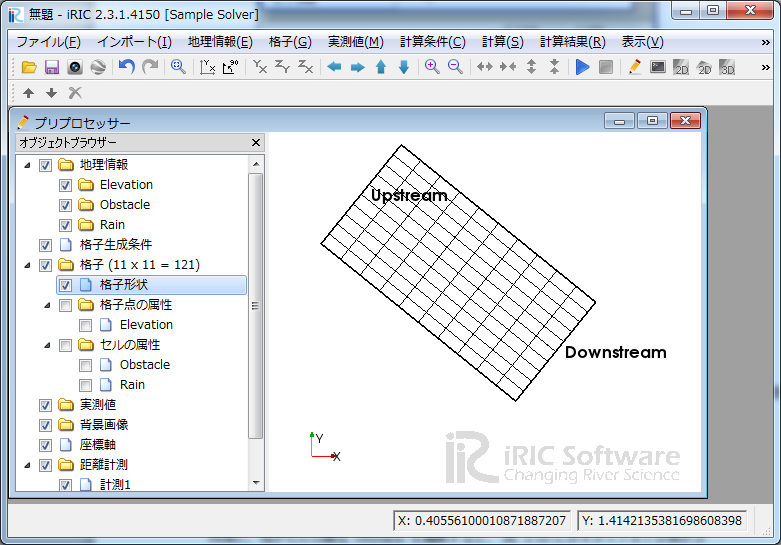
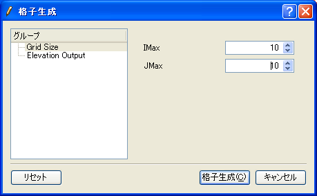
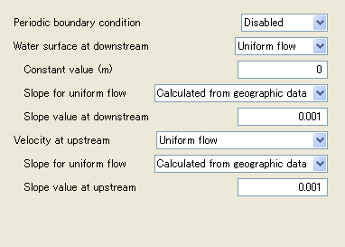
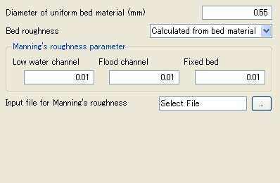
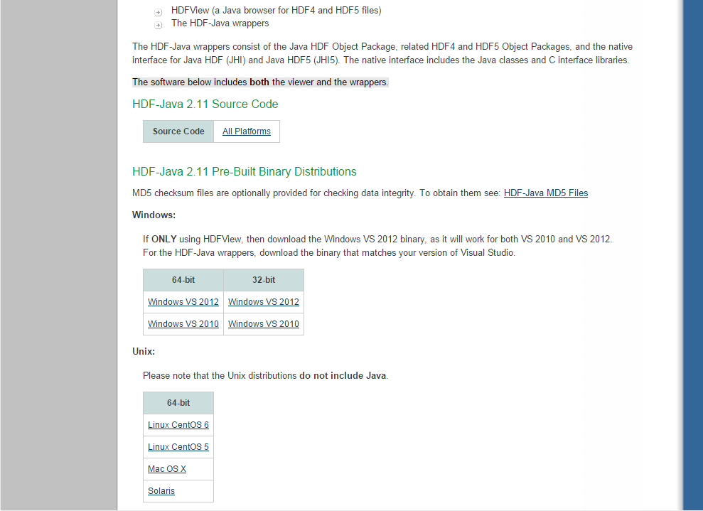

+-----------------------------------------------------------+----------------------------+----+
+-----------------------------------------------------------+----------------------------+----+
| |image0|                                                  | iRIC Software              |
|                                                           |                            |
|                                                           | *Changing River Science*   |
+-----------------------------------------------------------+----------------------------+----+
|                                                           | *Developer’s Manual*       |
+-----------------------------------------------------------+----------------------------+----+
+-----------------------------------------------------------+----------------------------+----+
|                                                           | Last Update: 2015.7.3      |
|                                                           |                            |
|                                                           | Release: 2011.12.24        |
+-----------------------------------------------------------+----------------------------+----+
| *Copyright 2011-2015 iRIC Project All Rights Reserved.*   |
+-----------------------------------------------------------+----------------------------+----+

Contents

`*1.* *About This Manual* 1 <#about-this-manual>`__

`*2.* *Steps of developing a solver*
2 <#steps-of-developing-a-solver>`__

`*2.1.* *Abstract* 2 <#abstract>`__

`*2.2.* *Creating a folder* 5 <#creating-a-folder>`__

`*2.3.* *Creating a solver definition file*
5 <#creating-a-solver-definition-file>`__

`*2.3.1.* *Defining basic information*
6 <#defining-basic-information>`__

`*2.3.2.* *Defining calculation conditions*
8 <#defining-calculation-conditions>`__

`*2.3.3.* *Defining Grid attributes* 12 <#defining-grid-attributes>`__

`*2.3.4.* *Defining Boundary Conditions*
15 <#defining-boundary-conditions>`__

`*2.4.* *Creating a solver* 17 <#creating-a-solver>`__

`*2.4.1.* *Creating a scelton* 18 <#creating-a-scelton>`__

`*2.4.2.* *Adding calculation data file opening and closing codes*
19 <#adding-calculation-data-file-opening-and-closing-codes>`__

`*2.4.3.* *Adding codes to load calculation conditions, calculation
girds, and boundary conditions*
20 <#adding-codes-to-load-calculation-conditions-calculation-girds-and-boundary-conditions>`__

`*2.4.4.* *Adding codes to output time and calculation results*
22 <#adding-codes-to-output-time-and-calculation-results>`__

`*2.5.* *Creating a solver definition dictionary file*
24 <#creating-a-solver-definition-dictionary-file>`__

`*2.6.* *Creating a README file* 27 <#creating-a-readme-file>`__

`*2.7.* *Creating a LICENSE file* 28 <#creating-a-license-file>`__

`*3.* *Steps of developing a calculation result analysis program*
29 <#steps-of-developing-a-calculation-result-analysis-program>`__

`*3.1.* *Abstract* 29 <#abstract-1>`__

`*4.* *Steps of developing a grid generating program*
32 <#steps-of-developing-a-grid-generating-program>`__

`*4.1.* *Abstract* 32 <#abstract-2>`__

`*4.2.* *Creating a folder* 34 <#creating-a-folder-1>`__

`*4.3.* *Creating a grid generating program definition file*
34 <#creating-a-grid-generating-program-definition-file>`__

`*4.3.1.* *Defining basic information*
35 <#defining-basic-information-1>`__

`*4.3.2.* *Defining grid generating conditions*
37 <#defining-grid-generating-conditions>`__

`*4.3.3.* *Defining error codes* 39 <#defining-error-codes>`__

`*4.4.* *Creating a grid generating program*
41 <#creating-a-grid-generating-program>`__

`*4.4.1.* *Creating a scelton* 42 <#creating-a-scelton-1>`__

`*4.4.2.* *Adding grid generating data file opening and closing codes*
43 <#adding-grid-generating-data-file-opening-and-closing-codes>`__

`*4.4.3.* *Adding codes to output a grid*
44 <#adding-codes-to-output-a-grid>`__

`*4.4.4.* *Adding codes to load grid generating condition*
47 <#adding-codes-to-load-grid-generating-condition>`__

`*4.4.5.* *Adding error handling codes*
49 <#adding-error-handling-codes>`__

`*4.5.* *Creating a grid generating program definition dictionary file*
50 <#creating-a-grid-generating-program-definition-dictionary-file>`__

`*4.6.* *Creating a README file* 53 <#creating-a-readme-file-1>`__

`*5.* *About definition files (XML)* 54 <#about-definition-files-xml>`__

`*5.1.* *Abstract* 54 <#abstract-3>`__

`*5.2.* *Structure* 54 <#structure>`__

`*5.2.1.* *Solver definition file* 54 <#solver-definition-file>`__

`*5.2.2.* *Grid generating program definition file*
57 <#grid-generating-program-definition-file>`__

`*5.3.* *Examples* 58 <#examples>`__

`*5.3.1.* *Examples of calculation conditions, boundary conditions, and
grid generating condition*
58 <#examples-of-calculation-conditions-boundary-conditions-and-grid-generating-condition>`__

`*5.3.2.* *Example of condition to activate calculation conditions etc.*
71 <#example-of-condition-to-activate-calculation-conditions-etc.>`__

`*5.3.3.* *Example of dialog layout definition*
72 <#example-of-dialog-layout-definition>`__

`*5.4.* *Elements reference* 78 <#elements-reference>`__

`*5.4.1.* *BoundaryCondition* 78 <#boundarycondition>`__

`*5.4.2.* *CalculationCondition* 78 <#calculationcondition>`__

`*5.4.3.* *Condition* 79 <#condition>`__

`*5.4.4.* *Definition (when used under CalculationCondition element or
BoundaryCondition element)*
80 <#definition-when-used-under-calculationcondition-element-or-boundarycondition-element>`__

`*5.4.5.* *Definition (when used under the GridRelatedCondition
element)*
81 <#definition-when-used-under-the-gridrelatedcondition-element>`__

`*5.4.6.* *Dimension* 82 <#dimension>`__

`*5.4.7.* *Enumeration* 82 <#enumeration>`__

`*5.4.8.* *ErrorCodes* 82 <#errorcodes>`__

`*5.4.9.* *ErrorCode* 83 <#errorcode>`__

`*5.4.10.* *GroupBox* 83 <#groupbox>`__

`*5.4.11.* *GridGeneratingCondition* 84 <#gridgeneratingcondition>`__

`*5.4.12.* *GridGeneratorDefinition* 84 <#gridgeneratordefinition>`__

`*5.4.13.* *GridLayout* 85 <#gridlayout>`__

`*5.4.14.* *GridTypes* 85 <#gridtypes>`__

`*5.4.15.* *GridType* 85 <#gridtype>`__

`*5.4.16.* *HBoxLayout* 86 <#hboxlayout>`__

`*5.4.17.* *Item* 86 <#item>`__

`*5.4.18.* *Label* 86 <#label>`__

`*5.4.19.* *Param* 87 <#param>`__

`*5.4.20.* *SolverDefinition* 88 <#solverdefinition>`__

`*5.4.21.* *Tab* 89 <#tab>`__

`*5.4.22.* *Value* 89 <#value>`__

`*5.4.23.* *VBoxLayout* 90 <#vboxlayout>`__

`*5.5.* *Notes on solver version up* 91 <#notes-on-solver-version-up>`__

`*5.6.* *XML files basics* 93 <#xml-files-basics>`__

`*5.6.1.* *Defining Elements* 93 <#defining-elements>`__

`*5.6.2.* *About tabs, spaces, and line breaks*
94 <#about-tabs-spaces-and-line-breaks>`__

`*5.6.3.* *Comments* 94 <#comments>`__

`*6.* *iRIClib* 95 <#iriclib>`__

`*6.1.* *What is iRIClib?* 95 <#what-is-iriclib>`__

`*6.2.* *How to read this section* 95 <#how-to-read-this-section>`__

`*6.3.* *Overview* 96 <#overview>`__

`*6.3.1.* *Processes of the program and iRIClib subroutines*
96 <#processes-of-the-program-and-iriclib-subroutines>`__

`*6.3.2.* *Opening a CGNS file* 97 <#opening-a-cgns-file>`__

`*6.3.3.* *Initializing iRIClib* 97 <#initializing-iriclib>`__

`*6.3.4.* *Set up options* 97 <#set-up-options>`__

`*6.3.5.* *Reading calculation conditions*
98 <#reading-calculation-conditions>`__

`*6.3.6.* *Reading calculation grid information*
100 <#reading-calculation-grid-information>`__

`*6.3.7.* *Reading boundary conditions*
103 <#reading-boundary-conditions>`__

`*6.3.8.* *Reading geographic data* 105 <#reading-geographic-data>`__

`*6.3.9.* *Outputting calculation grids (only in cases where grid
creation or re-division is performed)*
109 <#outputting-calculation-grids-only-in-cases-where-grid-creation-or-re-division-is-performed>`__

`*6.3.10.* *Outputting time (or iteration count) information*
111 <#outputting-time-or-iteration-count-information>`__

`*6.3.11.* *Outputting calculation grids (only in the case of a moving
grid)*
112 <#outputting-calculation-grids-only-in-the-case-of-a-moving-grid>`__

`*6.3.12.* *Outputting calculation results*
114 <#outputting-calculation-results>`__

`*6.3.13.* *Reading calculation result*
117 <#reading-calculation-result>`__

`*6.3.14.* *Outputting Error code* 118 <#outputting-error-code>`__

`*6.3.15.* *Closing a CGNS file* 118 <#closing-a-cgns-file>`__

`*6.4.* *Reference* 119 <#reference>`__

`*6.4.1.* *List of subroutines* 119 <#list-of-subroutines>`__

`*6.4.2.* *cg\_open\_f* 125 <#cg_open_f>`__

`*6.4.3.* *cg\_iric\_init\_f* 125 <#cg_iric_init_f>`__

`*6.4.4.* *cg\_iric\_initread\_f* 125 <#cg_iric_initread_f>`__

`*6.4.5.* *cg\_iric\_initoption\_f* 126 <#cg_iric_initoption_f>`__

`*6.4.6.* *cg\_iric\_read\_integer\_f* 126 <#cg_iric_read_integer_f>`__

`*6.4.7.* *cg\_iric\_read\_real\_f* 126 <#cg_iric_read_real_f>`__

`*6.4.8.* *cg\_iric\_read\_realsingle\_f*
127 <#cg_iric_read_realsingle_f>`__

`*6.4.9.* *cg\_iric\_read\_string\_f* 127 <#cg_iric_read_string_f>`__

`*6.4.10.* *cg\_iric\_read\_functionalsize\_f*
127 <#cg_iric_read_functionalsize_f>`__

`*6.4.11.* *cg\_iric\_read\_functional\_f*
128 <#cg_iric_read_functional_f>`__

`*6.4.12.* *cg\_iric\_read\_functional\_realsingle\_f*
128 <#cg_iric_read_functional_realsingle_f>`__

`*6.4.13.* *cg\_iric\_read\_functionalwithname\_f*
129 <#cg_iric_read_functionalwithname_f>`__

`*6.4.14.* *cg\_iric\_gotogridcoord2d\_f*
129 <#cg_iric_gotogridcoord2d_f>`__

`*6.4.15.* *cg\_iric\_gotogridcoord3d\_f*
129 <#cg_iric_gotogridcoord3d_f>`__

`*6.4.16.* *cg\_iric\_getgridcoord2d\_f*
130 <#cg_iric_getgridcoord2d_f>`__

`*6.4.17.* *cg\_iric\_getgridcoord3d\_f*
130 <#cg_iric_getgridcoord3d_f>`__

`*6.4.18.* *cg\_iric\_read\_grid\_integer\_node\_f*
131 <#cg_iric_read_grid_integer_node_f>`__

`*6.4.19.* *cg\_iric\_read\_grid\_real\_node\_f*
131 <#cg_iric_read_grid_real_node_f>`__

`*6.4.20.* *cg\_iric\_read\_grid\_integer\_cell\_f*
131 <#cg_iric_read_grid_integer_cell_f>`__

`*6.4.21.* *cg\_iric\_read\_grid\_real\_cell\_f*
132 <#cg_iric_read_grid_real_cell_f>`__

`*6.4.22.* *cg\_iric\_read\_complex\_count\_f*
132 <#cg_iric_read_complex_count_f>`__

`*6.4.23.* *cg\_iric\_read\_complex\_integer\_f*
132 <#cg_iric_read_complex_integer_f>`__

`*6.4.24.* *cg\_iric\_read\_complex\_real\_f*
133 <#cg_iric_read_complex_real_f>`__

`*6.4.25.* *cg\_iric\_read\_complex\_realsingle\_f*
133 <#cg_iric_read_complex_realsingle_f>`__

`*6.4.26.* *cg\_iric\_read\_complex\_string\_f*
134 <#cg_iric_read_complex_string_f>`__

`*6.4.27.* *cg\_iric\_read\_complex\_functionalsize\_f*
134 <#cg_iric_read_complex_functionalsize_f>`__

`*6.4.28.* *cg\_iric\_read\_complex\_functional\_f*
135 <#cg_iric_read_complex_functional_f>`__

`*6.4.29.* *cg\_iric\_read\_complex\_functionalwithname\_f*
135 <#cg_iric_read_complex_functionalwithname_f>`__

`*6.4.30.* *cg\_iric\_read\_complex\_functional\_realsingle\_f*
136 <#cg_iric_read_complex_functional_realsingle_f>`__

`*6.4.31.* *cg\_iric\_read\_grid\_complex\_node\_f*
136 <#cg_iric_read_grid_complex_node_f>`__

`*6.4.32.* *cg\_iric\_read\_grid\_complex\_cell\_f*
136 <#cg_iric_read_grid_complex_cell_f>`__

`*6.4.33.* *cg\_iric\_read\_grid\_functionaltimesize\_f*
137 <#cg_iric_read_grid_functionaltimesize_f>`__

`*6.4.34.* *cg\_iric\_read\_grid\_functionaltime\_f*
137 <#cg_iric_read_grid_functionaltime_f>`__

`*6.4.35.* *cg\_iric\_read\_grid\_functionaldimensionsize\_f*
137 <#cg_iric_read_grid_functionaldimensionsize_f>`__

`*6.4.36.* *cg\_iric\_read\_grid\_functionaldimension\_integer\_f*
138 <#cg_iric_read_grid_functionaldimension_integer_f>`__

`*6.4.37.* *cg\_iric\_read\_grid\_functionaldimension\_real\_f*
138 <#cg_iric_read_grid_functionaldimension_real_f>`__

`*6.4.38.* *cg\_iric\_read\_grid\_functional\_integer\_node\_f*
139 <#cg_iric_read_grid_functional_integer_node_f>`__

`*6.4.39.* *cg\_iric\_read\_grid\_functional\_real\_node\_f*
139 <#cg_iric_read_grid_functional_real_node_f>`__

`*6.4.40.* *cg\_iric\_read\_grid\_functional\_integer\_cell\_f*
140 <#cg_iric_read_grid_functional_integer_cell_f>`__

`*6.4.41.* *cg\_iric\_read\_grid\_functional\_real\_cell\_f*
140 <#cg_iric_read_grid_functional_real_cell_f>`__

`*6.4.42.* *cg\_iric\_bc\_count\_f* 140 <#cg_iric_bc_count_f>`__

`*6.4.43.* *cg\_iric\_read\_bc\_indicessize\_f*
141 <#cg_iric_read_bc_indicessize_f>`__

`*6.4.44.* *cg\_iric\_read\_bc\_indices\_f*
142 <#cg_iric_read_bc_indices_f>`__

`*6.4.45.* *cg\_iric\_read\_bc\_integer\_f*
143 <#cg_iric_read_bc_integer_f>`__

`*6.4.46.* *cg\_iric\_read\_bc\_real\_f*
143 <#cg_iric_read_bc_real_f>`__

`*6.4.47.* *cg\_iric\_read\_bc\_realsingle\_f*
144 <#cg_iric_read_bc_realsingle_f>`__

`*6.4.48.* *cg\_iric\_read\_bc\_string\_f*
144 <#cg_iric_read_bc_string_f>`__

`*6.4.49.* *cg\_iric\_read\_bc\_functionalsize\_f*
145 <#cg_iric_read_bc_functionalsize_f>`__

`*6.4.50.* *cg\_iric\_read\_bc\_functional\_f*
145 <#cg_iric_read_bc_functional_f>`__

`*6.4.51.* *cg\_iric\_read\_bc\_functional\_realsingle\_f*
146 <#cg_iric_read_bc_functional_realsingle_f>`__

`*6.4.52.* *cg\_iric\_read\_bc\_functionalwithname\_f*
146 <#cg_iric_read_bc_functionalwithname_f>`__

`*6.4.53.* *cg\_iric\_read\_geo\_count\_f*
147 <#cg_iric_read_geo_count_f>`__

`*6.4.54.* *cg\_iric\_read\_geo\_filename\_f*
147 <#cg_iric_read_geo_filename_f>`__

`*6.4.55.* *iric\_geo\_polygon\_open\_f*
148 <#iric_geo_polygon_open_f>`__

`*6.4.56.* *iric\_geo\_polygon\_read\_integervalue\_f*
148 <#iric_geo_polygon_read_integervalue_f>`__

`*6.4.57.* *iric\_geo\_polygon\_read\_realvalue\_f*
148 <#iric_geo_polygon_read_realvalue_f>`__

`*6.4.58.* *iric\_geo\_polygon\_read\_pointcount\_f*
149 <#iric_geo_polygon_read_pointcount_f>`__

`*6.4.59.* *iric\_geo\_polygon\_read\_points\_f*
149 <#iric_geo_polygon_read_points_f>`__

`*6.4.60.* *iric\_geo\_polygon\_read\_holecount\_f*
149 <#iric_geo_polygon_read_holecount_f>`__

`*6.4.61.* *iric\_geo\_polygon\_read\_holepointcount\_f*
150 <#iric_geo_polygon_read_holepointcount_f>`__

`*6.4.62.* *iric\_geo\_polygon\_read\_holepoints\_f*
150 <#iric_geo_polygon_read_holepoints_f>`__

`*6.4.63.* *iric\_geo\_polygon\_close\_f*
151 <#iric_geo_polygon_close_f>`__

`*6.4.64.* *iric\_geo\_riversurvey\_open\_f*
151 <#iric_geo_riversurvey_open_f>`__

`*6.4.65.* *iric\_geo\_riversurvey\_read\_count\_f*
151 <#iric_geo_riversurvey_read_count_f>`__

`*6.4.66.* *iric\_geo\_riversurvey\_read\_position\_f*
152 <#iric_geo_riversurvey_read_position_f>`__

`*6.4.67.* *iric\_geo\_riversurvey\_read\_direction\_f*
152 <#iric_geo_riversurvey_read_direction_f>`__

`*6.4.68.* *iric\_geo\_riversurvey\_read\_name\_f*
153 <#iric_geo_riversurvey_read_name_f>`__

`*6.4.69.* *iric\_geo\_riversurvey\_read\_realname\_f*
153 <#iric_geo_riversurvey_read_realname_f>`__

`*6.4.70.* *iric\_geo\_riversurvey\_read\_leftshift\_f*
153 <#iric_geo_riversurvey_read_leftshift_f>`__

`*6.4.71.* *iric\_geo\_riversurvey\_read\_altitudecount\_f*
154 <#iric_geo_riversurvey_read_altitudecount_f>`__

`*6.4.72.* *iric\_geo\_riversurvey\_read\_altitudes\_f*
154 <#iric_geo_riversurvey_read_altitudes_f>`__

`*6.4.73.* *iric\_geo\_riversurvey\_read\_fixedpointl\_f*
155 <#iric_geo_riversurvey_read_fixedpointl_f>`__

`*6.4.74.* *iric\_geo\_riversurvey\_read\_fixedpointr\_f*
155 <#iric_geo_riversurvey_read_fixedpointr_f>`__

`*6.4.75.* *iric\_geo\_riversurvey\_read\_watersurfaceelevation\_f*
156 <#iric_geo_riversurvey_read_watersurfaceelevation_f>`__

`*6.4.76.* *iric\_geo\_riversurvey\_close\_f*
156 <#iric_geo_riversurvey_close_f>`__

`*6.4.77.* *cg\_iric\_writegridcoord1d\_f*
156 <#cg_iric_writegridcoord1d_f>`__

`*6.4.78.* *cg\_iric\_writegridcoord2d\_f*
157 <#cg_iric_writegridcoord2d_f>`__

`*6.4.79.* *cg\_iric\_writegridcoord3d\_f*
157 <#cg_iric_writegridcoord3d_f>`__

`*6.4.80.* *cg\_iric\_write\_grid\_integer\_node\_f*
158 <#cg_iric_write_grid_integer_node_f>`__

`*6.4.81.* *cg\_iric\_write\_grid\_real\_node\_f*
158 <#cg_iric_write_grid_real_node_f>`__

`*6.4.82.* *cg\_iric\_write\_grid\_integer\_cell\_f*
158 <#cg_iric_write_grid_integer_cell_f>`__

`*6.4.83.* *cg\_iric\_write\_grid\_real\_cell\_f*
159 <#cg_iric_write_grid_real_cell_f>`__

`*6.4.84.* *cg\_iric\_write\_sol\_time\_f*
159 <#cg_iric_write_sol_time_f>`__

`*6.4.85.* *cg\_iric\_write\_sol\_iteration\_f*
159 <#cg_iric_write_sol_iteration_f>`__

`*6.4.86.* *cg\_iric\_write\_sol\_gridcoord2d\_f*
160 <#cg_iric_write_sol_gridcoord2d_f>`__

`*6.4.87.* *cg\_iric\_write\_sol\_gridcoord3d\_f*
160 <#cg_iric_write_sol_gridcoord3d_f>`__

`*6.4.88.* *cg\_iric\_write\_sol\_baseiterative\_integer\_f*
161 <#cg_iric_write_sol_baseiterative_integer_f>`__

`*6.4.89.* *cg\_iric\_write\_sol\_baseiterative\_real\_f*
161 <#cg_iric_write_sol_baseiterative_real_f>`__

`*6.4.90.* *cg\_iric\_write\_sol\_integer\_f*
161 <#cg_iric_write_sol_integer_f>`__

`*6.4.91.* *cg\_iric\_write\_sol\_real\_f*
162 <#cg_iric_write_sol_real_f>`__

`*6.4.92.* *cg\_iric\_write\_sol\_particle\_pos2d\_f*
162 <#cg_iric_write_sol_particle_pos2d_f>`__

`*6.4.93.* *cg\_iric\_write\_sol\_particle\_pos3d\_f*
163 <#cg_iric_write_sol_particle_pos3d_f>`__

`*6.4.94.* *iric\_check\_cancel\_f* 163 <#iric_check_cancel_f>`__

`*6.4.95.* *iric\_check\_lock\_f* 163 <#iric_check_lock_f>`__

`*6.4.96.* *iric\_write\_sol\_start\_f* 164 <#iric_write_sol_start_f>`__

`*6.4.97.* *iric\_write\_sol\_end\_f* 164 <#iric_write_sol_end_f>`__

`*6.4.98.* *cg\_iric\_flush\_f* 164 <#cg_iric_flush_f>`__

`*6.4.99.* *cg\_iric\_read\_sol\_count\_f*
165 <#cg_iric_read_sol_count_f>`__

`*6.4.100.* *cg\_iric\_read\_sol\_time\_f*
165 <#cg_iric_read_sol_time_f>`__

`*6.4.101.* *cg\_iric\_read\_sol\_iteration\_f*
166 <#cg_iric_read_sol_iteration_f>`__

`*6.4.102.* *cg\_iric\_read\_sol\_baseiterative\_integer\_f*
166 <#cg_iric_read_sol_baseiterative_integer_f>`__

`*6.4.103.* *cg\_iric\_read\_sol\_baseiterative\_real\_f*
166 <#cg_iric_read_sol_baseiterative_real_f>`__

`*6.4.104.* *cg\_iric\_read\_sol\_gridcoord2d\_f*
167 <#cg_iric_read_sol_gridcoord2d_f>`__

`*6.4.105.* *cg\_iric\_read\_sol\_gridcoord3d\_f*
167 <#cg_iric_read_sol_gridcoord3d_f>`__

`*6.4.106.* *cg\_iric\_read\_sol\_integer\_f*
168 <#cg_iric_read_sol_integer_f>`__

`*6.4.107.* *cg\_iric\_read\_sol\_real\_f*
168 <#cg_iric_read_sol_real_f>`__

`*6.4.108.* *cg\_iric\_write\_errorcode\_f*
168 <#cg_iric_write_errorcode_f>`__

`*6.4.109.* *cg\_close\_f* 169 <#cg_close_f>`__

`*7.* *Other Informations* 170 <#other-informations>`__

`*7.1.* *Handling command line arguments in Fortran programs*
170 <#handling-command-line-arguments-in-fortran-programs>`__

`*7.1.1.* *Intel Fortran Compiler* 170 <#intel-fortran-compiler>`__

`*7.1.2.* *GNU Fortran, G95* 170 <#gnu-fortran-g95>`__

`*7.2.* *Linking iRIClib, cgnslib using Fortran*
171 <#linking-iriclib-cgnslib-using-fortran>`__

`*7.2.1.* *Intel Fortran Compiler (Windows)*
171 <#intel-fortran-compiler-windows>`__

`*7.2.2.* *GNU Fortran* 171 <#gnu-fortran>`__

`*7.3.* *Special names for grid attributes and calculation results*
172 <#special-names-for-grid-attributes-and-calculation-results>`__

`*7.3.1.* *Grid attributes* 172 <#grid-attributes>`__

`*7.3.2.* *Calculation results* 173 <#calculation-results>`__

`*7.4.* *Information on CGNS file and CGNS library*
174 <#information-on-cgns-file-and-cgns-library>`__

`*7.4.1.* *General concept of CGNS file format*
174 <#general-concept-of-cgns-file-format>`__

`*7.4.2.* *How to view a CGNS file* 174 <#how-to-view-a-cgns-file>`__

`*7.4.3.* *Reference URLs* 177 <#reference-urls>`__

About This Manual
=================

This manual provides information necessary for the following people:

Developers of solvers that run on iRIC.

Developers of grid generating programs that run on iRIC

Developers of solvers should read Chapter 2 first, to understand the
steps of developing a solver. After that, please read Chapter , , when
you need to.

Developers of grid generating programs should read Chapter 4 first, to
understand the steps of developing a grid generating program. After
that, please read Chapter , , when you need to.

Steps of developing a solver
============================

Abstract
--------

Solver is a program that load grid and calculation conditions, execute a
river simulation, and output calculation results.

To add a solver to iRIC, it is necessary to make and deploy files shown
in Table 2‑1.

“iRIC 2.0” folder and “solvers” folder in Table 2‑1 have been already
created when you installed iRIC. Solver developers have to create a new
folder under “solvers” folder, and deploy files related to the new
solver under that.

Table ‑ Files and folders related to Solvers

+------------------------------+-----------------------------------------------------------------------+------------+
| Item                         | Description                                                           | Refer to   |
+==============================+=======================================================================+============+
| iRIC 2.0                     | Installation folder of iRIC 2.0 (e.g.: C:\\Program Files\\iRIC 2.0)   |            |
+------------------------------+-----------------------------------------------------------------------+------------+
| solvers                      | Folder for storing solvers                                            |            |
+------------------------------+-----------------------------------------------------------------------+------------+
| (solver folder)              | Create one folder for each solver. Give the folder any name.          | 2.2        |
+------------------------------+-----------------------------------------------------------------------+------------+
| definition.xml               | Solver definition file.                                               | 2.3        |
+------------------------------+-----------------------------------------------------------------------+------------+
| solver.exe                   | Executable module of the solver. Developers can select any name.      | 2.4        |
+------------------------------+-----------------------------------------------------------------------+------------+
| translation\_ja\_JP.ts etc   | Dictionary files for a solver definition file                         | 2.5        |
+------------------------------+-----------------------------------------------------------------------+------------+
| README                       | File explaining the solver                                            | 2.6        |
+------------------------------+-----------------------------------------------------------------------+------------+
| LICENSE                      | License information file for the solver                               | 2.7        |
+------------------------------+-----------------------------------------------------------------------+------------+

Abstracts of each file are as follows:

**definition.xml**

File that defines the following information of solvers:

-  Basic Information

-  Calculation Conditions

-  Grid Attributes

iRIC loads definition xml, and provides interface for creating
calculation conditions and grids that can be used by the solver. Solver
definition file should be written in English.

**Solver**

Executable module of a river simulation solver. It loads calculation
condition and grids created using iRIC, executes river simulation, and
outputs result.

Solvers use calculation data files created by iRIC, for loading and
writing calculation condition, grids, and calculation results. Solvers
can also use arbitrary files for data I/O that cannot be loaded from or
written into calculation data files.

Solvers can be developed using FORTRAN, C or C++. In this chapter, a
sample solver is developed in FORTRAN.

**translation\_ja\_JP.ts etc.**

Dictionary files for a solver definition file. It provides translation
information for texts shown on dialogs or object browser in iRIC.
Dictionary files are created as separate files for each language. For
example, “translation\_ja\_JP.ts” for Japanese, “translation\_ka\_KR.ts”
for Korean.

**README**

README is a text file that describes about the solver. The content of
README is shown in the “Description” tab in the [Select Solver] dialog.

**LICENSE**

LICENSE is a text file that describes about the license of the solver.
The content of LICENSE is shown in the “License” tab in the [Select
Solver] dialog.

Figure 2‑1 shows the relationships of iRIC, solver and related files.

Figure ‑ Relationships between iRIC, solvers, and related files

This chapter explains the steps to create the files described in this
section.

Creating a folder
-----------------

Create a special folder for the solver you develop under the “solvers”
folder under the installation folder of iRIC (The default place is
“C:\\Program Files\\iRIC 2.0”). This time, please create “example”
folder.

Creating a solver definition file
---------------------------------

Create a solver definition file.

In solver definition file, you are going to define the information shown
in Table 2‑2.

Table ‑ Informations defined in solver definition file

+-------------------------+----------------------------------------------------------------------+------------+
| Item                    | Description                                                          | Required   |
+=========================+======================================================================+============+
| Basic information       | The solver name, developer name, release date, etc.                  | Yes        |
+-------------------------+----------------------------------------------------------------------+------------+
| Calculation Condition   | Calculation condition for solver execution                           | Yes        |
+-------------------------+----------------------------------------------------------------------+------------+
| Grid Attributes         | Attributes defined at nodes or cells of calculation grids            | Yes        |
+-------------------------+----------------------------------------------------------------------+------------+
| Boundary Conditions     | Boundary conditions defined at nodes or cells of calculation grids   |            |
+-------------------------+----------------------------------------------------------------------+------------+

Solver definition file is described in XML language. The basic grammer
of XML language is explained in Section 5.6.

In this section, we add definition information of a solver in the order
shown in Table 2‑2.

Defining basic information
~~~~~~~~~~~~~~~~~~~~~~~~~~

Define basic information of a solver. Create a file with the content
shown in Table 2‑3, and save it with name “definition.xml” under
“example” folder that you created in Section 2.2.

Table ‑ Example solver definition file that contains basic information

+------------------------------------------+
| <?xml version="1.0" encoding="UTF-8"?>   |
|                                          |
| <SolverDefinition                        |
|                                          |
| name="samplesolver"                      |
|                                          |
| caption="Sample Solver 1.0"              |
|                                          |
| version="1.0"                            |
|                                          |
| copyright="Example Company"              |
|                                          |
| release="2012.04.01"                     |
|                                          |
| homepage="http://example.com/"           |
|                                          |
| executable="solver.exe"                  |
|                                          |
| iterationtype="time"                     |
|                                          |
| gridtype="structured2d"                  |
|                                          |
| >                                        |
|                                          |
| <CalculationCondition>                   |
|                                          |
| </CalculationCondition>                  |
|                                          |
| <GridRelatedCondition>                   |
|                                          |
| </GridRelatedCondition>                  |
|                                          |
| </SolverDefinition>                      |
+------------------------------------------+

At this point, the structure of the solver definition file is as shown
in Table 2‑4.

Table ‑ Solver definition file structure

Now make sure the solver definition file is arranged correctly.

Launch iRIC. The [iRIC Start Page] dialog (Figure 2‑2) is shown, so
please click on [New Project]. The [Solver Select] dialog (Figure 2‑3)
will open, so make sure if there is a new item “Sample Solver” in the
solver list. When you find it, select it and make sure that the basic
information of the solver you wrote in solver definition file is shown.

Please note that the following attributes are not shown on this dialog:

-  name

-  executable

-  iterationtype

-  gridtype

|image1|

Figure ‑ The [iRIC Start Page] dialog

Figure ‑ The [Select Solver] dialog

You sould take care about name attribute and version attribute, when you
want to update a solver. Please refer to Section 5.5 for the detail.

Defining calculation conditions
~~~~~~~~~~~~~~~~~~~~~~~~~~~~~~~

Define calculation conditions. Calculation conditions are defined in
“CalculationCondition” element. Add description of calculation condition
to the solver definition file you created in Section 2.3.1. Solver
definition file content is now as shown in Table 2‑5. The added part is
shown with bold style.

Table ‑ Example of solver definition file that now has calculation
condition definition

+--------------------------------------------------------------------------+
| <?xml version="1.0" encoding="UTF-8"?>                                   |
|                                                                          |
| <SolverDefinition                                                        |
|                                                                          |
| name="samplesolver"                                                      |
|                                                                          |
| caption="Sample Solver"                                                  |
|                                                                          |
| version="1.0"                                                            |
|                                                                          |
| copyright="Example Company"                                              |
|                                                                          |
| release="2012.04.01"                                                     |
|                                                                          |
| homepage="http://example.com/"                                           |
|                                                                          |
| executable="solver.exe"                                                  |
|                                                                          |
| iterationtype="time"                                                     |
|                                                                          |
| gridtype="structured2d"                                                  |
|                                                                          |
| >                                                                        |
|                                                                          |
| <CalculationCondition>                                                   |
|                                                                          |
| **<Tab name="basic" caption="Basic Settings">**                          |
|                                                                          |
| **<Item name="maxIteretions" caption="Maximum number of Iterations">**   |
|                                                                          |
| **<Definition valueType="integer" default="10">**                        |
|                                                                          |
| **</Definition>**                                                        |
|                                                                          |
| **</Item>**                                                              |
|                                                                          |
| **<Item name=”timeStep” caption=”Time Step”>**                           |
|                                                                          |
| **<Definition valueType=”real” default=”0.1”>**                          |
|                                                                          |
| **</Definition>**                                                        |
|                                                                          |
| **</Item>**                                                              |
|                                                                          |
| **</Tab>**                                                               |
|                                                                          |
| </CalculationCondition>                                                  |
|                                                                          |
| <GridRelatedCondition>                                                   |
|                                                                          |
| </GridRelatedCondition>                                                  |
|                                                                          |
| </SolverDefinition>                                                      |
+--------------------------------------------------------------------------+

At this point, the structure of the solver definition file is as shown
in Table 2‑6.

Table ‑ Solver definition file structure

Now make sure that solver definition file is arranged correctly.

Launch iRIC. The [iRIC Start page] dialog (Figure 2‑2) will open, so
please click on [Create New Project], select “Sample Solver” from the
list, and click on [OK]. The Warning dialog (Figure 2‑4) will be open,
so click on [OK].

|image2|

Figure ‑ The [Warning] dialog

The [Pre-processing Window] will open, so perform the following:

    **Menu bar:** [Calculation Condition] (C) ► [Setting] (S)

The [Calculation Condition] dialog (Figure 2‑5) will open. Now you can
see that the calculation condition items you defined are shown.

Figure ‑ The [Calculation Condition] dialog

Now add one more group and add calculation condition items. Add “Water
Surface Elevation” Tab element just under “Basic Settings” Tab element.
Table 2‑7 shows the solver definition file that has definition of “Water
Surface Elevation” Tab. The added part is shown with bold style.

Table ‑ Example of solver definition file that now has calculation
condition definition (abbr.)

+-----------------------------------------------------------------------+
| (abbr.)                                                               |
|                                                                       |
| </Tab>                                                                |
|                                                                       |
| **<Tab name=”surfaceElevation” caption=”Water Surface Elevation”>**   |
|                                                                       |
| **<Item name=”surfaceType” caption=”Type”>**                          |
|                                                                       |
| **<Definition valueType=”integer” default=”0”>**                      |
|                                                                       |
| **<Enumeration caption=”Constant” value=”0” />**                      |
|                                                                       |
| **<Enumeration caption=”Time Dependent” value=”1” />**                |
|                                                                       |
| **</Definition>**                                                     |
|                                                                       |
| **</Item>**                                                           |
|                                                                       |
| **<Item name=”constantSurface” caption=”Constant Value”>**            |
|                                                                       |
| **<Definition valueType=”real” default=”1”>**                         |
|                                                                       |
| **<Condition type="isEqual" target="surfaceType" value="0"/>**        |
|                                                                       |
| **</Definition>**                                                     |
|                                                                       |
| **</Item>**                                                           |
|                                                                       |
| **<Item name=”variableSurface” caption=”Time Dependent Value”>**      |
|                                                                       |
| **<Definition valueType=”functional”>**                               |
|                                                                       |
| **<Parameter valueType="real" caption="Time(s)"/>**                   |
|                                                                       |
| **<Value valueType="real" caption="Elevation(m) "/>**                 |
|                                                                       |
| **<Condition type="isEqual" target="surfaceType" value="1"/>**        |
|                                                                       |
| **</Definition>**                                                     |
|                                                                       |
| **</Item>**                                                           |
|                                                                       |
| **</Tab>**                                                            |
|                                                                       |
| </CalculationCondition>                                               |
|                                                                       |
| <GridRelatedCondition>                                                |
|                                                                       |
| </GridRelatedCondition>                                               |
|                                                                       |
| </SolverDefinition>                                                   |
+-----------------------------------------------------------------------+

At this point, the structure of the solver definition file is as shown
in Table 2‑8.

Table ‑ Solver definition file structure

Now make sure that solver definition file is arranged correctly. Do the
operation you did again, to open The [Calculation Condition] dialog
(Figure 2‑6). Now you can see that the new group “Water Surface
Elevation” is added in the group list. You’ll also notice that the
“Constant Value” item is enabled only when “Type” value is “Constant”,
and the “Time Dependent Value” item is enabled only when “Type” value is
“Time Dependent”.

|image3|

Figure ‑ The [Calculation Condition] dialog

What it comes down to is:

-  Calculation condition group is defined with “Tab” element, and
       calculation condition item is defined with “Item” element.

-  The Structure under “Definition” elements depends on the condition
       type (i. e. Integer, Real number, functional etc.). Refer to
       Section 5.3.1 for examples of calculation condition items for
       each type.

-  Dependenciy between calculation condition items can be defined with
       “Condition” element. In “Condition” element, define the condition
       when that item should be enabled. Refer to Section 5.3.2 for
       examples of “Condition” element.

-  In this example, the calculation condition dialog shows the items as
       a simple list, but iRIC has feature to show items with more
       complex layouts, like layout with group boxes. Refer to 5.3.3 for
       more complex layouts.

Defining Grid attributes
~~~~~~~~~~~~~~~~~~~~~~~~

Define grid attributes. Grid attributes are defined with
“GridRelatedCondition” element. Add definition of grid related condition
to the solver definition file you created, as shown in Table 2‑9. The
added part is shown with bold style.

Table ‑ Example of solver definition file that now has grid related
condition (abbr.)

+---------------------------------------------------------------------+
| (abbr.)                                                             |
|                                                                     |
| </CalculationCondition>                                             |
|                                                                     |
| <GridRelatedCondition>                                              |
|                                                                     |
| **<Item name="Elevation" caption="Elevation">**                     |
|                                                                     |
| **<Definition position="node" valueType="real" default="max" />**   |
|                                                                     |
| **</Item>**                                                         |
|                                                                     |
| **<Item name="Obstacle" caption="Obstacle">**                       |
|                                                                     |
| **<Definition position="cell" valueType="integer" default="0">**    |
|                                                                     |
| **<Enumeration value="0" caption=" cell" />**                       |
|                                                                     |
| **<Enumeration value="1" caption="Obstacle" />**                    |
|                                                                     |
| **</Definition>**                                                   |
|                                                                     |
| **</Item>**                                                         |
|                                                                     |
| **<Item name="Rain" caption="Rain">**                               |
|                                                                     |
| **<Definition position="cell" valueType="real" default="0">**       |
|                                                                     |
| **<Dimension name=”Time” caption=”Time” valueType=”real” />**       |
|                                                                     |
| **</Definition>**                                                   |
|                                                                     |
| **</Item>**                                                         |
|                                                                     |
| </GridRelatedCondition>                                             |
|                                                                     |
| </SolverDefinition>                                                 |
+---------------------------------------------------------------------+

Now make sure that solver definition file is arranged correctly.

Launch iRIC, and starts a new project with solver “Sample Solver”. Now
you will see the [Pre-processing Window] like in Figure 2‑7. When you
create or import a grid, the [Pre-processing Window] will become like in
Figure 2‑8. When you do not know how to create or import a grid, refer
to the User Manual.

\ |image4|

Figure ‑ The [Pre-processing Window]

\ |image5|

Figure ‑ The [Pre-processing Window] after creating a grid

When you edit the grid attribute “Elevation” with the following
procedure, the [Edit Elevation] dialog (Figure 2‑9) will open, and you
can check that you can input real number as “Elevation” value.

-  Select [Grid] ► [Node attributes] ► [Elevation] in the [Object
       Browser].

-  Select grid nodes with mouse clicking in the canvas area

-  Show context menu with right-clicking, and click on [Edit].

|image6|

Figure ‑ The [Edit Elevation] dialog

When you do the same operation against attribute “Obstacle” to edit
“Obstacle” value, the [Obstacle edit dialog] (Figure 2‑10) will open,
and you can check that you can select obstacle values from that you
defined in solver definition file.

|image7|

Figure 2‑10 The [Obstacle edit dialog]

What it comes down to is:

-  Grid attribute is defined with “Item” element under
       “GridRelatedCondition” element.

-  The structure under “Item” element is basically the same to that for
       calculation condition, but there are different points:

-  You have to specify “position” attribute to determine whether that
   attribute is defined at nodes or cells.

-  You can not use types “String”, “Functional”, “File name” and “Folder
   name”.

-  You can not define dependency.

For grid attributes, iRIC defines some special names. For attributes for
certain purposes, you should use those names. Refer to Section 7.3.1 for
the special grid attribute names.

Defining Boundary Conditions
~~~~~~~~~~~~~~~~~~~~~~~~~~~~

Define boundary conditions. You can define boundary conditions with
“BoundaryCondition” element. Boundary conditions are not required.

Add definition of “Boundary Condition” to the solver definition file you
created, as shown in Table 2‑10. The added part is shown with bold
style.

Table ‑ Example of solver definition file that now has boundary
condition (abbr.)

+--------------------------------------------------------------------------+
| (前略)                                                                   |
|                                                                          |
| </GridRelatedCondition>                                                  |
|                                                                          |
| **<BoundaryCondition name="inflow" caption="Inflow" position="node">**   |
|                                                                          |
| **<Item name="Type" caption="Type">**                                    |
|                                                                          |
| **<Definition valueType="integer" default="0" >**                        |
|                                                                          |
| **<Enumeration value="0" caption="Constant" />**                         |
|                                                                          |
| **<Enumeration value="1" caption="Variable" />**                         |
|                                                                          |
| **</Definition>**                                                        |
|                                                                          |
| **</Item>**                                                              |
|                                                                          |
| **<Item name="ConstantDischarge" caption="Constant Discharge">**         |
|                                                                          |
| **<Definition valueType="real" default="0" >**                           |
|                                                                          |
| **<Condition type="isEqual" target="Type" value="0"/>**                  |
|                                                                          |
| **</Definition>**                                                        |
|                                                                          |
| **</Item>**                                                              |
|                                                                          |
| **<Item name="FunctionalDischarge" caption="Variable Discharge">**       |
|                                                                          |
| **<Definition conditionType="functional">**                              |
|                                                                          |
| **<Parameter valueType="real" caption="Time"/>**                         |
|                                                                          |
| **<Value valueType="real" caption="Discharge(m3/s)"/>**                  |
|                                                                          |
| **<Condition type="isEqual" target="Type" value="1"/>**                  |
|                                                                          |
| **</Definition>**                                                        |
|                                                                          |
| **</Item>**                                                              |
|                                                                          |
| **</BoundaryCondition>**                                                 |
|                                                                          |
| </SolverDefinition>                                                      |
+--------------------------------------------------------------------------+

Now make sure that solver definition file is arranged correctly.

Launch iRIC, and start a new project with solver “Sample Solver”. When
you create or import a grid, the [Pre-processing Window] will become
like Figure 2‑11. When you do now know how to create or imprt a grid,
refer to the User Manual.

Figure ‑ The [Pre-processing Window] after creating a grid

Click on [Add new Inflow] on the context menu on [Boundary Condition]
node, and The [Boundary Condition] dialog (Figure 2‑12) will open, and
you can define boundary condition on this dialog.

|image8|

Figure ‑ The [Boundary Condition] dialog

When you have finished defining boundary condition, click on [OK]. Drag
around the grid nodes to select nodes, and click on [Assign Condition]
in the context menu. Figure 2‑13 shows an example of a grid with
boundary condition.

|image9|

Figure ‑ Example of a grid with boundary condition

What it comes down to is:

-  Boundary condition is defined Grid attribute is defined with “Item”
       element under “GridRelatedCondition” element.

-  The structure under “Item” element is the same to that for
       calculation condition.

Creating a solver
-----------------

Create a solver. In this example we will develop a solver with FORTRAN.

To develop a solver that works together with iRIC, you have to make it
use calculation data file that iRIC generate, for loading calculation
conditions and grid and outputting calculation results.

The calculation data file that iRIC generates is a CGNS file. You can
use a library called iRIClib to write code for loading and writing CGNS
files.

In this section, the procedure to develop a solver that load calculation
data file, that iRIC generates.

Table 2‑11 shows the input and output processing that the solver do
against the calculation data file.

Table ‑ The I/O processing flow of solver

+--------------------------------+------------+
| Processing                     | Required   |
+================================+============+
| Opens calculation data file    | Yes        |
+--------------------------------+------------+
| Initializes iRIClib            | Yes        |
+--------------------------------+------------+
| Loads calculatioin condition   | Yes        |
+--------------------------------+------------+
| Loads calculation grid         | Yes        |
+--------------------------------+------------+
| Outputs time (or iteration)    | Yes        |
+--------------------------------+------------+
| Outputs calculation result     | Yes        |
+--------------------------------+------------+
| Closes calculation data file   | Yes        |
+--------------------------------+------------+

In this section, we will develop a solver in the following procedure:

-  Create a scelton

-  Adds calculation data file opening and closing codes

-  Adds codes to load calculation conditions, calculation girds, and
       boundary conditions

-  Adds codes to output time and calculation results

Creating a scelton
~~~~~~~~~~~~~~~~~~

First, create a scelton of a solver. Create a new file with the source
code in Table 2‑12, and save as “sample.f90”. At this point, the solver
does nothing.

Compile this source code. The way to compile a source code differs by
the compiler. Refer to Section 7.2.1 for the procedure to compile using
gfortran and Intel Fortran Compiler.

Table 2‑12 Sample solver source code

+---------------------------------+
| program SampleProgram           |
|                                 |
| implicit none                   |
|                                 |
| include 'cgnslib\_f.h'          |
|                                 |
| write(\*,\*) “Sample Program”   |
|                                 |
| stop                            |
|                                 |
| end program SampleProgram       |
+---------------------------------+

When it was compiled successfully, copy the executable file to the
folder you created in Section 2.2, and rename it into the name you
specified as [executable] attribute in Section 2.3.1. This time, rename
into “solver.exe”. Copy the DLL files into that folder, that is needed
to run the solver.

Now check whether it can be launched from iRIC successfully.

Starts a new project that uses “Example Solver”, and performs the
following:

    **Menu bar:** [Simulationh] (S) ► [Run] (R)

The [Solver Console] opens, and the message “Sample Program” will be
shown (Figure 2‑14). If the message is shown, it means that the solver
was launched by iRIC successfully.

|image10|

Figure ‑ The [Solver Console]

Adding calculation data file opening and closing codes
~~~~~~~~~~~~~~~~~~~~~~~~~~~~~~~~~~~~~~~~~~~~~~~~~~~~~~

Adds codes for opening and closing calculation data file.

The solver has to open calculation data file in the first step, and
close it in the last step.

iRIC will handle the file name of calculation data file as a the first
argument, so open that file.

The way to handle the number of arguments and the arguments differs by
compilers. Refer to Section 7.1 for the way to handle them with gfortran
and Intel Fortran Compiler. In this chapter we will add codes that can
be compiled using Intel Fortran Compiler.

Table 2‑13 shows the source code with the lines to open and close
calculation data file. The added lines are shown with bold style.

Table ‑ The source code with lines to open and close file

+-----------------------------------------------------------------------+
| program SampleProgram                                                 |
|                                                                       |
| implicit none                                                         |
|                                                                       |
| include 'cgnslib\_f.h'                                                |
|                                                                       |
| **integer:: fin, ier**                                                |
|                                                                       |
| **integer:: icount, istatus**                                         |
|                                                                       |
| **character(200)::condFile**                                          |
|                                                                       |
| write(\*,\*) “Sample Program”                                         |
|                                                                       |
| **icount = nargs()**                                                  |
|                                                                       |
| **if ( icount.eq.2 ) then**                                           |
|                                                                       |
| **call getarg(1, condFile, istatus)**                                 |
|                                                                       |
| **else**                                                              |
|                                                                       |
| **write(\*,\*) “Input File not specified.”**                          |
|                                                                       |
| **stop**                                                              |
|                                                                       |
| **endif**                                                             |
|                                                                       |
| **! Opens calculation data file.**                                    |
|                                                                       |
| **call cg\_open\_f(condFile, CG\_MODE\_MODIFY, fin, ier)**            |
|                                                                       |
| **if (ier /=0) stop "\*\*\* Open error of CGNS file \*\*\*"**         |
|                                                                       |
| **! Initializes iRIClib **                                            |
|                                                                       |
| **call cg\_iric\_init\_f(fin, ier)**                                  |
|                                                                       |
| **if (ier /=0) STOP "\*\*\* Initialize error of CGNS file \*\*\*"**   |
|                                                                       |
| **! Set options **                                                    |
|                                                                       |
| **call iric\_initoption\_f(IRIC\_OPTION\_CANCEL, ier)**               |
|                                                                       |
| **if (ier /=0) STOP "\*\*\* Initialize option error\*\*\*"**          |
|                                                                       |
| **! Closes calculation data file. **                                  |
|                                                                       |
| **call cg\_close\_f(fin, ier)**                                       |
|                                                                       |
| stop                                                                  |
|                                                                       |
| end program SampleProgram                                             |
+-----------------------------------------------------------------------+

Compile and deploy the executable file, just like in Section 2.4.1.

Check whether it can be launched from iRIC successfully, just like in
Section 2.4.1.

Refer to Section 6.3.2, 6.3.3 and 6.3.13 for the details of the
subroutines added in this section.

Adding codes to load calculation conditions, calculation girds, and boundary conditions
~~~~~~~~~~~~~~~~~~~~~~~~~~~~~~~~~~~~~~~~~~~~~~~~~~~~~~~~~~~~~~~~~~~~~~~~~~~~~~~~~~~~~~~

Adds codes to load calculation conditions, calculation girds, and
boundary conditions.

iRIC will output calculation conditions, grids, grid attributes, and
boundary condition according to the solver definition file. So, the
solver has to load them to coincide with the description in the solver
definition file.

Table 2‑14 shows the source code with lines to load calculation
condition, grid and boundary condition. The added lines are shown with
bold style.

Table ‑ The source code with lines to load calculation condition, grid
and boundary condition

+-----------------------------------------------------------------------------------------------------------------------------------------------------------------------------------------------+
| program SampleProgram                                                                                                                                                                         |
|                                                                                                                                                                                               |
| implicit none                                                                                                                                                                                 |
|                                                                                                                                                                                               |
| include 'cgnslib\_f.h'                                                                                                                                                                        |
|                                                                                                                                                                                               |
| integer:: fin, ier                                                                                                                                                                            |
|                                                                                                                                                                                               |
| integer:: icount, istatus                                                                                                                                                                     |
|                                                                                                                                                                                               |
| character(200)::condFile                                                                                                                                                                      |
|                                                                                                                                                                                               |
| **integer:: maxiterations**                                                                                                                                                                   |
|                                                                                                                                                                                               |
| **double precision:: timestep**                                                                                                                                                               |
|                                                                                                                                                                                               |
| **integer:: surfacetype**                                                                                                                                                                     |
|                                                                                                                                                                                               |
| **double precision:: constantsurface**                                                                                                                                                        |
|                                                                                                                                                                                               |
| **integer:: variable\_surface\_size**                                                                                                                                                         |
|                                                                                                                                                                                               |
| **double precision, dimension(:), allocatable:: variable\_surface\_time**                                                                                                                     |
|                                                                                                                                                                                               |
| **double precision, dimension(:), allocatable:: variable\_surface\_elevation**                                                                                                                |
|                                                                                                                                                                                               |
| **integer:: isize, jsize**                                                                                                                                                                    |
|                                                                                                                                                                                               |
| **double precision, dimension(:,:), allocatable:: grid\_x, grid\_y**                                                                                                                          |
|                                                                                                                                                                                               |
| **double precision, dimension(:,:), allocatable:: elevation**                                                                                                                                 |
|                                                                                                                                                                                               |
| **integer, dimension(:,:), allocatable:: obstacle**                                                                                                                                           |
|                                                                                                                                                                                               |
| **integer:: inflowid**                                                                                                                                                                        |
|                                                                                                                                                                                               |
| **integer:: inflow\_count**                                                                                                                                                                   |
|                                                                                                                                                                                               |
| **integer:: inflow\_element\_max**                                                                                                                                                            |
|                                                                                                                                                                                               |
| **integer:: discharge\_variable\_sizemax**                                                                                                                                                    |
|                                                                                                                                                                                               |
| **integer, dimension(:), allocatable:: inflow\_element\_count**                                                                                                                               |
|                                                                                                                                                                                               |
| **integer, dimension(:,:,:), allocatable:: inflow\_element**                                                                                                                                  |
|                                                                                                                                                                                               |
| **integer, dimension(:), allocatable:: discharge\_type**                                                                                                                                      |
|                                                                                                                                                                                               |
| **double precision, dimension(:), allocatable:: discharge\_constant**                                                                                                                         |
|                                                                                                                                                                                               |
| **integer, dimension(:), allocatable:: discharge\_variable\_size**                                                                                                                            |
|                                                                                                                                                                                               |
| **double precision, dimension(:,:), allocatable:: discharge\_variable\_time**                                                                                                                 |
|                                                                                                                                                                                               |
| **double precision, dimension(:,:), allocatable:: discharge\_variable\_value**                                                                                                                |
|                                                                                                                                                                                               |
| write(\*,\*) “Sample Program”                                                                                                                                                                 |
|                                                                                                                                                                                               |
| (abbr.)                                                                                                                                                                                       |
|                                                                                                                                                                                               |
| ! Initializes iRIClib                                                                                                                                                                         |
|                                                                                                                                                                                               |
| call cg\_iric\_init\_f(fin, ier)                                                                                                                                                              |
|                                                                                                                                                                                               |
| if (ier /=0) STOP "\*\*\* Initialize error of CGNS file \*\*\*"                                                                                                                               |
|                                                                                                                                                                                               |
| ! Set options                                                                                                                                                                                 |
|                                                                                                                                                                                               |
| call iric\_initoption\_f(IRIC\_OPTION\_CANCEL, ier)                                                                                                                                           |
|                                                                                                                                                                                               |
| if (ier /=0) STOP "\*\*\* Initialize option error\*\*\*"                                                                                                                                      |
|                                                                                                                                                                                               |
| **! Loads calculatioin condition**                                                                                                                                                            |
|                                                                                                                                                                                               |
| **call cg\_iric\_read\_integer\_f("maxIteretions", maxiterations, ier)**                                                                                                                      |
|                                                                                                                                                                                               |
| **call cg\_iric\_read\_real\_f("timeStep", timestep, ier)**                                                                                                                                   |
|                                                                                                                                                                                               |
| **call cg\_iric\_read\_integer\_f("surfaceType", surfacetype, ier)**                                                                                                                          |
|                                                                                                                                                                                               |
| **call cg\_iric\_read\_real\_f("constantSurface", constantsurface, ier)**                                                                                                                     |
|                                                                                                                                                                                               |
| **call cg\_iric\_read\_functionalsize\_f("variableSurface", variable\_surface\_size, ier)**                                                                                                   |
|                                                                                                                                                                                               |
| **allocate(variable\_surface\_time(variable\_surface\_size))**                                                                                                                                |
|                                                                                                                                                                                               |
| **allocate(variable\_surface\_elevation(variable\_surface\_size))**                                                                                                                           |
|                                                                                                                                                                                               |
| **call cg\_iric\_read\_functional\_f("variableSurface", variable\_surface\_time, variable\_surface\_elevation, ier)**                                                                         |
|                                                                                                                                                                                               |
| **! Check the grid size **                                                                                                                                                                    |
|                                                                                                                                                                                               |
| **call cg\_iric\_gotogridcoord2d\_f(isize, jsize, ier)**                                                                                                                                      |
|                                                                                                                                                                                               |
| **! Allocate the memory to read grid coordinates**                                                                                                                                            |
|                                                                                                                                                                                               |
| **allocate(grid\_x(isize,jsize), grid\_y(isize,jsize))**                                                                                                                                      |
|                                                                                                                                                                                               |
| **! Loads grid coordinates**                                                                                                                                                                  |
|                                                                                                                                                                                               |
| **call cg\_iric\_getgridcoord2d\_f(grid\_x, grid\_y, ier)**                                                                                                                                   |
|                                                                                                                                                                                               |
| **! Allocate the memory to load grid attributes defined at grid nodes and grid cells**                                                                                                        |
|                                                                                                                                                                                               |
| **allocate(elevation(isize, jsize))**                                                                                                                                                         |
|                                                                                                                                                                                               |
| **allocate(obstacle(isize - 1, jsize - 1))**                                                                                                                                                  |
|                                                                                                                                                                                               |
| **! Loads grid attributes**                                                                                                                                                                   |
|                                                                                                                                                                                               |
| **call cg\_iric\_read\_grid\_real\_node\_f("Elevation", elevation, ier)**                                                                                                                     |
|                                                                                                                                                                                               |
| **call cg\_iric\_read\_grid\_integer\_cell\_f("Obstacle", obstacle, ier)**                                                                                                                    |
|                                                                                                                                                                                               |
| **! Allocate memory to load boundary conditions (inflow) **                                                                                                                                   |
|                                                                                                                                                                                               |
| **allocate(inflow\_element\_count(inflow\_count))**                                                                                                                                           |
|                                                                                                                                                                                               |
| **allocate(discharge\_type(inflow\_count), discharge\_constant(inflow\_count))**                                                                                                              |
|                                                                                                                                                                                               |
| **allocate(discharge\_variable\_size(inflow\_count))**                                                                                                                                        |
|                                                                                                                                                                                               |
| **! Check the number of grid nodes assigned as inflow, and the size of time-dependent discharge.**                                                                                            |
|                                                                                                                                                                                               |
| **inflow\_element\_max = 0**                                                                                                                                                                  |
|                                                                                                                                                                                               |
| **do inflowid = 1, inflow\_count**                                                                                                                                                            |
|                                                                                                                                                                                               |
| **! Read the number of grid nodes assigned as inflow**                                                                                                                                        |
|                                                                                                                                                                                               |
| **call cg\_iric\_read\_bc\_indicessize\_f('inflow', inflowid, inflow\_element\_count(inflowid))**                                                                                             |
|                                                                                                                                                                                               |
| **if (inflow\_element\_max < inflow\_element\_count(inflowid)) then**                                                                                                                         |
|                                                                                                                                                                                               |
| **inflow\_element\_max = inflow\_element\_count(inflowid)**                                                                                                                                   |
|                                                                                                                                                                                               |
| **end if**                                                                                                                                                                                    |
|                                                                                                                                                                                               |
| **! Read the size of time-dependent discharge**                                                                                                                                               |
|                                                                                                                                                                                               |
| **call cg\_iric\_read\_bc\_functionalsize\_f('inflow', inflowid, 'FunctionalDischarge', discharge\_variable\_size(inflowid), ier);**                                                          |
|                                                                                                                                                                                               |
| **if (discharge\_variable\_sizemax < discharge\_variable\_size(inflowid)) then**                                                                                                              |
|                                                                                                                                                                                               |
| **discharge\_variable\_sizemax = discharge\_variable\_size(inflowid)**                                                                                                                        |
|                                                                                                                                                                                               |
| **end if**                                                                                                                                                                                    |
|                                                                                                                                                                                               |
| **end do**                                                                                                                                                                                    |
|                                                                                                                                                                                               |
| **! Allocate the memory to load grid nodes assigned as inflow, and time-dependent discharge. **                                                                                               |
|                                                                                                                                                                                               |
| **allocate(inflow\_element(inflow\_count, 2, inflow\_element\_max))**                                                                                                                         |
|                                                                                                                                                                                               |
| **allocate(discharge\_variable\_time(inflow\_count, discharge\_variable\_sizemax))**                                                                                                          |
|                                                                                                                                                                                               |
| **allocate(discharge\_variable\_value(inflow\_count, discharge\_variable\_sizemax))**                                                                                                         |
|                                                                                                                                                                                               |
| **! Loads boundary condition **                                                                                                                                                               |
|                                                                                                                                                                                               |
| **do inflowid = 1, inflow\_count**                                                                                                                                                            |
|                                                                                                                                                                                               |
| **! Loads the grid nodes assigned as inflow**                                                                                                                                                 |
|                                                                                                                                                                                               |
| **call cg\_iric\_read\_bc\_indices\_f('inflow', inflowid, inflow\_element(inflowid:inflowid,:,:), ier)**                                                                                      |
|                                                                                                                                                                                               |
| **! Loads the inflow type (0 = constant, 1 = time-dependent)**                                                                                                                                |
|                                                                                                                                                                                               |
| **call cg\_iric\_read\_bc\_integer\_f('inflow', inflowid, 'Type', discharge\_type(inflowid:inflowid), ier)**                                                                                  |
|                                                                                                                                                                                               |
| **! Loads the discharge (constant)**                                                                                                                                                          |
|                                                                                                                                                                                               |
| **call cg\_iric\_read\_bc\_real\_f('inflow', inflowid, 'ConstantDischarge', discharge\_constant(inflowid:inflowid), ier)**                                                                    |
|                                                                                                                                                                                               |
| **! Loads the discharge (time-dependent)**                                                                                                                                                    |
|                                                                                                                                                                                               |
| **call cg\_iric\_read\_bc\_functional\_f('inflow', inflowid, 'FunctionalDischarge', discharge\_variable\_time(inflowid:inflowid,:), discharge\_variable\_value(inflowid:inflowid,:), ier)**   |
|                                                                                                                                                                                               |
| **end do**                                                                                                                                                                                    |
|                                                                                                                                                                                               |
| ! Closes the calculation data file                                                                                                                                                            |
|                                                                                                                                                                                               |
| call cg\_close\_f(fin, ier)                                                                                                                                                                   |
|                                                                                                                                                                                               |
| stop                                                                                                                                                                                          |
|                                                                                                                                                                                               |
| end program SampleProgram                                                                                                                                                                     |
+-----------------------------------------------------------------------------------------------------------------------------------------------------------------------------------------------+

Note that the arguments passed to load calculation conditions, grid
attributes and boundary conditions are the same to the [name] attributes
of Items defined in Section 2.3.2 , 2.3.3 and 2.3.4.

Refer to 5.3.1 for the relationship between definitions of calculation
condition, grid attributes, boundary conditions and the iRIClib
subroutines to load them.

Refer to 6.3.5, 6.3.6 and 6.3.7 for the detail of subroutines to load
calculation condition, grids, and boundary conditions.

Adding codes to output time and calculation results
~~~~~~~~~~~~~~~~~~~~~~~~~~~~~~~~~~~~~~~~~~~~~~~~~~~

Adds codes to output time and calculation results.

When you develop a solver that is used for time-dependent flow, you have
to repeat outputting time and calculation results for the number of time
steps.

Before starting outputting calculation results, the solver should check
whether user canceled calculation. If canceled, the solver should stop.

In solver definition files, no definition is written about the
calculation results the solver output. So, you do not have to take care
about the correspondence relation between solver definition file and the
solver code about them.

Table 2‑15 shows the source code with lines to output time and
calculations. The added lines are shown with bold style.

Table ‑ Source code with lines to output time and calculation results

+--------------------------------------------------------------------------------------------------------------+
| (abbr.)                                                                                                      |
|                                                                                                              |
| integer:: isize, jsize                                                                                       |
|                                                                                                              |
| double precision, dimension(:,:), allocatable:: grid\_x, grid\_y                                             |
|                                                                                                              |
| double precision, dimension(:,:), allocatable:: elevation                                                    |
|                                                                                                              |
| integer, dimension(:,:), allocatable:: obstacle                                                              |
|                                                                                                              |
| **double precision:: time**                                                                                  |
|                                                                                                              |
| **integer:: iteration**                                                                                      |
|                                                                                                              |
| **integer:: canceled**                                                                                       |
|                                                                                                              |
| **integer:: locked**                                                                                         |
|                                                                                                              |
| **double precision, dimension(:,:), allocatable:: velocity\_x, velocity\_y**                                 |
|                                                                                                              |
| **double precision, dimension(:,:), allocatable:: depth**                                                    |
|                                                                                                              |
| **integer, dimension(:,:), allocatable:: wetflag**                                                           |
|                                                                                                              |
| **double precision:: convergence**                                                                           |
|                                                                                                              |
| (abbr.)                                                                                                      |
|                                                                                                              |
| ! Loads grid attributes                                                                                      |
|                                                                                                              |
| call cg\_iric\_read\_grid\_real\_node\_f("Elevation", elevation, ier)                                        |
|                                                                                                              |
| call cg\_iric\_read\_grid\_integer\_cell\_f("Obstacle", obstacle, ier)                                       |
|                                                                                                              |
| **allocate(velocity\_x(isize,jsize), velocity\_y(isize,jsize), depth(isize,jsize), wetflag(isize,jsize))**   |
|                                                                                                              |
| **iteration = 0**                                                                                            |
|                                                                                                              |
| **time = 0**                                                                                                 |
|                                                                                                              |
| **do**                                                                                                       |
|                                                                                                              |
| **time = time + timestep**                                                                                   |
|                                                                                                              |
| **! (Execute the calculation here. The grid shape changes.)**                                                |
|                                                                                                              |
| **call iric\_check\_cancel\_f(canceled)**                                                                    |
|                                                                                                              |
| **if (canceled == 1) exit**                                                                                  |
|                                                                                                              |
| **call iric\_check\_lock\_f(condFile, locked)**                                                              |
|                                                                                                              |
| **do while (locked == 1)**                                                                                   |
|                                                                                                              |
| **sleep(1)**                                                                                                 |
|                                                                                                              |
| **call iric\_check\_lock\_f(condFile, locked)**                                                              |
|                                                                                                              |
| **end do**                                                                                                   |
|                                                                                                              |
| **call iric\_write\_sol\_start\_f(condFile, ier)**                                                           |
|                                                                                                              |
| **call cg\_iric\_write\_sol\_time\_f(time, ier)**                                                            |
|                                                                                                              |
| **! Outputs grid**                                                                                           |
|                                                                                                              |
| **call cg\_iric\_write\_sol\_gridcoord2d\_f (grid\_x, grid\_y, ier)**                                        |
|                                                                                                              |
| **! Outputs calculation result**                                                                             |
|                                                                                                              |
| **call cg\_iric\_write\_sol\_real\_f ('VelocityX', velocity\_x, ier)**                                       |
|                                                                                                              |
| **call cg\_iric\_write\_sol\_real\_f ('VelocityY', velocity\_y, ier)**                                       |
|                                                                                                              |
| **call cg\_iric\_write\_sol\_real\_f ('Depth', depth, ier)**                                                 |
|                                                                                                              |
| **call cg\_iric\_write\_sol\_integer\_f ('Wet', wetflag, ier)**                                              |
|                                                                                                              |
| **call cg\_iric\_write\_sol\_baseiterative\_real\_f ('Convergence', convergence, ier)**                      |
|                                                                                                              |
| **call cg\_iric\_flush\_f(condFile, fin, ier)**                                                              |
|                                                                                                              |
| **call iric\_write\_sol\_end\_f(condFile, ier)**                                                             |
|                                                                                                              |
| **iteration = iteration + 1**                                                                                |
|                                                                                                              |
| **if (iteration > maxiterations) exit**                                                                      |
|                                                                                                              |
| **end do**                                                                                                   |
|                                                                                                              |
| ! Closes calculation data file                                                                               |
|                                                                                                              |
| call cg\_close\_f(fin, ier)                                                                                  |
|                                                                                                              |
| stop                                                                                                         |
|                                                                                                              |
| end program SampleProgram                                                                                    |
+--------------------------------------------------------------------------------------------------------------+

Refer to Section 6.3.10 and 6.3.12 for the details of the subroutines to
output time and calculation results. Refer to Section 6.3.11 for the
details of the subroutines to output the grid coordinates in case of
moving grid.

For the calculation results, some special names is named in iRIC. You
should use that name for calculation results used for a certain purpose.
Refer to Section 7.3 for the special names.

Creating a solver definition dictionary file
--------------------------------------------

Create a solver definition dictionary file that is used to translate the
strings used in solver definition files, and shown on dialogs etc.

First, launch iRIC and perform the following:

    **Menu bar:** [Option] (O) ► [Create/Update Translation Files] (C)

The [Definition File Translation Update Wizard] (Figure 2‑15 to Figure
2‑17) will open. Following the wizard, the dictionary files are created
or updated.

Figure ‑ The [Definition File Translation Update Wizard] (Page 1)

Figure ‑ The [Definition File Translation Update Wizard] (Page 2)

Figure ‑ The [Definition File Translation Update Wizard] (Page 3)

The dictionary files are created in the folder that you created in
Section 2.2. The files created only include the texts before translation
(i. e. English strings). The dictionary files are text files, so you can
use text editors to edit it. Save the dictionary files with UTF-8
encoding.

Table 2‑16 and Table 2‑17 show the example of editing a dictionary file.
As the example shows, you have to add translated texts in “translation”
element.

Table ‑ The Dictionary file of solver definition file (before editing)

+-----------------------------------+
| <message>                         |
|                                   |
| <source>Basic Settings</source>   |
|                                   |
| <translation></translation>       |
|                                   |
| </message>                        |
+-----------------------------------+

Table ‑ The Dictionary file of solver definition file (after editing)

+---------------------------------------------+
| <message>                                   |
|                                             |
| <source> Basic Settings </source>           |
|                                             |
| <translation>**基本設定**\ </translation>   |
|                                             |
| </message>                                  |
+---------------------------------------------+

You can use [Qt Linguist] for translating the dictionary file. [Qt
Linguist] is bundled in Qt, and it provides GUI for editing the
dictionary file. Figure 2‑18 shows the [Qt Linguist]. Qt can be
downloaded from the following URL:

`*http://qt.nokia.com/downloads/windows-cpp-vs2008* <http://qt.nokia.com/downloads/windows-cpp-vs2008>`__

Figure ‑ The [Qt Linguist]

When the translation is finished, switch the iRIC language from
Preferences dialog, restart iRIC, and check whether the translation is
complete. Figure 2‑19 and Figure 2‑20 shows examples of [Pre-processing
Window] and [Calculation Condition] dialog after completing transtaion
of dictionary.

Figure ‑ [Pre-processor Window] after completing translation of
dictionary (Japanese mode)

Figure ‑ The [Calculation Condition] dialog after completing translation
of dictionary (Japanese mode)

Creating a README file
----------------------

Creates a text file that explains the abstract of the solver.

Creates a text file with name “README” in the folder you created in
Section 2.2. Save the file with UTF-8 encoding.

You should create the README file with the file names like below. When
the language-specific README file does not exists, “README” file (in
English) will be used.

-  English: “README”

-  Japanese: “README\_ja\_JP”

The postfix (ex. “ja\_JP”) is the same to that for dictionary files
created in Section 2.5.

The content of “README” will be shown in “Description” area on the
[Select Solver] dialog. When you created “README”, opens the [Select
Solver] dialog by starting a new project, and check whether the content
is shown on that dialog.

Figure 2‑21 shows an example of the [Select Solver] dialog.

Figure ‑ The [Select Solver] dialog

Creating a LICENSE file
-----------------------

Creates a text file that explains the license information of the solver.

Creates a text file with name “LICENSE” in the folder you created in
Section 2.2. Save the file with UTF-8 encoding.

You should create the LICENSE file with the file names like below. When
the language-specific LICENSE file does not exists, “LICENSE” file (in
English) will be used.

-  English: “LICENSE”

-  Japanese: “LICENSE \_ja\_JP”

The postfix (ex. “ja\_JP”) is the same to that for dictionary files
created in Section 2.5.

The content of “LICENSE” will be shown in “License” area on the [Select
Solver] dialog. When you created “LICENSE”, opens the [Select Solver]
dialog by starting a new project, and check whether the content is shown
on that dialog.

Figure 2‑22 shows an example of the [Select Solver] dialog.

Figure ‑ The [Select Solver] dialog

Steps of developing a calculation result analysis program
=========================================================

Abstract
--------

Calculation result analysis program is a program that reads calculation
result of a soler from a CGNS file, execute analysis or modify
calculation result. Analysis result or modified calculation results can
be output to another CGNS file.

The steps of developing a calculation result analysis program is
basically the same to that of a solver (See Chapter 2). The difference
is that it handles multiple CGNS files.

To handle multiple CGNS files at the same time, you should use different
functions thant shoes used in Chapter 2 (See 6.4.1). The names of
functions for handling multiple CGNS files ends with “\_mul\_f”, and the
first argument is the file ID. You should call “cg\_iric\_initread\_f”
instead of “cg\_iric\_init\_f” when initializing the CGNS file to be
used by iRIClib. Table 3‑1 shows the source code with lines to output
time and calculations. The added lines are shown with bold style.

Table ‑ Source code that handles multiple CGNS files (abstract)

+-------------------------------------------------------------------------------------+
| (abbr.)                                                                             |
|                                                                                     |
| ! File opening and initialization                                                   |
|                                                                                     |
| call cg\_open\_f(cgnsfile, CG\_MODE\_MODIFY, fin1, ier)                             |
|                                                                                     |
| call cg\_iric\_init\_f(fin1, ier)                                                   |
|                                                                                     |
| (abbr.)                                                                             |
|                                                                                     |
| ! Reading calculation condition etc.                                                |
|                                                                                     |
| call cg\_iric\_read\_functionalsize\_mul\_f(fin1, 'func', param\_func\_size, ier)   |
|                                                                                     |
| (abbr.)                                                                             |
|                                                                                     |
| ! File opening and initialization for reading calculation result                    |
|                                                                                     |
| call cg\_open\_f(param\_inputfile, CG\_MODE\_READ, fin2, ier)                       |
|                                                                                     |
| call cg\_iric\_initread\_f(fin2, ier)                                               |
|                                                                                     |
| (abbr.)                                                                             |
|                                                                                     |
| ! Reading calculation result etc.                                                   |
|                                                                                     |
| call cg\_iric\_read\_sol\_count\_mul\_f(fin2, solcount, ier)                        |
|                                                                                     |
| (abbr.)                                                                             |
|                                                                                     |
| ! Calculation result analysis code                                                  |
|                                                                                     |
| (abbr.)                                                                             |
|                                                                                     |
| ! Outputting analysis result                                                        |
|                                                                                     |
| call cg\_iric\_write\_sol\_time\_mul\_f(fin1, t, ier)                               |
|                                                                                     |
| (abbr.)                                                                             |
|                                                                                     |
| ! Closing files                                                                     |
|                                                                                     |
| call cg\_close\_f(fin1, ier)                                                        |
|                                                                                     |
| call cg\_close\_f(fin2, ier)                                                        |
|                                                                                     |
| (abbr.)                                                                             |
+-------------------------------------------------------------------------------------+

Table 3‑2 shows the source code the analysis program that reads
calculation result from CGNS file, and executes fish habitat analysis.

Table ‑ Source code that reads calculation result from CGNS file and
output analysis result

+------------------------------------------------------------------------------------------------------+
| program SampleProgram2                                                                               |
|                                                                                                      |
| implicit none                                                                                        |
|                                                                                                      |
| include 'cgnslib\_f.h'                                                                               |
|                                                                                                      |
| integer icount                                                                                       |
|                                                                                                      |
| character(len=300) cgnsfile                                                                          |
|                                                                                                      |
| integer:: fin1, fin2, ier, istatus                                                                   |
|                                                                                                      |
| character(len=300) param\_inputfile                                                                  |
|                                                                                                      |
| integer:: param\_result                                                                              |
|                                                                                                      |
| character(len=100) param\_resultother                                                                |
|                                                                                                      |
| integer:: param\_func\_size                                                                          |
|                                                                                                      |
| double precision, dimension(:), allocatable:: param\_func\_param                                     |
|                                                                                                      |
| double precision, dimension(:), allocatable:: param\_func\_value                                     |
|                                                                                                      |
| character(len=100) resultname                                                                        |
|                                                                                                      |
| integer:: isize, jsize                                                                               |
|                                                                                                      |
| double precision, dimension(:,:), allocatable:: grid\_x, grid\_y                                     |
|                                                                                                      |
| double precision, dimension(:,:), allocatable:: target\_result                                       |
|                                                                                                      |
| double precision, dimension(:,:), allocatable:: analysis\_result                                     |
|                                                                                                      |
| double precision:: tmp\_target\_result                                                               |
|                                                                                                      |
| double precision:: tmp\_analysis\_result                                                             |
|                                                                                                      |
| integer:: i, j, f, solid, solcount, iter                                                             |
|                                                                                                      |
| double precision:: t                                                                                 |
|                                                                                                      |
| ! Code for Intel Fortran                                                                             |
|                                                                                                      |
| icount = nargs()                                                                                     |
|                                                                                                      |
| if (icount.eq.2) then                                                                                |
|                                                                                                      |
| call getarg(1, cgnsfile, istatus)                                                                    |
|                                                                                                      |
| else                                                                                                 |
|                                                                                                      |
| write(\*,\*) "Input File not specified."                                                             |
|                                                                                                      |
| stop                                                                                                 |
|                                                                                                      |
| end if                                                                                               |
|                                                                                                      |
| ! Opening CGNS file                                                                                  |
|                                                                                                      |
| call cg\_open\_f(cgnsfile, CG\_MODE\_MODIFY, fin1, ier)                                              |
|                                                                                                      |
| if (ier /=0) STOP "\*\*\* Open error of CGNS file \*\*\*"                                            |
|                                                                                                      |
| ! Initializing internal variables                                                                    |
|                                                                                                      |
| call cg\_iric\_init\_f(fin1, ier)                                                                    |
|                                                                                                      |
| ! Read analysis conditions                                                                           |
|                                                                                                      |
| call cg\_iric\_read\_string\_mul\_f(fin1, 'inputfile', param\_inputfile, ier)                        |
|                                                                                                      |
| call cg\_iric\_read\_integer\_mul\_f(fin1, 'result', param\_result, ier)                             |
|                                                                                                      |
| call cg\_iric\_read\_string\_mul\_f(fin1, 'resultother', param\_resultother, ier)                    |
|                                                                                                      |
| call cg\_iric\_read\_functionalsize\_mul\_f(fin1, 'func', param\_func\_size, ier)                    |
|                                                                                                      |
| allocate(param\_func\_param(param\_func\_size), param\_func\_value(param\_func\_size))               |
|                                                                                                      |
| call cg\_iric\_read\_functional\_mul\_f(fin1, 'func', param\_func\_param, param\_func\_value, ier)   |
|                                                                                                      |
| if (param\_result .eq. 0) resultname = 'Depth(m)'                                                    |
|                                                                                                      |
| if (param\_result .eq. 1) resultname = 'Elevation(m)'                                                |
|                                                                                                      |
| if (param\_result .eq. 2) resultname = param\_resultother                                            |
|                                                                                                      |
| ! Read grid from the specified CGNS file                                                             |
|                                                                                                      |
| call cg\_open\_f(param\_inputfile, CG\_MODE\_READ, fin2, ier)                                        |
|                                                                                                      |
| if (ier /=0) STOP "\*\*\* Open error of CGNS file 2 \*\*\*"                                          |
|                                                                                                      |
| call cg\_iric\_initread\_f(fin2, ier)                                                                |
|                                                                                                      |
| ! Reads grid                                                                                         |
|                                                                                                      |
| call cg\_iric\_gotogridcoord2d\_mul\_f(fin2, isize, jsize, ier)                                      |
|                                                                                                      |
| allocate(grid\_x(isize, jsize), grid\_y(isize, jsize))                                               |
|                                                                                                      |
| call cg\_iric\_getgridcoord2d\_mul\_f(fin2, grid\_x, grid\_y, ier)                                   |
|                                                                                                      |
| ! Output the grid to CGNS file                                                                       |
|                                                                                                      |
| call cg\_iric\_writegridcoord2d\_mul\_f(fin1, isize, jsize, &                                        |
|                                                                                                      |
| grid\_x, grid\_y, ier)                                                                               |
|                                                                                                      |
| ! Allocate memory used for analysis                                                                  |
|                                                                                                      |
| allocate(target\_result(isize, jsize), analysis\_result(isize, jsize))                               |
|                                                                                                      |
| ! Start analysis of calculation results                                                              |
|                                                                                                      |
| call cg\_iric\_read\_sol\_count\_mul\_f(fin2, solcount, ier)                                         |
|                                                                                                      |
| do solid = 1, solcount                                                                               |
|                                                                                                      |
| ! Read calculation result                                                                            |
|                                                                                                      |
| call cg\_iric\_read\_sol\_time\_mul\_f(fin2, solid, t, ier)                                          |
|                                                                                                      |
| call cg\_iric\_read\_sol\_real\_mul\_f(fin2, solid, resultname, &                                    |
|                                                                                                      |
| target\_result, ier)                                                                                 |
|                                                                                                      |
| ! Do fish habitat analysis                                                                           |
|                                                                                                      |
| do i = 1, isize                                                                                      |
|                                                                                                      |
| do j = 1, jsize                                                                                      |
|                                                                                                      |
| tmp\_target\_result = target\_result(i, j)                                                           |
|                                                                                                      |
| do f = 1, param\_func\_size                                                                          |
|                                                                                                      |
| if ( &                                                                                               |
|                                                                                                      |
| param\_func\_param(f) .le. tmp\_target\_result .and. &                                               |
|                                                                                                      |
| param\_func\_param(f + 1) .gt. tmp\_target\_result) then                                             |
|                                                                                                      |
| tmp\_analysis\_result = &                                                                            |
|                                                                                                      |
| param\_func\_value(f) + &                                                                            |
|                                                                                                      |
| (param\_func\_value(f + 1) - param\_func\_value(f)) / &                                              |
|                                                                                                      |
| (param\_func\_param(f + 1) - param\_func\_param(f)) \* &                                             |
|                                                                                                      |
| (tmp\_target\_result - param\_func\_param(f))                                                        |
|                                                                                                      |
| endif                                                                                                |
|                                                                                                      |
| end do                                                                                               |
|                                                                                                      |
| analysis\_result(i, j) = tmp\_analysis\_result                                                       |
|                                                                                                      |
| end do                                                                                               |
|                                                                                                      |
| end do                                                                                               |
|                                                                                                      |
| ! Output analysis result                                                                             |
|                                                                                                      |
| call cg\_iric\_write\_sol\_time\_mul\_f(fin1, t, ier)                                                |
|                                                                                                      |
| call cg\_iric\_write\_sol\_real\_mul\_f(fin1, 'fish\_existence', analysis\_result, ier)              |
|                                                                                                      |
| end do                                                                                               |
|                                                                                                      |
| ! Close CGNS files                                                                                   |
|                                                                                                      |
| call cg\_close\_f(fin1, ier)                                                                         |
|                                                                                                      |
| call cg\_close\_f(fin2, ier)                                                                         |
|                                                                                                      |
| stop                                                                                                 |
|                                                                                                      |
| end program SampleProgram2                                                                           |
+------------------------------------------------------------------------------------------------------+

Steps of developing a grid generating program
=============================================

Abstract
--------

Grid generating program is a program that load grid creating conditions
and generate a grid. The program can be used seamlessly from iRIC as one
of the grid generating algorithms.

To add a grid generating program that can be used from iRIC, it is
necessary to make and deploy files shown in Table 4‑1.

“iRIC 2.0” folder and “gridcreators” folder in Table 4‑1 have been
already created when you installed iRIC. Grid generating program
developers have to create a new folder under “gridcreators” folder, and
deploy files related to the new grid generating program under that.

Table ‑ Files and folders related to grid generating programs

+-------------------------------+-------------------------------------------------------------------------------------+------------+
| Item                          | Description                                                                         | Refer to   |
+===============================+=====================================================================================+============+
| iRIC 2.0                      | Installation folder of iRIC 2.0 (e.g.: C:\\Program Files\\iRIC 2.0)                 |            |
+-------------------------------+-------------------------------------------------------------------------------------+------------+
| gridcreators                  | Folder for storing grid generating programs                                         |            |
+-------------------------------+-------------------------------------------------------------------------------------+------------+
| (generator folder)            | Create one folder for each grid generating program. Give the folder any name.       | 4.2        |
+-------------------------------+-------------------------------------------------------------------------------------+------------+
| definition.xml                | Grid generating program definition file.                                            | 4.3        |
+-------------------------------+-------------------------------------------------------------------------------------+------------+
| generator.exe                 | Executable module of the grid generating program. Developers can select any name.   | 4.4        |
+-------------------------------+-------------------------------------------------------------------------------------+------------+
| translation\_ja\_JP.ts etc.   | Dictionary files for a grid generating program definition file.                     | 4.5        |
+-------------------------------+-------------------------------------------------------------------------------------+------------+
| README                        | File that explains the grid generating program                                      | 4.6        |
+-------------------------------+-------------------------------------------------------------------------------------+------------+

Abstracts of each file are as follows:

**definition.xml**

File that defines the following information of grid generating programs:

-  Basic Information

-  Grid generating condition

iRIC loads definition.xml, and provides interface for creating grid
generating conditions that can be used by the grid generating program.
iRIC make the grid generating program available only when the solver
supports the grid type that the grid generating program generate.

definition.xml should be written in English.

**Grid Generating program**

Executable module of a grid generating program. It loads grid generating
condition, generate a grid, and outputs it.

Grid generating programs use grid generating data file created by iRIC,
for loading and writing grid generating condition and grids.

Grid generating programs can be developed using FORTRAN, C, or C++. In
this chapter, a sample grid generating program is developed in FORTRAN.

**translation\_ja\_JP.ts etc.**

Dictionary files for a grid generating program definition file. It
provides translation information for strings shown on dialogs in iRIC.
Dictionary files are created one file for each language. For example,
“translation\_ja\_JP.ts” for Japanese, “translation\_ka\_KR.ts” for
Korean.

**README**

README is a text file that describes about the grid generating program.
The content of README is shown in the “Description” area on [Select Grid
Creating Algorithm] dialog].

Figure 4‑1 shows the relationship between iRIC, grid generating program
and related files.

Figure ‑ The relationships between iRIC, grid generating programs, and
related files

This chapter explains the steps to create the files described in this
section in order.

Creating a folder
-----------------

Create a special folder for the grid generating program you develop
under “solvers” folder under the installation folder of iRIC (The
default place is “C:\\Program Files\\iRIC 2.0”). This time, please
create “example” folder.

Creating a grid generating program definition file
--------------------------------------------------

Create a grid generating program definition file.

In grid generating program definition file, you are going to define the
information shown in Table 4‑2

Table ‑ Information defined in grid generating program definition file

+-----------------------------+-------------------------------------------------------------+------------+
| Item                        | Description                                                 | Required   |
+=============================+=============================================================+============+
| Basic Information           | The grid generator name, developer name,release date etc.   | Yes        |
+-----------------------------+-------------------------------------------------------------+------------+
| Grid Generating Condition   | Grid generating condition required for the argorithmn.      | Yes        |
+-----------------------------+-------------------------------------------------------------+------------+
| Error Codes                 | Error codes and message that correspond to the code.        |            |
+-----------------------------+-------------------------------------------------------------+------------+

Grid generating program definition file is described in XML language.
The basic grammer of XML language is explained in Section 5.6.

In this section, we add definition information of a grid generating
program in the order shown in Table 4‑2.

Defining basic information
~~~~~~~~~~~~~~~~~~~~~~~~~~

Define basic information of a grid generating program. Create a file
with the content shown in Table 2‑3, and save it with name
“definition.xml” under “example” folder that you created in section 4.2.

Table ‑ Example grid generating program definition file that contains
basic information

+------------------------------------------+
| <?xml version="1.0" encoding="UTF-8"?>   |
|                                          |
| <GridGeneratorDefinition                 |
|                                          |
| name="samplecreator"                     |
|                                          |
| caption="Sample Grid Creator"            |
|                                          |
| version="1.0"                            |
|                                          |
| copyright="Example Company"              |
|                                          |
| executable="generator.exe"               |
|                                          |
| gridtype="structured2d"                  |
|                                          |
| >                                        |
|                                          |
| <GridGeneratingCondition>                |
|                                          |
| </GridGeneratingCondition>               |
|                                          |
| </GridGeneratorDefinition>               |
+------------------------------------------+

At this point, the structure of the grid generating program definition
file is as shown inTable 4‑4.

Table ‑ Grid generating program definition file structure

Now make sure the grid generating file definition file is arranged
correctly.

Launch iRIC. The [iRIC Start Page] dialog (Figure 4‑2) is shown, so
click on [New Project]. Now the [Solver Select] dialog (Figure 4‑3) will
open, so select “Nays2D” in the solver list, and click on [OK]. The new
project will start.

Open the [Select Grid Creating Algorithm] dialog (Figure 4‑4) by
processing the following action.

    **Menu bar:** Grid(G) ► [Select Algorithm to Create Grid] (S)

Check that the “Sample Grid Creator” is added in the list. When you
finish checking, close the dialog by clicking on [Cancel].

Figure ‑ The [iRIC Start Page] dialog

Figure ‑ The [Select Solver] dialog

Figure ‑ The [Select Grid Creating Algorithm] dialog

Defining grid generating conditions
~~~~~~~~~~~~~~~~~~~~~~~~~~~~~~~~~~~

Define grid generating conditions. Grid generating conditions are
defined in “GridGeneratingCondition” element in a grid generating
program definition file. Add description of grid generating condition to
the grid generating program definition file you created in Section
4.3.1, and overwrite it. Grid generating program definition file content
is now as shown in Table 4‑5. The added part is shown with bold style.

Table ‑ Example of grid generating program definition file that now has
grid generating condition definition

+---------------------------------------------------------------------------+
| <?xml version="1.0" encoding="UTF-8"?>                                    |
|                                                                           |
| <GridGeneratorDefinition                                                  |
|                                                                           |
| name="samplecreator"                                                      |
|                                                                           |
| caption="Sample Grid Creator"                                             |
|                                                                           |
| version="1.0"                                                             |
|                                                                           |
| copyright="Example Company"                                               |
|                                                                           |
| executable="generator.exe"                                                |
|                                                                           |
| gridtype="structured2d"                                                   |
|                                                                           |
| >                                                                         |
|                                                                           |
| <GridGeneratingCondition>                                                 |
|                                                                           |
| **<Tab name="size" caption="Grid Size">**                                 |
|                                                                           |
| **<Item name="imax" caption="IMax">**                                     |
|                                                                           |
| **<Definition valueType="integer" default="10" max="10000" min="1" />**   |
|                                                                           |
| **</Item>**                                                               |
|                                                                           |
| **<Item name="jmax" caption="JMax">**                                     |
|                                                                           |
| **<Definition valueType="integer" default="10" max="10000" min="1" />**   |
|                                                                           |
| **</Item>**                                                               |
|                                                                           |
| **</Tab>**                                                                |
|                                                                           |
| </GridGeneratingCondition>                                                |
|                                                                           |
| </GridGeneratorDefinition>                                                |
+---------------------------------------------------------------------------+

At this point, the structure of the grid generating program definition
file is as shown in Table 4‑6.

Table ‑ Grid generating program definition file structure

Now make sure that grid generating program definition file is arranged
correctly.

Launch iRIC, and opens the [Select Grid Generating Algorithm] dialog
with the same procedure in Section 4.3.1. Select “Sample Grid Creator”
in the list, and click on [OK].

The [Grid Creation] dialog (Figure 4‑5) will open. Now you can see that
the grid generating condition items you defined are shown. When you
checked, click on [Cancel] to close the dialog.

\ |image11|

Figure ‑ The [Grid Creation] dialog

Now add one more group and add grid generating condition items. Add
“Elevation Output” Tab element just under “Grid Size” Tab element. The
added part is shown with bold style.

Table ‑ Example of grid generating program definition file that now has
grid generating condition definition

+----------------------------------------------------------------+
| (abbr.)                                                        |
|                                                                |
| </Tab>                                                         |
|                                                                |
| **<Tab name="elevation" caption="Elevation Output">**          |
|                                                                |
| **<Item name="elev\_on" caption="Output">**                    |
|                                                                |
| **<Definition valueType="integer" default="0">**               |
|                                                                |
| **<Enumeration caption="Enabled" value="1" />**                |
|                                                                |
| **<Enumeration caption="Disabled" value="0" />**               |
|                                                                |
| **</Definition>**                                              |
|                                                                |
| **</Item>**                                                    |
|                                                                |
| **<Item name="elev\_value" caption="Value">**                  |
|                                                                |
| **<Definition valueType="real" default="0">**                  |
|                                                                |
| **<Condition type="isEqual" target="elev\_on" value="1" />**   |
|                                                                |
| **</Definition>**                                              |
|                                                                |
| **</Item>**                                                    |
|                                                                |
| **</Tab>**                                                     |
|                                                                |
| </GridGeneratingCondition>                                     |
|                                                                |
| </GridGeneratorDefinition>                                     |
+----------------------------------------------------------------+

At this Point, the structure of grid generating program definition file
is as shown in Table 4‑8.

Table ‑ Grid generating program definition file structure

Now make sure that grid generating program definition file is arranged
correctly. Do the operation you did again, to show the [Grid Creation]
dialog (Figure 4‑6). Now you’ll see that the new group “Elevation
Output” in the group list. You’ll also notice that “Value” item is
enabled only when “Output” value is “Enabled”.

Figure ‑ The [Grid Creation] dialog

What it comes down to is:

-  Grid generating condition group is defined with “Tab” element, and
   grid generating condition item is defined with “Item” element.

-  The Structure under “Definition” elements depends on the condition
   type (i. e. Integer, Real number, functional etc.). Refer to Section
   5.3.1 for examples of grid generating condition items for each type.

-  Dependenciy between grid generating condition items can be defined
   with “Condition” element. In “Condition” element, define the
   condition when that item should be enabled. Refer to Section 5.3.2
   for examples of “Condition” element.

-  In this example, the calculation condition dialog shows the items as
   a simple list, but iRIC has feature to show items with more complex
   layouts, like layout with group boxes. Refer to Section 5.3.3 for
   more complex calculation condition page layouts.

Defining error codes
~~~~~~~~~~~~~~~~~~~~

Define error codes of errors that occurs in grid generating program, and
the messages that correspond to them. Error codes can be defined with
ErrorCode elements in grid generating program definition file. Add
definitions to the definition file you created, as shown in Table 4‑9.
The added poart is shown with bold style.

Table ‑ Example of grid generating program definition file that now has
error codes

+------------------------------------------------------------------------------------+
| (前略)                                                                             |
|                                                                                    |
| </Item>                                                                            |
|                                                                                    |
| </Tab>                                                                             |
|                                                                                    |
| </GridGeneratingCondition>                                                         |
|                                                                                    |
| **<ErrorCodes>**                                                                   |
|                                                                                    |
| **<ErrorCode value="1" caption="IMax \* JMax must be smaller than 100,000." />**   |
|                                                                                    |
| **</ErrorCodes>**                                                                  |
|                                                                                    |
| </GridGeneratorDefinition>                                                         |
+------------------------------------------------------------------------------------+

At this Point, the structure of grid generating program definition file
is as shown in Table 4‑10. The ErrorCodes element is not required.

Table ‑ The grid generating program definition file structure

You can not check whether ErrorCode element is properly defined until
you create a grid generating program. You are going to check it in
Section 4.4.5.

Creating a grid generating program
----------------------------------

Create a grid generating program. In this example we will develop a grid
generating program with FORTRAN.

To develop a grid generating program that works together with iRIC, you
have to make it use grid generating data file that iRIC generate, for
loading grid generation conditions and outputting a grid.

The grid generating data file that iRIC generates is a CGNS file. You
can use a library called iRIClib to write code for loading and writing
CGNS files.

In this section, We’ll explain the procedure to develop a grid
generating program that load calculation data file, that iRIC generates.

Table 2‑11 shows the input and output processing that the grid
generating program do against the grid generating data file.

Table ‑ The I/O processing flow of grid generating program

+------------------------------------+------------+
| Processing                         | Required   |
+====================================+============+
| Opens grid generating data file    | Yes        |
+------------------------------------+------------+
| Initializes iRIClib                | Yes        |
+------------------------------------+------------+
| Loads grid generating condition    | Yes        |
+------------------------------------+------------+
| Outputs grid                       | Yes        |
+------------------------------------+------------+
| Closes grid generating data file   | Yes        |
+------------------------------------+------------+

In this section, we will develop a grid generating program in the
following procedure:

Create a scelton

Adds grid generating data file opening and closing codes

Adds codes to output grid

Adds codes to load grid generating conditions

Adds codes for error handling

Creating a scelton
~~~~~~~~~~~~~~~~~~

First, create a scelton of a grid generating program. Create a new file
with the source code in Table 4‑12, and save as “sample.f90”. At this
point, the grid generating program does nothing.

Compile this source code. The way to compile a source code differs by
the compiler. Refer to Section 7.2.1 for the procedure to compile using
gfortran and Intel Fortran Compiler.

Table ‑ Sample grid generating program source code

+-----------------------------+
| program SampleProgram       |
|                             |
| implicit none               |
|                             |
| include 'cgnslib\_f.h'      |
|                             |
| end program SampleProgram   |
+-----------------------------+

Make sure that the compilation succeeds.

Adding grid generating data file opening and closing codes
~~~~~~~~~~~~~~~~~~~~~~~~~~~~~~~~~~~~~~~~~~~~~~~~~~~~~~~~~~

Adds codes for opening and closing grid generating data file.

The grid generating program has to open calculation data file in the
first step, and close it in the last step.

iRIC will handle the file name of grid generating data file as the first
argument, so open that file.

The way to handle the number of arguments and the arguments differs by
compilers. Refer to Section 7.1 for the way to handle them with gfortran
and Intel Fortran Compiler. In this chapter we will add codes that can
be compiled using Intel Fortran Compiler.

Table 4‑13 shows the source code with the lines to open and close grid
generating data file. The added lines are shown with bold style.

Table ‑ The source code with lines to open and close file

+------------------------------------------------------------------------+
| program SampleProgram                                                  |
|                                                                        |
| implicit none                                                          |
|                                                                        |
| include 'cgnslib\_f.h'                                                 |
|                                                                        |
| **integer:: fin, ier**                                                 |
|                                                                        |
| **integer:: icount, istatus**                                          |
|                                                                        |
| **character(200)::condFile**                                           |
|                                                                        |
| **icount = nargs()**                                                   |
|                                                                        |
| **if ( icount.eq.2 ) then**                                            |
|                                                                        |
| **call getarg(1, condFile, istatus)**                                  |
|                                                                        |
| **else**                                                               |
|                                                                        |
| **stop "Input File not specified."**                                   |
|                                                                        |
| **endif**                                                              |
|                                                                        |
| **! Opens grid generating data file **                                 |
|                                                                        |
| **call cg\_open\_f(condFile, CG\_MODE\_MODIFY, fin, ier)**             |
|                                                                        |
| **if (ier /=0) stop "\*\*\* Open error of CGNS file \*\*\*"**          |
|                                                                        |
| **! Initializes iRIClib. ier will be 1, but that is not a problem.**   |
|                                                                        |
| **call cg\_iric\_init\_f(fin, ier)**                                   |
|                                                                        |
| **! Closes grid generating data file **                                |
|                                                                        |
| **call cg\_close\_f(fin, ier)**                                        |
|                                                                        |
| end program SampleProgram                                              |
+------------------------------------------------------------------------+

Compile the executable file, just like in Section 4.4.1.

Check that the source code can be compiled successfully.

Refer to Section 6.3.2, 6.3.3 and 6.3.13 for the details of the
subroutines added in this section.

Adding codes to output a grid
~~~~~~~~~~~~~~~~~~~~~~~~~~~~~

Adds codes to output grid.

First, add codes to output a very simple grid, to check whether the
program works together with iRIC successfully.

Table 4‑14 shows the source code with lines to output grid. The added
lines are shown with bold style.

Table ‑ The source code with lines to output grid

+------------------------------------------------------------------------+
| program SampleProgram                                                  |
|                                                                        |
| implicit none                                                          |
|                                                                        |
| include 'cgnslib\_f.h'                                                 |
|                                                                        |
| integer:: fin, ier                                                     |
|                                                                        |
| integer:: icount, istatus                                              |
|                                                                        |
| **integer:: imax, jmax**                                               |
|                                                                        |
| **double precision, dimension(:,:), allocatable::grid\_x, grid\_y**    |
|                                                                        |
| character(200)::condFile                                               |
|                                                                        |
| icount = nargs()                                                       |
|                                                                        |
| if ( icount.eq.2 ) then                                                |
|                                                                        |
| call getarg(1, condFile, istatus)                                      |
|                                                                        |
| else                                                                   |
|                                                                        |
| stop "Input File not specified."                                       |
|                                                                        |
| endif                                                                  |
|                                                                        |
| ! Opens grid generating data file.                                     |
|                                                                        |
| call cg\_open\_f(condFile, CG\_MODE\_MODIFY, fin, ier)                 |
|                                                                        |
| if (ier /=0) stop "\*\*\* Open error of CGNS file \*\*\*"              |
|                                                                        |
| ! Initializes iRIClib. ier will be 1, but that is not a problem.       |
|                                                                        |
| call cg\_iric\_init\_f(fin, ier)                                       |
|                                                                        |
| **imax = 10**                                                          |
|                                                                        |
| **jmax = 10**                                                          |
|                                                                        |
| **! Allocate memory for creating grid**                                |
|                                                                        |
| **allocate(grid\_x(imax,jmax), grid\_y(imax,jmax)**                    |
|                                                                        |
| **! Generate grid **                                                   |
|                                                                        |
| **do i = 1, imax**                                                     |
|                                                                        |
| **do j = 1, jmax**                                                     |
|                                                                        |
| **grid\_x(i, j) = i**                                                  |
|                                                                        |
| **grid\_y(i, j) = j**                                                  |
|                                                                        |
| **end do**                                                             |
|                                                                        |
| **end do**                                                             |
|                                                                        |
| **! Outputs grid **                                                    |
|                                                                        |
| **cg\_iric\_writegridcoord2d\_f(imax, jmax, grid\_x, grid\_y, ier)**   |
|                                                                        |
| ! Closes grid generating data file.                                    |
|                                                                        |
| call cg\_close\_f(fin, ier)                                            |
|                                                                        |
| end program SampleProgram                                              |
+------------------------------------------------------------------------+

When it was compiled successfully, copy the executable file to the
folder you created in Section 4.2, and rename it into the name you
specified as [executable] attribute in Section 4.3.1. This time, rename
into “generator.exe”. Copy the DLL files into that folder, that is need
to run the grid generating program.

Now check whether the grid generating program can be launched from iRIC
successfully.

Starts a new project with solver “Nays2D”, and select “Sample Grid
Creator” as the grid generating algorithm like in Section 2.3.1. The
[Grid Creation] dialog (Table 4‑7) will open.

|image12|

Figure ‑ The [Grid Creation] dialog

Click on [Create Grid], and a 10 x 10 grid will be created and loaded on
the pre-processing window (Table 4‑8).

|image13|

Figure ‑ The pre-processing window after creating grid

Refer to Section 0 for the detail of subroutines to output grids. Note
that in Section 0 the subroutines to output three-dimensional grids are
listed, but they can not be used in grid generating programs. In grid
generating programs, only subroutines to output two-dimensional grids
can be used.

Adding codes to load grid generating condition
~~~~~~~~~~~~~~~~~~~~~~~~~~~~~~~~~~~~~~~~~~~~~~

Adds codes to load grid generating conditions.

iRIC will output grid generating conditions according to the grid
generating program definition file. So, the grid generating program have
to load them to coincide with the description in the grid generating
program definition file.

Table 2‑14 shows the source code with lines to load grid generating
condition. The added lines are shown with bold style. Note that the
arguments passed to load grid generating conditions are the same to the
[name] attributes of Items defined in Section 4.3.2.

When it is compiled successfully, create a grid from iRIC in the
procedure same to Section 4.4.3, and the grid will be created with the
condition you specified on [Grid Creation] dialog.

Refer to 5.3.1 for the relation between definitions of grid generating
condition and the iRIClib subroutines to load them. Refer to 6.3.5 for
the detail of subroutines to load grid generating conditions.

Table ‑ Source codewith lines to load grid generating conditions

+--------------------------------------------------------------------------+
| program SampleProgram                                                    |
|                                                                          |
| implicit none                                                            |
|                                                                          |
| include 'cgnslib\_f.h'                                                   |
|                                                                          |
| integer:: fin, ier                                                       |
|                                                                          |
| integer:: icount, istatus                                                |
|                                                                          |
| integer:: imax, jmax                                                     |
|                                                                          |
| **integer:: elev\_on**                                                   |
|                                                                          |
| **double precision:: elev\_value**                                       |
|                                                                          |
| double precision, dimension(:,:), allocatable::grid\_x, grid\_y          |
|                                                                          |
| **double precision, dimension(:,:), elevation**                          |
|                                                                          |
| character(200)::condFile                                                 |
|                                                                          |
| icount = nargs()                                                         |
|                                                                          |
| if ( icount.eq.2 ) then                                                  |
|                                                                          |
| call getarg(1, condFile, istatus)                                        |
|                                                                          |
| else                                                                     |
|                                                                          |
| stop "Input File not specified."                                         |
|                                                                          |
| endif                                                                    |
|                                                                          |
| ! Opens grid generating data file.                                       |
|                                                                          |
| call cg\_open\_f(condFile, CG\_MODE\_MODIFY, fin, ier)                   |
|                                                                          |
| if (ier /=0) stop "\*\*\* Open error of CGNS file \*\*\*"                |
|                                                                          |
| ! Initializes iRIClib. ier will be 1, but that is not a problem.         |
|                                                                          |
| call cg\_iric\_init\_f(fin, ier)                                         |
|                                                                          |
| **! Loads grid generating condition **                                   |
|                                                                          |
| **! To make it simple, no error handling codes are written.**            |
|                                                                          |
| **call cg\_iric\_read\_integer\_f("imax", imax, ier)**                   |
|                                                                          |
| **call cg\_iric\_read\_integer\_f("jmax", jmax, ier)**                   |
|                                                                          |
| **call cg\_iric\_read\_integer\_f("elev\_on", elev\_on, ier)**           |
|                                                                          |
| **call cg\_iric\_read\_real\_f("elev\_value", elev\_value, ier)**        |
|                                                                          |
| ! Allocate memory for creating grid                                      |
|                                                                          |
| allocate(grid\_x(imax,jmax), grid\_y(imax,jmax)                          |
|                                                                          |
| **allocate(elevation(imax,jmax))**                                       |
|                                                                          |
| ! Generate grid                                                          |
|                                                                          |
| do i = 1, isize                                                          |
|                                                                          |
| do j = 1, jsize                                                          |
|                                                                          |
| grid\_x(i, j) = i                                                        |
|                                                                          |
| grid\_y(i, j) = j                                                        |
|                                                                          |
| **elevation(i, j) = elev\_value**                                        |
|                                                                          |
| end do                                                                   |
|                                                                          |
| end do                                                                   |
|                                                                          |
| ! Outputs grid                                                           |
|                                                                          |
| cg\_iric\_writegridcoord2d\_f(imax, jmax, grid\_x, grid\_y, ier)         |
|                                                                          |
| **if (elev\_on == 1) then**                                              |
|                                                                          |
| **cg\_iric\_write\_grid\_real\_node\_f("Elevation", elevation, ier);**   |
|                                                                          |
| **end if**                                                               |
|                                                                          |
| ! Closes grid generating data file.                                      |
|                                                                          |
| call cg\_close\_f(fin, ier)                                              |
|                                                                          |
| end program SampleProgram                                                |
+--------------------------------------------------------------------------+

Adding error handling codes
~~~~~~~~~~~~~~~~~~~~~~~~~~~

Adds error handling code, to support cases that grid generating
conditions have some problems.

Table 5‑16 shows the source code with lines to handle errors. The added
lines are shown with bold style. With the lines added, the grid
generating program will return error when the number of grid nodes
exceeds 100000.

When it is compiled successfully, create a grid with the algorithm in
tha same way to Section 4.3.2. Check that when you specify big imax and
jmax values, the [Error] dialog (Figure 4‑9) will open.

Refer to Section 6.3.13 for the subroutines to output error codes.

Table ‑ Source code with lines to handle errors

+-------------------------------------------------------------------------+
| (abbr.)                                                                 |
|                                                                         |
| ! Loads grid generating condition                                       |
|                                                                         |
| ! To make it simple, no error handling codes are written.               |
|                                                                         |
| call cg\_iric\_read\_integer\_f("imax", imax, ier)                      |
|                                                                         |
| call cg\_iric\_read\_integer\_f("jmax", jmax, ier)                      |
|                                                                         |
| call cg\_iric\_read\_integer\_f("elev\_on", elev\_on, ier)              |
|                                                                         |
| call cg\_iric\_read\_real\_f("elev\_value", elev\_value, ier)           |
|                                                                         |
| **! Error handling**                                                    |
|                                                                         |
| **if (imax \* jmax > 100000 ) then**                                    |
|                                                                         |
| **! It is now possible to create a grid with more than 100000 nodes**   |
|                                                                         |
| **call cg\_iric\_write\_errorcode(1, ier)**                             |
|                                                                         |
| **cg\_close\_f(fin, ier)**                                              |
|                                                                         |
| **stop**                                                                |
|                                                                         |
| **endif**                                                               |
|                                                                         |
| ! Allocate memory for creating grid                                     |
|                                                                         |
| allocate(grid\_x(imax,jmax), grid\_y(imax,jmax)                         |
|                                                                         |
| allocate(elevation(imax,jmax))                                          |
|                                                                         |
| (abbr.)                                                                 |
+-------------------------------------------------------------------------+

|image14|

Figure ‑ The [Error] dialog

Creating a grid generating program definition dictionary file
-------------------------------------------------------------

Create a grid generating program definition dictionary file that is used
to translate the strings used in grid generating program definition
files, and shown on dialogs etc.

First, launch iRIC and perform the following:

    **Menu bar:** [Option] (O) ► [Create/Update Translation Files] (C)

The [Definition File Translation Update Wizard] (Figure 2‑15 to Figure
2‑17) will open. Following the wizard, the dictionary files are created
or updated.

Figure ‑ The [Definition File Translation Update Wizard] (Page 1)

Figure ‑ The [Definition File Translation Update Wizard] (Page 2)

Figure ‑ The [Definition File Translation Update Wizard] (Page 3)

The dictionary files are created in the folder that you created in
Section 4.2. The files created only include the strings before the
translation (i. e. English strings). The dictionary files are text
files, so you can use text editors to edit it. Save the dictionary files
with UTF-8 encoding.

Table 4‑17 and show the example of editing a dictionary file. As the
example shows, add translated string in “translation” element.

Table ‑ The Dictionary file of grid generating program definition file
(before editing)

+----------------------------------------+
| <message>                              |
|                                        |
| <source>Sample Grid Creator</source>   |
|                                        |
| <translation></translation>            |
|                                        |
| </message>                             |
+----------------------------------------+

Table ‑ The Dictionary file of grid generating program definition file
(after editing)

+---------------------------------------------------------+
| <message>                                               |
|                                                         |
| <source>Sample Grid Creator</source>                    |
|                                                         |
| <translation>サンプル格子生成プログラム</translation>   |
|                                                         |
| </message>                                              |
+---------------------------------------------------------+

You can use [Qt Linguist] for translating the dictionary file. [Qt
Linguist] is bundled in Qt, and it provides GUI for editing the
dictionary file. Figure 4‑13 shows the [Qt Linguist]. Qt can be
downloaded from the following URL:

`*http://qt.nokia.com/downloads/windows-cpp-vs2008* <http://qt.nokia.com/downloads/windows-cpp-vs2008>`__

Figure ‑ The [Qt Linguist]

When the translation is finished, switch the iRIC language from
Preferences dialog, restart iRIC, and check whether the translation is
complete. Figure 4‑14 shows an example of [Grid Creation] dialog after
completing transtaion of dictionary.

|image15|

Figure ‑ The [Grid Creation] dialog

Creating a README file
----------------------

Creates a text file that explains the abstract of the grid generating
program.

Creates a text file with name “README” in the folder you created in
Section 4.2. Save the file with UTF-8 encoding.

You should create the README file with the file names like below. When
the language-specific README file does not exists, “README” file (in
English) will be used.

English: “README”

Japanese: “README\_ja\_JP”

The postfix (ex. “ja\_JP”) is the same to that for dictionary files
created in Section 4.5.

The content of “README” will be shown in “Description” area on the
[Select Grid Creating Algorithm] dialog. When you created “README”,
opens the [Select Grid Creating Algorithm] dialog, and check whether the
content is shown on that dialog.

Figure 4‑15 shows an example of the [Select Grid Creating Algorithm]
dialog.

Figure ‑ The [Select Grid Creating Algorithm] dialog

About definition files (XML)
============================

Abstract
--------

iRIC loads definition files (solver definition files and grid generating
program definition files), and provides graphic interface to create
input data for the corresponding programs (solvers and grid generating
programs).

Structure
---------

Structures of solver definition files, grid generating program
definition files are described in this section.

Solver definition file
~~~~~~~~~~~~~~~~~~~~~~

Structure of solver definition files for a solver that uses only one
calculation grids is shown in Table 5‑1, and that for a solver that uses
multiple types of calculation grids is shown in Table 5‑2, respectively.

Table ‑ Structure of solver definition file

Table ‑ Structure of solver definition files for a solver that uses
multiple grid types

When the solver uses multiple types of grids, Solver developers should
add multiple GridType elements, and defines grid structure, grid
attributes, and boundary conditions at the nodes under each GridType
element.

An example of solver definition file for a solver that uses multiple
grid types, is shown in Table 5‑3. In this example, boundary condition
definition is dropped, because that is not required. Please pay
attention that the following point is different:

Grid structure (gridtype attribute) is not definied in SolverDefinition
elemenet, but in GridType elements.

When a user creates a new project and selects a solver that bundles the
solver definition shown in Table 5‑3, a new pre-processor in Figure 5‑1
is shown.

| 
| Table ‑ An example of solver definition file for a solver that uses
  multiple types of grids

+-----------------------------------------------------+
| <?xml version="1.0" encoding="UTF-8"?>              |
|                                                     |
| <SolverDefinition                                   |
|                                                     |
| name="multigridsolver"                              |
|                                                     |
| caption="Multi Grid Solver"                         |
|                                                     |
| version="1.0"                                       |
|                                                     |
| copyright="Example Company"                         |
|                                                     |
| release="2012.04.01"                                |
|                                                     |
| homepage="http://example.com/"                      |
|                                                     |
| executable="solver.exe"                             |
|                                                     |
| iterationtype="time"                                |
|                                                     |
| >                                                   |
|                                                     |
| <CalculationCondition>                              |
|                                                     |
| <!-- Define calculation conditions here. -->        |
|                                                     |
| </CalculationCondition>                             |
|                                                     |
| <GridTypes>                                         |
|                                                     |
| <GridType name=”river” caption=”River”>             |
|                                                     |
| <GridRelatedCondition>                              |
|                                                     |
| <Item name=”Elevation” caption=”Elevation”>         |
|                                                     |
| <Definition valueType=”real” position=”node” />     |
|                                                     |
| </Item>                                             |
|                                                     |
| <Item name=”Roughness” caption=”Roughness”>         |
|                                                     |
| <Definition valueType=”real” position=”node”/>      |
|                                                     |
| </Item>                                             |
|                                                     |
| <Item name=”Obstacle” caption=” Obstacle”>          |
|                                                     |
| <Definition valueType=”integer” position=”cell”/>   |
|                                                     |
| </Item>                                             |
|                                                     |
| </GridRelatedCondition>                             |
|                                                     |
| </GridType>                                         |
|                                                     |
| <GridType name=”floodbed” caption=”Flood Bed”>      |
|                                                     |
| <GridRelatedCondition>                              |
|                                                     |
| <Item name=”Elevation” caption=”Elevation”>         |
|                                                     |
| <Definition valueType=”real” position=”node” />     |
|                                                     |
| </Item>                                             |
|                                                     |
| </GridRelatedCondition>                             |
|                                                     |
| </GridType>                                         |
|                                                     |
| </GridTypes>                                        |
|                                                     |
| </SolverDefinition>                                 |
+-----------------------------------------------------+

Figure ‑ Pre-processor image after loading the solver definition file
shown in Table 5‑3

Grid generating program definition file
~~~~~~~~~~~~~~~~~~~~~~~~~~~~~~~~~~~~~~~

Structure of grid generating program definition file is shown in Table
5‑4.

Table ‑ Structure of grid generating program definition file

Examples
--------

Examples of calculation conditions, boundary conditions, and grid generating condition
~~~~~~~~~~~~~~~~~~~~~~~~~~~~~~~~~~~~~~~~~~~~~~~~~~~~~~~~~~~~~~~~~~~~~~~~~~~~~~~~~~~~~~

Example of definitions of calculating conditions in solver definition
files, grid generating condition if grid generating program definition
file is shown in this section. The position to describe the definition
differs like shown in Table 5‑5, but the grammers are the same. Refer to
5.2 for the whole structure of each file.

Table ‑ Position to define definition elements

+-----------------------------+-------------------------------------------+-----------------------------------------+
| Item                        | Target file                               | Definition position                     |
+=============================+===========================================+=========================================+
| Calculation condition       | Solver definition file                    | Under CalculationCondition element      |
+-----------------------------+-------------------------------------------+-----------------------------------------+
| Grid generating condition   | Grid generating program definition file   | Under GridGeneratingCondition element   |
+-----------------------------+-------------------------------------------+-----------------------------------------+

The types of items available, are shown in Table 5‑6. In this
subsection, the followings are described fore each type:

-  Definition example

-  Example of the corresponding widget shown on calculation condition
       edit dialog in iRIC

-  Code example to load the values in solvers (or grid generating
       program).

In code examples to load the values, subroutines in iRIClib are used.
Please refer to Chapter 6 to know more about iRIClib. The examples only
show the sample codes for loading, so please refer to Section 2.3, 4.4
to see examples of whole programs.

Table ‑ Types of calculation conditions and grid generating conditions

+-------+-------------------------------------+-------------------------------------------------------------------------------------------------+------------------------------------------------------------------------------------------------------------------+--------+
| No.   | Type                                | Description                                                                                     | Definition                                                                                                       | Page   |
+=======+=====================================+=================================================================================================+==================================================================================================================+========+
| 1     | String                              | Input string value                                                                              | Specify “string” for valueType                                                                                   | 60     |
+-------+-------------------------------------+-------------------------------------------------------------------------------------------------+------------------------------------------------------------------------------------------------------------------+--------+
| 2     | File name                           | Input file name for reading. Users can select only files that already exist.                    | Specify “filename” for valueType                                                                                 | 61     |
|       |                                     |                                                                                                 |                                                                                                                  |        |
|       | (For reading)                       |                                                                                                 |                                                                                                                  |        |
+-------+-------------------------------------+-------------------------------------------------------------------------------------------------+------------------------------------------------------------------------------------------------------------------+--------+
| 3     | File name                           | Input file name for writing. Users can select any file name, including those does not exists.   | Specify “filename\_all” for valueType                                                                            | 62     |
|       |                                     |                                                                                                 |                                                                                                                  |        |
|       | (For writing)                       |                                                                                                 |                                                                                                                  |        |
+-------+-------------------------------------+-------------------------------------------------------------------------------------------------+------------------------------------------------------------------------------------------------------------------+--------+
| 4     | Folder name                         | Input folder name.                                                                              | Specify “foldername” for valueType                                                                               | 63     |
+-------+-------------------------------------+-------------------------------------------------------------------------------------------------+------------------------------------------------------------------------------------------------------------------+--------+
| 5     | Integer                             | Input arbitrary integer value.                                                                  | Specify “integer” for valueType                                                                                  | 64     |
+-------+-------------------------------------+-------------------------------------------------------------------------------------------------+------------------------------------------------------------------------------------------------------------------+--------+
| 6     | Integer (Choice)                    | Select integer value from choices.                                                              | Specify “integer” for valueType, and define choises with Enumeration elements                                    | 65     |
+-------+-------------------------------------+-------------------------------------------------------------------------------------------------+------------------------------------------------------------------------------------------------------------------+--------+
| 7     | Real number                         | Input arbitrary real number value.                                                              | Specify “real” for valueType                                                                                     | 66     |
+-------+-------------------------------------+-------------------------------------------------------------------------------------------------+------------------------------------------------------------------------------------------------------------------+--------+
| 8     | Functional                          | Input pairs of (X, Y) values.                                                                   | Specify “functional” for valueType and define variable and value with a Parameter element and a Value element.   | 67     |
+-------+-------------------------------------+-------------------------------------------------------------------------------------------------+------------------------------------------------------------------------------------------------------------------+--------+
| 9     | Functional (with multiple values)   | Input trinity of (X, Y1, Y2) values.                                                            | Specify “functional” for valueType and define one Parameter element and two Value elements.                      | 69     |
+-------+-------------------------------------+-------------------------------------------------------------------------------------------------+------------------------------------------------------------------------------------------------------------------+--------+

String
^^^^^^

Table ‑ Example of a string type condition definition

+--------------------------------------------------+
| <Item name=”sampleitem” caption=”Sample Item”>   |
|                                                  |
| <Definition valueType="string" />                |
|                                                  |
| </Item>                                          |
+--------------------------------------------------+

|image16|

Figure ‑ Widget example of a string type condition

Table ‑ Code example to load a string type condition

(for calculation conditions and grid generating conditions)

+-----------------------------------------------------------------+
| integer:: ier                                                   |
|                                                                 |
| character(200):: sampleitem                                     |
|                                                                 |
| call cg\_iric\_read\_string\_f(”sampleitem”, sampleitem, ier)   |
+-----------------------------------------------------------------+

Table ‑ Code example to load a string type condition

(for boundary conditions)

+----------------------------------------------------------------------------------+
| integer:: ier                                                                    |
|                                                                                  |
| character(200):: sampleitem                                                      |
|                                                                                  |
| call cg\_iric\_read\_bc\_string\_f(“inflow”, 1, ”sampleitem”, sampleitem, ier)   |
+----------------------------------------------------------------------------------+

File name (for reading)
^^^^^^^^^^^^^^^^^^^^^^^

Table ‑ Example of a file name type (for reading) condition definition

+----------------------------------------------------------+
| <Item name=”flowdatafile” caption=”Flow data file”>      |
|                                                          |
| <Definition valueType="filename" default=”flow.dat” />   |
|                                                          |
| </Item>                                                  |
+----------------------------------------------------------+

Figure ‑ Widget example of a file name (for reading) type condition

Table ‑ Code example to load a file name (for reading) type condition

(for calculation conditions and grid generating conditions)

+---------------------------------------------------------------------+
| integer:: ier                                                       |
|                                                                     |
| character(200):: flowdatafile                                       |
|                                                                     |
| call cg\_iric\_read\_string\_f(”flowdatafile”, flowdatafile, ier)   |
+---------------------------------------------------------------------+

Table ‑ Code example to load a file name (for reading) type condition

(for boundary conditions)

+--------------------------------------------------------------------------------------+
| integer:: ier                                                                        |
|                                                                                      |
| character(200):: flowdatafile                                                        |
|                                                                                      |
| call cg\_iric\_read\_bc\_string\_f(“inflow”, 1, ”flowdatafile”, flowdatafile, ier)   |
+--------------------------------------------------------------------------------------+

File name (for writing)
^^^^^^^^^^^^^^^^^^^^^^^

Table ‑ Example of a file name (for writing) type condition definition

+---------------------------------------------------------------+
| <Item name=”flowdatafile” caption=”Flow data file”>           |
|                                                               |
| <Definition valueType="filename\_all" default=”flow.dat” />   |
|                                                               |
| </Item>                                                       |
+---------------------------------------------------------------+

Figure ‑ Widget example of a file name type (for writing) condition

Table ‑ Code example to load a file name (for writing) type condition

(for calculation conditions and grid generating conditions)

+---------------------------------------------------------------------+
| integer:: ier                                                       |
|                                                                     |
| character(200):: flowdatafile                                       |
|                                                                     |
| call cg\_iric\_read\_string\_f(”flowdatafile”, flowdatafile, ier)   |
+---------------------------------------------------------------------+

Table ‑ Code example to load a file name (for writing) type condition

(for boundary conditions)

+--------------------------------------------------------------------------------------+
| integer:: ier                                                                        |
|                                                                                      |
| character(200):: flowdatafile                                                        |
|                                                                                      |
| call cg\_iric\_read\_bc\_string\_f(”inflow”, 1, ”flowdatafile”, flowdatafile, ier)   |
+--------------------------------------------------------------------------------------+

Folder name 
^^^^^^^^^^^^

Table ‑ Example of a folder name type condition definition

+-----------------------------------------------------------+
| <Item name=”flowdatafolder” caption=”Flow data folder”>   |
|                                                           |
| <Definition valueType="foldername" />                     |
|                                                           |
| </Item>                                                   |
+-----------------------------------------------------------+

Figure ‑ Widget example of a folder name type condition

Table ‑ Code example to load a folder name type condition

(for calculation conditions and grid generating conditions)

+-------------------------------------------------------------------------+
| integer:: ier                                                           |
|                                                                         |
| character(200):: flowdatafolder                                         |
|                                                                         |
| call cg\_iric\_read\_string\_f(”flowdatafolder”, flowdatafolder, ier)   |
+-------------------------------------------------------------------------+

Table ‑ Code example to load a folder name type condition

(for boundary conditions)

+------------------------------------------------------------------------------------------+
| integer:: ier                                                                            |
|                                                                                          |
| character(200):: flowdatafolder                                                          |
|                                                                                          |
| call cg\_iric\_read\_bc\_string\_f(”inflow”, 1, ”flowdatafolder”, flowdatafolder, ier)   |
+------------------------------------------------------------------------------------------+

Integer
^^^^^^^

Table ‑ Example of a integer type condition definition

+---------------------------------------------------------------------+
| <Item name=”numsteps” caption=”The Number of steps to calculate”>   |
|                                                                     |
| <Definition valueType="integer" default=”20” min=”1” max=”200”/>    |
|                                                                     |
| </Item>                                                             |
+---------------------------------------------------------------------+

|image17|

Figure ‑ Widget example of a integer type condition

Table ‑ Code example to load a integer type condition

(for calculation conditions and grid generating conditions)

+--------------------------------------------------------------+
| integer:: ier, numsteps                                      |
|                                                              |
| call cg\_iric\_read\_integer\_f(”numsteps”, numsteps, ier)   |
+--------------------------------------------------------------+

Table ‑ Code example to load a integer type condition

(for boundary conditions)

+-------------------------------------------------------------------------------+
| integer:: ier, numsteps                                                       |
|                                                                               |
| call cg\_iric\_read\_bc\_integer\_f(”inflow”, 1, ”numsteps”, numsteps, ier)   |
+-------------------------------------------------------------------------------+

Integer (Choice)
^^^^^^^^^^^^^^^^

Table ‑ Example of a integer (choise) type condition definition

+---------------------------------------------------+
| <Item name=”flowtype” caption=”Flow type”>        |
|                                                   |
| <Definition valueType="integer" default=”0”>      |
|                                                   |
| <Enumeration value=”0” caption=”Static Flow”/>    |
|                                                   |
| <Enumeration value=”1” caption=”Dynamic Flow”/>   |
|                                                   |
| </Definition>                                     |
|                                                   |
| </Item>                                           |
+---------------------------------------------------+

|image18|

Figure ‑ Widget example of a integer (choice) type condition

Table ‑ Code example to load a integer (choise) type condition

(for calculation conditions and grid generating conditions)

+--------------------------------------------------------------+
| integer:: ier, flowtype                                      |
|                                                              |
| call cg\_iric\_read\_integer\_f(”flowtype”, flowtype, ier)   |
+--------------------------------------------------------------+

Table ‑ Code example to load a integer (choise) type condition

(for boundary conditions)

+-------------------------------------------------------------------------------+
| integer:: ier, flowtype                                                       |
|                                                                               |
| call cg\_iric\_read\_bc\_integer\_f(”inflow”, 1, ”flowtype”, flowtype, ier)   |
+-------------------------------------------------------------------------------+

Real number
^^^^^^^^^^^

Table ‑ Example of a real number type condition definition

+-------------------------------------------------+
| <Item name=”g” caption=”Gravity [m/s2]”>        |
|                                                 |
| <Definition valueType="real" default=”9.8” />   |
|                                                 |
| </Item>                                         |
+-------------------------------------------------+

|image19|

Figure ‑ Widget example of a real number type condition

Table ‑ Code example to load a real number type condition

(for calculation conditions and grid generating conditions)

+---------------------------------------------+
| integer:: ier                               |
|                                             |
| double precision:: g                        |
|                                             |
| call cg\_iric\_read\_real\_f(”g”, g, ier)   |
+---------------------------------------------+

Table ‑ Code example to load a real number type condition

(for boundary conditions)

+--------------------------------------------------------------+
| integer:: ier                                                |
|                                                              |
| double precision:: g                                         |
|                                                              |
| call cg\_iric\_read\_bc\_real\_f(”inflow”, 1, ”g”, g, ier)   |
+--------------------------------------------------------------+

Functional
^^^^^^^^^^

Table ‑ Example of a functional type condition definition

+-----------------------------------------------------------+
| <Item name=”discharge” caption=”Discharge time series”>   |
|                                                           |
| <Definition valueType="functional" >                      |
|                                                           |
| <Parameter valueType=”real” caption=”Time” />             |
|                                                           |
| <Value valueType=”real” caption=”Discharge” />            |
|                                                           |
| </Definition>                                             |
|                                                           |
| </Item>                                                   |
+-----------------------------------------------------------+

Figure ‑ Widget example of a functional type condition

Table ‑ Code example to functional type condition

(for calculation conditions and grid generating conditions)

+-------------------------------------------------------------------------------------------+
| integer:: ier, discharge\_size                                                            |
|                                                                                           |
| double precision, dimension(:), allocatable:: discharge\_time, discharge\_value           |
|                                                                                           |
| ! Read size                                                                               |
|                                                                                           |
| call cg\_iric\_read\_functionalsize\_f(“discharge”, discharge\_size, ier)                 |
|                                                                                           |
| ! Allocate memory                                                                         |
|                                                                                           |
| allocate(discharge\_time(discharge\_size))                                                |
|                                                                                           |
| allocate(discharge\_value(discharge\_size))                                               |
|                                                                                           |
| ! Load values into the allocated memory                                                   |
|                                                                                           |
| call cg\_iric\_read\_functional\_f(“discharge”, discharge\_time, discharge\_value, ier)   |
+-------------------------------------------------------------------------------------------+

Table ‑ Code example to functional type condition

(for boundary conditions)

+------------------------------------------------------------------------------------------------------------+
| integer:: ier, discharge\_size                                                                             |
|                                                                                                            |
| double precision, dimension(:), allocatable:: discharge\_time, discharge\_value                            |
|                                                                                                            |
| ! Read size                                                                                                |
|                                                                                                            |
| call cg\_iric\_read\_bc\_functionalsize\_f(”inflow”, 1, “discharge”, discharge\_size, ier)                 |
|                                                                                                            |
| ! Allocate memory                                                                                          |
|                                                                                                            |
| allocate(discharge\_time(discharge\_size))                                                                 |
|                                                                                                            |
| allocate(discharge\_value(discharge\_size))                                                                |
|                                                                                                            |
| ! Load values into the allocated memory                                                                    |
|                                                                                                            |
| call cg\_iric\_read\_bc\_functional\_f(”inflow”, 1, ”discharge”, discharge\_time, discharge\_value, ier)   |
+------------------------------------------------------------------------------------------------------------+

Functional (with multiple values)
^^^^^^^^^^^^^^^^^^^^^^^^^^^^^^^^^

Table ‑ Example of a functional (with multiple values) type condition
definition

+------------------------------------------------------------------------------------------+
| <Item name=”discharge\_and\_elev” caption=”Discharge and Water Elevation time series”>   |
|                                                                                          |
| <Definition valueType="functional" >                                                     |
|                                                                                          |
| <Parameter name=”time” valueType=”real” caption=”Time” />                                |
|                                                                                          |
| <Value name=”discharge” valueType=”real” caption=”Discharge” />                          |
|                                                                                          |
| <Value name=”elevation” valueType=”real” caption=”Water Elevation” />                    |
|                                                                                          |
| </Definition>                                                                            |
|                                                                                          |
| </Item>                                                                                  |
+------------------------------------------------------------------------------------------+

Figure ‑ Widget example of a functional (with multiple values) type
condition

Table ‑ Code example to load a functional (with multiple values) type
condition

(for calculation conditions and grid generating conditions)

+------------------------------------------------------------------------------------------+
| integer:: ier, discharge\_size                                                           |
|                                                                                          |
| double precision, dimension(:), allocatable:: time\_value                                |
|                                                                                          |
| double precision, dimension(:), allocatable:: discharge\_value, elevation\_value         |
|                                                                                          |
| ! Read size                                                                              |
|                                                                                          |
| call cg\_iric\_read\_functionalsize\_f(“discharge”, discharge\_size, ier)                |
|                                                                                          |
| ! Allocate memory                                                                        |
|                                                                                          |
| allocate(time\_value(discharge\_size))                                                   |
|                                                                                          |
| allocate(discharge\_value(discharge\_size), elevation\_value(discharge\_size))           |
|                                                                                          |
| ! Load values into allocated memory                                                      |
|                                                                                          |
| call cg\_iric\_read\_functionalwithname\_f(“discharge”, “time”, time\_value)             |
|                                                                                          |
| call cg\_iric\_read\_functionalwithname\_f(“discharge”, “discharge”, discharge\_value)   |
|                                                                                          |
| call cg\_iric\_read\_functionalwithname\_f(“discharge”, “elevation”, elevation\_value)   |
+------------------------------------------------------------------------------------------+

Table ‑ Code example to load a functional (with multiple values) type
condition

(for boundary condition)

+----------------------------------------------------------------------------------------------+
| integer:: ier, discharge\_size                                                               |
|                                                                                              |
| double precision, dimension(:), allocatable:: time\_value                                    |
|                                                                                              |
| double precision, dimension(:), allocatable:: discharge\_value, elevation\_value             |
|                                                                                              |
| ! Read size                                                                                  |
|                                                                                              |
| call cg\_iric\_read\_bc\_functionalsize\_f(“discharge”, discharge\_size, ier)                |
|                                                                                              |
| ! Allocate memory                                                                            |
|                                                                                              |
| allocate(time\_value(discharge\_size))                                                       |
|                                                                                              |
| allocate(discharge\_value(discharge\_size), elevation\_value(discharge\_size))               |
|                                                                                              |
| ! Load values into allocated memory                                                          |
|                                                                                              |
| call cg\_iric\_read\_bc\_functionalwithname\_f(“discharge”, “time”, time\_value)             |
|                                                                                              |
| call cg\_iric\_read\_bc\_functionalwithname\_f(“discharge”, “discharge”, discharge\_value)   |
|                                                                                              |
| call cg\_iric\_read\_bc\_functionalwithname\_f(“discharge”, “elevation”, elevation\_value)   |
+----------------------------------------------------------------------------------------------+

Example of condition to activate calculation conditions etc.
~~~~~~~~~~~~~~~~~~~~~~~~~~~~~~~~~~~~~~~~~~~~~~~~~~~~~~~~~~~~

Examples of conditions to activate calculation conditions, grid
generating conditions, and boundary conditions are shown in this
subsection. As these examples show, complex conditions can be defined
using conditions with types “and” and “or”.

+--------------------------------------------------------+
| <Condition type=”isEqual” target="var1" value="1" />   |
+--------------------------------------------------------+

+--------------------------------------------------------------+
| <Condition type=”or”>                                        |
|                                                              |
| <Condition type=”isEqual” target="var1" value="1" />         |
|                                                              |
| <Condition type="isGreaterThan" target="var2" value="3" />   |
|                                                              |
| </Condition>                                                 |
+--------------------------------------------------------------+

+-----------------------------------------------------------+
| <Condition type=”and”>                                    |
|                                                           |
| <Condition type=”or”>                                     |
|                                                           |
| <Condition type=”isEqual” target="var1" value="1" />      |
|                                                           |
| <Condition type=”isLessThan” target="var2" value="5" />   |
|                                                           |
| </Condition>                                              |
|                                                           |
| <Condition type=”isEqual” target="var3" value="100" />    |
|                                                           |
| </Condition>                                              |
+-----------------------------------------------------------+

Example of dialog layout definition
~~~~~~~~~~~~~~~~~~~~~~~~~~~~~~~~~~~

Simple layout 
^^^^^^^^^^^^^^

Simple layout (that only uses Item elements) example definition is shown
in Table 5‑34, and the corresponding dialog is shown in Figure 5‑11.

Table ‑ Simple layout definition example

+----------------------------------------------------------------------+
| <Tab name="simple" caption="Simple">                                 |
|                                                                      |
| <Item name="jrep" caption="Periodic boundary condition">             |
|                                                                      |
| <Definition valueType="integer" default="0">                         |
|                                                                      |
| <Enumeration value="0" caption="Disabled"/>                          |
|                                                                      |
| <Enumeration value="1" caption="Enabled"/>                           |
|                                                                      |
| </Definition>                                                        |
|                                                                      |
| </Item>                                                              |
|                                                                      |
| <Item name="j\_wl" caption="Water surface at downstream">            |
|                                                                      |
| <Definition valueType="integer" default="1">                         |
|                                                                      |
| <Enumeration value="0" caption="Constant value"/>                    |
|                                                                      |
| <Enumeration value="1" caption="Uniform flow"/>                      |
|                                                                      |
| <Enumeration value="2" caption="Read from file"/>                    |
|                                                                      |
| </Definition>                                                        |
|                                                                      |
| </Item>                                                              |
|                                                                      |
| <Item name="h\_down" caption=" Constant value (m)">                  |
|                                                                      |
| <Definition valueType="real" default="0" />                          |
|                                                                      |
| </Item>                                                              |
|                                                                      |
| <Item name="j\_slope" caption=" Slope for uniform flow">             |
|                                                                      |
| <Definition valueType="integer" default="0">                         |
|                                                                      |
| <Enumeration value="0" caption="Calculated from geographic data"/>   |
|                                                                      |
| <Enumeration value="1" caption="Constant value"/>                    |
|                                                                      |
| </Definition>                                                        |
|                                                                      |
| </Item>                                                              |
|                                                                      |
| <Item name="bh\_slope" caption=" Slope value at downstream">         |
|                                                                      |
| <Definition valueType="real" default="0.001">                        |
|                                                                      |
| </Definition>                                                        |
|                                                                      |
| </Item>                                                              |
|                                                                      |
| <Item name="j\_upv" caption="Velocity at upstream">                  |
|                                                                      |
| <Definition valueType="integer" default="1">                         |
|                                                                      |
| <Enumeration value="1" caption="Uniform flow"/>                      |
|                                                                      |
| <Enumeration value="2" caption="Calculated from upstream depth"/>    |
|                                                                      |
| </Definition>                                                        |
|                                                                      |
| </Item>                                                              |
|                                                                      |
| <Item name="j\_upv\_slope" caption=" Slope for uniform flow">        |
|                                                                      |
| <Definition valueType="integer" default="0">                         |
|                                                                      |
| <Enumeration value="0" caption="Calculated from geographic data"/>   |
|                                                                      |
| <Enumeration value="1" caption="Constant value"/>                    |
|                                                                      |
| </Definition>                                                        |
|                                                                      |
| </Item>                                                              |
|                                                                      |
| <Item name="upv\_slope" caption=" Slope value at upstream">          |
|                                                                      |
| <Definition valueType="real" default="0.001">                        |
|                                                                      |
| </Definition>                                                        |
|                                                                      |
| </Item>                                                              |
|                                                                      |
| </Tab>                                                               |
+----------------------------------------------------------------------+

|image20|

Figure ‑ Dialog example that corresponds to the definition in Table 5‑34

Layout that uses Group boxes
^^^^^^^^^^^^^^^^^^^^^^^^^^^^

Layout example that uses group boxes is shown in ???, and the
corresponsing dialog is shown in ???.

GroupBox elements can be used to define groups of items.

Table ‑ Layout definition example that uses group boxes

+----------------------------------------------------------------------+
| <Tab name="grouping" caption="Group">                                |
|                                                                      |
| <Item name="g\_jrep" caption="Periodic boundary condition">          |
|                                                                      |
| <Definition valueType="integer" default="0">                         |
|                                                                      |
| <Enumeration value="0" caption="Disabled"/>                          |
|                                                                      |
| <Enumeration value="1" caption="Enabled"/>                           |
|                                                                      |
| </Definition>                                                        |
|                                                                      |
| </Item>                                                              |
|                                                                      |
| **<GroupBox caption="Water surface at downstream">**                 |
|                                                                      |
| <Item name="g\_j\_wl" caption="Basic Setting">                       |
|                                                                      |
| <Definition valueType="integer" default="1">                         |
|                                                                      |
| <Enumeration value="0" caption="Constant value"/>                    |
|                                                                      |
| <Enumeration value="1" caption="Uniform flow"/>                      |
|                                                                      |
| <Enumeration value="2" caption="Read from file"/>                    |
|                                                                      |
| </Definition>                                                        |
|                                                                      |
| </Item>                                                              |
|                                                                      |
| <Item name="g\_h\_down" caption="Constant value (m)">                |
|                                                                      |
| <Definition valueType="real" default="0" />                          |
|                                                                      |
| </Item>                                                              |
|                                                                      |
| <Item name="g\_j\_slope" caption="Slope for uniform flow">           |
|                                                                      |
| <Definition valueType="integer" default="0">                         |
|                                                                      |
| <Enumeration value="0" caption="Calculated from geographic data"/>   |
|                                                                      |
| <Enumeration value="1" caption="Constant value"/>                    |
|                                                                      |
| </Definition>                                                        |
|                                                                      |
| </Item>                                                              |
|                                                                      |
| <Item name="g\_bh\_slope" caption="Slope value at downstream">       |
|                                                                      |
| <Definition valueType="real" default="0.001">                        |
|                                                                      |
| </Definition>                                                        |
|                                                                      |
| </Item>                                                              |
|                                                                      |
| **</GroupBox>**                                                      |
|                                                                      |
| **<GroupBox caption="Velocity at upstream">**                        |
|                                                                      |
| <Item name="g\_j\_upv" caption="Basic Setting">                      |
|                                                                      |
| <Definition valueType="integer" default="1">                         |
|                                                                      |
| <Enumeration value="1" caption="Uniform flow"/>                      |
|                                                                      |
| <Enumeration value="2" caption="Calculated from upstream depth"/>    |
|                                                                      |
| </Definition>                                                        |
|                                                                      |
| </Item>                                                              |
|                                                                      |
| <Item name="g\_j\_upv\_slope" caption="Slope for uniform flow">      |
|                                                                      |
| <Definition valueType="integer" default="0">                         |
|                                                                      |
| <Enumeration value="0" caption="Calculated from geographic data"/>   |
|                                                                      |
| <Enumeration value="1" caption="Constant value"/>                    |
|                                                                      |
| </Definition>                                                        |
|                                                                      |
| </Item>                                                              |
|                                                                      |
| <Item name="g\_upv\_slope" caption="Slope value at upstream">        |
|                                                                      |
| <Definition valueType="real" default="0.001">                        |
|                                                                      |
| </Definition>                                                        |
|                                                                      |
| </Item>                                                              |
|                                                                      |
| **</GroupBox>**                                                      |
|                                                                      |
| </Tab>                                                               |
+----------------------------------------------------------------------+

|image21|

Figure ‑ Dialog example that corresponds to the definition in Table 5‑35

Free layout
^^^^^^^^^^^

Free layout example, that uses GridLayout element, is shown in Table
5‑36 and the corresponsing dialog is shown in Figure 5‑13.

GridLayout, HBoxLayout, VBoxLayout can be used to layout widgets freely.
When using these elements for layouting, caption attributes are not used
to show labels, but Label elements are used to show labels instead.

GridLayout, HBoxLayout, VBoxLayout elements can be used recursively.
GroupBox element can be used inside these elements freely.

Table ‑ Free layout definition example

+----------------------------------------------------------------------+
| <Tab name="roughness" caption="Roughness">                           |
|                                                                      |
| <Item name="diam" caption="Diameter of uniform bed material (mm)">   |
|                                                                      |
| <Definition valueType="real" default="0.55" />                       |
|                                                                      |
| </Item>                                                              |
|                                                                      |
| <Item name="j\_drg" caption="Bed roughness">                         |
|                                                                      |
| <Definition valueType="integer" default="0">                         |
|                                                                      |
| <Enumeration value="0" caption="Calculated from bed material"/>      |
|                                                                      |
| <Enumeration value="1" caption="Constant value"/>                    |
|                                                                      |
| <Enumeration value="2" caption="Read from file"/>                    |
|                                                                      |
| </Definition>                                                        |
|                                                                      |
| </Item>                                                              |
|                                                                      |
| **<GroupBox caption="Manning's roughness parameter">**               |
|                                                                      |
| **<GridLayout>**                                                     |
|                                                                      |
| **<Label row="0" col="0" caption="Low water channel" />**            |
|                                                                      |
| <Item **row="1" col="0"** name="sn\_l">                              |
|                                                                      |
| <Definition valueType="real" default="0.01" />                       |
|                                                                      |
| </Item>                                                              |
|                                                                      |
| **<Label row="0" col="1" caption="Flood channel" />**                |
|                                                                      |
| <Item **row="1" col="1"** name="sn\_h">                              |
|                                                                      |
| <Definition valueType="real" default="0.01" />                       |
|                                                                      |
| </Item>                                                              |
|                                                                      |
| **<Label row="0" col="2" caption="Fixed bed" />**                    |
|                                                                      |
| <Item **row="1" col="2"** name="sn\_f">                              |
|                                                                      |
| <Definition valueType="real" default="0.01" />                       |
|                                                                      |
| </Item>                                                              |
|                                                                      |
| **</GridLayout>**                                                    |
|                                                                      |
| **</GroupBox>**                                                      |
|                                                                      |
| <Item name="snfile" caption="Input file for Manning's roughness">    |
|                                                                      |
| <Definition valueType="filename" default="Select File" />            |
|                                                                      |
| </Item>                                                              |
|                                                                      |
| </Tab>                                                               |
+----------------------------------------------------------------------+

|image22|

Figure ‑ Dialog example that corresponds to the definition in Table 5‑36

Elements reference
------------------

BoundaryCondition
~~~~~~~~~~~~~~~~~

BoundaryCondition element contains boundary condition information.

Table ‑ Contents of BoundaryCondition element

+-------------+------------+-----------------+-------------+--------------------------------------------------+
| **Item**    | **Name**   | **Required?**   | **Type**    | **Meaning of value**                             |
+=============+============+=================+=============+==================================================+
| Attribute   | name       | Yes             | String      | Name of element                                  |
+-------------+------------+-----------------+-------------+--------------------------------------------------+
|             | caption    | Yes             | String      | String to be displayed.                          |
+-------------+------------+-----------------+-------------+--------------------------------------------------+
|             | position   | Yes             | Selection   | Definition position. Any one of the following:   |
|             |            |                 |             |                                                  |
|             |            |                 |             | -  node                                          |
|             |            |                 |             |                                                  |
|             |            |                 |             | -  cell                                          |
|             |            |                 |             |                                                  |
|             |            |                 |             | -  edge                                          |
+-------------+------------+-----------------+-------------+--------------------------------------------------+
| Element     | Item       | Yes             | Element     | Definition of element                            |
|             |            |                 |             |                                                  |
|             |            |                 |             | More than one element can be had.                |
+-------------+------------+-----------------+-------------+--------------------------------------------------+

CalculationCondition 
~~~~~~~~~~~~~~~~~~~~~

CalculationCondition element contains calculation condition information.

Table ‑ Contents of CalculationCondition

+--------------+------------+-----------------+---------------+-----------------------------------------------------------------------------------------------------+
| \ **Item**   | **Name**   | **Required?**   | **Type**      | **Meaning of value**                                                                                |
+==============+============+=================+===============+=====================================================================================================+
| Element      | Tab        |                 | Tab element   | An element that contains information on a page (or tab) of the calculation condition input dialog   |
|              |            |                 |               |                                                                                                     |
|              |            |                 |               | More than one element can be had.                                                                   |
+--------------+------------+-----------------+---------------+-----------------------------------------------------------------------------------------------------+

Condition 
~~~~~~~~~~

Condition element contains information of a condition that must be met
when a certain input item of calculation conditions become active.

Table ‑ Contents of Condition

+--------------+-----------------+-----------------+-------------+-----------------------------------------------------------------------------------+
| \ **Item**   | **Name**        | **Required?**   | **Type**    | **Meaning of value**                                                              |
+==============+=================+=================+=============+===================================================================================+
| Attribute    | conditionType   | Yes             | Selection   | Any one of the following:                                                         |
|              |                 |                 |             |                                                                                   |
|              |                 |                 |             | -  isEqual (is equal to)                                                          |
|              |                 |                 |             |                                                                                   |
|              |                 |                 |             | -  isGreaterEqual (is greater than or equal to)                                   |
|              |                 |                 |             |                                                                                   |
|              |                 |                 |             | -  isGreaterThan (is greater than)                                                |
|              |                 |                 |             |                                                                                   |
|              |                 |                 |             | -  isLessEqual (is less than or equal to)                                         |
|              |                 |                 |             |                                                                                   |
|              |                 |                 |             | -  isLessThan (is less than)                                                      |
|              |                 |                 |             |                                                                                   |
|              |                 |                 |             | -  and                                                                            |
|              |                 |                 |             |                                                                                   |
|              |                 |                 |             | -  or                                                                             |
|              |                 |                 |             |                                                                                   |
|              |                 |                 |             | -  not                                                                            |
+--------------+-----------------+-----------------+-------------+-----------------------------------------------------------------------------------+
|              | target          | Depends         | String      | Name of the calculation condition to be compared with                             |
|              |                 |                 |             |                                                                                   |
|              |                 |                 |             | Needs to be specified only if the conditionType value is none of the following:   |
|              |                 |                 |             |                                                                                   |
|              |                 |                 |             | -  and                                                                            |
|              |                 |                 |             |                                                                                   |
|              |                 |                 |             | -  or                                                                             |
|              |                 |                 |             |                                                                                   |
|              |                 |                 |             | -  not                                                                            |
+--------------+-----------------+-----------------+-------------+-----------------------------------------------------------------------------------+
|              | value           | Depends         | String      | Value to be compared with                                                         |
|              |                 |                 |             |                                                                                   |
|              |                 |                 |             | Needs to be specified only if the conditionType value is none of the following:   |
|              |                 |                 |             |                                                                                   |
|              |                 |                 |             | -  and                                                                            |
|              |                 |                 |             |                                                                                   |
|              |                 |                 |             | -  or                                                                             |
|              |                 |                 |             |                                                                                   |
|              |                 |                 |             | -  not                                                                            |
+--------------+-----------------+-----------------+-------------+-----------------------------------------------------------------------------------+
| Element      | Condition       |                 | Element     | The condition to which the AND, OR or NOT operator is applied                     |
|              |                 |                 |             |                                                                                   |
|              |                 |                 |             | To be specified only if the conditionType value is any of the following:          |
|              |                 |                 |             |                                                                                   |
|              |                 |                 |             | -  and                                                                            |
|              |                 |                 |             |                                                                                   |
|              |                 |                 |             | -  or                                                                             |
|              |                 |                 |             |                                                                                   |
|              |                 |                 |             | -  not                                                                            |
+--------------+-----------------+-----------------+-------------+-----------------------------------------------------------------------------------+

Refer to Section 5.3.2 for examples of Condition element definition.

Definition (when used under CalculationCondition element or BoundaryCondition element)
~~~~~~~~~~~~~~~~~~~~~~~~~~~~~~~~~~~~~~~~~~~~~~~~~~~~~~~~~~~~~~~~~~~~~~~~~~~~~~~~~~~~~~

Definition element contains definition information of calculation
conditions or grid attributes or boundary conditions.

Table ‑ Contents of Definition

+--------------+---------------+-----------------+-------------+-------------------------------------------------------------------------------------------------+
| \ **Item**   | **Name**      | **Required?**   | **Type**    | **Meaning of value**                                                                            |
+==============+===============+=================+=============+=================================================================================================+
| Attribute    | valueType     | Yes             | Selection   | Any one of the following:                                                                       |
|              |               |                 |             |                                                                                                 |
|              |               |                 |             | -  integer                                                                                      |
|              |               |                 |             |                                                                                                 |
|              |               |                 |             | -  real (real number)                                                                           |
|              |               |                 |             |                                                                                                 |
|              |               |                 |             | -  string (character string)                                                                    |
|              |               |                 |             |                                                                                                 |
|              |               |                 |             | -  filename                                                                                     |
|              |               |                 |             |                                                                                                 |
|              |               |                 |             | -  filename\_all (filename; even a file that currently does not exist can be specified)         |
|              |               |                 |             |                                                                                                 |
|              |               |                 |             | -  foldername                                                                                   |
|              |               |                 |             |                                                                                                 |
|              |               |                 |             | -  functional (functional type value)                                                           |
+--------------+---------------+-----------------+-------------+-------------------------------------------------------------------------------------------------+
|              | default       |                 | String      | Any string that can be recognized as a valid value for the data type specified with valueType   |
|              |               |                 |             |                                                                                                 |
|              |               |                 |             | For example, when valueType is "integer", then "0" or "2" may be specified.                     |
+--------------+---------------+-----------------+-------------+-------------------------------------------------------------------------------------------------+
| Element      | Enumeration   |                 | Element     | It should be specified when solver developers wants to limit the selection of the value.        |
|              |               |                 |             |                                                                                                 |
|              |               |                 |             | It can be specified only when valueType is integer or real.                                     |
+--------------+---------------+-----------------+-------------+-------------------------------------------------------------------------------------------------+
|              | Condition     |                 | Element     | The condition that must be met when the element become active.                                  |
+--------------+---------------+-----------------+-------------+-------------------------------------------------------------------------------------------------+

Refer to Section 5.3.1 for examples of Definition element definition.

Definition (when used under the GridRelatedCondition element)
~~~~~~~~~~~~~~~~~~~~~~~~~~~~~~~~~~~~~~~~~~~~~~~~~~~~~~~~~~~~~

This element contains definition information of the attributes to be
defined for an input grid.

Table ‑ Contents of Definition (when used under the GridRelatedCondition
element)

+--------------+----------------+-----------------+-------------+--------------------------------------------------------------------------------------------------------------------------------------------------------------------------------------------+
| \ **Item**   | **Name**       | **Required?**   | **Type**    | **Meaning of value**                                                                                                                                                                       |
+==============+================+=================+=============+============================================================================================================================================================================================+
| Attribute    | valueType      | Yes             | Selection   | Any one of the following:                                                                                                                                                                  |
|              |                |                 |             |                                                                                                                                                                                            |
|              |                |                 |             | -  integer                                                                                                                                                                                 |
|              |                |                 |             |                                                                                                                                                                                            |
|              |                |                 |             | -  real (real number)                                                                                                                                                                      |
|              |                |                 |             |                                                                                                                                                                                            |
|              |                |                 |             | -  complex                                                                                                                                                                                 |
+--------------+----------------+-----------------+-------------+--------------------------------------------------------------------------------------------------------------------------------------------------------------------------------------------+
|              | position       | Yes             | Selection   | Type of location for which the attribute is defined                                                                                                                                        |
|              |                |                 |             |                                                                                                                                                                                            |
|              |                |                 |             | Either of the following:                                                                                                                                                                   |
|              |                |                 |             |                                                                                                                                                                                            |
|              |                |                 |             | -  node (grid node)                                                                                                                                                                        |
|              |                |                 |             |                                                                                                                                                                                            |
|              |                |                 |             | -  cell                                                                                                                                                                                    |
+--------------+----------------+-----------------+-------------+--------------------------------------------------------------------------------------------------------------------------------------------------------------------------------------------+
|              | default        |                 | String      | Any string that can be recognized as a valid value for the data type specified with valueType                                                                                              |
|              |                |                 |             |                                                                                                                                                                                            |
|              |                |                 |             | For example, when valueType is "integer", then "0" or "2" may be specified.                                                                                                                |
|              |                |                 |             |                                                                                                                                                                                            |
|              |                |                 |             | If "min" or "max" is specified, the minimum value or the maximum value, respectively, of the input geographical information will be used for an area devoid of geographical information.   |
+--------------+----------------+-----------------+-------------+--------------------------------------------------------------------------------------------------------------------------------------------------------------------------------------------+
| Element      | Dimension      |                 | Element     | It should be specified when solver developers want to define a dimension (ex. Time).                                                                                                       |
|              |                |                 |             |                                                                                                                                                                                            |
|              |                |                 |             | More than one element can be had.                                                                                                                                                          |
+--------------+----------------+-----------------+-------------+--------------------------------------------------------------------------------------------------------------------------------------------------------------------------------------------+
|              | Enumerations   | Depends         | Element     | Required only if the option attribute is true                                                                                                                                              |
|              |                |                 |             |                                                                                                                                                                                            |
|              |                |                 |             | The <Enumerations> element has two or more <Enumeration> elements as its children.                                                                                                         |
+--------------+----------------+-----------------+-------------+--------------------------------------------------------------------------------------------------------------------------------------------------------------------------------------------+
|              | Item           |                 | Element     | Required only if the valueType attribute value is “complex”. The structure of Item element is the same to that of Item element under Boundary Condition element.                           |
+--------------+----------------+-----------------+-------------+--------------------------------------------------------------------------------------------------------------------------------------------------------------------------------------------+

Dimension
~~~~~~~~~

Dimension element contains information that defines a dimension of an
attributes to be defined for an input grid.

Table ‑ Contents of Dimensio

+-------------+-------------+-----------------+-------------+-------------------------------------------------+
| **Item**    | **Name**    | **Required?**   | **Type**    | **Meaning of value**                            |
+=============+=============+=================+=============+=================================================+
| Attribute   | name        | Yes             | String      | Name of element                                 |
+-------------+-------------+-----------------+-------------+-------------------------------------------------+
|             | caption     | Yes             | String      | String to be displayed in the [Pre-processor]   |
+-------------+-------------+-----------------+-------------+-------------------------------------------------+
|             | valueType   | Yes             | Selection   | Any one of the following:                       |
|             |             |                 |             |                                                 |
|             |             |                 |             | -  integer                                      |
|             |             |                 |             |                                                 |
|             |             |                 |             | -  real (real number)                           |
+-------------+-------------+-----------------+-------------+-------------------------------------------------+

Enumeration
~~~~~~~~~~~

Enumeration element contains information that defines an input option
for the input item of calculation conditions or grid generating
condition.

Table ‑ Contents of Enumeration

+--------------+------------+-----------------+-------------+---------------------------------------------------------------------------------------------+
| \ **Item**   | **Name**   | **Required?**   | **Type**    | **Meaning of value**                                                                        |
+==============+============+=================+=============+=============================================================================================+
| Attribute    | value      | Yes             | Arbitrary   | A string representing a value that corresponds to caption                                   |
|              |            |                 |             |                                                                                             |
|              |            |                 |             | For example, when valueType of Definition is "integer", then "0" or "1" may be specified.   |
+--------------+------------+-----------------+-------------+---------------------------------------------------------------------------------------------+
|              | caption    | Yes             | String      | String to be displayed.                                                                     |
+--------------+------------+-----------------+-------------+---------------------------------------------------------------------------------------------+

Refer to Section 5.3.1.6) for examples of Enumeration element
definitions.

ErrorCodes
~~~~~~~~~~

ErrorCodes element contains a list of error codes.

Table ‑ Contents of ErrorCodes

+------------+-------------+-----------------+------------+------------------------+
| **Item**   | **Name**    | **Required?**   | **Type**   | **Meaning of value**   |
+============+=============+=================+============+========================+
| Element    | ErrorCode   |                 | Element    | ErrorCode              |
+------------+-------------+-----------------+------------+------------------------+

ErrorCode
~~~~~~~~~

ErrorCode element contains information that defines an error code.

Table ‑ Contents of ErrorCodes

+-------------+------------+-----------------+------------+--------------------------+
| **Item**    | **Name**   | **Required?**   | **Type**   | **Meaning of value**     |
+=============+============+=================+============+==========================+
| Attribute   | caption    | Yes             | String     | String to be displayed   |
+-------------+------------+-----------------+------------+--------------------------+
|             | value      | Yes             | Integer    | Error code               |
+-------------+------------+-----------------+------------+--------------------------+

GroupBox
~~~~~~~~

GroupBox element contains information that defines a group box to be
displayed in the calculation condition input dialog or grid generating
condition input dialog.

Table ‑ Contents of GroupBox

+--------------+--------------------+-----------------+------------+--------------------------+
| \ **Item**   | **Name**           | **Required?**   | **Type**   | **Meaning of value**     |
+==============+====================+=================+============+==========================+
| Attribute    | caption            | Yes             | String     | String to be displayed   |
+--------------+--------------------+-----------------+------------+--------------------------+
| Element      | VBoxLayout, etc.   |                 | Element    |                          |
+--------------+--------------------+-----------------+------------+--------------------------+

Refer to Section 5.3.3.2) for an example of GroupBox element definition.

GridGeneratingCondition
~~~~~~~~~~~~~~~~~~~~~~~

GridGeneratingCondition element contains information that defines a grid
generating condition.

Table ‑ Contents of GridGeneratingCondition

+------------+------------+-----------------+---------------+----------------------------------------------------------------------------------------------------------+
| **Item**   | **Name**   | **Required?**   | **Type**      | **Meaning of value**                                                                                     |
+============+============+=================+===============+==========================================================================================================+
| Element    | Tab        |                 | Tab element   | An element that contains information on a page (or tab) of the grid generationg condition input dialog   |
|            |            |                 |               |                                                                                                          |
|            |            |                 |               | More than one element can be had.                                                                        |
+------------+------------+-----------------+---------------+----------------------------------------------------------------------------------------------------------+

GridGeneratorDefinition
~~~~~~~~~~~~~~~~~~~~~~~

GridGeneratorDefinition element contains definition information of the
grid generating program.

Table ‑ Contents of GridGeneratorDefinition

+-------------+---------------------------+-----------------+-----------------------------------+-----------------------------------------------------------------------+
| **Item**    | **Name**                  | **Required?**   | **Type**                          | **Meaning of value**                                                  |
+=============+===========================+=================+===================================+=======================================================================+
| Attribute   | name                      | Yes             | String                            | Identification name of the solver (in alphanumeric characters only)   |
+-------------+---------------------------+-----------------+-----------------------------------+-----------------------------------------------------------------------+
|             | caption                   | Yes             | String                            | Name of the solver (any characters can be used)                       |
+-------------+---------------------------+-----------------+-----------------------------------+-----------------------------------------------------------------------+
|             | version                   | Yes             | String                            | Version number, in a form such as "1.0" or "1.3.2"                    |
+-------------+---------------------------+-----------------+-----------------------------------+-----------------------------------------------------------------------+
|             | copyright                 | Yes             | String                            | Name of copyright owner; basically in English                         |
+-------------+---------------------------+-----------------+-----------------------------------+-----------------------------------------------------------------------+
|             | release                   | Yes             | String                            | Date of release, in a form such as "2010.01.01"                       |
+-------------+---------------------------+-----------------+-----------------------------------+-----------------------------------------------------------------------+
|             | homepage                  | Yes             | String                            | URL of the web page that provides information on the solver           |
+-------------+---------------------------+-----------------+-----------------------------------+-----------------------------------------------------------------------+
|             | executable                | Yes             | String                            | Filename of the executable program. (e.g., Solver.exe)                |
+-------------+---------------------------+-----------------+-----------------------------------+-----------------------------------------------------------------------+
|             | gridType                  | Yes             | Selection                         | Any one of the following can be specified:                            |
|             |                           |                 |                                   |                                                                       |
|             |                           |                 |                                   | -  structured2d (two-dimensional structured grid)                     |
|             |                           |                 |                                   |                                                                       |
|             |                           |                 |                                   | -  unstructured2d (two-dimensional unstructured grid)                 |
+-------------+---------------------------+-----------------+-----------------------------------+-----------------------------------------------------------------------+
| Element     | GridGeneratingCondition   | Yes             | Grid creating condition element   | Grid creating condition                                               |
+-------------+---------------------------+-----------------+-----------------------------------+-----------------------------------------------------------------------+
|             | ErrorCodes                |                 | List of error codes               |                                                                       |
+-------------+---------------------------+-----------------+-----------------------------------+-----------------------------------------------------------------------+

GridLayout
~~~~~~~~~~

GridLayout element contains information that defines the group box to be
displayed in the calculation conditions input dialog or grid generating
condition input dialog.

Table ‑ Contents of GridLayout

+--------------+--------------------+-----------------+------------+------------------------+
| \ **Item**   | **Name**           | **Required?**   | **Type**   | **Meaning of value**   |
+==============+====================+=================+============+========================+
| Element      | VBoxLayout, etc.   |                 | Element    |                        |
+--------------+--------------------+-----------------+------------+------------------------+

Refer to Section 5.3.3.3) for an example of GridLayout element
definition.

GridTypes
~~~~~~~~~

GridTypes element contains a list of definition information of input
grids types.

Table ‑ Contents of GridTypes

+--------------+------------+-----------------+------------+-------------------------------+
| \ **Item**   | **Name**   | **Required?**   | **Type**   | **Meaning of value**          |
+==============+============+=================+============+===============================+
| Element      | GridType   |                 | Element    | Two or more can be defined.   |
+--------------+------------+-----------------+------------+-------------------------------+

GridType
~~~~~~~~

GridType element contains a list of definition information of input
grids.

Table ‑ Contents of GridTypes

+--------------+------------------------+-----------------+-------------+-----------------------------------------------------------------------------------------+
| \ **Item**   | **Name**               | **Required?**   | **Type**    | **Meaning of value**                                                                    |
+==============+========================+=================+=============+=========================================================================================+
| Attribute    | gridType               | Yes             | Selection   | Any one of the following:                                                               |
|              |                        |                 |             |                                                                                         |
|              |                        |                 |             | -  1d (one-dimensional grid)                                                            |
|              |                        |                 |             |                                                                                         |
|              |                        |                 |             | -  1.5d (one-and-half dimensional grid)                                                 |
|              |                        |                 |             |                                                                                         |
|              |                        |                 |             | -  1.5d\_withcrosssection (one-and-half dimensional grid having cross-sectional info)   |
|              |                        |                 |             |                                                                                         |
|              |                        |                 |             | -  structured2d (two-dimensional structured grid)                                       |
|              |                        |                 |             |                                                                                         |
|              |                        |                 |             | -  unstructured2d (two-dimensional unstructured grid)                                   |
+--------------+------------------------+-----------------+-------------+-----------------------------------------------------------------------------------------+
|              | multiple               | Yes             | Boolean     | Either of the following:                                                                |
|              |                        |                 |             |                                                                                         |
|              |                        |                 |             | -  true (Two or more grids can be used.)                                                |
|              |                        |                 |             |                                                                                         |
|              |                        |                 |             | -  false (Only one grid can be used.)                                                   |
+--------------+------------------------+-----------------+-------------+-----------------------------------------------------------------------------------------+
| Element      | GridRelatedCondition   | Yes             | Element     | Information on an attribute to be set to the input grid                                 |
+--------------+------------------------+-----------------+-------------+-----------------------------------------------------------------------------------------+

HBoxLayout
~~~~~~~~~~

HBoxLayout element contains information that defines layout to arrange
elements horizontally in the calculation condition input dialog or grid
generating condition input dialog.

Table ‑ Contents of HBoxLayout

+--------------+--------------------+-----------------+------------+------------------------+
| \ **Item**   | **Name**           | **Required?**   | **Type**   | **Meaning of value**   |
+==============+====================+=================+============+========================+
| Element      | VBoxLayout, etc.   |                 | Element    |                        |
+--------------+--------------------+-----------------+------------+------------------------+

HBoxLayout element is used to align child item horizontally. HBoxLayout
can has Label, Item, GroupBox, HBoxLayout, VBoxLayout and GridLayout
elements as child elements.

Item
~~~~

Item element contains information that defines an input item of
calculation conditions, grid generating condtions, attributes of the
input grid, or .boundary conditions.

Table ‑ Contents of Item

+--------------+--------------+-----------------+------------+----------------------------------------+
| \ **Item**   | **Name**     | **Required?**   | **Type**   | **Meaning of value**                   |
+==============+==============+=================+============+========================================+
| Attribute    | name         | Yes             | String     | Name of element                        |
+--------------+--------------+-----------------+------------+----------------------------------------+
|              | caption      |                 | String     | String to be displayed in the dialog   |
+--------------+--------------+-----------------+------------+----------------------------------------+
| Element      | Definition   | Yes             | Element    | Definition of the element              |
+--------------+--------------+-----------------+------------+----------------------------------------+

Refer to Section 5.3.1 for examples of Item element definitions.

Label
~~~~~

Label element contains information that defines a label to be displayed
in the calculation condition input dialog or grid creating condition
input dialog.

Table ‑ Contents of Label

+--------------+------------+-----------------+------------+--------------------------+
| \ **Item**   | **Name**   | **Required?**   | **Type**   | **Meaning of value**     |
+==============+============+=================+============+==========================+
| Element      | caption    | Yes             | String     | String to be displayed   |
+--------------+------------+-----------------+------------+--------------------------+

Refer to 5.3.3.3) for Label element definition example.

Param
~~~~~

Param element contains information that defines an argument of
functional type calculation conditions or grid creating conditions.

Table ‑ Contents of Param

+-------------+-------------+-----------------+-------------+---------------------------------------------+
| **Item**    | **Name**    | **Required?**   | **Type**    | **Meaning of value**                        |
+=============+=============+=================+=============+=============================================+
| Attribute   | caption     | Yes             | String      | String to be displayed                      |
+-------------+-------------+-----------------+-------------+---------------------------------------------+
|             | valueType   | Yes             | Selection   | Any one of the following:                   |
|             |             |                 |             |                                             |
|             |             |                 |             | -  integer                                  |
|             |             |                 |             |                                             |
|             |             |                 |             | -  real                                     |
+-------------+-------------+-----------------+-------------+---------------------------------------------+
|             | axislog     |                 | Boolean     | Either of the following:                    |
|             |             |                 |             |                                             |
|             |             |                 |             | -  true (Horizontal axis is log axis)       |
|             |             |                 |             |                                             |
|             |             |                 |             | -  false (Horizontal axis is normal axis)   |
+-------------+-------------+-----------------+-------------+---------------------------------------------+

Refer to 5.3.1.8) for Param element definition example.

SolverDefinition
~~~~~~~~~~~~~~~~

SolverDefinition element contains definition information of the solver.

Table ‑ Contents of SolverDefinition

+--------------+------------------------+-----------------+---------------------------------+------------------------------------------------------------------------------------------------------------------------------+
| \ **Item**   | **Name**               | **Required?**   | **Type**                        | **Meaning of value**                                                                                                         |
+==============+========================+=================+=================================+==============================================================================================================================+
| Attribute    | name                   | Yes             | String                          | Identification name of the solver (in alphanumeric characters only)                                                          |
+--------------+------------------------+-----------------+---------------------------------+------------------------------------------------------------------------------------------------------------------------------+
|              | caption                | Yes             | String                          | Name of the solver (any characters can be used)                                                                              |
+--------------+------------------------+-----------------+---------------------------------+------------------------------------------------------------------------------------------------------------------------------+
|              | version                | Yes             | String                          | Version number, in a form such as "1.0" or "1.3.2"                                                                           |
+--------------+------------------------+-----------------+---------------------------------+------------------------------------------------------------------------------------------------------------------------------+
|              | copyright              | Yes             | String                          | Name of copyright owner; basically in English                                                                                |
+--------------+------------------------+-----------------+---------------------------------+------------------------------------------------------------------------------------------------------------------------------+
|              | release                | Yes             | String                          | Date of release, in a form such as "2010.01.01"                                                                              |
+--------------+------------------------+-----------------+---------------------------------+------------------------------------------------------------------------------------------------------------------------------+
|              | homepage               | Yes             | String                          | URL of the web page that provides information on the solver                                                                  |
+--------------+------------------------+-----------------+---------------------------------+------------------------------------------------------------------------------------------------------------------------------+
|              | executable             | Yes             | String                          | Filename of the executable program. (e.g., Solver.exe)                                                                       |
+--------------+------------------------+-----------------+---------------------------------+------------------------------------------------------------------------------------------------------------------------------+
|              | iterationtype          | Yes             | Selection                       | Either of the following can be specified:                                                                                    |
|              |                        |                 |                                 |                                                                                                                              |
|              |                        |                 |                                 | -  time (Results are output by time.)                                                                                        |
|              |                        |                 |                                 |                                                                                                                              |
|              |                        |                 |                                 | -  iteration (Results are output by iteration. This is to be used by solvers that include convergent calculation solvers.)   |
+--------------+------------------------+-----------------+---------------------------------+------------------------------------------------------------------------------------------------------------------------------+
|              | GridType               | Yes             | Selection                       | This should be specified only when a single type of input grid is used.                                                      |
|              |                        |                 |                                 |                                                                                                                              |
|              |                        |                 |                                 | Any one of the following can be specified:                                                                                   |
|              |                        |                 |                                 |                                                                                                                              |
|              |                        |                 |                                 | -  1d (one dimensional grid)                                                                                                 |
|              |                        |                 |                                 |                                                                                                                              |
|              |                        |                 |                                 | -  1.5d (one-and-half dimensional grid)                                                                                      |
|              |                        |                 |                                 |                                                                                                                              |
|              |                        |                 |                                 | -  1.5d\_withcrosssection (one-and-half dimensional grid having cross-sectional info)                                        |
|              |                        |                 |                                 |                                                                                                                              |
|              |                        |                 |                                 | -  structured2d (two-dimensional structured grid)                                                                            |
|              |                        |                 |                                 |                                                                                                                              |
|              |                        |                 |                                 | -  unstructured2d (two-dimensional unstructured grid)                                                                        |
+--------------+------------------------+-----------------+---------------------------------+------------------------------------------------------------------------------------------------------------------------------+
|              | multiple               | Yes             | Boolean                         | This should be specified only when a single type of input grid is used.                                                      |
+--------------+------------------------+-----------------+---------------------------------+------------------------------------------------------------------------------------------------------------------------------+
| Element      | CalculationCondition   | Yes             | Calculation condition element   | Calculation condition                                                                                                        |
+--------------+------------------------+-----------------+---------------------------------+------------------------------------------------------------------------------------------------------------------------------+
|              | GridRelatedCondition   |                 | Grid attribute                  | This should be defined only when a single type of input grid is used.                                                        |
+--------------+------------------------+-----------------+---------------------------------+------------------------------------------------------------------------------------------------------------------------------+
|              | GridTypes              |                 | Grid type                       | This should be defined only when two or more types of input grids are used.                                                  |
+--------------+------------------------+-----------------+---------------------------------+------------------------------------------------------------------------------------------------------------------------------+

When solver developers want to update solvers, version attribute should
be changed. Refer to Section 5.5 for notes on solver version up.

Tab
~~~

Tab element contains the information that defines a page of the
calculation condition input dialog.

Table ‑ Contents of Tab

+--------------+------------+-----------------+------------+---------------------------------------------------------+
| \ **Item**   | **Name**   | **Required?**   | **Type**   | **Meaning of value, and remarks**                       |
+==============+============+=================+============+=========================================================+
| Attribute    | name       | Yes             | String     | Identification name (in alphanumeric characters only)   |
+--------------+------------+-----------------+------------+---------------------------------------------------------+
|              | caption    | Yes             | String     | Name (Any characters can be used.)                      |
+--------------+------------+-----------------+------------+---------------------------------------------------------+
| Element      | Content    | Yes             | Element    | Only one element should be specified.                   |
+--------------+------------+-----------------+------------+---------------------------------------------------------+

Refer to Section 2.3.2 for Tab element definition example.

Value
~~~~~

Value element contains information that defines a value of functional
type calculation conditions or grid creating conditions.

Table ‑ Contents of Value

+-------------+---------------+-----------------+-------------+---------------------------------------------------------------------------------------------------------------------------------------------------------------------------------------+
| **Item**    | **Name**      | **Required?**   | **Type**    | **Meaning of value**                                                                                                                                                                  |
+=============+===============+=================+=============+=======================================================================================================================================================================================+
| Attribute   | caption       | Yes             | String      | String to be displayed                                                                                                                                                                |
+-------------+---------------+-----------------+-------------+---------------------------------------------------------------------------------------------------------------------------------------------------------------------------------------+
|             | valueType     | Yes             | Selection   | Any one of the following:                                                                                                                                                             |
|             |               |                 |             |                                                                                                                                                                                       |
|             |               |                 |             | -  integer                                                                                                                                                                            |
|             |               |                 |             |                                                                                                                                                                                       |
|             |               |                 |             | -  real                                                                                                                                                                               |
+-------------+---------------+-----------------+-------------+---------------------------------------------------------------------------------------------------------------------------------------------------------------------------------------+
|             | name          |                 | String      | Identification name (in alphanumeric characters only). It is required only when the condition has multiple values.                                                                    |
+-------------+---------------+-----------------+-------------+---------------------------------------------------------------------------------------------------------------------------------------------------------------------------------------+
|             | axis          |                 | Selection   | Specify on which side to show Y-axis. One of the followings can be set. The default value is “left” for the first Value item, “right” for the second and the following Value items.   |
|             |               |                 |             |                                                                                                                                                                                       |
|             |               |                 |             | -  left                                                                                                                                                                               |
|             |               |                 |             |                                                                                                                                                                                       |
|             |               |                 |             | -  right                                                                                                                                                                              |
+-------------+---------------+-----------------+-------------+---------------------------------------------------------------------------------------------------------------------------------------------------------------------------------------+
|             | axislog       |                 | Boolean     | Either of the following:                                                                                                                                                              |
|             |               |                 |             |                                                                                                                                                                                       |
|             |               |                 |             | -  true (Vertical axis is log axis)                                                                                                                                                   |
|             |               |                 |             |                                                                                                                                                                                       |
|             |               |                 |             | -  false (Vertical axis is normal axis)                                                                                                                                               |
+-------------+---------------+-----------------+-------------+---------------------------------------------------------------------------------------------------------------------------------------------------------------------------------------+
|             | axisreverse   |                 | Boolean     | Either of the following:                                                                                                                                                              |
|             |               |                 |             |                                                                                                                                                                                       |
|             |               |                 |             | -  true (Vertical axis is upside-down)                                                                                                                                                |
|             |               |                 |             |                                                                                                                                                                                       |
|             |               |                 |             | -  false (Vertical axis is normal axis)                                                                                                                                               |
+-------------+---------------+-----------------+-------------+---------------------------------------------------------------------------------------------------------------------------------------------------------------------------------------+
|             | step          |                 | Boolean     | Either of the following:                                                                                                                                                              |
|             |               |                 |             |                                                                                                                                                                                       |
|             |               |                 |             | -  true (Show as bar chart)                                                                                                                                                           |
|             |               |                 |             |                                                                                                                                                                                       |
|             |               |                 |             | -  false (Show as line graph)                                                                                                                                                         |
+-------------+---------------+-----------------+-------------+---------------------------------------------------------------------------------------------------------------------------------------------------------------------------------------+
|             | hide          |                 | Boolean     | Specify whether to hide the line on the chart. When the value is “true”, it is not drawn on the chart.                                                                                |
+-------------+---------------+-----------------+-------------+---------------------------------------------------------------------------------------------------------------------------------------------------------------------------------------+

Refer to Section 5.3.1.8), for Value element definition example.

VBoxLayout
~~~~~~~~~~

VBoxLayout element contains information that defines layout to arrange
elements vertically in the calculation condition input dialog.

Table ‑ Contents of VBoxLayout

+--------------+--------------------+-----------------+------------+------------------------+
| \ **Item**   | **Name**           | **Required?**   | **Type**   | **Meaning of value**   |
+==============+====================+=================+============+========================+
| Element      | VBoxLayout, etc.   |                 | Element    |                        |
+--------------+--------------------+-----------------+------------+------------------------+

VBoxLayout element is used to align child item horizontally. VBoxLayout
can has Label, Item, GroupBox, HBoxLayout, VBoxLayout and GridLayout
elements as child elements.

Notes on solver version up
--------------------------

When you update the solver you developed, you have to modify not only
solver source code but also solver definition file. When you modify
solver definition files you have to note the followings:

-  You **must not** edit “name” attribute of SolverDefinition element.
       When the “name” attribute is changed, iRIC regard the solver as a
       completely different solver from the older version, and any
       project files that are created for the older version become
       impossible to open with the new solver.

-  You **should** modify the “caption” attribute of SolverDefinition
       element. “caption” element is an arbitrary string that is used to
       display the solver name and version information, so you should
       input “Sample Solver 1.0”, “Sample Solver 3.2 beta”, “Sample
       Solver 3.0 RC1” as caption value for example. The caption value
       can be set independent from “version” attribute.

-  You **must** modify the “version” attribute following the policy in
       Table 5‑60. Refer to Figure 5‑14 for the elements of version
       number.

Table ‑ Elements of version number to increment

+------------------------+----------------------------------------------------------------------------------------------------------------------------------------------------------------------------------------------------------------------------------------+-------------+
| Element to increment   | Condition to increment                                                                                                                                                                                                                 | Exmaple     |
+========================+========================================================================================================================================================================================================================================+=============+
| Major number           | When you changed a big modification so that the grid, calculation condition you created with older version will not be compatible to the new solver.                                                                                   | 2.1 3.0     |
+------------------------+----------------------------------------------------------------------------------------------------------------------------------------------------------------------------------------------------------------------------------------+-------------+
| Minor number           | When you changed a small modification to calculation condition and grid. When a old project file that was created for an older solver is loaded, the default values are used for the new conditions, and that will cause no problem.   | 2.1 2.2     |
+------------------------+----------------------------------------------------------------------------------------------------------------------------------------------------------------------------------------------------------------------------------------+-------------+
| Fix number             | When you fixed bugs or changed inner algorithm. No modification is made to the interface (i. e. grid and calculation condition) is made.                                                                                               | 2.1 2.1.1   |
+------------------------+----------------------------------------------------------------------------------------------------------------------------------------------------------------------------------------------------------------------------------------+-------------+

Figure ‑ Elements of version number

In iRIC, project files compatibility is like the following:

-  Project files with different major number are not compatible.

-  Project files with same major number and smaller minor number are
       compatible.

-  Project files with same major number, same minor number and different
       fix number are compatible.

Table 5‑61 shows the examples of compatibility with different solver
version numbers.

Table ‑ Examples of compatibility of project files with various version
numbers

+------------------------+------------------+-------+-------+---------+-----+
|                        | Solver version   |
+========================+==================+=======+=======+=========+=====+
|                        | 1.0              | 2.0   | 2.1   | 2.1.1   |
+------------------------+------------------+-------+-------+---------+-----+
| Project file version   | 1.0              | ○     | ×     | ×       | ×   |
+------------------------+------------------+-------+-------+---------+-----+
|                        | 2.0              | ×     | ○     | ○       | ○   |
+------------------------+------------------+-------+-------+---------+-----+
|                        | 2.1              | ×     | ×     | ○       | ○   |
+------------------------+------------------+-------+-------+---------+-----+
|                        | 2.1.1            | ×     | ×     | ○       | ○   |
+------------------------+------------------+-------+-------+---------+-----+

The basic policy is shown in Table 5‑60, but in the last, solver
developers should judge which number to increment, taking account of
compatibility.

When you deploy multiple versions of a same solver in one environment,
create multiple folders under “solvers” folder with different names, and
deploy files related to each version under them. Folder names can be
selected independent of solver names. Table 5‑62 shows an example of
folder structure for deploying version “1.1” and “2.0” of “Sample
Solver”.

Table ‑ Example of folder structure for deploying “Sample Solver” with
version “1.1” and “2.0”

+-----------------------------+-------------------------------------------------------------------------------------------------------------------------------------------------+
| File and folder names       | Description                                                                                                                                     |
+=============================+=================================================================================================================================================+
| iRIC 2.0                    | iRIC 2.0 install folder (ex. C:\\Program Files\\iRIC 2.0)                                                                                       |
+-----------------------------+-------------------------------------------------------------------------------------------------------------------------------------------------+
| solvers                     | Folder to obtain solvers                                                                                                                        |
+-----------------------------+-------------------------------------------------------------------------------------------------------------------------------------------------+
| sample\_11                  | Folder to deploy files related to “Sample Solver 1.1”                                                                                           |
+-----------------------------+-------------------------------------------------------------------------------------------------------------------------------------------------+
| definition.xml              | Solver definition file for “Sample Solver 1.1”. Specify “sample” for name attribute, “1.1” for version attribute to SolverDefinition element.   |
+-----------------------------+-------------------------------------------------------------------------------------------------------------------------------------------------+
| (other files abbreviated)   |                                                                                                                                                 |
+-----------------------------+-------------------------------------------------------------------------------------------------------------------------------------------------+
| sample\_20                  | Folder to deploy files related to “Sample Solver 2.0”                                                                                           |
+-----------------------------+-------------------------------------------------------------------------------------------------------------------------------------------------+
| definition.xml              | Solver definition file for “Sample Solver 2.0”. Specify “sample” for name attribute, “2.0” for version attribute to SolverDefinition element    |
+-----------------------------+-------------------------------------------------------------------------------------------------------------------------------------------------+
| (other files abbreviated)   |                                                                                                                                                 |
+-----------------------------+-------------------------------------------------------------------------------------------------------------------------------------------------+

XML files basics
----------------

In this section, the basics of XML file format are described. XML file
format is adopted as file format for solver definition file and grid
generating program definitioin file.

Defining Elements
~~~~~~~~~~~~~~~~~

Element start tag is described with “<” and “>”.

Element end tag is described with “</” and “>”.

Table 5‑63 shows an example of Item element definition.

Table ‑ Example of Item element

+-----------+
| <Item>    |
|           |
| </Item>   |
+-----------+

An element can have the followings:

-  Child element

-  Attributes

An element can have multiple child elements that have the same name. On
the other hand, an element can have only one attribute for each name.
Table 5‑64 shows an example of a definition of Item element with two
“Subitem” child elements and “name” attribute.

Table ‑ Example of Item element

+------------------------+
| <Item name=”sample”>   |
|                        |
| <SubItem>              |
|                        |
| </SubItem>             |
|                        |
| <SubItem>              |
|                        |
| </SubItem>             |
|                        |
| </Item>                |
+------------------------+

An element that do not have a child element can be delimited with “<”
and “/>”. For example, Table 5‑65 and are processed as the same data by
XML parsers.

Table ‑ Example of item without a child element

+------------------------+
| <Item name=”sample”>   |
|                        |
| </Item>                |
+------------------------+

Table ‑ Example of item without a child element

+--------------------------+
| <Item name=”sample” />   |
+--------------------------+

About tabs, spaces, and line breaks
~~~~~~~~~~~~~~~~~~~~~~~~~~~~~~~~~~~

In XML files, tabs, spaces, and line breaks are ignored, so you can
addthem freely to make XML files easier to read. Please note that spaces
in attribute values are not ignored.

Elements in Table 5‑67, , are processed as the same data by XML parsers.

Table ‑ Example of element

+------------------------+
| <Item name=”sample”>   |
|                        |
| <SubItem>              |
|                        |
| </SubItem>             |
|                        |
| </Item>                |
+------------------------+

Table ‑ Example of element

+-----------------------+
| <Item                 |
|                       |
| name=”sample”         |
|                       |
| >                     |
|                       |
| <SubItem></SubItem>   |
|                       |
| </Item>               |
+-----------------------+

Table ‑ Example of element

+--------------------------------------------------+
| <Item name=”sample”><SubItem></SubItem></Item>   |
+--------------------------------------------------+

Comments 
~~~~~~~~~

In XML files, strings between “<!--” and “-->” are treated as comments.
Table 5‑70 shows an example of a comment.

Table ‑ Example of comment

+----------------------------+
| <!—This is a comment -->   |
|                            |
| <Item name=”sample”>       |
|                            |
| <SubItem>                  |
|                            |
| </SubItem>                 |
|                            |
| </Item>                    |
+----------------------------+

iRIClib
=======

What is iRIClib?
----------------

iRIClib is a library for interfacing a river simulation solver with
iRIC.

iRIC uses a CGNS file for input/output to/from solvers and grid
generating programs. Input-output subroutines for CGNS files are
published as an open-source library called cgnslib (see Section ).
However, describing the necessary input-output directly using cgnslib
would require complicated processing description.

Therefore, the iRIC project offers iRIClib as a library of wrapper
subroutines that makes possible the abbreviated description of
input-output processing which is frequently used by solvers that work
together with iRIC. With these subroutines, input-output processing of a
solver that performs calculation using a single structured grid can be
described easily.

Note that iRIClib does not offer subroutines necessary for a solver that
uses multiple grids or an unstructured grid. In case of such solvers, it
is necessary to use cgnslib subroutines directly.

This chapter describes the groups of subroutines included in iRIClib,
and examples of using them, along with compilation procedures.

How to read this section
------------------------

In this section, first Section explains what kinds of information
input/output iRIC assumes a solver to perform, and what subroutines are
available for each kind of processing. First, read Section to understand
the general concept of iRIClib.

Since Section gives only an outline of subroutines, see Section for
detailed information, such as lists of arguments for those subroutines.

Overview
--------

This section provides an overview of iRIClib.

Processes of the program and iRIClib subroutines
~~~~~~~~~~~~~~~~~~~~~~~~~~~~~~~~~~~~~~~~~~~~~~~~

The I/O processings in solvers and grid generating programs are shown in
Table 6‑1 and . Refer to the pages in Table 6‑1 and for the abstract and
usage of the subroutines for each processing.

Table ‑ I/O processings of solvers

+--------------------------------------------------------------------------------+--------+
| Process                                                                        | Page   |
+================================================================================+========+
| Opens a CGNS file                                                              | 97     |
+--------------------------------------------------------------------------------+--------+
| Initializes iRIClib                                                            | 97     |
+--------------------------------------------------------------------------------+--------+
| Sets up options                                                                |        |
+--------------------------------------------------------------------------------+--------+
| Reads calculation conditions                                                   | 98     |
+--------------------------------------------------------------------------------+--------+
| Reads grids                                                                    | 100    |
+--------------------------------------------------------------------------------+--------+
| Reads boundary conditions                                                      | 103    |
+--------------------------------------------------------------------------------+--------+
| Reads geographic data (only when needed)                                       | 105    |
+--------------------------------------------------------------------------------+--------+
| Outputs grids (only in cases when grid creation or re-division is performed)   | 109    |
+--------------------------------------------------------------------------------+--------+
| Outputs time (or iteration count)                                              | 111    |
+--------------------------------------------------------------------------------+--------+
| Outputs grids (only in cases when grid moves)                                  | 112    |
+--------------------------------------------------------------------------------+--------+
| Outputs calculation results                                                    | 114    |
+--------------------------------------------------------------------------------+--------+
| Closes a CGNS file                                                             | 117    |
+--------------------------------------------------------------------------------+--------+

Table ‑ I/O processings of a grid generating program

+-----------------------------------+--------+
| Process                           | Page   |
+===================================+========+
| Opens a CGNS file                 | 97     |
+-----------------------------------+--------+
| Initializes iRIClib               | 97     |
+-----------------------------------+--------+
| Reads grid generating condition   | 98     |
+-----------------------------------+--------+
| Outputs error code                |        |
+-----------------------------------+--------+
| Outputs grid                      | 103    |
+-----------------------------------+--------+
| Closes CGNS File                  | 117    |
+-----------------------------------+--------+

Opening a CGNS file
~~~~~~~~~~~~~~~~~~~

[Description]

Open a CGNS file, read it in and make it into a writable state. The
subroutine for doing this is defined in cgnslib.

[Subroutine to use]

+---------------+---------------------+
| Subroutine    | Remarks             |
+===============+=====================+
| cg\_open\_f   | Opens a CGNS file   |
+---------------+---------------------+

Initializing iRIClib
~~~~~~~~~~~~~~~~~~~~

[Description]

Prepares the CGNS file that has been opened for use by iRIClib. After
the CGNS file is opened, this should be executed.

When you add calculation result to the CGNS file, open the CGNS file
with CG\_MODE\_MODIFY mode, and initialize using “cg\_iric\_init\_f”.

When you just read grid and calculation result from CGNS file, open the
CGNS file with CG\_MODE\_READ mode, and initialize using
“cg\_iric\_initread\_f”.

[Subroutine to use]

+-------------------------+---------------------------------------------------------------------------------------------------+
| Subroutine              | Remarks                                                                                           |
+=========================+===================================================================================================+
| cg\_iric\_init\_f       | Initialize the internal variables that are used for reading and modifying the opened CGNS file.   |
+-------------------------+---------------------------------------------------------------------------------------------------+
| cg\_iric\_initread\_f   | Initialize the internal variables that are used for reading the opened CGNS file.                 |
+-------------------------+---------------------------------------------------------------------------------------------------+

Set up options
~~~~~~~~~~~~~~

[Description]

Sets up options about the solver.

The options that can be set up currently are as follows:

-  IRIC\_OPTION\_CANCEL: The solver detects cancel request by calling
       iric\_check\_cancel\_f.

[Subroutine to use]

+-----------------------+------------------------+
| Subroutine            | Remarks                |
+=======================+========================+
| iric\_initoption\_f   | Set up solver option   |
+-----------------------+------------------------+

Reading calculation conditions 
~~~~~~~~~~~~~~~~~~~~~~~~~~~~~~~

[Description]

Reads calculation conditions from the CGNS file.

[Subroutines to use]

+---------------------------------------------+-----------------------------------------------------------------------------+
| Subroutine                                  | Remarks                                                                     |
+=============================================+=============================================================================+
| cg\_iric\_read\_integer\_f                  | Reads an integer calculation-condition value                                |
+---------------------------------------------+-----------------------------------------------------------------------------+
| cg\_iric\_read\_real\_f                     | Reads a double-precision real calculation-condition value                   |
+---------------------------------------------+-----------------------------------------------------------------------------+
| cg\_iric\_read\_realsingle\_f               | Reads a single-precision real calculation-condition value                   |
+---------------------------------------------+-----------------------------------------------------------------------------+
| cg\_iric\_read\_string\_f                   | Reads a string calculation-condition value                                  |
+---------------------------------------------+-----------------------------------------------------------------------------+
| cg\_iric\_read\_functionalsize\_f           | Checks the size of a functional-type calculation condition                  |
+---------------------------------------------+-----------------------------------------------------------------------------+
| cg\_iric\_read\_functional\_f               | Reads functional calculation condition data in double-precision real type   |
+---------------------------------------------+-----------------------------------------------------------------------------+
| cg\_iric\_read\_functional\_realsingle\_f   | Reads functional calculation condition data in single-precision real type   |
+---------------------------------------------+-----------------------------------------------------------------------------+
| cg\_iric\_read\_functional\_withname\_f     | Reads functional calculation condition data (with multiple values)          |
+---------------------------------------------+-----------------------------------------------------------------------------+

For reading calculation condition data other than in functional type, a
subroutine reads a single calculation condition. An example of reading
an integer calculation condition value is as follows.

Table ‑ Example of source code to read calculation conditions

+-------------------------------------------------------------------+
| program Sample1                                                   |
|                                                                   |
| implicit none                                                     |
|                                                                   |
| include 'cgnslib\_f.h'                                            |
|                                                                   |
| integer:: fin, ier, i\_flow                                       |
|                                                                   |
| ! Open CGNS file                                                  |
|                                                                   |
| call cg\_open\_f('test.cgn', CG\_MODE\_MODIFY, fin, ier)          |
|                                                                   |
| if (ier /=0) STOP "\*\*\* Open error of CGNS file \*\*\*"         |
|                                                                   |
| ! Initialize iRIClib                                              |
|                                                                   |
| call cg\_iric\_init\_f(fin, ier)                                  |
|                                                                   |
| if (ier /=0) STOP "\*\*\* Initialize error of CGNS file \*\*\*"   |
|                                                                   |
| call cg\_iric\_read\_integer\_f('i\_flow', i\_flow, ier)          |
|                                                                   |
| print \*, i\_flow;                                                |
|                                                                   |
| ! Close CGNS file                                                 |
|                                                                   |
| call cg\_close\_f(fin, ier)                                       |
|                                                                   |
| stop                                                              |
|                                                                   |
| end program Sample1                                               |
+-------------------------------------------------------------------+

In contrast, for getting functional-type calculation conditions, it is
necessary to use two subroutines: cg\_iric\_read\_functionalsize\_f and
cg\_iric\_read\_functional\_f. An example of getting functional-type
calculation condition data follows.

Table ‑ Example of source code to read functional-type calculation
conditions

+------------------------------------------------------------------------------------------------------------------------------------------+
| program Sample2                                                                                                                          |
|                                                                                                                                          |
| implicit none                                                                                                                            |
|                                                                                                                                          |
| include 'cgnslib\_f.h'                                                                                                                   |
|                                                                                                                                          |
| integer:: fin, ier, discharge\_size, i                                                                                                   |
|                                                                                                                                          |
| double precision, dimension(:), allocatable:: discharge\_time, discharge\_value ! Array for storing discharge time and discharge value   |
|                                                                                                                                          |
| ! Open CGNS file                                                                                                                         |
|                                                                                                                                          |
| call cg\_open\_f('test.cgn', CG\_MODE\_MODIFY, fin, ier)                                                                                 |
|                                                                                                                                          |
| if (ier /=0) STOP "\*\*\* Open error of CGNS file \*\*\*"                                                                                |
|                                                                                                                                          |
| ! Initialize iRIClib                                                                                                                     |
|                                                                                                                                          |
| call cg\_iric\_init\_f(fin, ier)                                                                                                         |
|                                                                                                                                          |
| if (ier /=0) STOP "\*\*\* Initialize error of CGNS file \*\*\*"                                                                          |
|                                                                                                                                          |
| ! First, check the size of the functional-type input conditions                                                                          |
|                                                                                                                                          |
| call cg\_iric\_read\_functionalsize\_f('discharge', discharge\_size, ier)                                                                |
|                                                                                                                                          |
| ! Allocate memory                                                                                                                        |
|                                                                                                                                          |
| allocate(discharge\_time(discharge\_size), discharge\_value(discharge\_size))                                                            |
|                                                                                                                                          |
| ! Read values into the allocated memory                                                                                                  |
|                                                                                                                                          |
| call cg\_iric\_read\_functional\_f('discharge', discharge\_time, discharge\_value, ier)                                                  |
|                                                                                                                                          |
| ! (Output)                                                                                                                               |
|                                                                                                                                          |
| if (ier ==0) then                                                                                                                        |
|                                                                                                                                          |
| print \*, 'discharge: discharge\_size=', discharge\_size                                                                                 |
|                                                                                                                                          |
| do i = 1, min(discharge\_size, 5)                                                                                                        |
|                                                                                                                                          |
| print \*, ' i,time,value:', i, discharge\_time(i), discharge\_value(i)                                                                   |
|                                                                                                                                          |
| end do                                                                                                                                   |
|                                                                                                                                          |
| end if                                                                                                                                   |
|                                                                                                                                          |
| ! Deallocate memory that has been allocated                                                                                              |
|                                                                                                                                          |
| deallocate(discharge\_time, discharge\_value)                                                                                            |
|                                                                                                                                          |
| ! Close CGNS file                                                                                                                        |
|                                                                                                                                          |
| call cg\_close\_f(fin, ier)                                                                                                              |
|                                                                                                                                          |
| stop                                                                                                                                     |
|                                                                                                                                          |
| end program Sample2                                                                                                                      |
+------------------------------------------------------------------------------------------------------------------------------------------+

Refer to Section 5.3.1 for examples of codes to load calculation
conditions (or grid generating conditions).

Reading calculation grid information
~~~~~~~~~~~~~~~~~~~~~~~~~~~~~~~~~~~~

[Description]

Reads a calculation grid from the CGNS file. iRIClib offers subroutines
for reading structured grids only.

[Subroutine to use]

+---------------------------------------------------------+----------------------------------------------------------------------------------------------------------------+
| Subroutine                                              | Remarks                                                                                                        |
+=========================================================+================================================================================================================+
| cg\_iric\_gotogridcoord2d\_f                            | Makes preparations for reading a 2D structured grid                                                            |
+---------------------------------------------------------+----------------------------------------------------------------------------------------------------------------+
| cg\_iric\_getgridcoord2d\_f                             | Reads a 2D structured grid                                                                                     |
+---------------------------------------------------------+----------------------------------------------------------------------------------------------------------------+
| cg\_iric\_gotogridcoord3d\_f                            | Makes preparations for reading a 3D structured grid                                                            |
+---------------------------------------------------------+----------------------------------------------------------------------------------------------------------------+
| cg\_iric\_getgridcoord3d\_f                             | Reads a 3D structured grid                                                                                     |
+---------------------------------------------------------+----------------------------------------------------------------------------------------------------------------+
| cg\_iric\_read\_grid\_integer\_node\_f                  | Reads the integer attribute values defined for grid nodes                                                      |
+---------------------------------------------------------+----------------------------------------------------------------------------------------------------------------+
| cg\_iric\_read\_grid\_real\_node\_f                     | Reads the double-precision attribute values defined for grid nodes                                             |
+---------------------------------------------------------+----------------------------------------------------------------------------------------------------------------+
| cg\_iric\_read\_grid\_integer\_cell\_f                  | Reads the integer attribute values defined for cells                                                           |
+---------------------------------------------------------+----------------------------------------------------------------------------------------------------------------+
| cg\_iric\_read\_grid\_real\_cell\_f                     | Reads the double-precision attribute values defined for cells                                                  |
+---------------------------------------------------------+----------------------------------------------------------------------------------------------------------------+
| cg\_iric\_read\_complex\_count\_f                       | Reads the number of groups of complex type grid attribute                                                      |
+---------------------------------------------------------+----------------------------------------------------------------------------------------------------------------+
| cg\_iric\_read\_complex\_integer\_f                     | Reads the integer attribute values of complex type grid attribute                                              |
+---------------------------------------------------------+----------------------------------------------------------------------------------------------------------------+
| cg\_iric\_read\_complex\_real\_f                        | Reads the double precision attribute values of complex type grid attribute                                     |
+---------------------------------------------------------+----------------------------------------------------------------------------------------------------------------+
| cg\_iric\_read\_complex\_realsingle\_f                  | Reads the single precision attribute values of complex type grid attribute                                     |
+---------------------------------------------------------+----------------------------------------------------------------------------------------------------------------+
| cg\_iric\_read\_complex\_string\_f                      | Reads the string attribute values of complex type grid attribute                                               |
+---------------------------------------------------------+----------------------------------------------------------------------------------------------------------------+
| cg\_iric\_read\_complex\_functionalsize\_f              | Checks the size of a functional-type attribute of complex type grid attribute                                  |
+---------------------------------------------------------+----------------------------------------------------------------------------------------------------------------+
| cg\_iric\_read\_complex\_functional\_f                  | Reads functional attribute data of complex type grid attribute                                                 |
+---------------------------------------------------------+----------------------------------------------------------------------------------------------------------------+
| cg\_iric\_read\_complex\_functionalwithname\_f          | Reads functional attribute of complex type grid attribute (with multiple values)                               |
+---------------------------------------------------------+----------------------------------------------------------------------------------------------------------------+
| cg\_iric\_read\_complex\_functional\_realsingle\_f      | Reads functional attribute data of complex type grid attribute                                                 |
+---------------------------------------------------------+----------------------------------------------------------------------------------------------------------------+
| cg\_iric\_read\_grid\_complex\_node\_f                  | Reads the complex attribute values defined at grid nodes                                                       |
+---------------------------------------------------------+----------------------------------------------------------------------------------------------------------------+
| cg\_iric\_read\_grid\_complex\_cell\_f                  | Reads the complex attribute values defined at grid cells                                                       |
+---------------------------------------------------------+----------------------------------------------------------------------------------------------------------------+
| cg\_iric\_read\_grid\_functionaltimesize\_f             | Reads the number of values of dimension “Time” for functional grid attribute                                   |
+---------------------------------------------------------+----------------------------------------------------------------------------------------------------------------+
| cg\_iric\_read\_grid\_functionaltime\_f                 | Reads the values of dimension “Time” for functional grid attribute                                             |
+---------------------------------------------------------+----------------------------------------------------------------------------------------------------------------+
| cg\_iric\_read\_grid\_functionaldimensionsize\_f        | Reads the number of values of dimension for functional grid attribute                                          |
+---------------------------------------------------------+----------------------------------------------------------------------------------------------------------------+
| cg\_iric\_read\_grid\_functionaldimension\_integer\_f   | Reads the values of integer dimension for functional grid attribute                                            |
+---------------------------------------------------------+----------------------------------------------------------------------------------------------------------------+
| cg\_iric\_read\_grid\_functionaldimension\_real\_f      | Reads the values of double-precision dimension for functional grid attribute                                   |
+---------------------------------------------------------+----------------------------------------------------------------------------------------------------------------+
| cg\_iric\_read\_grid\_functional\_integer\_node\_f      | Reads the values of functional integer grid attribute with dimension “Time” definied at grid nodes.            |
+---------------------------------------------------------+----------------------------------------------------------------------------------------------------------------+
| cg\_iric\_read\_grid\_functional\_real\_node\_f         | Reads the values of functional double-precision grid attribute with dimension “Time” definied at grid nodes.   |
+---------------------------------------------------------+----------------------------------------------------------------------------------------------------------------+
| cg\_iric\_read\_grid\_functional\_integer\_cell\_f      | Reads the values of functional integer grid attribute with dimension “Time” definied at grid cells.            |
+---------------------------------------------------------+----------------------------------------------------------------------------------------------------------------+
| cg\_iric\_read\_grid\_functional\_real\_cell\_f         | Reads the values of functional double-precision grid attribute with dimension “Time” definied at grid cells.   |
+---------------------------------------------------------+----------------------------------------------------------------------------------------------------------------+

The same subroutines for getting attributes such as
cg\_iric\_read\_grid\_integer\_node\_f can be used both for
two-dimensional structured grids and three-dimensional structured grids.

An example description for reading a two-dimensional structured grid is
shown below.

Table ‑ Example of source code to read a grid

+-----------------------------------------------------------------------------------------------------------------------------------------------------------------------+
| program Sample3                                                                                                                                                       |
|                                                                                                                                                                       |
| implicit none                                                                                                                                                         |
|                                                                                                                                                                       |
| include 'cgnslib\_f.h'                                                                                                                                                |
|                                                                                                                                                                       |
| integer:: fin, ier, discharge\_size, i, j                                                                                                                             |
|                                                                                                                                                                       |
| integer:: isize, jsize                                                                                                                                                |
|                                                                                                                                                                       |
| double precision, dimension(:,:), allocatable:: grid\_x, grid\_y                                                                                                      |
|                                                                                                                                                                       |
| double precision, dimension(:,:), allocatable:: elevation                                                                                                             |
|                                                                                                                                                                       |
| integer, dimension(:,:), allocatable:: obstacle                                                                                                                       |
|                                                                                                                                                                       |
| integer:: rain\_timeid                                                                                                                                                |
|                                                                                                                                                                       |
| integer:: rain\_timesize                                                                                                                                              |
|                                                                                                                                                                       |
| double precision, dimension(:), allocatable:: rain\_time                                                                                                              |
|                                                                                                                                                                       |
| double precision, dimension(:,:), allocatable:: rain                                                                                                                  |
|                                                                                                                                                                       |
| ! Open CGNS file                                                                                                                                                      |
|                                                                                                                                                                       |
| call cg\_open\_f('test.cgn', CG\_MODE\_MODIFY, fin, ier)                                                                                                              |
|                                                                                                                                                                       |
| if (ier /=0) STOP "\*\*\* Open error of CGNS file \*\*\*"                                                                                                             |
|                                                                                                                                                                       |
| ! Initialize iRIClib                                                                                                                                                  |
|                                                                                                                                                                       |
| call cg\_iric\_init\_f(fin, ier)                                                                                                                                      |
|                                                                                                                                                                       |
| if (ier /=0) STOP "\*\*\* Initialize error of CGNS file \*\*\*"                                                                                                       |
|                                                                                                                                                                       |
| ! Check the grid size                                                                                                                                                 |
|                                                                                                                                                                       |
| call cg\_iric\_gotogridcoord2d\_f(isize, jsize, ier)                                                                                                                  |
|                                                                                                                                                                       |
| ! Allocate memory for loading the grid                                                                                                                                |
|                                                                                                                                                                       |
| allocate(grid\_x(isize,jsize), grid\_y(isize,jsize))                                                                                                                  |
|                                                                                                                                                                       |
| ! Read the grid into memory                                                                                                                                           |
|                                                                                                                                                                       |
| call cg\_iric\_getgridcoord2d\_f(grid\_x, grid\_y, ier)                                                                                                               |
|                                                                                                                                                                       |
| if (ier /=0) STOP "\*\*\* No grid data \*\*\*"                                                                                                                        |
|                                                                                                                                                                       |
| ! (Output)                                                                                                                                                            |
|                                                                                                                                                                       |
| print \*, 'grid x,y: isize, jsize=', isize, jsize                                                                                                                     |
|                                                                                                                                                                       |
| do i = 1, min(isize,5)                                                                                                                                                |
|                                                                                                                                                                       |
| do j = 1, min(jsize,5)                                                                                                                                                |
|                                                                                                                                                                       |
| print \*, ' (',i,',',j,')=(',grid\_x(i,j),',',grid\_y(i,j),')'                                                                                                        |
|                                                                                                                                                                       |
| end do                                                                                                                                                                |
|                                                                                                                                                                       |
| end do                                                                                                                                                                |
|                                                                                                                                                                       |
| ! Allocate memory for elevation attribute values that are defined for grid nodes.                                                                                     |
|                                                                                                                                                                       |
| allocate(elevation(isize, jsize))                                                                                                                                     |
|                                                                                                                                                                       |
| ! Read the attribute values.                                                                                                                                          |
|                                                                                                                                                                       |
| call cg\_iric\_read\_grid\_real\_node\_f('Elevation', elevation, ier)                                                                                                 |
|                                                                                                                                                                       |
| print \*, 'Elevation: isize, jsize=', isize, jsize                                                                                                                    |
|                                                                                                                                                                       |
| do i = 1, min(isize,5)                                                                                                                                                |
|                                                                                                                                                                       |
| do j = 1, min(jsize,5)                                                                                                                                                |
|                                                                                                                                                                       |
| print \*, ' (',i,',',j,')=(',elevation(i,j),')'                                                                                                                       |
|                                                                                                                                                                       |
| end do                                                                                                                                                                |
|                                                                                                                                                                       |
| end do                                                                                                                                                                |
|                                                                                                                                                                       |
| ! Allocate memory for the obstacle attribute that is defined for cells. The size is (isize-1) \* (jsize-1) since it is cell attribute.                                |
|                                                                                                                                                                       |
| allocate(obstacle(isize-1, jsize-1))                                                                                                                                  |
|                                                                                                                                                                       |
| ! Read the attribute values in.                                                                                                                                       |
|                                                                                                                                                                       |
| call cg\_iric\_read\_grid\_integer\_cell\_f('Obstacle', obstacle, ier)                                                                                                |
|                                                                                                                                                                       |
| print \*, 'Obstacle: isize -1, jsize-1=', isize-1, jsize-1                                                                                                            |
|                                                                                                                                                                       |
| do i = 1, min(isize-1,5)                                                                                                                                              |
|                                                                                                                                                                       |
| do j = 1, min(jsize-1,5)                                                                                                                                              |
|                                                                                                                                                                       |
| print \*, ' (',i,',',j,')=(',obstacle(i,j),')'                                                                                                                        |
|                                                                                                                                                                       |
| end do                                                                                                                                                                |
|                                                                                                                                                                       |
| end do                                                                                                                                                                |
|                                                                                                                                                                       |
| ! Read the number of times for Rain                                                                                                                                   |
|                                                                                                                                                                       |
| call cg\_iric\_read\_grid\_functionaltimesize\_f('Rain', rain\_timesize);                                                                                             |
|                                                                                                                                                                       |
| ! Allocate memory for time values of Rain                                                                                                                             |
|                                                                                                                                                                       |
| allocate(rain\_time(rain\_timesize))                                                                                                                                  |
|                                                                                                                                                                       |
| ! Allocate memory for the rain attribute that is defined for cells. The size is (isize-1) \* (jsize-1) since it is cell attribute. allocate(rain(isize-1, jsize-1))   |
|                                                                                                                                                                       |
| ! Read the attribute at Time = 1                                                                                                                                      |
|                                                                                                                                                                       |
| rain\_timeid = 1                                                                                                                                                      |
|                                                                                                                                                                       |
| call cg\_iric\_read\_grid\_functional\_real\_cell\_f('Rain', rain\_timeid, rain, ier)                                                                                 |
|                                                                                                                                                                       |
| print \*, 'Rain: isize -1, jsize-1=', isize-1, jsize-1                                                                                                                |
|                                                                                                                                                                       |
| do i = 1, min(isize-1,5)                                                                                                                                              |
|                                                                                                                                                                       |
| do j = 1, min(jsize-1,5)                                                                                                                                              |
|                                                                                                                                                                       |
| print \*, ' (',i,',',j,')=(',rain(i,j),')'                                                                                                                            |
|                                                                                                                                                                       |
| end do                                                                                                                                                                |
|                                                                                                                                                                       |
| end do                                                                                                                                                                |
|                                                                                                                                                                       |
| ! Deallocate memory that has been allocated                                                                                                                           |
|                                                                                                                                                                       |
| deallocate(grid\_x, grid\_y, elevation, obstacle, rain\_time, rain)                                                                                                   |
|                                                                                                                                                                       |
| ! Close CGNS file                                                                                                                                                     |
|                                                                                                                                                                       |
| call cg\_close\_f(fin, ier)                                                                                                                                           |
|                                                                                                                                                                       |
| stop                                                                                                                                                                  |
|                                                                                                                                                                       |
| end program Sample3                                                                                                                                                   |
+-----------------------------------------------------------------------------------------------------------------------------------------------------------------------+

Processing for a three-dimensional grid can be described in the same
manner.

Reading boundary conditions 
~~~~~~~~~~~~~~~~~~~~~~~~~~~~

[Description]

Reads boundary conditions from CGNS file.

[Subroutine to use]

+---------------------------------------------+-------------------------------------------------------------------------------+
| Subroutine                                  | Remarks                                                                       |
+=============================================+===============================================================================+
| cg\_iric\_read\_bc\_count\_f                | Reads the number of boundary condition                                        |
+---------------------------------------------+-------------------------------------------------------------------------------+
| cg\_iric\_read\_bc\_indicessize\_f          | Reads the number of nodes (or cells) where boundary condition is assigned.    |
+---------------------------------------------+-------------------------------------------------------------------------------+
| cg\_iric\_read\_bc\_indices\_f              | Reads the indices of nodes (or cells) where boundary condition is assigned.   |
+---------------------------------------------+-------------------------------------------------------------------------------+
| cg\_iric\_read\_bc\_integer\_f              | Reads a integer boundary condition value                                      |
+---------------------------------------------+-------------------------------------------------------------------------------+
| cg\_iric\_read\_bc\_real\_f                 | Reads a double-precision real boundary condition value                        |
+---------------------------------------------+-------------------------------------------------------------------------------+
| cg\_iric\_read\_bc\_realsingle\_f           | Reads a single-precision real boundary condition value                        |
+---------------------------------------------+-------------------------------------------------------------------------------+
| cg\_iric\_read\_bc\_string\_f               | Reads a string-type boundary condition value                                  |
+---------------------------------------------+-------------------------------------------------------------------------------+
| cg\_iric\_read\_bc\_functionalsize\_f       | Reads a functional-type boundary condition value                              |
+---------------------------------------------+-------------------------------------------------------------------------------+
| cg\_iric\_read\_bc\_functional\_f           | Reads a functional-type boundary condition value                              |
+---------------------------------------------+-------------------------------------------------------------------------------+
| cg\_iric\_read\_bc\_functionalwithname\_f   | Reads a functional-type boundary condition value (with multiple values)       |
+---------------------------------------------+-------------------------------------------------------------------------------+

You can define multiple boundary conditions with the same type, to one
grid. For example, you can define multiple inflows to a grid, and set
discharge value for them independently.

Table 6‑6 shows an example to read boundary conditions. In this example
the number of inflows is read by cg\_iric\_read\_bc\_count\_f first,
memories are allocated, and at last, the values are loaded.

The name of boundary condition user specifys on iRIC GUI can be loaded
using cg\_iric\_read\_bc\_string\_f. Please refer to 6.4.48 for detail.

Table ‑ Example of source code to read boundary conditions

+------------------------------------------------------------------------------------------------------------------------------------------+
| program Sample8                                                                                                                          |
|                                                                                                                                          |
| implicit none                                                                                                                            |
|                                                                                                                                          |
| include 'cgnslib\_f.h'                                                                                                                   |
|                                                                                                                                          |
| integer:: fin, ier, isize, jsize, ksize, i, j, k, aret                                                                                   |
|                                                                                                                                          |
| integer:: condid, indexid                                                                                                                |
|                                                                                                                                          |
| integer:: condcount, indexlenmax, funcsizemax                                                                                            |
|                                                                                                                                          |
| integer:: tmplen                                                                                                                         |
|                                                                                                                                          |
| integer, dimension(:), allocatable:: condindexlen                                                                                        |
|                                                                                                                                          |
| integer, dimension(:,:,:), allocatable:: condindices                                                                                     |
|                                                                                                                                          |
| integer, dimension(:), allocatable:: intparam                                                                                            |
|                                                                                                                                          |
| double precision, dimension(:), allocatable:: realparam                                                                                  |
|                                                                                                                                          |
| character(len=200), dimension(:), allocatable:: stringparam                                                                              |
|                                                                                                                                          |
| character(len=200):: tmpstr                                                                                                              |
|                                                                                                                                          |
| integer, dimension(:), allocatable:: func\_size                                                                                          |
|                                                                                                                                          |
| double precision, dimension(:,:), allocatable:: func\_param;                                                                             |
|                                                                                                                                          |
| double precision, dimension(:,:), allocatable:: func\_value;                                                                             |
|                                                                                                                                          |
| ! Opens CGNS file                                                                                                                        |
|                                                                                                                                          |
| call cg\_open\_f('bctest.cgn', CG\_MODE\_MODIFY, fin, ier)                                                                               |
|                                                                                                                                          |
| if (ier /=0) STOP "\*\*\* Open error of CGNS file \*\*\*"                                                                                |
|                                                                                                                                          |
| ! Initializes iRIClib                                                                                                                    |
|                                                                                                                                          |
| call cg\_iric\_init\_f(fin, ier)                                                                                                         |
|                                                                                                                                          |
| if (ier /=0) STOP "\*\*\* Initialize error of CGNS file \*\*\*"                                                                          |
|                                                                                                                                          |
| ! Reads the number of inflows                                                                                                            |
|                                                                                                                                          |
| call cg\_iric\_read\_bc\_count\_f('inflow', condcount)                                                                                   |
|                                                                                                                                          |
| ! Allocate memory to load parameters                                                                                                     |
|                                                                                                                                          |
| allocate(condindexlen(condcount), intparam(condcount), realparam(condcount))                                                             |
|                                                                                                                                          |
| allocate(stringparam(condcount), func\_size(condcount))                                                                                  |
|                                                                                                                                          |
| print \*, 'condcount ', condcount                                                                                                        |
|                                                                                                                                          |
| ! Reads the number of grid node indices where boundary condition is assigned, and the size of functional-type condition.                 |
|                                                                                                                                          |
| indexlenmax = 0                                                                                                                          |
|                                                                                                                                          |
| funcsizemax = 0                                                                                                                          |
|                                                                                                                                          |
| do condid = 1, condcount                                                                                                                 |
|                                                                                                                                          |
| call cg\_iric\_read\_bc\_indicessize\_f('inflow', condid, condindexlen(condid), ier)                                                     |
|                                                                                                                                          |
| if (indexlenmax < condindexlen(condid)) then                                                                                             |
|                                                                                                                                          |
| indexlenmax = condindexlen(condid)                                                                                                       |
|                                                                                                                                          |
| end if                                                                                                                                   |
|                                                                                                                                          |
| call cg\_iric\_read\_bc\_functionalsize\_f('inflow', condid, 'funcparam', func\_size(condid), ier);                                      |
|                                                                                                                                          |
| if (funcsizemax < func\_size(condid)) then                                                                                               |
|                                                                                                                                          |
| funcsizemax = func\_size(condid)                                                                                                         |
|                                                                                                                                          |
| end if                                                                                                                                   |
|                                                                                                                                          |
| end do                                                                                                                                   |
|                                                                                                                                          |
| ! Allocates memory to load grid node indices and functional-type boundary condition                                                      |
|                                                                                                                                          |
| allocate(condindices(condcount, 2, indexlenmax))                                                                                         |
|                                                                                                                                          |
| allocate(func\_param(condcount, funcsizemax), func\_value(condcount, funcsizemax))                                                       |
|                                                                                                                                          |
| ! Loads indices and boundary condition                                                                                                   |
|                                                                                                                                          |
| do condid = 1, condcount                                                                                                                 |
|                                                                                                                                          |
| call cg\_iric\_read\_bc\_indices\_f('inflow', condid, condindices(condid:condid,:,:), ier)                                               |
|                                                                                                                                          |
| call cg\_iric\_read\_bc\_integer\_f('inflow', condid, 'intparam', intparam(condid:condid), ier)                                          |
|                                                                                                                                          |
| call cg\_iric\_read\_bc\_real\_f('inflow', condid, 'realparam', realparam(condid:condid), ier)                                           |
|                                                                                                                                          |
| call cg\_iric\_read\_bc\_string\_f('inflow', condid, 'stringparam', tmpstr, ier)                                                         |
|                                                                                                                                          |
| stringparam(condid) = tmpstr                                                                                                             |
|                                                                                                                                          |
| call cg\_iric\_read\_bc\_functional\_f('inflow', condid, 'funcparam', func\_param(condid:condid,:), func\_value(condid:condid,:), ier)   |
|                                                                                                                                          |
| end do                                                                                                                                   |
|                                                                                                                                          |
| ! Displays the boundary condition loaded.                                                                                                |
|                                                                                                                                          |
| do condid = 1, condcount                                                                                                                 |
|                                                                                                                                          |
| do indexid = 1, condindexlen(condid)                                                                                                     |
|                                                                                                                                          |
| print \*, 'condindices ', condindices(condid:condid,:,indexid:indexid)                                                                   |
|                                                                                                                                          |
| end do                                                                                                                                   |
|                                                                                                                                          |
| print \*, 'intparam ', intparam(condid:condid)                                                                                           |
|                                                                                                                                          |
| print \*, 'realparam ', realparam(condid:condid)                                                                                         |
|                                                                                                                                          |
| print \*, 'stringparam ', stringparam(condid)                                                                                            |
|                                                                                                                                          |
| print \*, 'funcparam X ', func\_param(condid:condid, 1:func\_size(condid))                                                               |
|                                                                                                                                          |
| print \*, 'funcparam Y ', func\_value(condid:condid, 1:func\_size(condid))                                                               |
|                                                                                                                                          |
| end do                                                                                                                                   |
|                                                                                                                                          |
| ! Closes CGNS file                                                                                                                       |
|                                                                                                                                          |
| call cg\_close\_f(fin, ier)                                                                                                              |
|                                                                                                                                          |
| stop                                                                                                                                     |
|                                                                                                                                          |
| end program Sample8                                                                                                                      |
+------------------------------------------------------------------------------------------------------------------------------------------+

Reading geographic data
~~~~~~~~~~~~~~~~~~~~~~~

[Description]

Reads geographic data that was imported into project and used for grid
generation.

This function is used when you want to read river survey data or polygon
data in solvers directly. The procedure of reading geographic data is as
follows:

1. Reads the number of geographic data, the file name of geographic data
etc. from CGNS file.

2. Open geographic data file and read data from that.

[Subroutine to use]

+----------------------------------------------------------+-------------------------------------------------------------------+
| Subroutine                                               | Remarks                                                           |
+==========================================================+===================================================================+
| cg\_iric\_read\_geo\_count\_f                            | Reads the number of geographic data                               |
+----------------------------------------------------------+-------------------------------------------------------------------+
| cg\_iric\_read\_geo\_filename\_f                         | Reads the file name and data type of geographic data              |
+----------------------------------------------------------+-------------------------------------------------------------------+
| iric\_geo\_polygon\_open\_f                              | Opens the geographic data file that contains polygon data         |
+----------------------------------------------------------+-------------------------------------------------------------------+
| iric\_geo\_polygon\_read\_integervalue\_f                | Reads the value of polygon data as integer                        |
+----------------------------------------------------------+-------------------------------------------------------------------+
| iric\_geo\_polygon\_read\_realvalue\_f                   | Reads the value of polygon datas double precision real            |
+----------------------------------------------------------+-------------------------------------------------------------------+
| iric\_geo\_polygon\_read\_pointcount\_f                  | Reads the number of polygon vertices                              |
+----------------------------------------------------------+-------------------------------------------------------------------+
| iric\_geo\_polygon\_read\_points\_f                      | Reads the coorinates of polygon vertices                          |
+----------------------------------------------------------+-------------------------------------------------------------------+
| iric\_geo\_polygon\_read\_holecount\_f                   | Reads the number of holes in the polygon                          |
+----------------------------------------------------------+-------------------------------------------------------------------+
| iric\_geo\_polygon\_read\_holepointcount\_f              | Reads the number of vertices of hole polygon                      |
+----------------------------------------------------------+-------------------------------------------------------------------+
| iric\_geo\_polygon\_read\_holepoints\_f                  | Reads the coordinates of hole polygon vertices                    |
+----------------------------------------------------------+-------------------------------------------------------------------+
| iric\_geo\_polygon\_close\_f                             | Closes the geographic data file                                   |
+----------------------------------------------------------+-------------------------------------------------------------------+
| iric\_geo\_riversurvey\_open\_f                          | Opens the geographic data file that contains river survey data    |
+----------------------------------------------------------+-------------------------------------------------------------------+
| iric\_geo\_riversurvey\_read\_count\_f                   | Reads the number of the crosssections in river survey data        |
+----------------------------------------------------------+-------------------------------------------------------------------+
| iric\_geo\_riversurvey\_read\_position\_f                | Reads the coordinates of the crosssection center point            |
+----------------------------------------------------------+-------------------------------------------------------------------+
| iric\_geo\_riversurvey\_read\_direction\_f               | Reads the direction of the crosssection as normalized vector      |
+----------------------------------------------------------+-------------------------------------------------------------------+
| iric\_geo\_riversurvey\_read\_name\_f                    | Reads the name of the crosssection as string                      |
+----------------------------------------------------------+-------------------------------------------------------------------+
| iric\_geo\_riversurvey\_read\_realname\_f                | Reads the name of the crosssection as real number                 |
+----------------------------------------------------------+-------------------------------------------------------------------+
| iric\_geo\_riversurvey\_read\_leftshift\_f               | Reads the shift offset value of the crosssection                  |
+----------------------------------------------------------+-------------------------------------------------------------------+
| iric\_geo\_riversurvey\_read\_altitudecount\_f           | Reads the number of altitude data of the crosssection             |
+----------------------------------------------------------+-------------------------------------------------------------------+
| iric\_geo\_riversurvey\_read\_altitudes\_f               | Reads the altitude data of the crosssection                       |
+----------------------------------------------------------+-------------------------------------------------------------------+
| iric\_geo\_riversurvey\_read\_fixedpointl\_f             | Reads the data of left bank extension line of the crosssection    |
+----------------------------------------------------------+-------------------------------------------------------------------+
| iric\_geo\_riversurvey\_read\_fixedpointr\_f             | Reads the data of right bank extension line of the crosssection   |
+----------------------------------------------------------+-------------------------------------------------------------------+
| iric\_geo\_riversurvey\_read\_watersurfaceelevation\_f   | Reads the water elevation at the crosssection                     |
+----------------------------------------------------------+-------------------------------------------------------------------+
| iric\_geo\_riversurvey\_close\_f                         | Closes the geographic data file                                   |
+----------------------------------------------------------+-------------------------------------------------------------------+

Table 6‑7 shows an example of reading polygon. Table 6‑8 shows an
example of reading river survey data.

Table ‑ Example source code of reading polygon

+------------------------------------------------------------------------------------------------------+
| program TestPolygon                                                                                  |
|                                                                                                      |
| implicit none                                                                                        |
|                                                                                                      |
| include 'cgnslib\_f.h'                                                                               |
|                                                                                                      |
| include 'iriclib\_f.h'                                                                               |
|                                                                                                      |
| integer:: fin, ier                                                                                   |
|                                                                                                      |
| integer:: icount, istatus                                                                            |
|                                                                                                      |
| integer:: geoid                                                                                      |
|                                                                                                      |
| integer:: elevation\_geo\_count                                                                      |
|                                                                                                      |
| character(len=1000):: filename                                                                       |
|                                                                                                      |
| integer:: geotype                                                                                    |
|                                                                                                      |
| integer:: polygonid                                                                                  |
|                                                                                                      |
| double precision:: polygon\_value                                                                    |
|                                                                                                      |
| integer:: region\_pointcount                                                                         |
|                                                                                                      |
| double precision, dimension(:), allocatable:: region\_pointx                                         |
|                                                                                                      |
| double precision, dimension(:), allocatable:: region\_pointy                                         |
|                                                                                                      |
| integer:: hole\_id                                                                                   |
|                                                                                                      |
| integer:: hole\_count                                                                                |
|                                                                                                      |
| integer:: hole\_pointcount                                                                           |
|                                                                                                      |
| double precision, dimension(:), allocatable:: hole\_pointx                                           |
|                                                                                                      |
| double precision, dimension(:), allocatable:: hole\_pointy                                           |
|                                                                                                      |
| ! Opens CGNS file                                                                                    |
|                                                                                                      |
| call cg\_open\_f("test.cgn", CG\_MODE\_MODIFY, fin, ier)                                             |
|                                                                                                      |
| if (ier /=0) stop "\*\*\* Open error of CGNS file \*\*\*"                                            |
|                                                                                                      |
| ! Initializes iRIClib                                                                                |
|                                                                                                      |
| call cg\_iric\_init\_f(fin, ier)                                                                     |
|                                                                                                      |
| ! Reads the number or geographic data                                                                |
|                                                                                                      |
| call cg\_iric\_read\_geo\_count\_f("Elevation", elevation\_geo\_count, ier)                          |
|                                                                                                      |
| do geoid = 1, elevation\_geo\_count                                                                  |
|                                                                                                      |
| call cg\_iric\_read\_geo\_filename\_f('Elevation', geoid, &                                          |
|                                                                                                      |
| filename, geotype, ier)                                                                              |
|                                                                                                      |
| if (geotype .eq. iRIC\_GEO\_POLYGON) then                                                            |
|                                                                                                      |
| call iric\_geo\_polygon\_open\_f(filename, polygonid, ier)                                           |
|                                                                                                      |
| call iric\_geo\_polygon\_read\_realvalue\_f(polygonid, polygon\_value, ier)                          |
|                                                                                                      |
| print \*, polygon\_value                                                                             |
|                                                                                                      |
| call iric\_geo\_polygon\_read\_pointcount\_f(polygonid, region\_pointcount, ier)                     |
|                                                                                                      |
| allocate(region\_pointx(region\_pointcount))                                                         |
|                                                                                                      |
| allocate(region\_pointy(region\_pointcount))                                                         |
|                                                                                                      |
| call iric\_geo\_polygon\_read\_points\_f(polygonid, region\_pointx, region\_pointy, ier)             |
|                                                                                                      |
| print \*, 'region\_x: ', region\_pointx                                                              |
|                                                                                                      |
| print \*, 'region\_y: ', region\_pointy                                                              |
|                                                                                                      |
| deallocate(region\_pointx)                                                                           |
|                                                                                                      |
| deallocate(region\_pointy)                                                                           |
|                                                                                                      |
| call iric\_geo\_polygon\_read\_holecount\_f(polygonid, hole\_count, ier)                             |
|                                                                                                      |
| print \*, 'hole count: ', hole\_count                                                                |
|                                                                                                      |
| do hole\_id = 1, hole\_count                                                                         |
|                                                                                                      |
| print \*, 'hole ', hole\_id                                                                          |
|                                                                                                      |
| call iric\_geo\_polygon\_read\_holepointcount\_f(polygonid, hole\_id, hole\_pointcount, ier)         |
|                                                                                                      |
| print \*, 'hole pointcount: ', hole\_pointcount                                                      |
|                                                                                                      |
| allocate(hole\_pointx(hole\_pointcount))                                                             |
|                                                                                                      |
| allocate(hole\_pointy(hole\_pointcount))                                                             |
|                                                                                                      |
| call iric\_geo\_polygon\_read\_holepoints\_f(polygonid, hole\_id, hole\_pointx, hole\_pointy, ier)   |
|                                                                                                      |
| print \*, 'hole\_x: ', hole\_pointx                                                                  |
|                                                                                                      |
| print \*, 'hole\_y: ', hole\_pointy                                                                  |
|                                                                                                      |
| deallocate(hole\_pointx)                                                                             |
|                                                                                                      |
| deallocate(hole\_pointy)                                                                             |
|                                                                                                      |
| end do                                                                                               |
|                                                                                                      |
| call iric\_geo\_polygon\_close\_f(polygonid, ier)                                                    |
|                                                                                                      |
| end if                                                                                               |
|                                                                                                      |
| end do                                                                                               |
|                                                                                                      |
| ! Closes CGNS file                                                                                   |
|                                                                                                      |
| call cg\_close\_f(fin, ier)                                                                          |
|                                                                                                      |
| stop                                                                                                 |
|                                                                                                      |
| end program TestPolygon                                                                              |
+------------------------------------------------------------------------------------------------------+

Table ‑ Example source code of reading river survey data

+--------------------------------------------------------------------------------------------+
| program TestRiverSurvey                                                                    |
|                                                                                            |
| implicit none                                                                              |
|                                                                                            |
| include 'cgnslib\_f.h'                                                                     |
|                                                                                            |
| include 'iriclib\_f.h'                                                                     |
|                                                                                            |
| integer:: fin, ier                                                                         |
|                                                                                            |
| integer:: icount, istatus                                                                  |
|                                                                                            |
| integer:: geoid                                                                            |
|                                                                                            |
| integer:: elevation\_geo\_count                                                            |
|                                                                                            |
| character(len=1000):: filename                                                             |
|                                                                                            |
| integer:: geotype                                                                          |
|                                                                                            |
| integer:: rsid                                                                             |
|                                                                                            |
| integer:: xsec\_count                                                                      |
|                                                                                            |
| integer:: xsec\_id                                                                         |
|                                                                                            |
| character(len=20):: xsec\_name                                                             |
|                                                                                            |
| double precision:: xsec\_x                                                                 |
|                                                                                            |
| double precision:: xsec\_y                                                                 |
|                                                                                            |
| integer:: xsec\_set                                                                        |
|                                                                                            |
| integer:: xsec\_index                                                                      |
|                                                                                            |
| double precision:: xsec\_leftshift                                                         |
|                                                                                            |
| integer:: xsec\_altid                                                                      |
|                                                                                            |
| integer:: xsec\_altcount                                                                   |
|                                                                                            |
| double precision, dimension(:), allocatable:: xsec\_altpos                                 |
|                                                                                            |
| double precision, dimension(:), allocatable:: xsec\_altheight                              |
|                                                                                            |
| integer, dimension(:), allocatable:: xsec\_altactive                                       |
|                                                                                            |
| double precision:: xsec\_wse                                                               |
|                                                                                            |
| ! Opens CGNS file                                                                          |
|                                                                                            |
| call cg\_open\_f("test.cgn", CG\_MODE\_MODIFY, fin, ier)                                   |
|                                                                                            |
| if (ier /=0) stop "\*\*\* Open error of CGNS file \*\*\*"                                  |
|                                                                                            |
| ! Initializes iRIClib                                                                      |
|                                                                                            |
| call cg\_iric\_init\_f(fin, ier)                                                           |
|                                                                                            |
| ! Reads the number or geographic data                                                      |
|                                                                                            |
| call cg\_iric\_read\_geo\_count\_f("Elevation", elevation\_geo\_count, ier)                |
|                                                                                            |
| do geoid = 1, elevation\_geo\_count                                                        |
|                                                                                            |
| call cg\_iric\_read\_geo\_filename\_f('Elevation', geoid, &                                |
|                                                                                            |
| filename, geotype, ier)                                                                    |
|                                                                                            |
| if (geotype .eq. iRIC\_GEO\_RIVERSURVEY) then                                              |
|                                                                                            |
| call iric\_geo\_riversurvey\_open\_f(filename, rsid, ier)                                  |
|                                                                                            |
| call iric\_geo\_riversurvey\_read\_count\_f(rsid, xsec\_count, ier)                        |
|                                                                                            |
| do xsec\_id = 1, xsec\_count                                                               |
|                                                                                            |
| call iric\_geo\_riversurvey\_read\_name\_f(rsid, xsec\_id, xsec\_name, ier)                |
|                                                                                            |
| print \*, 'xsec ', xsec\_name                                                              |
|                                                                                            |
| call iric\_geo\_riversurvey\_read\_position\_f(rsid, xsec\_id, xsec\_x, xsec\_y, ier)      |
|                                                                                            |
| print \*, 'position: ', xsec\_x, xsec\_y                                                   |
|                                                                                            |
| call iric\_geo\_riversurvey\_read\_direction\_f(rsid, xsec\_id, xsec\_x, xsec\_y, ier)     |
|                                                                                            |
| print \*, 'direction: ', xsec\_x, xsec\_y                                                  |
|                                                                                            |
| call iric\_geo\_riversurvey\_read\_leftshift\_f(rsid, xsec\_id, xsec\_leftshift, ier)      |
|                                                                                            |
| print \*, 'leftshift: ', xsec\_leftshift                                                   |
|                                                                                            |
| call iric\_geo\_riversurvey\_read\_altitudecount\_f(rsid, xsec\_id, xsec\_altcount, ier)   |
|                                                                                            |
| print \*, 'altitude count: ', xsec\_altcount                                               |
|                                                                                            |
| allocate(xsec\_altpos(xsec\_altcount))                                                     |
|                                                                                            |
| allocate(xsec\_altheight(xsec\_altcount))                                                  |
|                                                                                            |
| allocate(xsec\_altactive(xsec\_altcount))                                                  |
|                                                                                            |
| call iric\_geo\_riversurvey\_read\_altitudes\_f( &                                         |
|                                                                                            |
| rsid, xsec\_id, xsec\_altpos, xsec\_altheight, xsec\_altactive, ier)                       |
|                                                                                            |
| do xsec\_altid = 1, xsec\_altcount                                                         |
|                                                                                            |
| print \*, 'Altitude ', xsec\_altid, ': ', &                                                |
|                                                                                            |
| xsec\_altpos(xsec\_altid:xsec\_altid), ', ', &                                             |
|                                                                                            |
| xsec\_altheight(xsec\_altid:xsec\_altid), ', ', &                                          |
|                                                                                            |
| xsec\_altactive(xsec\_altid:xsec\_altid)                                                   |
|                                                                                            |
| end do                                                                                     |
|                                                                                            |
| deallocate(xsec\_altpos, xsec\_altheight, xsec\_altactive)                                 |
|                                                                                            |
| call iric\_geo\_riversurvey\_read\_fixedpointl\_f( &                                       |
|                                                                                            |
| rsid, xsec\_id, xsec\_set, xsec\_x, xsec\_y, xsec\_index, ier)                             |
|                                                                                            |
| print \*, 'FixedPointL: ', xsec\_set, xsec\_x, xsec\_y, xsec\_index                        |
|                                                                                            |
| call iric\_geo\_riversurvey\_read\_fixedpointr\_f( &                                       |
|                                                                                            |
| rsid, xsec\_id, xsec\_set, xsec\_x, xsec\_y, xsec\_index, ier)                             |
|                                                                                            |
| print \*, 'FixedPointR: ', xsec\_set, xsec\_x, xsec\_y, xsec\_index                        |
|                                                                                            |
| call iric\_geo\_riversurvey\_read\_watersurfaceelevation\_f( &                             |
|                                                                                            |
| rsid, xsec\_id, xsec\_set, xsec\_wse, ier)                                                 |
|                                                                                            |
| print \*, 'WaterSurfaceElevation: ', xsec\_set, xsec\_wse                                  |
|                                                                                            |
| end do                                                                                     |
|                                                                                            |
| call iric\_geo\_riversurvey\_close\_f(rsid, ier)                                           |
|                                                                                            |
| end if                                                                                     |
|                                                                                            |
| end do                                                                                     |
|                                                                                            |
| ! Closes CGNS file                                                                         |
|                                                                                            |
| call cg\_close\_f(fin, ier)                                                                |
|                                                                                            |
| stop                                                                                       |
|                                                                                            |
| end program TestRiverSurvey                                                                |
+--------------------------------------------------------------------------------------------+

Outputting calculation grids (only in cases where grid creation or re-division is performed)
~~~~~~~~~~~~~~~~~~~~~~~~~~~~~~~~~~~~~~~~~~~~~~~~~~~~~~~~~~~~~~~~~~~~~~~~~~~~~~~~~~~~~~~~~~~~

[Description]

Outputs the calculation grid to the CGNS file.

Unlike ordinary solvers that simply read calculation grids from the CGNS
file, these subroutines are to be used in a particular kind of solver in
which a grid is created on the solver side or a three-dimensional grid
is generated from a two-dimensional grid.

[Subroutines to use]

+-------------------------------------------+--------------------------------------------------------+
| Subroutine                                | Remarks                                                |
+===========================================+========================================================+
| cg\_iric\_writegridcoord1d\_f             | Outputs a one-dimensional structured grid              |
+-------------------------------------------+--------------------------------------------------------+
| cg\_iric\_writegridcoord2d\_f             | Outputs a two-dimensional structured grid              |
+-------------------------------------------+--------------------------------------------------------+
| cg\_iric\_writegridcoord3d\_f             | Outputs a three-dimensional structured grid            |
+-------------------------------------------+--------------------------------------------------------+
| cg\_iric\_write\_grid\_real\_node\_f      | Outputs a grid node attribute with real number value   |
+-------------------------------------------+--------------------------------------------------------+
| cg\_iric\_write\_grid\_integer\_node\_f   | Outputs a grid node attribute with integer value       |
+-------------------------------------------+--------------------------------------------------------+
| cg\_iric\_write\_grid\_real\_cell\_f      | Outputs a grid cell attribute with real number value   |
+-------------------------------------------+--------------------------------------------------------+
| cg\_iric\_write\_grid\_integer\_cell\_f   | Outputs a grid cell attribute with integer value       |
+-------------------------------------------+--------------------------------------------------------+

Table 6‑9 shows an example of the procedure of reading a two-dimensional
grid, dividing it to generate a three-dimensional grid, and then
outputting the resulting grid.

Table ‑ Example of source code to output a grid

+------------------------------------------------------------------------------------------------------+
| program Sample7                                                                                      |
|                                                                                                      |
| implicit none                                                                                        |
|                                                                                                      |
| include 'cgnslib\_f.h'                                                                               |
|                                                                                                      |
| integer:: fin, ier, isize, jsize, ksize, i, j, k, aret                                               |
|                                                                                                      |
| double precision:: time                                                                              |
|                                                                                                      |
| double precision:: convergence                                                                       |
|                                                                                                      |
| double precision, dimension(:,:), allocatable::grid\_x, grid\_y, elevation                           |
|                                                                                                      |
| double precision, dimension(:,:,:), allocatable::grid3d\_x, grid3d\_y, grid3d\_z                     |
|                                                                                                      |
| double precision, dimension(:,:,:), allocatable:: velocity, density                                  |
|                                                                                                      |
| ! Open CGNS file.                                                                                    |
|                                                                                                      |
| call cg\_open\_f('test3d.cgn', CG\_MODE\_MODIFY, fin, ier)                                           |
|                                                                                                      |
| if (ier /=0) STOP "\*\*\* Open error of CGNS file \*\*\*"                                            |
|                                                                                                      |
| ! Initialize iRIClib.                                                                                |
|                                                                                                      |
| call cg\_iric\_init\_f(fin, ier)                                                                     |
|                                                                                                      |
| if (ier /=0) STOP "\*\*\* Initialize error of CGNS file \*\*\*"                                      |
|                                                                                                      |
| ! Check the grid size.                                                                               |
|                                                                                                      |
| call cg\_iric\_gotogridcoord2d\_f(isize, jsize, ier)                                                 |
|                                                                                                      |
| ! Allocate memory for loading the grid.                                                              |
|                                                                                                      |
| allocate(grid\_x(isize,jsize), grid\_y(isize,jsize), elevation(isize,jsize))                         |
|                                                                                                      |
| ! Read the grid into memory.                                                                         |
|                                                                                                      |
| call cg\_iric\_getgridcoord2d\_f(grid\_x, grid\_y, ier)                                              |
|                                                                                                      |
| call cg\_iric\_read\_grid\_real\_node\_f('Elevation', elevation, ier)                                |
|                                                                                                      |
| ! Generate a 3D grid from the 2D grid that has been read in.                                         |
|                                                                                                      |
| ! To obtain a 3D grid, the grid is divided into 5 \_\_\_\_\_\_\_\_\_\_ with a depth of 5.            |
|                                                                                                      |
| ksize = 6                                                                                            |
|                                                                                                      |
| allocate(grid3d\_x(isize,jsize,ksize), grid3d\_y(isize,jsize,ksize), grid3d\_z(isize,jsize,ksize))   |
|                                                                                                      |
| allocate(velocity(isize,jsize,ksize), STAT = aret)                                                   |
|                                                                                                      |
| print \*, aret                                                                                       |
|                                                                                                      |
| allocate(density(isize,jsize,ksize), STAT = aret)                                                    |
|                                                                                                      |
| print \*, aret                                                                                       |
|                                                                                                      |
| do i = 1, isize                                                                                      |
|                                                                                                      |
| do j = 1, jsize                                                                                      |
|                                                                                                      |
| do k = 1, ksize                                                                                      |
|                                                                                                      |
| grid3d\_x(i,j,k) = grid\_x(i,j)                                                                      |
|                                                                                                      |
| grid3d\_y(i,j,k) = grid\_y(i,j)                                                                      |
|                                                                                                      |
| grid3d\_z(i,j,k) = elevation(i,j) + (k - 1)                                                          |
|                                                                                                      |
| velocity(i,j,k) = 0                                                                                  |
|                                                                                                      |
| density(i,j,k) = 0                                                                                   |
|                                                                                                      |
| end do                                                                                               |
|                                                                                                      |
| end do                                                                                               |
|                                                                                                      |
| end do                                                                                               |
|                                                                                                      |
| ! Output the generated 3D grid                                                                       |
|                                                                                                      |
| call cg\_iric\_writegridcoord3d\_f(isize, jsize, ksize, grid3d\_x, grid3d\_y, grid3d\_z, ier)        |
|                                                                                                      |
| ! Output the initial state information                                                               |
|                                                                                                      |
| time = 0                                                                                             |
|                                                                                                      |
| convergence = 0.1                                                                                    |
|                                                                                                      |
| call cg\_iric\_write\_sol\_time\_f(time, ier)                                                        |
|                                                                                                      |
| ! Output the grid.                                                                                   |
|                                                                                                      |
| call cg\_iric\_write\_sol\_gridcoord3d\_f(grid3d\_x, grid3d\_y, grid3d\_z, ier)                      |
|                                                                                                      |
| ! Output calculation results.                                                                        |
|                                                                                                      |
| call cg\_iric\_write\_sol\_real\_f('Velocity', velocity, ier)                                        |
|                                                                                                      |
| call cg\_iric\_write\_sol\_real\_f('Density', density, ier)                                          |
|                                                                                                      |
| call cg\_iric\_write\_sol\_baseiterative\_real\_f ('Convergence', convergence, ier)                  |
|                                                                                                      |
| do                                                                                                   |
|                                                                                                      |
| time = time + 10.0                                                                                   |
|                                                                                                      |
| ! (Perform calculation here. The grid shape also changes.)                                           |
|                                                                                                      |
| call cg\_iric\_write\_sol\_time\_f(time, ier)                                                        |
|                                                                                                      |
| ! Output the grid.                                                                                   |
|                                                                                                      |
| call cg\_iric\_write\_sol\_gridcoord3d\_f(grid3d\_x, grid3d\_y, grid3d\_z, ier)                      |
|                                                                                                      |
| ! Output calculation results.                                                                        |
|                                                                                                      |
| call cg\_iric\_write\_sol\_real\_f('Velocity', velocity, ier)                                        |
|                                                                                                      |
| call cg\_iric\_write\_sol\_real\_f('Density', density, ier)                                          |
|                                                                                                      |
| call cg\_iric\_write\_sol\_baseiterative\_real\_f ('Convergence', convergence, ier)                  |
|                                                                                                      |
| If (time > 100) exit                                                                                 |
|                                                                                                      |
| end do                                                                                               |
|                                                                                                      |
| ! Close CGNS file.                                                                                   |
|                                                                                                      |
| call cg\_close\_f(fin, ier)                                                                          |
|                                                                                                      |
| stop                                                                                                 |
|                                                                                                      |
| end program Sample7                                                                                  |
+------------------------------------------------------------------------------------------------------+

 Outputting time (or iteration count) information
~~~~~~~~~~~~~~~~~~~~~~~~~~~~~~~~~~~~~~~~~~~~~~~~~

[Description]

Outputs the timestamp information or the iteration count to the CGNS
file.

Be sure to perform this **before** outputting the calculation grid or
calculation results.

Also note that the time and iteration-count information cannot be output
at the same time. Output either, but not both.

[Subroutines to use]

+--------------------------------------+---------------------------+
| Subroutine                           | Remarks                   |
+======================================+===========================+
| cg\_iric\_write\_sol\_time\_f        | Outputs time              |
+--------------------------------------+---------------------------+
| cg\_iric\_write\_sol\_iteration\_f   | Outputs iteration count   |
+--------------------------------------+---------------------------+

Table 6‑10 shows an example of source code to output timestamp
information.

Table ‑ Example of source code to output time

+---------------------------------------------------------------------+
| program Sample4                                                     |
|                                                                     |
| implicit none                                                       |
|                                                                     |
| include 'cgnslib\_f.h'                                              |
|                                                                     |
| integer:: fin, ier, i                                               |
|                                                                     |
| double precision:: time                                             |
|                                                                     |
| ! Open CGNS file.                                                   |
|                                                                     |
| call cg\_open\_f('test.cgn', CG\_MODE\_MODIFY, fin, ier)            |
|                                                                     |
| if (ier /=0) STOP "\*\*\* Open error of CGNS file \*\*\*"           |
|                                                                     |
| ! Initialize iRIClib.                                               |
|                                                                     |
| call cg\_iric\_init\_f(fin, ier)                                    |
|                                                                     |
| if (ier /=0) STOP "\*\*\* Initialize error of CGNS file \*\*\*"     |
|                                                                     |
| ! Output the initial state information.                             |
|                                                                     |
| time = 0                                                            |
|                                                                     |
| call cg\_iric\_write\_sol\_time\_f(time, ier)                       |
|                                                                     |
| ! (Here, output initial calculation grid or calculation results.)   |
|                                                                     |
| do                                                                  |
|                                                                     |
| time = time + 10.0                                                  |
|                                                                     |
| ! (Perform calculation here.)                                       |
|                                                                     |
| call cg\_iric\_write\_sol\_time\_f(time, ier)                       |
|                                                                     |
| ! (Here, output calculation grid or calculation results.)           |
|                                                                     |
| If (time > 1000) exit                                               |
|                                                                     |
| end do                                                              |
|                                                                     |
| ! Close CGNS file.                                                  |
|                                                                     |
| call cg\_close\_f(fin, ier)                                         |
|                                                                     |
| stop                                                                |
|                                                                     |
| end program Sample4                                                 |
+---------------------------------------------------------------------+

Outputting calculation grids (only in the case of a moving grid)
~~~~~~~~~~~~~~~~~~~~~~~~~~~~~~~~~~~~~~~~~~~~~~~~~~~~~~~~~~~~~~~~

[Description]

Outputs the calculation grid to the CGNS file.

If the grid shape does not change in the course of the calculation, this
output is not necessary.

Before outputting the calculation grid at a specific time, be sure to
output the time (or iteration count) information as described in Section
6.3.10.

The subroutines described in this section should be used for outputting
a calculation grid only when the grid shape is changed in the course of
calculation. When outputting a grid in the following cases, use the
subroutines described in Section 0.

-  A new grid has been created in the solver.

-  A grid of different number of dimensions or a grid having a different
       grid node count has been created by performing re-division of the
       grid or the like.

[Subroutines to use]

+----------------------------------------+-----------------------------------------------+
| Subroutine                             | Remarks                                       |
+========================================+===============================================+
| cg\_iric\_write\_sol\_gridcoord2d\_f   | Outputs a two-dimensional structured grid     |
+----------------------------------------+-----------------------------------------------+
| cg\_iric\_write\_sol\_gridcoord3d\_f   | Outputs a three-dimensional structured grid   |
+----------------------------------------+-----------------------------------------------+

Table 6‑11 shows an example of outputting a two-dimensional structured
grid after starting calculation.

Table ‑ Example of source code to output grids after starting
calculation

+---------------------------------------------------------------------+
| program Sample5                                                     |
|                                                                     |
| implicit none                                                       |
|                                                                     |
| include 'cgnslib\_f.h'                                              |
|                                                                     |
| integer:: fin, ier, isize, jsize                                    |
|                                                                     |
| double precision:: time                                             |
|                                                                     |
| double precision, dimension(:,:), allocatable:: grid\_x, grid\_y    |
|                                                                     |
| ! Open CGNS file.                                                   |
|                                                                     |
| call cg\_open\_f('test.cgn', CG\_MODE\_MODIFY, fin, ier)            |
|                                                                     |
| if (ier /=0) STOP "\*\*\* Open error of CGNS file \*\*\*"           |
|                                                                     |
| ! Initialize iRIClib.                                               |
|                                                                     |
| call cg\_iric\_init\_f(fin, ier)                                    |
|                                                                     |
| if (ier /=0) STOP "\*\*\* Initialize error of CGNS file \*\*\*"     |
|                                                                     |
| ! Check the grid size.                                              |
|                                                                     |
| call cg\_iric\_gotogridcoord2d\_f(isize, jsize, ier)                |
|                                                                     |
| ! Allocate memory for loading the grid.                             |
|                                                                     |
| allocate(grid\_x(isize,jsize), grid\_y(isize,jsize))                |
|                                                                     |
| ! Read the grid into memory.                                        |
|                                                                     |
| call cg\_iric\_getgridcoord2d\_f(grid\_x, grid\_y, ier)             |
|                                                                     |
| ! Output the initial state information.                             |
|                                                                     |
| time = 0                                                            |
|                                                                     |
| call cg\_iric\_write\_sol\_time\_f(time, ier)                       |
|                                                                     |
| ! Output the grid.                                                  |
|                                                                     |
| call cg\_iric\_write\_sol\_gridcoord2d\_f (grid\_x, grid\_y, ier)   |
|                                                                     |
| do                                                                  |
|                                                                     |
| time = time + 10.0                                                  |
|                                                                     |
| ! (Perform calculation here.)                                       |
|                                                                     |
| call cg\_iric\_write\_sol\_time\_f(time, ier)                       |
|                                                                     |
| call cg\_iric\_write\_sol\_gridcoord2d\_f (grid\_x, grid\_y, ier)   |
|                                                                     |
| If (time > 1000) exit                                               |
|                                                                     |
| end do                                                              |
|                                                                     |
| ! Close CGNS file                                                   |
|                                                                     |
| call cg\_close\_f(fin, ier)                                         |
|                                                                     |
| stop                                                                |
|                                                                     |
| end program Sample5                                                 |
+---------------------------------------------------------------------+

Outputting calculation results
~~~~~~~~~~~~~~~~~~~~~~~~~~~~~~

[Description]

Outputs the calculation results to the CGNS file.

Before outputting the calculation results at a specific time, be sure to
output the time (or iteration count) information as described in Section
6.3.10.

Types of calculation results that can be output with iRIClib are grouped
into the followings:

-  Calculation results having one value for each time step, without
       reference to grid nodes

-  Calculation results having a value for each grid node

[Subroutines to use for outputting result value that have one value for
each time step]

+---------------------------------------------------+----------------------------------------------------------+
| Subroutine                                        | Remarks                                                  |
+===================================================+==========================================================+
| cg\_iric\_write\_sol\_baseiterative\_integer\_f   | Outputs integer-type calculation results                 |
+---------------------------------------------------+----------------------------------------------------------+
| cg\_iric\_write\_sol\_baseiterative\_real\_f      | Outputs double-precision real-type calculation results   |
+---------------------------------------------------+----------------------------------------------------------+

[Subroutines to use for outputting result value that have value at each
grid node for each time step]

+------------------------------------+---------------------------------------------------------------------------------------------+
| Subroutine                         | Remarks                                                                                     |
+====================================+=============================================================================================+
| cg\_iric\_write\_sol\_integer\_f   | Outputs integer-type calculation results, having a value for each grid node                 |
+------------------------------------+---------------------------------------------------------------------------------------------+
| cg\_iric\_write\_sol\_real\_f      | Outputs double-precision real-type calculation results, having a value for each grid node   |
+------------------------------------+---------------------------------------------------------------------------------------------+

[Subroutines to use for outputting particles as calculation result for
each time step]

+--------------------------------------------+-------------------------------------------------+
| Subroutine                                 | Remarks                                         |
+============================================+=================================================+
| cg\_iric\_write\_sol\_particle\_pos2d\_f   | Outputs particle positions (two-dimensions)     |
+--------------------------------------------+-------------------------------------------------+
| cg\_iric\_write\_sol\_particle\_pos3d\_f   | Outputs particle positions (three-dimensions)   |
+--------------------------------------------+-------------------------------------------------+

[Subroutines to use before and after outputting calculation result for
each timestep]

+------------------------------+-------------------------------------------------------------+
| Subroutine                   | Remarks                                                     |
+==============================+=============================================================+
| iric\_check\_cancel\_f       | Checks whether user canceled solver execution               |
+------------------------------+-------------------------------------------------------------+
| iric\_check\_lock\_f         | Checks whether the CGNS file is locked by GUI               |
+------------------------------+-------------------------------------------------------------+
| iric\_write\_sol\_start\_f   | Inform the GUI that the solver started outputting result    |
+------------------------------+-------------------------------------------------------------+
| iric\_write\_sol\_end\_f     | Inform the GUI that the solver finished outputting result   |
+------------------------------+-------------------------------------------------------------+
| cg\_iric\_flush\_f           | Flush calculation result into CGNS file                     |
+------------------------------+-------------------------------------------------------------+

Table 6‑12 shows an example of the process to output calculation
results.

Table ‑ Example of source code to output calculation results

+-----------------------------------------------------------------------------------------------------------+
| program Sample6                                                                                           |
|                                                                                                           |
| implicit none                                                                                             |
|                                                                                                           |
| include 'cgnslib\_f.h'                                                                                    |
|                                                                                                           |
| integer:: fin, ier, isize, jsize                                                                          |
|                                                                                                           |
| double precision:: time                                                                                   |
|                                                                                                           |
| double precision:: convergence                                                                            |
|                                                                                                           |
| double precision, dimension(:,:), allocatable::grid\_x, grid\_y                                           |
|                                                                                                           |
| double precision, dimension(:,:), allocatable:: velocity\_x, velocity\_y, depth                           |
|                                                                                                           |
| integer, dimension(:,:), allocatable:: wetflag                                                            |
|                                                                                                           |
| double precision, dimension(:), allocatable:: particlex, particley                                        |
|                                                                                                           |
| ! Open CGNS file                                                                                          |
|                                                                                                           |
| call cg\_open\_f('test.cgn', CG\_MODE\_MODIFY, fin, ier)                                                  |
|                                                                                                           |
| if (ier /=0) STOP "\*\*\* Open error of CGNS file \*\*\*"                                                 |
|                                                                                                           |
| ! Initialize iRIClib                                                                                      |
|                                                                                                           |
| call cg\_iric\_init\_f(fin, ier)                                                                          |
|                                                                                                           |
| if (ier /=0) STOP "\*\*\* Initialize error of CGNS file \*\*\*"                                           |
|                                                                                                           |
| ! Check the grid size.                                                                                    |
|                                                                                                           |
| call cg\_iric\_gotogridcoord2d\_f(isize, jsize, ier)                                                      |
|                                                                                                           |
| ! Allocate memory for loading the grid.                                                                   |
|                                                                                                           |
| allocate(grid\_x(isize,jsize), grid\_y(isize,jsize))                                                      |
|                                                                                                           |
| ! Allocate memory for storing calculation results.                                                        |
|                                                                                                           |
| allocate(velocity\_x(isize,jsize), velocity\_y(isize,jsize), depth(isize, jsize), wetflag(isize,jsize))   |
|                                                                                                           |
| allocate(particlex(10), particley(10))                                                                    |
|                                                                                                           |
| ! Read the grid into memory.                                                                              |
|                                                                                                           |
| call cg\_iric\_getgridcoord2d\_f (grid\_x, grid\_y, ier)                                                  |
|                                                                                                           |
| ! Output the initial state information.                                                                   |
|                                                                                                           |
| time = 0                                                                                                  |
|                                                                                                           |
| convergence = 0.1                                                                                         |
|                                                                                                           |
| call cg\_iric\_write\_sol\_time\_f(time, ier)                                                             |
|                                                                                                           |
| ! Output the grid.                                                                                        |
|                                                                                                           |
| call cg\_iric\_write\_sol\_gridcoord2d\_f (grid\_x, grid\_y, ier)                                         |
|                                                                                                           |
| ! Output calculation results                                                                              |
|                                                                                                           |
| call cg\_iric\_write\_sol\_real\_f ('VelocityX', velocity\_x, ier)                                        |
|                                                                                                           |
| call cg\_iric\_write\_sol\_real\_f ('VelocityY', velocity\_y, ier)                                        |
|                                                                                                           |
| call cg\_iric\_write\_sol\_real\_f ('Depth', depth, ier)                                                  |
|                                                                                                           |
| call cg\_iric\_write\_sol\_integer\_f ('Wet', wetflag, ier)                                               |
|                                                                                                           |
| call cg\_iric\_write\_sol\_baseiterative\_real\_f ('Convergence', convergence, ier)                       |
|                                                                                                           |
| do                                                                                                        |
|                                                                                                           |
| time = time + 10.0                                                                                        |
|                                                                                                           |
| ! (Perform calculation here. The grid shape also changes.)                                                |
|                                                                                                           |
| call iric\_check\_cancel\_f(canceled)                                                                     |
|                                                                                                           |
| if (canceled == 1) exit                                                                                   |
|                                                                                                           |
| call iric\_check\_lock\_f('test.cgn', locked)                                                             |
|                                                                                                           |
| do while (locked == 1)                                                                                    |
|                                                                                                           |
| sleep(1)                                                                                                  |
|                                                                                                           |
| call iric\_check\_lock\_f(condFile, locked)                                                               |
|                                                                                                           |
| end do                                                                                                    |
|                                                                                                           |
| call iric\_write\_sol\_start\_f(condFile, ier)                                                            |
|                                                                                                           |
| call cg\_iric\_write\_sol\_time\_f(time, ier)                                                             |
|                                                                                                           |
| ! Output the grid.                                                                                        |
|                                                                                                           |
| call cg\_iric\_write\_sol\_gridcoord2d\_f (grid\_x, grid\_y, ier)                                         |
|                                                                                                           |
| ! Output calculation results.                                                                             |
|                                                                                                           |
| call cg\_iric\_write\_sol\_real\_f ('VelocityX', velocity\_x, ier)                                        |
|                                                                                                           |
| call cg\_iric\_write\_sol\_real\_f ('VelocityY', velocity\_y, ier)                                        |
|                                                                                                           |
| call cg\_iric\_write\_sol\_real\_f ('Depth', depth, ier)                                                  |
|                                                                                                           |
| call cg\_iric\_write\_sol\_integer\_f ('Wet', wetflag, ier)                                               |
|                                                                                                           |
| call cg\_iric\_write\_sol\_baseiterative\_real\_f ('Convergence', convergence, ier)                       |
|                                                                                                           |
| call cg\_iric\_write\_sol\_particle\_pos2d\_f(10, particlex, particley, ier)                              |
|                                                                                                           |
| If (time > 1000) exit                                                                                     |
|                                                                                                           |
| end do                                                                                                    |
|                                                                                                           |
| ! Close CGNS file                                                                                         |
|                                                                                                           |
| call cg\_close\_f(fin, ier)                                                                               |
|                                                                                                           |
| stop                                                                                                      |
|                                                                                                           |
| end program Sample6                                                                                       |
+-----------------------------------------------------------------------------------------------------------+

In iRIClib, the same subroutines are used to output vector quantity
calculation results and scalar quantity calculation results. When
outputting vector quantity calculation results, output each component
with names like “VelocityX” and “VelocityY”.

For calculation results, iRIC defines special names, and when you want
to output calculation result for certain purposes, you should use those
names. Refer to Section 7.3 for those names.

Reading calculation result
~~~~~~~~~~~~~~~~~~~~~~~~~~

[Description]

Read calculation result from CGNS files.

[Subroutines to use]

+--------------------------------------------------+----------------------------------------------------------------------------------------------+
| Subroutine                                       | Remarks                                                                                      |
+==================================================+==============================================================================================+
| cg\_iric\_read\_sol\_count\_f                    | Reads the number of calculation result                                                       |
+--------------------------------------------------+----------------------------------------------------------------------------------------------+
| cg\_iric\_read\_sol\_time\_f                     | Reads the time value                                                                         |
+--------------------------------------------------+----------------------------------------------------------------------------------------------+
| cg\_iric\_read\_sol\_iteration\_f                | Reads the loop iteration value                                                               |
+--------------------------------------------------+----------------------------------------------------------------------------------------------+
| cg\_iric\_read\_sol\_baseiterative\_integer\_f   | Reads the integer-type calculation result value                                              |
+--------------------------------------------------+----------------------------------------------------------------------------------------------+
| cg\_iric\_read\_sol\_baseiterative\_real\_f      | Reads the double-precision real-type calculation result value                                |
+--------------------------------------------------+----------------------------------------------------------------------------------------------+
| cg\_iric\_read\_sol\_gridcoord2d\_f              | Reads the 2D structured grid (for moving grid calculation)                                   |
+--------------------------------------------------+----------------------------------------------------------------------------------------------+
| cg\_iric\_read\_sol\_gridcoord3d\_f              | Reads the 3D structured grid (for moving grid calculation)                                   |
+--------------------------------------------------+----------------------------------------------------------------------------------------------+
| cg\_iric\_read\_sol\_integer\_f                  | Reads the integer-type calculation result, having a value for each grid node                 |
+--------------------------------------------------+----------------------------------------------------------------------------------------------+
| cg\_iric\_read\_sol\_real\_f                     | Reads the double-precision real-type calculation result, having a value for each grid node   |
+--------------------------------------------------+----------------------------------------------------------------------------------------------+

Table 6‑13 shows an example of reading caluculation result from CGNS
file, and output to standard output.

Table ‑ Example of reading calculation result

+---------------------------------------------------------------------------------------------------------+
| program SampleX                                                                                         |
|                                                                                                         |
| implicit none                                                                                           |
|                                                                                                         |
| include 'cgnslib\_f.h'                                                                                  |
|                                                                                                         |
| integer:: fin, ier, isize, jsize, solid, solcount, iter, i, j                                           |
|                                                                                                         |
| double precision, dimension(:,:), allocatable::grid\_x, grid\_y, result\_real                           |
|                                                                                                         |
| ! Opening CGNS file                                                                                     |
|                                                                                                         |
| call cg\_open\_f('test.cgn', CG\_MODE\_READ, fin, ier)                                                  |
|                                                                                                         |
| if (ier /=0) STOP "\*\*\* Open error of CGNS file \*\*\*"                                               |
|                                                                                                         |
| ! Initializing internal variables                                                                       |
|                                                                                                         |
| call cg\_iric\_initread\_f(fin, ier)                                                                    |
|                                                                                                         |
| if (ier /=0) STOP "\*\*\* Initialize error of CGNS file \*\*\*"                                         |
|                                                                                                         |
| ! Reads grid size                                                                                       |
|                                                                                                         |
| call cg\_iric\_gotogridcoord2d\_f(isize, jsize, ier)                                                    |
|                                                                                                         |
| ! Allocate memory for reading calculation result                                                        |
|                                                                                                         |
| allocate(grid\_x(isize,jsize), grid\_y(isize,jsize))                                                    |
|                                                                                                         |
| allocate(result\_real(isize, jsize))                                                                    |
|                                                                                                         |
| ! Reads calculation result, and output to standard output.                                              |
|                                                                                                         |
| call cg\_iric\_read\_sol\_count\_f(solcount, ier)                                                       |
|                                                                                                         |
| do solid = 1, solcount                                                                                  |
|                                                                                                         |
| call cg\_iric\_read\_sol\_iteration\_f(solid, iter, ier)                                                |
|                                                                                                         |
| call cg\_iric\_read\_sol\_gridcoord2d\_f(solid, grid\_x, grid\_y, ier)                                  |
|                                                                                                         |
| call cg\_iric\_read\_sol\_real\_f(solid, 'result\_real', result\_real, ier)                             |
|                                                                                                         |
| print \*, 'iteration: ', iter                                                                           |
|                                                                                                         |
| print \*, 'grid\_x, grid\_y, result: '                                                                  |
|                                                                                                         |
| do i = 1, isize                                                                                         |
|                                                                                                         |
| do j = 1, jsize                                                                                         |
|                                                                                                         |
| print \*, '(', i, ', ', j, ') = (', grid\_x(i, j), ', ', grid\_y(i, j), ', ', result\_real(i, j), ')'   |
|                                                                                                         |
| end do                                                                                                  |
|                                                                                                         |
| end do                                                                                                  |
|                                                                                                         |
| end do                                                                                                  |
|                                                                                                         |
| ! Closing CGNS file                                                                                     |
|                                                                                                         |
| call cg\_close\_f(fin, ier)                                                                             |
|                                                                                                         |
| stop                                                                                                    |
|                                                                                                         |
| end program SampleX                                                                                     |
+---------------------------------------------------------------------------------------------------------+

The functions are used in calculation analysis program (See Chapter 3).

Outputting Error code
~~~~~~~~~~~~~~~~~~~~~

[Description]

Outputs error code to CGNS files. It is used only in grid generating
programs.

[Subroutines to use]

+----------------------------------+----------------------+
| Subroutine                       | Remarks              |
+==================================+======================+
| cg\_iric\_write\_errorcode \_f   | Outputs error code   |
+----------------------------------+----------------------+

Closing a CGNS file
~~~~~~~~~~~~~~~~~~~

[Description]

Closes the CGNS file that has been opened by cg\_open\_f. The subroutine
for doing this is defined in cgnslib.

[Subroutines to use]

+----------------+------------------------+
| Subroutine     | Remarks                |
+================+========================+
| cg\_close\_f   | Closes the CGNS file   |
+----------------+------------------------+

Reference
---------

List of subroutines
~~~~~~~~~~~~~~~~~~~

The table below shows a list of subroutines and their classifications

Table ‑ List of iRIClib subroutines

+--------------------------------------------------------------------+-----------+----------------------------------------------------------+----------------------------------------------------------------------------------------------------------------+-------------+------------+
| **Classification**                                                 | **No.**   | **Name**                                                 | **Description**                                                                                                | **Multi**   | **Page**   |
+====================================================================+===========+==========================================================+================================================================================================================+=============+============+
| Opening a CGNS file                                                | 1         | cg\_open\_f                                              | Opens a CGNS file                                                                                              | X           | 125        |
+--------------------------------------------------------------------+-----------+----------------------------------------------------------+----------------------------------------------------------------------------------------------------------------+-------------+------------+
| Initializing iRIClib                                               | 2         | cg\_iric\_init\_f                                        | Initializes the CGNS file for reading and writing                                                              | X           | 125        |
+--------------------------------------------------------------------+-----------+----------------------------------------------------------+----------------------------------------------------------------------------------------------------------------+-------------+------------+
|                                                                    | 3         | cg\_iric\_initread\_f                                    | Initializes the CGNS file for reading                                                                          | X           | 125        |
+--------------------------------------------------------------------+-----------+----------------------------------------------------------+----------------------------------------------------------------------------------------------------------------+-------------+------------+
| Setting up options                                                 | 4         | cg\_initoption\_f                                        | Set up solver option                                                                                           | X           | 126        |
+--------------------------------------------------------------------+-----------+----------------------------------------------------------+----------------------------------------------------------------------------------------------------------------+-------------+------------+
| Reading the calculation conditions                                 | 5         | cg\_iric\_read\_integer\_f                               | Gets the value of an integer variable                                                                          | O           | 126        |
+--------------------------------------------------------------------+-----------+----------------------------------------------------------+----------------------------------------------------------------------------------------------------------------+-------------+------------+
|                                                                    | 6         | cg\_iric\_read\_real\_f                                  | Gets the value of a real (double-precision) variable                                                           | O           | 126        |
+--------------------------------------------------------------------+-----------+----------------------------------------------------------+----------------------------------------------------------------------------------------------------------------+-------------+------------+
|                                                                    | 7         | cg\_iric\_read\_realsingle\_f                            | Gets the value of a real (single-precision) variable                                                           | O           | 127        |
+--------------------------------------------------------------------+-----------+----------------------------------------------------------+----------------------------------------------------------------------------------------------------------------+-------------+------------+
|                                                                    | 8         | cg\_iric\_read\_string\_f                                | Gets the value of a string-type variable                                                                       | O           | 127        |
+--------------------------------------------------------------------+-----------+----------------------------------------------------------+----------------------------------------------------------------------------------------------------------------+-------------+------------+
|                                                                    | 9         | cg\_iric\_read\_functionalsize\_f                        | Gets the size of a functional-type variable                                                                    | O           | 127        |
+--------------------------------------------------------------------+-----------+----------------------------------------------------------+----------------------------------------------------------------------------------------------------------------+-------------+------------+
|                                                                    | 10        | cg\_iric\_read\_functional\_f                            | Gets the value of a functional-type double-precision variable                                                  | O           | 128        |
+--------------------------------------------------------------------+-----------+----------------------------------------------------------+----------------------------------------------------------------------------------------------------------------+-------------+------------+
|                                                                    | 11        | cg\_iric\_read\_functional\_realsingle\_f                | Gets the value of a functional-type single-precision variable                                                  | O           | 128        |
+--------------------------------------------------------------------+-----------+----------------------------------------------------------+----------------------------------------------------------------------------------------------------------------+-------------+------------+
|                                                                    | 12        | cg\_iric\_read\_functionalwithname\_f                    | Gets the value of a functional-type variable (with multiple values)                                            | O           | 129        |
+--------------------------------------------------------------------+-----------+----------------------------------------------------------+----------------------------------------------------------------------------------------------------------------+-------------+------------+
| Reading a calculation grid                                         | 13        | cg\_iric\_gotogridcoord2d\_f                             | Makes preparations for reading a grid                                                                          | O           | 129        |
+--------------------------------------------------------------------+-----------+----------------------------------------------------------+----------------------------------------------------------------------------------------------------------------+-------------+------------+
|                                                                    | 14        | cg\_iric\_gotogridcoord3d\_f                             | Makes preparations for reading a grid                                                                          | O           | 129        |
+--------------------------------------------------------------------+-----------+----------------------------------------------------------+----------------------------------------------------------------------------------------------------------------+-------------+------------+
|                                                                    | 15        | cg\_iric\_getgridcoord2d\_f                              | Reads the x and y coordinates of a grid                                                                        | O           | 130        |
+--------------------------------------------------------------------+-----------+----------------------------------------------------------+----------------------------------------------------------------------------------------------------------------+-------------+------------+
|                                                                    | 16        | cg\_iric\_getgridcoord3d\_f                              | Reads the x, y and z coordinates of a grid                                                                     | O           | 130        |
+--------------------------------------------------------------------+-----------+----------------------------------------------------------+----------------------------------------------------------------------------------------------------------------+-------------+------------+
|                                                                    | 17        | cg\_iric\_read\_grid\_integer\_node\_f                   | Reads the integer attribute values defined for grid nodes                                                      | O           | 131        |
+--------------------------------------------------------------------+-----------+----------------------------------------------------------+----------------------------------------------------------------------------------------------------------------+-------------+------------+
|                                                                    | 18        | cg\_iric\_read\_grid\_real\_node\_f                      | Reads double-precision attribute values defined for grid nodes                                                 | O           | 131        |
+--------------------------------------------------------------------+-----------+----------------------------------------------------------+----------------------------------------------------------------------------------------------------------------+-------------+------------+
|                                                                    | 19        | cg\_iric\_read\_grid\_integer\_cell\_f                   | Reads the integer attribute values defined for cells                                                           | O           | 131        |
+--------------------------------------------------------------------+-----------+----------------------------------------------------------+----------------------------------------------------------------------------------------------------------------+-------------+------------+
|                                                                    | 20        | cg\_iric\_read\_grid\_real\_cell\_f                      | Reads the double-precision attribute values defined for cells                                                  | O           | 132        |
+--------------------------------------------------------------------+-----------+----------------------------------------------------------+----------------------------------------------------------------------------------------------------------------+-------------+------------+
|                                                                    | 21        | cg\_iric\_read\_complex\_count\_f                        | Reads the number of groups of complex type grid attribute                                                      | O           | 132        |
+--------------------------------------------------------------------+-----------+----------------------------------------------------------+----------------------------------------------------------------------------------------------------------------+-------------+------------+
|                                                                    | 22        | cg\_iric\_read\_complex\_integer\_f                      | Reads the integer attribute values of complex type grid attribute                                              | O           | 132        |
+--------------------------------------------------------------------+-----------+----------------------------------------------------------+----------------------------------------------------------------------------------------------------------------+-------------+------------+
|                                                                    | 23        | cg\_iric\_read\_complex\_real\_f                         | Reads the double precision attribute values of complex type grid attribute                                     | O           | 133        |
+--------------------------------------------------------------------+-----------+----------------------------------------------------------+----------------------------------------------------------------------------------------------------------------+-------------+------------+
|                                                                    | 24        | cg\_iric\_read\_complex\_realsingle\_f                   | Reads the single precision attribute values of complex type grid attribute                                     | O           | 133        |
+--------------------------------------------------------------------+-----------+----------------------------------------------------------+----------------------------------------------------------------------------------------------------------------+-------------+------------+
|                                                                    | 25        | cg\_iric\_read\_complex\_string\_f                       | Reads the string attribute values of complex type grid attribute                                               | O           | 134        |
+--------------------------------------------------------------------+-----------+----------------------------------------------------------+----------------------------------------------------------------------------------------------------------------+-------------+------------+
|                                                                    | 26        | cg\_iric\_read\_complex\_functionalsize\_f               | Checks the size of a functional-type attribute of complex type grid attribute                                  | O           | 134        |
+--------------------------------------------------------------------+-----------+----------------------------------------------------------+----------------------------------------------------------------------------------------------------------------+-------------+------------+
|                                                                    | 27        | cg\_iric\_read\_complex\_functional\_f                   | Reads functional attribute data of complex type grid attribute                                                 | O           | 135        |
+--------------------------------------------------------------------+-----------+----------------------------------------------------------+----------------------------------------------------------------------------------------------------------------+-------------+------------+
|                                                                    | 28        | cg\_iric\_read\_complex\_functionalwithname\_f           | Reads functional attribute of complex type grid attribute (with multiple values)                               | O           | 135        |
+--------------------------------------------------------------------+-----------+----------------------------------------------------------+----------------------------------------------------------------------------------------------------------------+-------------+------------+
|                                                                    | 29        | cg\_iric\_read\_complex\_functional\_realsingle\_f       | Reads functional attribute data of complex type grid attribute                                                 | O           | 136        |
+--------------------------------------------------------------------+-----------+----------------------------------------------------------+----------------------------------------------------------------------------------------------------------------+-------------+------------+
|                                                                    | 30        | cg\_iric\_read\_grid\_complex\_node\_f                   | Reads the complex attribute values defined for grid nodes                                                      | O           | 136        |
+--------------------------------------------------------------------+-----------+----------------------------------------------------------+----------------------------------------------------------------------------------------------------------------+-------------+------------+
|                                                                    | 31        | cg\_iric\_read\_grid\_complex\_cell\_f                   | Reads the complex attribute values defined for grid cells                                                      | O           | 136        |
+--------------------------------------------------------------------+-----------+----------------------------------------------------------+----------------------------------------------------------------------------------------------------------------+-------------+------------+
|                                                                    | 32        | cg\_iric\_read\_grid\_functionaltimesize\_f              | Reads the number of values of dimension “Time” for functional grid attribute                                   | O           | 137        |
+--------------------------------------------------------------------+-----------+----------------------------------------------------------+----------------------------------------------------------------------------------------------------------------+-------------+------------+
|                                                                    | 33        | cg\_iric\_read\_grid\_functionaltime\_f                  | Reads the values of dimension “Time” for functional grid attribute                                             | O           | 137        |
+--------------------------------------------------------------------+-----------+----------------------------------------------------------+----------------------------------------------------------------------------------------------------------------+-------------+------------+
|                                                                    | 34        | cg\_iric\_read\_grid\_functionaldimensionsize\_f         | Reads the number of values of dimension for functional grid attribute                                          | O           | 137        |
+--------------------------------------------------------------------+-----------+----------------------------------------------------------+----------------------------------------------------------------------------------------------------------------+-------------+------------+
|                                                                    | 35        | cg\_iric\_read\_grid\_functionaldimension\_integer\_f    | Reads the values of integer dimension for functional grid attribute                                            | O           | 138        |
+--------------------------------------------------------------------+-----------+----------------------------------------------------------+----------------------------------------------------------------------------------------------------------------+-------------+------------+
|                                                                    | 36        | cg\_iric\_read\_grid\_functionaldimension\_real\_f       | Reads the values of double-precision dimension for functional grid attribute                                   | O           | 138        |
+--------------------------------------------------------------------+-----------+----------------------------------------------------------+----------------------------------------------------------------------------------------------------------------+-------------+------------+
|                                                                    | 37        | cg\_iric\_read\_grid\_functional\_integer\_node\_f       | Reads the values of functional integer grid attribute with dimension “Time” definied at grid nodes.            | O           | 139        |
+--------------------------------------------------------------------+-----------+----------------------------------------------------------+----------------------------------------------------------------------------------------------------------------+-------------+------------+
|                                                                    | 38        | cg\_iric\_read\_grid\_functional\_real\_node\_f          | Reads the values of functional double-precision grid attribute with dimension “Time” definied at grid nodes.   | O           | 139        |
+--------------------------------------------------------------------+-----------+----------------------------------------------------------+----------------------------------------------------------------------------------------------------------------+-------------+------------+
|                                                                    | 39        | cg\_iric\_read\_grid\_functional\_integer\_cell\_f       | Reads the values of functional integer grid attribute with dimension “Time” definied at grid cells.            | O           | 140        |
+--------------------------------------------------------------------+-----------+----------------------------------------------------------+----------------------------------------------------------------------------------------------------------------+-------------+------------+
|                                                                    | 40        | cg\_iric\_read\_grid\_functional\_real\_cell\_f          | Reads the values of functional double-precision grid attribute with dimension “Time” definied at grid cells.   | O           | 140        |
+--------------------------------------------------------------------+-----------+----------------------------------------------------------+----------------------------------------------------------------------------------------------------------------+-------------+------------+
| Reading boundary conditions                                        | 41        | cg\_iric\_read\_bc\_count\_f                             | Reads the number of boundary conditions                                                                        | O           | 140        |
+--------------------------------------------------------------------+-----------+----------------------------------------------------------+----------------------------------------------------------------------------------------------------------------+-------------+------------+
|                                                                    | 42        | cg\_iric\_read\_bc\_indicessize\_f                       | Reads the number of elements (nodes or cells) where boundary conditions are assigned.                          | O           | 141        |
+--------------------------------------------------------------------+-----------+----------------------------------------------------------+----------------------------------------------------------------------------------------------------------------+-------------+------------+
|                                                                    | 43        | cg\_iric\_read\_bc\_indices\_f                           | Reads the list of indices of elements (nodes or cells) where boundary conditions are assigned.                 | O           | 142        |
+--------------------------------------------------------------------+-----------+----------------------------------------------------------+----------------------------------------------------------------------------------------------------------------+-------------+------------+
|                                                                    | 44        | cg\_iric\_read\_bc\_integer\_f                           | Gets the value of an integer boundary condition                                                                | O           | 143        |
+--------------------------------------------------------------------+-----------+----------------------------------------------------------+----------------------------------------------------------------------------------------------------------------+-------------+------------+
|                                                                    | 45        | cg\_iric\_read\_bc\_real\_f                              | Gets the value of an real (double-precision) boundary condition                                                | O           | 143        |
+--------------------------------------------------------------------+-----------+----------------------------------------------------------+----------------------------------------------------------------------------------------------------------------+-------------+------------+
|                                                                    | 46        | cg\_iric\_read\_bc\_realsingle\_f                        | Gets the value of an real (single-precision) boundary condition                                                | O           | 144        |
+--------------------------------------------------------------------+-----------+----------------------------------------------------------+----------------------------------------------------------------------------------------------------------------+-------------+------------+
|                                                                    | 47        | cg\_iric\_read\_bc\_string\_f                            | Gets the value of an string-type boundary condition                                                            | O           | 144        |
+--------------------------------------------------------------------+-----------+----------------------------------------------------------+----------------------------------------------------------------------------------------------------------------+-------------+------------+
| Reading boundary conditions                                        | 48        | cg\_iric\_read\_bc\_functionalsize\_f                    | Gets the size of an functional-type boundary condition                                                         | O           | 145        |
+--------------------------------------------------------------------+-----------+----------------------------------------------------------+----------------------------------------------------------------------------------------------------------------+-------------+------------+
|                                                                    | 49        | cg\_iric\_read\_bc\_functional\_f                        | Gets the value of an functional-type double-precision boundary condition                                       | O           | 145        |
+--------------------------------------------------------------------+-----------+----------------------------------------------------------+----------------------------------------------------------------------------------------------------------------+-------------+------------+
|                                                                    | 50        | cg\_iric\_read\_bc\_functional\_realsingle\_f            | Gets the value of an functional-type single-precision boundary condition                                       | O           | 146        |
+--------------------------------------------------------------------+-----------+----------------------------------------------------------+----------------------------------------------------------------------------------------------------------------+-------------+------------+
|                                                                    | 51        | cg\_iric\_read\_bc\_functionalwithname\_f                | Gets the value of a functional-type boundary condition (with multiple values)                                  | O           | 146        |
+--------------------------------------------------------------------+-----------+----------------------------------------------------------+----------------------------------------------------------------------------------------------------------------+-------------+------------+
| Reading geographic data                                            | 52        | cg\_iric\_read\_geo\_count\_f                            | Reads the number of geographic data                                                                            | O           | 147        |
+--------------------------------------------------------------------+-----------+----------------------------------------------------------+----------------------------------------------------------------------------------------------------------------+-------------+------------+
|                                                                    | 53        | cg\_iric\_read\_geo\_filename\_f                         | Reads the file name and data type of geographic data                                                           | O           | 147        |
+--------------------------------------------------------------------+-----------+----------------------------------------------------------+----------------------------------------------------------------------------------------------------------------+-------------+------------+
|                                                                    | 54        | iric\_geo\_polygon\_open\_f                              | Opens the geographic data file that contains polygon data                                                      | X           | 148        |
+--------------------------------------------------------------------+-----------+----------------------------------------------------------+----------------------------------------------------------------------------------------------------------------+-------------+------------+
|                                                                    | 55        | iric\_geo\_polygon\_read\_integervalue\_f                | Reads the value of polygon data as integer                                                                     | X           | 148        |
+--------------------------------------------------------------------+-----------+----------------------------------------------------------+----------------------------------------------------------------------------------------------------------------+-------------+------------+
|                                                                    | 56        | iric\_geo\_polygon\_read\_realvalue\_f                   | Reads the value of polygon datas double precision real                                                         | X           | 148        |
+--------------------------------------------------------------------+-----------+----------------------------------------------------------+----------------------------------------------------------------------------------------------------------------+-------------+------------+
|                                                                    | 57        | iric\_geo\_polygon\_read\_pointcount\_f                  | Reads the number of polygon vertices                                                                           | X           | 149        |
+--------------------------------------------------------------------+-----------+----------------------------------------------------------+----------------------------------------------------------------------------------------------------------------+-------------+------------+
|                                                                    | 58        | iric\_geo\_polygon\_read\_points\_f                      | Reads the coorinates of polygon vertices                                                                       | X           | 149        |
+--------------------------------------------------------------------+-----------+----------------------------------------------------------+----------------------------------------------------------------------------------------------------------------+-------------+------------+
|                                                                    | 59        | iric\_geo\_polygon\_read\_holecount\_f                   | Reads the number of holes in the polygon                                                                       | X           | 149        |
+--------------------------------------------------------------------+-----------+----------------------------------------------------------+----------------------------------------------------------------------------------------------------------------+-------------+------------+
|                                                                    | 60        | iric\_geo\_polygon\_read\_holepointcount\_f              | Reads the number of vertices of hole polygon                                                                   | X           | 150        |
+--------------------------------------------------------------------+-----------+----------------------------------------------------------+----------------------------------------------------------------------------------------------------------------+-------------+------------+
|                                                                    | 61        | iric\_geo\_polygon\_read\_holepoints\_f                  | Reads the coordinates of hole polygon vertices                                                                 | X           | 150        |
+--------------------------------------------------------------------+-----------+----------------------------------------------------------+----------------------------------------------------------------------------------------------------------------+-------------+------------+
|                                                                    | 62        | iric\_geo\_polygon\_close\_f                             | Closes the geographic data file                                                                                | X           | 151        |
+--------------------------------------------------------------------+-----------+----------------------------------------------------------+----------------------------------------------------------------------------------------------------------------+-------------+------------+
|                                                                    | 63        | iric\_geo\_riversurvey\_open\_f                          | Opens the geographic data file that contains river survey data                                                 | X           | 151        |
+--------------------------------------------------------------------+-----------+----------------------------------------------------------+----------------------------------------------------------------------------------------------------------------+-------------+------------+
|                                                                    | 64        | iric\_geo\_riversurvey\_read\_count\_f                   | Reads the number of the crosssections in river survey data                                                     | X           | 151        |
+--------------------------------------------------------------------+-----------+----------------------------------------------------------+----------------------------------------------------------------------------------------------------------------+-------------+------------+
|                                                                    | 65        | iric\_geo\_riversurvey\_read\_position\_f                | Reads the coordinates of the crosssection center point                                                         | X           | 152        |
+--------------------------------------------------------------------+-----------+----------------------------------------------------------+----------------------------------------------------------------------------------------------------------------+-------------+------------+
|                                                                    | 66        | iric\_geo\_riversurvey\_read\_direction\_f               | Reads the direction of the crosssection as normalized vector                                                   | X           | 152        |
+--------------------------------------------------------------------+-----------+----------------------------------------------------------+----------------------------------------------------------------------------------------------------------------+-------------+------------+
|                                                                    | 67        | iric\_geo\_riversurvey\_read\_name\_f                    | Reads the name of the crosssection as string                                                                   | X           | 153        |
+--------------------------------------------------------------------+-----------+----------------------------------------------------------+----------------------------------------------------------------------------------------------------------------+-------------+------------+
|                                                                    | 68        | iric\_geo\_riversurvey\_read\_realname\_f                | Reads the name of the crosssection as real number                                                              | X           | 153        |
+--------------------------------------------------------------------+-----------+----------------------------------------------------------+----------------------------------------------------------------------------------------------------------------+-------------+------------+
|                                                                    | 69        | iric\_geo\_riversurvey\_read\_leftshift\_f               | Reads the shift offset value of the crosssection                                                               | X           | 153        |
+--------------------------------------------------------------------+-----------+----------------------------------------------------------+----------------------------------------------------------------------------------------------------------------+-------------+------------+
|                                                                    | 70        | iric\_geo\_riversurvey\_read\_altitudecount\_f           | Reads the number of altitude data of the crosssection                                                          | X           | 154        |
+--------------------------------------------------------------------+-----------+----------------------------------------------------------+----------------------------------------------------------------------------------------------------------------+-------------+------------+
|                                                                    | 71        | iric\_geo\_riversurvey\_read\_altitudes\_f               | Reads the altitude data of the crosssection                                                                    | X           | 154        |
+--------------------------------------------------------------------+-----------+----------------------------------------------------------+----------------------------------------------------------------------------------------------------------------+-------------+------------+
|                                                                    | 72        | iric\_geo\_riversurvey\_read\_fixedpointl\_f             | Reads the data of left bank extension line of the crosssection                                                 | X           | 155        |
+--------------------------------------------------------------------+-----------+----------------------------------------------------------+----------------------------------------------------------------------------------------------------------------+-------------+------------+
|                                                                    | 73        | iric\_geo\_riversurvey\_read\_fixedpointr\_f             | Reads the data of right bank extension line of the crosssection                                                | X           | 155        |
+--------------------------------------------------------------------+-----------+----------------------------------------------------------+----------------------------------------------------------------------------------------------------------------+-------------+------------+
|                                                                    | 74        | iric\_geo\_riversurvey\_read\_watersurfaceelevation\_f   | Reads the water elevation at the crosssection                                                                  | X           | 156        |
+--------------------------------------------------------------------+-----------+----------------------------------------------------------+----------------------------------------------------------------------------------------------------------------+-------------+------------+
|                                                                    | 75        | iric\_geo\_riversurvey\_close\_f                         | Closes the geographic data file                                                                                | X           | 156        |
+--------------------------------------------------------------------+-----------+----------------------------------------------------------+----------------------------------------------------------------------------------------------------------------+-------------+------------+
| Outputting a calculation grid                                      | 76        | cg\_iric\_writegridcoord1d\_f                            | Outputs a one-dimensional structured grid                                                                      | O           | 156        |
+--------------------------------------------------------------------+-----------+----------------------------------------------------------+----------------------------------------------------------------------------------------------------------------+-------------+------------+
|                                                                    | 77        | cg\_iric\_writegridcoord2d\_f                            | Outputs a two-dimensional structured grid                                                                      | O           | 157        |
+--------------------------------------------------------------------+-----------+----------------------------------------------------------+----------------------------------------------------------------------------------------------------------------+-------------+------------+
|                                                                    | 78        | cg\_iric\_writegridcoord3d\_f                            | Outputs a three-dimensional structured grid                                                                    | O           | 157        |
+--------------------------------------------------------------------+-----------+----------------------------------------------------------+----------------------------------------------------------------------------------------------------------------+-------------+------------+
|                                                                    | 79        | cg\_iric\_write\_grid\_integer\_node\_f                  | Outputs a grid attributed defined at grid nodes with integer values.                                           | O           | 158        |
+--------------------------------------------------------------------+-----------+----------------------------------------------------------+----------------------------------------------------------------------------------------------------------------+-------------+------------+
|                                                                    | 80        | cg\_iric\_write\_grid\_real\_node\_f                     | Outputs a grid attributed defined at grid nodes with real number (double-precision) values.                    | O           | 158        |
+--------------------------------------------------------------------+-----------+----------------------------------------------------------+----------------------------------------------------------------------------------------------------------------+-------------+------------+
|                                                                    | 81        | cg\_iric\_write\_grid\_integer\_cell\_f                  | Outputs a grid attributed defined at grid cells with integer values.                                           | O           | 158        |
+--------------------------------------------------------------------+-----------+----------------------------------------------------------+----------------------------------------------------------------------------------------------------------------+-------------+------------+
|                                                                    | 82        | cg\_iric\_write\_grid\_real\_cell\_f                     | Outputs a grid attributed defined at grid cells with real number (double-precision) values.                    | O           | 159        |
+--------------------------------------------------------------------+-----------+----------------------------------------------------------+----------------------------------------------------------------------------------------------------------------+-------------+------------+
| Outputting time (or iteration count) information                   | 83        | cg\_iric\_write\_sol\_time\_f                            | Outputs time                                                                                                   | O           | 159        |
+--------------------------------------------------------------------+-----------+----------------------------------------------------------+----------------------------------------------------------------------------------------------------------------+-------------+------------+
|                                                                    | 84        | cg\_iric\_write\_sol\_iteration\_f                       | Outputs the iteration count                                                                                    | O           | 159        |
+--------------------------------------------------------------------+-----------+----------------------------------------------------------+----------------------------------------------------------------------------------------------------------------+-------------+------------+
| Outputting calculation results                                     | 85        | cg\_iric\_write\_sol\_gridcoord2d\_f                     | Outputs a two-dimensional structured grid                                                                      | O           | 160        |
+--------------------------------------------------------------------+-----------+----------------------------------------------------------+----------------------------------------------------------------------------------------------------------------+-------------+------------+
|                                                                    | 86        | cg\_iric\_write\_sol\_gridcoord3d\_f                     | Outputs a three-dimensional structured grid                                                                    | O           | 160        |
+--------------------------------------------------------------------+-----------+----------------------------------------------------------+----------------------------------------------------------------------------------------------------------------+-------------+------------+
|                                                                    | 87        | cg\_iric\_write\_sol\_baseiterative\_integer\_f          | Outputs integer-type calculation results                                                                       | O           | 161        |
+--------------------------------------------------------------------+-----------+----------------------------------------------------------+----------------------------------------------------------------------------------------------------------------+-------------+------------+
|                                                                    | 88        | cg\_iric\_write\_sol\_baseiterative\_real\_f             | Outputs double-precision real-type calculation results                                                         | O           | 161        |
+--------------------------------------------------------------------+-----------+----------------------------------------------------------+----------------------------------------------------------------------------------------------------------------+-------------+------------+
|                                                                    | 89        | cg\_iric\_write\_sol\_integer\_f                         | Outputs integer-type calculation results, having a value for each grid node                                    | O           | 161        |
+--------------------------------------------------------------------+-----------+----------------------------------------------------------+----------------------------------------------------------------------------------------------------------------+-------------+------------+
|                                                                    | 90        | cg\_iric\_write\_sol\_real\_f                            | Outputs double-precision real-type calculation results, having a value for each grid node                      | O           | 162        |
+--------------------------------------------------------------------+-----------+----------------------------------------------------------+----------------------------------------------------------------------------------------------------------------+-------------+------------+
| Outputting calculation results (particles)                         | 91        | cg\_iric\_write\_sol\_particle\_pos2d\_f                 | Outputs particle positions (two-dimensions)                                                                    | O           | 162        |
+--------------------------------------------------------------------+-----------+----------------------------------------------------------+----------------------------------------------------------------------------------------------------------------+-------------+------------+
|                                                                    | 92        | cg\_iric\_write\_sol\_particle\_pos3d\_f                 | Outputs particle positions (three-dimensions)                                                                  | O           | 163        |
+--------------------------------------------------------------------+-----------+----------------------------------------------------------+----------------------------------------------------------------------------------------------------------------+-------------+------------+
| Functions to call befor and after outputting calculation results   | 93        | iric\_check\_cancel\_f                                   | Checks whether user canceled solver execution                                                                  | X           | 163        |
+--------------------------------------------------------------------+-----------+----------------------------------------------------------+----------------------------------------------------------------------------------------------------------------+-------------+------------+
|                                                                    | 94        | iric\_check\_lock\_f                                     | Checks whether the CGNS file is locked by GUI                                                                  | X           | 163        |
+--------------------------------------------------------------------+-----------+----------------------------------------------------------+----------------------------------------------------------------------------------------------------------------+-------------+------------+
|                                                                    | 95        | iric\_write\_sol\_start\_f                               | Inform the GUI that the solver started outputting result                                                       | X           | 164        |
+--------------------------------------------------------------------+-----------+----------------------------------------------------------+----------------------------------------------------------------------------------------------------------------+-------------+------------+
|                                                                    | 96        | iric\_write\_sol\_end\_f                                 | Inform the GUI that the solver finished outputting result                                                      | X           | 164        |
+--------------------------------------------------------------------+-----------+----------------------------------------------------------+----------------------------------------------------------------------------------------------------------------+-------------+------------+
|                                                                    | 97        | cg\_iric\_flush\_f                                       | Flush calculation result into CGNS file                                                                        | X           | 164        |
+--------------------------------------------------------------------+-----------+----------------------------------------------------------+----------------------------------------------------------------------------------------------------------------+-------------+------------+
| Reading calculation results                                        | 98        | cg\_iric\_read\_sol\_count\_f                            | Reads the number of calculation results                                                                        | O           | 165        |
+--------------------------------------------------------------------+-----------+----------------------------------------------------------+----------------------------------------------------------------------------------------------------------------+-------------+------------+
|                                                                    | 99        | cg\_iric\_read\_sol\_time\_f                             | Reads the time value                                                                                           | O           | 165        |
+--------------------------------------------------------------------+-----------+----------------------------------------------------------+----------------------------------------------------------------------------------------------------------------+-------------+------------+
|                                                                    | 100       | cg\_iric\_read\_sol\_iteration\_f                        | Reads the loop iteration value                                                                                 | O           | 166        |
+--------------------------------------------------------------------+-----------+----------------------------------------------------------+----------------------------------------------------------------------------------------------------------------+-------------+------------+
|                                                                    | 101       | cg\_iric\_read\_sol\_baseiterative\_integer\_f           | Reads the integer-type calculation result value                                                                | O           | 166        |
+--------------------------------------------------------------------+-----------+----------------------------------------------------------+----------------------------------------------------------------------------------------------------------------+-------------+------------+
|                                                                    | 102       | cg\_iric\_read\_sol\_baseiterative\_real\_f              | Reads the double-precision real-type calculation result value                                                  | O           | 166        |
+--------------------------------------------------------------------+-----------+----------------------------------------------------------+----------------------------------------------------------------------------------------------------------------+-------------+------------+
|                                                                    | 103       | cg\_iric\_read\_sol\_gridcoord2d\_f                      | Reads the 2D structured grid (for moving grid calculation)                                                     | O           | 167        |
+--------------------------------------------------------------------+-----------+----------------------------------------------------------+----------------------------------------------------------------------------------------------------------------+-------------+------------+
|                                                                    | 104       | cg\_iric\_read\_sol\_gridcoord3d\_f                      | Reads the 3D structured grid (for moving grid calculation)                                                     | O           | 167        |
+--------------------------------------------------------------------+-----------+----------------------------------------------------------+----------------------------------------------------------------------------------------------------------------+-------------+------------+
|                                                                    | 105       | cg\_iric\_read\_sol\_integer\_f                          | Reads the integer-type calculation result, having a value for each grid node                                   | O           | 168        |
+--------------------------------------------------------------------+-----------+----------------------------------------------------------+----------------------------------------------------------------------------------------------------------------+-------------+------------+
|                                                                    | 106       | cg\_iric\_read\_sol\_real\_f                             | Reads the double-precision real-type calculation result, having a value for each grid node                     | O           | 168        |
+--------------------------------------------------------------------+-----------+----------------------------------------------------------+----------------------------------------------------------------------------------------------------------------+-------------+------------+
| Outputting error codes                                             | 107       | cg\_iric\_write\_errorcode\_f                            | Outputs error code                                                                                             | O           | 168        |
+--------------------------------------------------------------------+-----------+----------------------------------------------------------+----------------------------------------------------------------------------------------------------------------+-------------+------------+
| Closing the CGNS file                                              | 108       | cg\_close\_f                                             | Closes a CGNS file                                                                                             | X           | 169        |
+--------------------------------------------------------------------+-----------+----------------------------------------------------------+----------------------------------------------------------------------------------------------------------------+-------------+------------+

The functions with “O” value for column “Multi” has functions that are
used for the same purpose and used when handling multiple CGNS files.
The “Multi” version of the functions end with “\_mul\_f” instead of
“\_f”, and the first argument is file ID.

For example, the functions used for reading integer-type calculation
result are as follows:

| Function used when handling single CGNS file
| call **cg\_iric\_read\_integer\_f**\ (label, intvalue, ier)

| Function used when handling multiple CGNS file.
| call **cg\_iric\_read\_integer\_mul\_f**\ (fid, label, intvalue, ier)

The difference between single version and multiple version is shown in
Table 6‑15.

Table ‑ Differences between functions for handling single or mulitple
CGNS file

+--------------------+-------------------------------------------------------------------------------------------------------------------------------+------------------------------------------------------------------------------------------+
| **Item**           | **For Single CGNS file**                                                                                                      | **For Multiple CGNS file**                                                               |
+====================+===============================================================================================================================+==========================================================================================+
| Name               | Ends with "\_f"                                                                                                               | Ends with “\_mul\_f”                                                                     |
+--------------------+-------------------------------------------------------------------------------------------------------------------------------+------------------------------------------------------------------------------------------+
| Arguments          | See 6.4.7 and the followings                                                                                                  | The first argument is File ID. See 6.4.7 and the followings for the lasting arguments.   |
+--------------------+-------------------------------------------------------------------------------------------------------------------------------+------------------------------------------------------------------------------------------+
| Target CGNS file   | File that is identified by the File ID that was specified as the argument of “cg\_iric\_init\_f” or “cg\_iric\_initread\_f”   | File that is identified by the File ID that is specified as the first argument.          |
+--------------------+-------------------------------------------------------------------------------------------------------------------------------+------------------------------------------------------------------------------------------+

cg\_open\_f
~~~~~~~~~~~

-  Opens a CGNS file.

[Format]

    call **cg\_open\_f** (filename, mode, fid, ier)

[Arguments]

+-----------------------+---------------------+-----------+----------------------------------+
| **Type**              | **Variable name**   | **I/O**   | **Description**                  |
+=======================+=====================+===========+==================================+
| character(\*)         | filename            | I         | Filename                         |
+-----------------------+---------------------+-----------+----------------------------------+
| parameter (integer)   | mode                | I         | File Open mode                   |
|                       |                     |           |                                  |
|                       |                     |           | 　CG\_MODE\_MODIFY: read/write   |
|                       |                     |           |                                  |
|                       |                     |           | 　CG\_MODE\_READ: read only      |
|                       |                     |           |                                  |
|                       |                     |           | 　CG\_MODE\_WRITE: write only    |
|                       |                     |           |                                  |
|                       |                     |           | 　CG\_MODE\_CLOSE: close         |
+-----------------------+---------------------+-----------+----------------------------------+
| integer               | fid                 | O         | File ID                          |
+-----------------------+---------------------+-----------+----------------------------------+
| integer               | ier                 | O         | Error code. 0 means success.     |
+-----------------------+---------------------+-----------+----------------------------------+

cg\_iric\_init\_f
~~~~~~~~~~~~~~~~~

-  Initializes the internal variables that are used for reading and
       writing CGNS file.

[Format]

    call **cg\_iric\_init\_f** (fid, ier)

[Arguments]

+------------+---------------------+-----------+-------------------------------------------------------------------------------------+
| **Type**   | **Variable name**   | **I/O**   | **Description**                                                                     |
+============+=====================+===========+=====================================================================================+
| integer    | fid                 | I         | File ID                                                                             |
+------------+---------------------+-----------+-------------------------------------------------------------------------------------+
| integer    | ier                 | O         | Error code. 0 means success. In case of grid generating program, 1 means success.   |
+------------+---------------------+-----------+-------------------------------------------------------------------------------------+

cg\_iric\_initread\_f
~~~~~~~~~~~~~~~~~~~~~

-  Initializes the internal variables that are used for reading CGNS
       file.

[Format]

    call **cg\_iric\_initread\_f** (fid, ier)

[Arguments]

+------------+---------------------+-----------+--------------------------------+
| **Type**   | **Variable name**   | **I/O**   | **Description**                |
+============+=====================+===========+================================+
| integer    | fid                 | I         | File ID                        |
+------------+---------------------+-----------+--------------------------------+
| integer    | ier                 | O         | Error code. 0 means success.   |
+------------+---------------------+-----------+--------------------------------+

cg\_iric\_initoption\_f
~~~~~~~~~~~~~~~~~~~~~~~

-  Set up the options for the solver.

[Format]

    call **cg\_iric\_initoption\_f** (optionval, ier)

[Arguments]

+------------+---------------------+-----------+-------------------------------------------+
| **Type**   | **Variable name**   | **I/O**   | **Description**                           |
+============+=====================+===========+===========================================+
| integer    | optionval           | I         | The value that corresponds to an option   |
+------------+---------------------+-----------+-------------------------------------------+
| integer    | ier                 | O         | Error code. 0 means success.              |
+------------+---------------------+-----------+-------------------------------------------+

The options that can be set up currently are as follows:

-  IRIC\_OPTION\_CANCEL: The solver detects cancel request by calling
       iric\_check\_cancel\_f.

cg\_iric\_read\_integer\_f
~~~~~~~~~~~~~~~~~~~~~~~~~~

-  Reads the value of a integer-type variable from the CGNS file.

[Format]

    call **cg\_iric\_read\_integer\_f** (label, intvalue, ier)

[Arguments]

+-----------------+---------------------+-----------+--------------------------------------------------------------+
| **Type**        | **Variable name**   | **I/O**   | **Description**                                              |
+=================+=====================+===========+==============================================================+
| character(\*)   | label               | I         | Name of the variable defined in the solver definition file   |
+-----------------+---------------------+-----------+--------------------------------------------------------------+
| integer         | intvalue            | O         | Integer read from the CGSN file                              |
+-----------------+---------------------+-----------+--------------------------------------------------------------+
| integer         | ier                 | O         | Error code. 0 means success.                                 |
+-----------------+---------------------+-----------+--------------------------------------------------------------+

cg\_iric\_read\_real\_f
~~~~~~~~~~~~~~~~~~~~~~~

-  Reads the value of a double-precision real-type variable from the
       CGNS file.

[Format]

    call **cg\_iric\_read\_real\_f** (label, realvalue, ier)

[Arguments]

+--------------------+---------------------+-----------+--------------------------------------------------------------+
| **Type**           | **Variable name**   | **I/O**   | **Description**                                              |
+====================+=====================+===========+==============================================================+
| character(\*)      | label               | I         | Name of the variable defined in the solver definition file   |
+--------------------+---------------------+-----------+--------------------------------------------------------------+
| double precision   | realvalue           | O         | Real number read from the CGSN file                          |
+--------------------+---------------------+-----------+--------------------------------------------------------------+
| integer            | ier                 | O         | Error code. 0 means success.                                 |
+--------------------+---------------------+-----------+--------------------------------------------------------------+

cg\_iric\_read\_realsingle\_f
~~~~~~~~~~~~~~~~~~~~~~~~~~~~~

-  Reads the value of a single-precision real-type variable from the
       CGNS file.

[Format]

    call **cg\_iric\_read\_realsingle\_f** (label, realvalue, ier)

[Arguments]

+-----------------+---------------------+-----------+--------------------------------------------------------------+
| **Type**        | **Variable name**   | **I/O**   | **Description**                                              |
+=================+=====================+===========+==============================================================+
| character(\*)   | label               | I         | Name of the variable defined in the solver definition file   |
+-----------------+---------------------+-----------+--------------------------------------------------------------+
| real            | realvalue           | O         | Real number read from the CGSN file                          |
+-----------------+---------------------+-----------+--------------------------------------------------------------+
| integer         | ier                 | O         | Error code. 0 means success.                                 |
+-----------------+---------------------+-----------+--------------------------------------------------------------+

cg\_iric\_read\_string\_f
~~~~~~~~~~~~~~~~~~~~~~~~~

-  Reads the value of a string-type variable from the CGNS file.

[Format]

    call **cg\_iric\_read\_string\_f**\ (label, strvalue, ier)

[Arguments]

+-----------------+---------------------+-----------+--------------------------------------------------------------+
| **Type**        | **Variable name**   | **I/O**   | **Description**                                              |
+=================+=====================+===========+==============================================================+
| character(\*)   | label               | I         | Name of the variable defined in the solver definition file   |
+-----------------+---------------------+-----------+--------------------------------------------------------------+
| character(\*)   | strvalue            | O         | Character string read from the CGSN file                     |
+-----------------+---------------------+-----------+--------------------------------------------------------------+
| integer         | ier                 | O         | Error code. 0 means success.                                 |
+-----------------+---------------------+-----------+--------------------------------------------------------------+

cg\_iric\_read\_functionalsize\_f
~~~~~~~~~~~~~~~~~~~~~~~~~~~~~~~~~

-  Reads the size of a functional-type variable from the CGNS file.

[Format]

    call **cg\_iric\_read\_functionalsize\_f** (label, size, ier)

[Arguments]

+-----------------+---------------------+-----------+--------------------------------------------------------------+
| **Type**        | **Variable name**   | **I/O**   | **Description**                                              |
+=================+=====================+===========+==============================================================+
| character(\*)   | label               | I         | Name of the variable defined in the solver definition file   |
+-----------------+---------------------+-----------+--------------------------------------------------------------+
| integer         | size                | O         | Length of the array that has been read from the CGSN file    |
+-----------------+---------------------+-----------+--------------------------------------------------------------+
| integer         | ier                 | O         | Error code. 0 means success.                                 |
+-----------------+---------------------+-----------+--------------------------------------------------------------+

cg\_iric\_read\_functional\_f
~~~~~~~~~~~~~~~~~~~~~~~~~~~~~

-  Reads the value of a functional-type double-precision real variable
       from the CGNS file.

[Format]

    call **cg\_iric\_read\_functional\_f** (label, x, y, ier)

[Arguments]

+------------------------------------------------+---------------------+-----------+--------------------------------------------------------------+
| **Type**                                       | **Variable name**   | **I/O**   | **Description**                                              |
+================================================+=====================+===========+==============================================================+
| character(\*)                                  | label               | I         | Name of the variable defined in the solver definition file   |
+------------------------------------------------+---------------------+-----------+--------------------------------------------------------------+
| double precision , dimension(:), allocatable   | x                   | O         | Array of x values                                            |
+------------------------------------------------+---------------------+-----------+--------------------------------------------------------------+
| double precision, dimension(:), allocatable    | y                   | O         | Array of y values                                            |
+------------------------------------------------+---------------------+-----------+--------------------------------------------------------------+
| integer                                        | ier                 | O         | Error code. 0 means success.                                 |
+------------------------------------------------+---------------------+-----------+--------------------------------------------------------------+

cg\_iric\_read\_functional\_realsingle\_f
~~~~~~~~~~~~~~~~~~~~~~~~~~~~~~~~~~~~~~~~~

-  Reads the value of a functional-type single-precision real variable
       from the CGNS file.

[Format]

    call **cg\_iric\_read\_functional\_realsingle\_f** (label, x, y,
    ier)

[Arguments]

+------------------------------------+---------------------+-----------+--------------------------------------------------------------+
| **Type**                           | **Variable name**   | **I/O**   | **Description**                                              |
+====================================+=====================+===========+==============================================================+
| character(\*)                      | label               | I         | Name of the variable defined in the solver definition file   |
+------------------------------------+---------------------+-----------+--------------------------------------------------------------+
| real , dimension(:), allocatable   | x                   | O         | Array of x values                                            |
+------------------------------------+---------------------+-----------+--------------------------------------------------------------+
| real, dimension(:), allocatable    | y                   | O         | Array of y values                                            |
+------------------------------------+---------------------+-----------+--------------------------------------------------------------+
| integer                            | ier                 | O         | Error code. 0 means success.                                 |
+------------------------------------+---------------------+-----------+--------------------------------------------------------------+

cg\_iric\_read\_functionalwithname\_f
~~~~~~~~~~~~~~~~~~~~~~~~~~~~~~~~~~~~~

-  Reads the value of a functional-type real variable from the CGNS
       file. It is used for functional-type varianble with one parameter
       and multiple values.

[Format]

    call **cg\_iric\_read\_functionalwithname\_f** (label, name, data,
    ier)

[Arguments]

+------------------------------------+---------------------+-----------+-------------------------------------------------------------------------+
| **Type**                           | **Variable name**   | **I/O**   | **Description**                                                         |
+====================================+=====================+===========+=========================================================================+
| character(\*)                      | label               | I         | Name of the variable defined in the solver definition file              |
+------------------------------------+---------------------+-----------+-------------------------------------------------------------------------+
| character(\*)                      | name                | I         | Name of the variable value name defined in the solver definition file   |
+------------------------------------+---------------------+-----------+-------------------------------------------------------------------------+
| real , dimension(:), allocatable   | data                | O         | Array of values                                                         |
+------------------------------------+---------------------+-----------+-------------------------------------------------------------------------+
| integer                            | ier                 | O         | Error code. 0 means success.                                            |
+------------------------------------+---------------------+-----------+-------------------------------------------------------------------------+

cg\_iric\_gotogridcoord2d\_f
~~~~~~~~~~~~~~~~~~~~~~~~~~~~

-  Makes preparations for reading a two-dimensional structured grid.

[Format]

    call **cg\_iric\_gotogridcoord2d\_f** (nx, ny, ier)

[Arguments]

+------------+---------------------+-----------+-------------------------------------------+
| **Type**   | **Variable name**   | **I/O**   | **Description**                           |
+============+=====================+===========+===========================================+
| integer    | nx                  | O         | Number of grid nodes in the i direction   |
+------------+---------------------+-----------+-------------------------------------------+
| integer    | ny                  | O         | Number of grid nodes in the j direction   |
+------------+---------------------+-----------+-------------------------------------------+
| integer    | ier                 | O         | Error code. 0 means success.              |
+------------+---------------------+-----------+-------------------------------------------+

cg\_iric\_gotogridcoord3d\_f
~~~~~~~~~~~~~~~~~~~~~~~~~~~~

-  Makes preparations for reading a 3D structured grid.

[Format]

    call **cg\_iric\_gotogridcoord3d\_f**\ (nx, ny, nz, ier)

[Arguments]

+------------+---------------------+-----------+-------------------------------------------+
| **Type**   | **Variable name**   | **I/O**   | **Description**                           |
+============+=====================+===========+===========================================+
| integer    | nx                  | O         | Number of grid nodes in the i direction   |
+------------+---------------------+-----------+-------------------------------------------+
| integer    | ny                  | O         | Number of grid nodes in the j direction   |
+------------+---------------------+-----------+-------------------------------------------+
| integer    | nz                  | O         | Number of grid nodes in the k direction   |
+------------+---------------------+-----------+-------------------------------------------+
| integer    | ier                 | O         | Error code. 0 means success.              |
+------------+---------------------+-----------+-------------------------------------------+

cg\_iric\_getgridcoord2d\_f
~~~~~~~~~~~~~~~~~~~~~~~~~~~

-  Reads a two-dimensional structured grid.

[Format]

    call **cg\_iric\_getgridcoord2d\_f** (x, y, ier)

[Arguments]

+-----------------------------------------------+---------------------+-----------+-------------------------------------+
| **Type**                                      | **Variable name**   | **I/O**   | **Description**                     |
+===============================================+=====================+===========+=====================================+
| double precision, dimension(:), allocatable   | x                   | O         | x coordinate value of a grid node   |
+-----------------------------------------------+---------------------+-----------+-------------------------------------+
| double precision, dimension(:), allocatable   | y                   | O         | y coordinate value of a grid node   |
+-----------------------------------------------+---------------------+-----------+-------------------------------------+
| integer                                       | ier                 | O         | Error code. 0 means success.        |
+-----------------------------------------------+---------------------+-----------+-------------------------------------+

cg\_iric\_getgridcoord3d\_f
~~~~~~~~~~~~~~~~~~~~~~~~~~~

-  Subroutine to reads a three-dimensional structured grid

[Format]

    call **cg\_iric\_getgridcoord3d\_f** (x, y, z, ier)

[Arguments]

+-----------------------------------------------+---------------------+-----------+-------------------------------------+
| **Type**                                      | **Variable name**   | **I/O**   | **Description**                     |
+===============================================+=====================+===========+=====================================+
| double precision, dimension(:), allocatable   | x                   | O         | x coordinate value of a grid node   |
+-----------------------------------------------+---------------------+-----------+-------------------------------------+
| double precision, dimension(:), allocatable   | y                   | O         | y coordinate value of a grid node   |
+-----------------------------------------------+---------------------+-----------+-------------------------------------+
| double precision, dimension(:), allocatable   | z                   | O         | z coordinate value of a grid node   |
+-----------------------------------------------+---------------------+-----------+-------------------------------------+
| integer                                       | ier                 | O         | Error code. 0 means success.        |
+-----------------------------------------------+---------------------+-----------+-------------------------------------+

cg\_iric\_read\_grid\_integer\_node\_f
~~~~~~~~~~~~~~~~~~~~~~~~~~~~~~~~~~~~~~

-  Reads the integer attribute values defined for nodes of a structured
       grid.

[Format]

    call **cg\_iric\_read\_grid\_integer\_node\_f** (label, values, ier)

[Arguments]

+--------------------------------------+---------------------+-----------+--------------------------------+
| **Type**                             | **Variable name**   | **I/O**   | **Description**                |
+======================================+=====================+===========+================================+
| character(\*)                        | label               | I         | Attribute name                 |
+--------------------------------------+---------------------+-----------+--------------------------------+
| integer, dimension(:), allocatable   | values              | O         | Attribute value                |
+--------------------------------------+---------------------+-----------+--------------------------------+
| integer                              | ier                 | O         | Error code. 0 means success.   |
+--------------------------------------+---------------------+-----------+--------------------------------+

cg\_iric\_read\_grid\_real\_node\_f
~~~~~~~~~~~~~~~~~~~~~~~~~~~~~~~~~~~

-  Reads the double-precision real-type attribute values defined for
       nodes of a structured grid.

[Format]

    call **cg\_iric\_read\_grid\_real\_node\_f** (label, values, ier)

[Arguments]

+-----------------------------------------------+---------------------+-----------+--------------------------------+
| **Type**                                      | **Variable name**   | **I/O**   | **Description**                |
+===============================================+=====================+===========+================================+
| character(\*)                                 | label               | I         | Attribute name                 |
+-----------------------------------------------+---------------------+-----------+--------------------------------+
| double precision, dimension(:), allocatable   | values              | O         | Attribute value                |
+-----------------------------------------------+---------------------+-----------+--------------------------------+
| integer                                       | ier                 | O         | Error code. 0 means success.   |
+-----------------------------------------------+---------------------+-----------+--------------------------------+

cg\_iric\_read\_grid\_integer\_cell\_f
~~~~~~~~~~~~~~~~~~~~~~~~~~~~~~~~~~~~~~

-  Reads the integer attribute values defined for cells of a structured
       grid.

[Format]

    call **cg\_iric\_read\_grid\_integer\_cell\_f** (label, values, ier)

[Arguments]

+--------------------------------------+---------------------+-----------+--------------------------------+
| **Type**                             | **Variable name**   | **I/O**   | **Description**                |
+======================================+=====================+===========+================================+
| character(\*)                        | label               | I         | Attribute name                 |
+--------------------------------------+---------------------+-----------+--------------------------------+
| integer, dimension(:), allocatable   | values              | O         | Attribute value                |
+--------------------------------------+---------------------+-----------+--------------------------------+
| integer                              | ier                 | O         | Error code. 0 means success.   |
+--------------------------------------+---------------------+-----------+--------------------------------+

cg\_iric\_read\_grid\_real\_cell\_f
~~~~~~~~~~~~~~~~~~~~~~~~~~~~~~~~~~~

-  Reads the double-precision real-type attribute values defined for
       cells of a structured grid.

[Format]

    call **cg\_iric\_read\_grid\_real\_cell\_f** (label, values, ier)

[Arguments]

+-----------------------------------------------+---------------------+-----------+--------------------------------+
| **Type**                                      | **Variable name**   | **I/O**   | **Description**                |
+===============================================+=====================+===========+================================+
| character(\*)                                 | label               | I         | Attribute name                 |
+-----------------------------------------------+---------------------+-----------+--------------------------------+
| double precision, dimension(:), allocatable   | values              | O         | Attribute value                |
+-----------------------------------------------+---------------------+-----------+--------------------------------+
| integer                                       | ier                 | O         | Error code. 0 means success.   |
+-----------------------------------------------+---------------------+-----------+--------------------------------+

cg\_iric\_read\_complex\_count\_f
~~~~~~~~~~~~~~~~~~~~~~~~~~~~~~~~~

-  Reads the number of groups of complex type grid attribute

[Format]

    call **cg\_iric\_read\_complex\_count\_f** (type, num, ier)

[Arguments]

+-----------------+---------------------+-----------+---------------------------------------------------+
| **Type**        | **Variable name**   | **I/O**   | **Description**                                   |
+=================+=====================+===========+===================================================+
| character(\*)   | type                | I         | Attribute name                                    |
+-----------------+---------------------+-----------+---------------------------------------------------+
| integer         | num                 | O         | The number of complex type grid attribute group   |
+-----------------+---------------------+-----------+---------------------------------------------------+
| integer         | ier                 | O         | Error code. 0 means success.                      |
+-----------------+---------------------+-----------+---------------------------------------------------+

cg\_iric\_read\_complex\_integer\_f 
~~~~~~~~~~~~~~~~~~~~~~~~~~~~~~~~~~~~

-  Reads the integer attribute values of complex type grid attribute

[Format]

    call **cg\_iric\_read\_complex\_integer\_f** (type, num, name,
    value, ier)

[Arguments]

+-----------------+---------------------+-----------+--------------------------------+
| **Type**        | **Variable name**   | **I/O**   | **Description**                |
+=================+=====================+===========+================================+
| character(\*)   | type                | I         | Attribute name                 |
+-----------------+---------------------+-----------+--------------------------------+
| integer         | num                 | I         | Group number                   |
+-----------------+---------------------+-----------+--------------------------------+
| character(\*)   | name                | I         | Condition name                 |
+-----------------+---------------------+-----------+--------------------------------+
| integer         | value               | O         | Attribute value                |
+-----------------+---------------------+-----------+--------------------------------+
| integer         | ier                 | O         | Error code. 0 means success.   |
+-----------------+---------------------+-----------+--------------------------------+

cg\_iric\_read\_complex\_real\_f 
~~~~~~~~~~~~~~~~~~~~~~~~~~~~~~~~~

-  Reads the double precision attribute values of complex type grid
       attribute

[Format]

    call **cg\_iric\_read\_complex\_real\_f** (type, num, name, value,
    ier)

[Arguments]

+--------------------+---------------------+-----------+--------------------------------+
| **Type**           | **Variable name**   | **I/O**   | **Description**                |
+====================+=====================+===========+================================+
| character(\*)      | type                | I         | Attribute name                 |
+--------------------+---------------------+-----------+--------------------------------+
| integer            | num                 | I         | Group number                   |
+--------------------+---------------------+-----------+--------------------------------+
| character(\*)      | name                | I         | Condition name                 |
+--------------------+---------------------+-----------+--------------------------------+
| double precision   | value               | O         | Attribute value                |
+--------------------+---------------------+-----------+--------------------------------+
| integer            | ier                 | O         | Error code. 0 means success.   |
+--------------------+---------------------+-----------+--------------------------------+

cg\_iric\_read\_complex\_realsingle\_f 
~~~~~~~~~~~~~~~~~~~~~~~~~~~~~~~~~~~~~~~

-  Reads the single precision attribute values of complex type grid
       attribute

[Format]

    call **cg\_iric\_read\_complex\_realsingle\_f** (type, num, name,
    value, ier)

[Arguments]

+-----------------+---------------------+-----------+--------------------------------+
| **Type**        | **Variable name**   | **I/O**   | **Description**                |
+=================+=====================+===========+================================+
| character(\*)   | type                | I         | Attribute name                 |
+-----------------+---------------------+-----------+--------------------------------+
| integer         | num                 | I         | Group number                   |
+-----------------+---------------------+-----------+--------------------------------+
| character(\*)   | name                | I         | Condition name                 |
+-----------------+---------------------+-----------+--------------------------------+
| Real            | value               | O         | Attribute value                |
+-----------------+---------------------+-----------+--------------------------------+
| integer         | ier                 | O         | Error code. 0 means success.   |
+-----------------+---------------------+-----------+--------------------------------+

cg\_iric\_read\_complex\_string\_f
~~~~~~~~~~~~~~~~~~~~~~~~~~~~~~~~~~

-  Reads the string attribute values of complex type grid attribute

[Format]

    call **cg\_iric\_read\_complex\_string\_f** (type, num, name, value,
    ier)

[Arguments]

+-----------------+---------------------+-----------+--------------------------------+
| **Type**        | **Variable name**   | **I/O**   | **Description**                |
+=================+=====================+===========+================================+
| character(\*)   | type                | I         | Attribute name                 |
+-----------------+---------------------+-----------+--------------------------------+
| integer         | num                 | I         | Group number                   |
+-----------------+---------------------+-----------+--------------------------------+
| character(\*)   | name                | I         | Condition name                 |
+-----------------+---------------------+-----------+--------------------------------+
| character(\*)   | value               | O         | Attribute value                |
+-----------------+---------------------+-----------+--------------------------------+
| integer         | ier                 | O         | Error code. 0 means success.   |
+-----------------+---------------------+-----------+--------------------------------+

For variable “name”, specify the value of “name” attribute value of Item
element in the solver definition file. When you want to read “Name”
value on the dialog, specify “\_caption” as variable “name”.

cg\_iric\_read\_complex\_functionalsize\_f
~~~~~~~~~~~~~~~~~~~~~~~~~~~~~~~~~~~~~~~~~~

-  Checks the size of a functional-type attribute of complex type grid
       attribute

[Format]

    call **cg\_iric\_read\_complex\_functionalsize\_f** (type, num,
    name, size, ier)

[Arguments]

+-----------------+---------------------+-----------+---------------------------------------+
| **Type**        | **Variable name**   | **I/O**   | **Description**                       |
+=================+=====================+===========+=======================================+
| character(\*)   | type                | I         | Attribute name                        |
+-----------------+---------------------+-----------+---------------------------------------+
| integer         | num                 | I         | Group number                          |
+-----------------+---------------------+-----------+---------------------------------------+
| character(\*)   | name                | I         | Condition name                        |
+-----------------+---------------------+-----------+---------------------------------------+
| integer         | size                | O         | The length of condition value array   |
+-----------------+---------------------+-----------+---------------------------------------+
| integer         | ier                 | O         | Error code. 0 means success.          |
+-----------------+---------------------+-----------+---------------------------------------+

cg\_iric\_read\_complex\_functional\_f
~~~~~~~~~~~~~~~~~~~~~~~~~~~~~~~~~~~~~~

-  Reads functional attribute data of complex type grid attribute

[Format]

    call **cg\_iric\_read\_complex\_functional\_f** (type, num, name, x,
    y, ier)

[Arguments]

+-----------------------------------------------+---------------------+-----------+--------------------------------+
| **Type**                                      | **Variable name**   | **I/O**   | **Description**                |
+===============================================+=====================+===========+================================+
| character(\*)                                 | type                | I         | Attribute name                 |
+-----------------------------------------------+---------------------+-----------+--------------------------------+
| integer                                       | num                 | I         | Group number                   |
+-----------------------------------------------+---------------------+-----------+--------------------------------+
| character(\*)                                 | name                | I         | Condition name                 |
+-----------------------------------------------+---------------------+-----------+--------------------------------+
| double precision, dimension(:), allocatable   | x                   | O         | x value array                  |
+-----------------------------------------------+---------------------+-----------+--------------------------------+
| double precision, dimension(:), allocatable   | y                   |           | y value array                  |
+-----------------------------------------------+---------------------+-----------+--------------------------------+
| integer                                       | ier                 | O         | Error code. 0 means success.   |
+-----------------------------------------------+---------------------+-----------+--------------------------------+

 cg\_iric\_read\_complex\_functionalwithname\_f
~~~~~~~~~~~~~~~~~~~~~~~~~~~~~~~~~~~~~~~~~~~~~~~

-  Reads functional attribute of complex type grid attribute (with
       multiple values)

[Format]

    call **cg\_iric\_read\_complex\_functionalwithname\_f** (type, num,
    name, paramname, data, ier)

[Arguments]

+-----------------------------------------------+---------------------+-----------+--------------------------------+
| **Type**                                      | **Variable name**   | **I/O**   | **Description**                |
+===============================================+=====================+===========+================================+
| character(\*)                                 | type                | I         | Attribute name                 |
+-----------------------------------------------+---------------------+-----------+--------------------------------+
| integer                                       | num                 | I         | Group number                   |
+-----------------------------------------------+---------------------+-----------+--------------------------------+
| character(\*)                                 | name                | I         | Condition name                 |
+-----------------------------------------------+---------------------+-----------+--------------------------------+
| character(\*)                                 | paramname           | I         | Value name                     |
+-----------------------------------------------+---------------------+-----------+--------------------------------+
| double precision, dimension(:), allocatable   | data                | O         | Value array                    |
+-----------------------------------------------+---------------------+-----------+--------------------------------+
| integer                                       | ier                 | O         | Error code. 0 means success.   |
+-----------------------------------------------+---------------------+-----------+--------------------------------+

cg\_iric\_read\_complex\_functional\_realsingle\_f
~~~~~~~~~~~~~~~~~~~~~~~~~~~~~~~~~~~~~~~~~~~~~~~~~~

-  Reads functional attribute data of complex type grid attribute

[Format]

    call **cg\_iric\_read\_complex\_functional\_realsingle\_f** (type,
    num, name, x, y, ier)

[Arguments]

+-----------------------------------+---------------------+-----------+--------------------------------+
| **Type**                          | **Variable name**   | **I/O**   | **Description**                |
+===================================+=====================+===========+================================+
| character(\*)                     | type                | I         | Attribute name                 |
+-----------------------------------+---------------------+-----------+--------------------------------+
| integer                           | num                 | I         | Group number                   |
+-----------------------------------+---------------------+-----------+--------------------------------+
| character(\*)                     | name                | I         | Condition name                 |
+-----------------------------------+---------------------+-----------+--------------------------------+
| real, dimension(:), allocatable   | x                   | O         | x value array                  |
+-----------------------------------+---------------------+-----------+--------------------------------+
| real, dimension(:), allocatable   | y                   | O         | y value array                  |
+-----------------------------------+---------------------+-----------+--------------------------------+
| integer                           | ier                 | O         | Error code. 0 means success.   |
+-----------------------------------+---------------------+-----------+--------------------------------+

cg\_iric\_read\_grid\_complex\_node\_f
~~~~~~~~~~~~~~~~~~~~~~~~~~~~~~~~~~~~~~

-  Reads the complex attribute values defined for grid nodes

[Format]

    call **cg\_iric\_read\_grid\_complex\_node\_f** (label, values, ier)

[Arguments]

+--------------------------------------+---------------------+-----------+--------------------------------+
| **Type**                             | **Variable name**   | **I/O**   | **Description**                |
+======================================+=====================+===========+================================+
| character(\*)                        | label               | I         | Attribute name                 |
+--------------------------------------+---------------------+-----------+--------------------------------+
| integer, dimension(:), allocatable   | values              | O         | Attribute value                |
+--------------------------------------+---------------------+-----------+--------------------------------+
| integer                              | ier                 | O         | Error code. 0 means success.   |
+--------------------------------------+---------------------+-----------+--------------------------------+

cg\_iric\_read\_grid\_complex\_cell\_f
~~~~~~~~~~~~~~~~~~~~~~~~~~~~~~~~~~~~~~

-  Reads the complex attribute values defined for grid cells

[Format]

    call **cg\_iric\_read\_grid\_complex\_cell\_f** (label, values, ier)

[Arguments]

+--------------------------------------+---------------------+-----------+--------------------------------+
| **Type**                             | **Variable name**   | **I/O**   | **Description**                |
+======================================+=====================+===========+================================+
| character(\*)                        | label               | I         | Attribute name                 |
+--------------------------------------+---------------------+-----------+--------------------------------+
| integer, dimension(:), allocatable   | values              | O         | Attribute value                |
+--------------------------------------+---------------------+-----------+--------------------------------+
| integer                              | ier                 | O         | Error code. 0 means success.   |
+--------------------------------------+---------------------+-----------+--------------------------------+

cg\_iric\_read\_grid\_functionaltimesize\_f
~~~~~~~~~~~~~~~~~~~~~~~~~~~~~~~~~~~~~~~~~~~

-  Reads the number of values of dimension “Time” for functional grid
   attribute

[Format]

    call **cg\_iric\_read\_grid\_functionaltimesize\_f** (label, count,
    ier)

[Arguments]

+-----------------+---------------------+-----------+--------------------------------------------+
| **Type**        | **Variable name**   | **I/O**   | **Description**                            |
+=================+=====================+===========+============================================+
| character(\*)   | label               | I         | Attribute name                             |
+-----------------+---------------------+-----------+--------------------------------------------+
| integer         | count               | O         | The number of values of dimension “Time”   |
+-----------------+---------------------+-----------+--------------------------------------------+
| integer         | ier                 | O         | Error code. 0 means success.               |
+-----------------+---------------------+-----------+--------------------------------------------+

cg\_iric\_read\_grid\_functionaltime\_f
~~~~~~~~~~~~~~~~~~~~~~~~~~~~~~~~~~~~~~~

-  Reads the values of dimension “Time” for functional grid attribute

[Format]

    call **cg\_iric\_read\_grid\_functionaltime\_f** (label, values,
    ier)

[Arguments]

+-----------------------------------------------+---------------------+-----------+----------------------------------+
| **Type**                                      | **Variable name**   | **I/O**   | **Description**                  |
+===============================================+=====================+===========+==================================+
| character(\*)                                 | label               | I         | Attribute name                   |
+-----------------------------------------------+---------------------+-----------+----------------------------------+
| double precision, dimension(:), allocatable   | values              | O         | The values of dimension “Time”   |
+-----------------------------------------------+---------------------+-----------+----------------------------------+
| integer                                       | ier                 | O         | Error code. 0 means success.     |
+-----------------------------------------------+---------------------+-----------+----------------------------------+

cg\_iric\_read\_grid\_functionaldimensionsize\_f
~~~~~~~~~~~~~~~~~~~~~~~~~~~~~~~~~~~~~~~~~~~~~~~~

-  Reads the number of values of dimension for functional grid attribute

[Format]

    call **cg\_iric\_read\_grid\_functionaldimensionsize\_f** (label,
    dimname, count, ier)

[Arguments]

+-----------------+---------------------+-----------+--------------------------------------------+
| **Type**        | **Variable name**   | **I/O**   | **Description**                            |
+=================+=====================+===========+============================================+
| character(\*)   | label               | I         | Attribute name                             |
+-----------------+---------------------+-----------+--------------------------------------------+
| character(\*)   | dimname             | I         | Dimension name                             |
+-----------------+---------------------+-----------+--------------------------------------------+
| integer         | count               | O         | The number of values of dimension “Time”   |
+-----------------+---------------------+-----------+--------------------------------------------+
| integer         | ier                 | O         | Error code. 0 means success.               |
+-----------------+---------------------+-----------+--------------------------------------------+

cg\_iric\_read\_grid\_functionaldimension\_integer\_f
~~~~~~~~~~~~~~~~~~~~~~~~~~~~~~~~~~~~~~~~~~~~~~~~~~~~~

-  Reads the values of integer dimension for functional grid attribute

[Format]

    call **cg\_iric\_read\_grid\_functionaldimension\_integer\_f**
    (label, dimname, values, ier)

[Arguments]

+--------------------------------------+---------------------+-----------+--------------------------------+
| **Type**                             | **Variable name**   | **I/O**   | **Description**                |
+======================================+=====================+===========+================================+
| character(\*)                        | label               | I         | Attribute name                 |
+--------------------------------------+---------------------+-----------+--------------------------------+
| character(\*)                        | dimname             | I         | Dimension name                 |
+--------------------------------------+---------------------+-----------+--------------------------------+
| integer, dimension(:), allocatable   | values              | O         | The values of dimension        |
+--------------------------------------+---------------------+-----------+--------------------------------+
| integer                              | ier                 | O         | Error code. 0 means success.   |
+--------------------------------------+---------------------+-----------+--------------------------------+

cg\_iric\_read\_grid\_functionaldimension\_real\_f
~~~~~~~~~~~~~~~~~~~~~~~~~~~~~~~~~~~~~~~~~~~~~~~~~~

-  Reads the values of double-precision dimension for functional grid
   attribute

[Format]

    call **cg\_iric\_read\_grid\_functionaldimension\_real\_f** (label,
    dimname, values, ier)

[Arguments]

+-----------------------------------------------+---------------------+-----------+--------------------------------+
| **Type**                                      | **Variable name**   | **I/O**   | **Description**                |
+===============================================+=====================+===========+================================+
| character(\*)                                 | label               | I         | Attribute name                 |
+-----------------------------------------------+---------------------+-----------+--------------------------------+
| character(\*)                                 | dimname             | I         | Dimension name                 |
+-----------------------------------------------+---------------------+-----------+--------------------------------+
| double precision, dimension(:), allocatable   | values              | O         | The values of dimension        |
+-----------------------------------------------+---------------------+-----------+--------------------------------+
| integer                                       | ier                 | O         | Error code. 0 means success.   |
+-----------------------------------------------+---------------------+-----------+--------------------------------+

cg\_iric\_read\_grid\_functional\_integer\_node\_f
~~~~~~~~~~~~~~~~~~~~~~~~~~~~~~~~~~~~~~~~~~~~~~~~~~

-  Reads the values of functional integer grid attribute with dimension
   “Time” definied at grid nodes.

[Format]

    call **cg\_iric\_read\_grid\_functional\_integer\_node\_f** (label,
    dimid, values, ier)

[Arguments]

+--------------------------------------+---------------------+-----------+------------------------------------------+
| **Type**                             | **Variable name**   | **I/O**   | **Description**                          |
+======================================+=====================+===========+==========================================+
| character(\*)                        | label               | I         | Attribute name                           |
+--------------------------------------+---------------------+-----------+------------------------------------------+
| integer                              | dimid               | I         | ID of “Time” (1 to the number of Time)   |
+--------------------------------------+---------------------+-----------+------------------------------------------+
| integer, dimension(:), allocatable   | values              | O         | Attribute value                          |
+--------------------------------------+---------------------+-----------+------------------------------------------+
| integer                              | ier                 | O         | Error code. 0 means success.             |
+--------------------------------------+---------------------+-----------+------------------------------------------+

cg\_iric\_read\_grid\_functional\_real\_node\_f
~~~~~~~~~~~~~~~~~~~~~~~~~~~~~~~~~~~~~~~~~~~~~~~

-  Reads the values of functional double-precision grid attribute with
   dimension “Time” definied at grid nodes.

[Format]

    call **cg\_iric\_read\_grid\_functional\_real\_node\_f** (label,
    dimid, values, ier)

[Arguments]

+-----------------------------------------------+---------------------+-----------+------------------------------------------+
| **Type**                                      | **Variable name**   | **I/O**   | **Description**                          |
+===============================================+=====================+===========+==========================================+
| character(\*)                                 | label               | I         | Attribute name                           |
+-----------------------------------------------+---------------------+-----------+------------------------------------------+
| integer                                       | dimid               | I         | ID of “Time” (1 to the number of Time)   |
+-----------------------------------------------+---------------------+-----------+------------------------------------------+
| double precision, dimension(:), allocatable   | values              | O         | Attribute value                          |
+-----------------------------------------------+---------------------+-----------+------------------------------------------+
| integer                                       | ier                 | O         | Error code. 0 means success.             |
+-----------------------------------------------+---------------------+-----------+------------------------------------------+

cg\_iric\_read\_grid\_functional\_integer\_cell\_f
~~~~~~~~~~~~~~~~~~~~~~~~~~~~~~~~~~~~~~~~~~~~~~~~~~

-  Reads the values of functional integer grid attribute with dimension
   “Time” definied at grid cells.

[Format]

    call **cg\_iric\_read\_grid\_functional\_integer\_cell\_f** (label,
    dimid, values, ier)

[Arguments]

+--------------------------------------+---------------------+-----------+------------------------------------------+
| **Type**                             | **Variable name**   | **I/O**   | **Description**                          |
+======================================+=====================+===========+==========================================+
| character(\*)                        | label               | I         | Attribute name                           |
+--------------------------------------+---------------------+-----------+------------------------------------------+
| integer                              | dimid               | I         | ID of “Time” (1 to the number of Time)   |
+--------------------------------------+---------------------+-----------+------------------------------------------+
| integer, dimension(:), allocatable   | values              | O         | Attribute value                          |
+--------------------------------------+---------------------+-----------+------------------------------------------+
| integer                              | ier                 | O         | Error code. 0 means success.             |
+--------------------------------------+---------------------+-----------+------------------------------------------+

cg\_iric\_read\_grid\_functional\_real\_cell\_f
~~~~~~~~~~~~~~~~~~~~~~~~~~~~~~~~~~~~~~~~~~~~~~~

-  Reads the values of functional double-precision grid attribute with
   dimension “Time” definied at grid cells.

[Format]

    call **cg\_iric\_read\_grid\_functional\_real\_cell\_f** (label,
    dimid, values, ier)

[Arguments]

+-----------------------------------------------+---------------------+-----------+------------------------------------------+
| **Type**                                      | **Variable name**   | **I/O**   | **Description**                          |
+===============================================+=====================+===========+==========================================+
| character(\*)                                 | label               | I         | Attribute name                           |
+-----------------------------------------------+---------------------+-----------+------------------------------------------+
| integer                                       | dimid               | I         | ID of “Time” (1 to the number of Time)   |
+-----------------------------------------------+---------------------+-----------+------------------------------------------+
| double precision, dimension(:), allocatable   | values              | O         | Attribute value                          |
+-----------------------------------------------+---------------------+-----------+------------------------------------------+
| integer                                       | ier                 | O         | Error code. 0 means success.             |
+-----------------------------------------------+---------------------+-----------+------------------------------------------+

cg\_iric\_bc\_count\_f
~~~~~~~~~~~~~~~~~~~~~~

-  Reads the number of boundary condition.

[Format]

    call **cg\_iric\_bc\_count\_f** (type, num)

[Arguments]

+-----------------+---------------------+-----------+-------------------------------------------------------------------+
| **Type**        | **Variable name**   | **I/O**   | **Description**                                                   |
+=================+=====================+===========+===================================================================+
| character(\*)   | type                | I         | The type name of boundary condition you want to know the count.   |
+-----------------+---------------------+-----------+-------------------------------------------------------------------+
| integer         | num                 | O         | The number of boundary condition                                  |
+-----------------+---------------------+-----------+-------------------------------------------------------------------+

cg\_iric\_read\_bc\_indicessize\_f
~~~~~~~~~~~~~~~~~~~~~~~~~~~~~~~~~~

-  Reads the number of elements (nodes or cells) where the boundary
       condition is set.

[Format]

    call **cg\_iric\_bc\_indicessize\_f** (type, num, size, ier)

[Arguments]

+-----------------+---------------------+-----------+--------------------------------------------------------------------------------+
| **Type**        | **Variable name**   | **I/O**   | **Description**                                                                |
+=================+=====================+===========+================================================================================+
| character(\*)   | type                | I         | The type name of boundary condition you want to know the indices size          |
+-----------------+---------------------+-----------+--------------------------------------------------------------------------------+
| integer         | num                 | O         | The boundary condition ID number                                               |
+-----------------+---------------------+-----------+--------------------------------------------------------------------------------+
| integer         | size                | O         | The number of elements (nodes or cells) where the boundary condition is set.   |
+-----------------+---------------------+-----------+--------------------------------------------------------------------------------+
| integer         | ier                 | O         | Error code. 0 means success.                                                   |
+-----------------+---------------------+-----------+--------------------------------------------------------------------------------+

The value returned to size differs depending on the position where the
boundary condition is defined, as shown in Table 6‑16.

Table ‑ The relasionship between the boundary condition position and the
value returned to size

+---------+-----------------------------------+------------------------------+
| **#**   | **Boundary condition position**   | **Value returned to size**   |
+=========+===================================+==============================+
| 1       | Node                              | The number of nodes          |
+---------+-----------------------------------+------------------------------+
| 2       | Cell                              | The number of cells          |
+---------+-----------------------------------+------------------------------+
| 3       | Edge                              | The number of edges x 2      |
+---------+-----------------------------------+------------------------------+

cg\_iric\_read\_bc\_indices\_f
~~~~~~~~~~~~~~~~~~~~~~~~~~~~~~

-  Reads the elements (nodes or cells) where the boundary condition is
       set.

[Format]

    call **cg\_iric\_bc\_indices\_f** (type, num, indices, ier)

[Arguments]

+----------------------------------------+---------------------+-----------+-------------------------------------------------------------------------+
| **Type**                               | **Variable name**   | **I/O**   | **Description**                                                         |
+========================================+=====================+===========+=========================================================================+
| character(\*)                          | type                | I         | The type name of boundary condition you want to know the indices size   |
+----------------------------------------+---------------------+-----------+-------------------------------------------------------------------------+
| integer                                | num                 | O         | The boundary condition ID number                                        |
+----------------------------------------+---------------------+-----------+-------------------------------------------------------------------------+
| integer, dimension(2,:), allocatable   | indices             |           | The list of element ids where boundary condition is specified           |
+----------------------------------------+---------------------+-----------+-------------------------------------------------------------------------+
| integer                                | ier                 | O         | Error code. 0 means success.                                            |
+----------------------------------------+---------------------+-----------+-------------------------------------------------------------------------+

The values returned to indices differ depending on the position where
the boundary condition is defined, as shown in Table 6‑17. Please note
that for nodes and cells, each element is defined with two values, and
for edges, each element is defined with four values.

Table ‑ The relasionship between the boundary condition position and the
value returned to indices

+---------+-----------------------------------+----------------------------------------------------+
| **#**   | **Boundary condition position**   | **Value returned to indices**                      |
+=========+===================================+====================================================+
| 1       | Node                              | (I of Node1), (J of Node1)                         |
|         |                                   |                                                    |
|         |                                   | …                                                  |
|         |                                   |                                                    |
|         |                                   | (I of NodeN), (J of NodeN)                         |
+---------+-----------------------------------+----------------------------------------------------+
| 2       | Cell                              | (I of Cell1), (J of Cell1)                         |
|         |                                   |                                                    |
|         |                                   | …                                                  |
|         |                                   |                                                    |
|         |                                   | (I of CellN), (J of CellN)                         |
+---------+-----------------------------------+----------------------------------------------------+
| 3       | Edge                              | (I of Edge1 start node), (J of Edge1 start node)   |
|         |                                   |                                                    |
|         |                                   | (I of Edge1 end node), (J of Edge1 end node)       |
|         |                                   |                                                    |
|         |                                   | …                                                  |
|         |                                   |                                                    |
|         |                                   | (I of EdgeN start node), (J of EdgeN start node)   |
|         |                                   |                                                    |
|         |                                   | (I of EdgeN end node), (J of EdgeN end node)       |
+---------+-----------------------------------+----------------------------------------------------+

cg\_iric\_read\_bc\_integer\_f
~~~~~~~~~~~~~~~~~~~~~~~~~~~~~~

-  Reads the value of a string-type variable from the CGNS file.

[Format]

    call **cg\_iric\_read\_integer\_f** (type, num, label, intvalue,
    ier)

[Arguments]

+-----------------+---------------------+-----------+---------------------------------------------------------------------------------+
| **Type**        | **Variable name**   | **I/O**   | **Description**                                                                 |
+=================+=====================+===========+=================================================================================+
| character(\*)   | type                | I         | Name of boundary condition                                                      |
+-----------------+---------------------+-----------+---------------------------------------------------------------------------------+
| integer         | num                 | I         | Boundary condition number                                                       |
+-----------------+---------------------+-----------+---------------------------------------------------------------------------------+
| character(\*)   | label               | I         | Name of the boundary condition variable defined in the solver definition file   |
+-----------------+---------------------+-----------+---------------------------------------------------------------------------------+
| integer         | intvalue            | O         | Integer read from the CGSN file                                                 |
+-----------------+---------------------+-----------+---------------------------------------------------------------------------------+
| integer         | ier                 | O         | Error code. 0 means success.                                                    |
+-----------------+---------------------+-----------+---------------------------------------------------------------------------------+

cg\_iric\_read\_bc\_real\_f
~~~~~~~~~~~~~~~~~~~~~~~~~~~

-  Reads the value of a double-precision real-type variable from the
       CGNS file.

[Format]

    call **cg\_iric\_read\_bc\_real\_f** (type, num, label, realvalue,
    ier)

[Arguments]

+--------------------+---------------------+-----------+--------------------------------------------------------------+
| **Type**           | **Variable name**   | **I/O**   | **Description**                                              |
+====================+=====================+===========+==============================================================+
| character(\*)      | type                | I         | Name of boundary condition                                   |
+--------------------+---------------------+-----------+--------------------------------------------------------------+
| integer            | num                 | I         | Boundary condition number                                    |
+--------------------+---------------------+-----------+--------------------------------------------------------------+
| character(\*)      | label               | I         | Name of the variable defined in the solver definition file   |
+--------------------+---------------------+-----------+--------------------------------------------------------------+
| double precision   | realvalue           | O         | Real number read from the CGSN file                          |
+--------------------+---------------------+-----------+--------------------------------------------------------------+
| integer            | ier                 | O         | Error code. 0 means success.                                 |
+--------------------+---------------------+-----------+--------------------------------------------------------------+

cg\_iric\_read\_bc\_realsingle\_f
~~~~~~~~~~~~~~~~~~~~~~~~~~~~~~~~~

-  Reads the value of a single-precision real-type variable from the
       CGNS file.

[Format]

    call **cg\_iric\_read\_bc\_realsingle\_f** (type, num, label,
    realvalue, ier)

[Arguments]

+-----------------+---------------------+-----------+--------------------------------------------------------------+
| **Type**        | **Variable name**   | **I/O**   | **Description**                                              |
+=================+=====================+===========+==============================================================+
| character(\*)   | type                | I         | Name of boundary condition                                   |
+-----------------+---------------------+-----------+--------------------------------------------------------------+
| integer         | num                 | I         | Boundary condition number                                    |
+-----------------+---------------------+-----------+--------------------------------------------------------------+
| character(\*)   | label               | I         | Name of the variable defined in the solver definition file   |
+-----------------+---------------------+-----------+--------------------------------------------------------------+
| real            | realvalue           | O         | Real number read from the CGSN file                          |
+-----------------+---------------------+-----------+--------------------------------------------------------------+
| integer         | ier                 | O         | Error code. 0 means success.                                 |
+-----------------+---------------------+-----------+--------------------------------------------------------------+

cg\_iric\_read\_bc\_string\_f
~~~~~~~~~~~~~~~~~~~~~~~~~~~~~

-  Reads the value of a string-type variable from the CGNS file.

[Format]

    call **cg\_iric\_read\_bc\_string\_f**\ (type, num, label, strvalue,
    ier)

[Arguments]

+-----------------+---------------------+-----------+--------------------------------------------------------------+
| **Type**        | **Variable name**   | **I/O**   | **Description**                                              |
+=================+=====================+===========+==============================================================+
| character(\*)   | type                | I         | Name of boundary condition                                   |
+-----------------+---------------------+-----------+--------------------------------------------------------------+
| integer         | num                 | I         | Boundary condition number                                    |
+-----------------+---------------------+-----------+--------------------------------------------------------------+
| character(\*)   | label               | I         | Name of the variable defined in the solver definition file   |
+-----------------+---------------------+-----------+--------------------------------------------------------------+
| character(\*)   | strvalue            | O         | Character string read from the CGSN file                     |
+-----------------+---------------------+-----------+--------------------------------------------------------------+
| integer         | ier                 | O         | Error code. 0 means success.                                 |
+-----------------+---------------------+-----------+--------------------------------------------------------------+

When you want to load the value users specified as “Name” on iRIC GUI,
call this function with value “\_caption” for label.

cg\_iric\_read\_bc\_functionalsize\_f
~~~~~~~~~~~~~~~~~~~~~~~~~~~~~~~~~~~~~

-  Reads the size of a functional-type variable from the CGNS file.

[Format]

    call **cg\_iric\_read\_bc\_functionalsize\_f** (type, num, label,
    size, ier)

[Arguments]

+-----------------+---------------------+-----------+--------------------------------------------------------------+
| **Type**        | **Variable name**   | **I/O**   | **Description**                                              |
+=================+=====================+===========+==============================================================+
| character(\*)   | type                | I         | Name of boundary condition                                   |
+-----------------+---------------------+-----------+--------------------------------------------------------------+
| integer         | num                 | I         | Boundary condition number                                    |
+-----------------+---------------------+-----------+--------------------------------------------------------------+
| character(\*)   | label               | I         | Name of the variable defined in the solver definition file   |
+-----------------+---------------------+-----------+--------------------------------------------------------------+
| integer         | size                | O         | Length of the array that has been read from the CGSN file    |
+-----------------+---------------------+-----------+--------------------------------------------------------------+
| integer         | ier                 | O         | Error code. 0 means success.                                 |
+-----------------+---------------------+-----------+--------------------------------------------------------------+

cg\_iric\_read\_bc\_functional\_f
~~~~~~~~~~~~~~~~~~~~~~~~~~~~~~~~~

-  Reads the value of a functional-type double-precision real variable
       from the CGNS file.

[Format]

    call **cg\_iric\_read\_bc\_functional\_f** (type, num, label, x, y,
    ier)

[Arguments]

+-----------------------------------------------+---------------------+-----------+--------------------------------------------------------------+
| **Type**                                      | **Variable name**   | **I/O**   | **Description**                                              |
+===============================================+=====================+===========+==============================================================+
| character(\*)                                 | type                | I         | Name of boundary condition                                   |
+-----------------------------------------------+---------------------+-----------+--------------------------------------------------------------+
| integer                                       | num                 | I         | Boundary condition number                                    |
+-----------------------------------------------+---------------------+-----------+--------------------------------------------------------------+
| character(\*)                                 | label               | I         | Name of the variable defined in the solver definition file   |
+-----------------------------------------------+---------------------+-----------+--------------------------------------------------------------+
| double precision, dimension(:), allocatable   | x                   | O         | Array of x values                                            |
+-----------------------------------------------+---------------------+-----------+--------------------------------------------------------------+
| double precision, dimension(:), allocatable   | y                   | O         | Array of y values                                            |
+-----------------------------------------------+---------------------+-----------+--------------------------------------------------------------+
| integer                                       | ier                 | O         | Error code. 0 means success.                                 |
+-----------------------------------------------+---------------------+-----------+--------------------------------------------------------------+

cg\_iric\_read\_bc\_functional\_realsingle\_f
~~~~~~~~~~~~~~~~~~~~~~~~~~~~~~~~~~~~~~~~~~~~~

-  Reads the value of a functional-type single-precision real variable
       from the CGNS file.

[Format]

    call **cg\_iric\_read\_bc\_functional\_realsingle\_f** (type, num,
    label, x, y, ier)

[Arguments]

+------------------------------------+---------------------+-----------+--------------------------------------------------------------+
| **Type**                           | **Variable name**   | **I/O**   | **Description**                                              |
+====================================+=====================+===========+==============================================================+
| character(\*)                      | type                | I         | Name of boundary condition                                   |
+------------------------------------+---------------------+-----------+--------------------------------------------------------------+
| integer                            | num                 | I         | Boundary condition number                                    |
+------------------------------------+---------------------+-----------+--------------------------------------------------------------+
| character(\*)                      | label               | I         | Name of the variable defined in the solver definition file   |
+------------------------------------+---------------------+-----------+--------------------------------------------------------------+
| real , dimension(:), allocatable   | x                   | O         | Array of x values                                            |
+------------------------------------+---------------------+-----------+--------------------------------------------------------------+
| real, dimension(:), allocatable    | y                   | O         | Array of y values                                            |
+------------------------------------+---------------------+-----------+--------------------------------------------------------------+
| integer                            | ier                 | O         | Error code. 0 means success.                                 |
+------------------------------------+---------------------+-----------+--------------------------------------------------------------+

cg\_iric\_read\_bc\_functionalwithname\_f
~~~~~~~~~~~~~~~~~~~~~~~~~~~~~~~~~~~~~~~~~

-  Reads the value of a functional-type real variable from the CGNS
       file. It is used for functional-type varianble with one parameter
       and multiple values.

[Format]

    call **cg\_iric\_read\_bc\_functionalwithname\_f** (type, num,
    label, name, data, ier)

[Arguments]

+------------------------------------+---------------------+-----------+-------------------------------------------------------------------------+
| **Type**                           | **Variable name**   | **I/O**   | **Description**                                                         |
+====================================+=====================+===========+=========================================================================+
| character(\*)                      | type                | I         | Name of boundary condition                                              |
+------------------------------------+---------------------+-----------+-------------------------------------------------------------------------+
| integer                            | num                 | I         | Boundary condition number                                               |
+------------------------------------+---------------------+-----------+-------------------------------------------------------------------------+
| character(\*)                      | label               | I         | Name of the variable defined in the solver definition file              |
+------------------------------------+---------------------+-----------+-------------------------------------------------------------------------+
| character(\*)                      | name                | I         | Name of the variable value name defined in the solver definition file   |
+------------------------------------+---------------------+-----------+-------------------------------------------------------------------------+
| real , dimension(:), allocatable   | data                | O         | Array of values                                                         |
+------------------------------------+---------------------+-----------+-------------------------------------------------------------------------+
| integer                            | ier                 | O         | Error code. 0 means success.                                            |
+------------------------------------+---------------------+-----------+-------------------------------------------------------------------------+

cg\_iric\_read\_geo\_count\_f
~~~~~~~~~~~~~~~~~~~~~~~~~~~~~

-  Reads the number of geographic data

[Format]

    call **cg\_iric\_read\_geo\_count\_f** (name, geocount, ier)

[Arguments]

+-----------------+---------------------+-----------+---------------------------------+
| **Type**        | **Variable name**   | **I/O**   | **Description**                 |
+=================+=====================+===========+=================================+
| character(\*)   | name                | I         | Geographic data group name      |
+-----------------+---------------------+-----------+---------------------------------+
| integer         | geocount            | O         | The number of geographic data   |
+-----------------+---------------------+-----------+---------------------------------+
| integer         | ier                 | O         | Error code. 0 means success.    |
+-----------------+---------------------+-----------+---------------------------------+

cg\_iric\_read\_geo\_filename\_f
~~~~~~~~~~~~~~~~~~~~~~~~~~~~~~~~

-  Reads the file name and data type of geographic data

[Format]

    call **cg\_iric\_read\_geo\_filename\_f**\ (name, geoid,
    geofilename, geotype, ier)

[Arguments]

+-----------------+---------------------+-----------+--------------------------------+
| **Type**        | **Variable name**   | **I/O**   | **Description**                |
+=================+=====================+===========+================================+
| character(\*)   | name                | I         | Geographic data group name     |
+-----------------+---------------------+-----------+--------------------------------+
| integer         | geoid               | I         | Geographic data number         |
+-----------------+---------------------+-----------+--------------------------------+
| character(\*)   | geofilename         | O         | Filename                       |
+-----------------+---------------------+-----------+--------------------------------+
| integer         | geotype             | O         | Geographic data type           |
+-----------------+---------------------+-----------+--------------------------------+
| integer         | ier                 | O         | Error code. 0 means success.   |
+-----------------+---------------------+-----------+--------------------------------+

The retuened value of geo type is one of the values shown in Table 6‑18.

Table ‑ Constant values defined in iriclib\_f.h as geographic data type

+---------+--------------------------+-------------+---------------------+
| **#**   | **Name**                 | **Value**   | **Remarks**         |
+=========+==========================+=============+=====================+
| 1       | IRIC\_GEO\_POLYGON       | 1           | Polygon             |
+---------+--------------------------+-------------+---------------------+
| 2       | IRIC\_GEO\_RIVERSURVEY   | 2           | River survey data   |
+---------+--------------------------+-------------+---------------------+

iric\_geo\_polygon\_open\_f
~~~~~~~~~~~~~~~~~~~~~~~~~~~

-  Opens the geographic data file that contains polygon data

[Format]

    call **iric\_geo\_polygon\_open\_f**\ (filename, pid, ier)

[Arguments]

+-----------------+---------------------+-----------+--------------------------------+
| **Type**        | **Variable name**   | **I/O**   | **Description**                |
+=================+=====================+===========+================================+
| character(\*)   | filename            | I         | File name                      |
+-----------------+---------------------+-----------+--------------------------------+
| integer         | pid                 | O         | Polygon ID for opened file     |
+-----------------+---------------------+-----------+--------------------------------+
| integer         | ier                 | O         | Error code. 0 means success.   |
+-----------------+---------------------+-----------+--------------------------------+

iric\_geo\_polygon\_read\_integervalue\_f
~~~~~~~~~~~~~~~~~~~~~~~~~~~~~~~~~~~~~~~~~

-  Reads the value of polygon data as integer

[Format]

    call **iric\_geo\_polygon\_read\_integervalue\_f**\ (pid, intval,
    ier)

[Arguments]

+------------+---------------------+-----------+--------------------------------+
| **Type**   | **Variable name**   | **I/O**   | **Description**                |
+============+=====================+===========+================================+
| integer    | Pid                 | I         | Polygon ID                     |
+------------+---------------------+-----------+--------------------------------+
| integer    | intval              | O         | The value of the polygon       |
+------------+---------------------+-----------+--------------------------------+
| integer    | Ier                 | O         | Error code. 0 means success.   |
+------------+---------------------+-----------+--------------------------------+

iric\_geo\_polygon\_read\_realvalue\_f
~~~~~~~~~~~~~~~~~~~~~~~~~~~~~~~~~~~~~~

-  Reads the value of polygon datas double precision real

[Format]

    call **iric\_geo\_polygon\_read\_realvalue\_f**\ (pid, realval, ier)

[Arguments]

+--------------------+---------------------+-----------+--------------------------------+
| **Type**           | **Variable name**   | **I/O**   | **Description**                |
+====================+=====================+===========+================================+
| integer            | Pid                 | I         | Polygon ID                     |
+--------------------+---------------------+-----------+--------------------------------+
| double precision   | realval             | O         | The value of the polygon       |
+--------------------+---------------------+-----------+--------------------------------+
| integer            | Ier                 | O         | Error code. 0 means success.   |
+--------------------+---------------------+-----------+--------------------------------+

iric\_geo\_polygon\_read\_pointcount\_f 
~~~~~~~~~~~~~~~~~~~~~~~~~~~~~~~~~~~~~~~~

-  Reads the number of polygon vertices

[Format]

    call **iric\_geo\_polygon\_read\_pointcount\_f**\ (pid, count, ier)

[Arguments]

+------------+---------------------+-----------+-----------------------------------------+
| **Type**   | **Variable name**   | **I/O**   | **Description**                         |
+============+=====================+===========+=========================================+
| integer    | pid                 | I         | Polygon ID                              |
+------------+---------------------+-----------+-----------------------------------------+
| integer    | count               | O         | The number of vertices of the polygon   |
+------------+---------------------+-----------+-----------------------------------------+
| integer    | ier                 | O         | Error code. 0 means success.            |
+------------+---------------------+-----------+-----------------------------------------+

iric\_geo\_polygon\_read\_points\_f
~~~~~~~~~~~~~~~~~~~~~~~~~~~~~~~~~~~

-  Reads the coorinates of polygon vertices

[Format]

    call **iric\_geo\_polygon\_read\_points\_f**\ (pid, x, y, ier)

[Arguments]

+------------------------------------------------+---------------------+-----------+-------------------------------------+
| **Type**                                       | **Variable name**   | **I/O**   | **Description**                     |
+================================================+=====================+===========+=====================================+
| integer                                        | pid                 | I         | Polygon ID                          |
+------------------------------------------------+---------------------+-----------+-------------------------------------+
| double precision , dimension(:), allocatable   | x                   | O         | X coordinates of polygon vertices   |
+------------------------------------------------+---------------------+-----------+-------------------------------------+
| double precision , dimension(:), allocatable   | y                   | O         | Y coordinates of polygon vertices   |
+------------------------------------------------+---------------------+-----------+-------------------------------------+
| integer                                        | ier                 | O         | Error code. 0 means success.        |
+------------------------------------------------+---------------------+-----------+-------------------------------------+

iric\_geo\_polygon\_read\_holecount\_f 
~~~~~~~~~~~~~~~~~~~~~~~~~~~~~~~~~~~~~~~

-  Reads the number of holes in the polygon

[Format]

    call **iric\_geo\_polygon\_read\_holecount\_f**\ (pid, holecount,
    ier)

[Arguments]

+------------+---------------------+-----------+--------------------------------+
| **Type**   | **Variable name**   | **I/O**   | **Description**                |
+============+=====================+===========+================================+
| integer    | pid                 | I         | Polygon ID                     |
+------------+---------------------+-----------+--------------------------------+
| integer    | holecount           | O         | The number of holes            |
+------------+---------------------+-----------+--------------------------------+
| integer    | ier                 | O         | Error code. 0 means success.   |
+------------+---------------------+-----------+--------------------------------+

iric\_geo\_polygon\_read\_holepointcount\_f 
~~~~~~~~~~~~~~~~~~~~~~~~~~~~~~~~~~~~~~~~~~~~

-  Reads the number of vertices of hole polygon

[Format]

    call **iric\_geo\_polygon\_read\_holepointcount\_f**\ (pid, holeid,
    count, ier)

[Arguments]

+------------+---------------------+-----------+----------------------------------------------+
| **Type**   | **Variable name**   | **I/O**   | **Description**                              |
+============+=====================+===========+==============================================+
| integer    | pid                 | I         | Polygon ID                                   |
+------------+---------------------+-----------+----------------------------------------------+
| integer    | holeid              | I         | Hole ID                                      |
+------------+---------------------+-----------+----------------------------------------------+
| integer    | count               | O         | The number of vertices of the hole polygon   |
+------------+---------------------+-----------+----------------------------------------------+
| integer    | ier                 | O         | Error code. 0 means success.                 |
+------------+---------------------+-----------+----------------------------------------------+

iric\_geo\_polygon\_read\_holepoints\_f
~~~~~~~~~~~~~~~~~~~~~~~~~~~~~~~~~~~~~~~

-  Reads the coordinates of hole polygon vertices

[Format]

    call **iric\_geo\_polygon\_read\_holepoints\_f**\ (pid, holeid, x,
    y, ier)

[Arguments]

+------------------------------------------------+---------------------+-----------+------------------------------------------+
| **Type**                                       | **Variable name**   | **I/O**   | **Description**                          |
+================================================+=====================+===========+==========================================+
| integer                                        | pid                 | I         | Polygon ID                               |
+------------------------------------------------+---------------------+-----------+------------------------------------------+
| integer                                        | holeid              | I         | Hole ID                                  |
+------------------------------------------------+---------------------+-----------+------------------------------------------+
| double precision , dimension(:), allocatable   | x                   | O         | X coordinates of hole polygon vertices   |
+------------------------------------------------+---------------------+-----------+------------------------------------------+
| double precision , dimension(:), allocatable   | y                   | O         | Y coordinates of hole polygon vertices   |
+------------------------------------------------+---------------------+-----------+------------------------------------------+
| integer                                        | ier                 | O         | Error code. 0 means success.             |
+------------------------------------------------+---------------------+-----------+------------------------------------------+

iric\_geo\_polygon\_close\_f
~~~~~~~~~~~~~~~~~~~~~~~~~~~~

-  Closes the geographic data file

[Format]

    call **iric\_geo\_polygon\_close\_f**\ (pid, ier)

[Arguments]

+------------+---------------------+-----------+--------------------------------+
| **Type**   | **Variable name**   | **I/O**   | **Description**                |
+============+=====================+===========+================================+
| integer    | pid                 | I         | Polygon ID                     |
+------------+---------------------+-----------+--------------------------------+
| integer    | ier                 | O         | Error code. 0 means success.   |
+------------+---------------------+-----------+--------------------------------+

iric\_geo\_riversurvey\_open\_f
~~~~~~~~~~~~~~~~~~~~~~~~~~~~~~~

-  Opens the geographic data file that contains river survey data

[Format]

    call **iric\_geo\_riversurvey\_open\_f**\ (filename, rid, ier)

[Arguments]

+-----------------+---------------------+-----------+--------------------------------+
| **Type**        | **Variable name**   | **I/O**   | **Description**                |
+=================+=====================+===========+================================+
| character(\*)   | filename            | I         | Filename                       |
+-----------------+---------------------+-----------+--------------------------------+
| integer         | rid                 | O         | River Survey Data ID           |
+-----------------+---------------------+-----------+--------------------------------+
| integer         | ier                 | O         | Error code. 0 means success.   |
+-----------------+---------------------+-----------+--------------------------------+

iric\_geo\_riversurvey\_read\_count\_f
~~~~~~~~~~~~~~~~~~~~~~~~~~~~~~~~~~~~~~

-  Reads the number of the crosssections in river survey data

[Format]

    call **iric\_geo\_riversurvey\_read\_count\_f**\ (rid, count, ier)

[Arguments]

+------------+---------------------+-----------+--------------------------------+
| **Type**   | **Variable name**   | **I/O**   | **Description**                |
+============+=====================+===========+================================+
| integer    | rid                 | I         | River Survey Data ID           |
+------------+---------------------+-----------+--------------------------------+
| integer    | count               | O         | The number of crosssections    |
+------------+---------------------+-----------+--------------------------------+
| integer    | ier                 | O         | Error code. 0 means success.   |
+------------+---------------------+-----------+--------------------------------+

iric\_geo\_riversurvey\_read\_position\_f
~~~~~~~~~~~~~~~~~~~~~~~~~~~~~~~~~~~~~~~~~

-  Reads the coordinates of the crosssection center point

[Format]

    call **iric\_geo\_riversurvey\_read\_position\_f**\ (rid, pointid,
    x, y, ier)

[Arguments]

+--------------------+---------------------+-----------+------------------------------------+
| **Type**           | **Variable name**   | **I/O**   | **Description**                    |
+====================+=====================+===========+====================================+
| integer            | rid                 | I         | River Survey Data ID               |
+--------------------+---------------------+-----------+------------------------------------+
| integer            | pointid             | I         | Crosssection ID                    |
+--------------------+---------------------+-----------+------------------------------------+
| double precision   | x                   | O         | X coordinate of the center point   |
+--------------------+---------------------+-----------+------------------------------------+
| double precision   | y                   | O         | Y coordinate of the center point   |
+--------------------+---------------------+-----------+------------------------------------+
| integer            | ier                 | O         | Error code. 0 means success.       |
+--------------------+---------------------+-----------+------------------------------------+

iric\_geo\_riversurvey\_read\_direction\_f
~~~~~~~~~~~~~~~~~~~~~~~~~~~~~~~~~~~~~~~~~~

-  Reads the direction of the crosssection as normalized vector

[Format]

    call **iric\_geo\_riversurvey\_read\_direction\_f**\ (rid, pointid,
    vx, vy, ier)

[Arguments]

+--------------------+---------------------+-----------+--------------------------------------------------+
| **Type**           | **Variable name**   | **I/O**   | **Description**                                  |
+====================+=====================+===========+==================================================+
| integer            | rid                 | I         | River Survey Data ID                             |
+--------------------+---------------------+-----------+--------------------------------------------------+
| integer            | pointid             | I         | Crosssection ID                                  |
+--------------------+---------------------+-----------+--------------------------------------------------+
| double precision   | vx                  | O         | X component of the normalized direction vector   |
+--------------------+---------------------+-----------+--------------------------------------------------+
| double precision   | vx                  | O         | Y component of the normalized direction vector   |
+--------------------+---------------------+-----------+--------------------------------------------------+
| integer            | ier                 | O         | Error code. 0 means success.                     |
+--------------------+---------------------+-----------+--------------------------------------------------+

iric\_geo\_riversurvey\_read\_name\_f
~~~~~~~~~~~~~~~~~~~~~~~~~~~~~~~~~~~~~

-  Reads the name of the crosssection as string

[Format]

    call **iric\_geo\_riversurvey\_read\_name\_f**\ (rid, pointed, name,
    ier)

[Arguments]

+-----------------+---------------------+-----------+--------------------------------+
| **Type**        | **Variable name**   | **I/O**   | **Description**                |
+=================+=====================+===========+================================+
| integer         | rid                 | I         | River Survey Data ID           |
+-----------------+---------------------+-----------+--------------------------------+
| integer         | pointid             | I         | Crosssection ID                |
+-----------------+---------------------+-----------+--------------------------------+
| character(\*)   | name                | O         | Name of the crosssection       |
+-----------------+---------------------+-----------+--------------------------------+
| integer         | ier                 | O         | Error code. 0 means success.   |
+-----------------+---------------------+-----------+--------------------------------+

iric\_geo\_riversurvey\_read\_realname\_f
~~~~~~~~~~~~~~~~~~~~~~~~~~~~~~~~~~~~~~~~~

-  Reads the name of the crosssection as real number

[Format]

    call **iric\_geo\_riversurvey\_read\_realname\_f**\ (rid, pointid,
    realname, ier)

[Arguments]

+--------------------+---------------------+-----------+--------------------------------+
| **Type**           | **Variable name**   | **I/O**   | **Description**                |
+====================+=====================+===========+================================+
| integer            | rid                 | I         | River Survey Data ID           |
+--------------------+---------------------+-----------+--------------------------------+
| integer            | pointid             | I         | Crosssection ID                |
+--------------------+---------------------+-----------+--------------------------------+
| double precision   | realname            | O         | Name of the crosssection       |
+--------------------+---------------------+-----------+--------------------------------+
| integer            | ier                 | O         | Error code. 0 means success.   |
+--------------------+---------------------+-----------+--------------------------------+

iric\_geo\_riversurvey\_read\_leftshift\_f
~~~~~~~~~~~~~~~~~~~~~~~~~~~~~~~~~~~~~~~~~~

-  Reads the shift offset value of the crosssection

[Format]

    call **iric\_geo\_riversurvey\_read\_leftshift\_f**\ (rid, pointid,
    shift, ier)

[Arguments]

+--------------------+---------------------+-----------+--------------------------------+
| **Type**           | **Variable name**   | **I/O**   | **Description**                |
+====================+=====================+===========+================================+
| integer            | rid                 | I         | River Survey Data ID           |
+--------------------+---------------------+-----------+--------------------------------+
| integer            | pointid             | I         | Crosssection ID                |
+--------------------+---------------------+-----------+--------------------------------+
| double precision   | shift               | O         | The amount of left shift       |
+--------------------+---------------------+-----------+--------------------------------+
| integer            | ier                 | O         | Error code. 0 means success.   |
+--------------------+---------------------+-----------+--------------------------------+

iric\_geo\_riversurvey\_read\_altitudecount\_f
~~~~~~~~~~~~~~~~~~~~~~~~~~~~~~~~~~~~~~~~~~~~~~

-  Reads the number of altitude data of the crosssection

[Format]

    call **iric\_geo\_riversurvey\_read\_altitudecount\_f**\ (rid,
    pointid, count, ier)

[Arguments]

+------------+---------------------+-----------+--------------------------------+
| **Type**   | **Variable name**   | **I/O**   | **Description**                |
+============+=====================+===========+================================+
| integer    | rid                 | I         | River Survey Data ID           |
+------------+---------------------+-----------+--------------------------------+
| integer    | pointid             | I         | Crosssection ID                |
+------------+---------------------+-----------+--------------------------------+
| integer    | count               | O         | The number of altitude data    |
+------------+---------------------+-----------+--------------------------------+
| integer    | ier                 | O         | Error code. 0 means success.   |
+------------+---------------------+-----------+--------------------------------+

iric\_geo\_riversurvey\_read\_altitudes\_f
~~~~~~~~~~~~~~~~~~~~~~~~~~~~~~~~~~~~~~~~~~

-  Reads the altitude data of the crosssection

[Format]

    call **iric\_geo\_riversurvey\_read\_altitudes\_f**\ (rid, pointid,
    position, height, active, ier)

[Arguments]

+------------------------------------------------+---------------------+-----------+-----------------------------------------------------------------------------------+
| **Type**                                       | **Variable name**   | **I/O**   | **Description**                                                                   |
+================================================+=====================+===========+===================================================================================+
| integer                                        | rid                 | I         | River Survey Data ID                                                              |
+------------------------------------------------+---------------------+-----------+-----------------------------------------------------------------------------------+
| pointid                                        | pointid             | I         | Crosssection ID                                                                   |
+------------------------------------------------+---------------------+-----------+-----------------------------------------------------------------------------------+
| double precision , dimension(:), allocatable   | position            | O         | Altitude position (less than 0: left bank side, grater than 0: right bank side)   |
+------------------------------------------------+---------------------+-----------+-----------------------------------------------------------------------------------+
| double precision , dimension(:), allocatable   | height              | O         | Altitude height (elevation)                                                       |
+------------------------------------------------+---------------------+-----------+-----------------------------------------------------------------------------------+
| integer, dimension(:), allocatable             | active              | O         | Altitude data active/inactive (1: active, 0: inactive)                            |
+------------------------------------------------+---------------------+-----------+-----------------------------------------------------------------------------------+
| integer                                        | ier                 | O         | Error code. 0 means success.                                                      |
+------------------------------------------------+---------------------+-----------+-----------------------------------------------------------------------------------+

iric\_geo\_riversurvey\_read\_fixedpointl\_f
~~~~~~~~~~~~~~~~~~~~~~~~~~~~~~~~~~~~~~~~~~~~

-  Reads the data of left bank extension line of the crosssection

[Format]

    call **iric\_geo\_riversurvey\_read\_fixedpointl\_f**\ (rid,
    pointid, set, directionx, directiony, index, ier)

[Arguments]

+--------------------+---------------------+-----------+-------------------------------------------------------------------------+
| **Type**           | **Variable name**   | **I/O**   | **Description**                                                         |
+====================+=====================+===========+=========================================================================+
| integer            | rid                 | I         | River Survey Data ID                                                    |
+--------------------+---------------------+-----------+-------------------------------------------------------------------------+
| integer            | pointid             | I         | Crosssection ID                                                         |
+--------------------+---------------------+-----------+-------------------------------------------------------------------------+
| integer            | set                 | O         | If defined, the value is 1                                              |
+--------------------+---------------------+-----------+-------------------------------------------------------------------------+
| double precision   | directionx          | O         | X component of normalized direction vector                              |
+--------------------+---------------------+-----------+-------------------------------------------------------------------------+
| double precision   | direction           | O         | Y component of normalized direction vector                              |
+--------------------+---------------------+-----------+-------------------------------------------------------------------------+
| integer            | index               | O         | The ID of the altitude data where the left bank extension line starts   |
+--------------------+---------------------+-----------+-------------------------------------------------------------------------+
| integer            | ier                 | O         | Error code. 0 means success.                                            |
+--------------------+---------------------+-----------+-------------------------------------------------------------------------+

iric\_geo\_riversurvey\_read\_fixedpointr\_f
~~~~~~~~~~~~~~~~~~~~~~~~~~~~~~~~~~~~~~~~~~~~

-  Reads the data of right bank extension line of the crosssection

[Format]

    call **iric\_geo\_riversurvey\_read\_fixedpointr\_f**\ (rid,
    pointid, set, directionx, directiony, index, ier)

[Arguments]

+--------------------+---------------------+-----------+--------------------------------------------------------------------------+
| **Type**           | **Variable name**   | **I/O**   | **Description**                                                          |
+====================+=====================+===========+==========================================================================+
| integer            | rid                 | I         | River Survey Data ID                                                     |
+--------------------+---------------------+-----------+--------------------------------------------------------------------------+
| integer            | pointid             | I         | Crosssection ID                                                          |
+--------------------+---------------------+-----------+--------------------------------------------------------------------------+
| integer            | set                 | O         | If defined, the value is 1                                               |
+--------------------+---------------------+-----------+--------------------------------------------------------------------------+
| double precision   | directionx          | O         | X component of normalized direction vector                               |
+--------------------+---------------------+-----------+--------------------------------------------------------------------------+
| double precision   | direction           | O         | Y component of normalized direction vector                               |
+--------------------+---------------------+-----------+--------------------------------------------------------------------------+
| integer            | index               | O         | The ID of the altitude data where the right bank extension line starts   |
+--------------------+---------------------+-----------+--------------------------------------------------------------------------+
| integer            | ier                 | O         | Error code. 0 means success.                                             |
+--------------------+---------------------+-----------+--------------------------------------------------------------------------+

iric\_geo\_riversurvey\_read\_watersurfaceelevation\_f
~~~~~~~~~~~~~~~~~~~~~~~~~~~~~~~~~~~~~~~~~~~~~~~~~~~~~~

-  Reads the water elevation at the crosssection

[Format]

    call
    **iric\_geo\_riversurvey\_read\_watersurfaceelevation\_f**\ (rid,
    pointid, set, value, ier)

[Arguments]

+--------------------+---------------------+-----------+--------------------------------+
| **Type**           | **Variable name**   | **I/O**   | **Description**                |
+====================+=====================+===========+================================+
| integer            | rid                 | I         | River Survey Data ID           |
+--------------------+---------------------+-----------+--------------------------------+
| integer            | pointid             | I         | Crosssection ID                |
+--------------------+---------------------+-----------+--------------------------------+
| integer            | set                 | O         | If defined the value is 1      |
+--------------------+---------------------+-----------+--------------------------------+
| double precision   | value               | O         | Water surface elevation        |
+--------------------+---------------------+-----------+--------------------------------+
| integer            | ier                 | O         | Error code. 0 means success.   |
+--------------------+---------------------+-----------+--------------------------------+

iric\_geo\_riversurvey\_close\_f
~~~~~~~~~~~~~~~~~~~~~~~~~~~~~~~~

-  Closes the geographic data file

[Format]

    call **iric\_geo\_** **riversurvey\_close\_f**\ (pid, ier)

[Arguments]

+------------+---------------------+-----------+--------------------------------+
| **Type**   | **Variable name**   | **I/O**   | **Description**                |
+============+=====================+===========+================================+
| integer    | rid                 | I         | River Survey Data ID           |
+------------+---------------------+-----------+--------------------------------+
| integer    | ier                 | O         | Error code. 0 means success.   |
+------------+---------------------+-----------+--------------------------------+

 cg\_iric\_writegridcoord1d\_f
~~~~~~~~~~~~~~~~~~~~~~~~~~~~~~

-  Outputs a one-dimensional structured grid.

[Format]

    call **cg\_iric\_writegridcoord1d\_f** (nx, x, ier)

[Arguments]

+-----------------------------------------------+---------------------+-----------+-------------------------------------------+
| **Type**                                      | **Variable name**   | **I/O**   | **Description**                           |
+===============================================+=====================+===========+===========================================+
| integer                                       | nx                  | I         | Number of grid nodes in the i direction   |
+-----------------------------------------------+---------------------+-----------+-------------------------------------------+
| double precision, dimension(:), allocatable   | x                   | I         | x coordinate value of a grid node         |
+-----------------------------------------------+---------------------+-----------+-------------------------------------------+
| integer                                       | ier                 | O         | Error code. 0 means success.              |
+-----------------------------------------------+---------------------+-----------+-------------------------------------------+

cg\_iric\_writegridcoord2d\_f
~~~~~~~~~~~~~~~~~~~~~~~~~~~~~

-  Outputs a two-dimensional structured grid.

[Format]

    call **cg\_iric\_writegridcoord2d\_f** (nx, ny, x, y, ier)

[Arguments]

+-------------------------------------------------+---------------------+-----------+-------------------------------------------+
| **Type**                                        | **Variable name**   | **I/O**   | **Description**                           |
+=================================================+=====================+===========+===========================================+
| integer                                         | nx                  | I         | Number of grid nodes in the i direction   |
+-------------------------------------------------+---------------------+-----------+-------------------------------------------+
| integer                                         | ny                  | I         | Number of grid nodes in the j direction   |
+-------------------------------------------------+---------------------+-----------+-------------------------------------------+
| double precision, dimension(:,:), allocatable   | x                   | I         | x coordinate value of a grid node         |
+-------------------------------------------------+---------------------+-----------+-------------------------------------------+
| double precision, dimension(:,:), allocatable   | y                   | I         | y coordinate value of a grid node         |
+-------------------------------------------------+---------------------+-----------+-------------------------------------------+
| integer                                         | ier                 | O         | Error code. 0 means success.              |
+-------------------------------------------------+---------------------+-----------+-------------------------------------------+

cg\_iric\_writegridcoord3d\_f
~~~~~~~~~~~~~~~~~~~~~~~~~~~~~

-  Outputs a three-dimensional structured grid.

[Format]

    call **cg\_iric\_writegridcoord2d\_f** (nx, ny, x, y, ier)

[Arguments]

+-----------------------------------------------+---------------------+-----------+-------------------------------------------+
| **Type**                                      | **Variable name**   | **I/O**   | **Description**                           |
+===============================================+=====================+===========+===========================================+
| integer                                       | nx                  | I         | Number of grid nodes in the i direction   |
+-----------------------------------------------+---------------------+-----------+-------------------------------------------+
| integer                                       | ny                  | I         | Number of grid nodes in the j direction   |
+-----------------------------------------------+---------------------+-----------+-------------------------------------------+
| integer                                       | nz                  | I         | Number of grid nodes in the k direction   |
+-----------------------------------------------+---------------------+-----------+-------------------------------------------+
| double precision, dimension(:), allocatable   | x                   | I         | x coordinate value of a grid node         |
+-----------------------------------------------+---------------------+-----------+-------------------------------------------+
| double precision, dimension(:), allocatable   | y                   | I         | y coordinate value of a grid node         |
+-----------------------------------------------+---------------------+-----------+-------------------------------------------+
| double precision, dimension(:), allocatable   | z                   | I         | z coordinate value of a grid node         |
+-----------------------------------------------+---------------------+-----------+-------------------------------------------+
| integer                                       | ier                 | O         | Error code. 0 means success.              |
+-----------------------------------------------+---------------------+-----------+-------------------------------------------+

cg\_iric\_write\_grid\_integer\_node\_f
~~~~~~~~~~~~~~~~~~~~~~~~~~~~~~~~~~~~~~~

-  Outputs grid attribute values defined at grid nodes with integer
       value.

[Format]

    call **cg\_iric\_write\_grid\_integer\_node\_f** (label, values,
    ier)

[Arguments]

+-------------------------------------+---------------------+-----------+--------------------------------+
| **Type**                            | **Variable name**   | **I/O**   | **Description**                |
+=====================================+=====================+===========+================================+
| character(\*)                       | label               | I         | Attribute name                 |
+-------------------------------------+---------------------+-----------+--------------------------------+
| integer, dimension(:), llocatable   | values              | O         | Attribute values               |
+-------------------------------------+---------------------+-----------+--------------------------------+
| integer                             | ier                 | O         | Error code. 0 means success.   |
+-------------------------------------+---------------------+-----------+--------------------------------+

cg\_iric\_write\_grid\_real\_node\_f
~~~~~~~~~~~~~~~~~~~~~~~~~~~~~~~~~~~~

-  Outputs grid attribute values defined at grid nodes with real number
       value.

[Format]

    call **cg\_iric\_write\_grid\_real\_node\_f** (label, values, ier)

[Arguments]

+-----------------------------------------------+---------------------+-----------+--------------------------------+
| **Type**                                      | **Variable name**   | **I/O**   | **Description**                |
+===============================================+=====================+===========+================================+
| character(\*)                                 | label               | I         | Attribute name                 |
+-----------------------------------------------+---------------------+-----------+--------------------------------+
| double precision, dimension(:), allocatable   | values              | O         | Attribute values               |
+-----------------------------------------------+---------------------+-----------+--------------------------------+
| integer                                       | ier                 | O         | Error code. 0 means success.   |
+-----------------------------------------------+---------------------+-----------+--------------------------------+

cg\_iric\_write\_grid\_integer\_cell\_f
~~~~~~~~~~~~~~~~~~~~~~~~~~~~~~~~~~~~~~~

-  Outputs grid attribute values defined at grid cells with integer
       value.

[Format]

    call **cg\_iric\_write\_grid\_integer\_cell\_f** (label, values,
    ier)

[Arguments]

+--------------------------------------+---------------------+-----------+--------------------------------+
| **Type**                             | **Variable name**   | **I/O**   | **Description**                |
+======================================+=====================+===========+================================+
| character(\*)                        | label               | I         | Attribute name                 |
+--------------------------------------+---------------------+-----------+--------------------------------+
| integer, dimension(:), allocatable   | values              | O         | Attribute values               |
+--------------------------------------+---------------------+-----------+--------------------------------+
| integer                              | ier                 | O         | Error code. 0 means success.   |
+--------------------------------------+---------------------+-----------+--------------------------------+

cg\_iric\_write\_grid\_real\_cell\_f
~~~~~~~~~~~~~~~~~~~~~~~~~~~~~~~~~~~~

-  Outputs grid attribute values defined at grid cells with real number
       value.

[Format]

    call **cg\_iric\_read\_grid\_real\_cell\_f** (label, values, ier)

[Arguments]

+-----------------------------------------------+---------------------+-----------+--------------------------------+
| **Type**                                      | **Variable name**   | **I/O**   | **Description**                |
+===============================================+=====================+===========+================================+
| character(\*)                                 | label               | I         | Attribute name                 |
+-----------------------------------------------+---------------------+-----------+--------------------------------+
| double precision, dimension(:), allocatable   | values              | O         | Attribute values               |
+-----------------------------------------------+---------------------+-----------+--------------------------------+
| integer                                       | ier                 | O         | Error code. 0 means success.   |
+-----------------------------------------------+---------------------+-----------+--------------------------------+

cg\_iric\_write\_sol\_time\_f
~~~~~~~~~~~~~~~~~~~~~~~~~~~~~

-  Outputs time.

[Format]

    call **cg\_iric\_write\_sol\_time\_f** (time, ier)

[Arguments]

+--------------------+---------------------+-----------+--------------------------------+
| **Type**           | **Variable name**   | **I/O**   | **Description**                |
+====================+=====================+===========+================================+
| double precision   | time                | I         | Time                           |
+--------------------+---------------------+-----------+--------------------------------+
| integer            | ier                 | O         | Error code. 0 means success.   |
+--------------------+---------------------+-----------+--------------------------------+

cg\_iric\_write\_sol\_iteration\_f
~~~~~~~~~~~~~~~~~~~~~~~~~~~~~~~~~~

-  Outputs iteration count.

[Format]

    call **cg\_iric\_write\_sol\_iteration\_f** (iteration, ier)

[Arguments]

+------------+---------------------+-----------+--------------------------------+
| **Type**   | **Variable name**   | **I/O**   | **Description**                |
+============+=====================+===========+================================+
| integer    | iteration           | I         | Iteration count                |
+------------+---------------------+-----------+--------------------------------+
| integer    | ier                 | O         | Error code. 0 means success.   |
+------------+---------------------+-----------+--------------------------------+

cg\_iric\_write\_sol\_gridcoord2d\_f
~~~~~~~~~~~~~~~~~~~~~~~~~~~~~~~~~~~~

-  Outputs a two-dimensional structured grid.

[Format]

    call **cg\_iric\_write\_sol\_gridcoord2d\_f** (x, y, ier)

[Arguments]

+-----------------------------------------------+---------------------+-----------+--------------------------------+
| **Type**                                      | **Variable name**   | **I/O**   | **Description**                |
+===============================================+=====================+===========+================================+
| double precision, dimension(:), allocatable   | x                   | I         | x coordinate.                  |
+-----------------------------------------------+---------------------+-----------+--------------------------------+
| double precision, dimension(:), allocatable   | y                   | I         | y coordinate                   |
+-----------------------------------------------+---------------------+-----------+--------------------------------+
| integer                                       | ier                 | O         | Error code. 0 means success.   |
+-----------------------------------------------+---------------------+-----------+--------------------------------+

cg\_iric\_write\_sol\_gridcoord3d\_f
~~~~~~~~~~~~~~~~~~~~~~~~~~~~~~~~~~~~

-  Outputs a three-dimensional structured grid.

[Format]

    call **cg\_iric\_write\_sol\_gridcoord3d\_f** (x, y, z, ier)

[Arguments]

+-----------------------------------------------+---------------------+-----------+--------------------------------+
| **Type**                                      | **Variable name**   | **I/O**   | **Description**                |
+===============================================+=====================+===========+================================+
| double precision, dimension(:), allocatable   | x                   | I         | x coordinate.                  |
+-----------------------------------------------+---------------------+-----------+--------------------------------+
| double precision, dimension(:), allocatable   | y                   | I         | y coordinate.                  |
+-----------------------------------------------+---------------------+-----------+--------------------------------+
| double precision, dimension(:), allocatable   | z                   | I         | z coordinate                   |
+-----------------------------------------------+---------------------+-----------+--------------------------------+
| integer                                       | ier                 | O         | Error code. 0 means success.   |
+-----------------------------------------------+---------------------+-----------+--------------------------------+

cg\_iric\_write\_sol\_baseiterative\_integer\_f
~~~~~~~~~~~~~~~~~~~~~~~~~~~~~~~~~~~~~~~~~~~~~~~

-  Outputs integer-type calculation results.

[Format]

    call **cg\_iric\_write\_sol\_baseiterative\_integer\_f** (label,
    val, ier)

[Arguments]

+---------------+---------------------+-----------+----------------------------------+
| **Type**      | **Variable name**   | **I/O**   | **Description**                  |
+===============+=====================+===========+==================================+
| character\*   | label               | I         | Name of the value to be output   |
+---------------+---------------------+-----------+----------------------------------+
| integer       | val                 | I         | Value to be output               |
+---------------+---------------------+-----------+----------------------------------+
| integer       | ier                 | O         | Error code. 0 means success.     |
+---------------+---------------------+-----------+----------------------------------+

cg\_iric\_write\_sol\_baseiterative\_real\_f
~~~~~~~~~~~~~~~~~~~~~~~~~~~~~~~~~~~~~~~~~~~~

-  Outputs double-precision real-type calculation results.

[Format]

    call **cg\_iric\_write\_sol\_baseiterative\_real\_f** (label, val,
    ier)

[Arguments]

+--------------------+---------------------+-----------+----------------------------------+
| **Type**           | **Variable name**   | **I/O**   | **Description**                  |
+====================+=====================+===========+==================================+
| character\*        | label               | I         | Name of the value to be output   |
+--------------------+---------------------+-----------+----------------------------------+
| double precision   | val                 | I         | Value to be output               |
+--------------------+---------------------+-----------+----------------------------------+
| integer            | ier                 | O         | Error code. 0 means success.     |
+--------------------+---------------------+-----------+----------------------------------+

cg\_iric\_write\_sol\_integer\_f
~~~~~~~~~~~~~~~~~~~~~~~~~~~~~~~~

-  Outputs integer-type calculation results, giving a value for each
       grid node.

[Format]

    call **cg\_iric\_write\_sol\_integer\_f** (label, val, ier)

[Arguments]

+----------------------------------------+---------------------+-----------+----------------------------------------------------------------------------------------+
| **Type**                               | **Variable name**   | **I/O**   | **Description**                                                                        |
+========================================+=====================+===========+========================================================================================+
| character\*                            | label               | I         | Name of the value to be output                                                         |
+----------------------------------------+---------------------+-----------+----------------------------------------------------------------------------------------+
| integer, dimension(:,:), allocatable   | val                 | I         | Value to be output                                                                     |
|                                        |                     |           |                                                                                        |
|                                        |                     |           | In the case of a 3D grid, the type should be integer, dimension(:,:,:), allocatable.   |
+----------------------------------------+---------------------+-----------+----------------------------------------------------------------------------------------+
| integer                                | ier                 | O         | Error code. 0 means success.                                                           |
+----------------------------------------+---------------------+-----------+----------------------------------------------------------------------------------------+

cg\_iric\_write\_sol\_real\_f
~~~~~~~~~~~~~~~~~~~~~~~~~~~~~

-  Outputs double-precision real-type calculation results, having a
       value for each grid node.

[Format]

    call **cg\_iric\_write\_sol\_real\_f** (label, val, ier)

[Arguments]

+-------------------------------------------------+---------------------+-----------+----------------------------------------------------+
| **Type**                                        | **Variable name**   | **I/O**   | **Description**                                    |
+=================================================+=====================+===========+====================================================+
| character\*                                     | label               | I         | Name of the value to be output.                    |
+-------------------------------------------------+---------------------+-----------+----------------------------------------------------+
| double precision, dimension(:,:), allocatable   | val                 | I         | Value to be output                                 |
|                                                 |                     |           |                                                    |
|                                                 |                     |           | In the case of a 3D grid, the type should be       |
|                                                 |                     |           |                                                    |
|                                                 |                     |           | double precision, dimension(:,:,:), allocatable.   |
+-------------------------------------------------+---------------------+-----------+----------------------------------------------------+
| integer                                         | ier                 | O         | Error code. 0 means success.                       |
+-------------------------------------------------+---------------------+-----------+----------------------------------------------------+

cg\_iric\_write\_sol\_particle\_pos2d\_f
~~~~~~~~~~~~~~~~~~~~~~~~~~~~~~~~~~~~~~~~

-  Outputs particle positions (two-dimensions)

[Format]

    call **cg\_iric\_write\_sol\_particle\_pos2d\_f** (count, x, y, ier)

[Arguments]

+-----------------------------------------------+---------------------+-----------+--------------------------------+
| **Type**                                      | **Variable name**   | **I/O**   | **Description**                |
+===============================================+=====================+===========+================================+
| integer                                       | count               | I         | The number of particles        |
+-----------------------------------------------+---------------------+-----------+--------------------------------+
| double precision, dimension(:), allocatable   | x                   | I         | x coordinate.                  |
+-----------------------------------------------+---------------------+-----------+--------------------------------+
| double precision, dimension(:), allocatable   | y                   | I         | y coordinate.                  |
+-----------------------------------------------+---------------------+-----------+--------------------------------+
| integer                                       | ier                 | O         | Error code. 0 means success.   |
+-----------------------------------------------+---------------------+-----------+--------------------------------+

cg\_iric\_write\_sol\_particle\_pos3d\_f
~~~~~~~~~~~~~~~~~~~~~~~~~~~~~~~~~~~~~~~~

-  Outputs particle positions (three-dimensions)

[Format]

    call **cg\_iric\_write\_sol\_particle\_pos3d\_f** (count, x, y, z,
    ier)

[Arguments]

+-----------------------------------------------+---------------------+-----------+--------------------------------+
| **Type**                                      | **Variable name**   | **I/O**   | **Description**                |
+===============================================+=====================+===========+================================+
| integer                                       | count               | I         | The number of particles        |
+-----------------------------------------------+---------------------+-----------+--------------------------------+
| double precision, dimension(:), allocatable   | x                   | I         | x coordinate.                  |
+-----------------------------------------------+---------------------+-----------+--------------------------------+
| double precision, dimension(:), allocatable   | y                   | I         | y coordinate.                  |
+-----------------------------------------------+---------------------+-----------+--------------------------------+
| double precision, dimension(:), allocatable   | z                   | I         | z coordinate.                  |
+-----------------------------------------------+---------------------+-----------+--------------------------------+
| integer                                       | ier                 | O         | Error code. 0 means success.   |
+-----------------------------------------------+---------------------+-----------+--------------------------------+

iric\_check\_cancel\_f
~~~~~~~~~~~~~~~~~~~~~~

-  Checks whether user canceled solver execution

[Format]

    call **iric\_check\_cancel\_f** (canceled)

[Arguments]

+------------+---------------------+-----------+--------------------------+
| **Type**   | **Variable name**   | **I/O**   | **Description**          |
+============+=====================+===========+==========================+
| integer    | canceled            | O         | If canceled 1 returned   |
+------------+---------------------+-----------+--------------------------+

iric\_check\_lock\_f
~~~~~~~~~~~~~~~~~~~~

-  Checks whether the CGNS file is locked by GUI

[Format]

    call **iric\_check\_lock\_f** (filename, locked)

[Arguments]

+-----------------+---------------------+-----------+-------------------------+
| **Type**        | **Variable name**   | **I/O**   | **Description**         |
+=================+=====================+===========+=========================+
| character(\*)   | filename            | I         | Filename                |
+-----------------+---------------------+-----------+-------------------------+
| integer         | locked              | O         | If locked 1 returned.   |
+-----------------+---------------------+-----------+-------------------------+

iric\_write\_sol\_start\_f
~~~~~~~~~~~~~~~~~~~~~~~~~~

-  Inform the GUI that the solver started outputting result

[Format]

    call **iric\_write\_sol\_start\_f** (filename, ier)

[Arguments]

+-----------------+---------------------+-----------+--------------------------------+
| **Type**        | **Variable name**   | **I/O**   | **Description**                |
+=================+=====================+===========+================================+
| character(\*)   | filename            | I         | Filename                       |
+-----------------+---------------------+-----------+--------------------------------+
| integer         | ier                 | O         | Error code. 0 means success.   |
+-----------------+---------------------+-----------+--------------------------------+

iric\_write\_sol\_end\_f
~~~~~~~~~~~~~~~~~~~~~~~~

-  Inform the GUI that the solver finished outputting result

[Format]

    call **iric\_write\_sol\_end\_f** (filename, ier)

[Arguments]

+-----------------+---------------------+-----------+--------------------------------+
| **Type**        | **Variable name**   | **I/O**   | **Description**                |
+=================+=====================+===========+================================+
| character(\*)   | filename            | I         | Filename                       |
+-----------------+---------------------+-----------+--------------------------------+
| integer         | ier                 | O         | Error code. 0 means success.   |
+-----------------+---------------------+-----------+--------------------------------+

cg\_iric\_flush\_f
~~~~~~~~~~~~~~~~~~

-  Flush calculation result into CGNS file

[Format]

    call **cg\_iric\_flush\_f** (filename, fin, ier)

[Arguments]

+-----------------+---------------------+-----------+--------------------------------+
| **Type**        | **Variable name**   | **I/O**   | **Description**                |
+=================+=====================+===========+================================+
| character(\*)   | filename            | I         | Filename                       |
+-----------------+---------------------+-----------+--------------------------------+
| integer         | fid                 | I/O       | File ID                        |
+-----------------+---------------------+-----------+--------------------------------+
| integer         | ier                 | O         | Error code. 0 means success.   |
+-----------------+---------------------+-----------+--------------------------------+

cg\_iric\_read\_sol\_count\_f
~~~~~~~~~~~~~~~~~~~~~~~~~~~~~

-  Reads the number of calculation result

[Format]

    call **cg\_iric\_read\_sol\_count\_f** (count, ier)

[Arguments]

+------------+---------------------+-----------+----------------------------------------+
| **Type**   | **Variable name**   | **I/O**   | **Description**                        |
+============+=====================+===========+========================================+
| integer    | count               | O         | The number of the calculation result   |
+------------+---------------------+-----------+----------------------------------------+
| integer    | ier                 | O         | Error code. 0 means success.           |
+------------+---------------------+-----------+----------------------------------------+

cg\_iric\_read\_sol\_time\_f
~~~~~~~~~~~~~~~~~~~~~~~~~~~~

-  Reads the time value

[Format]

    call **cg\_iric\_read\_sol\_time\_f** (step, time, ier)

[Arguments]

+--------------------+---------------------+-----------+--------------------------------+
| **Type**           | **Variable name**   | **I/O**   | **Description**                |
+====================+=====================+===========+================================+
| integer            | step                | I         | Result Step Number             |
+--------------------+---------------------+-----------+--------------------------------+
| double precision   | time                | O         | Time                           |
+--------------------+---------------------+-----------+--------------------------------+
| integer            | ier                 | O         | Error code. 0 means success.   |
+--------------------+---------------------+-----------+--------------------------------+

cg\_iric\_read\_sol\_iteration\_f
~~~~~~~~~~~~~~~~~~~~~~~~~~~~~~~~~

-  Reads the loop iteration value

[Format]

    call **cg\_iric\_read\_sol\_iteration\_f** (step, iteration, ier)

[Arguments]

+------------+---------------------+-----------+--------------------------------+
| **Type**   | **Variable name**   | **I/O**   | **Description**                |
+============+=====================+===========+================================+
| integer    | step                | I         | Result Step Number             |
+------------+---------------------+-----------+--------------------------------+
| integer    | iteration           | O         | Iteration value                |
+------------+---------------------+-----------+--------------------------------+
| integer    | ier                 | O         | Error code. 0 means success.   |
+------------+---------------------+-----------+--------------------------------+

cg\_iric\_read\_sol\_baseiterative\_integer\_f
~~~~~~~~~~~~~~~~~~~~~~~~~~~~~~~~~~~~~~~~~~~~~~

-  Reads the integer-type calculation result value

[Format]

    call **cg\_iric\_read\_sol\_baseiterative\_integer\_f** (step,
    label, val, ier)

[Arguments]

+-----------------+---------------------+-----------+--------------------------------+
| **Type**        | **Variable name**   | **I/O**   | **Description**                |
+=================+=====================+===========+================================+
| integer         | step                | I         | Result Step Number             |
+-----------------+---------------------+-----------+--------------------------------+
| character(\*)   | label               | I         | Name                           |
+-----------------+---------------------+-----------+--------------------------------+
| integer         | val                 | O         | Value                          |
+-----------------+---------------------+-----------+--------------------------------+
| integer         | ier                 | O         | Error code. 0 means success.   |
+-----------------+---------------------+-----------+--------------------------------+

cg\_iric\_read\_sol\_baseiterative\_real\_f
~~~~~~~~~~~~~~~~~~~~~~~~~~~~~~~~~~~~~~~~~~~

-  Reads the double-precision real-type calculation result value

[Format]

    call **cg\_iric\_read\_sol\_baseiterative\_real\_f** (step, label,
    val, ier)

[Arguments]

+--------------------+---------------------+-----------+--------------------------------+
| **Type**           | **Variable name**   | **I/O**   | **Description**                |
+====================+=====================+===========+================================+
| integer            | step                | I         | Result Step Number             |
+--------------------+---------------------+-----------+--------------------------------+
| character(\*)      | label               | I         | Name                           |
+--------------------+---------------------+-----------+--------------------------------+
| double precision   | val                 | O         | Value                          |
+--------------------+---------------------+-----------+--------------------------------+
| integer            | ier                 | O         | Error code. 0 means success.   |
+--------------------+---------------------+-----------+--------------------------------+

cg\_iric\_read\_sol\_gridcoord2d\_f
~~~~~~~~~~~~~~~~~~~~~~~~~~~~~~~~~~~

-  Reads the 2D structured grid (for moving grid calculation)

[Format]

    call **cg\_iric\_read\_sol\_gridcoord2d\_f** (step, x, y, ier)

[Arguments]

+-----------------------------------------------+---------------------+-----------+--------------------------------+
| **Type**                                      | **Variable name**   | **I/O**   | **Description**                |
+===============================================+=====================+===========+================================+
| integer                                       | step                | I         | Result Step Number             |
+-----------------------------------------------+---------------------+-----------+--------------------------------+
| double precision, dimension(:), allocatable   | x                   | O         | x coordinates                  |
+-----------------------------------------------+---------------------+-----------+--------------------------------+
| double precision, dimension(:), allocatable   | y                   | O         | y coordinates                  |
+-----------------------------------------------+---------------------+-----------+--------------------------------+
| integer                                       | ier                 | O         | Error code. 0 means success.   |
+-----------------------------------------------+---------------------+-----------+--------------------------------+

cg\_iric\_read\_sol\_gridcoord3d\_f
~~~~~~~~~~~~~~~~~~~~~~~~~~~~~~~~~~~

-  Reads the 3D structured grid (for moving grid calculation)

[Format]

    call **cg\_iric\_read\_sol\_gridcoord3d\_f** (step, x, y, z, ier)

[Arguments]

+-----------------------------------------------+---------------------+-----------+--------------------------------+
| **Type**                                      | **Variable name**   | **I/O**   | **Description**                |
+===============================================+=====================+===========+================================+
| integer                                       | step                | I         | Result Step Number             |
+-----------------------------------------------+---------------------+-----------+--------------------------------+
| double precision, dimension(:), allocatable   | x                   | O         | Xcoordinates                   |
+-----------------------------------------------+---------------------+-----------+--------------------------------+
| double precision, dimension(:), allocatable   | y                   | O         | Y coordinates                  |
+-----------------------------------------------+---------------------+-----------+--------------------------------+
| double precision, dimension(:), allocatable   | z                   | O         | Z coordinates                  |
+-----------------------------------------------+---------------------+-----------+--------------------------------+
| integer                                       | ier                 | O         | Error code. 0 means success.   |
+-----------------------------------------------+---------------------+-----------+--------------------------------+

cg\_iric\_read\_sol\_integer\_f
~~~~~~~~~~~~~~~~~~~~~~~~~~~~~~~

-  Reads the integer-type calculation result, having a value for each
       grid node

[Format]

    call **cg\_iric\_read\_sol\_integer\_f** (step, label, val, ier)

[Arguments]

+--------------------------------------+---------------------+-----------+----------------------------------------------------------------------+
| **Type**                             | **Variable name**   | **I/O**   | **Description**                                                      |
+======================================+=====================+===========+======================================================================+
| integer                              | step                | I         | Result Step Number                                                   |
+--------------------------------------+---------------------+-----------+----------------------------------------------------------------------+
| character(\*)                        | label               | I         | Name                                                                 |
+--------------------------------------+---------------------+-----------+----------------------------------------------------------------------+
| integer, imension(:,:),allocatable   | val                 | O         | Value (In case of 3D grid, integer, dimension(:,:,:), allocatable)   |
+--------------------------------------+---------------------+-----------+----------------------------------------------------------------------+
| integer                              | ier                 | O         | Error code. 0 means success.                                         |
+--------------------------------------+---------------------+-----------+----------------------------------------------------------------------+

cg\_iric\_read\_sol\_real\_f
~~~~~~~~~~~~~~~~~~~~~~~~~~~~

-  Reads the double-precision real-type calculation result, having a
       value for each grid node

[Format]

    call **cg\_iric\_read\_sol\_real\_f** (step, label, val, ier)

[Arguments]

+-------------------------------------------------+---------------------+-----------+-------------------------------------------------------------------------------+
| **Type**                                        | **Variable name**   | **I/O**   | **Description**                                                               |
+=================================================+=====================+===========+===============================================================================+
| integer                                         | step                | I         | Result Step Number                                                            |
+-------------------------------------------------+---------------------+-----------+-------------------------------------------------------------------------------+
| character(\*)                                   | label               | I         | Name                                                                          |
+-------------------------------------------------+---------------------+-----------+-------------------------------------------------------------------------------+
| double precision, dimension(:,:), allocatable   | val                 | O         | Value (In case of 3D grid, double precision, dimension(:,:,:), allocatable)   |
+-------------------------------------------------+---------------------+-----------+-------------------------------------------------------------------------------+
| integer                                         | ier                 | O         | Error code. 0 means success.                                                  |
+-------------------------------------------------+---------------------+-----------+-------------------------------------------------------------------------------+

cg\_iric\_write\_errorcode\_f
~~~~~~~~~~~~~~~~~~~~~~~~~~~~~

-  Outputs error code

[Format]

    call **cg\_iric\_write\_errorcode\_f** (code, ier)

[Arguments]

+------------+---------------------+-----------+------------------------------------------------------------+
| **Type**   | **Variable name**   | **I/O**   | **Description**                                            |
+============+=====================+===========+============================================================+
| integer    | code                | I         | The error code that the grid generating program returns.   |
+------------+---------------------+-----------+------------------------------------------------------------+
| integer    | ier                 | O         | Error code. 0 means success.                               |
+------------+---------------------+-----------+------------------------------------------------------------+

cg\_close\_f
~~~~~~~~~~~~

-  Closing the CGNS file

[Format]

    call **cg\_close\_f**\ (fid, ier)

[Arguments]

+------------+---------------------+-----------+--------------------------------+
| **Type**   | **Variable name**   | **I/O**   | **Description**                |
+============+=====================+===========+================================+
| integer    | fid                 | I         | File ID                        |
+------------+---------------------+-----------+--------------------------------+
| integer    | ier                 | O         | Error code. 0 means success.   |
+------------+---------------------+-----------+--------------------------------+

Other Informations
==================

Handling command line arguments in Fortran programs
---------------------------------------------------

When iRIC launches solvers (or grid generating programs), the name of
calculation data file (or grid generating data file) is passed as an
argument. So, solvers (or grid generating programs) have to process the
file name and opens that file.

In FORTRAN, the functions prepared for handling arguments are different
by compilers. In this section, functions for handling arguments are
explained for Intel Fortran Complier and GNU Fortran compiler.

Intel Fortran Compiler
~~~~~~~~~~~~~~~~~~~~~~

Obtain the number of command line arguments using nargs(), and if the
calculation condition filename is passed obtain the file name using
getarg().

+-------------------------------------------------------------------------------------------------------------------+
| icount = nargs()　　　! The number includes the executable name, so if user passed one argument, 2 is returned.   |
|                                                                                                                   |
| if ( icount.eq.2 ) then                                                                                           |
|                                                                                                                   |
| call getarg(1, condFile, istatus)                                                                                 |
|                                                                                                                   |
| else                                                                                                              |
|                                                                                                                   |
| write(\*,\*) “Input File not specified.”                                                                          |
|                                                                                                                   |
| stop                                                                                                              |
|                                                                                                                   |
| Endif                                                                                                             |
+-------------------------------------------------------------------------------------------------------------------+

GNU Fortran, G95
~~~~~~~~~~~~~~~~

Obtain the number of command line arguments using iargc (), and if the
calculation condition filename is passed obtain the file name using
getarg().

Note that nargs(), getargs() in GNU Fortran has different specification
to those in Intel Fortran Compiler.

+-----------------------------------------------------------------------------------------------------------------------+
| icount = iargc() ! The number does not includes the executable name, so if user passed one argument, 1 is returned.   |
|                                                                                                                       |
| if ( icount.eq.1 ) then                                                                                               |
|                                                                                                                       |
| call getarg(0, str1) ! The file name of the executable.                                                               |
|                                                                                                                       |
| call getarg(1, condfile) ! The first argument                                                                         |
|                                                                                                                       |
| else                                                                                                                  |
|                                                                                                                       |
| write(\*,\*) “Input File not specified.”                                                                              |
|                                                                                                                       |
| stop                                                                                                                  |
|                                                                                                                       |
| endif                                                                                                                 |
+-----------------------------------------------------------------------------------------------------------------------+

Linking iRIClib, cgnslib using Fortran
--------------------------------------

When you develop solvers (or grid generating programs), you have to link
the program with iRIClib and cgnslib. You have to use different library
files for different compilers like Intel Fortran Compiler and GNU
Fortran. Table 7‑1 shows the files prepared for each compiler. For
header file, “libcgns\_f.h”, “iriclib\_f.h” can be used for all
compilers commonly.

Table ‑ Files prepared fore each compiler

+--------------------------+-------------------+-------------------+
| Compiler                 | iRIClib library   | cgnslib library   |
+==========================+===================+===================+
| Intel Fortran Compiler   | iriclib.lib       | cgnslib.lib       |
+--------------------------+-------------------+-------------------+
| GNU Fortran(gfortran)    | iriclib.a         | libcgns.a         |
+--------------------------+-------------------+-------------------+

We will explain the procedure to compile the source code (solver.f). We
assume that the settings for compilers (like path settings) are already
finished.

Intel Fortran Compiler (Windows)
~~~~~~~~~~~~~~~~~~~~~~~~~~~~~~~~

Put solver.f, cgnslib.lib, libiric.lib, msvcprt.lib, cgnslib\_f.h,
iriclib\_f.h in a same folder, move to that folder with command prompt,
and run the following command to create an executable file named
solver.exe.

+----------------------------------------------+
| ifort solver.f libcgns.lib iriclib.lib /MD   |
+----------------------------------------------+

When compiling is done, a file named solver.exe.manifest is also
created. When copying the solver to another machine, make sure to copy
this file and to place them together in the same folder.

GNU Fortran
~~~~~~~~~~~

Put solver.f, cgnslib.lib, libiric.lib, cgnslib\_f.h, iriclib\_f.h in a
same folder, move to that folder with command prompt, and run the
following command to create an executable file named solver.exe.

+-------------------------------------------------------------+
| gfortran -c solver.f                                        |
|                                                             |
| g++ -o solver.exe -lgfortran solver.o cgnslib.a libiric.a   |
+-------------------------------------------------------------+

Special names for grid attributes and calculation results
---------------------------------------------------------

In iRIC, some special names for grid attribute and calculation results
are defined for certain purposes. Use those names when the solver uses
the grid attributes or calculation results that match the purposes.

Grid attributes 
~~~~~~~~~~~~~~~~

Table 7‑3 shows the special names defined for grid attributes.

Table ‑ Special names for grid attributes

+-------------+-----------------------------------------------------------------------------------------------------------------------------------------------------------------+-----------+
| Name        | Description                                                                                                                                                     | Example   |
+=============+=================================================================================================================================================================+===========+
| Elevation   | Grid attribute that contains elevation of grid nodes (Unit: meter). Define “Elevation” attribute as an attribute defined at grid node, with real number type.   |           |
+-------------+-----------------------------------------------------------------------------------------------------------------------------------------------------------------+-----------+

When you use “Elevation” for grid attribute, define an Item element as a
child of GridRelatedCondition element, like Table 7‑3. You can change
caption attribute value to an arbitrary value.

Table ‑ Example of “Elevation” element definition

+-----------------------------------------------------------------+
| <Item name="Elevation" caption="Elevation">                     |
|                                                                 |
| <Definition position="node" valueType="real" default="max" />   |
|                                                                 |
| </Item>                                                         |
+-----------------------------------------------------------------+

When you create a grid generating program and want to output elevation
value, use name “Elevation”. iRIC will automatically load “Elevation”
value. Table 7‑4 shows an example of code written in Fortran.

Table ‑ Example of source code to output elevation value in grid
generating program

+----------------------------------------------------------------------+
| cg\_iric\_write\_grid\_real\_node\_f("Elevation", elevation, ier);   |
+----------------------------------------------------------------------+

Calculation results
~~~~~~~~~~~~~~~~~~~

Table 7‑5 shows the special names defined for calculation results.
Specify these names as arguments of subroutines defined in iRIClib.
Table 7‑6 shows an example of solver source code that outputs all
special calculation result.

Table ‑ Special names for calculation results

+-------------------------+-----------------------------------------------------------------------------------------------------------------------------------------------------------------------+------------+
| Name                    | Description                                                                                                                                                           | Required   |
+=========================+=======================================================================================================================================================================+============+
| Elevation               | Outputs bed elevation (unit: meter). Output the value as real number calculation result. You can add unit in the tail as the part of the name, like “Elevation(m)”.   | Yes        |
+-------------------------+-----------------------------------------------------------------------------------------------------------------------------------------------------------------------+------------+
| WaterSurfaceElevation   | Outputs water surface elevation (unit: meter). Output the value as real numvercalculation result. You can add unit in the tail, like “WaterSurfaceElevation(m)”.      |            |
+-------------------------+-----------------------------------------------------------------------------------------------------------------------------------------------------------------------+------------+
| IBC                     | Valid/invalid flag. At invalid region (i. e. dry region), the value is 0, and at valid region (i. e. wet region), the value is 1.                                     |            |
+-------------------------+-----------------------------------------------------------------------------------------------------------------------------------------------------------------------+------------+

Table ‑ Example of source code to output calculation results with the
special names

+------------------------------------------------------------------------------------------+
| call cg\_iric\_write\_sol\_real\_f ('Elevation(m)', elevation\_values, ier)              |
|                                                                                          |
| call cg\_iric\_write\_sol\_real\_f ('WaterSurfaceElevation(m) ', surface\_values, ier)   |
|                                                                                          |
| call cg\_iric\_write\_sol\_integer\_f ('IBC', IBC\_values, ier)                          |
+------------------------------------------------------------------------------------------+

Information on CGNS file and CGNS library
-----------------------------------------

General concept of CGNS file format
~~~~~~~~~~~~~~~~~~~~~~~~~~~~~~~~~~~

CGNS, which stands for CFG General Notation System, refers to a
general-purpose file format for storing data for use in numeric
hydrodynamics. It can be used across various platforms of different OSes
and CPUs. In addition to its standard data format being defined for use
in numeric hydrodynamics, it has expandability that allows the addition
of elements specific to each solver.

An input/output library for CGNS, called cgnslib, is provided. It can be
used in the following languages.

-  C, C++

-  FORTRAN

-  Python

Originally jointly developed by the Boeing Company and NASA, it is
currently undergoing the addition of new features and maintenance by an
open-source community.

How to view a CGNS file
~~~~~~~~~~~~~~~~~~~~~~~

This section describes how to view a CGNS file that has been created by
iRIC using HDFView. HDFView is a software tool published as freeware.

Installing HDFView
^^^^^^^^^^^^^^^^^^

First, install HDFView. The installer of HDFView can be downloaded from

`*https://www.hdfgroup.org/downloads/index.html* <https://www.hdfgroup.org/downloads/index.html>`__

|image23|

Figure ‑a HDF group web page

From the HDF web page, click the "Current Release" link as circled in
red in the above figure. You will be taken to download page. On this
screen, click on the file for your environment (64 bit or 32 bit) to
download.

|image24|

Figure ‑ Download page

Viewing a CGNS file using HDFView
^^^^^^^^^^^^^^^^^^^^^^^^^^^^^^^^^

Launch HDFView and view a CGNS file.

To do so, first launch HDFView from the start menu. Then, from the
following menu, select Open CGNS.

File Open

Please note that “\*.cgn” is not included in the open target in default.
Switch file type to “all files” to select CGNS file as open target.

An example of the HDFView screen immediately after a CGNS file has been
opened is shown below.

|image25|

Figure ‑ Example of ADFviewer screen

In the left side of the screen, the tree structure of the CGNS file
contents appears. When you double click on the item in the tree
structure, The data contained in that node is displayed in the main
region.

Reference URLs
~~~~~~~~~~~~~~

For information on CGNS files and CGNS libraries, refer to the URLs in
Table 7‑7.

Table ‑ Reference URLs for CGNS file format CGNS libraries

+--------------------------------------------------------------------------+-----------------------------------------------------------------------------------------------------+
| Item                                                                     | URL                                                                                                 |
+==========================================================================+=====================================================================================================+
| Homepage                                                                 | http://cgns.sourceforge.net/                                                                        |
+--------------------------------------------------------------------------+-----------------------------------------------------------------------------------------------------+
| Function reference                                                       | http://www.grc.nasa.gov/WWW/cgns/midlevel/index.html                                                |
+--------------------------------------------------------------------------+-----------------------------------------------------------------------------------------------------+
| Data structure inside a CGNS file                                        | http://www.grc.nasa.gov/WWW/cgns/sids/index.html                                                    |
+--------------------------------------------------------------------------+-----------------------------------------------------------------------------------------------------+
| Sample program descriptions that demonstrate how to use CGNS libraries   | http://sourceforge.net/projects/cgns/files/UserGuideCode/Release%203/UserGuideCodeV3.zip/download   |
+--------------------------------------------------------------------------+-----------------------------------------------------------------------------------------------------+

To Reader

    ● Please indicate that using the iRIC software, if you publish a
    paper with the results using the iRIC software.

    ● The datasets provided at the Web site are sample data. Therefore
    you can use it for a test computation.

    ● Let us know your suggestions, comments and concerns at
    **http://i-ric.org.**

|image26| iRIC Software

Developer’s Manual

+---------------+-------------------------------------------+-------+
| Directed by   | of                                        | All   |
+===============+===========================================+=======+
| Edited by     | Mizuho Information & Research Institute   | All   |
+---------------+-------------------------------------------+-------+

.. |image0| image:: ./media/image1.jpeg
.. |image1| image:: ./media/image3.png

.. |image3| image:: ./media/image9.png
.. |image4| image:: ./media/image10.png
.. |image5| image:: ./media/image11.png

.. |image7| image:: ./media/image13.png
.. |image8| image:: ./media/image15.png
.. |image9| image:: ./media/image16.png
.. |image10| image:: ./media/image17.png
.. |image11| image:: ./media/image31.png

.. |image13| image:: ./media/image36.png
.. |image14| image:: ./media/image37.png
.. |image15| image:: ./media/image42.png
.. |image16| image:: ./media/image48.png
.. |image17| image:: ./media/image52.png
.. |image18| image:: ./media/image53.png
.. |image19| image:: ./media/image54.png

.. |image21| image:: ./media/image61.png

.. |image23| image:: ./media/image64.png

.. |image25| image:: ./media/image66.png
.. |image26| image:: ./media/image67.png

