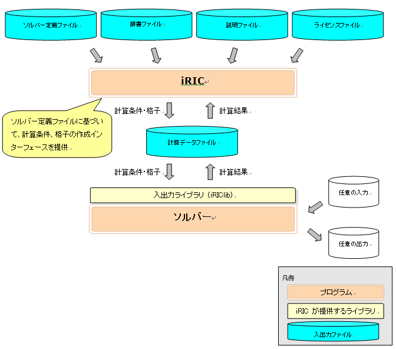

概要
====

ソルバーは、格子、計算条件などに基づいて河川シミュレーションを実行し、計算結果を出力するプログラムです。

iRIC 上で動作するソルバーを開発するには、:numref:`files_related_to_solver`
に示すようなファイルを作成、配置する必要があります。

:numref:`files_related_to_solver` に示したファイルは iRIC インストール先の下の "solvers" フォルダの下に
自分が開発するソルバー専用のフォルダを作成し、その下に配置します。

.. _files_related_to_solver:

.. csv-table:: ソルバー関連ファイル一覧
   :file: files_related_to_solver.csv
   :header-rows: 1

各ファイルの概要は以下の通りです。

definition.xml
--------------

ソルバーに関する以下の情報を定義するファイルです。

- 基本情報
- 計算条件
- 格子属性

iRICはソルバー定義ファイルを読み込むことで、そのソルバーに必要な計算条件、格子を作成するための
インターフェースを提供し、そのソルバー用の計算データファイルを生成します。ソルバー定義ファイルは、
すべて英語で記述します。

ソルバー
--------

河川シミュレーションを実行するプログラムです。iRICで作成した計算条件と格子を読みこんで計算を行い、
結果を出力します。

計算条件、格子、結果の入出力には、iRICが生成する計算データファイルを使用します。ただし、
計算データファイルで入出力を行えないデータについては、任意の外部ファイルを入出力に使うこともできます。

FORTRAN, C言語、C++言語のいずれかの言語で開発します。この章では、
FORTRAN で開発する例を説明します。

translation\_ja\_JP.ts など
---------------------------

ソルバー定義ファイルで用いられている文字列のうち、ダイアログ上などに表示される文字列を翻訳して
表示するための辞書ファイルです。日本語 (translation\_ja\_JP.ts)、韓国語 (translation\_ka\_KR.ts)
など言語ごとに別ファイルとして作成します。

README
------

ソルバーに関する説明を記述するテキストファイルです。iRIC で新しいプロジェクトを開始する時にソルバー
を選択する画面で、説明欄に表示されます。

LICENSE
-------

ソルバーのライセンスについて記述するテキストファイルです。iRICで 新しいプロジェクトを開始する時に
ソルバーを選択する画面で、ライセンス欄に表示されます。

iRIC、ソルバー、関連ファイルの関係を :numref:`relations_between_solver_and_files` に示します。

.. _relations_between_solver_and_files:

   iRIC、ソルバー、関連ファイルの関係図

この章では、この節で説明した各ファイルを作成する手順を順番に説明します。

