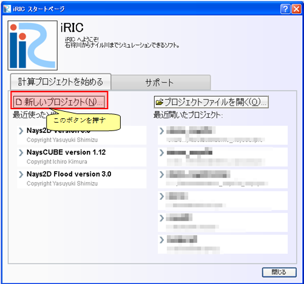
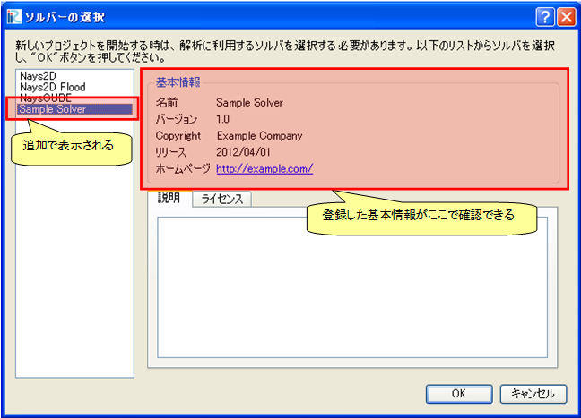

.. _solverdef_create_basic_info:

基本情報の作成
--------------

ソルバーの基本情報を作成します。 :numref:`solverdef_example1` に示すような
ファイルを作り、 :ref:`create_solverdef_folder` で作成した \"example\" フォルダ
の下に \"definition.xml\" の名前で保存します。

.. code-block:: xml
   :caption: 基本情報を記述したソルバー定義ファイルの例
   :name: solverdef_example1
   :linenos:

   <?xml version="1.0" encoding="UTF-8"?>
   <SolverDefinition
     name="samplesolver"
     caption="Sample Solver 1.0"
     version="1.0"
     copyright="Example Company"
     release="2012.04.01"
     homepage="http://example.com/"
     executable="solver.exe"
     iterationtype="time"
     gridtype="structured2d"
   >
     <CalculationCondition>
     </CalculationCondition>
     <GridRelatedCondition>
     </GridRelatedCondition>
   </SolverDefinition>

この時点では、ソルバー定義ファイルの構造は :numref:`solverdef_structure1` 
に示すようになっています。

.. _solverdef_structure1:

.. figure:: images/solverdef_structure1.png

   ソルバー定義ファイルの構造

正しくソルバー定義ファイルが作成できているか確認します。

iRIC を起動します。 :numref:`iric_start_dialog_for_solverdef`
に示すダイアログが表示されますので、「新しいプロジェクト」ボタンを押します。
:numref:`solver_select_dialog_for_solverdef` に示すダイアログが表示されますので、
ソルバーのリストに \"Sample Solver\" があるか確認します。あったらそれをクリックし、
右側に先ほど指定した属性が正しく表示されるか確認します。

なお、このダイアログでは、以下の属性については表示されません。

- name
- executable
- iterationtype
- gridtype

.. _iric_start_dialog_for_solverdef:

   iRIC のスタートダイアログ

.. _solver_select_dialog_for_solverdef:

   ソルバー選択ダイアログ

なお、ここで記述する name 属性と version 属性については、ソルバーのバージョンアップの際に
気をつける必要があります。バージョンアップの際の注意点については
:ref:`notice_about_version` を参照してください。
