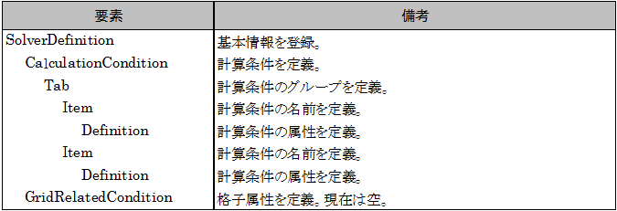

.. _solverdef_define_calccond:

Defining calculation conditions
--------------------------------

Define calculation conditions. Calculation conditions are defined in
\\"CalculationCondition\\" element. Add description of calculation condition
to the solver definition file you created in
:ref:`solverdef_create_basic_info` .
Solver definition file content is now as shown in
:numref:`solverdef_example_with_calccond`.
The added part is shown with highlight.

.. code-block:: xml
   :caption: Example of solver definition file that now has calculation condition definition
   :name: solverdef_example_with_calccond
   :linenos:
   :emphasize-lines: 14-23

   <?xml version="1.0" encoding="UTF-8"?>
   <SolverDefinition
     name="samplesolver"
     caption="Sample Solver"
     version="1.0"
     copyright="Example Company"
     release="2012.04.01"
     homepage="http://example.com/"
     executable="solver.exe"
     iterationtype="time"
     gridtype="structured2d"
   >
     <CalculationCondition>
       <Tab name="basic" caption="Basic Settings">
         <Item name="maxIteretions" caption="Maximum number of Iterations">
           <Definition valueType="integer" default="10">
           </Definition>
         </Item>
         <Item name="timeStep" caption="Time Step">
           <Definition valueType="real" default="0.1">
           </Definition>
         </Item>
       </Tab>
     </CalculationCondition>
     <GridRelatedCondition>
     </GridRelatedCondition>
   </SolverDefinition>

At this point, the structure of the solver definition file is as shown
in :numref:`solverdef_structure_with_calccond`.

.. _solverdef_structure_with_calccond:

   Solver definition file structure

Now make sure that solver definition file is arranged correctly.

Launch iRIC. The [iRIC Start page] dialog
(:numref:`iric_start_dialog_for_solverdef`) will open, so
please click on [Create New Project], select \\"Sample Solver\\" from the
list, and click on [OK]. The Warning dialog
(:numref:`iric_warning_dialog_for_no_elevation`) will be open,
so click on [OK].

.. _iric_warning_dialog_for_no_elevation:

.. figure:: images/iric_warning_dialog_for_no_elevation.png

   The [Warning] dialog

The [Pre-processing Window] will open, so perform the following:

**Menu bar:** --> [Calculation Condition] (C) --> [Setting] (S)

The [Calculation Condition] dialog (:numref:`calccond_dialog_for_solverdef`)
will open. Now you can see that the calculation condition items
you defined in :numref:`solverdef_example_with_calccond` are shown.

.. _calccond_dialog_for_solverdef:

   The [Calculation Condition] dialog

Now add one more group and add calculation condition items. Add 
\\"Water Surface Elevation\\" Tab element just after \\"Basic Settings\\" Tab
element.
:numref:`solverdef_example_with_calccond_additional`
shows the solver definition file that has definition of
\\"Water Surface Elevation\\" Tab. The added part is shown with highlight.

.. code-block:: xml
   :caption: Example of solver definition file that now has calculation condition definition (abbr.)
   :name: solverdef_example_with_calccond_additional
   :linenos:
   :emphasize-lines: 3-22

   (abbr.)
       </Tab>
       <Tab name="surfaceElevation" caption="Water Surface Elevation">
         <Item name="surfaceType" caption="Type">
           <Definition valueType="integer" default="0">
             <Enumeration caption="Constant" value="0" />
             <Enumeration caption="Time Dependent" value="1" />
           </Definition>
         </Item>
         <Item name="constantSurface" caption="Constant Value">
           <Definition valueType="real" default="1">
             <Condition type="isEqual" target="surfaceType" value="0"/>
           </Definition>
         </Item>
         <Item name="variableSurface" caption="Time Dependent Value">
           <Definition valueType="functional">
             <Parameter valueType="real" caption="Time(s)"/>
             <Value valueType="real" caption="Elevation(m) "/>
             <Condition type="isEqual" target="surfaceType" value="1"/>
           </Definition>
         </Item>
       </Tab>
     </CalculationCondition>
     <GridRelatedCondition>
     </GridRelatedCondition>
   </SolverDefinition>

At this point, the structure of the solver definition file is as shown
in :numref:`solverdef_structure_with_calccond_additional`.

.. _solverdef_structure_with_calccond_additional:

.. figure:: images/solverdef_structure_with_calccond_additional.png

   Solver definition file structure

Now make sure that solver definition file is arranged correctly. Do the
operation you did again, to open The [Calculation Condition] dialog
(:numref:`calccond_dialog_with_watersurfaceelevation`).

Now you can see that the new group \\"Water Surface Elevation\\" is added
in the group list. You\\'ll also notice that the
\\"Constant Value\\" item is enabled only when \\"Type\\" value is \\"Constant\\",
and the \\"Time Dependent Value\\" item is enabled only when \\"Type\\" value is
\\"Time Dependent\\".

.. _calccond_dialog_with_watersurfaceelevation:

.. figure:: images/calccond_dialog_with_watersurfaceelevation.png

   The [Calculation Condition] dialog

What it comes down to is:

-  Calculation condition group is defined with \\"Tab\\" element, and
   calculation condition item is defined with \\"Item\\" element.

-  The Structure under \\"Definition\\" elements depends on the condition
   type (i. e. Integer, Real number, functional etc.). Refer to
   :ref:`calccond_def_examples` for examples of calculation condition items for
   each type.

-  Dependenciy between calculation condition items can be defined with
   \\"Condition\\" element. In \\"Condition\\" element, define the condition
   when that item should be enabled. Refer to :ref:`example_of_conditions` for
   examples of \\"Condition\\" element.

-  In this example, the calculation condition dialog shows the items as
   a simple list, but iRIC has feature to show items with more
   complex layouts, like layout with group boxes. Refer to
   :ref:`examples_of_dialog_layout` for more complex layouts.

