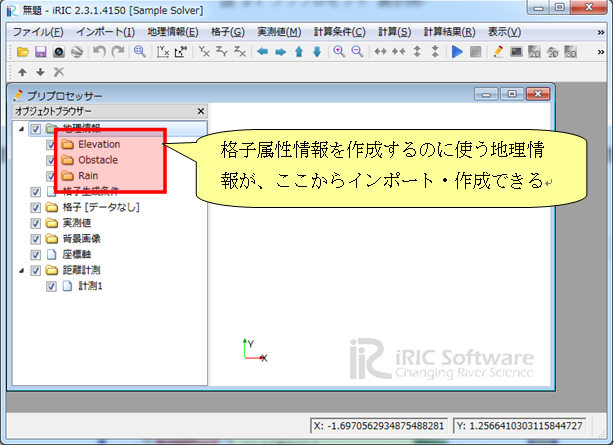

.. _solverdef_define_gridcond:

Defining Grid attributes
-------------------------

Define grid attributes. Grid attributes are defined with
\\"GridRelatedCondition\\" element. Add definition of grid related condition
to the solver definition file you created, as shown in
:numref:`solverdef_example_with_gridcond`.
The added part is shown with highlight.

.. code-block:: xml
   :caption: Example of solver definition file that now has grid related condition (abbr.)
   :name: solverdef_example_with_gridcond
   :linenos:
   :emphasize-lines: 4-17

   (abbr.)
     </CalculationCondition>
     <GridRelatedCondition>
       <Item name="Elevation" caption="Elevation">
         <Definition position="node" valueType="real" default="max" />
       </Item>
       <Item name="Obstacle" caption="Obstacle">
         <Definition position="cell" valueType="integer" default="0">
           <Enumeration value="0" caption="Normal cell" />
           <Enumeration value="1" caption="Obstacle" />
         </Definition>
       </Item>
       <Item name="Rain" caption="Rain">
         <Definition position="cell" valueType="real" default="0">
           <Dimension name="Time" caption="Time" valueType="real" />
         </Definition>
       </Item>
     </GridRelatedCondition>
   </SolverDefinition>

Now make sure that solver definition file is arranged correctly.

Launch iRIC, and starts a new project with solver \\"Sample Solver\\".
Now you will see the [Pre-processing Window] like in
:numref:`preprocessor_with_geographicdata`. 
When you create or import a grid, the [Pre-processing Window] will become like in
:numref:`preprocessor_with_gridattributes`.

When you do not know how to create or import a grid,
refer to the User Manual.

.. _preprocessor_with_geographicdata:

   The [Pre-processing Window]

.. _preprocessor_with_gridattributes:

   The [Pre-processing Window] after creating a grid

When you edit the grid attribute \\"Elevation\\" with the following
procedure, the [Edit Elevation] dialog
(:numref:`dialog_to_edit_elevation`)
will open, and you can check that you can input real number as
\\"Elevation\\" value.

-  Select [Grid] --> [Node attributes] --> [Elevation] in the [Object
   Browser].
-  Select grid nodes with mouse clicking in the canvas area
-  Show context menu with right-clicking, and click on [Edit].

.. _dialog_to_edit_elevation:

.. figure:: images/dialog_to_edit_elevation.png

   The [Edit Elevation] dialog

When you do the same operation against attribute \\"Obstacle\\" to edit
\\"Obstacle\\" value, the [Obstacle edit dialog]
(:numref:`dialog_to_edit_obstacle`) will open,
and you can check that you can select obstacle values from that you
defined in solver definition file, in :numref:`solverdef_example_with_gridcond`.

.. _dialog_to_edit_obstacle:

.. figure:: images/dialog_to_edit_obstacle.png

   The [Obstacle edit dialog]

What it comes down to is:

-  Grid attribute is defined with \\"Item\\" element under
   \\"GridRelatedCondition\\" element.

-  The structure under \\"Item\\" element is basically the same to that for
   calculation condition, but there are different points:

  -  You have to specify \\"position\\" attribute to determine whether that
     attribute is defined at nodes or cells.
  -  You can not use types \\"String\\", \\"Functional\\", \\"File name\\"
     and \\"Folder name\\".
  -  You can not define dependency.
  -  You can define dimension of the attribute, using \\"Dimension\\" element.

For grid attributes, iRIC defines some special names. For attributes for
certain purposes, you should use those names. Refer to Section 7.3.1 for
the special grid attribute names.
