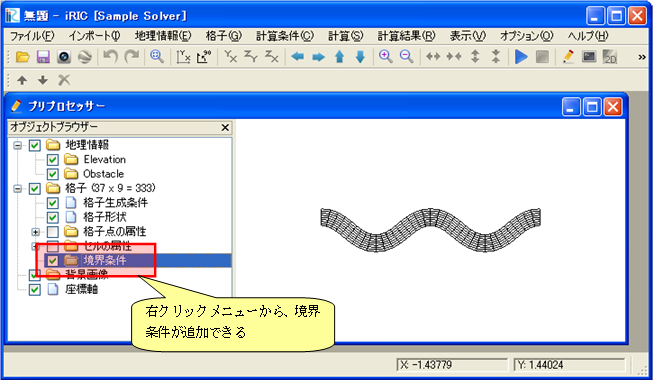
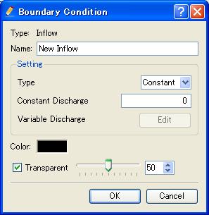
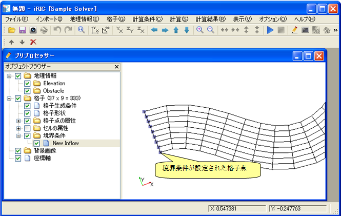

Defining Boundary Conditions
-----------------------------

Define boundary conditions. You can define boundary conditions with
"BoundaryCondition" element. Boundary conditions are not required.

Add definition of "Boundary Condition" to the solver definition file you
created, as shown in :numref:`solverdef_example_with_boundarycond`.
The added part is shown with highlight.

.. code-block:: xml
   :caption: Example of solver definition file that now has boundary
condition (abbr.)
   :name: solverdef_example_with_boundarycond
   :linenos:
   :emphasize-lines: 4-21

   (abbr.)
     </GridRelatedCondition>                                                  |
     <BoundaryCondition name="inflow" caption="Inflow" position="node">
       <Item name="Type" caption="Type">
         <Definition valueType="integer" default="0" >
           <Enumeration value="0" caption="Constant" />
           <Enumeration value="1" caption="Variable" />
         </Definition>
       </Item>
       <Item name="ConstantDischarge" caption="Constant Discharge">
         <Definition valueType="real" default="0">
           <Condition type="isEqual" target="Type" value="0"/>
         </Definition>
       </Item>
       <Item name="FunctionalDischarge" caption="Variable Discharge">
         <Definition conditionType="functional">
           <Parameter valueType="real" caption="Time"/>
           <Value valueType="real" caption="Discharge(m3/s)"/>
           <Condition type="isEqual" target="Type" value="1"/>
         </Definition>
       </Item>
     </BoundaryCondition>
   </SolverDefinition>

Now make sure that solver definition file is arranged correctly.

Launch iRIC, and start a new project with solver "Sample Solver". When
you create or import a grid, the [Pre-processing Window] will become
like  :numref:`preprocessor_with_boundarycondition`.
When you do now know how to create or imprt a grid, refer to the User Manual.

.. _preprocessor_with_boundarycondition:

   The [Pre-processing Window] after creating a grid

Click on [Add new Inflow] on the context menu on [Boundary Condition]
node, and The [Boundary Condition] dialog
(:numref:`boundarycondition_edit_dialog`)
will open, and you can define boundary condition on this dialog.

.. _boundarycondition_edit_dialog:

   The [Boundary Condition] dialog

When you have finished defining boundary condition, click on [OK]. Drag
around the grid nodes to select nodes, and click on [Assign Condition]
in the context menu. :numref:`preprocessor_after_setting_bc
shows an example of a grid with boundary condition.

.. _preprocessor_after_setting_bc:

   Example of a grid with boundary condition

What it comes down to is:

-  Boundary condition is defined Grid attribute is defined with "Item"
   element under "GridRelatedCondition" element.

  -  The structure under "Item" element is the same to that for
     calculation condition.
