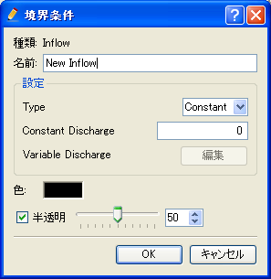

境界条件の定義
--------------

境界条件を定義します。境界条件は、ソルバー定義ファイルの
BoundaryCondition 要素で定義します。
なお、境界条件の定義は必須ではありません。

:ref:`solverdef_define_gridcond` で作成したソルバー定義ファイルに追記し、
BoundaryCondition 要素を :numref:`solverdef_example_with_boundarycond` に
示すように追記し、保存します。追記した部分を強調して示しました。

.. code-block:: xml
   :caption: 境界条件を追記したソルバー定義ファイルの例 (抜粋)
   :name: solverdef_example_with_boundarycond
   :linenos:
   :emphasize-lines: 4-21

   (前略)
     </GridRelatedCondition>                                                  |
     <BoundaryCondition name="inflow" caption="Inflow" position="node">
       <Item name="Type" caption="Type">
         <Definition valueType="integer" default="0" >
           <Enumeration value="0" caption="Constant" />
           <Enumeration value="1" caption="Variable" />
         </Definition>
       </Item>
       <Item name="ConstantDischarge" caption="Constant Discharge">
         <Definition valueType="real" default="0">
           <Condition type="isEqual" target="Type" value="0"/>
         </Definition>
       </Item>
       <Item name="FunctionalDischarge" caption="Variable Discharge">
         <Definition conditionType="functional">
           <Parameter valueType="real" caption="Time"/>
           <Value valueType="real" caption="Discharge(m3/s)"/>
           <Condition type="isEqual" target="Type" value="1"/>
         </Definition>
       </Item>
     </BoundaryCondition>
   </SolverDefinition>

正しくソルバー定義ファイルが作成できているか確認します。

iRIC を起動して、ソルバー \"Sample Solver\" の新しいプロジェクトを開始します。
格子を作成したりインポートしたりすると、 :numref:`preprocessor_with_boundarycondition`
のようになります。なお、格子の作成やインポートの方法が分からない場合、
ユーザマニュアルを参照して下さい。

.. _preprocessor_with_boundarycondition:

   プリプロセッサ 表示例 (格子作成後)

右クリックメニューから「新しい Inflow の追加」を選択すると、
:numref:`boundarycondition_edit_dialog`
に示すダイアログが表示され、境界条件を定義することが出来ます。

.. _boundarycondition_edit_dialog:

   境界条件の編集ダイアログ

境界条件を定義した後、格子点を選択して右クリックメニューから「追加」を選択することで
流入口にする格子点を設定できます。設定後の画面表示例を
:numref:`preprocessor_after_setting_bc` に示します。

.. _preprocessor_after_setting_bc:

   境界条件を設定した格子の表示例

境界条件の定義についてまとめると、以下の通りです。

- 境界条件は、 BoundaryCondition 要素で指定します。

  - Item 要素以下の構造は計算条件の Item
    と基本的には同じです。計算条件と同様、依存性なども定義できます。

