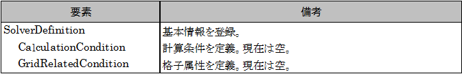
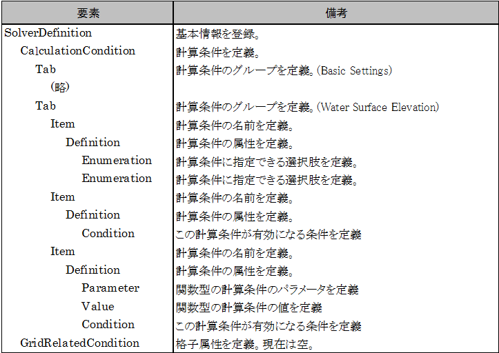
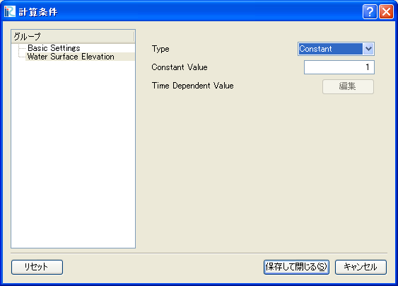

.. _create_solverdef_folder:

フォルダの作成
==============

iRIC のインストールフォルダ の下にある "solvers"
フォルダの下に、開発するソルバーのための専用のフォルダを作成します。今回は、 "example"
というフォルダを作成します。

ソルバー定義ファイルの作成
==========================

ソルバー定義ファイルを作成します。

ソルバー定義ファイルは、ソルバーに関する :numref:`infos_to_define_in_solverdef`
に示す情報を定義します。

.. _infos_to_define_in_solverdef:

.. csv-table:: ソルバー定義ファイルで定義する情報
   :file: infos_to_define_in_solverdef.csv
   :header-rows: 1

ソルバー定義ファイルは、マークアップ言語の一種であるXML言語で記述します。
XML言語の基礎については 5.5 を参照してください。

この節では、ソルバー定義ファイルを、:numref:`infos_to_define_in_solverdef`
に示した順で作成していきます。

.. _solverdef_create_basic_info:

基本情報の作成
--------------

ソルバーの基本情報を作成します。 :numref:`solverdef_example1` に示すような
ファイルを作り、 :ref:`create_solverdef_folder` で作成した "example" フォルダ
の下に "definition.xml" の名前で保存します。

.. code-block:: xml
   :caption: 基本情報を記述したソルバー定義ファイルの例
   :name: solverdef_example1
   :linenos:

   <?xml version="1.0" encoding="UTF-8"?>
   <SolverDefinition
     name="samplesolver"
     caption="Sample Solver 1.0"
     version="1.0"
     copyright="Example Company"
     release="2012.04.01"
     homepage="http://example.com/"
     executable="solver.exe"
     iterationtype="time"
     gridtype="structured2d"
   >
     <CalculationCondition>
     </CalculationCondition>
     <GridRelatedCondition>
     </GridRelatedCondition>
   </SolverDefinition>

この時点では、ソルバー定義ファイルの構造は :numref:`solverdef_structure1` 
に示すようになっています。

.. _solverdef_structure1:

   ソルバー定義ファイルの構造

正しくソルバー定義ファイルが作成できているか確認します。

iRIC を起動します。 :numref:`iric_start_dialog_for_solverdef`
に示すダイアログが表示されますので、「新しいプロジェクト」ボタンを押します。
:numref:`solver_select_dialog_for_solverdef` に示すダイアログが表示されますので、
ソルバーのリストに "Sample Solver" があるか確認します。あったらそれをクリックし、
右側に先ほど指定した属性が正しく表示されるか確認します。

なお、このダイアログでは、以下の属性については表示されません。

- name
- executable
- iterationtype
- gridtype

.. _iric_start_dialog_for_solverdef:

.. figure:: images/iric_start_dialog.png

   iRIC のスタートダイアログ

.. _solver_select_dialog_for_solverdef:

.. figure:: images/solver_select_dialog.png

   ソルバー選択ダイアログ

なお、ここで記述する name 属性と version 属性については、ソルバーのバージョンアップの際に
気をつける必要があります。バージョンアップの際の注意点については5.5節を参照してください。

計算条件の定義
--------------

計算条件を定義します。計算条件は、ソルバー定義ファイルの
CalculationCondition 要素で定義します。 :ref:`solverdef_create_basic_info`
で作成したソルバー定義ファイルに追記し、 :numref:`solverdef_example_with_calccond`
に示すようなファイルにし、保存します。追記した部分を強調して示しました。

.. code-block:: xml
   :caption: 計算条件を追記したソルバー定義ファイルの例
   :name: solverdef_example_with_calccond
   :linenos:
   :emphasize-lines: 14-23

   <?xml version="1.0" encoding="UTF-8"?>
   <SolverDefinition
     name="samplesolver"
     caption="Sample Solver"
     version="1.0"
     copyright="Example Company"
     release="2012.04.01"
     homepage="http://example.com/"
     executable="solver.exe"
     iterationtype="time"
     gridtype="structured2d"
   >
     <CalculationCondition>
       <Tab name="basic" caption="Basic Settings">
         <Item name="maxIteretions" caption="Maximum number of Iterations">
           <Definition valueType="integer" default="10">
           </Definition>
         </Item>
         <Item name="timeStep" caption="Time Step">
           <Definition valueType="real" default="0.1">
           </Definition>
         </Item>
       </Tab>
     </CalculationCondition>
     <GridRelatedCondition>
     </GridRelatedCondition>
   </SolverDefinition>

この時点では、ソルバー定義ファイルの構造は :numref:`solverdef_structure_with_calccond`
に示すようになっています。

.. _solverdef_structure_with_calccond:

.. figure:: images/solverdef_structure_with_calccond.png

   ソルバー定義ファイルの構造

正しくソルバー定義ファイルが作成できているか確認します。

iRIC を起動します。:numref:`iric_start_dialog_for_solverdef`
に示すダイアログが表示されますので、「新しいプロジェクト」ボタンを押して、ソルバーの
リストから "Sample Solver" をクリックし、 "OK" ボタンを押します。
:numref:`iric_warning_dialog_for_no_elevation`
に示すダイアログが表示されますが、 "OK" ボタンを押して進みます。

.. _iric_warning_dialog_for_no_elevation:

.. figure:: images/iric_warning_dialog_for_no_elevation.png

   警告ダイアログ 表示例

プリプロセッサが表示されますので、以下の操作を行います。

**メニュー:** --> 計算条件(C) --> 設定(S)

すると、 :numref:`calccond_dialog_for_solverdef`
に示すダイアログが表示されます。 :numref:`solverdef_example_with_calccond` で追記した
内容に従って表示されているのが分かります。

.. _calccond_dialog_for_solverdef:

.. figure:: images/calccond_dialog.png

   計算条件設定ダイアログ 表示例

グループを増やして、さらに計算条件を追加します。Basic Settings の Tab要素 のすぐ下に、
"Water Surface Elevation" というグループを追加して保存します。追記した
ソルバー定義ファイルの抜粋を、 :numref:`solverdef_example_with_calccond_additional`
に示します。追記した部分を強調して示しました。

.. code-block:: xml
   :caption: 計算条件を追記したソルバー定義ファイルの例 (抜粋)
   :name: solverdef_example_with_calccond_additional
   :linenos:
   :emphasize-lines: 3-22

   (前略)
       </Tab>
       <Tab name=”surfaceElevation” caption=”Water Surface Elevation”>
         <Item name=”surfaceType” caption=”Type”>
           <Definition valueType=”integer” default=”0”>
             <Enumeration caption=”Constant” value=”0” />
             <Enumeration caption=”Time Dependent” value=”1” />
           </Definition>
         </Item>
         <Item name=”constantSurface” caption=”Constant Value”>
           <Definition valueType=”real” default=”1”>
             <Condition type="isEqual" target="surfaceType" value="0"/>
           </Definition>
         </Item>
         <Item name=”variableSurface” caption=”Time Dependent Value”>
           <Definition valueType=”functional”>
             <Parameter valueType="real" caption="Time(s)"/>
             <Value valueType="real" caption="Elevation(m) "/>
             <Condition type="isEqual" target="surfaceType" value="1"/>
           </Definition>
         </Item>
       </Tab>
     </CalculationCondition>
     <GridRelatedCondition>
     </GridRelatedCondition>
   </SolverDefinition>

この時点では、ソルバー定義ファイルの構造は
:numref:`solverdef_structure_with_calccond_additional` に示すようになっています。

.. _solverdef_structure_with_calccond_additional:

   ソルバー定義ファイルの構造

正しくソルバー定義ファイルが作成できているか確認します。先ほどと同じ手順で
ダイアログを表示します。

"Water Surface Elevation" というグループがリストに表示されているのが分かります。
また、 "Constant Value" は、 "Type" で "Constant" を選択している時のみ、
"Time Dependent Value" は、 "Type" で "Time Dependent" を選択している時のみ有効です。

ダイアログの表示例を :numref:`calccond_dialog_with_watersurfaceelevation`
に示します。

.. _calccond_dialog_with_watersurfaceelevation:

   ソルバー定義ファイルの構造

計算条件の定義についてまとめると、以下の通りです。

- 計算条件のグループは Tab要素で、計算条件は Item要素で指定します。

- Definition 要素以下の構造は、計算条件の種類 (例: 整数、実数、整数からの選択、関数型)
  によって異なります。計算条件の種類ごとの記述方法とダイアログ上での表示については
  5.3.1 を参照して下さい。

- 計算条件には、 Condition 要素で依存関係を定義できます。Condition要素では、その計算条件
  が有効になる条件を指定します。 Condition 要素の定義方法の例は、5.3.2 を参照して下さい。

- この例では、計算条件のダイアログを単純なリスト形式で作成しましたが、
  グループボックスを使うなどしてダイアログのレイアウトをカスタマイズすることができます。
  ダイアログのレイアウトのカスタマイズ方法については 5.3.3 を参照して下さい。
