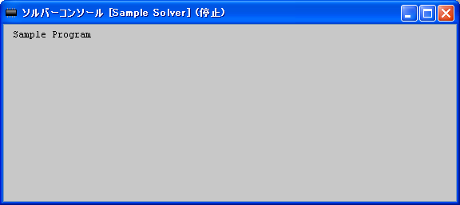

.. _solver_dev_skeleton:

Creating a skelton
-------------------

First, create a scelton of a solver. Create a new file with the source
code in :numref:`solver_skeleton`, and save as \"sample.f90\".
At this point, the solver does nothing.

Compile this source code. The way to compile a source code differs by
the compiler. Refer to :ref:`how_to_link` for the procedure
to compile using Intel Fortran Compiler and gfortran.

.. code-block:: fortran
   :caption: Sample solver source code
   :name: solver_skeleton
   :linenos:

   program SampleProgram
     implicit none
     include 'cgnslib_f.h'
     include 'iriclib_f.h'

     write(*,*) "Sample Program"
     stop
   end program SampleProgram

When it was compiled successfully, copy the executable file to the
folder you created in :ref:`create_solverdef_folder`, and
rename it into the name you specified as [executable] attribute in
:ref:`solverdef_create_basic_info`. This time, rename
into \"solver.exe\". Copy the DLL files into that folder, that is needed
to run the solver.

Now check whether it can be launched from iRIC successfully.

Starts a new project that uses \"Example Solver\", and performs the
following:

**Menu bar**: [Simulation] (S) --> [Run] (R)

The [Solver Console] opens, and the message \"Sample Program\" will be
shown (:numref:`solverconsole_only_message`).
If the message is shown, it means that the solver
was launched by iRIC successfully.

.. _solverconsole_only_message:

   The [Solver Console]

