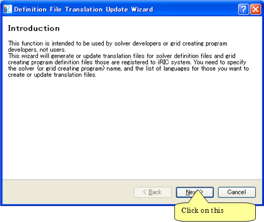
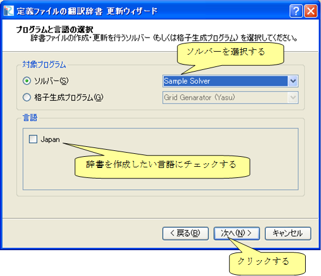
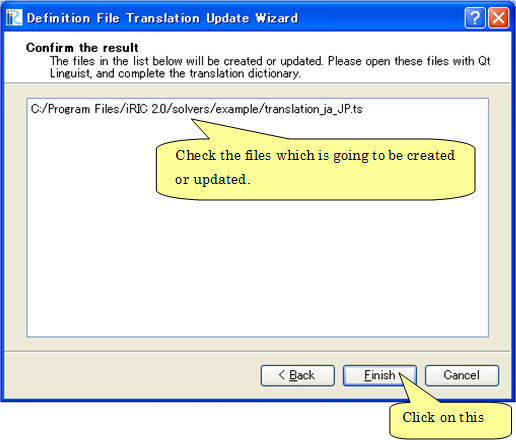
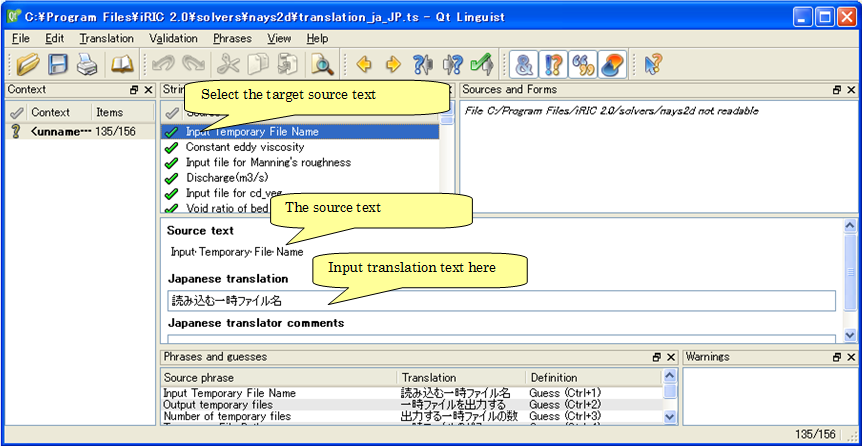
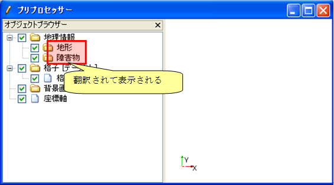
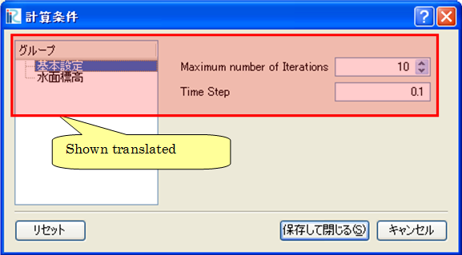

.. _how_to_setup_dictionary:

ソルバー定義ファイルの辞書ファイルの作成
----------------------------------------

ソルバー定義ファイルで用いられている文字列のうち、
ダイアログ上などに表示される文字列を翻訳して表示するための
辞書ファイルを作成します。

まず、iRIC から、以下のメニューを起動します。
すると、ソルバー定義ファイルの辞書更新ウィザードが表示されます。
ダイアログの表示例を、
:numref:`dict_wizard_intro` ～ :numref:`dict_wizard_confirm`
に示します。

**メニュー:** オプション(O) --> 辞書ファイルの作成・更新(C)

.. _dict_wizard_intro:

   ソルバー定義ファイルの辞書更新ウィザード 表示例 (1ページ目)

.. _dict_wizard_select_solver:

   ソルバー定義ファイルの辞書更新ウィザード 表示例 (2ページ目)

.. _dict_wizard_confirm:

   ソルバー定義ファイルの辞書更新ウィザード 表示例 (3ページ目)

辞書ファイルは、ソルバー定義ファイルと同じフォルダに作成されます。
作成された辞書ファイルは、翻訳前の英語のみが含まれています。
辞書ファイルはテキストファイルですので、テキストエディタなどで開いて編集します。
辞書ファイルは、文字コードに UTF-8 を指定して保存してください。

辞書ファイルの編集例を、 :numref:`translation_dict_before` 、
:numref:`translation_dict_before` に示します。
例に示したように、translation
要素の中に翻訳後の文字列を追記してください。

表 2?16 ソルバー定義ファイルの辞書ファイルの一部 (編集前)

.. code-block:: xml
   :caption: ソルバー定義ファイルの辞書ファイルの一部 (編集前)
   :name: translation_dict_before
   :linenos:

   <message>
     <source>Basic Settings</source>
     <translation></translation>
   </message>

.. code-block:: xml
   :caption: ソルバー定義ファイルの辞書ファイルの一部 (編集後)
   :name: translation_dict_after
   :linenos:
   :emphasize-lines: 3

   <message>
     <source>Basic Settings</source>
     <translation>基本設定</translation>
   </message>

なお、辞書ファイルは、Qt に付属する Qt Linguist
を利用して編集することもできます。Qt Linguist の画面表示例を 図 2?18
に示します。Qt Linguist は、以下の URL からダウンロードできる Qt
に含まれています。

`https://www.qt.io/download/ <https://www.qt.io/download/>`_

.. _qt_linguist_screenshot:

   Qt Linguist 画面表示例

翻訳が完了したら、iRICを確認したい言語に切り替えてから iRIC を起動し直し、
正しく翻訳されて表示されるか確認します。翻訳完了後のプリプロセッサ、
計算条件設定ダイアログの表示例をそれぞれ
:numref:`translation_example_pre_objbrowser`,
:numref:`translation_example_pre_calccond`
に示します。

.. _translation_example_pre_objbrowser:

    翻訳完了後のプリプロセッサ 表示例

.. _translation_example_pre_calccond:

   翻訳完了後の計算条件設定ダイアログ 表示例

