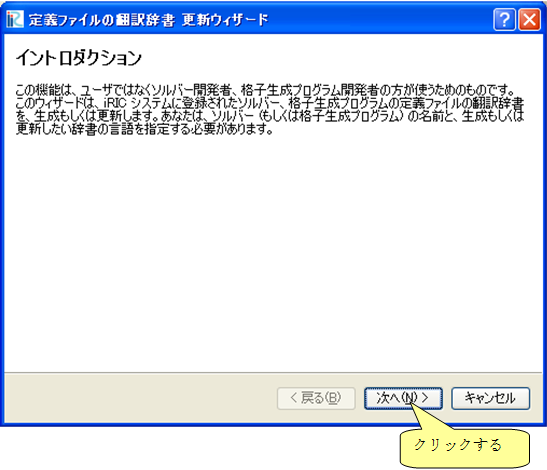
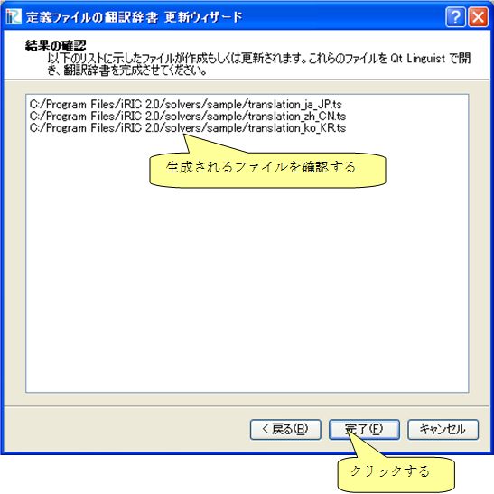
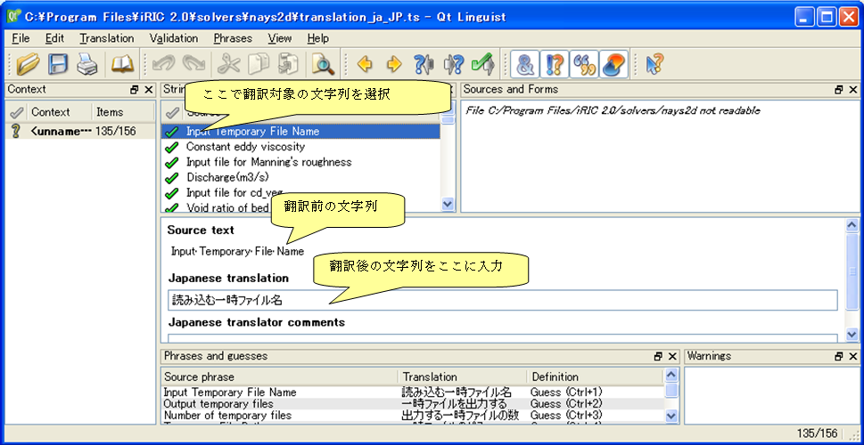
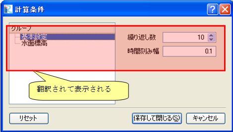

.. _how_to_setup_dictionary:

Creating a solver definition dictionary file
--------------------------------------------

Create a solver definition dictionary file that is used to translate the
strings used in solver definition files, and shown on dialogs etc.

First, launch iRIC and perform the following:

**Menu bar:** [Option] (O) --> [Create/Update Translation Files] (C)

The [Definition File Translation Update Wizard] 
(:numref:`dict_wizard_intro` to 
:numref:`dict_wizard_confirm`) will open. 
Following the wizard, the dictionary files are created
or updated.

.. _dict_wizard_intro:

   The [Definition File Translation Update Wizard] (Page 1)

.. _dict_wizard_select_solver:

.. figure:: images/dict_wizard_select_solver.png
   :width: 340pt

   The [Definition File Translation Update Wizard] (Page 2)

.. _dict_wizard_confirm:

   The [Definition File Translation Update Wizard] (Page 3)

The dictionary files are created in the folder that you created in
:ref:`create_solverdef_folder`.
The files created only include the texts before translation
(i. e. English strings). The dictionary files are text files, so you can
use text editors to edit it. Save the dictionary files with UTF-8
encoding.

:numref:`translation_dict_before` and :numref:`translation_dict_after`
show the example of editing a dictionary file.
As the example shows, you have to add translated texts in \"translation\"
element.

.. code-block:: xml
   :caption: The Dictionary file of solver definition file (before editing)
   :name: translation_dict_before
   :linenos:

   <message>
     <source>Basic Settings</source>
     <translation></translation>
   </message>

.. code-block:: xml
   :caption: The Dictionary file of solver definition file (after editing)
   :name: translation_dict_after
   :linenos:
   :emphasize-lines: 3

   <message>
     <source>Basic Settings</source>
     <translation>基本設定</translation>
   </message>

You can use [Qt Linguist] for translating the dictionary file. [Qt
Linguist] is bundled in Qt, and it provides GUI for editing the
dictionary file.
:numref:`qt_linguist_screenshot` shows the [Qt Linguist]. Qt can be
downloaded from the following URL:

`https://www.qt.io/download/ <https://www.qt.io/download/>`_

.. _qt_linguist_screenshot:

   The [Qt Linguist]

When the translation is finished, switch the iRIC language from
Preferences dialog, restart iRIC, and check whether the translation is
complete.
:numref:`translation_example_pre_objbrowser` and
:numref:`translation_example_pre_calccond`
shows examples of [Pre-processing Window] and
[Calculation Condition] dialog after completing transtaion
of dictionary.

.. _translation_example_pre_objbrowser:

   [Pre-processor Window] after completing translation of dictionary (Japanese mode)

.. _translation_example_pre_calccond:

   The [Calculation Condition] dialog after completing translation of dictionary (Japanese mode)
