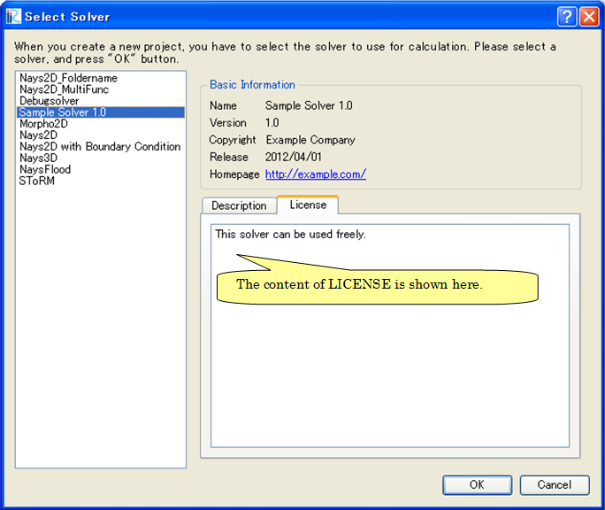

.. _how_to_setup_readme:

説明ファイルの作成
------------------

ソルバーの概要などについて説明するファイルを作成します。

README というファイル名のテキストファイルを、
:ref:`create_solverdef_folder`
で作成したフォルダの下に作成します。文字コードは UTF-8 にします。

説明ファイルは、以下の例のようなファイル名で言語ごとに用意します。
言語ごとの説明ファイルがない場合、 README が使用されます。

- 英語: README
- 日本語: README_ja_JP

\\"README\_\\" 以降につく文字列は、辞書ファイルの \\"translation\_\*\*\*\*\*.ts\\" の
\\"\*\*\*\*\*\\" の部分と同じですので、日本語以外の説明ファイルを作る際のファイル名は、
辞書ファイルのファイル名を参考にして決めて下さい。

説明ファイルの内容は、iRIC 上で新規プロジェクトを作成する際のソルバー選択ダイアログで、
説明タブに表示されます。
ファイルを作成したら、iRIC 上で正しく表示されるか確認して下さい。
ダイアログの表示例を、 :numref:`screenshot_for_readme` に示します。

.. _screenshot_for_readme:

   ソルバー選択ダイアログ 表示例

