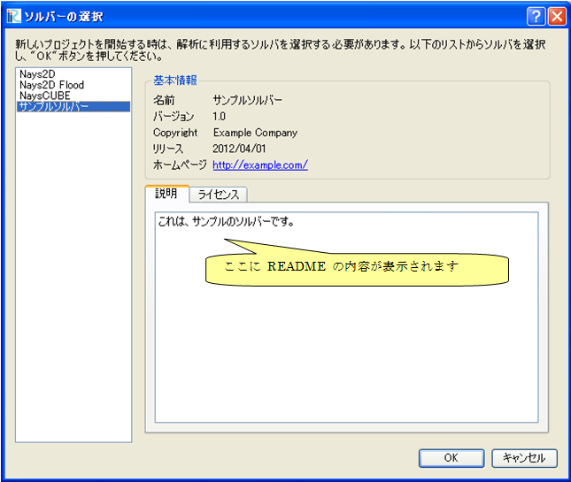

.. _how_to_setup_readme:

Creating a README file
-----------------------

Creates a text file that explains the abstract of the solver.

Creates a text file with name \\"README\\" in the folder you created in
:ref:`create_solverdef_folder`. Save the file with UTF-8 encoding.

You should create the README file with the file names like below. When
the language-specific README file does not exists, \\"README\\" file (in
English) will be used.

-  English: \\"README\\"
-  Japanese: \\"README\_ja\_JP\\"

The postfix (ex. \\"ja\_JP\\") is the same to that for dictionary files
created in :ref:`how_to_setup_dictionary`.

The content of \\"README\\" will be shown in \\"Description\\" area on the
[Select Solver] dialog. When you created \\"README\\",
opens the [Select Solver] dialog by starting a new project,
and check whether the content is shown on that dialog.

.. _screenshot_for_readme:

   The [Select Solver] dialog

