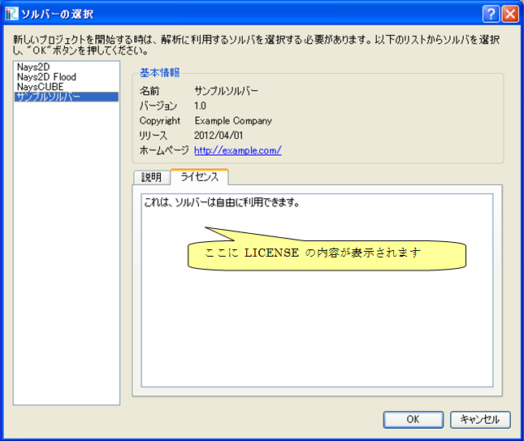

.. _how_to_setup_license:

ライセンス情報ファイルの作成
----------------------------

ソルバーの利用ライセンスについて説明するファイルを作成します。

LICENSE というファイル名のテキストファイルを、
:ref:`create_solverdef_folder`
で作成したフォルダの下に作成します。文字コードは UTF-8 にします。

ライセンス情報ファイルは、以下の例のようなファイル名で言語ごとに用意します。
言語ごとのライセンスファイルがない場合、 LICENSE が使用されます。

- 英語: LICENSE
- 日本語: LICENSE_ja_JP

\\"LICENSE\_\\" 以降につく文字列は、辞書ファイルの
\\"translation\_\*\*\*\*\*.ts\\" の \\"\*\*\*\*\*\\" の部分と同じですので、
日本語以外の説明ファイルを作る際のファイル名は、
辞書ファイルのファイル名を参考にして決めて下さい。

ライセンス情報ファイルの内容は、iRIC 上で新規プロジェクトを作成する際の
ソルバー選択ダイアログで、ライセンスタブに表示されます。
ファイルを作成したら、iRIC 上で正しく表示されるか確認して下さい。
ダイアログの表示例を、 :numref:`screenshot_for_license` に示します。

.. _screenshot_for_license:

   ソルバー選択ダイアログ 表示例

