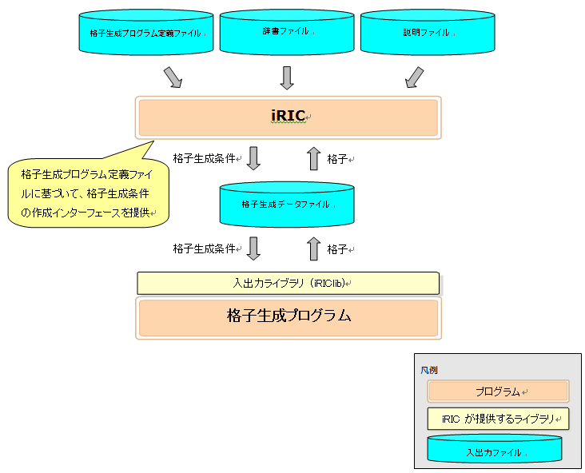

Abstract
=========

Grid generating program is a program that load grid creating conditions
and generate a grid. The program can be used seamlessly from iRIC as one
of the grid generating algorithms.

To add a grid generating program that can be used from iRIC, it is
necessary to make and deploy files shown in 
:numref:`files_related_to_gridgen`.

Grid generating program
developers have to create a new folder under "gridcreators" folder, and
deploy files related to the new grid generating program under that.

.. _files_related_to_gridgen:

.. csv-table:: Files related to grid generating programs
   :file: files_related_to_gridgen.csv
   :header-rows: 1

Abstracts of each file are as follows:

definition.xml
--------------

File that defines the following information of grid generating programs:

-  Basic Information
-  Grid generating condition

iRIC loads definition.xml, and provides interface for creating grid
generating conditions that can be used by the grid generating program.
iRIC make the grid generating program available only when the solver
supports the grid type that the grid generating program generate.

definition.xml should be written in English.

Grid Generating program
------------------------

Executable module of a grid generating program. It loads grid generating
condition, generate a grid, and outputs it.

Grid generating programs use grid generating data file created by iRIC,
for loading and writing grid generating condition and grids.

Grid generating programs can be developed using FORTRAN, C, or C++. In
this chapter, a sample grid generating program is developed in FORTRAN.

translation\_ja\_JP.ts etc.
---------------------------

Dictionary files for a grid generating program definition file. It
provides translation information for strings shown on dialogs in iRIC.
Dictionary files are created one file for each language. For example,
"translation\_ja\_JP.ts" for Japanese, "translation\_ka\_KR.ts" for
Korean.

README
------

README is a text file that describes about the grid generating program.
The content of README is shown in the “Description” area on [Select Grid
Creating Algorithm] dialog].

:numref:`relations_between_gridgen_and_files` shows the relationship
between iRIC, grid generating program
and related files.

.. _relations_between_gridgen_and_files:

   The relationships between iRIC, grid generating programs, and related files

This chapter explains the steps to create the files described in this
section.
