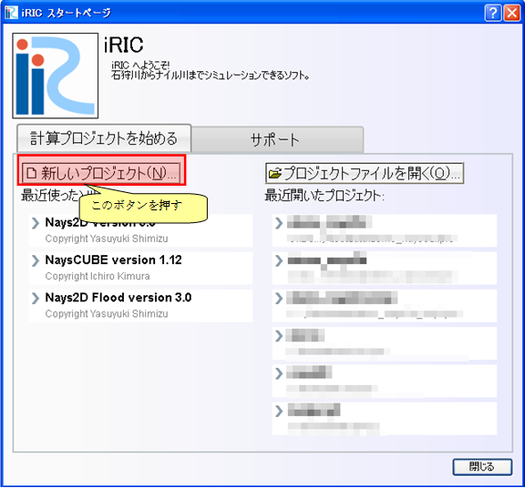

.. _gridgendef_create_basic_info:

基本情報の作成
--------------

ソルバーの基本情報を作成します。 :numref:`gridgendef_example1` に示すような
ファイルを作り、 :ref:`create_gridgen_folder` で作成した \\"example\\" フォルダ
の下に \\"definition.xml\\" の名前で保存します。

.. code-block:: xml
   :caption: 基本情報を記述した格子生成プログラム定義ファイルの例
   :name: gridgendef_example1
   :linenos:

   <?xml version="1.0" encoding="UTF-8"?>
   <GridGeneratorDefinition
     name="samplecreator"
     caption="Sample Grid Creator"
     version="1.0"
     copyright="Example Company"
     executable="generator.exe"
     gridtype="structured2d"
   >
     <GridGeneratingCondition>
     </GridGeneratingCondition>
   </GridGeneratorDefinition>

この時点では、格子生成プログラム定義ファイルの構造は
:numref:`gridgendef_structure1` 
に示すようになっています。

.. _gridgendef_structure1:

.. figure:: images/gridgendef_structure1.png

   格子生成プログラム定義ファイルの構造

正しく定義ファイルが作成できているか確認します。

iRIC を起動します。 :numref:`iric_start_dialog_for_gridgendef`
に示すダイアログが表示されますので、「新しいプロジェクト」ボタンを押します。
:numref:`solver_select_dialog_for_gridgendef`
に示すダイアログが表示されますので、 \\"Nays2D\\"  を選択して \\"OK\\" ボタンを押し、
新しいプロジェクトを開始します。

次に、メニューから以下の操作を行い、格子生成アルゴリズムの選択画面を表示します。

**メニュー**: 格子(C) --> 格子生成アルゴリズムの選択(S)

格子生成アルゴリズムの選択ダイアログの表示例を
:numref:`gridgen_select_dialog` に示します。
ここに、先ほど作成した定義ファイルで指定した \\"Sample Grid Creator\\"
が表示されていることを確認します。確認できたら、キャンセルボタンを押します。

.. _iric_start_dialog_for_gridgendef:

   iRIC のスタートダイアログ

.. _solver_select_dialog_for_gridgendef:

   ソルバー選択ダイアログ

.. _gridgen_select_dialog:

.. figure:: images/gridgen_select_dialog.png

   格子生成アルゴリズム選択ダイアログ
