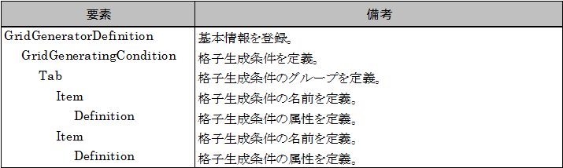
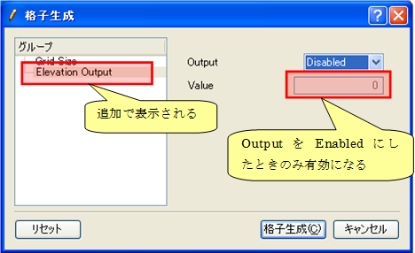

.. _gridgendef_define_gridgencond:

Defining grid generating conditions
------------------------------------

Define grid generating conditions. Grid generating conditions are
defined in \\"GridGeneratingCondition\\" element in a grid generating
program definition file. Add description of grid generating condition to
the grid generating program definition file you created in 
:ref:`gridgendef_create_basic_info`, and overwrite it.
Grid generating program definition file content
is now as shown in :numref:`gridgendef_example_with_gridgencond`.
The added part is shown with highlight.

.. code-block:: xml
   :caption: Example of grid generating program definition file that now has grid generating condition definition
   :name: gridgendef_example_with_gridgencond
   :linenos:
   :emphasize-lines: 11-18

   <?xml version="1.0" encoding="UTF-8"?>
   <GridGeneratorDefinition 
     name="samplecreator"
     caption="Sample Grid Creator"
     version="1.0"
     copyright="Example Company"
     executable="generator.exe"
     gridtype="structured2d"
   >
     <GridGeneratingCondition>
       <Tab name="size" caption="Grid Size">
         <Item name="imax" caption="IMax">
           <Definition valueType="integer" default="10" max="10000" min="1" />
         </Item>
         <Item name="jmax" caption="JMax">
           <Definition valueType="integer" default="10" max="10000" min="1" />
         </Item>
       </Tab>
     </GridGeneratingCondition>
   </GridGeneratorDefinition>

At this point, the structure of the grid generating program definition
file is as shown in :numref:`gridgen_structure_with_gridgencond`.

.. _gridgen_structure_with_gridgencond:

   Grid generating program definition file structure

Now make sure that grid generating program definition file is arranged
correctly.

Launch iRIC, and opens the [Select Grid Generating Algorithm] dialog
with the same procedure in :ref:`gridgendef_create_basic_info`.
Select \\"Sample Grid Creator\\" in the list, and click on [OK].

The [Grid Creation] dialog (:numref:`gridgen_cond_dialog_base`)
will open. Now you can see that
the grid generating condition items you defined are shown. When you
checked, click on [Cancel] to close the dialog.

.. _gridgen_cond_dialog_base:

.. figure:: images/gridgen_cond_dialog_base.png

   The [Grid Creation] dialog

Now add one more group and add grid generating condition items. Add
\\"Elevation Output\\" Tab element just under \\"Grid Size\\" Tab element.
The added part is shown with highlight.

.. code-block:: xml
   :caption: Example of grid generating program definition file that now has grid generating condition definition
   :name: gridgendef_example_with_gridgencond_advanced
   :linenos:
   :emphasize-lines: 3-15

       (abbr.)
       </Tab>
       <Tab name="elevation" caption="Elevation Output">
         <Item name="elev_on" caption="Output">
           <Definition valueType="integer" default="0">
             <Enumeration caption="Enabled" value="1" />
             <Enumeration caption="Disabled" value="0" />
           </Definition>
         </Item>
         <Item name="elev_value" caption="Value">
           <Definition valueType="real" default="0">
             <Condition type="isEqual" target="elev_on" value="1" />
           </Definition>
         </Item>
       </Tab>
     </GridGeneratingCondition>
   </GridGeneratorDefinition>

At this Point, the structure of grid generating program definition file
is as shown in :numref:`gridgen_structure_with_gridgencond_advanced`.

.. _gridgen_structure_with_gridgencond_advanced:

   Grid generating program definition file structure

Now make sure that grid generating program definition file is arranged
correctly. Do the operation you did again, to show the [Grid Creation]
dialog (:numref:`gridgen_cond_dialog_advanced`).

Now you\\'ll see that the new group \\"Elevation Output\\" in the group
list. You\\'ll also notice that \\"Value\\" item is
enabled only when \\"Output\\" value is \\"Enabled\\".

.. _gridgen_cond_dialog_advanced:

   The [Grid Creation] dialog

What it comes down to is:

-  Grid generating condition group is defined with \\"Tab\\" element, and
   grid generating condition item is defined with \\"Item\\" element.

-  The Structure under \\"Definition\\" elements depends on the condition
   type (i. e. Integer, Real number, functional etc.). Refer to Section
   5.3.1 for examples of grid generating condition items for each type.

-  Dependenciy between grid generating condition items can be defined
   with \\"Condition\\" element. In \\"Condition\\" element, define the
   condition when that item should be enabled. Refer to Section 5.3.2
   for examples of \\"Condition\\" element.

-  In this example, the calculation condition dialog shows the items as
   a simple list, but iRIC has feature to show items with more complex
   layouts, like layout with group boxes. Refer to Section 5.3.3 for
   more complex calculation condition page layouts.
