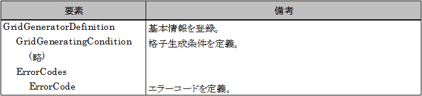

.. _gridgendef_define_errorcode:

Defining error codes
---------------------

Define error codes of errors that occurs in grid generating program, and
the messages that correspond to them. Error codes can be defined with
ErrorCode elements in grid generating program definition file. Add
definitions to the definition file you created, as shown in
:numref:`gridgendef_example_with_errorcode`.
The added part is shown with highlight.

.. code-block:: xml
   :caption: Example of grid generating program definition file that now has error codes
   :name: gridgendef_example_with_errorcode
   :linenos:
   :emphasize-lines: 5-7

   (abbr.)
         </Item>
       </Tab>
     </GridGeneratingCondition>
     <ErrorCodes>
       <ErrorCode value="1" caption="IMax * JMax must be smaller than 100,000." />
     </ErrorCodes>
   </GridGeneratorDefinition>

At this Point, the structure of grid generating program definition file
is as shown in :numref:`gridgendef_structure_with_error`.
The ErrorCodes element is not required.

.. _gridgendef_structure_with_error:

   The grid generating program definition file structure

You can not check whether ErrorCode element is properly defined until
you create a grid generating program. You are going to check it in
:ref:`gridgenerator_add_errorhandling`.
