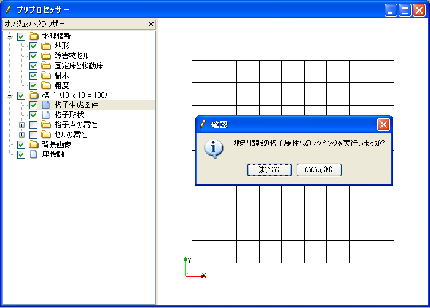

.. _gridgenerator_add_groudoutput:

格子の出力処理の記述
---------------------

格子の出力処理を記述します。

まずは、iRIC との連携が正しく行えることを確認するため、
単純な格子を生成して出力する処理を記述します。

格子を出力する処理を追記したソースコードを
:numref:`gridgenerator_with_grid_output`
に示します。追記した部分を強調して示します。

.. code-block:: fortran
   :caption: 格子を出力する処理を追記したソースコード
   :name: gridgenerator_with_grid_output
   :linenos:
   :emphasize-lines: 7-8,25-40

   program SampleProgram
     implicit none
     include 'cgnslib_f.h'
   
     integer:: fin, ier
     integer:: icount, istatus
     integer:: imax, jmax
     double precision, dimension(:,:), allocatable::grid_x, grid_y
     character(200)::condFile  
   
     icount = nargs()
     if ( icount.eq.2 ) then
       call getarg(1, condFile, istatus)
     else
       stop "Input File not specified."
     endif
   
     ! 格子生成データファイルを開く
     call cg_open_f(condFile, CG_MODE_MODIFY, fin, ier)
     if (ier /=0) stop "*** Open error of CGNS file ***"
   
     ! 内部変数の初期化。戻り値は 1 になるが問題ない。
     call cg_iric_init_f(fin, ier)
   
     imax = 10
     jmax = 10
   
     ! 格子生成用のメモリを確保
     allocate(grid_x(imax,jmax), grid_y(imax,jmax)
   
     ! 格子を生成
     do i = 1, imax
       do j = 1, jmax
         grid_x(i, j) = i
         grid_y(i, j) = j
       end do
     end do
   
     ! 格子を出力
     cg_iric_writegridcoord2d_f(imax, jmax, grid_x, grid_y, ier)
   
     ! 格子生成データファイルを閉じる
     call cg_close_f(fin, ier)
   end program SampleProgram

コンパイルしたら、できた実行プログラムを :ref:`create_gridgen_folder`
で作成したフォルダにコピーし、名前を :ref:`gridgendef_create_basic_info`
で executable 属性に指定した名前 (この例なら \\"generator.exe\\" )
に変更してください。またこの時、格子生成プログラムの実行に必要な
DLLなども同じフォルダにコピーしてください。

この段階で、iRIC から格子生成プログラムが正しく起動できるか確認します。

ソルバーに \\"Nays2DH\\" を指定して、新しいプロジェクトを開始し、
:ref:`gridgendef_create_basic_info` で行ったのと同じ操作で
格子生成アルゴリズムに \\"Sample Grid Creator\\"
を選択し、格子生成ダイアログを表示します。表示されるダイアログを
:numref:`gridgen_cond_dialog_for_testing`
に示します。

.. _gridgen_cond_dialog_for_testing:

.. figure:: images/gridgen_cond_dialog_for_testing.png

   格子生成条件設定ダイアログ 表示例

\\"格子生成\\" ボタンを押します。すると、格子生成プログラムが 10 x 10 の
格子を生成し、それがiRIC 上に読み込まれるのが確認できます。
\\"格子生成\\" ボタンを押した後のプリプロセッサの表示画面を 
:numref:`preprocessor_after_gridgen` に示します。

.. _preprocessor_after_gridgen:

   プリプロセッサ表示例

なお、この節で追加した格子出力用の関数の詳細については、
:ref:`iriclib_output_grid` を参照してください。ただし、
:ref:`iriclib_output_grid` では3次元格子の出力用関数についても
解説していますが、格子生成プログラムで利用できるのは、2次元格子の出力用関数だけです。
