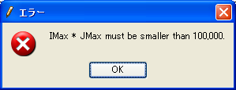

.. _gridgenerator_add_errorhandling:

エラー処理の記述
----------------

格子生成条件に問題があった場合のエラー処理を記述します。

エラー処理を追記したソースコードを :numref:`gridgenerator_with_error_handling`
に示します。太字で示したのが追記した部分です。追記した部分により、格子の格子点数が
100000 を超えるような imax, jmax
を指定した時は、エラーが発生するようにしました。

コンパイルしたら、 :ref:`gridgenerator_add_groudoutput`
の時と同様の手順で格子を生成し、imax x jmax が
100000より大きくなる条件の時には、 :numref:`gridgenerator_error_dialog`
に示すようなダイアログが表示されることを確認してください。例えば、 IMax,
JMax にそれぞれ 10000 を指定してみてください。

エラー処理に使う関数の詳細については :ref:`iriclib_output_error`
を参照してください。

.. code-block:: fortran
   :caption: エラー処理を追記したソースコード (抜粋)
   :name: gridgenerator_with_error_handling
   :linenos:
   :emphasize-lines: 10-16

   ! (前略)
   
     ! 格子生成条件の読み込み
     ! 簡潔に記述するため、エラー処理は行っていない
     call cg_iric_read_integer_f("imax", imax, ier)
     call cg_iric_read_integer_f("jmax", jmax, ier)
     call cg_iric_read_integer_f("elev_on", elev_on, ier)
     call cg_iric_read_real_f("elev_value", elev_value, ier)
   
     ! エラー処理
     if (imax * jmax > 100000 ) then
       ! 100000 より大きい格子は生成できない
       call cg_iric_write_errorcode(1, ier)
       cg_close_f(fin, ier)
       stop
     endif
   
     ! 格子生成用のメモリを確保
     allocate(grid_x(imax,jmax), grid_y(imax,jmax)
     allocate(elevation(imax,jmax))
   
   ! (後略)

.. _gridgenerator_error_dialog:

   格子生成エラーダイアログ 表示例

