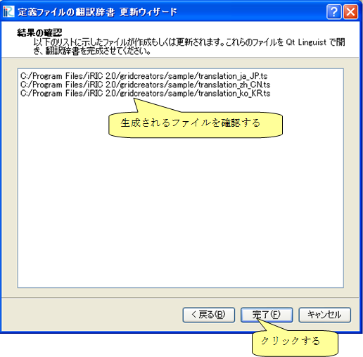

.. _how_to_setup_dictionary_gridgen:

Creating a grid generating program definition dictionary file
--------------------------------------------------------------

Create a grid generating program definition dictionary file that is used
to translate the strings used in grid generating program definition
files, and shown on dialogs etc.

First, launch iRIC and perform the following:

**Menu bar:** [Option] (O) --> [Create/Update Translation Files] (C)

The [Definition File Translation Update Wizard]
(:numref:`dict_wizard_intro_gridgen` to
:numref:`dict_wizard_confirm_gridgen`)
will open. Following the wizard, the dictionary files are created
or updated.

.. _dict_wizard_intro_gridgen:

.. figure:: images/dict_wizard_intro.png
   :width: 340pt

   The [Definition File Translation Update Wizard] (Page 1)

.. _dict_wizard_select_gridgenerator:

.. figure:: images/dict_wizard_select_gridgenerator.png
   :width: 340pt

   The [Definition File Translation Update Wizard] (Page 2)

.. _dict_wizard_confirm_gridgen:

   The [Definition File Translation Update Wizard] (Page 3)

The dictionary files are created in the folder that you created in
:ref:`create_gridgen_folder`.
The files created only include the strings before the
translation (i. e. English strings). The dictionary files are text
files, so you can use text editors to edit it. Save the dictionary files
with UTF-8 encoding.

:numref:`translation_dict_before_gridgen` and
:numref:`translation_dict_after_gridgen`
show the example of editing a dictionary file. As the
example shows, add translated string in \"translation\" element.

.. code-block:: xml
   :caption: The Dictionary file of grid generating program definition file (before editing)
   :name: translation_dict_before_gridgen
   :linenos:

   <message>
     <source>Sample Grid Creator</source>
     <translation></translation>
   </message>

.. code-block:: xml
   :caption: The Dictionary file of grid generating program definition file (after editing)
   :name: translation_dict_after_gridgen
   :linenos:
   :emphasize-lines: 3

   <message>
     <source>Sample Grid Creator</source>
     <translation>サンプル格子生成プログラム</translation>
   </message>

You can use [Qt Linguist] for translating the dictionary file. [Qt
Linguist] is bundled in Qt, and it provides GUI for editing the
dictionary file. :numref:`qt_linguist_screenshot_gridgen`
shows the [Qt Linguist]. Qt can be
downloaded from the following URL:

`https://www.qt.io/download/ <https://www.qt.io/download/>`_

.. _qt_linguist_screenshot_gridgen:

.. figure:: images/qt_linguist_screenshot.png
   :width: 480pt

   The [Qt Linguist]

When the translation is finished, switch the iRIC language from
Preferences dialog, restart iRIC, and check whether the translation is
complete. :numref:`gridgen_dialog_translated`
shows an example of [Grid Creation] dialog after
completing transtaion of dictionary.

.. _gridgen_dialog_translated:

   The [Grid Creation] dialog
