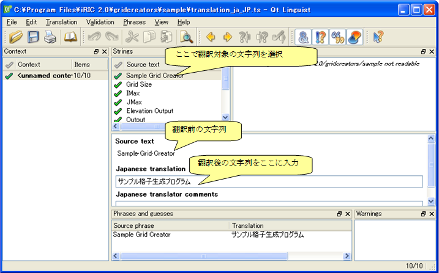

.. _how_to_setup_dictionary_gridgen:

格子生成プログラム定義ファイルの辞書ファイルの作成
--------------------------------------------------

格子生成プログラム定義ファイルで用いられている文字列のうち、
ダイアログ上に表示される文字列を翻訳して表示するための
辞書ファイルを作成します。

まず、iRIC から、以下のメニューを起動します。
すると、格子生成プログラム定義ファイルの辞書更新ウィザードが表示されます。
ダイアログの表示例を、:numref:`dict_wizard_intro_gridgen`
～ :numref:`dict_wizard_confirm_gridgen` に示します。

**メニュー:** オプション(O) --> 辞書ファイルの作成・更新(C)

.. _dict_wizard_intro_gridgen:

.. figure:: images/dict_wizard_intro.png
   :width: 340pt

   定義ファイルの翻訳辞書 更新ウィザード 表示例 (1ページ目)

.. _dict_wizard_select_gridgenerator:

   定義ファイルの翻訳辞書 更新ウィザード 表示例 (2ページ目)

.. _dict_wizard_confirm_gridgen:

.. figure:: images/dict_wizard_confirm.png
   :width: 340pt

   定義ファイルの翻訳辞書 更新ウィザード 表示例 (3ページ目)

辞書ファイルは、格子生成プログラムソルバー定義ファイルと
同じフォルダに作成されます。
作成された辞書ファイルは、翻訳前の英語のみが含まれています。
辞書ファイルはテキストファイルですので、
テキストエディタなどで開いて編集します。辞書ファイルは、
UTF-8 で保存してください。

辞書ファイルの編集例を、 :numref:`translation_dict_before_gridgen`、
:numref:`translation_dict_after_gridgen`
に示します。例に示したように、translation
要素の中に翻訳後の文字列を追記してください。

.. code-block:: xml
   :caption: 格子生成プログラム定義ファイルの辞書ファイルの一部 (編集前)
   :name: translation_dict_before_gridgen
   :linenos:

   <message>
     <source>Sample Grid Creator</source>
     <translation></translation>
   </message>

.. code-block:: xml
   :caption: 格子生成プログラム定義ファイルの辞書ファイルの一部 (編集後)
   :name: translation_dict_after_gridgen
   :linenos:
   :emphasize-lines: 3

   <message>
     <source>Sample Grid Creator</source>
     <translation>サンプル格子生成プログラム</translation>
   </message>

なお、辞書ファイルは、Qt に付属する Qt Linguist
を利用して編集することもできます。Qt Linguist の画面表示例を
:numref:`qt_linguist_screenshot_gridgen`
に示します。Qt Linguist は、以下の URL からダウンロードできる Qt
に含まれています。

`https://www.qt.io/download/ <https://www.qt.io/download/>`_

.. _qt_linguist_screenshot_gridgen:

   Qt Linguist 画面表示例

翻訳が完了したら、iRICを確認したい言語に切り替えてから iRIC
を起動し直し、正しく翻訳されて表示されるか確認します。
翻訳完了後の格子生成条件設定ダイアログの表示例を
:numref:`gridgen_dialog_translated` に示します。

.. _gridgen_dialog_translated:

.. figure:: images/gridgen_dialog_translated.png
   :width: 280pt

   翻訳完了後の格子生成条件設定ダイアログ 表示例
