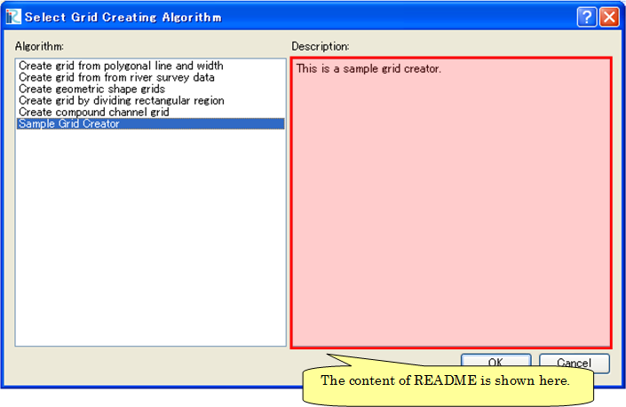

.. _how_to_setup_readme_gridgen:

説明ファイルの作成
------------------

格子生成プログラムの概要について説明するファイルを作成します。

README というファイル名のテキストファイルを、
:ref:`create_gridgen_folder` で作成したフォルダ
の下に作成します。文字コードは UTF-8 にします。

なお、説明ファイルは、以下の例のようなファイル名で言語ごとに用意します。
言語ごとの説明ファイルがない場合、 README が使用されます。

- 英語: README
- 日本語: README_ja_JP

\"README\_\" 以降につく文字列は、辞書ファイルの \"translation\_\*\*\*\*\*.ts\" の
\"\*\*\*\*\*\" の部分と同じですので、日本語以外の説明ファイルを作る際のファイル名は、
辞書ファイルのファイル名を参考にして決めて下さい。

説明ファイルの内容は、格子生成アルゴリズム選択ダイアログで、
説明欄に表示されます。ファイルを作成したら、
iRIC 上で正しく表示されるか確認して下さい。ダイアログの表示例を、
:numref:`screenshot_for_readme_gridgen` に示します。

.. _screenshot_for_readme_gridgen:

   格子生成アルゴリズム選択ダイアログ 表示例
