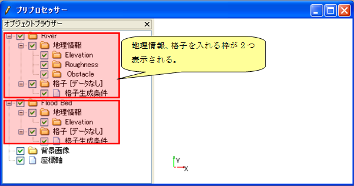

.. _def_structure:

構造
====

ソルバー定義ファイル、格子生成プログラム定義ファイルの構造を示します。

ソルバー定義ファイル
--------------------

計算格子を1つ利用するソルバーでのソルバー定義ファイルの構造を
:numref:`def_structure_solverdef` に、
複数利用するソルバーでのソルバー定義ファイルの構造を
:numref:`def_structure_solverdef_multigridtype`
にそれぞれ示します。

.. _def_structure_solverdef:

.. figure:: images/solverdef_structure_basic.png
   :width: 340pt

   ソルバー定義ファイルの構造

.. _def_structure_solverdef_multigridtype:

   複数の格子を利用するソルバーのソルバー定義ファイルの構造

複数の格子を利用するソルバーの場合、ソルバー定義ファイルでは GridType
要素を使って、それぞれの格子の構造、格子属性、境界条件を定義します。

複数の格子を利用するソルバーのソルバー定義ファイルの例を、
:numref:`solverdef_example_multigrid`
に示します。この例では、境界条件は省略されています。
以下の点が、1つの格子を利用する場合と異なっていることに注意して下さい。

- 格子の構造 (gridtype 属性) は、SolverDefinition 要素でなく、 GridType
  要素で定義されている。

:numref:`solverdef_example_multigrid` に示した
ソルバー定義ファイルのソルバーを選択して iRIC
で新しいプロジェクトを開始した場合、 :numref:`preprocessor_multigridtypes`
に示すようなプリプロセッサが表示されます。

.. code-block:: xml
   :caption: 複数の格子を使用するソルバーのソルバー定義ファイルの例
   :name: solverdef_example_multigrid
   :linenos:

   <?xml version="1.0" encoding="UTF-8"?>
   <SolverDefinition
     name="multigridsolver"
     caption="Multi Grid Solver"
     version="1.0"
     copyright="Example Company"
     release="2012.04.01"
     homepage="http://example.com/"
     executable="solver.exe"
     iterationtype="time"
   >
     <CalculationCondition>
       <!-- ここで、計算条件を定義。-->
     </CalculationCondition>
     <GridTypes>
       <GridType name="river" caption="River">
         <GridRelatedCondition>
           <Item name="Elevation" caption="Elevation">
             <Definition valueType="real" position="node" />
           </Item>
           <Item name="Roughness" caption="Roughness">
             <Definition valueType="real" position="node"/>
           </Item>
           <Item name="Obstacle" caption=" Obstacle">
             <Definition valueType="integer" position="cell"/>
           </Item>
         </GridRelatedCondition>
       </GridType>
       <GridType name="floodbed" caption="Flood Bed">
         <GridRelatedCondition>
           <Item name="Elevation" caption="Elevation">
             <Definition valueType="real" position="node" />
           </Item>
         </GridRelatedCondition>
       </GridType>
     </GridTypes>
   </SolverDefinition>

.. _preprocessor_multigridtypes:

   複数の格子を定義したソルバ定義ファイルを読み込んだ場合のプリプロセッサ 表示例

格子生成プログラム定義ファイル
------------------------------

格子生成プログラム定義ファイルの構造を、 :numref:`gridgen_structure`
に示します。

.. _gridgen_structure:

.. figure:: images/gridgen_structure.png
   :width: 380pt

   格子生成プログラム定義ファイルの構造
