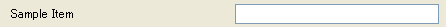

String
-------

.. code-block:: xml
   :caption: Example of a string type condition definition
   :name: widget_example_string_def
   :linenos:

   <Item name="sampleitem" caption="Sample Item">
     <Definition valueType="string" />
   </Item>

.. _widget_example_string:

   Widget example of a string type condition

.. code-block:: fortran
   :caption: Code example to load a string type condition (for calculation conditions and grid generating conditions)
   :name: widget_example_string_load_calccond
   :linenos:

   integer:: ier
   character(200):: sampleitem

   call cg_iric_read_string_f("sampleitem", sampleitem, ier)

.. code-block:: fortran
   :caption: Code example to load a string type condition (for boundary conditions)
   :name: widget_example_string_load_bcond
   :linenos:

   integer:: ier
   character(200):: sampleitem

   call cg_iric_read_bc_string_f("inflow", 1, "sampleitem", sampleitem, ier)
