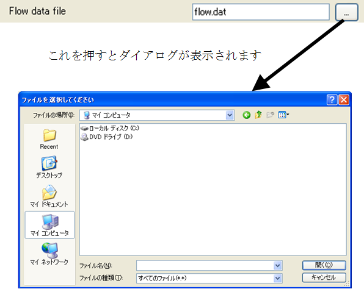

File name (for reading)
------------------------

.. code-block:: xml
   :caption: Example of a file name type (for reading) condition definition
   :name: widget_example_filename_load_def
   :linenos:

   <Item name="flowdatafile" caption="Flow data file">
     <Definition valueType="filename" default="flow.dat" />
   </Item>

.. _widget_example_filename_load:

   Widget example of a file name (for reading) type condition

.. code-block:: fortran
   :caption: Code example to load a file name (for reading) type condition (for calculation conditions and grid generating conditions)
   :name: widget_example_filename_read_load_calccond
   :linenos:

   integer:: ier
   character(200):: flowdatafile

   call cg_iric_read_string_f("flowdatafile", flowdatafile, ier)

.. code-block:: fortran
   :caption: Code example to load a file name (for reading) type condition (for boundary conditions)
   :name: widget_example_filename_read_load_bcond
   :linenos:

   integer:: ier
   character(200):: flowdatafile

   call cg_iric_read_bc_string_f("inflow", 1, "flowdatafile", flowdatafile, ier)
