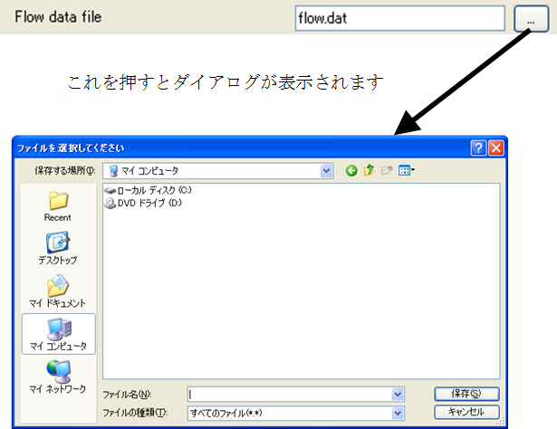

ファイル名 (書き込み用)
------------------------

.. code-block:: xml
   :caption: ファイル名 (書き込み用) の条件の定義例
   :name: widget_example_filename_save_def
   :linenos:

   <Item name="flowdatafile" caption="Flow data file">
     <Definition valueType="filename_all" default="flow.dat" />
   </Item>

.. _widget_example_filename_save:

   ファイル名 (書き込み用) の条件の表示例

.. code-block:: fortran
   :caption: ファイル名 (書き込み用)の条件を読み込むための処理の記述例 (計算条件・格子生成条件)
   :name: widget_example_filename_save_load_calccond
   :linenos:

   integer:: ier
   character(200):: flowdatafile

   call cg_iric_read_string_f("flowdatafile", flowdatafile, ier)

.. code-block:: fortran
   :caption: ファイル名 (書き込み用) の条件を読み込むための処理の記述例 (境界条件)
   :name: widget_example_filename_save_load_bcond
   :linenos:

   integer:: ier
   character(200):: flowdatafile

   call cg_iric_read_bc_string_f("inflow", 1, "flowdatafile", flowdatafile, ier)
