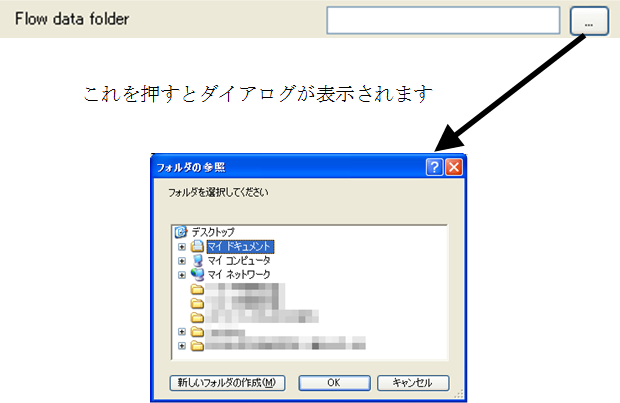

Folder name
-----------

.. code-block:: xml
   :caption: Example of a folder name type condition definition
   :name: widget_example_foldername_def
   :linenos:

   <Item name="flowdatafolder" caption="Flow data folder">
     <Definition valueType="foldername" />
   </Item>

.. _widget_example_folder:

   Widget example of a folder name type condition

.. code-block:: fortran
   :caption: Code example to load a folder name type condition (for calculation conditions and grid generating conditions)
   :name: widget_example_foldername_load_calccond
   :linenos:

   integer:: ier
   character(200):: flowdatafolder

   call cg_iric_read_string_f("flowdatafolder", flowdatafolder, ier)

.. code-block:: fortran
   :caption: Code example to load a folder name type condition (for boundary conditions)
   :name: widget_example_foldername_load_bcond
   :linenos:

   integer:: ier
   character(200):: flowdatafolder

   call cg_iric_read_bc_string_f("inflow", 1, "flowdatafolder", flowdatafolder, ier)

