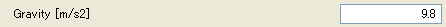

実数
-----

.. code-block:: xml
   :caption: 実数の条件の定義例
   :name: widget_example_real_def
   :linenos:

   <Item name="g" caption="Gravity [m/s2]">
     <Definition valueType="real" default="9.8" />
   </Item>

.. _widget_example_real_select:

   実数の条件の表示例

.. code-block:: fortran
   :caption: 実数の条件を読み込むための処理の記述例 (計算条件・格子生成条件)
   :name: widget_example_real_load_calccond
   :linenos:

   integer:: ier
   double precision:: g

   call cg_iric_read_real_f("g", g, ier)

.. code-block:: fortran
   :caption: 実数の条件を読み込むための処理の記述例 (境界条件)
   :name: widget_example_real_load_bcond
   :linenos:

   integer:: ier
   double precision:: g

   call cg_iric_read_bc_real_f("inflow", 1, "g", g, ier)
