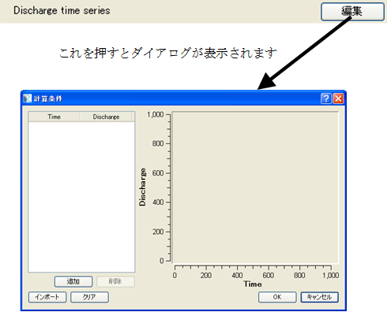

関数型
------

.. code-block:: xml
   :caption: 関数型の条件の定義例
   :name: widget_example_func_def
   :linenos:

   <Item name="discharge" caption="Discharge time series">
     <Definition valueType="functional" >
       <Parameter valueType="real" caption="Time" />
       <Value valueType="real" caption="Discharge" />
     </Definition>
   </Item>

.. _widget_example_func:

   関数型の条件の表示例

.. code-block:: fortran
   :caption: 関数型の条件を読み込むための処理の記述例 (計算条件・格子生成条件)
   :name: widget_example_func_load_calccond
   :linenos:

   integer:: ier, discharge_size
   double precision, dimension(:), allocatable:: discharge_time, discharge_value

   ! サイズを調べる
   call cg_iric_read_functionalsize_f("discharge", discharge_size, ier)
   ! メモリを確保
   allocate(discharge_time(discharge_size))
   allocate(discharge_value(discharge_size))
   ! 確保したメモリに値を読み込む
   call cg_iric_read_functional_f("discharge", discharge_time, discharge_value, ier)

.. code-block:: fortran
   :caption: 関数型の条件を読み込むための処理の記述例 (境界条件)
   :name: widget_example_func_load_bcond
   :linenos:

   integer:: ier, discharge_size
   double precision, dimension(:), allocatable:: discharge_time, discharge_value

   ! サイズを調べる
   call cg_iric_read_bc_functionalsize_f("inflow", 1, "discharge", discharge_size, ier)
   ! メモリを確保
   allocate(discharge_time(discharge_size))
   allocate(discharge_value(discharge_size))
   ! 確保したメモリに値を読み込む
   call cg_iric_read_bc_functional_f("inflow", 1, "discharge", discharge_time, discharge_value, ier)
