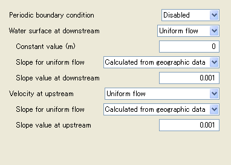

Simple layout
--------------

Simple layout (that only uses Item elements) example definition is shown
in :numref:`layout_example_basic_code`, and the corresponding
dialog is shown in :numref:`layout_example_basic_image`.

.. code-block:: xml
   :caption: Simple layout definition example
   :name: layout_example_basic_code
   :linenos:

   <Tab name="simple" caption="Simple">
     <Item name="jrep" caption="Periodic boundary condition">
       <Definition valueType="integer" default="0">
         <Enumeration value="0" caption="Disabled"/>
         <Enumeration value="1" caption="Enabled"/>
       </Definition>
     </Item>
     <Item name="j_wl" caption="Water surface at downstream">
       <Definition valueType="integer" default="1">
         <Enumeration value="0" caption="Constant value"/>
         <Enumeration value="1" caption="Uniform flow"/>
         <Enumeration value="2" caption="Read from file"/>
       </Definition>
     </Item>
     <Item name="h_down" caption="   Constant value (m)">
       <Definition valueType="real" default="0" />
     </Item>
     <Item name="j_slope" caption="   Slope for uniform flow">
       <Definition valueType="integer" default="0">
         <Enumeration value="0" caption="Calculated from geographic data"/>
         <Enumeration value="1" caption="Constant value"/>
       </Definition>
     </Item>
     <Item name="bh_slope" caption="   Slope value at downstream">
       <Definition valueType="real" default="0.001">
       </Definition>
     </Item>
     <Item name="j_upv" caption="Velocity at upstream">
       <Definition valueType="integer" default="1">
         <Enumeration value="1" caption="Uniform flow"/>
         <Enumeration value="2" caption="Calculated from upstream depth"/>
       </Definition>
     </Item>
     <Item name="j_upv_slope" caption="   Slope for uniform flow">
       <Definition valueType="integer" default="0">
         <Enumeration value="0" caption="Calculated from geographic data"/>
         <Enumeration value="1" caption="Constant value"/>
       </Definition>
     </Item>
     <Item name="upv_slope" caption="   Slope value at upstream">
       <Definition valueType="real" default="0.001">
       </Definition>
     </Item>
   </Tab>

.. _layout_example_basic_image:

   Dialog for simple layout definition example
