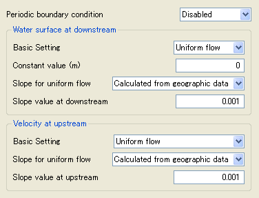

.. _layout_groupbox_example:

Layout that uses Group boxes
-----------------------------

Layout example that uses group boxes is shown in
:numref:`layout_example_groupbox_code`, and the corresponsing dialog
is shown in :numref:`layout_example_groupbox_image`.

GroupBox elements can be used to define groups of items.

.. code-block:: xml
   :caption: Layout definition example that uses group boxes
   :name: layout_example_groupbox_code
   :linenos:

   <Tab name="grouping" caption="Group">
     <Item name="g_jrep" caption="Periodic boundary condition">
       <Definition valueType="integer" default="0">
         <Enumeration value="0" caption="Disabled"/>
         <Enumeration value="1" caption="Enabled"/>
       </Definition>
     </Item>
     <GroupBox caption="Water surface at downstream">
       <Item name="g_j_wl" caption="Basic Setting">
         <Definition valueType="integer" default="1">
           <Enumeration value="0" caption="Constant value"/>
           <Enumeration value="1" caption="Uniform flow"/>
           <Enumeration value="2" caption="Read from file"/>
         </Definition>
       </Item>
       <Item name="g_h_down" caption="Constant value (m)">
         <Definition valueType="real" default="0" />
       </Item>
       <Item name="g_j_slope" caption="Slope for uniform flow">
         <Definition valueType="integer" default="0">
           <Enumeration value="0" caption="Calculated from geographic data"/>
           <Enumeration value="1" caption="Constant value"/>
         </Definition>
       </Item>
       <Item name="g_bh_slope" caption="Slope value at downstream">
         <Definition valueType="real" default="0.001">
         </Definition>
       </Item>
     </GroupBox>
     <GroupBox caption="Velocity at upstream">
       <Item name="g_j_upv" caption="Basic Setting">
         <Definition valueType="integer" default="1">
           <Enumeration value="1" caption="Uniform flow"/>
           <Enumeration value="2" caption="Calculated from upstream depth"/>
         </Definition>
       </Item>
       <Item name="g_j_upv_slope" caption="Slope for uniform flow">
         <Definition valueType="integer" default="0">
           <Enumeration value="0" caption="Calculated from geographic data"/>
           <Enumeration value="1" caption="Constant value"/>
         </Definition>
       </Item>
       <Item name="g_upv_slope" caption="Slope value at upstream">
         <Definition valueType="real" default="0.001">
         </Definition>
       </Item>
     </GroupBox>
   </Tab>

.. _layout_example_groupbox_image:

   Dialog for layout definition example that uses group boxes
   