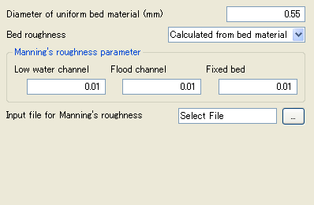

.. _free_layout_example:

自由なレイアウト
-----------------------------

GridLayout要素を利用することで、自由なレイアウトを実現した例を
:numref:`layout_example_complex_code` に、ダイアログでの表示例を
:numref:`layout_example_complex_image` にそれぞれ示します。

GridLayout (表形式のレイアウト), HBoxLayout (水平に並べるレイアウト),
VBoxLayout(垂直に並べるレイアウト) を使うことで、自由に要素を配置できます。
また、これらのレイアウトの中では Item では caption 属性は指定せず、
Label 要素でラベルを表示します。

GridLayout, HBoxLayout, VBoxLayout は入れ子にできます。
また、その中で GroupBox を利用することもできます。

.. code-block:: xml
   :caption: 自由なレイアウトの定義例
   :name: layout_example_complex_code
   :linenos:

   <Tab name="roughness" caption="Roughness">
     <Item name="diam" caption="Diameter of uniform bed material (mm)">
       <Definition valueType="real" default="0.55" />
     </Item>
     <Item name="j_drg" caption="Bed roughness">
       <Definition valueType="integer" default="0">
         <Enumeration value="0" caption="Calculated from bed material"/>
         <Enumeration value="1" caption="Constant value"/>
         <Enumeration value="2" caption="Read from file"/>
       </Definition>
     </Item>
     <GroupBox caption="Manning's roughness parameter">
       <GridLayout>
         <Label row="0" col="0" caption="Low water channel" />
         <Item row="1" col="0" name="sn_l">
           <Definition valueType="real" default="0.01" />
         </Item>
         <Label row="0" col="1" caption="Flood channel" />
         <Item row="1" col="1" name="sn_h">
           <Definition valueType="real" default="0.01" />
         </Item>
         <Label row="0" col="2" caption="Fixed bed" />
         <Item row="1" col="2" name="sn_f">
           <Definition valueType="real" default="0.01" />
         </Item>
       </GridLayout>
     </GroupBox>
     <Item name="snfile" caption="Input file for Manning's roughness">
       <Definition valueType="filename" default="Select File" />
     </Item>
   </Tab>

.. _layout_example_complex_image:

   自由なレイアウトのを利用したレイアウトのダイアログの表示例
