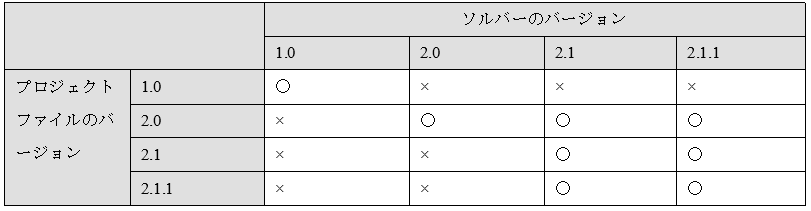

.. _notice_about_version:

Notes on solver version up
===============================

When you update the solver you developed, you have to modify not only solver source code
but also solver definition file. When you modify solver definition files
you have to note the followings:

* You **must not** edit \"name\" attribute of SolverDefinition element. 
  When the \"name\" attribute is changed, iRIC regard the solver as a
  completely different solver from the older version, and any project files that are
  created for the older version become impossible to open with the new solver.
* You **should** modify the \"caption\" attribute of SolverDefinition element. \"caption\"
  element is an arbitrary string that is used to display the solver name and version
  information, so you should input \"Sample Solver 1.0\",
  \"Sample Solver 3.2 beta\", \"Sample Solver 3.0 RC1\" as caption value for example.
  The caption value can be set independent from \"version\" attribute.
* You **must** modify the \"version\" attribute following the policy in
  :numref:`versionup_cond`.

Version number consists of several numbers joined with \".\". The numbers are called
\"Major number\", \"Minor number\", and \"Fix number\" for each.
Fix number can be omitted.

.. _versionup_cond:

.. csv-table:: Elements of version number to increment
   :file: versionup_cond.csv
   :header-rows: 1

In iRIC, project files compatibility is like the following:

* Project files with different major number are not compatible.
* Project files with same major number and smaller minor number are compatible.
* Project files with same major number, same minor number and different fix number are compatible.

:numref:`version_compatibility` shows the examples of compatibility with
different solver version numbers.

.. _version_compatibility:

   Examples of compatibility of project files with various version numbers

The basic policy is shown in :numref:`versionup_cond`, but in the last,
solver developers should judge which number to increment,
taking account of compatibility.

When you deploy multiple versions of a same solver in one environment,
create multiple folders under \"solvers\" folder with different names,
and deploy files related to each version under them.
Folder names can be selected independent of solver names.
