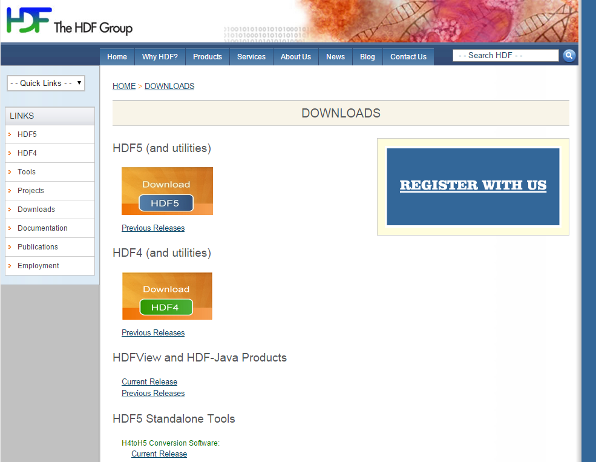
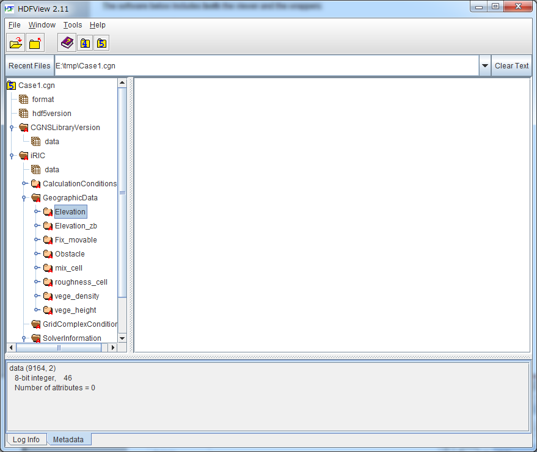

.. _about_cgns:

Information on CGNS file and CGNS library
=============================================

General concept of CGNS file format
-----------------------------------------

CGNS, which stands for CFG General Notation System, refers to a
general-purpose file format for storing data for use in numeric hydrodynamics.
It can be used across various platforms of different OSes and CPUs.
In addition to its standard data format being defined for use in numeric hydrodynamics,
it has expandability that allows the addition of elements specific to each solver.

An input/output library for CGNS, called cgnslib, is provided.
It can be used in the following languages.

* C, C++
* FORTRAN
* Python

Originally developed by the Boeing Company and NASA, it is currently
maintained by an open-source community.

How to view a CGNS file
---------------------------

This section describes how to view a CGNS file that has been created
by iRIC using HDFView. HDFView is a software tool published as free software.

Installing HDFView
~~~~~~~~~~~~~~~~~~~~~~~

First, install HDFView. The installer of HDFView can be downloaded from

https://www.hdfgroup.org/downloads/index.html

.. _hdfview_webpage:

   HDF group web page

From the HDF web page, click the \"Current Release\" link in :numref:`hdfview_webpage`.
You will be taken to download page. On this screen, click on the file that
fits your environment (64 bit or 32 bit) to download.

by unzipping and running the installer, you can install HDFView.

.. _hdfview_download_page:

.. figure:: images/hdf_downloadpage.png
   :width: 440pt

   Download page

Viewing a CGNS file using HDFView
~~~~~~~~~~~~~~~~~~~~~~~~~~~~~~~~~~~~~

Launch HDFView and view a CGNS file.

To do so, first launch HDFView from the start menu. 
Then, from the following menu, select the CGNS to open.

File --> Open

Please note that \"\\*.cgn\" is not included in the open target in default.
Switch file type to \"all files\" to select CGNS file as open target.

An example of the HDFView screen after opening a CGNS file is shown
in :numref:`hdfview_example`.
 
.. _hdfview_example:

   Example of ADFviewer screen

In the left side of the screen, the tree structure of the CGNS file
contents is shown. When you double click on the item in the tree
structure, The data contained in that node is displayed in the main region.

Reference URLs
----------------

For information on CGNS files and CGNS libraries, refer to the URLs
in :numref:`cgns_links` .

.. _cgns_links:

.. list-table:: Reference URLs for CGNS file format CGNS libraries
   :header-rows: 1

   * - Item
     - URL
   * - Homepage
     - http://cgns.sourceforge.net/
   * - Function reference
     - http://cgns.github.io/CGNS_docs_current/midlevel/index.html
   * - Data structure inside a CGNS file
     - http://cgns.github.io/CGNS_docs_current/sids/index.html
   * - Sample programs
     - http://cgns.github.io/CGNS_docs_current/user/examples.html
