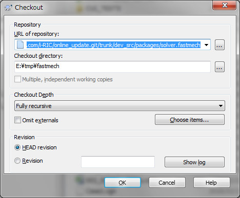
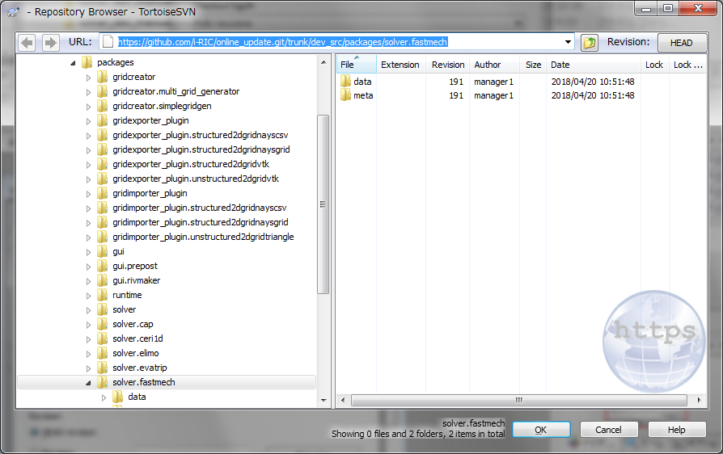
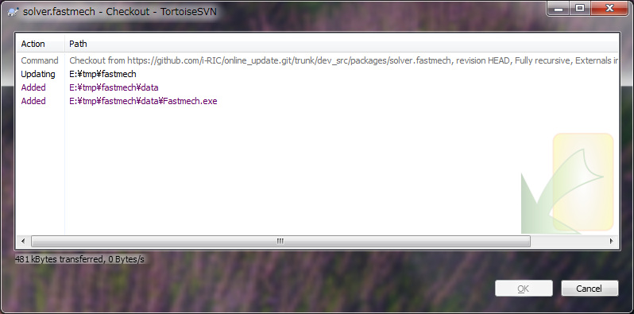
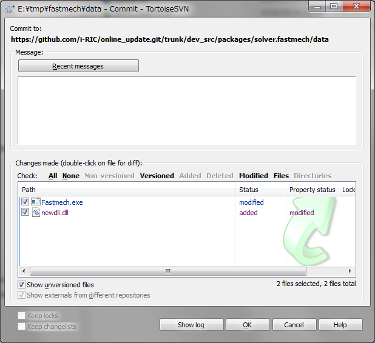
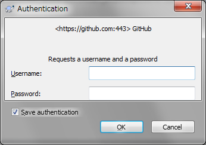

iRIC インストーラ作成用リポジトリへの登録
============================================

はじめに
----------

iRIC は、インストーラの作成及びオンラインアップデートのために公開するファイルの管理を、
github というウェブサービスを利用して行っています。

ソルバ開発者は、 github に最新のソルバのファイルを登録することで、以下を行なうことが
できます。

* 次回インストーラが作成される際に同梱されるソルバを更新します

* 既に iRIC をインストールしているユーザが、 オプション -> メンテナンス 機能から、
  ソルバの更新版をオンラインアップデートで入手するできるようにします

この節では、ソルバ開発者が github に最新のソルバを登録する手順を説明します。

作業の流れ
------------

github に最新のソルバを登録するには、以下の流れで作業を行います。

1. Subversion のクライアントのインストール (初回のみ)
2. サーバからのフォルダの取得 (チェックアウト)
3. 新しいファイルのコピー
4. 新しいファイルのサーバへの登録 (コミット)

github へのファイルの登録は、 Subversion と git の２つのバージョン管理システム
を使って行なうことができますが、ここでは操作の簡単な Subversion を
利用した場合の手順をご説明します。

以下で、詳しい手順を説明します。

Subversion のクライアントのインストール (初回のみ)
--------------------------------------------------

インストール
~~~~~~~~~~~~~~

Subversion に関連した操作を行うためのクライアントをインストールします。
この手順では、Windows 用の Subversion クライアントである TortoiseSVN をインストールします。

以下の URL にアクセスし、 TortoiseSVN のインストーラを入手します。

https://tortoisesvn.net/downloads.html

画面上には、 32bit版 OS用と 64bit版 OS用の2つのダウンロード用ボタンがあります。お使いの環境
に合わせて適切なインストーラをダウンロードして下さい。

日本語でお使いになりたい場合は、画面の少し下にある Language packs を追加でインストールすること
で、メニューが日本語になります。\"Japanese\" という行の \"Setup\" リンクをクリックして
ダウンロードしてください。

インストーラがダウンロードできたら、まずは TortoiseSVN 本体、その後 Language pack の順番で
インストールして下さい。

インストールが完了したら、一度 Windows を再起動します。

環境設定
~~~~~~~~~

インターネットに接続するのに、プロキシサーバを経由する必要がある環境では、
設定を行います。

エクスプローラで右クリックメニューから以下を選択します。

TortoiseSVN --> 設定

すると、設定ダイアログが表示されます。左側のツリービューで「ネットワーク」を選択すると、
:numref:`image_svn_setting_dialog` に示すような画面が表示されますので、お使いの環境
に合わせた設定を行い、「OK」ボタンを押します。

.. _image_svn_setting_dialog:

   TortoiseSVN 設定ダイアログ

サーバからのフォルダの取得 (チェックアウト)
---------------------------------------------

https://github.com/i-RIC/online_update.git/trunk/dev_src/packages
以下のフォルダのうち、更新したいソルバが含まれているフォルダをチェックアウトします。

例えば、 FaSTMECH なら以下のフォルダをチェックアウトします。

https://github.com/i-RIC/online_update.git/trunk/dev_src/packages/solver.fastmech

以下では、 FaSTMECH のフォルダを取得する際の例を示します。

フォルダの作成
~~~~~~~~~~~~~~~

サーバから取得したファイルを保存するためのフォルダを作成します。

この例では、e:\tmp\fastmech にフォルダを作成します。

サーバからのフォルダの取得
~~~~~~~~~~~~~~~~~~~~~~~~~~~~~

TortoiseSVN を利用して、サーバからフォルダを取得します。

上記で作成したフォルダをエクスプローラで選択し、右クリックメニューから以下を選択します。

SVN チェックアウト

すると、 :numref:`image_svn_checkout_dialog1` に示すダイアログが表示されます。

.. _image_svn_checkout_dialog1:

   ファイルのチェックアウト用ダイアログ

「リポジトリのURL」欄に、以下の URL を入力します。

https://github.com/i-RIC/online_update.git/trunk/dev_src/packages

その後、その右にある「...」ボタンを押します。すると、
:numref:`image_svn_checkout_dialog2` に示すダイアログが表示されます。

.. _image_svn_checkout_dialog2:

   ファイルのチェックアウト用ダイアログ (フォルダの選択)

このダイアログで、自分が更新したいソルバが含まれているフォルダ
(今回の例なら \"solver.fastmech\") を選択し、「OK」ボタンを押します。
すると、「リポジトリのURL」 が更新されます。

:numref:`image_svn_checkout_dialog1` に示すダイアログで、
「リポジトリのURL」「チェックアウト先のディレクトリ」が正しく設定されている
ことを確認したら、「OK」ボタンを押します。すると、
:numref:`image_svn_checkout_progress_dialog` に示すようなダイアログが
表示され、フォルダ内のファイルの取得が始まります。

.. _image_svn_checkout_progress_dialog:

   ファイルの取得進捗ダイアログ

ファイルの取得が完了すると、エクスプローラでは
:numref:`image_svn_explorer_example1` に示すように表示されます。
チェックアウトされたファイルの横には、チェックマークのついたアイコンが表示されます。

.. _image_svn_explorer_example1:

.. figure:: images/svn_explorer_example1.png

   ファイルのチェックアウト後のエクスプローラ表示例

新しいファイルのコピー
------------------------

チェックアウトしたフォルダに、インストーラに同梱したいファイルをコピーします。
ファイルをコピーすると、ファイルの横のアイコンが以下のようになります。

* 上書きされたファイルの横には、「!」マークのついたアイコンが表示されます
* 新しくコピーされたファイルの横には、アイコンにマークが表示されません

新しくコピーされたファイルをサーバに送信するには、ファイルを右クリックして、
右クリックメニューから以下を選択します。

TortoiseSVN --> 追加

追加を行うと、ファイルの横に「+」マークが表示されます。

\"Fastmech.exe\" を上書きし、 \"newdll.dll\" を追加した後のエクスプローラの表示例を
:numref:`image_svn_explorer_example2` に示します。

.. _image_svn_explorer_example2:

   新しいファイルをコピーした後のエクスプローラ表示例

**ご注意**

ソルバの更新をする時は、ソルバの実行ファイルなどを更新するだけでなく、 
`definition.xml` に記述されたバージョン番号も更新してください。
これは、バージョン番号が変わっていないと、 iRIC メンテナンスが
ファイルが更新されていることを認識できないためです。

バージョン番号は `definition.xml` の `SolverDefinition` 要素で、 `version` という
名前の属性で指定されています。

新しいファイルのサーバへの登録 (コミット)
-----------------------------------------

新しいファイルを、サーバへ登録します。

上記でファイルを登録したフォルダをエクスプローラで選択し、右クリックメニューから
以下を選択します。

SVN コミット

すると、:numref:`image_svn_commit_dialog` に示すダイアログが表示されます。

.. _image_svn_commit_dialog:

   新しいファイルのコミット用ダイアログ

更新したいファイルが全てチェックされていることを確認したら、更新に関する
ログを追記して、「OK」ボタンを押します。

:numref:`image_svn_auth_dialog` が表示されますので、ユーザ名とパスワードを入力して、
「OK」ボタンを押します。

.. _image_svn_auth_dialog:

   認証ダイアログ

ソルバの登録に使用する ユーザ名とパスワードについては、 iRIC の管理者にお問い合わせ下さい。
